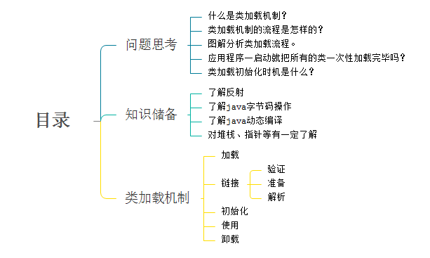
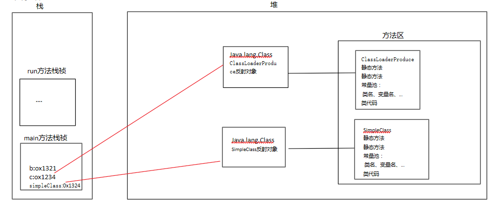
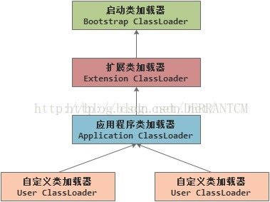
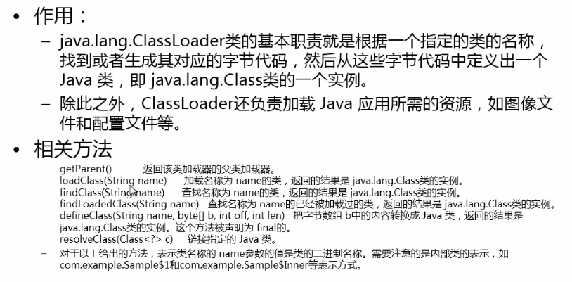
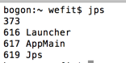
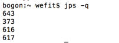
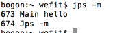
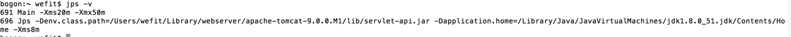

## java虚拟机见解  ##
1. JVM 的概念

&emsp; **JVM 使用软件模拟Java字符码的指令集。** ( VMWare 或Visual Box 使用软件模拟物理（真实存在的）CPU的指令集 )
	
2. JVM 发展史

    1996年 SUN JDK 1.0 Classic VM

        -- 纯解释运行，使用外挂进行JIT

	1997年 JDK1.1 发布

		-- AWT、内部类、JDBC、RMI、反射

	1998年 JDK1.2 Solaris Exact VM

		-- JIT 解释器混合 	

		-- Accurate Memory Management 精确内存管理，数据类型敏感 

		-- 提升的GC性能

			（备注： JDK1.2开始 称为Java 2
					J2SE J2EE J2ME 的出现
					加入Swing Collections )

	2000年 JDK 1.3 Hotspot 作为默认虚拟机发布 （ 加入JavaSound ）

	2002年 JDK 1.4 Classic VM退出历史舞台 （ Assert 正则表达式  NIO  IPV6 日志API  加密类库）

	2004年发布 JDK1.5 即 JDK5 、J2SE 5 、Java 5 

		-- 泛型

		-- 注解

		-- 装箱

		-- 枚举

		-- 可变长的参数

		-- Foreach循环

	JDK1.6 JDK6

		-- 脚本语言支持

		-- JDBC 4.0

		-- Java编译器 API

	2011年 JDK7发布

		-- 延误项目推出到JDK8

		-- G1

		-- 动态语言增强

		-- 64位系统中的压缩指针

		-- NIO 2.0

	2014年 JDK8发布

		-- Lambda表达式

		-- 语法增强  Java类型注解

	2016年JDK9

		--模块化

3. JVM 种类
4. JAVA 语言规范
5. JVM 规范

### package-info.java的作用

package-info不是平常类，其作用有三个:

- 1、为标注在包上Annotation提供便利；   
- 2、声明包的私有类和常量；   
- 3、提供包的整体注释说明。

pacakge-info.java是一个Java文件，可以添加到任何的Java源码包中。pacakge-info.java的目标是提供一个包级的文档说明或者是包级的注释。

**package-info类为包服务**

Java中有一个特殊的类：package-info类，它是专门为本包服务的，为什么说它特殊呢？主要体现在3个方面：

（1）它不能随便被创建

（2）它服务的对象很特殊

（3）package-info类不能有实现代码

**主要作用表现：**

（1）声明友好类和包内访问常量

（2）为在包上标注注解提供便利

（3）提供包的整体注释说明

## JVM加载机顺序

> 什么是类加载机制？  
       
&emsp;&emsp; JVM把class文件加载到内存里面，并对数据进行校验、准备、解析和初始化，最终能够被形成被JVM可以直接使用的Java类型的过程。

> 类加载流程图

> 加载

	1、将class文件加载在内存中。
	2、将静态数据结构(数据存在于class文件的结构)转化成方法区中运行时的数据结构(数据存在于JVM时的数据结构)。
	3、在堆中生成一个代表这个类的java.lang.Class对象，作为数据访问的入口。

> 链接

 &emsp;&emsp; 链接就是将Java类的二进制代码合并到java的运行状态中的过程。

	 - 验证:确保加载的类符合JVM规范与安全。
	 - 准备:为static变量在方法区中分配空间，设置变量的初始值。例如static int a=3，在此阶段会a被初始化为0，其他数据类型参考成员变量声明。
	 - 解析:虚拟机将常量池的符号引用转变成直接引用。例如"aaa"为常量池的一个值，直接把"aaa"替换成存在于内存中的地址。
		- 符号引用:符号引用以一组符号来描述所引用的目标，符号可以是任何形式的字面量，只要使用时能无歧义地定位到目标即可。符号引用与虚拟机实现的内存布局无关，引用 的目标并不一定已经加载到内存中。
		- 直接引用:直接引用可以是直接指向目标的指针、相对偏移量或是一个能间接定位到目标的句柄。直接引用是与虚拟机实现的内存布局相关的，如果有了直接引用，那么引用的目标必定已经在内存中存在。

>初始化

 &emsp;&emsp;初始化阶段是执行类构造器`<clinit>()`方法。在类构造器方法中，它将由编译器自动收集类中的所有类变量的赋值动作(准备阶段的a正是被赋值a)和静态变量与静态语句块`static{}`合并(类构造器`<client>( )`方法是由编译器自动收集类中的所有类变量的赋值动作和静态语句块static中的语句合并产生的)，初始化时机后续再聊。

> 使用

　　正常使用。

7、卸载

&emsp;&emsp; GC把无用对象从内存中卸载。

### 类加载与初始化时机

1、类加载时机

&emsp;&emsp;当应用程序启动的时候，所有的类会被一次性加载吗？估计你早已知道答案，当然不能，因为如果一次性加载，内存资源有限，可能会影响应用程序的正常运行。那类什么时候被加载呢？例如，A a=new A()，一个类真正被加载的时机是在创建对象的时候，才会去执行以上过程，加载类。当我们测试的时候，最先加载拥有main方法的主线程所在类。

2、类初始化时机

　主动引用(发生类初始化过程)

	1、 new一个对象。
	2、调用类的静态成员(除了final常量)和静态方法。
	3、通过反射对类进行调用。
	4、虚拟机启动，main方法所在类被提前初始化。
	5、初始化一个类，如果其弗雷没有初始化，则先初始化父类。

　被动引用(不会发生类的初始化)

	1、当访问一个静态变量时，只有真正声明这个变量的类才会初始化。(子类调用父类的静态变量，只有父类初始化，子类不初始化)。
	2、通过数组定义类引用，不会触发此类的初始化。
	3、final变量不会触发此类的初始化，因为在编译阶段就存储在常量池中。

### 图解分析类加载

	
		public class ClassLoaderProduce {
		    static int d=3;
		    static{
		        System.out.println("我是ClassLoaderProduce类");
		    }
		    public static void main(String [] args){
		        int b=0;
		        String c="hello";
		        SimpleClass simpleClass=new SimpleClass();
		        simpleClass.run();
		    }
		}
		
		class SimpleClass{
		    static int  a=3;
		    static{
		        a=100;
		        System.out.println(a);
		    }
		
		    public SimpleClass(){
		        System.out.println("对类进行加载！");
		    }
		
		    public void run(){
		        System.out.println("我要跑跑跑！");
		    }
		}
		
		步骤一：装载ClassLoaderProduce类，在方法区生成动态数据结构(静态变量、静态方法、常量池、类代码)，并且在堆中生成java.lang.Class对象；然后进行链接
		
		步骤二：初始化：把static{}与静态变量合并存放在类构造器当中，对静态变量赋值。 1-5行执行完毕。
		
		步骤三：执行main方法，首先在栈里面生成一个main方法的栈祯，定义变量b、c，注意此处的变量b、c存储的常量池存储的变量的地址，如图所示。
		
		步骤四：创建SimpleClass对象；跟上面步骤类似：加载-链接-初始化。然后，调用run()方法的时候，它会通过classLoader局部变量的地址寻找到类的class对象并且调用run()方法

=============================================================

# 类加载器结构

> 1、引导类加载器(bootstrap class loader)

　　它用来加载Java的核心库(JAVA_HOME/jre/lib/rt.jar)，是用原生代码来实现的，并不继承自java.lang.Classloader。

　　加载扩展类和应用程序类加载器。并制定指定的父类加载器。

> 2、扩展类加载器(extensions class loader)

　　用来加载Java的扩展库(JAVA_HOME/JRE/EXT/*.jar)，Java虚拟机的实现会提供一个扩展库目录。该加载器在此目录里面查找并加载Java类。

> 3、应用程序类(application class loader)

　　它根据Java应用程序的类路径(classpath,java.class.path)路径类。一般来说，系统(应用程序)类都是由它来加载。

> 4、自定义类

　　继承java.lang.ClassLoader类的方式实现自己的类加载器，以满足一些特殊的需求。

> 类加载作用与API

> 双亲委派机制

	　	双亲委派机制实际上就是使用代理模式(交给其它类加载器完成)。
	
	　　某个特定的类加载器在接到加载器请求时，首先将加载任务委托给父加载器，一直高层次加载器委托。若加载器可完成其加载任务，就成功返回；只有父加载器无法完成此加载任务，才自己加载。
	
	　　作用：保证java核心库的类型安全。
	
	　　思考：如何保证安全？假设我们自定义了java.lang.String类，这属于系统类是不允许被加载的。首先Application Class Loader向上抛，直到抛到Bootstrap Class Loader类，然后Bootstrap Class Loader一看，咦，我核心库里面有java.lang.String类，就直接把rt.jar的代码加载进去。我们自定义的java.lang.String就孤单的被抛弃了。

> 自定义类加载器

		public class FileSystemClassLoader extends ClassLoader {
		
		    //HelloWorld   --> f:/myjava/  HelloWorld.class      
		    private String rootDir;
		
		    public FileSystemClassLoader(String rootDir){
		        this.rootDir = rootDir;
		    }
		
		    @Override
		    protected Class<?> findClass(String name) throws ClassNotFoundException {
		
		        Class<?> c = findLoadedClass(name);
		
		        //应该要先查询有没有加载过这个类。如果已经加载，则直接返回加载好的类。如果没有，则加载新的类。
		        if(c!=null){
		            return c;
		        }else{
		            ClassLoader parent = this.getParent();
		            try {
		                c = parent.loadClass(name);       //委派给父类加载
		            } catch (Exception e) {
		//                e.printStackTrace();
		            }
		
		            if(c!=null){
		                return c;
		            }else{
		                byte[] classData = getClassData(name);
		                if(classData==null){
		                    throw new ClassNotFoundException();
		                }else{
		                    c = defineClass(name, classData, 0,classData.length);
		                }
		            }
		
		        }
		
		        return c;
		
		    }
		
		    private byte[] getClassData(String classname){   //com.bjsxt.test.User   d:/myjava/  com/bjsxt/test/User.class
		        String path = rootDir +"/"+ classname.replace('.', '/')+".class";
		
		//        IOUtils,可以使用它将流中的数据转成字节数组
		        InputStream is = null;
		        ByteArrayOutputStream baos = new ByteArrayOutputStream();
		        try{
		            is  = new FileInputStream(path);
		
		            byte[] buffer = new byte[1024];
		            int temp=0;
		            while((temp=is.read(buffer))!=-1){
		                baos.write(buffer, 0, temp);
		            }
		
		            return baos.toByteArray();
		        }catch(Exception e){
		            e.printStackTrace();
		            return null;
		        }finally{
		            try {
		                if(is!=null){
		                    is.close();
		                }
		            } catch (IOException e) {
		                e.printStackTrace();
		            }
		            try {
		                if(baos!=null){
		                    baos.close();
		                }
		            } catch (IOException e) {
		                e.printStackTrace();
		            }
		        }
		
		    }
		}

	测试类：当同一个类被不同加载器加载的时候，JVM认为它们不是同一个类。
	package com.aaron.classloader;
	
	public class Test {
	    public static void main(String[] args) throws Exception{
	        FileSystemClassLoader loader = new FileSystemClassLoader("f:/myjava");
	        FileSystemClassLoader loader2 = new FileSystemClassLoader("f:/myjava");
	        
	        Class<?> c = loader.loadClass("HelloWorld");
	        Class<?> c2 = loader.loadClass("HelloWorld");
	        Class<?> c3 = loader2.loadClass("HelloWorld");
	
	        Class<?> c4 = loader2.loadClass("java.lang.String");
	        Class<?> c5 = loader2.loadClass("com.aaron.classloader.HelloWorld");
	        
	        
	        System.out.println(c.hashCode());
	        System.out.println(c2.hashCode());
	        System.out.println(c3.hashCode());    //同一个类，被不同的加载器加载，JVM认为也是不相同的类
	        System.out.println(c4.hashCode());
	        System.out.println(c4.getClassLoader());//引导类加载器
	        System.out.println(c3.getClassLoader());    //自定义的类加载器
	        System.out.println(c5.getClassLoader());    //系统默认的类加载器
	        
	    }
	}

## JConsole -- 如何利用 JConsole观察分析Java程序的运行，进行排错调优

`java jps` 命令详解

**功能描述:** jps是用于查看有权访问的hotspot虚拟机的进程. 当未指定hostid时，默认查看本机jvm进程，否则查看指定的hostid机器上的jvm进程，此时hostid所指机器必须开启jstatd服务。 jps可以列出jvm进程lvmid，主类类名，main函数参数, jvm参数，jar名称等信息。

+ 没添加option的时候，默认列出VM标示符号和简单的class或jar名称.(列出pid和java主类名)如下:

+ **-q**:仅仅显示VM 标示，不显示jar,class, main参数等信息.

+ **-m**:输出主函数传入的参数. 下的hello 就是在执行程序时从命令行输入的参数

+ **-l**: 输出应用程序主类完整package名称或jar完整名称.(列出pid和java主类全称)

+ **-v**: 列出jvm参数, -Xms20m -Xmx50m是启动程序指定的jvm参数(列出pid和JVM参数)

## jvisualvm 使用（jconsole的升级）

