# Spring 的分析

## I Spring框架概述
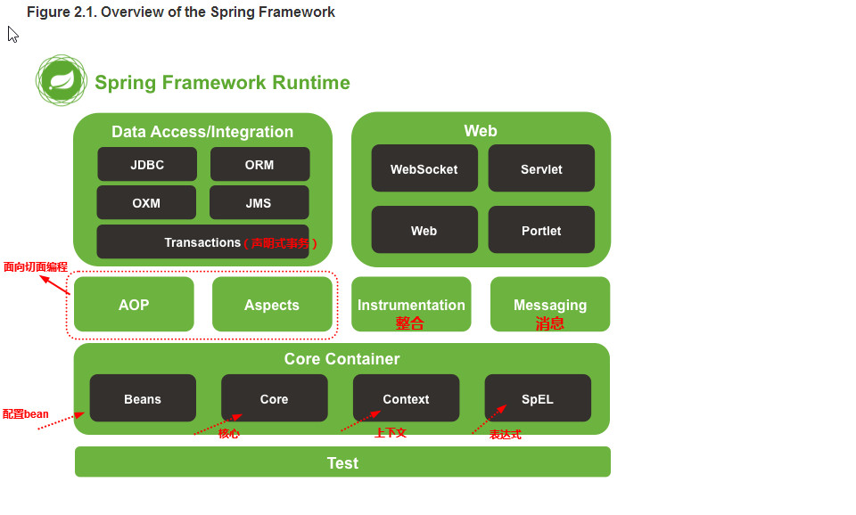

 Core container 核心容器

	* spring-core 
	* spring-beans 联合spring-beans提供IOC(DI)功能
	* spring-context  spring容器（上下文）
	* spring-context-support 
	         提供整合第三方常见的库：
				* caching (EhCache, Guava, JCache)
				* mailing (JavaMail)
				* scheduling (CommonJ, Quartz)
				* template engines (FreeMarker, JasperReports, Velocity)
	* spring-expression 类似jsp el 表达式

AOP and Instrumentation
	
	*spring-aop	
	*spring-aspects 提供AspectJ
	*spring-instrument 提供整合支持和类加载器

Messaging 消息机制

	*spring-messaging

数据访问和整合

The Data Access/Integration layer consists of the JDBC, ORM, OXM, JMS, and Transaction modules.
数据访问层包括JDBC、ORM、OXM、JMS和Transaction modules(声明式模块)

	*spring-jdbc
	*spring-tx 提供声明式事务
	*spring-orm 支持关系型数据，如JPA、JDO和Hibernate
	*spring-oxm 提供xml，如JAXB, Castor, XMLBeans, JiBX and XStream
	*spring-jms 提供集成spring-messaging模块

Web 网络

web层 涵盖了spring-web，spring-webmvc，spring-websocket和spring-webmvc-portlet模块

	*spring-web
	*spring-webmvc 提供Rest
	*spring-webmvc-portlet

Test 
	
	*spring-test

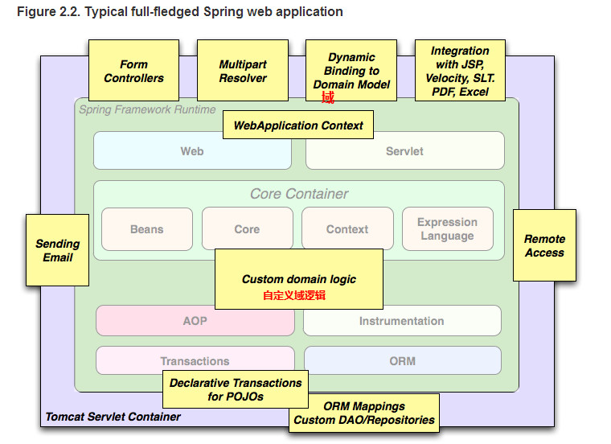

**使用第三方web框架**
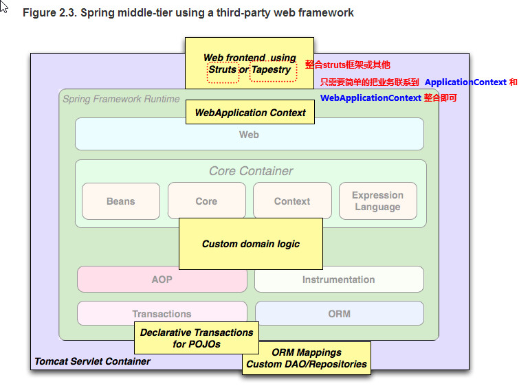

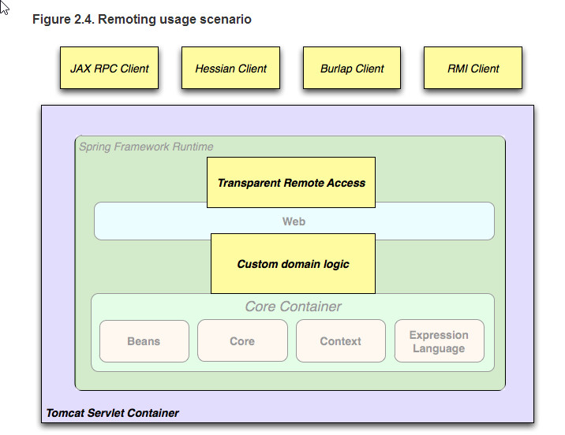

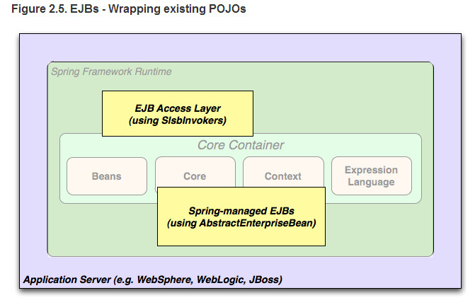

### Dependency Management and Naming Conventions(依赖管理和命名约定)

**Table 2.1. Spring Framework Artifacts**

GroupId|ArtifactId|Description
------  | ----------------|--------------
org.springframework  |	spring-aop		|Proxy-based AOP support
org.springframework	 |  spring-aspects	|AspectJ based aspects
org.springframework	 |  spring-beans		|Beans support, including Groovy
org.springframework	 |  spring-context	|Application context runtime, including scheduling and remoting abstractions
org.springframework	 |spring-context-support|Support classes for integrating common third-party libraries into a Spring application context
org.springframework	 |spring-core		|Core utilities, used by many other Spring modules
org.springframework	|spring-expression|Spring Expression Language (SpEL)
org.springframework|spring-instrument|Instrumentation agent for JVM bootstrapping
org.springframework|spring-instrument-tomcat|Instrumentation agent for Tomcat
org.springframework|spring-jdbc|JDBC support package, including DataSource setup and JDBC access support
org.springframework|spring-jms|JMS support package, including helper classes to send and receive JMS messages
org.springframework|spring-messaging|Support for messaging architectures and protocols
org.springframework|spring-orm|Object/Relational Mapping, including JPA and Hibernate support
org.springframework|spring-oxm|Object/XML Mapping
org.springframework|spring-test|Support for unit testing and integration testing Spring components
org.springframework|spring-tx|Transaction infrastructure, including DAO support and JCA integration
org.springframework|spring-web|Web support packages, including client and web remoting
org.springframework|spring-webmvc|REST Web Services and model-view-controller implementation for web applications
org.springframework|spring-webmvc-portlet|MVC implementation to be used in a Portlet environment
org.springframework|spring-websocket|WebSocket and SockJS implementations, including STOMP support


一定要加入commons-logging.jar，使用log4j简单配置

	log4j.rootCategory=INFO, stdout
	log4j.appender.stdout=org.apache.log4j.ConsoleAppender
	log4j.appender.stdout.layout=org.apache.log4j.PatternLayout
	log4j.appender.stdout.layout.ConversionPattern=%d{ABSOLUTE} %5p %t %c{2}:%L - %m%n
	log4j.category.org.springframework.beans.factory=DEBUG

## II Spring 4.x 框架新特性

###历史

spring2.0 开始支持 XML命名空间 and AspectJ

spring2.5 支持注解配置

spring3.0 引入了jdk1.5的库

spring4.0 支持jdk1.8库

输出Removed Deprecated Packages and Methods（删除过时的包、方法）

spring4.x +hibernate4.3+

###改进

ClassPathXmlApplication 

FileSystemXmlApplication

实例化容器

	ApplicationContext context =
    new ClassPathXmlApplicationContext(new String[] {"services.xml", "daos.xml"});

基于XML的配置bean
	
	<beans>
	    <import resource="services.xml"/>
	    <import resource="resources/messageSource.xml"/>
	    <import resource="/resources/themeSource.xml"/>
	
	    <bean id="bean1" class="..."/>
	    <bean id="bean2" class="..."/>
	</beans>

Using the container（使用容器）

使用检索bean的方法

	T getBean(String name, Class<T> requiredType) //检索bean方法

	// create and configure beans
	ApplicationContext context =
	    new ClassPathXmlApplicationContext(new String[] {"services.xml", "daos.xml"});
	
	// retrieve configured instance
	PetStoreService service = context.getBean("petStore", PetStoreService.class);
	
	// use configured instance
	List<String> userList = service.getUsernameList();

**bean概述**

* Instantiation with a constructor（用构造器实例化）

	
		<bean id="exampleBean" class="examples.ExampleBean"/>
		
		<bean name="anotherExample" class="examples.ExampleBeanTwo"/>

* Instantiation with a static factory method（用静态工厂方法实例化）

	
		<bean id="clientService" class="examples.ClientService"  factory-method="createInstance"/>

		public class ClientService {
		    private static ClientService clientService = new ClientService();
		    private ClientService() {}
		
		    public static ClientService createInstance() {
		        return clientService;
		    }
		}

* Instantiation using an instance factory method（使用工厂方法实例化一个实例）

		<!-- the factory bean, which contains a method called createInstance() -->
		<bean id="serviceLocator" class="examples.DefaultServiceLocator">
		    <!-- inject any dependencies required by this locator bean -->
		</bean>
		
		<!-- the bean to be created via the factory bean -->
		<bean id="clientService"
		    factory-bean="serviceLocator"
		    factory-method="createClientServiceInstance"/>

		public class DefaultServiceLocator {

		    private static ClientService clientService = new ClientServiceImpl();
		    private DefaultServiceLocator() {}
		
		    public ClientService createClientServiceInstance() {
		        return clientService;
		    }
		}

One factory class can also hold more than one factory method as shown here（一个工厂类也可以容纳一个以上的工厂方法，如图所示）

	<bean id="serviceLocator" class="examples.DefaultServiceLocator">
	    <!-- inject any dependencies required by this locator bean -->
	</bean>
	
	<bean id="clientService"
	    factory-bean="serviceLocator"
	    factory-method="createClientServiceInstance"/>
	
	<bean id="accountService"
	    factory-bean="serviceLocator"
	    factory-method="createAccountServiceInstance"/>


	public class DefaultServiceLocator {
	
	    private static ClientService clientService = new ClientServiceImpl();
	    private static AccountService accountService = new AccountServiceImpl();
	
	    private DefaultServiceLocator() {}
	
	    public ClientService createClientServiceInstance() {
	        return clientService;
	    }
	
	    public AccountService createAccountServiceInstance() {
	        return accountService;
	    }
	
	}

**通过ContextLoaderListener注册ApplicationContext**

在web.xml

	<context-param>
	    <param-name>contextConfigLocation</param-name>
	    <param-value>/WEB-INF/daoContext.xml /WEB-INF/applicationContext.xml</param-value>
	</context-param>
	
	<listener>
	    <listener-class>org.springframework.web.context.ContextLoaderListener</listener-class>
	</listener>


**Application contexts and Resource paths**

	ApplicationContext ctx = new ClassPathXmlApplicationContext("conf/appContext.xml");
	//或
	ApplicationContext ctx =
    new FileSystemXmlApplicationContext("conf/appContext.xml");

## III 核心技术

### IOC和DI概述

	IOC(Inversion of Control)：其思想是反转资源获取的方向. 传统的资源查找方式要求组件向容器发起请求查找资源. 作为回应, 容器适时的返回资源. 而应用了 IOC 之后, 则是容器主动地将资源推送给它所管理的组件, 组件所要做的仅是选择一种合适的方式来接受资源. 这种行为也被称为查找的被动形式


	DI(Dependency Injection) — IOC 的另一种表述方式：即组件以一些预先定义好的方式(例如: setter 方法)接受来自如容器的资源注入. 相对于 IOC 而言，这种表述更直接

**配置bean**

* 配置形式：基于 XML 文件的方式；基于注解方法
* Bean 的配置方式：通过全类名（反射）、通过工厂方法（静态工厂方法 & 实例化工厂方法）、FactoryBean
* IOC容器 BeanFactory & ApplicationContext 概述
* 依赖注入的方式：**属性注入；构造器注入**

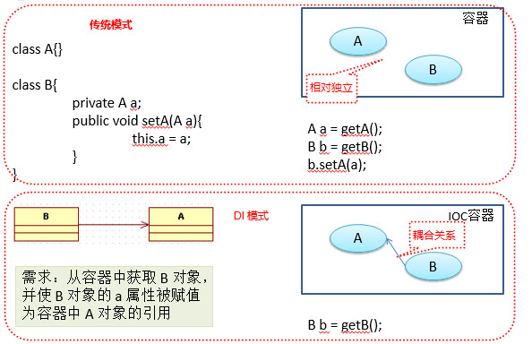

* 注入属性值细节
* 自动装配
* bean之间的关系：**继承；依赖**
* bean的作用域：singleton；prototype；WEB环境作用域
* 使用外部属性文件
* spEL
* IOC 容器中 Bean 的生命周期
* Spring 4.x 新特性：泛型依赖注入

### Spring 容器 即 IOC容器

- 在 **Spring IOC** 容器读取 Bean 配置创建 Bean 实例之前, 必须对它进行实例化. 只有在容器实例化后, 才可以从 IOC 容器里获取 Bean 实例并使用.

- Spring 提供了**两种**类型的 IOC 容器实现.
	
	- **BeanFactory**: IOC 容器的基本实现.
	- **ApplicationContext**: 提供了更多的高级特性. 是 BeanFactory 的子接口.
	- BeanFactory 是 Spring 框架的基础设施，面向 Spring 本身；ApplicationContext 面向使用 Spring 框架的开发者，**几乎所有的应用场合都直接使用 ApplicationContext 而非底层的 BeanFactory**
	- 无论使用何种方式, 配置文件时相同的.

**ApplicationContext的主要实现类******

	AppplicationContext 代表 IOC 容器
	ClassPathXmlApplicationContext：是AppplicationContext接口实现类，该实现类从类路
	径下加载配置文件
	//【注意】配置bean的时候，class：bean的全类名，通过的反射在IOC容器中创建Bean，所以
	Bean中必须有无参构造器；id：标识容器中bean，id 唯一。
	//可以使用property的 ref 属性建立bean之间的引用关系

- ClassPathXmlApplicationContext：从**类路径下**加载配置文件
- FileSystemXmlApplicationContext: 从文件系统中加载配置文件

**ConfigurableApplicationContext 扩展于 ApplicationContext，新增加两个主要方法：refresh() 和 close()， 让 ApplicationContext 具有启动、刷新和关闭上下文的能力**

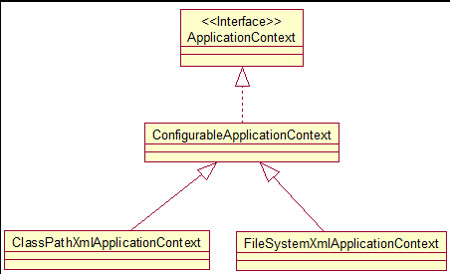

**ApplicationContext 在初始化上下文时就实例化所有单例的 Bean。**

**WebApplicationContext 是专门为 WEB 应用而准备的，它允许从相对于 WEB 根目录的路径中完成初始化工作**

### 从 IOC 容器中获取Bean

**调用ApplcaitionContext的getBean（）方法**
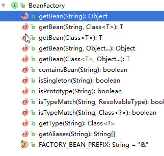

### 依赖注入的方式 （spring 支持3种依赖注入的方式）

- **属性注入**
	- 属性注入即通过 **setter 方法**注入Bean的属性值或依赖的对象
	- 属性注入使用 \<property\> 元素, 使用 name 属性指定 Bean 的属性名称，value 属性或 \<value\> 子节点指定属性值 
	- 属性注入是实际应用中最常用的注入方式
	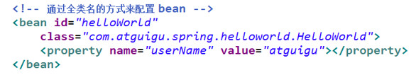

- **构造器注入**
	- 通过构造方法注入Bean 的属性值或依赖的对象，它保证了 Bean 实例在实例化后就可以使用。
	- 构造器注入在 <constructor-arg> 元素里声明属性, <constructor-arg> 中没有 name 属性
	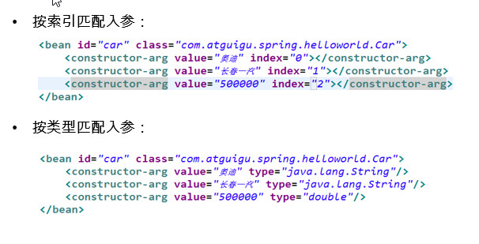

- 工厂方法注入（很少使用，不推荐）

### 引入其他bean

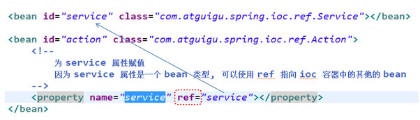

### 自动装配bean

- XML 配置里的 Bean 自动装配
	- Spring IOC 容器可以自动装配 Bean. 需要做的仅仅是**在 \<bean> 的 autowire 属性里指定自动装配的模式**
	- **byType**(根据类型自动装配): 若 IOC 容器中有多个与目标 Bean 类型一致的 Bean. 在这种情况下, Spring 将无法判定哪个 Bean 最合适该属性, 所以不能执行自动装配.
	- **byName**(根据名称自动装配): 必须将目标 Bean 的名称和属性名设置的完全相同.
	
			可以使用autowire属性指定自动装配的方式
			byName 根据 bean 的名字和当前 bean 的setter风格的属性名进行自动装配，若有
			匹配，则会自动装配；若无匹配，则不会自动装配；
			byType 根据 bean 的类型和当前 bean 的属性的类型进行自动装配。若IOC容器中
			有1个以上的类型匹配的bean，则抛异常。

	- constructor(通过构造器自动装配): 当 Bean 中存在多个构造器时, 此种自动装配方式将会很复杂. **不推荐使用**

	[缺点：]

		1、在bean配置文件设置autowire时会自动装配所有属性，若只装配个别属性，就不那么灵活
		2、autowire 属性要么根据类型自动装配, 要么根据名称自动装配, 不能两者兼而有之
		3、一般情况下，在实际的项目中很少使用自动装配功能，因为和自动装配功能所带来的好
		处比起来，明确清晰的配置文档更有说服力一些

### 继承bean配置
- **Spring 允许继承 bean 的配置**, 被继承的 bean 称为父 bean. 继承这个父 Bean 的 Bean 称为子 Bean
- **子 Bean 从父 Bean 中继承配置, 包括 Bean 的属性配置**
子 Bean 也可以**覆盖**从父 Bean 继承过来的配置
- 父 Bean 可以作为配置模板, 也可以作为 Bean 实例. **若只想把父 Bean 作为模板, 可以设置 <bean> 的abstract 属性为 true**, 这样 Spring 将不会实例化这个 Bean
- **并不是 <bean> 元素里的所有属性都会被继承.** 比如: autowire, abstract 等.
- 也**可以忽略父 Bean 的 class 属性**, 让子 Bean 指定自己的类, 而共享相同的属性配置. 但此时 **abstract 必须设为 true**

	
		抽象bean：bean的abstract属性为true的bean。这样的bean不能被IOC容器实例化，只能
		用来被继承配置。
		若某一个bean的class属性没有指定，则该bena必须是一个抽象bean

		使用 bean 的scope属性来配置bean的作用域
		singleton：默认值。容器初始化时创建bean实例，在整个容器的生命周期内只创建一个
		bean，单例的prototype：原型的。容器初始化时不创建bean的实例，而在每次请求时都
		创建一个新的bean实例

### 依赖Bean配置

- **Spring 允许用户通过 depends-on 属性设定 Bean 前置依赖的Bean**，前置依赖的 Bean 会在本 Bean 实例化之前创建好
- **如果前置依赖于多个 Bean，则可以通过逗号，空格或的方式配置 Bean 的名称**

### bean 的作用域：singleton；prototype；WEB 环境作用域
- Bean 的作用域
	- 在 Spring 中, 可以在 <bean> 元素的 scope 属性里设置 Bean 的作用域. 
	- **默认情况下, Spring 只为每个在 IOC 容器里声明的 Bean 创建唯一一个实例, 整个 IOC 容器范围内都能共享该实例**：所有后续的 getBean() 调用和 Bean 引用都将返回这个唯一的 Bean 实例.该作用域被称为 **singleton**, 它是所有 Bean 的默认作用域.
	
	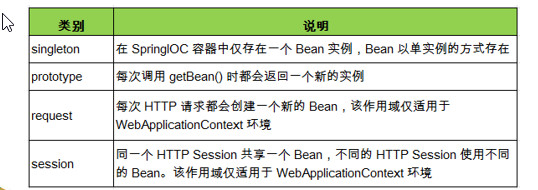


### 使用外部属性文件 （例如：文件路径、数据源配置信息）

- 在配置文件里配置 Bean 时, 有时需要在 Bean 的配置里混入系统部署的细节信息(例如: 文件路径, 数据源配置信息等). 而这些部署细节实际上需要和 Bean 配置相分离

- Spring 提供了一个 PropertyPlaceholderConfigurer 的 **BeanFactory 后置处理器**, 这个处理器允许用户将 Bean 配置的部分内容外移到**属性文件**中. 可以在 Bean 配置文件里使用形式为 **${var}** 的变量, PropertyPlaceholderConfigurer 从属性文件里加载属性, 并使用这些属性来替换变量.
- Spring 还允许在属性文件中使用 ${propName}，以实现属性之间的相互引用。

**注册 PropertyPlaceholderConfigurer**

* spring 2.0
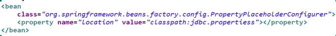

* **spring 2.5之后：可通过<context:property-placeholder>元素简化：**
	* <bean> 中添加contextSchema定义
	* 在配置文件中加入如下配置：
	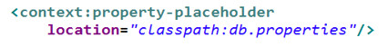


### SpEL：Spring表达式语言


### IOC 容器中 Bean 的生命周期

### 实现 FactoryBean 接口在 Spring IOC 容器中配置 Bean

- Spring 中有两种类型的 Bean, 一种是普通Bean, 另一种是工厂Bean, 即FactoryBean. 
- 工厂 Bean 跟普通Bean不同, 其返回的对象不是指定类的一个实例, 其返回的是该工厂 Bean 的 getObject 方法所返回的对象 
	
	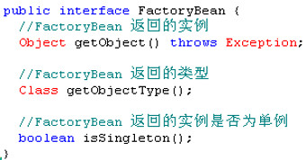


## VI 在 classpath 中扫描组件

- 组件扫描(component scanning):  Spring 能够从 classpath 下自动扫描, 侦测和实例化具有特定注解的组件. 
- 特定组件包括:
	- @Component: 基本注解, 标识了一个受 Spring 管理的组件
	- @Respository: 标识持久层组件
	- @Service: 标识服务层(业务层)组件
	- @Controller: 标识表现层组件
- 对于扫描到的组件, **Spring 有默认的命名策略**: 使用非限定类名, 第一个字母小写. **也可以在注解中通过 value 属性值标识组件的名称**
- 当在组件类上使用了特定的注解之后, 还需要在 Spring 的配置文件中声明 **<context:component-scan>** ：
	- **base-package 属性指定一个需要扫描的基类包，Spring 容器将会扫描这个基类包里及其子包中的所有类. **
	- **当需要扫描多个包时, 可以使用逗号分隔.**
	- 如果仅希望扫描特定的类而非基包下的所有类，可使用 resource-pattern 属性过滤特定的类，示例：
	
		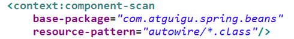
	- **<context:include-filter> 子节点表示要包含的目标类**
	- **<context:exclude-filter> 子节点表示要排除在外的目标类**
	- <context:component-scan> 下可以拥有若干个 <context:include-filter> 和 <context:exclude-filter> 子节点

载入properties配置文件
<context:property-placeholder 
	<!--加载配置文件-->
    <context:property-placeholder location="classpath:*.properties"></context:property-placeholder>

**<context:include-filter> 和 <context:exclude-filter> 子节点支持多种类型的过滤表达式：**

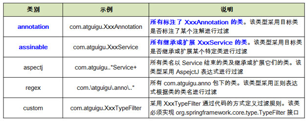

### 组件装配

- <context:component-scan> 元素还会自动注册 AutowiredAnnotationBeanPostProcessor 实例, 该实例可以自动装配具有 **@Autowired** 和 **@Resource** 、**@Inject** 注解的属性.

### 使用 @Autowired 自动装配 Bean

- **构造器, 普通字段(即使是非 public), 一切具有参数的方法都可以应用@Authwired 注解**
- 默认情况下, 所有使用 @Authwired 注解的属性都需要被设置. 当 Spring 找不到匹配的 Bean 装配属性时, 会抛出异常, 若某一属性允许不被设置, 可以设置 @Authwired 注解的 required 属性为 false
- 默认情况下, 当 IOC 容器里存在多个类型兼容的 Bean 时, 通过类型的自动装配将无法工作. 此时可以在 **@Qualifier** 注解里提供 Bean 的名称. **Spring 允许对方法的入参标注 @Qualifiter 已指定注入 Bean 的名称**
- @Authwired 注解也可以应用在**数组类型**的属性上, 此时 Spring 将会把所有匹配的 Bean 进行自动装配.
- @Authwired 注解也可以应用在**集合属性**上, 此时 Spring 读取该集合的类型信息, 然后自动装配所有与之兼容的 Bean. 
- @Authwired 注解用在 **java.util.Map** 上时, 若该 Map 的键值为 String, 那么 Spring 将自动装配与之 Map 值类型兼容的 Bean, 此时 Bean 的名称作为键值

### 使用 @Resource 或 @Inject 自动装配 Bean

- Spring 还支持 @Resource 和 @Inject 注解，这两个注解和 @Autowired 注解的功用类似
- **@Resource 注解要求提供一个 Bean 名称的属性，若该属性为空，则自动采用标注处的变量或方法名作为 Bean 的名称**
- @Inject 和 @Autowired 注解一样也是按类型匹配注入的 Bean， 但没有 reqired 属性
- **建议使用 @Autowired 注解**


### 泛型依赖注入

- Spring 4.x 中可以为子类注入子类对应的泛型类型的成员变量的引用

	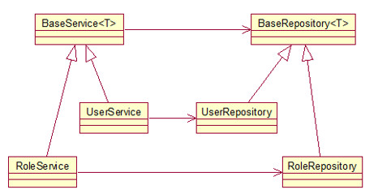

### 整合多个配置文件

- Spring 允许通过 <import> 将多个配置文件引入到一个文件中，进行配置文件的集成。这样在启动 Spring 容器时，仅需要指定这个合并好的配置文件就可以。
- import 元素的 resource 属性支持 Spring 的标准的路径资源

	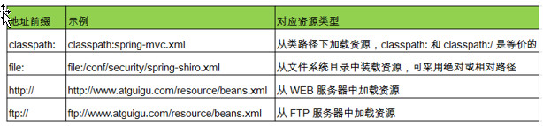

## Spring AOP （面向切面编程）

**场景问题？**

	代码混乱：越来越多的非业务需求(日志和验证等)加入后, 原有的业务方法急剧膨胀.  每个方法在处理核心逻辑的同时还必须兼顾其他多个关注点. 

	代码分散: 以日志需求为例, 只是为了满足这个单一需求, 就不得不在多个模块（方法）里多次重复相同的日志代码. 如果日志需求发生变化, 必须修改所有模块.
 
使用动态代理解决上述问题

- 代理设计模式的原理: **使用一个代理将对象包装起来**, 然后用该代理对象取代原始对象. 任何对原始对象的调用都要通过代理. 代理对象决定是否以及何时将方法调用转到原始对象上.

    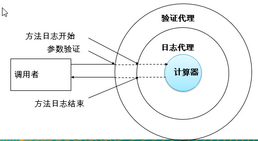

- AOP(Aspect-Oriented Programming, **面向切面编程**): 是一种新的方法论, 是对传统 OOP(Object-Oriented Programming, 面向对象编程) 的补充.
- AOP 的主要编程对象是**切面**(aspect), 而**切面模块化横切关注点**.
- 在应用 AOP 编程时, 仍然需要定义公共功能, 但可以明确的定义这个功能在哪里, 以什么方式应用, **并且不必修改受影响的类**. 这样一来**横切关注点就被模块化到特殊的对象(切面)**里.
- AOP 的好处:
	- 每个事物逻辑位于一个位置, 代码不分散, 便于维护和升级
	- 业务模块更简洁, 只包含核心业务代码.

		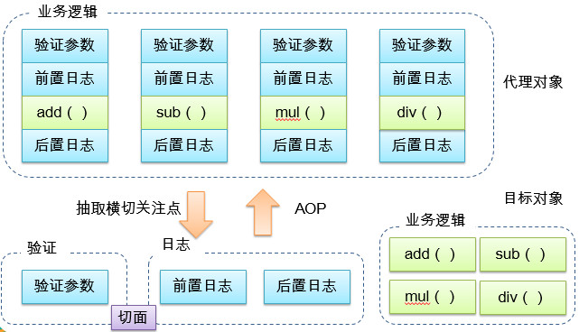
	
			切面(Aspect):  横切关注点(跨越应用程序多个模块的功能)被模块化的特殊对象
			通知(Advice):  切面必须要完成的工作
			目标(Target): 被通知的对象
			代理(Proxy): 向目标对象应用通知之后创建的对象
			连接点（Joinpoint）：程序执行的某个特定位置：如类某个方法调用前、调用后、方法抛出异常后等。连接点由两个信息确定：方法表示的程序执行点；相对点表示的方位。例如 ArithmethicCalculator#add() 方法执行前的连接点，执行点为 ArithmethicCalculator#add()； 方位为该方法执行前的位置
			切点（pointcut）：每个类都拥有多个连接点：例如 ArithmethicCalculator 的所有方法实际上都是连接点，即连接点是程序类中客观存在的事务。AOP 通过切点定位到特定的连接点。类比：连接点相当于数据库中的记录，切点相当于查询条件。切点和连接点不是一对一的关系，一个切点匹配多个连接点，切点通过 org.springframework.aop.Pointcut 接口进行描述，它使用类和方法作为连接点的查询条件。

**AspectJ**：Java 社区里最完整最流行的 AOP 框架.

**在 Spring2.0 以上版本中, 可以使用基于 AspectJ 注解或基于 XML 配置的 AOP**

### 在 Spring 中启用 AspectJ 注解支持

- 要在 Spring 应用中使用 AspectJ 注解, **必须在 classpath 下包含 AspectJ 类库**: aopalliance.jar、aspectj.weaver.jar 和 spring-aspects.jar
- **将 aop Schema 添加到 <beans> 根元素中.**
- 要在 Spring IOC 容器中启用 AspectJ 注解支持, 只要**在 Bean 配置文件中定义一个空的 XML 元素 <aop:aspectj-autoproxy>**
- 当 Spring IOC 容器侦测到 Bean 配置文件中的 <aop:aspectj-autoproxy> 元素时, 会自动为与 AspectJ 切面匹配的 Bean 创建代理.

### 用 AspectJ 注解声明切面

- **要在 Spring 中声明 AspectJ 切面, 只需要在 IOC 容器中将切面声明为 Bean 实例**. 当在 Spring IOC 容器中初始化 AspectJ 切面之后, Spring IOC 容器就会为那些与 AspectJ 切面相匹配的 Bean 创建代理.
- **在 AspectJ 注解中, 切面只是一个带有 @Aspect 注解的 Java 类**. 
- **通知是标注有某种注解的简单的 Java 方法**.
- AspectJ 支持** 5 **种类型的通知注解: 
	- **@Before**: 前置通知, 在方法执行之前执行
	
		- 前置通知:在方法执行之前执行的通知
		
		- 前置通知使用 @Before 注解, 并将切入点表达式的值作为注解值.

            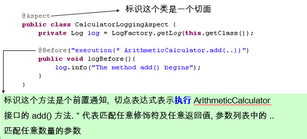
		
	- **@After**: 后置通知, 在方法执行之后执行 
	
		- 后置通知是在连接点完成之后执行的, 即连接点返回结果或者抛出异常的时候, 下面的后置通知记录了方法的终止. 
		- 一个切面可以包括一个或者多个通知.
            
			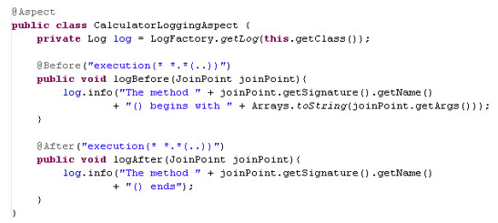	

	- **@AfterRunning**: 返回通知, 在方法返回结果之后执行

		- 无论连接点是正常返回还是抛出异常, 后置通知都会执行. 如果只想在连接点返回的时候记录日志, 应使用返回通知代替后置通知
		
			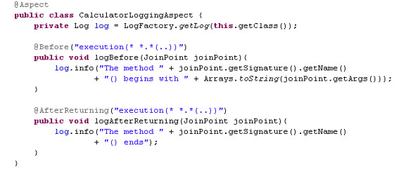	

		- 在返回通知中访问连接点的返回值
		
			- 在返回通知中, 只要将 returning 属性添加到 @AfterReturning 注解中, 就可以访问连接点的返回值. 该属性的值即为用来传入返回值的参数名称. 
			- 必须在通知方法的签名中添加一个同名参数. 在运行时, Spring AOP 会通过这个参数传递返回值.
			- 原始的切点表达式需要出现在 pointcut 属性中

				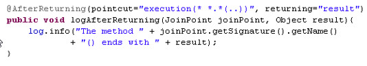

	- **@AfterThrowing**: 异常通知, 在方法抛出异常之后

		- 只在连接点抛出异常时才执行异常通知
		- **将 throwing 属性添加到 @AfterThrowing 注解中**, 也可以访问连接点抛出的异常. Throwable 是所有错误和异常类的超类. 所以在异常通知方法可以捕获到任何错误和异常.
		- 如果只对某种特殊的异常类型感兴趣, 可以将参数声明为其他异常的参数类型. 然后通知就只在抛出这个类型及其子类的异常时才被执行.
			
			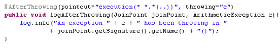

	- **@Around**: 环绕通知, 围绕着方法执行

		- 环绕通知是所有通知类型中功能最为强大的, 能够全面地控制连接点. 甚至**可以控制是否执行连接点**.
		- **对于环绕通知来说, 连接点的参数类型必须是 ProceedingJoinPoint **. 它是 JoinPoint 的子接口, **允许控制何时执行, 是否执行连接点**.
		- **在环绕通知中需要明确调用 ProceedingJoinPoint 的 proceed() 方法来执行被代理的方法. 如果忘记这样做就会导致通知被执行了, 但目标方法没有被执行**.
		- **注意: 环绕通知的方法需要返回目标方法执行之后的结果, 即调用 joinPoint.proceed(); 的返回值, 否则会出现空指针异常**

			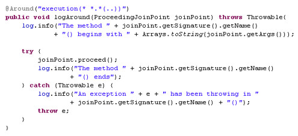

### 利用方法签名编写 AspectJ 切入点表达式

- 最典型的切入点表达式时根据方法的签名来匹配各种方法:
	- execution * com.atguigu.spring.ArithmeticCalculator.*(..): 匹配 ArithmeticCalculator 中声明的所有方法,第一个 * 代表任意修饰符及任意返回值. 第二个 * 代表任意方法. .. 匹配任意数量的参数. 若目标类与接口与该切面在同一个包中, 可以省略包名.
	- execution public * ArithmeticCalculator.*(..): 匹配 ArithmeticCalculator 接口的所有公有方法.
	- execution public double ArithmeticCalculator.*(..): 匹配 ArithmeticCalculator 中返回 double 类型数值的方法
	- execution public double ArithmeticCalculator.*(double, ..): 匹配第一个参数为 double 类型的方法, .. 匹配任意数量任意类型的参数
	- execution public double ArithmeticCalculator.*(double, double): 匹配参数类型为 double, double 类型的方法.

### 合并切入点表达式

- 在 AspectJ 中, 切入点表达式可以通过操作符 &&, ||, ! 结合起来. 

	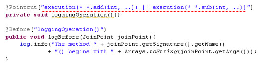

### 让通知访问当前连接点的细节

- 可以在通知方法中声明一个类型为 JoinPoint 的参数. 然后就能访问链接细节. 如方法名称和参数值. 

	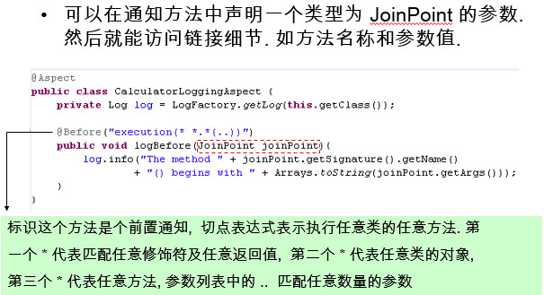

### 指定切面的优先级

- 在同一个连接点上应用不止一个切面时, 除非明确指定, 否则它们的优先级是不确定的.
- 切面的优先级可以通过实现 Ordered 接口或利用 @Order 注解指定.
- 实现 Ordered 接口, getOrder() 方法的返回值越小, 优先级越高.
- 若使用 @Order 注解, 序号出现在注解中

	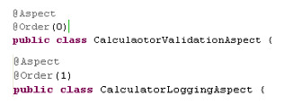

### 重用切入点定义

- 在编写 AspectJ 切面时, 可以直接在通知注解中书写切入点表达式. 但同一个切点表达式可能会在多个通知中重复出现.
- 在 AspectJ 切面中, 可以**通过 @Pointcut 注解将一个切入点声明成简单的方法. 切入点的方法体通常是空的**, 因为将切入点定义与应用程序逻辑混在一起是不合理的. 
- **切入点方法的访问控制符同时也控制着这个切入点的可见性**. 如果切入点要在多个切面中共用, 最好将它们集中在一个公共的类中. 在这种情况下, 它们必须被声明为 public. 在引入这个切入点时, 必须将类名也包括在内. 如果类没有与这个切面放在同一个包中, 还必须包含包名.
- 其他通知可以通过方法名称引入该切入点.

	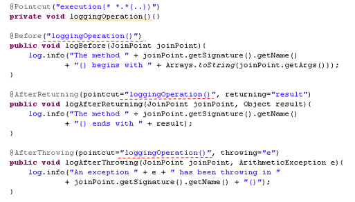

### 引入通知

- 引入通知是一种特殊的通知类型. 它通过为接口提供实现类, 允许对象动态地实现接口, 就像对象已经在运行时扩展了实现类一样.

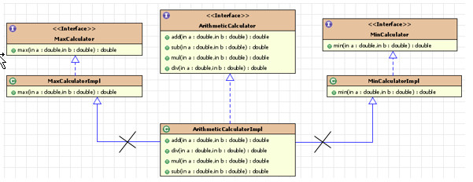

- 引入通知可以使用两个实现类 MaxCalculatorImpl 和 MinCalculatorImpl, 让 ArithmeticCalculatorImpl 动态地实现 MaxCalculator 和 MinCalculator 接口. 而这与从 MaxCalculatorImpl 和 MinCalculatorImpl 中实现多继承的效果相同. 但却不需要修改 ArithmeticCalculatorImpl 的源代码
- 引入通知也必须在切面中声明
- 在切面中, 通过为**任意字段**添加**@DeclareParents** 注解来引入声明. 
- 注解类型的 **value** 属性表示哪些类是当前引入通知的目标. value 属性值也可以是一个 AspectJ 类型的表达式, 以将一个即可引入到多个类中.  **defaultImpl** 属性中指定这个接口使用的实现类


### 用基于 XML 的配置声明切面

- 除了使用 AspectJ 注解声明切面, Spring 也支持在 Bean 配置文件中声明切面. 这种声明是通过 aop schema 中的 XML 元素完成的.
- 正常情况下, **基于注解的声明要优先于基于 XML 的声明**. 通过 AspectJ 注解, 切面可以与 AspectJ 兼容, 而基于 XML 的配置则是 Spring 专有的. 由于 AspectJ 得到越来越多的 AOP 框架支持, 所以以注解风格编写的切面将会有更多重用的机会.

- 当使用 XML 声明切面时, 需要在 <beans> 根元素中导入 aop Schema
- 在 Bean 配置文件中, 所有的 Spring AOP 配置都必须定义在 **<aop:config>** 元素内部. 对于每个切面而言, 都要创建一个 **<aop:aspect> **元素来为具体的切面实现引用后端 Bean 实例. 
- 切面 Bean 必须有一个标示符, 供 <aop:aspect> 元素引用

	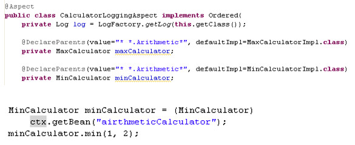

### 基于 XML ---- 声明切入点

- 切入点使用 **<aop:pointcut>** 元素声明
- 切入点必须定义在 <aop:aspect> 元素下, 或者直接定义在 <aop:config> 元素下.
	- 定义在 <aop:aspect> 元素下: 只对当前切面有效
	- 定义在 <aop:config> 元素下: 对所有切面都有效
- 基于 XML 的 AOP 配置不允许在切入点表达式中用名称引用其他切入点. 

	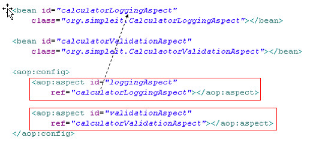

### 基于 XML ---- 声明通知

- 在 aop Schema 中, 每种通知类型都对应一个特定的 XML 元素. 
- 通知元素需要使用 <pointcut-ref> 来引用切入点, 或用 <pointcut> 直接嵌入切入点表达式.  method 属性指定切面类中通知方法的名称.

	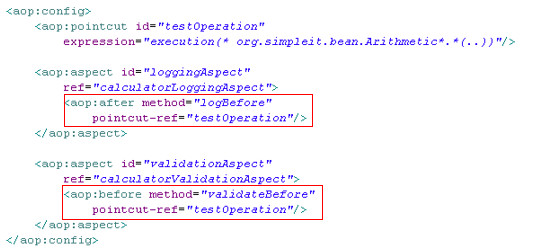

### 声明引入

- 可以利用 <aop:declare-parents> 元素在切面内部声明引入

	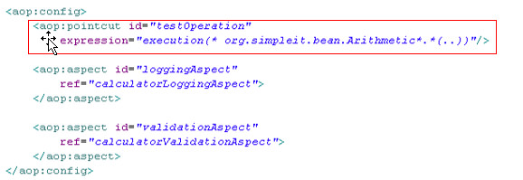

## VI 数据访问

### Spring 对 JDBC 的支持
- JdbcTemplate

	- 为了使 JDBC 更加易于使用, Spring 在 JDBC API 上定义了一个抽象层, 以此建立一个 JDBC 存取框架.
	- 作为 Spring JDBC 框架的核心, **JDBC 模板**的设计目的是为不同类型的 JDBC 操作提供**模板方法**. 每个模板方法都能控制整个过程, 并允许覆盖过程中的特定任务. 通过这种方式, 可以在尽可能保留灵活性的情况下, 将数据库存取的工作量降到最低.

- 使用 JdbcTemplate 更新数据库
	
	- 用sql语句和参数更新数据库:
	
		
		
	- 批量更新数据库：
	
		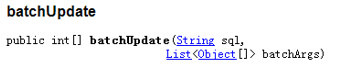)

	- 查询单行：

		

	- 便利的 BeanPropertyRowMapper 实现

		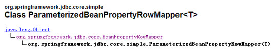

	- 查询多行

		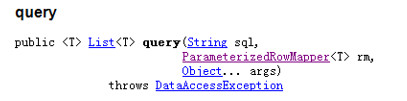

	- 单值查询

		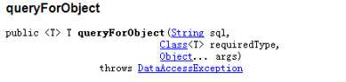

	
			简化 JDBC 模板查询
		
			1、每次使用都创建一个 JdbcTemplate 的新实例, 这种做法效率很低下.
			2、JdbcTemplate 类被设计成为线程安全的, 所以可以再 IOC 容器中声明它的单个实例, 并将这个实例注入到所有的 DAO 实例中.
			3、JdbcTemplate 也利用了 Java 1.5 的特定(自动装箱, 泛型, 可变长度等)来简化开发
			4、Spring JDBC 框架还提供了一个 JdbcDaoSupport 类来简化 DAO 实现. 该类声明了 jdbcTemplate 属性, 它可以从 IOC 容器中注入, 或者自动从数据源中创建.


**注入 JDBC 模板示例代码**

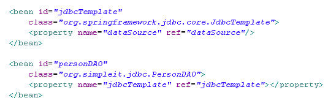

**扩展 JdbcDaoSupport 示例代码**

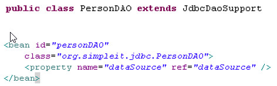

### 在 JDBC 模板中使用具名参数

- 在经典的 JDBC 用法中, SQL 参数是用占位符 ? 表示,并且受到位置的限制. 定位参数的问题在于, 一旦参数的顺序发生变化, 就必须改变参数绑定. 
- 在 Spring JDBC 框架中, 绑定 SQL 参数的另一种选择是使用具名参数(named parameter). 
- 具名参数: SQL 按名称(以冒号开头)而不是按位置进行指定. 具名参数更易于维护, 也提升了可读性. 具名参数由框架类在运行时用占位符取代
- 具名参数只在 NamedParameterJdbcTemplate 中得到支持 
- 在 SQL 语句中使用具名参数时, 可以在一个 Map 中提供参数值, 参数名为键
- 也可以使用 SqlParameterSource 参数
- 批量更新时可以提供 Map 或 SqlParameterSource 的数组

	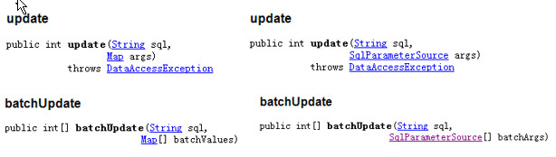

## VII Spring 中的事务管理
**【事务简介】：**

- 事务管理是企业级应用程序开发中必不可少的技术,  用来确保数据的完整性和一致性. 
- 事务就是一系列的动作, 它们被当做一个单独的工作单元. 这些动作要么全部完成, 要么全部不起作用
- 事务的四个关键属性(ACID)

	- **原子性(atomicity)**: 事务是一个原子操作, 由一系列动作组成. 事务的原子性确保动作要么全部完成要么完全不起作用.
	- **一致性(consistency)**: 一旦所有事务动作完成, 事务就被提交. 数据和资源就处于一种满足业务规则的一致性状态中.
	-** 隔离性(isolation)**: 可能有许多事务会同时处理相同的数据, 因此每个事物都应该与其他事务隔离开来, 防止数据损坏.
	- **持久性(durability)**: 一旦事务完成, 无论发生什么系统错误, 它的结果都不应该受到影响. 通常情况下, 事务的结果被写到持久化存储器中.

**【事务管理问题：】**

- 必须为不同的方法重写类似的样板代码
- 这段代码是特定于 JDBC 的, 一旦选择类其它数据库存取技术, 代码需要作出相应的修改

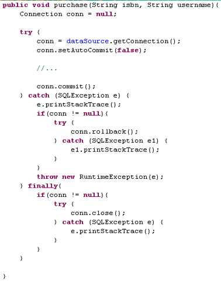

- 作为企业级应用程序框架, **Spring 在不同的事务管理 API 之上定义了一个抽象层**. 而应用程序开发人员不必了解底层的事务管理 API, 就可以使用 Spring 的事务管理机制.

	- Spring 从不同的事务管理 API 中抽象了一整套的事务机制. 开发人员不必了解底层的事务 API, 就可以利用这些事务机制. 有了这些事务机制, 事务管理代码就能独立于特定的事务技术了.
	- Spring 的核心事务管理抽象是  它为事务管理封装了一组独立于技术的方法. 无论使用 Spring 的哪种事务管理策略(编程式或声明式), 事务管理器都是必须的.


- Spring 既支持编程式事务管理, 也支持声明式的事务管理. 
- **编程式事务管理: 将事务管理代码嵌入到业务方法中来控制事务的提交和回滚**. 在编程式管理事务时, 必须在每个事务操作中包含额外的事务管理代码. 
- **声明式事务管理**: 大多数情况下比编程式事务管理更好用. 它**将事务管理代码从业务方法中分离出来, 以声明的方式来实现事务管理**. 事务管理作为一种横切关注点, 可以通过 AOP 方法模块化. **Spring 通过 Spring AOP 框架支持声明式事务管理.**

**Spring 中的事务管理器的不同实现**


* 在应用程序中只需要处理一个数据源, 而且通过 JDBC 存取
* 在 JavaEE 应用服务器上用 JTA(Java Transaction API) 进行事务管理
*  用 Hibernate 框架存取数据库
* 事务管理器以普通的 Bean 形式声明在 Spring IOC 容器中

### 用事务通知声明式地管理事务

- 事务管理是一种横切关注点
- 为了在 Spring 2.x 中启用声明式事务管理, 可以通过 tx Schema 中定义的** <tx:advice>** 元素声明事务通知, 为此必须事先将这个 Schema 定义添加到 <beans> 根元素中去.
- 声明了事务通知后, 就需要将它与切入点关联起来. 由于事务通知是在 <aop:config> 元素外部声明的, 所以它无法直接与切入点产生关联. 所以必须**在 <aop:config> 元素中声明一个增强器通知与切入点关联起来.**
- 由于 Spring AOP 是基于代理的方法, 所以只能增强公共方法. 因此, **只有公有方法才能通过 Spring AOP 进行事务管理.**

	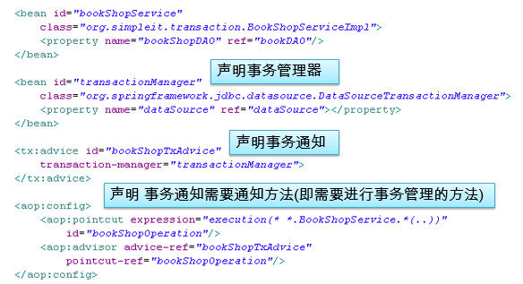

### 用 @Transactional 注解声明式地管理事务

- 除了在带有切入点, 通知和增强器的 Bean 配置文件中声明事务外, Spring 还允许简单地用 @Transactional **注解来标注事务方法**. 
- **为了将方法定义为支持事务处理的, 可以为方法添加 @Transactional 注解**. 根据 Spring AOP 基于代理机制, **只能标注公有方法.**
- 可以在方法或者**类级别上**添加 @Transactional 注解. 当把这个注解应用到类上时, 这个类中的所有公共方法都会被定义成支持事务处理的. 
- 在 Bean 配置文件中只需要启用 **<tx:annotation-driven> **元素, 并为之指定事务管理器就可以了. 
- 如果事务处理器的名称是 **transactionManager**, 就可以在<tx:annotation-driven> 元素中省略 transaction-manager 属性. 这个元素会自动检测该名称的事务处理器.

	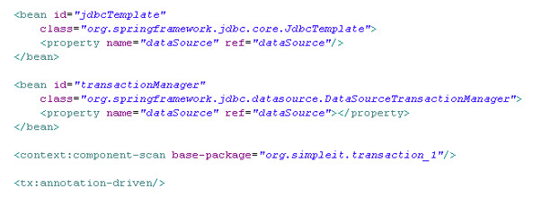

### 事务传播属性

- 当事务方法被另一个事务方法调用时, 必须指定事务应该如何传播. 例如: 方法可能继续在现有事务中运行, 也可能开启一个新事务, 并在自己的事务中运行.
- 事务的传播行为可以由传播属性指定. Spring 定义了 7  种类传播行为.

	 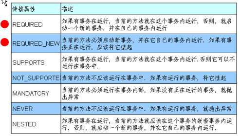
				
	- REQUIRED 传播行为
	
		- 当 bookService 的 purchase() 方法被另一个事务方法 checkout() 调用时, 它默认会在现有的事务内运行. 这个默认的传播行为就是 REQUIRED. 因此在 checkout() 方法的开始和终止边界内只有一个事务. 这个事务只在 checkout() 方法结束的时候被提交, 结果用户一本书都买不了
		- 事务传播属性可以在 @Transactional 注解的 propagation 属性中定义
			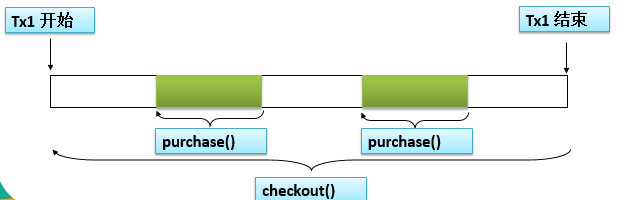

	- REQUIRES_NEW 传播行为
		
		- 另一种常见的传播行为是 REQUIRES_NEW. 它表示该方法必须启动一个新事务, 并在自己的事务内运行. 如果有事务在运行, 就应该先挂起它. 

			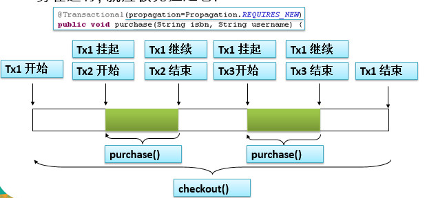

**在 Spring 2.x 事务通知中配置传播属性**

	在 Spring 2.x 事务通知中, 可以像下面这样在 <tx:method> 元素中设定传播事务属性

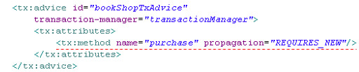

**并发事务所导致的问题**

	1)当同一个应用程序或者不同应用程序中的多个事务在同一个数据集上并发执行时, 可能会出现许多意外的问题
	2)并发事务所导致的问题可以分为下面三种类型:
	 2.1) 脏读: 对于两个事物 T1, T2, T1  读取了已经被 T2 更新但 还没有被提交的字段. 之后, 若 T2 回滚, T1读取的内容就是临时且无效的.
	 2.2) 不可重复读:对于两个事物 T1, T2, T1  读取了一个字段, 然后 T2 更新了该字段. 之后, T1再次读取同一个字段, 值就不同了.
	 2.3) 幻读:对于两个事物 T1, T2, T1  从一个表中读取了一个字段, 然后 T2 在该表中插入了一些新的行. 之后, 如果 T1 再次读取同一个表, 就会多出几行.

### Spring 支持的事务隔离级别


- 事务的隔离级别要得到底层数据库引擎的支持, 而不是应用程序或者框架的支持.
- Oracle 支持的 2 种事务隔离级别：READ_COMMITED , SERIALIZABLE
- Mysql 支持 4 中事务隔离级别.

**设置隔离事务属性**

- 用 @Transactional 注解声明式地管理事务时可以在 @Transactional 的 isolation 属性中设置隔离级别.

	
- 在 Spring 2.x 事务通知中, 可以在 `<tx:method>` 元素中指定隔离级别

	

### 设置回滚事务属性

- **默认情况下只有未检查异常(RuntimeException和Error类型的异常)会导致事务回滚**. 而受检查异常不会.
- 事务的回滚规则可以通过 @Transactional 注解的 rollbackFor 和 noRollbackFor 属性来定义. 这两个属性被声明为 Class[] 类型的, 因此可以为这两个属性指定多个异常类.

	- rollbackFor:  遇到时必须进行回滚
	- noRollbackFor: 一组异常类，遇到时必须不回滚

  

- 在 Spring 2.x 事务通知中, 可以在 <tx:method> 元素中指定回滚规则. 如果有不止一种异常, 用逗号分隔.

  

### 超时和只读属性

- 由于事务可以在行和表上获得锁,  因此长事务会占用资源, 并对整体性能产生影响. 
- 如果一个事物只读取数据但不做修改, 数据库引擎可以对这个事务进行优化.
- **超时事务属性**: 事务在强制回滚之前可以保持多久. 这样可以防止长期运行的事务占用资源.
- **只读事务属性**: 表示这个事务只读取数据但不更新数据, 这样可以帮助数据库引擎优化事务.

**设置超时和只读事务属性**

- 超时和只读属性可以在 @Transactional 注解中定义.超时属性以秒为单位来计算.
	
	

- 在 Spring 2.x 事务通知中, 超时和只读属性可以在 <tx:method> 元素中进行指定.

	

## VIII Spring 整合 Hibernate

	Spring 支持大多数流行的 ORM 框架, 包括 Hibernate JDO, TopLink, Ibatis 和 JPA。
	Spring 对这些 ORM 框架的支持是一致的, 因此可以把和 Hibernate 整合技术应用到其他 ORM 框架上.
	Spring 2.0 同时支持 Hibernate 2.x 和 3.x. 但 Spring 2.5 只支持 Hibernate 3.1 或更高版本

**在 Spring 中配置 SessionFactory**

	对于 Hibernate 而言, 必须从原生的 Hibernate API 中构建 SessionFactory. 此外, 应用程序也无法利用 Spring 提供的数据存储机制(例如: Spring 的事务管理机制)
	Spring 提供了对应的工厂 Bean, 可以用单实例的形式在 IOC 容器中创建 SessionFactory 实例.

- 方式一：

	- 可以利用 LocalSessionFactoryBean 工厂 Bean, 声明一个使用 XML 映射文件的 SessionFactory 实例.
	- 需要为该工厂 Bean 指定 configLocation 属性来加载 Hibernate 配置文件.
	
		

- 方式二：

	- 如果在 Spring IOC 容器中配置数据源. 可以将该数据源注入到 LocalSessionFactoryBean 的 dataSource 属性中. 该属性可以指定的数据源会覆盖掉 Hibernate 配置文件里的数据库配置
	
		

- 方式三：
	
	- 可以将所有配置合并到 LocalSessionFactoryBean 中,从而忽略 Hibernate 配置文件. 
	- 可以在 LocalSessionFactoryBean 的 **mappingResources** 属性中指定 XML 映射文件的位置.该属性为 String[] 类型. 因此可以指定一组映射文件.
	- 在 hibernateProperties 属性中指定数据库方言等.

	

**用 Spring 的 ORM 模板持久化对象**

	在单独使用 ORM 框架时, 必须为每个 DAO 操作重复某些常规任务. 例如: 打开关闭 Session 对象; 启动, 提交, 回滚事务等.
	同 JDBC 一样, Spring 采取了相同的方法 ------ 定义模板类和 DAO 支持类来简化 ORM 框架的使用. 而且 Spring 在不同的事务管理 API 之上定义了一个事务抽象层. 对于不同的 ORM 框架, 只需要选择相应的事务管理器实现.

**Spring 对不同数据存储策略的支持类**


- HibernateTemplate 确保了 Hibernate 会话能够正确地打开和关闭. 
- HibernateTemplate 也会让原生的 Hibernate 事务参与到 Spring 的事务管理体系中来. 从而利用 Spring 的声明式事务管理事务.

	- HibernateTemplate 中的模板方法管理会话和事务. 如果在一个支持事务的 DAO 方法中有多个 Hibernate 操作, 模板方法可以确保它们会在同一个会话和事务中运行. 因此没有必要为了会话和事务管理去和 Hibernate API 打交道.
	- 通过为 DAO 方法添加 @Transactional 注解将其声明为受事务管理的.
	- HibernateTemplate 类是线程安全的, 因此可以在 Bean 配置文件中只声明一个实例, 并将该实例注入到所有的 Hibernate DAO 中.
	
	
	

**在 HibernateTemplate 中访问 Hibernate 底层 Session**


**继承 Hibernate 的 DAO 支持类**

- Hibernate DAO 可以通过继承 HibernateDaoSupport 来继承 setSessionFactory() 和 setHibernateTemplate() 方法. 然后, 只要在 DAO 方法中调用 getHibernateTemplate() 方法就可以获取到模板实例.
- 如果为 HibernateDaoSupport 实现类注入了 SessionFactory 实例, 就不需要在为之注入 HibernateTemplate 实例了, 因为HibernateDaoSupport  会根据传入的 SessionFactory 在其构造器内创建 HibernateTemplate 的实例, 并赋给 hibernateTemplate 属性

**用 Hibernate 的上下文 Session 持久化对象**

- Spring 的 HibernateTemplate 可以管理会话和事务, 简化 DAO 实现. 但使用 HibernateTemplate 意味着DAO 必须依赖于 Spring 的 API
- 代替 HibernateTemplate 的另一种办法是使用 Hibernate 的上下文 Session 对象. 
- **Hibernate 上下文 Session 对象和 Spring 的事务管理合作的很好, 但此时需保证所有的DAO 方法都支持事务**
- 注意此时不需在 beans.xml 文件中配置, 因为 Spring 此时已经开始事务, 所以已经在 ThreadLocal 对象中绑定了 Session 对象 

	

- 在 Hibernate 会话中调用原生的方法时, 抛出的异常依旧是原生的 HibernateException. 
- 为了保持一致的异常处理方法, 即把 Hibernate 异常转换为 Spring 的 DataAccessException 异常, 那么必须为需要异常转换的 DAO 类添加 @Respository 注解.
- 然后再注册一个 实例, 将原生的 Hibernate 异常转换为 Spring 的 DataAccessException 层次结构中的数据存取异常. 这个 Bean 后置处理器只为添加了@Respository 注解的 Bean 转换异常. 


**Hibernate 上下文相关的 Session（1）**

- 从 Hibernate 3 开始, SessionFactory 新增加了 getCurrentSession() 方法, 该方法可直接获取“**上下文**“相关的 Session. 
- Hibernate 通过 CurrentSessionContext 接口的实现类和 配置参数hibernate.current_session_context_class定义 “**上下文**”

	- JTASessionContext: 根据 JTA 来跟踪和界定 Session 对象.
	- ThreadLocalSessionContext: 通过当前正在执行的线程来跟踪和界定 Session 对象
	- ManagedSessionContext: 通过正在当前执行来跟踪和界定 Session 对象. 但程序需要调用该类的静态方法来绑定 Sessio 对象, 取消绑定, flush 或者关闭 Session 对象.

**Hibernate 上下文相关的 Session（2）**

- 如果使用 ThreadLocalSessionContext 策略, Hibernate 的 Session 会随着 getCurrentSession() 方法自动打开, 随着事务提交自动关闭.
- 若当前应用是基于 JTA 的分布式事务, 通常采用第一种方式; 而对于独立的 Hibernate 应用则使用第二种应用.
- 配置:

	- 根据 JTA 来跟踪和界定 Session 对象:

		

	- 通过当前正在执行的线程来跟踪和界定 Session 对象：
	
	

## IX Spring 整合 struts1.X

- 通过注册 Servlet 监听器, Struts 应用程序能够加载 Spring 的 ApplicationContext 对象,并像在通用的 Web 应用程序中那样在 Servlet 上下文中对它进行访问. 然而, Spring 还提供了更好的, 特定于 Struts 的解决方案.

	- 在 struts 配置文件中注册 Struts 插件来加载应用程序上下文, 它会自动引用 Servlet 监听器加载的应用程序上下文作为它的父上下文, 以便可以引用其中声明的 Bean
	- Spring 提供了一个 ActionSupport 对象, 这是 Action 类的一个子类, 通过它的 getWebApplicationContext() 方法可以获取到 Spring 的应用程序上下文
	- 在 Spring 的应用程序上下文中声明 Struts 的 Action 对象, 使用Spring 的依赖注入来注入 Spring 应用程序上下文的其他 Bean

**将 Spring 的应用程序上下文加载到 Struts 应用程序中(1)**

- 将 Spring 的应用程序上下文加载到 Struts 应用程序中
	- 在 web.xml 文件中注册 Servlet 监听器 	 这个监听器会默认加载 /WEB-INF/applicationContext.xml 作为 Spring 的配置文件.  因而无需显式地指定它的位置

	

- **在 Spring 的 Bean 配置文件中声明 Struts Action**
	
	- 除了在 struts 动作中通过 Spring 应用程序中主动查找 Spring Bean 之外, 还可以使用依赖注入模式将 Spring 中声明的 Bean 注入到 Struts 动作中. 
	- **在 applicationContext.xml 中声明 Struts Action 要求该 Bean 的 name 必须和它在 struts-config.xml 文件中的路径一致**. 因为该 <bean> 元素的 id 属性不能包含 / 字符, 所以应该用 name 属性代替.
	- 还必须注册 struts 请求处理器	 **让 Struts 匹配动作路径和 Bean 名称**, 从而在 Spring 的应用程序上下文中查找相应的动作实例. 注册了这个请求处理器之后, 在 struts-config.xml 中就不需要指定 type 属性了 
	- 若已经在 struts-config.xml 文件中注册了一个请求处理器, 可以将所有 action 节点的 type 属性指定为	

	**在 Spring 的 Bean 配置文件中声明 Struts Action 的示例代码**
	

	**在 Spring 的 Bean 配置文件中声明 Struts Action 的示例代码(2)**
	

**将 Spring 的应用程序上下文加载到 Struts 应用程序中(2)**

- 在 struts 配置文件 struts-config.xml 文件中注册	默认情况下, 该插件会利用 web.xml 文件中注册的 ActionServlet 实例的名称加上 –servlet.xml 后缀作为文件名. 如果想要另外加载一个 Bean 配置文件, 可以在 contextConfigLocation 属性中指定文件名. 但此时需通过 servlet 配置 Spring 容器随 Web 应用的启动而初始化. 而不适用 Listener 配置.
- 如果 applicationContext.xml 文件和 action-servlet.xml 文件同时存在, struts 插件加载的 Spring 应用程序上下文会自动引用在 applicationContext.xml 中的配置信息作为父上下文. 业务服务通常配置在 applicationContext.xml 中, 而 web 相关组件配置在 action-servlet.xml 中.

	**在 Spring 的 Bean 配置文件中声明 Struts Action 的示例代码(3)**		
	

	**在 Spring 的 Bean 配置文件中声明 Struts Action 的示例代码(4)**

	

## X Spring 整合

- 在通用的 web 应用中访问 Spring
	
	- 通过注册 Servlet 监听器 ContextLoaderListener, Web 应用程序可以加载 Spring 的ApplicationContext 对象. 这个监听器会将加载好的ApplicationContext 对象保存到 Web 应用程序的 ServletContext 中. 随后, Servlet 或可以访问 ServletContext 的任意对象就能通过一个辅助方法来访问 Spring 的应用程序上下文了.

- 在通用的 web 应用中访问 Spring 具体实现

	- 在 web.xml 文件中注册 Spring 提供的 Servlet 监听器, 它会在当前 web 应用被加载时将 Spring 的 ApplicationContext 保存到 ServletContext 对象中. 
                                 
	- 监听器通过查找 web 应用初始化参数 contextConfigLocation 来获取 Bean 配置文件的位置. 如果有多个 Bean 配置文件, 可以通过逗号或空格进行分隔. contextConfigLocation 的默认值为 /WEB-INF/applicationContext.xml. 若实际的文件和默认值一致则可以省略这个 web 应用的初始化参数

	**web.xml 文件示例代码**
	

**在 web 应用程序中访问 Spring 的 ApplicationContext 对象**


**整合struts2**

- Struts2 通过插件实现和 Spring 的整合. 
	- 将 Action 实例交给 Spring 容器来负责生成, 管理, 通过这种方式, 可以充分利用 Spring 容器的 IOC 特性, 提供最好的解耦
	- 整合流程:
		- 安装 Spring 插件: 把 struts2-spring-plugin-2.2.1.jar 复制到当前 WEB 应用的 WEB-INF/lib 目录下
		- 在 Spring 的配置文件中配置 Struts2 的 Action 实例
		 -在 Struts 配置文件中配置 action, 但其 class 属性不再指向该 Action 的实现类, 而是指向 Spring 容器中 Action 实例的 ID

- Struts2 提供了两种和 Spring整合基本的策略:
	- 将 Action 实例交给 Spring 容器来负责生成, 管理, 通过这种方式, 可以充分利用 Spring 容器的 IOC 特性, 提供最好的解耦
	- 利用 Spring 插件的自动装配功能, 当 Spring 插件创建 Action 实例后, 立即将 Spring 容器中对应的业务逻辑组件注入 Action 实例. 

		- 利用  Spring 插件的自动装配功能, 当 Spring 插件创建 Action 实例后, 立即将 Spring 容器中对应的业务逻辑组件注入 Action 实例. 
		- 配置自动装配策略: Spring 插件的自动装配可以通过 struts.objectFactory.spring.autoWire 常量指定, 该常量可以接受如下值:
			- name: 根据属性名自动装配. 
			- type: 根据类型自动装配. 若有多个 type 相同的 Bean, 就抛出一个致命异常; 若没有匹配的 Bean, 则什么都不会发生, 属性不会被设置
			- auto: Spring 插件会自动检测需要使用哪种方式自动装配方式
			- constructor: 同 type 类似, 区别是 constructor 使用构造器来构造注入所需的参数
		- 整合流程:
			- 安装 Spring 插件
			- 正常编写 struts 配置文件
			- 编写 spring 配置文件, 在该配置文件中不需要配置 Action 实例

==============================================================================

# Spring注释与IOC理论结合(面向接口编程)

1、Bean 的理解

①被称作 bean 的对象是构成应用程序的支柱；

②bean 是一个被实例化，组装，并通过 Spring IoC 容器所管理的对象；

2、注册bean

需要被spring容器管理的java类都可以注册为bean，容器会自动将其通过new方式创建对象实例。

那么这样一来，几乎所有的java类都是bean，如果用一个注解来注册（如`@Component`），就缺乏说明性意义。

所以有，同样是注册bean作用的注解：

`@Service` 用于注释业务逻辑类

`@Repository` 用于注释数据访问类

`@Controller` 用于注释控制器类

`@Component` 用于注释其他组件类

另外，springframework提供`@RestController`注释，其作用只不过是`@Controller`和`@ResponseBody`注释的简写。

3、注入bean

既然前面我们已经通过注册注释在spring容器生成了bean，也就是已经得到了实例化对象，那么接下来用到相应bean对象的时候，就不需要new对象了：
```
@Autowired
private UserDao userDao;
```

这样，在变量声明出，添加@Autowired注释，则spring容器会自动将UserDao的实例化对象赋值给userDao变量。

关于注入注释有：

**@Resource** 由J2EE提供，按名称装配为主，兼容按类型装配。如

```
@Resource(name="userDao") private UserDao userDao; //按Resource声明的name值装配。
```

**@Autowired** 由spring提供，按类型装配，若需按名称装配，则需再填@Qualifier("userDao")。
```
如@Autowired private UserDao userDao; //按UserDao类装配。
```

4、结合IOC概念

IOC简单的说是将Chart抽象化，由第三方将不同的Chart子类实例化对象，赋值给抽象的Chart变量。

这样避免了Chart变量的局限性，使其同一show方法，执行多样化程序。就如，同一把枪，装不同的弹夹都能发射出相应的子弹。

综上，上述所提到的第三方就是spring容器，赋值给Chart变量的不同实例化子类对象就是bean.

spring容器通过@Component注释实现子类对象实例化为bean，通过`@Autowired`注释实现bean注入Chart变量。

后来，发现一个概念叫：面向接口编程，这个名称可以很好的概括IOC的理念。

#Spring Bean是如何被管理


**Spring容器**通常理解为`BeanFactory`或者`ApplicationContext`。Spring的IOC容器能够帮我们创建对象的的，对象交给spring管理之后我们就不用手动去new对象的。

**BeanFactory与ApplicationContext的区别**

+ **BeanFactory** 采用了工厂设计模式，负责读取bean配置文档的，管理bean的加载，实例化，维护bean之间的依赖关系得，负责bean的声明周期的的。

+ **ApplicationContext** 除了提供上述BeanFactory所能提供的功能之外的，还提供了更完整的框架功能的：比如国际化支持、aop、事务等的的。

同时BeanFactory的在解析配置文件时并不会初始化对象,只有在使用对象getBean()才会对该对象进行初始化，而ApplicationContext的在解析配置文件时对配置文件中的所有对象都初始化了,getBean()方法的只是获取对象的过程的的。因此我们一般在使用的时候尽量使用ApplicationContext的。

> 我们查看代码我们知道容器类所做的事情如下的：

a.读取配置文件`bean.xml`，并根据文件中bean的id,class属性实例化一个BeanDefinition的，装入泛型集合中的的。

b.我们通过循环+反射的，将`List<BeanDefinition>`中的bean的加入到Map<String,Object>中的，这里用反射将bean中的className属性转换为一个实例化的bean对象加入到了Map中的。

c.还有提供一个对外的接口的的，通过传入参数获取该bean的的。

我们在初始化的时候将配置文件中bean以及相对应关系的配置都加入到的的ApplicationContext,通过一系列的转换将这些bean实例化的，bean被它进行了管理的，所以ApplicationContext就的扮演了一个容器的角色的。

# Spring注解处理器拦截器

**Spring处理器拦截器简介**

Spring Web MVC的处理器拦截器（如无特殊说明，下文所说的拦截器即处理器拦截器）类似于Servlet开发中的过滤器Filter，用于对处理器进行预处理和后处理。

**常见应用场景**

1、日志记录：记录请求信息的日志，以便进行信息监控、信息统计、计算PV（Page View）等。

2、权限检查：如登录检测，进入处理器检测检测是否登录，如果没有直接返回到登录页面；

3、性能监控：有时候系统在某段时间莫名其妙的慢，可以通过拦截器在进入处理器之前记录开始时间，在处理完后记录结束时间，从而得到该请求的处理时间（如果有反向代理，如apache可以自动记录）；

4、通用行为：读取cookie得到用户信息并将用户对象放入请求，从而方便后续流程使用，还有如提取Locale、Theme信息等，只要是多个处理器都需要的即可使用拦截器实现。

**实现注解式Token限制的功能**

1)自定义注解AuthorityToken


@Documented 注解表明这个注解应该被 javadoc工具记录.

@Target 选择Method和Type则表明，这个注解既可以放在controller类上，对整个controller的所有接口生效。也可以放在方法上，只对controller的一个接口生效。

@Retention 选择Runtime，则保证了能在运行时被JVM或其他使用反射机制的代码所读取和使用。

2)添加拦截器继承自HandlerInterceptorAdapter
 在合适的位置添加验证逻辑

3)在Spring的配置文件Spring-notify中配置拦截器
 

4)在需要的地方添加注解`@AuthorityToken(token = "notify")`
 