# spring 札记

## spring有三种启动方式，使用ContextLoaderServlet,ContextLoaderListener和ContextLoaderPlugIn.

	spring有三种启动方式,使用ContextLoaderServlet,ContextLoaderListener和ContextLoaderPlugIn.
	spring有三种启动方式,使用ContextLoaderServlet,ContextLoaderListener和ContextLoaderPlugIn.
	看一下ContextLoaderListener的源码,这是一个ServletContextListener
	/**
	  * Initialize the root web application context.
	  */
	 public void contextInitialized(ServletContextEvent event) {
	  this.contextLoader = createContextLoader();
	  this.contextLoader.initWebApplicationContext(event.getServletContext());
	 }
	 
	  /**
	  * Create the ContextLoader to use. Can be overridden in subclasses.
	  * @return the new ContextLoader
	  */
	 protected ContextLoader createContextLoader() {
	  return new ContextLoader();
	 }
	
	 contextLoader的源码
	 public WebApplicationContext initWebApplicationContext(ServletContext servletContext)
	   throws BeansException {
	
	  long startTime = System.currentTimeMillis();
	  if (logger.isInfoEnabled()) {
	   logger.info("Root WebApplicationContext: initialization started");
	  }
	  servletContext.log("Loading Spring root WebApplicationContext");
	
	  try {
	   // Determine parent for root web application context, if any.
	   ApplicationContext parent = loadParentContext(servletContext);
	
	   WebApplicationContext wac = createWebApplicationContext(servletContext, parent);
	   servletContext.setAttribute(
	     WebApplicationContext.ROOT_WEB_APPLICATION_CONTEXT_ATTRIBUTE, wac);
	
	   if (logger.isInfoEnabled()) {
	    logger.info("Using context class [" + wac.getClass().getName() +
	      "] for root WebApplicationContext");
	   }
	   if (logger.isDebugEnabled()) {
	    logger.debug("Published root WebApplicationContext [" + wac +
	      "] as ServletContext attribute with name [" +
	      WebApplicationContext.ROOT_WEB_APPLICATION_CONTEXT_ATTRIBUTE + "]");
	   }
	
	   if (logger.isInfoEnabled()) {
	    long elapsedTime = System.currentTimeMillis() - startTime;
	    logger.info("Root WebApplicationContext: initialization completed in " + elapsedTime + " ms");
	   }
	
	   return wac;
	  }
	  catch (RuntimeException ex) {
	   logger.error("Context initialization failed", ex);
	   servletContext.setAttribute(WebApplicationContext.ROOT_WEB_APPLICATION_CONTEXT_ATTRIBUTE, ex);
	   throw ex;
	  }
	  catch (Error err) {
	   logger.error("Context initialization failed", err);
	   servletContext.setAttribute(WebApplicationContext.ROOT_WEB_APPLICATION_CONTEXT_ATTRIBUTE, err);
	   throw err;
	  }
	 }
	 注意WebApplicationContext.ROOT_WEB_APPLICATION_CONTEXT_ATTRIBUTE,这里面放了WebApplicationContext,需要使用时从ServletContext取出
	 可以使用WebApplicationContextUtils得到WebApplicationContext
	 public static WebApplicationContext getWebApplicationContext(ServletContext sc) {
	  Object attr = sc.getAttribute(WebApplicationContext.ROOT_WEB_APPLICATION_CONTEXT_ATTRIBUTE);
	  if (attr == null) {
	   return null;
	  }
	  if (attr instanceof RuntimeException) {
	   throw (RuntimeException) attr;
	  }
	  if (attr instanceof Error) {
	   throw (Error) attr;
	  }
	  if (!(attr instanceof WebApplicationContext)) {
	   throw new IllegalStateException("Root context attribute is not of type WebApplicationContext: " + attr);
	  }
	  return (WebApplicationContext) attr;
	 }
	 关键的问题在于struts如何启动的spring的,ContextLoaderPlugIn的源码
	 
	 // Publish the context as a servlet context attribute.
	  String attrName = getServletContextAttributeName();
	  getServletContext().setAttribute(attrName, wac);
	 
	 public String getServletContextAttributeName() {
	  return SERVLET_CONTEXT_PREFIX + getModulePrefix();
	 }
	 不同加载的Key竟然不同,原因就是WebApplicationContext放在那里的问题,可spring调用的时候会根据WebApplicationContext里面定义的那个名字去找的,问题出在这里
	
	
	 在struts-config.xml中配置
	    <plug-in className="org.springframework.web.struts.ContextLoaderPlugIn">
	      <set-property property="contextConfigLocation" value="/WEB-INF/applicationContext.xml" />
	    </plug-in>
	
	    <controller>
	        <set-property property="processorClass" value="org.springframework.web.struts.DelegatingRequestProcessor" />
	    </controller>
	
	
	 原理是这样的,Struts虽然只能有一个ActionServlet实例,但是对于不同的子应用分别能有自己的RequestProcessor实例每个RequestProcessor实例分别对应不同的struts配置文件。
	   子应用的ProcessorClass类必须重写一般就是继承RequestProcessor类，然后再其配置文件的controller元素中的<processorClass>属性中作出修改。那么当
	  getRequestProcessor(getModuleConfig(request)).process(request,response);就能根据request选择相应的moduleconfig,再根据其<processorClass>属性选择相应的RequestProcessor子类来处理相应的请求了。


-------------------------------------------------
## spring管理属性配置文件properties——使用PropertiesFactoryBean
> 对于属性配置，一般采用的是键值对的形式，如：key=value
> 
> 属性配置文件一般使用的是XXX.properties，当然有时候为了避免eclipse把properties文件转码，放到服务器上认不出中文，可以采用XXX.conf的形式管理属性配置。
> 
> spring对于属性文件有自己的管理方式，通过spring的管理，可以直接使用@Value的方式直接得到属性值。
> 
> 先使用org.springframework.beans.factory.config.PropertiesFactoryBean对属性配置文件进行管理。
> 
>> 1、新建一个Java Project，命名spring_test;
>>
>> 2、导入jar包
>>
>> 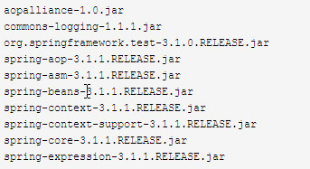
>>
>> 3、在src下新建一个config.propertites:
>>                         author_name=lee
>>
>> 4、新建一个文件夹config；
>>
>> 5、新建一个app.conf：
>>              project_info=项目
>>
>> 6.新建一个spring配置文件applicationContext.xml：
>>
>> 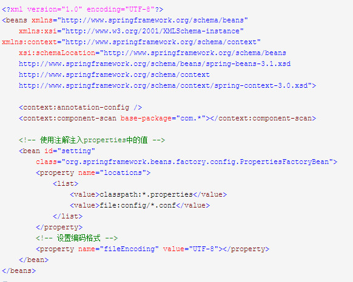
>>
>> 7.新建一个获取属性配置文件属性的类ConfigProperty.java：
>>
>> 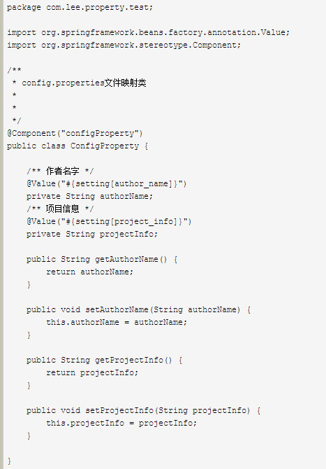
>>
>> 8.新建测试类：
>>
>> 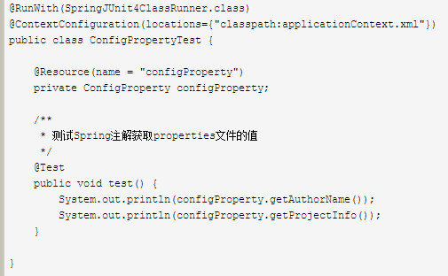

> 总结：
>>1.使用org.springframework.beans.factory.config.PropertiesFactoryBean获取属性的方式是：
>>
>> 
>
>>2.使用
>>
>> 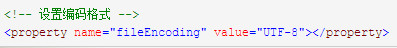
>>
>> 主要为了解决属性文件中value为中文时乱码的问题。


## spring管理属性配置文件properties——使用PropertyPlaceholderConfigurer

> org.springframework.beans.factory.config.PropertiesFactoryBean 管理属性文件
>
> org.springframework.beans.factory.config.PropertyPlaceholderConfigurer也可以管理配置文件。
>
>> 1.在上一个项目(spring_test)的基础上新建spring配置文件applicationContext2.xml：
>>
>> 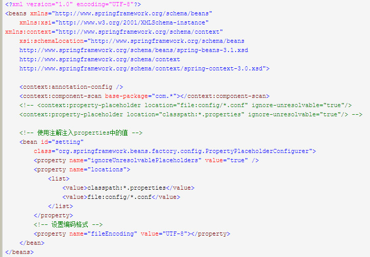
>>
>> 2.修改ConfigProperty.java：
>>
>> 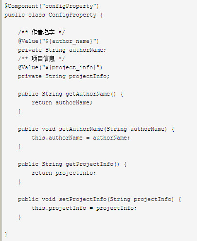
>> 
>> 3.新建测试类：
>>
>> 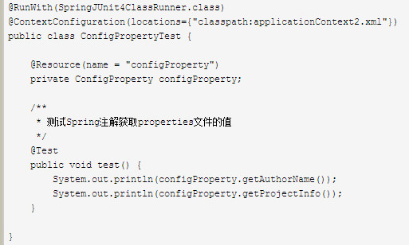

> 总结：
>
>> 1.使用PropertiesFactoryBean管理属性文件获取属性的方式：
>>
>>
>>
>> 和org.springframework.beans.factory.config.PropertiesFactoryBean有点不同；
>>
>> 2.在spring配置文件中，对于bean的配置有这样一个配置：
>>
>> 
>>
>> 这个主要是为了解决抛出cannot be resolved的异常。

**小结：**

+ PropertiesFactoryBean 是PropertiesLoaderSupport 直接的实现类， 专门用来管理properties文件的工厂bean，默认是单例的；

+  PropertyPlaceholderConfigurer 是 解决 properties 文件占位符问题的，也实现了 PropertiesLoaderSupport 类。

在java 代码里，一般是使用@Value注解来引用 properties 文件的属性:

使用 <font color=red size=4>PropertyPlaceholderConfigurer </font>时， @Value表达式的用法是 `@Value(value="${properties key}")`; 

使用 <font color=green size=4>PropertiesFactoryBean </font>时，我们还可以用@Value 读取 properties对象的值， @Value 用法 是 `@Value(value="#{configProperties['properties key']}")`

```xml
    <bean id="configProperties"
        class="org.springframework.beans.factory.config.PropertiesFactoryBean">
        
        <property name="locations">
            <list>
                <value>classpath:/config/jdbc.properties</value>
                <value>classpath:/config/base.properties</value>
            </list>
        </property>
    </bean>
    
    <!-- 属性文件读入 -->
    <bean id="propertyConfigurer"
        class="org.springframework.beans.factory.config.PropertyPlaceholderConfigurer">
        <property name="properties" ref="configProperties" />
    </bean>
```
```java
@Value(value="${profit.rate.csProfitRate}")
double rate = 0.9;
    
@Value(value="#{configProperties['profit.rate.csProfitRate']}")
double rate2 = 0.9;
```

 


# Spring注解方式注入Bean 究竟应该选择哪种?

问题：Spring用注解方式注入Bean有三种形式，分别是：@Resource，@Autowired和@Inject这三者究竟该选择哪种才好呢？


# 如何用Spring读取JAR中的文件

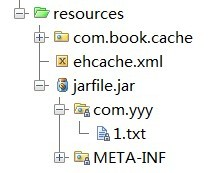

<font color=red> 使用如下方式读取JAR中的文件出错 </font>

如上所示，com/yyy/1.txt放在jarfile.jar中。 
   我原来使用如下的方式读取这个JAR中的文件：

```java
@Test  
public void usingSpringMethod() throws Throwable {  
    PathMatchingResourcePatternResolver patternResolver = new PathMatchingResourcePatternResolver();  
    Resource[] resources = patternResolver.getResources("com/yyy/1.txt");  
    if (resources !=  && resources.length > 0) {  
        File file = resources[0].getFile();//<---①  
        FileInputStream inputStream = new FileInputStream(file);  
        InputStreamReader inputStreamReader = new InputStreamReader(inputStream);  
        char[] data = new char[100];  
        inputStreamReader.read(data);  
        assertEquals((new String(data)).trim(), "ddddd");  
    }  
}  
```
  运行后，抛出异常，其问题出在①处，原因是:<font color=red>JAR中的文件无法以File方式返回，而只有在文件系统中的类资源才可以以File的形式返回。 </font>
   但是，不管是文件系统中的类资源，还是JAR中的类资源文件，都可以以流的形式读取，因此，如上的代码调整一下就正常了： 
```java
@Test  
public void usingSpringMethod() throws Throwable {  
    PathMatchingResourcePatternResolver patternResolver = new PathMatchingResourcePatternResolver();  
    Resource[] resources = patternResolver.getResources("com/yyy/1.txt");//<--②  
    if (resources !=  && resources.length > 0) {  
        InputStreamReader inputStreamReader = new InputStreamReader(resources[0].getInputStream());//<---①  
        char[] data = new char[100];  
        inputStreamReader.read(data);  
        assertEquals((new String(data)).trim(), "ddddd");  
    }  
}  
```
上面①处，使用resource[0].getInputStream()代替原来的
引用
```java
resources[0].getFile()
```

>方式1： 

```java
Resource[] resources = patternResolver.getResources("classpath:com/yyy/1.txt");
```

>方式2:

```java
Resource[] resources = patternResolver.getResources("classpath*:com/yyy/1.txt"); 
```

**直接原生的JDK方式读取**
   Spring对资源路径的表达方式非常灵活，这是我们首选使用Spring加载资源的原因。当然，使用JDK原生的ClassLoader也可以加载JAR中的资源文件，如下所示： 
```
@Test  
public void usingJDKMethod() throws Throwable {  
    URL url = getClass().getClassLoader().getResource("com/yyy/1.txt");//<--①  
    InputStreamReader inputStreamReader = new InputStreamReader(url.openStream());  
    char[] data = new char[100];  
    inputStreamReader.read(data);  
    assertEquals((new String(data)).trim(), "ddddd");  
} 
```
唯一的限制是，在①处不再支持classpath:或classpath*:的前缀了。

## Spring 的 Java 配置方式

Spring 的java配置方式是通过 `@Configuration` 和 `@Bean` 这两个注解实现的

1) <font color=red size=3>`@Configuration`作用于类上，相当于一个xml配置文件</font>

2) <font color=red size=3>`@Bean` 作用于方法上，相当于xml配置中的`<bean>`</font>

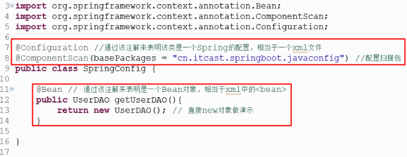

## 读取外部的资源配置文件

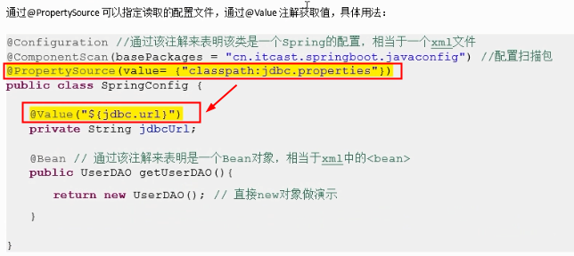

延伸1：如何配置多个配置文件？

`@PropertySource(value={"classpath:jdbc.properties"," ", " "})` --解决方案

延伸2：如果配置的配置文件不存在会怎样？

`@PropertySource(value={"classpath:jdbc.properties"},ignoreResourceNotFound =true )` --解决方案


## Spring-国际化信息MessageSource接口

场景：开发一个支持多国语言的Web应用系统，要求能够根据客户端系统的语言类型返回对应的界面。

典型的i18国际化问题： 简单的来讲就是为每种语言提供一套相应的资源文件，并以规范化命名的方式保存在特定的目录中，由系统自动根据客户端语言选择合适的资源文件。

**国际化信息也称为本地化信息**

Java通过`java.util.Locale`类表示一个本地化对象，它允许通过语言参数和国家/地区参数创建一个确定的本地化对象。

**1、ResourceBoundle**

如果应用系统中某些信息需要支持国际化功能，则必须为希望支持的不同本地化类型分别提供对应的资源文件，并以规范的方式进行命名。

```
<资源名>_<语言代码>_<国家/地区代码>.properties   //其中，语言代码和国家/地区代码都是可选的.
```

**2、spring 提供 MessageSource 接口**

spring定义了访问国际化信息的MessageSource接口，并提供了几个易用的实现类.

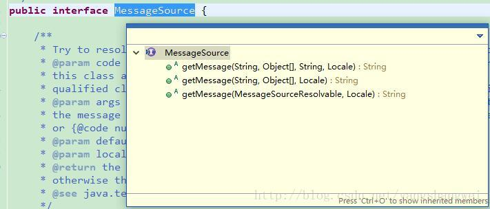

+ String getMessage(String code, Object[] args, String defaultMessage, Locale locale) 
code表示国际化资源中的属性名；args用于传递格式化串占位符所用的运行期参数；当在资源找不到对应属性名时，返回defaultMessage参数所指定的默认信息；locale表示本地化对象；

+ String getMessage(String code, Object[] args, Locale locale) throws NoSuchMessageException;

与上面的方法类似，只不过在找不到资源中对应的属性名时，直接抛出NoSuchMessageException异常；

+ String getMessage(MessageSourceResolvable resolvable, Locale locale) throws NoSuchMessageException;

MessageSourceResolvable 将属性名、参数数组以及默认信息封装起来，它的功能和第一个接口方法相同。

`HierarchicalMessageSource`接口最重要的两个实现类是 
`ResourceBundleMessageSource` 和`ReloadableResourceBundleMessageSource`。

+ ResourceBundleMessageSource

该实现类允许用户通过beanName指定一个资源名（包括类路径的全限定资源名），或通过beanNames指定一组资源名.

+ ReloadableResourceBundleMessageSource

该实现类比之于ResourceBundleMessageSource的唯一区别在于它可以定时刷新资源文件，以便在应用程序不重启的情况下感知资源文件的变化。很多生产系统都需要长时间持续运行，系统重启会给运行带来很大的负面影响。这时，通过该实现类就可以解决国际化信息更新的问题

**3、容器级的国际化信息资源**
我们查看ApplicationContext中的源码可以看到,ApplicationContext 实现了 MessageSource 接口。
```
public interface ApplicationContext extends EnvironmentCapable, ListableBeanFactory, HierarchicalBeanFactory,
        MessageSource, ApplicationEventPublisher, ResourcePatternResolver
```

在一般情况下，国际化信息资源应该是容器级。我们一般不会将MessageSource作为一个Bean注入到其他的Bean中，相反MessageSource作为容器的基础设施向容器中所有的Bean开放。

国际化信息一般在系统输出信息时使用，如Spring MVC的页面标签，控制器Controller等，不同的模块都可能通过这些组件访问国际化信息，因此Spring就将国际化消息作为容器的公共基础设施对所有组件开放。

Spring根据反射机制从BeanDefinitionRegistry中找出名称为“messageSource”且类型为org.springframework.context.MessageSource的Bean，将这个Bean定义的信息资源加载为容器级的国际化信息资源.


## Spring Bean装配

**Spring配置的可选方案** 

+ 在XML中进行显示配置
+ 在Java中进行显示配置
+ 隐式的Bean发现机制和自动装配
	+ 组件扫描 （component scanning):Spring会发现应用上下文中所创建的Bean
	+ 组件装配 （autowiring):Spring自动满足Bean之间的依赖

我建议尽可能的使用自动配置的机制。显示配置越少越好。如果必须要使用显示配置，我推荐使用类型安全并且比XML更加强大的JavaConfig，最后再使用XML配置。


### 自动化装配Bean

Spring从两个角度来实现自动化装配：

**组件扫描（component scanning):** Spring会发现应用上下文中所创建的Bean
**组件装配（autowiring):** Spring自动满足Bean之间的依赖

组件扫描和自动装配组合一起就能发挥强大的威力，他们能够将你的显示配置降低到最小。

实现自动化装配有两种方式：（组件扫描默认是不启动的）

1）通过`XML`启用组件扫描

首先在mvc-config.xml中启动组件扫描功能，并用base-package属性指定扫描范围。再通过在需要注解的class上添加`@Controller`、`@Service`、`@Repository`、`@Component`等注解

```
<context:component-scan base-package="com.xxxx.controller"/>
```

2）通过`@ComponentScan`注解启用组件扫描

**@ComponentScan主要就是定义扫描的路径从中找出标识了需要装配的类自动装配到spring的bean容器中**

首先在class上使用@ComponentScan启用组件扫描。此外：`@ComponentScan(basePackages="conf")` 等同于 `@ComponentScan("conf")` ，然后通过在需要注解的class上添加 `@Controller`、`@Service`、`@Repository`、`@Component`等注解。
```
@ComponentScan
public class AppConfig {
	......
}
```

对于`@ComponentScan`可以通过 `basePackages`或者 `basePackageClasses`指定扫描范围，等同于 XML 注解中的 `base-package` 属性；如果不指定扫描范围，则默认扫描当前类所在包以及子包的所有类。当然Craig Walls建议使用basePackageClasses ，因为如果代码重构的话这种方式会立马发现错误，下面是basePackageClasses 的使用方式（指定基础扫描类）：
```
@Configuration
@ComponentScan(basePackageClasses = { CDPlayer.class, DVDPlayer.class})
public class SoundSystemConfig {
	//...
}
```

使用 `@Autowired` 可以为bean实现自动装配，@Autowired可以使用在构造函数、Setter方法、普通方法和成员变量上。
```
// 用法一：
@Autowired
MessageSend messageSend;

// 用法二：（构造函数也一样，主要是函数参数的依赖）
@Autowired
public void setMessageSend(MessageSend messageSend) {
     this.messageSend = messageSend;
}
```

设置 `@Autowired(required=false)` 时，Spring尝试执行自动装配，但是如果没有匹配的bean则忽略，但是这种情况故意出现空指针异常NullPointerException。@Autowired注解可以使用@Inject替换，@component可以使用@Named注解替换，后者是源于Java依赖注入规范。

## 通过Java代码装配

大部分的场景自动化装配 Bean 是满足要求的，但是在一些特殊场景下自动化装配Bean是无法满足要求的，**比如说要将第三方的组件装配到自己的应用中，因为没有方法将`@component`或者`@Autowired`注解放置在它们的类上。**但是你仍然可以采用显示装配方式：Java代码装配和XML配置。

首先需要创建配置类，创建配置类的关键是使用 `@Configuration` 注解来表明这个类是一个配置类，该类包涵Spring上下文中如何创建Bean的细节。

声明一个简单Bean：在Java的配置类中编写一个带有@Bean注解的方法
```
@Bean
public UserServiceImpl userService(){
    return new UserServiceImpl();
}
```

默认情况下Bean的ID是方法名，也可以指定Bean的ID：`@Bean(name="userService")`，如果有依赖可以使用下面这些的方式来实现：
```
@Bean
public UserServiceImpl userService(){
   return new UserServiceImpl(userDao());
}

@Bean
public UserDaoImpl userDao(){
   return new UserDaoImpl();
}
```

## 通过XML装配Bean

XML装配Bean的方式，虽然已经不推荐了，但是还是我们最早使用的一种Bean装配的方式。
```
<bean id="myFile" class="com.wxh.config.MyFile"></bean>
```
借助构造器（使用构造函数）注入初始化Bean的方式有两个：

- `<constructor-arg>`元素
- 使用Spring3中引入的c命名空间

```
<!-- 下面是使用<constructor-arg>元素方式注入Bean -->
<bean id="myFile" class="com.wxh.config.MyFile">
   <constructor-arg ref="fileProperty"></constructor-arg>
</bean>

<!-- 下面是使用Spring3.0中引入的c-命名空间方式注入Bean -->
<bean id="myFile-c" class="com.wxh.config.MyFile"
    c:fileProperty-ref="fileProperty" c:count="0"></bean>
```

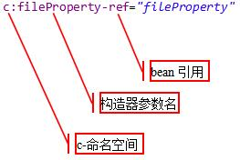
