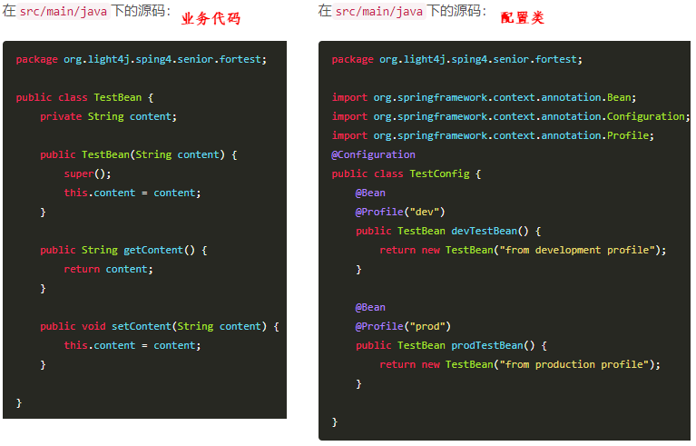
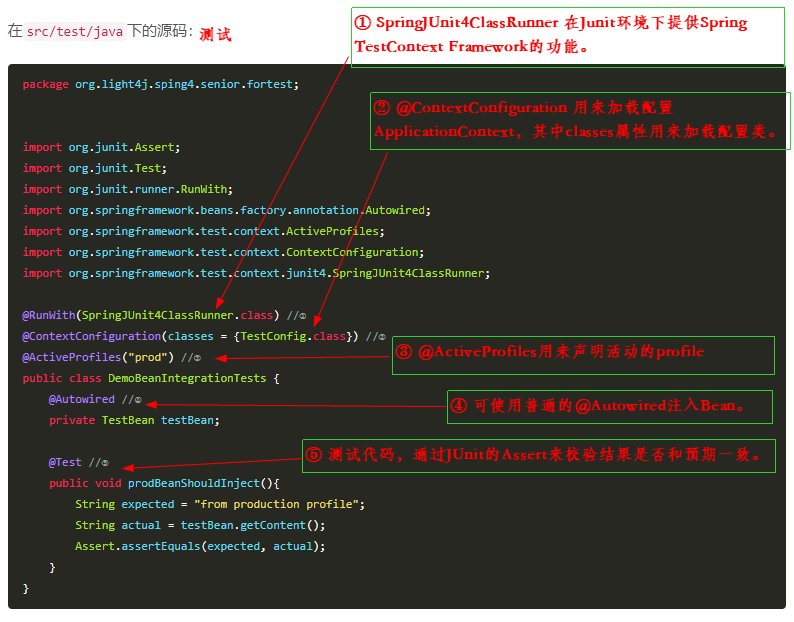
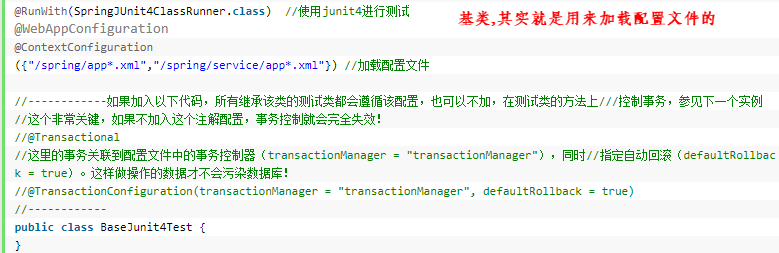
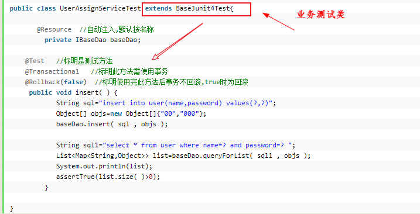

# Spring环境下的集成测试

测试是开发工作中不可缺少的部分，单元测试只针对当前开发的类和方法进行测试，可以简单通过模拟依赖来实现，对运行环境没有依赖；但是仅仅单元测试是不够的，它只能验证当前类或者方法能否正常工作，而我们想要知道系统的各个部分组合在一起是否能够正常工作，这就涉及到了集成测试。

集成测试一般需要来自不同层的不同对象的交互，如`数据库`，`网络连接`，`Ioc容器`等。其实我们也经常通过运行程序，然后通过自己操作来完成类似于集成测试的流程。集成测试为我们提供了一种无须部署或运行程序来完成验证系统各部分功能是否能正常协同工作的能力。

Spring 通过` Spring TestContext Framework `对集成测试提供顶级支持。它不依赖特定的测试框架，即可使用Junit，也可使用TestNG。

基于`maven`构建的项目结构默认有关于测试的目录是:src/test/java(测试代码)，src/test/resources(测试资源)，它们区别于src/main/java(项目源码)，src/main/resource(项目资源)。

Spring 提供了一个` SpringJUnit4ClassRunner `类，它提供了`Spring TestContext Framework`的功能。通过`@ContextConfiguration`来配置Application Context (测试Spring容器环境，需要构造)，通过`@ActiveProfiles`确定活动的profile。

+ **@ContextConfiguration**
+ **@ActiveProfiles**

添加依赖 -- 增加Spring测试的依赖包到maven
```
<dependency>
    <groupId>org.springframework</groupId>
    <artifactId>spring-test</artifactId>
    <version>${spring-framework.version}</version>
</dependency>
<dependency>
    <groupId>junit</groupId>
    <artifactId>junit</artifactId>
    <version>4.11</version>
</dependency>
```




# SpringMVC下的web测试

测试web项目，通常需要模拟一些servlet对象，如：

+ MockMVC
+ MockHttpServletRequest
+ MockHttpServletResponse
+ MockHttpSession

在Spring里，我们使用` @WebAppConfiguration `指定加载的ApplicationContext是一个WebAppConfiguration。

# Spring对Controller、Sservice、Dao进行JUnit单元测试总结

所有用Junit进行单元测试，都需要下面的配置

```
@RunWith(SpringJUnit4ClassRunner.class)
@ContextConfiguration(locations = {"classpath:applicationContext.xml"})
```

​`applicationContext.xml` 是整个项目的Spring的配置文件。包括`数据源配置`、`MVC配置`和各种Bean的注册扫描。如果你是多个文件，就用都好隔开写多个，像这样
```
{ "classpath:applicationContext.xml" , "classpath:servlet-context.xml" }
```

**如果只用Junit进行单元测试导致出现很多的不足**，如：
+ 1) 导致多次Spring容器初始化问题。

虽然初始化Spring容器的速度并不会太慢，但由于可能会在Spring容器初始化时执行加载Hibernate映射文件等耗时的操作，如果每执行一个测试方法都必须重复初始化Spring容器，则对测试性能的影响是不容忽视的。 那解决方案就是使用`Spring测试套件`,Spring容器只会初始化一次！

+ 2) 需要使用硬编码方式手工获取Bean。

在测试用例类中我们需要通过ctx.getBean()方法从Spirng容器中获取需要测试的目标Bean，并且还要进行强制类型转换的造型操作。这种乏味的操作迷漫在测试用例的代码中，让人觉得烦琐不堪。使用`Spring测试套件`，测试用例类中的属性会被自动填充Spring容器的对应Bean ，无须在手工设置Bean！ 

+ 3) 数据库现场容易遭受破坏

测试方法对数据库的更改操作会持久化到数据库中。虽然是针对开发数据库进行操作，但如果数据操作的影响是持久的，可能会影响到后面的测试行为。举个例子，用户在测试方法中插入一条ID为1的User记录，第一次运行不会有问题，第二次运行时，就会因为主键冲突而导致测试用例失败。所以应该既能够完成功能逻辑检查，又能够在测试完成后恢复现场，不会留下“后遗症”。使用`Spring测试套件`，Spring会在你验证后，自动回滚对数据库的操作，保证数据库的现场不被破坏，因此重复测试不会发生问题！ 

+ 4) 不方便对数据操作正确性进行检查 

假如我们向登录日志表插入了一条成功登录日志，可是我们却没有对t_login_log表中是否确实添加了一条记录进行检查。一般情况下，我们可能是打开数据库，肉眼观察是否插入了相应的记录，但这严重违背了自动测试的原则。试想在测试包括成千上万个数据操作行为的程序时，如何用肉眼进行检查？ 只要你`继承Spring的测试套件的用例类`，你就可以通过jdbcTemplate在同一事务中访问数据库，查询数据的变化，验证操作的正确性！






1) Dao层的单元测试

2) Service层的单元测试与Dao层基本一致，把Service注入进来调用就行。

3) Controller层的单元测试
