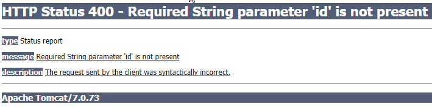

# 异常

## autowire异常三个情况

autowire异常主要由三个情况发生的像上面的情况是BrandDao没有注入，

1、你的BrandServiceImpl必须以@Service或@Component注解才行。
 
2、自动写入的时候把接口写成实现类了

	@Autowired 
	private BrandServiceImpl  brandServiceImpl; 
	
	应该是 
	
	@Autowired 
	private BrandService    brandService ;


 
3.在BrandDao 类上加上@Repository注解

4、就是使用 hibernate 的注解和 jpa的注解冲突了也会造成。


------------------------------------------------

## Spring的注入基于接口实现，基于接口的方式一是可以使得各个组件松耦合，而且也可以轻松的替代某一组件。


	下面是Controller组件：
	@Controller
	public class ManageUserController {
	    private UserService userService;
	   
	    @Autowired   //此处自动注入userService
	    public void setUserService(UserService userService) {
	        this.userService = userService;
	    }
	   .....
	}
	
	其中Service组件为：
	@Transactional
	@Service("userService")
	public class UserService implements UserServiceInf {
	    private UserDao userDao;
	   
	   
	    @Autowired
	    public void setUserDao(UserDao userDao) {
	        this.userDao = userDao;
	    }
	
	   
	    public void createUser(User user) {
	        this.userDao.createUser(user);
	    }
	  ....
	}


### 所以应该讲组件引用改为接口方式。

Controller组件中的userService组件应
由：private UserService userService;
改为： private UserServiceInf userService;

同理Service组件中的userDao组件应
由： private UserDao userDao;
改为： private UserDaoInf userDao;

## SpringMVC Restful风格的PUT、DELETE传参异常？

<font color=red size=3>RESTful模式来开发程序，用到PUT、DELETE模式提交数据，服务器端接受不到提交的数据（服务器端参数绑定没有加任何注解）</font>


**解决方案1：** 使用配置文件修改来实现Put和Delete请求的参数传递 
+ 解决Put请求的参数传递，但是 无法解决 `Delete` 请求的传递 
```xml
<!--在项目中的web.xml文件中配置-->
<filter>
      <filter-name>HttpMethodFilter</filter-name>
      <filter-class>org.springframework.web.filter.HttpPutFormContentFilter</filter-class>
</filter>
<filter-mapping>
     <filter-name>HttpMethodFilter</filter-name>
     <url-pattern>/*</url-pattern>
</filter-mapping>
```
+ 解决 `Put`和`Delete` 请求的参数传递
```xml
<!--在项目中的web.xml文件中配置-->
<filter>
    <filter-name>HiddenHttpMethodFilter</filter-name>
    <filter-class>org.springframework.web.filter.HiddenHttpMethodFilter</filter-class>
</filter>
<filter-mapping>
    <filter-name>HiddenHttpMethodFilter</filter-name>
    <!-- 备注，这边的名称必须和配置'springmvc'的servlet名称一样 -->
    <servlet-name>springmvc</servlet-name>    
</filter-mapping> 
```

**解决方案2：** 使用地址重写的方法来实现put、delete请求的参数传递
```js
$(editMember).on("click",function(){ 
        $.ajax({
            url : "member?empno=1009&ename=阿伦&sal=19777.77&hiredate=1969-10-10" ,   // 处理的请求路径
            type : "put" ,      // 此处发送的是PUT请求（可变更为其他需要的请求）
            dataType : "json" , // 返回的数据类型为json类型
            success : function(data) {
                $(showDiv).append("<p>修改处理结果：" + data.flag + "</p>") ;
            } ,
            error : function(data) {
                $(showDiv).append("<p>对不起，出错啦！</p>") ;
            } 
        }) ;
    }) ;
```

> @RequestMapping

&nbsp;&nbsp; RequestMapping是一个用来处理请求地址映射的注解，可用于类或方法上。用于类上，表示类中的所有响应请求的方法都是以该地址作为父路径。

<font color=red size=4>`@RequestParam` 或者 `@RequestBody` 注解仅适用于GET或POST请求，并不适用于PUT和DELETE。</font>如果是PUT方式提交啊，spring mvc并不会解析请求体的参数。但是这个问题可以通过配置`HttpPutFormContentFilter`解决。
```xml
<!-- 
	通过 HttpPutFormContentFilter 源代码发现，这个filter会解析请求体的参数，然后把这些参数封装到一个新的HttpServletRequest参数里，并把这个新的HttpServletRequest传入到下一个filter。

	通过这种方法，@RequestParam注解可以正常使用了。 
-->
<filter>  
	<filter-name>httpPutFormFilter</filter-name>  
	<filter-class>org.springframework.web.filter.HttpPutFormContentFilter</filter-class>  
</filter>  
<filter-mapping>  
	<filter-name>httpPutFormFilter</filter-name>  
	<servlet-name>appServlet</servlet-name>  
</filter-mapping>  

<servlet>  
	<servlet-name>appServlet</servlet-name>  
	<servlet-class>org.springframework.web.servlet.DispatcherServlet</servlet-class>  
	<init-param>  
		<param-name>contextConfigLocation</param-name>  
		<param-value>classpath:spring-config.xml</param-value>  
	</init-param>  
	<load-on-startup>1</load-on-startup>  
</servlet>
```


**RequestMapping注解六个属性：**

1) value ，methpod
  + value： 指定请求的实际地址，指定的地址可以是URI Template 模式（
  + method: 指定请求的method类型， <fonr color=green size=3>GET、POST、PUT、DELETE等</font>；

2) consumes ， products
  + consumes: 指定处理请求的提交内容类型（Content-Type），例如application/json, text/html
  + produces: 指定返回的内容类型，仅当request请求头中的(Accept)类型中包含该指定类型才返回；

3) params ， headers

 + params： 指定request中必须包含某些参数值是，才让该方法处理。
 + headers： 指定request中必须包含某些指定的header值，才能让该方法处理请求。

> @RequestParam  @RequestBody  @PathVariable  等参数绑定注解详解

1) @PathVariable 

2) @RequestHeader,@CookieValue
  
	`@RequestHeader` 注解，可以把Request请求header部分的值绑定到方法的参数上。
  
	`@CookieValue` 可以把Request header中关于cookie的值绑定到方法的参数上。

3) @RequestParam, @RequestBody
    `@RequestParam ` 

  	  A) 常用来处理简单类型的绑定,通过Request.getParameter( ) 获取的String可直接转换为简单类型的情况.

	  B) 用来处理Content-Type: 为 `application/x-www-form-urlencoded`编码的内容，提交方式`GET、POST`;

	  C) 该注解有两个属性： value、required； value用来指定要传入值的id名称，required用来指示参数是否必须绑定；

   `@RequestBody`
   
   	  A) 该注解常用来处理Content-Type: <font color=red >不是application/x-www-form-urlencoded编码的内容</font>，例如`application/json, application/xml`等；
	  

 4) @SessionAttributes, @ModelAttribute
	
   `@SessionAttributes` 该注解用来绑定HttpSession中的attribute对象的值，便于在方法中的参数里使用。该注解有value、types两个属性，可以通过名字和类型指定要使用的attribute 对象；

   `@ModelAttribute` 该注解有两个用法，一个是用于方法上，一个是用于参数上；


