# SpringMVC 源码解读

## Spring MVC 源码分析

**1、入口时servlet(struts2 的入口时filter)**
		
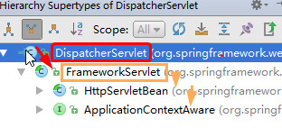

**2、SpringMVC核心分发器DispatcherServlet分析**

**HttpServletBean**

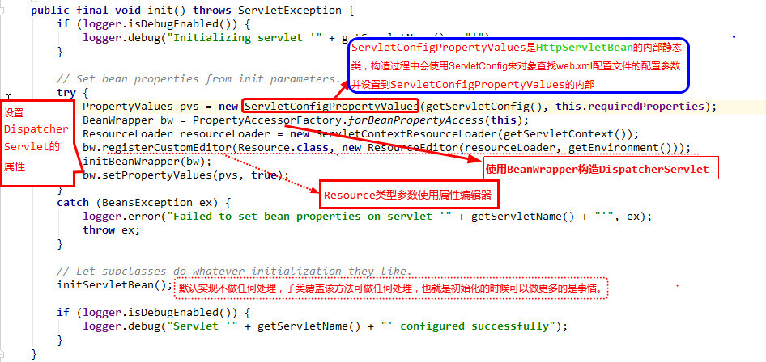
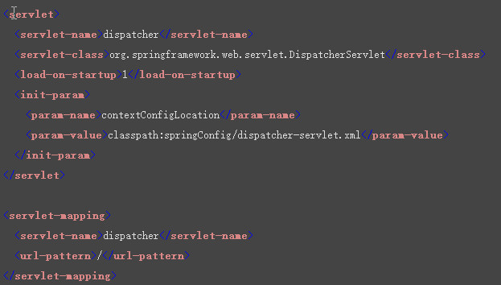

比如上面这段配置，传递了contextConfigLocation参数，之后构造BeanWrapper，这里使用BeanWrapper，有2个理由：
	1、contextConfigLocation属性在FrameworkServlet中定义，HttpServletBean中未定义       
	2. 利用Spring的注入特性，只需要调用setPropertyValues方法就可将contextConfigLocation属性设置到对应实例中，也就是以依赖注入的方式初始化属性。

然后设置DispatcherServlet中的contextConfigLocation属性(FrameworkServlet中定义)为web.xml中读取的contextConfigLocation参数，该参数用于构造SpringMVC容器上下文。

**FrameworkServlet这个类，FrameworkServlet继承自HttpServletBean，重写initServletBean方法**

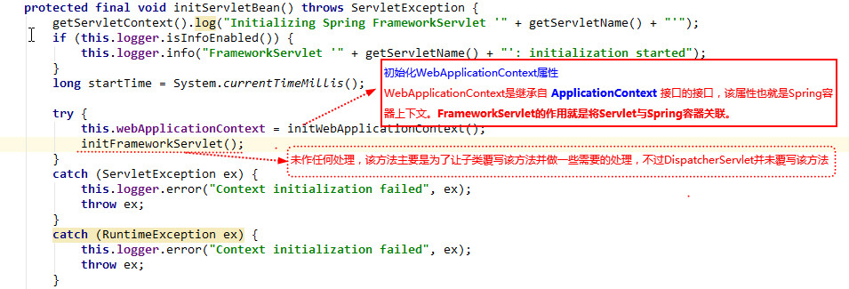

**接下来看下initWebApplicationContext方法的具体实现逻辑：**

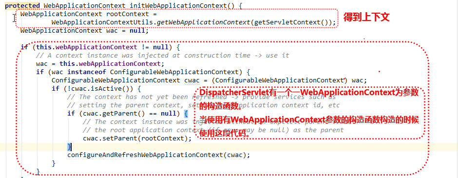
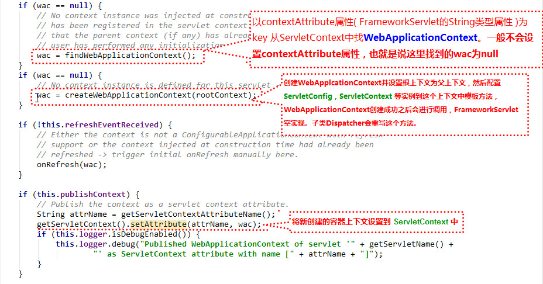

**这里的根上下文是web.xml中配置的ContextLoaderListener监听器中根据contextConfigLocation路径生成的上下文。**

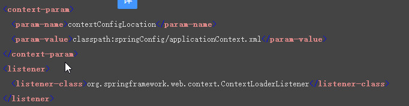

**最后看下DispatcherServlet。
DispatcherServlet覆写了FrameworkServlet中的onRefresh方法：**

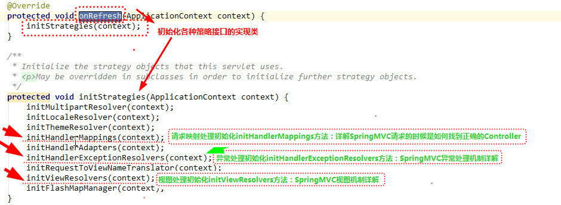

<pre style="color:blue;">
总结一下各个Servlet的作用：
1. HttpServletBean
　　主要做一些初始化的工作，将web.xml中配置的参数设置到Servlet中。比如servlet标签的子标签init-param标签中配置的参数。
2. FrameworkServlet
　　将Servlet与Spring容器上下文关联。其实也就是初始化FrameworkServlet的属性webApplicationContext，这个属性代表SpringMVC上下文，它有个父类上下文，既web.xml中配置的ContextLoaderListener监听器初始化的容器上下文。
3. DispatcherServlet 
　　初始化各个功能的实现类。比如异常处理、视图处理、请求映射处理等。
</pre>

**3、DispatcherServlet处理请求过程**

* servlet的请求过程
	
	HttpServlet提供了service方法用于处理请求，service使用了**模板设计模式**，在内部对于http get方法会调用doGet方法，http post方法调用doPost方法...........

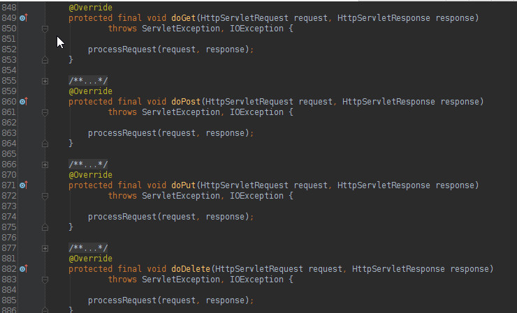
	进入processRequest方法看下：

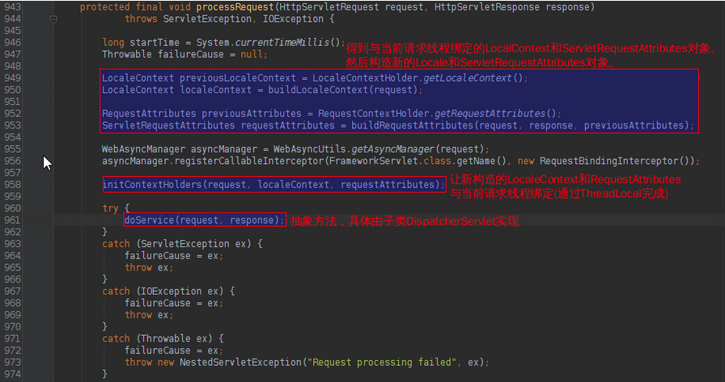
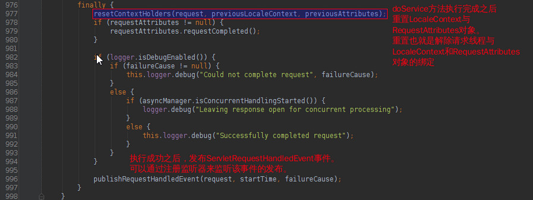

其中注册的监听器类型为ApplicationListener接口类型。
继续看DispatcherServlet覆写的doService方法：

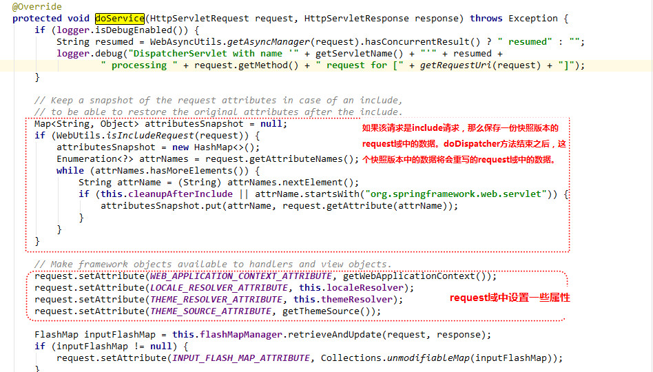
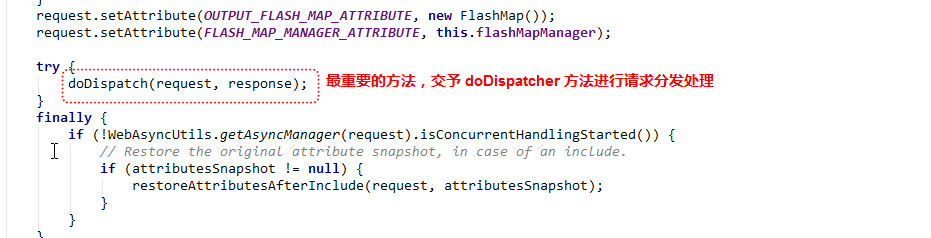

<pre style="color:blue;">
最终就是doDispatch方法。
	doDispatch方法功能简单描述一下：
	首先根据请求的路径找到HandlerMethod(带有Method反射属性，也就是对应Controller中的方法)，然后匹配路径对应的拦截器，有了HandlerMethod和拦截器构造个HandlerExecutionChain对象。HandlerExecutionChain对象的获取是通过HandlerMapping接口提供的方法中得到。有了HandlerExecutionChain之后，通过HandlerAdapter对象进行处理得到ModelAndView对象，HandlerMethod内部handle的时候，使用各种HandlerMethodArgumentResolver实现类处理HandlerMethod的参数，使用各种HandlerMethodReturnValueHandler实现类处理返回值。 最终返回值被处理成ModelAndView对象，这期间发生的异常会被HandlerExceptionResolver接口实现类进行处理。
</pre>

[总结]
	
	本文分析了SpringMVC入口Servlet -> DispatcherServlet的作用，其中分析了父类HttpServletBean以及FrameworkServlet的作用。

	SpringMVC的设计与Struts2完全不同，Struts2采取的是一种完全和Web容器隔离和解耦的机制，而SpringMVC就是基于最基本的request和response进行设计。

**4、springmvc 请求时，如何找到正确的controller**

	springmvc到底如何处理请求与Controller之间的映射关系；如使用浏览器通过地址 http://ip:port/contextPath/path
在spring-web中，从3.1就引入一个封装了**方法参数、方法注解，方法返回值**等众多元素的类

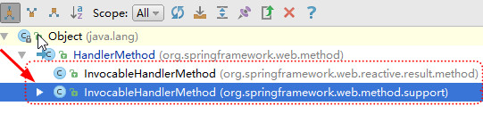

Web服务器启动的时候，SpringMVC到底做了什么？请看springmvc的 org.springframework.web.servlet.handler.**AbstractHandlerMethodMapping**;

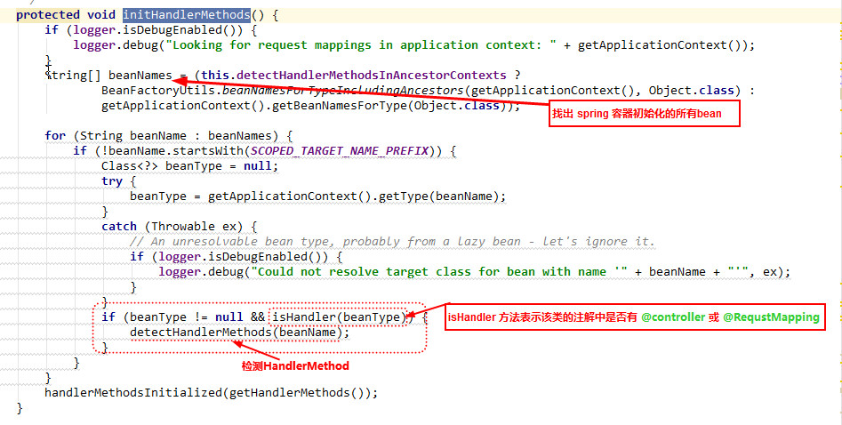
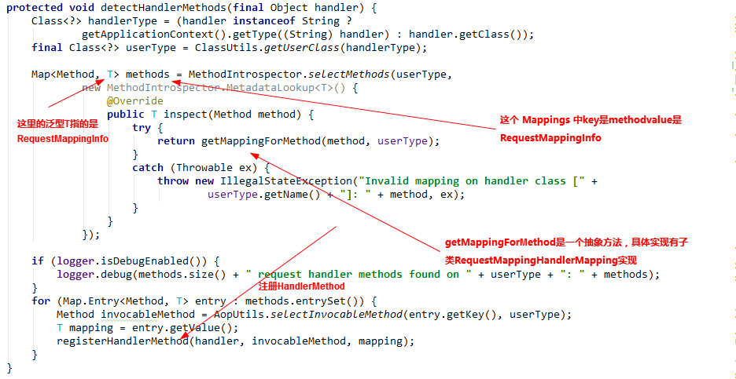
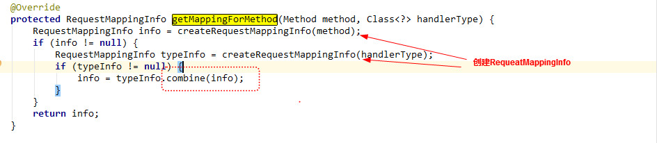

# Spring整合Junit4进行单元测试

## 加入依赖包
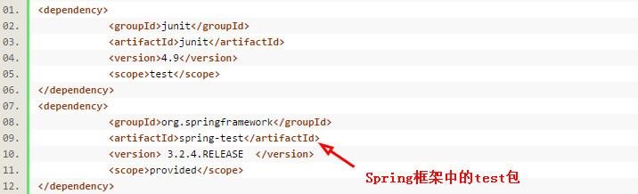

## 创建测试类
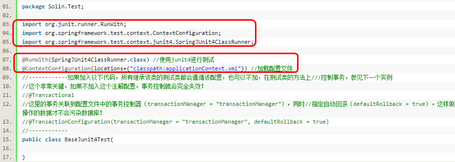

【解释下用到的注解:	】
	
@RunWith： 用于指定junit运行环境，是junit提供给其他框架测试环境接口扩展，为了便于使用spring的依赖注入，spring提供了org.springframework.test.context.junit4.SpringJUnit4ClassRunner作为Junit测试环境     

@ContextConfiguration({"classpath:applicationContext.xml","classpath:spring/buyer/applicationContext-service.xml"})    
导入配置文件，这里我的applicationContext配置文件是根据模块来分类的。如果有多个模块就引入多个“`applicationContext-service.xml`”文件。如果所有的都是写在“`applicationContext.xml`”中则这样导入： 
`@ContextConfiguration(locations = "classpath:applicationContext.xml"`) 

@TransactionConfiguration(transactionManager = "transactionManager", defaultRollback = true)这里的事务关联到配置文件中的事务控制器（`transactionManager = "transactionManager"`），同时指定自动回滚（`defaultRollback = true`）。 这样做操作的数据才不会污染数据库！

@Transactional:这个非常关键，如果不加入这个注解配置，事务控制就会完全失效
AbstractTransactionalDataSourceSpringContextTests要想构建这一系列的无污染纯绿色事务测试框架就必须找到这个基类！（即所有事务均不生效）

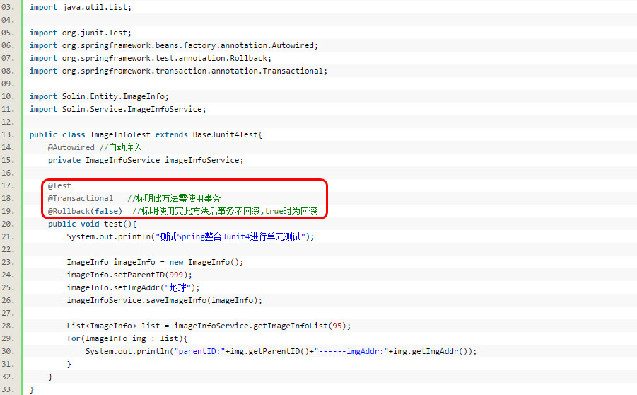

# Junit对Spring Controller进行单元测试

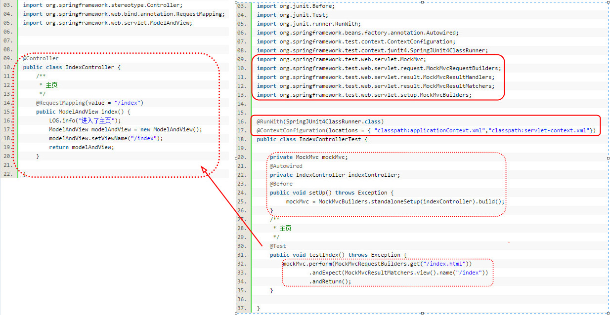

# 谈谈springmvc的优化
　　
上面我们已经对springmvc的工作原理和源码进行了分析,在这个过程发现了几个优化点:

+ 1.controller如果能保持单例,尽量使用单例,这样可以减少创建对象和回收对象的开销.也就是说,如果controller的类变量和实例变量可以以方法形参声明的尽量以方法的形参声明,不要以类变量和实例变量声明,这样可以避免线程安全问题.

+ 2.处理request的方法中的形参务必加上`@RequestParam`注解,这样可以避免springmvc使用asm框架读取class文件获取方法参数名的过程.即便springmvc对读取出的方法参数名进行了缓存,如果不要读取class文件当然是更加好.

+ 3.阅读源码的过程中,发现springmvc并没有对处理url的方法进行缓存,也就是说每次都要根据请求url去匹配controller中的方法url,如果把url和method的关系缓存起来,会不会带来性能上的提升呢?有点恶心的是,负责解析url和method对应关系的ServletHandlerMethodResolver是一个private的内部类,不能直接继承该类增强代码,必须要该代码后重新编译.当然,如果缓存起来,必须要考虑缓存的线程安全问题.

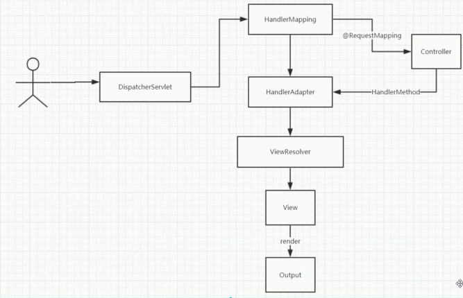