# springmvc 传参的种类 -- SpringMVC——接收请求参数和页面传参

## Spring MVC 的请求参数获取的几种方法（接收请求参数）

### 1、通过 @PathVariabl 注解获取路径中传递参数


     @RequestMapping(value = "/{id}/{str}") 
     public ModelAndView helloWorld(@PathVariable String id, 
             @PathVariable String str) { 
         System.out.println(id); 
         System.out.println(str); 
         return new ModelAndView("/helloWorld"); 
     } 


### 2、用@ModelAttribute注解获取POST请求的FORM表单数据

    ===》 等同于request.getAttribute()

JSP 

	 <form method="post" action="hao.do">     
		 a: <input id="a" type="text"   name="a"/>      
		 b: <input id="b" type="text"   name="b"/>     
		 <input type="submit" value="Submit" />     
	 </form>      

JAVA pojo 

	 public class Pojo{ 
	     private String a; 
	     private int b; 
	 }
     
JAVA controller 

```
     @RequestMapping(method = RequestMethod.POST) 
     public String processSubmit(@ModelAttribute("pojo") Pojo pojo) { 
         
         return "helloWorld"; 
     } 
```


### 3、直接用HttpServletRequest获取 

	案例1：
	     @RequestMapping(method = RequestMethod.GET) 
	     public String get(HttpServletRequest request, HttpServletResponse response) { 
	        System.out.println(request.getParameter("a")); 
	        return "helloWorld"; 
	     } 
	
	案例2：
	    @RequestMapping("/login.do")
	    public String login(HttpServletRequest request){
	        String name = request.getParameter("name")
	        String pass = request.getParameter("pass")
	    }


### 4、用注解@RequestParam绑定请求参数a到变量a 

当请求参数a不存在时会有异常发生,可以通过设置属性required=false解决, 
例如: @RequestParam(value="a", required=false) 

	JAVA 
	     @RequestMapping(value = "/requestParam", method = RequestMethod.GET) 
	     public String setupForm(@RequestParam("a") String a, ModelMap model) { 
	         System.out.println(a); 
	         return "helloWorld";
	    }
	
	Spring会自动将表单参数注入到方法参数，和表单的name属性保持一致。和Struts2一样
	    @RequestMapping("/login.do")
	    public String login(HttpServletRequest request,String name,
	                 @RequestParam("pass") String password) // 表单属性是pass,用变量password接收{
	        syso(name);
	        syso(password)
	    }

### 5、自动注入Bean属性


    <form action="login.do">
    用户名：<input name="name"/>
    密码：<input name="pass"/>
    <input type="submit" value="登陆">
    </form>

    //封装的User类
    public class User{
    private String name;
    private String pass;
    }
    

    @RequestMapping("/login.do")
    public String login(User user){
    syso(user.getName());
    syso(user.getPass());
    }

### @RequestParam、@RequestBody和@ModelAttribute区别

1、@RequestParam (org.springframework.web.bind.annotation.RequestParam)用于将指定的请求参数赋值给方法中的形参

GET和POST请求传的参数会自动转换赋值到@RequestParam 所注解的变量上

+ GET请求
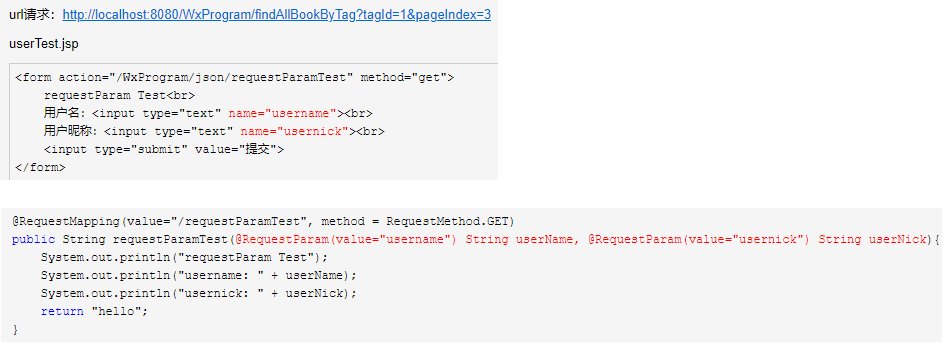

上述代码会将请求中的username参数的值赋给username变量。等价于：

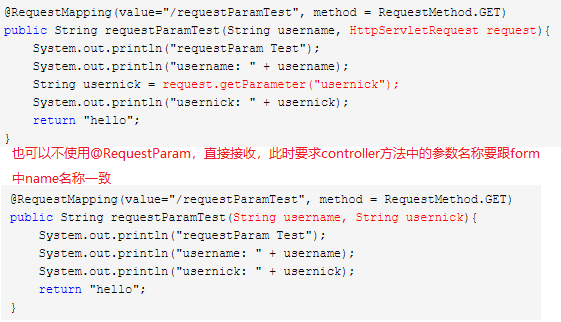

+ POST请求

跟get请求格式一样，只是把方法中的get换成post

`@RequestParam` 

用来处理Content-Type: 为 `application/x-www-form-urlencoded`编码的内容。提交方式为get或post。（Http协议中，如果不指定Content-Type，则默认传递的参数就是application/x-www-form-urlencoded类型）

RequestParam实质是将Request.getParameter() 中的Key-Value参数Map利用Spring的转化机制ConversionService配置，转化成参数接收对象或字段。

get方式中query String的值，和post方式中body data的值都会被Servlet接受到并转化到Request.getParameter()参数集中，所以@RequestParam可以获取的到。

2、@RequestBody

`@RequestBody`注解可以接收json格式的数据，并将其转换成对应的数据类型。

+ @RequestBody接收一个对象
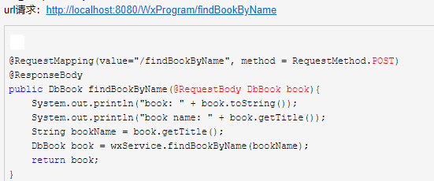

+ @RequestBody接收不同的字符串
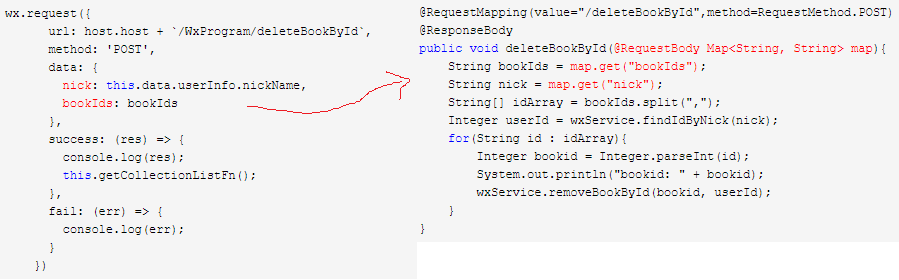

`@RequestBody`
处理HttpEntity传递过来的数据，一般用来处理非`Content-Type: application/x-www-form-urlencoded`编码格式的数据。

GET请求中，因为没有HttpEntity，所以@RequestBody并不适用。
POST请求中，通过HttpEntity传递的参数，必须要在请求头中声明数据的类型Content-Type，SpringMVC通过使用HandlerAdapter 配置的HttpMessageConverters来解析HttpEntity中的数据，然后绑定到相应的bean上。

@RequestBody用于post请求，不能用于get请求

**这里涉及到使用@RequestBody接收不同的对象**
 + 1. 创建一个新的entity，将两个entity都进去。这是最简单的，但是不够“优雅”。
 + 2. 用Map<String, Object>接受request body，自己反序列化到各个entity中。
 + 3. 类似方法2，不过更为generic，实现自己的HandlerMethodArgumentResolver。参考[这里](https://sdqali.in/blog/2016/01/29/using-custom-arguments-in-spring-mvc-controllers/)

 3、@ModelAttribute

 @ModelAttribute注解类型将参数绑定到Model对象


**当前台界面使用GET或POST方式提交数据时，数据编码格式由请求头的ContentType指定。分为以下几种情况：**
+ 1. `application/x-www-form-urlencoded`，这种情况的数据@RequestParam、@ModelAttribute可以处理，@RequestBody也可以处理。
+ 2. `multipart/form-data`，`@RequestBody`不能处理这种格式的数据。（form表单里面有文件上传时，必须要指定enctype属性值为`multipart/form-data`，意思是以二进制流的形式传输文件。）
+ 3. `application/json`、`application/xml`等格式的数据，必须使用@RequestBody来处理


## SpringMVC 的几种传参的方式

### 1、通过form表单的方式来传递参数

    这种方式重要适用于有多个参数需要传递到后台处理。并且这些字段在同一个实体类中。这样就可以通过表单
    序列化的方式。将整个对象包装起来，在整个运行过程中，数据可以以对象的方式来传递

### 2、通过json字符串传递

    可以在js中，将参数包装成data ={ providerid:”providerid”, providername:”providername” } 。后
    台取数据的时候通过通过在方法参数栏中写（String providerid,String providername）。但是必须保证
    json字符串中的键和形参参数一致。 

### 3、直接包装成map传递

    可以使用spring 的参数注入方式，将json字符串包装成一个map。通过 @RequestParam Map


## 向页面传值

当Controller组件处理后，向jsp页面传值，

1、使用HttpServletRequest 和 Session  然后setAttribute()，就和Servlet中一样

2、使用ModelAndView对象

3、使用ModelMap对象

4、使用@ModelAttribute注解

### Model数据会利用HttpServletRequest的Attribute传值到success.jsp中

    @RequestMapping("/login.do")
    public ModelAndView  login(String name,String pass){
        User user = userService.login(name,pwd);
        Map<String,Object> data = new HashMap<String,Object>();
        data.put("user",user);
        return new ModelAndView("success",data);
    }


### 使用ModelMap参数对象示例:

    ModelMap数据会利用HttpServletRequest的Attribute传值到success.jsp中

    @RequestMapping("/login.do")
    public　String login(String name,String pass ,ModelMap model){
        User user  = userService.login(name,pwd);
        model.addAttribute("user",user);
        model.put("name",name);
        return "success";
    }


### 使用@ModelAttribute示例

在Controller方法的参数部分或Bean属性方法上使用

@ModelAttribute数据会利用HttpServletRequest的Attribute传值到success.jsp中

    @RequestMapping("/login.do")
    public String login(@ModelAttribute("user") User user){
        //TODO
    return "success";
    }

    @ModelAttribute("name")
    public String getName(){
        return name;
    }


### Session存储：可以利用HttpServletReequest的getSession()方法

    @RequestMapping("/login.do")
    public String login(String name,String pwd
                                ModelMap model,HttpServletRequest request){
        User user = serService.login(name,pwd);
        HttpSession session = request.getSession();
        session.setAttribute("user",user);
        model.addAttribute("user",user);
        return "success";
    }

### Spring MVC 默认采用的是转发来定位视图，如果要使用重定向，可以如下操作

1，使用RedirectView

2，使用redirect:前缀

    public ModelAndView login(){
        RedirectView view = new RedirectView("regirst.do");
        return new ModelAndView(view);
    }
    或者用如下方法，工作中常用的方法：

    public String login(){
        //TODO
        return "redirect:regirst.do";
    }

=============================================================================

# spring mvc 几种返回方式


* 对于ModelAndView构造函数可以指定返回页面的名称，返回的是一个包含模型和视图的ModelAndView对象；


* 也可以通过ModelAndView的setViewName方法来设置所需要跳转的页面，返回的是一个包含模型和视图的ModelAndView对象；  

* 利用Model模型对象，主要包含spring封装好的model和modelMap,以及java.util.Map，当没有视图返回的时候视图名称将由requestToViewNameTranslator决定，返回的是model对象；响应的view应该也是该请求的view。等同于void返回。

* 返回String，通过model进行使用

* 通过配合@ResponseBody来将内容或者对象作为HTTP响应正文返回（适合做即时校验）；


```java
package com.boventech.learning.controller;
import java.util.HashMap;
import java.util.Map;
import org.springframework.stereotype.Controller;
import org.springframework.ui.Model;
import org.springframework.web.bind.annotation.RequestMapping;
import org.springframework.web.bind.annotation.RequestMethod;
import org.springframework.web.bind.annotation.RequestParam;
import org.springframework.web.bind.annotation.ResponseBody;
import org.springframework.web.servlet.ModelAndView;

import com.boventech.learning.entity.User;

/**
 * MVCReturn
 * @author peng.xia
 *
 */
@Controller
@RequestMapping("/MVCReturn")
public class SpringMVCReturnController {
	
	@RequestMapping(value="/index1",method=RequestMethod.GET)
    public ModelAndView index(){
        ModelAndView modelAndView = new ModelAndView("/user/index");
        modelAndView.addObject("name", "xxx");
        return modelAndView;
    }
	//对于ModelAndView构造函数可以指定返回页面的名称，也可以通过setViewName方法来设置所需要跳转的页面；
	
	@RequestMapping(value="/index2",method=RequestMethod.GET)
    public ModelAndView index2(){
        ModelAndView modelAndView = new ModelAndView();
        modelAndView.addObject("name", "xxx");
        modelAndView.setViewName("/user/index");
        return modelAndView;
    }
	//返回的是一个包含模型和视图的ModelAndView对象；
	
	/**
	 * Model一个模型对象，
	 * 主要包含spring封装好的model和modelMap,以及java.util.Map，
	 * 当没有视图返回的时候视图名称将由requestToViewNameTranslator决定； 
	 * @return
	 */
	@RequestMapping(value="/index3",method=RequestMethod.GET)
    public Map<String, String> index3(){
        Map<String, String> map = new HashMap<String, String>();
        map.put("1", "1");
        //map.put相当于request.setAttribute方法
        return map;
    }
	//响应的view应该也是该请求的view。等同于void返回。
	
	//返回String
	//通过model进行使用
	@RequestMapping(value="/index4",method = RequestMethod.GET)
    public String index(Model model) {
        String retVal = "user/index";
        User user = new User();
        user.setName("XXX");
        model.addAttribute("user", user);
        return retVal;
    }
	
	//通过配合@ResponseBody来将内容或者对象作为HTTP响应正文返回（适合做即时校验）；
	@RequestMapping(value = "/valid", method = RequestMethod.GET)
	@ResponseBody
    public String valid(@RequestParam(value = "userId", required = false) Integer userId,
            @RequestParam(value = "name") String name) {
        return String.valueOf(true);
    }
	//返回字符串表示一个视图名称，这个时候如果需要在渲染视图的过程中需要模型的话，就可以给处理器添加一个模型参数，然后在方法体往模型添加值就可以了，
	
	 
    @RequestMapping(method=RequestMethod.GET)
    public void index5(){
        ModelAndView modelAndView = new ModelAndView();
        modelAndView.addObject("xxx", "xxx");
    }
	//返回的结果页面还是：/type
	//这个时候我们一般是将返回结果写在了HttpServletResponse 中了，如果没写的话，
	//spring就会利用RequestToViewNameTranslator 来返回一个对应的视图名称。如果这个时候需要模型的话，处理方法和返回字符串的情况是相同的。

}
 
```

**小结：SpringMVC 中四种不同类型的返回值**

+ 1. ModelAndView

  以前前后端不分的情况下，ModelAndView 应该是最最常见的返回值类型了，现在前后端分离后，后端都是以返回 JSON 数据为主了。后端返回 ModelAndView 这个比较容易理解，开发者可以在 ModelAndView 对象中指定视图名称，然后也可以绑定数据。返回 ModelAndView ，最常见的两个操作就是指定数据模型+指定视图名 。

  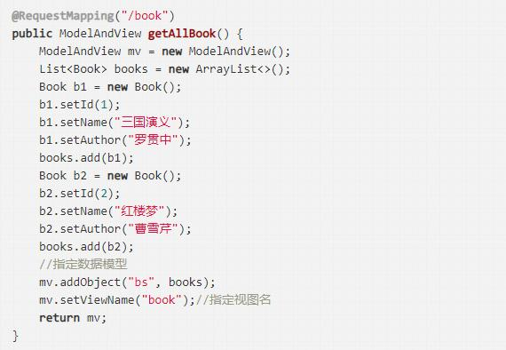

+ 2. Void

  返回值为 void 时，可能是你真的没有值要返回，也可能是你有其他办法
    + 没有值

      如果确实没有返回值，那就返回 void ，但是一定要注意，此时，方法上需要添加 @ResponseBody 注解，像下面这样
      
      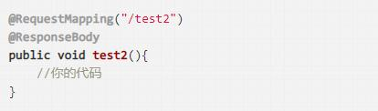

    + 重定向
    
      由于 SpringMVC 中的方法默认都具备 HttpServletResponse 参数，因此可以重拾 Servlet/Jsp 中的技能，可以实现重定向，像下面这样手动设置响应头

      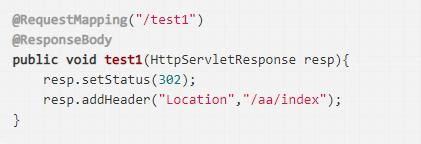

      也可以像下面这样直接调用重定向的方法：

      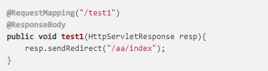
      当然，重定向无论你怎么写，都是 Servlet/Jsp 中的知识点，上面两种写法都相当于是重回远古时代。

    + 服务端跳转
    
      既然可以重定向，当然也可以服务端跳转，像下面这样：
      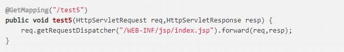

    + 返回字符串

      当然也可以利用 HttpServletResponse 返回其他字符串数据，包括但不局限于 JSON，像下面这样：

      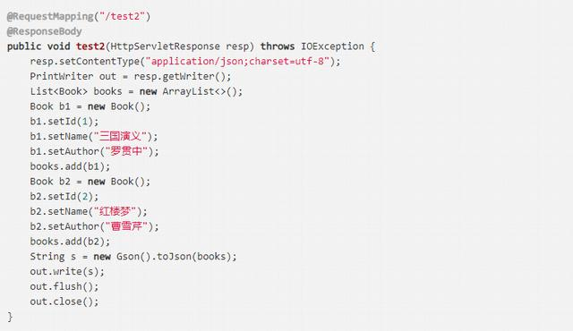
      这是返回值为 void 时候的情况，方法返回值为 void ，不一定就真的不返回了，可能还有其他的方式给前端数据。

+ 3. String

    当 SpringMVC 方法的返回值为 String 类型时，也有几种不同情况。

    + 逻辑视图名

      返回 String 最常见的是逻辑视图名，这种时候一般利用默认的参数 
    Model 来传递数据
      
      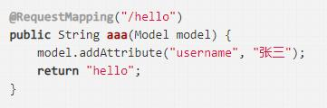

      此时返回的 hello 就是逻辑视图名，需要携带的数据放在 model 中
    
    + 重定向

      也可以重定向，事实上，如果在 SpringMVC 中有重定向的需求，一般采用这种方式

      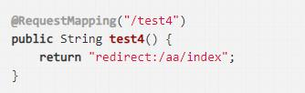

    + forward 转发

      也可以 forward 转发，事实上，如果在 SpringMVC 中有 forward 转发的需求，一般采用这种方式：

      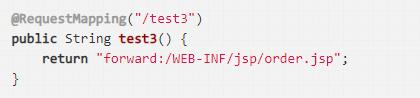

    + 真的是 String
      
      当然，也有一种情况，就是你真的想返回一个 String ，此时，只要在方法上加上 @ResponseBody 注解即可，或者 Controller 上本身添加的是组合注解 @RestController，像下面这样：

      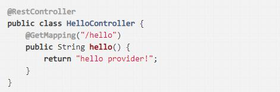
      
      也可以像下面这样 ：

      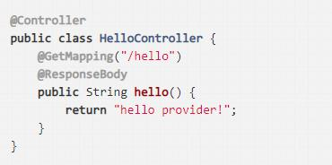

+ 4. JSON
    返回 JSON 算是最最常见的了，现在前后端分离的趋势下，大部分后端只需要返回 JSON 即可，那么常见的 List 集合、Map，实体类等都可以返回，这些数据由 HttpMessageConverter 自动转为 JSON ，如果大家用了 Jackson 或者 Gson ，不需要额外配置就可以自动返回 JSON 了，因为框架帮我们提供了对应的 HttpMessageConverter ，如果大家使用了 Alibaba 的 Fastjson 的话，则需要自己手动提供一个相应的 HttpMessageConverter 的实例，方法的返回值像下面这样：

    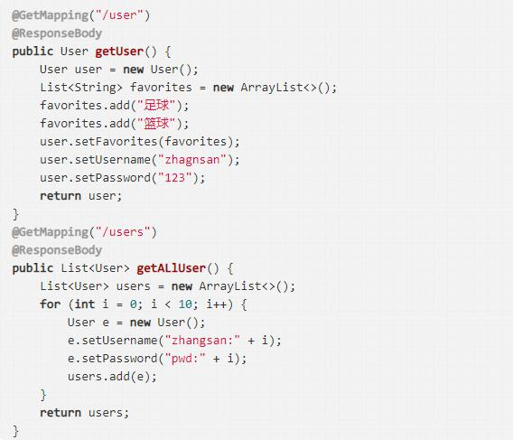

---------------------------------------------------------------------------------------------

# springMVC对于controller处理方法返回值的可选类型

对于springMVC处理方法支持支持一系列的返回方式：

1、ModelAndView

2、Model

3、ModelMap

4、Map

5、View

6、String

7、Void

## 具体介绍:(每个返回类型的特点)

### ModelAndView

````
	@RequestMapping(method=RequestMethod.GET)
	public ModelAndView index(){
	    ModelAndView modelAndView = new ModelAndView("/user/index");
	    modelAndView.addObject("xxx", "xxx");
	    return modelAndView;
	}
````
【备注：】对于ModelAndView构造函数可以指定返回页面的名称，也可以通过setViewName方法来设置所需要跳转的页面；
以下便是：返回的是一个包含模型和视图的ModelAndView对象；

````
	@RequestMapping(method=RequestMethod.GET)
	public ModelAndView index(){
	
	    ModelAndView modelAndView = new ModelAndView();
	
	    modelAndView.addObject("xxx", "xxx");
	
	    modelAndView.setViewName("/user/index");
	
	    return modelAndView;
	}

````


### Model

一个模型对象，主要包含spring封装好的model和modelMap,以及Java.util.Map，当没有视图返回的时候视图名称将由**requestToViewNameTranslator**决定；

### ModelMap 待续

### Map 响应的view应该也是该请求的view。等同于void返回。

	@RequestMapping(method=RequestMethod.GET)
	public Map<String, String> index(){
	    Map<String, String> map = new HashMap<String, String>();
	    map.put("1", "1");
	    //map.put相当于request.setAttribute方法
	    return map;
	}


### String 

* 对于String的返回类型，笔者是配合Model来使用的；
	
		
      @RequestMapping(method = RequestMethod.GET)
	    public String index(Model model) {
	        String retVal = "user/index";
	        List<User> users = userService.getUsers();
	        model.addAttribute("users", users);
	        return retVal;
	
	    }


* 或者通过配合@ResponseBody来将内容或者对象作为HTTP响应正文返回（适合做即时校验）；

		
		@RequestMapping(value = "/valid", method = RequestMethod.GET)
	    public @ResponseBody
	    String valid(@RequestParam(value = "userId", required = false) Integer userId, @RequestParam(value = "logName") String strLogName) {
	        return String.valueOf(!userService.isLogNameExist(strLogName, userId));
	    }


【备注：】返回字符串表示一个视图名称，这个时候如果需要在渲染视图的过程中需要模型的话，就可以给处理器添加一个模型参数，然后在方法体往模型添加值就可以了

### Void 当返回类型为Void的时候，则响应的视图页面为对应着的访问地址

	@Controller
	@RequestMapping(value="/type")
	public class TypeController extends AbstractBaseController{
	
		@RequestMapping(method=RequestMethod.GET)
		public void index(){
		    ModelAndView modelAndView = new ModelAndView();
		    modelAndView.addObject("xxx", "xxx");
		}
	
	}


返回的结果页面还是：/type

【备注】这个时候我们一般是将返回结果写在了HttpServletResponse 中了，如果没写的话，spring就会利用RequestToViewNameTranslator 来返回一个对应的视图名称。如果这个时候需要模型的话，处理方法和返回字符串的情况是相同的。

===================================================================================


# 常用框架 -SpringMVC环境搭建

框架  |说明
-----|-----
SpringMVC|相当于 Servlet 控制层
MyBatis|相当于 对数据库的数据处理 DAO
Spring|容器框架
Hibernate|相当于 对数据库的数据处理 DAO
Struts2|相当于Servlert 控制层

	框架:就是写好的工具类,你去遵循其规则的情况下使用

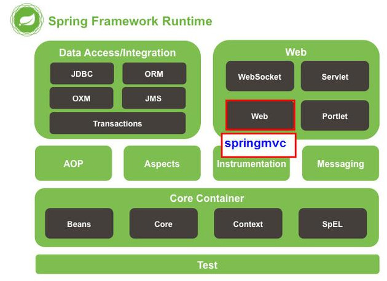

### 

**目录说明**

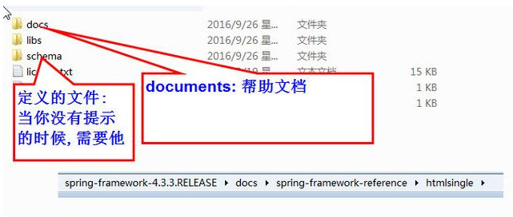

**通过配置web.xml加载DispatcherServlet**

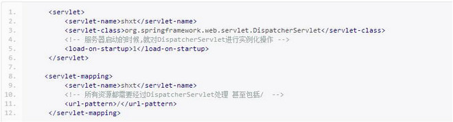


# 测试
## 利用junit对springMVC的Controller进行测试

> 场景：

&emsp;&emsp;平时对junit测试service/DAO层已经很熟悉不过了，如果不了解，可以猛戳这里，但是我们要测试controller层，不能总重启服务器吧，（重启tomcat好慢的飘过，别。。。别走啊），那么我们就用junit4模拟请求，测试controller层的方法。

> 方案1：直接Controller调用方法
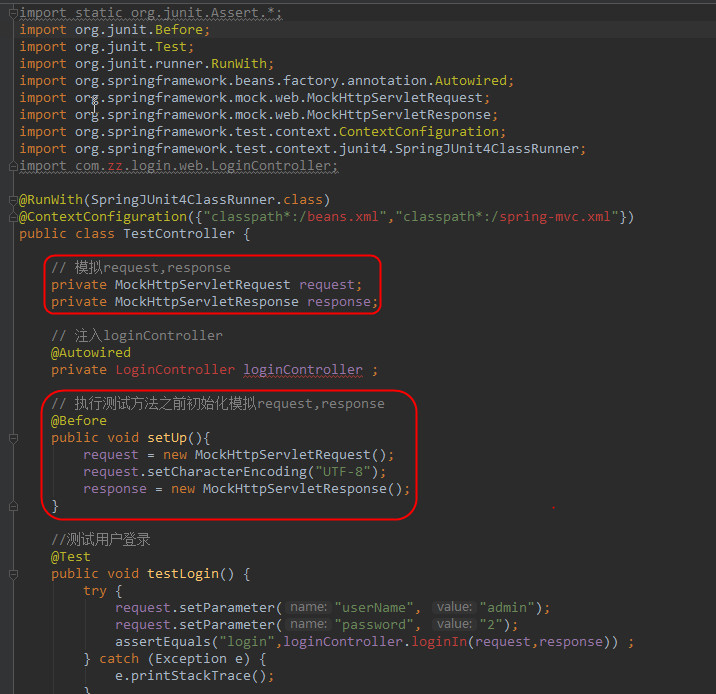

> 方案2：调用请求路径

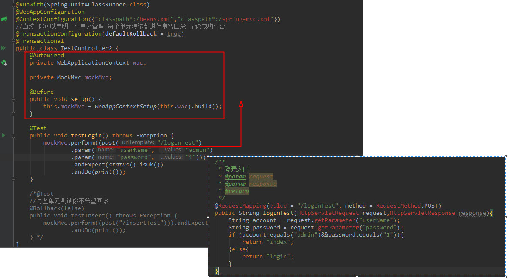

【总结：】			

&emsp;&emsp;为了测试<font size=3 color=red face="黑体">`Web`</font>项目通常不需要启动项目，我们需要一些<font size=3 color=red face="黑体">`Servlet`</font>相关的模拟对象，比如：<font size=3 color=red face="黑体">`MockMVC`，`MockHttpServletRequest`，`MockHttpServletResponse`，`MockHttpSession`</font>等。

&emsp;&emsp;在<font size=3 color=red face="黑体">`Spring`</font>里，我们使用<font size=3 color=red face="黑体">`@WebAppConfiguration`</font>指定加载的<font size=3 color=red face="黑体">`ApplicationContext`</font>是一个<font size=3 color=red face="黑体">`WebAppConfiguration`</font>。

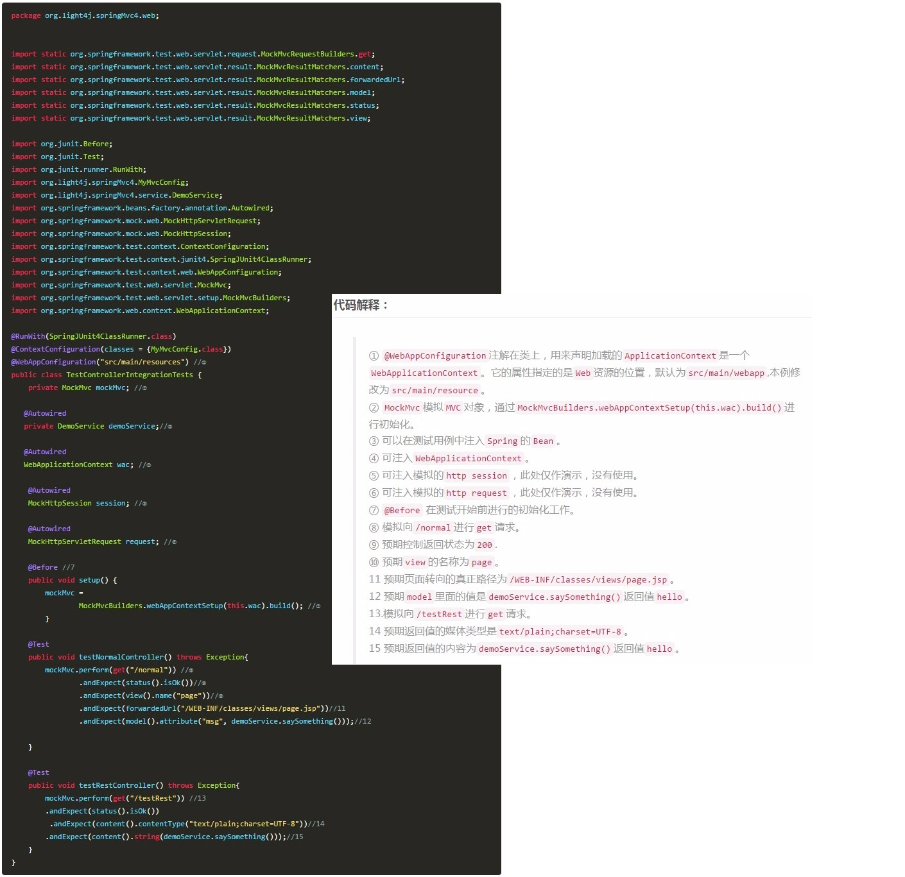

=============================================================================

## 配置Rest url-pattern的一点技巧

SpringMVC DispatcherServlet在配置Rest url-pattern的一点技巧

**场景：** SpringMVC的Controller中已经有了配置了`*.do`的方法，并且在web.xml中也配置了DispatcherServlet匹配；需要对外暴露Rest接口，URL格式如`/API/product/query`,怎么办？
```java
@RequestMapping(value = "detail.do", method = RequestMethod.GET) 
```
```xml
<url-pattern>*.do</url-pattern>
```

**解决方案：** 新增了DispatcherServlet匹配`<url-pattern>/API/*</url-pattern>`来拦截,需要将`Controller`中的`@RequestMapping(value = "/API/product/query", method = RequestMethod.GET)`中的"/API"去掉即可。
```xml
<url-pattern>/API/*</url-pattern>
```
```java
@RequestMapping(value = "/product/query", method = RequestMethod.GET)
```

# Servlet 3 + Spring MVC零配置：去除所有xml

在一些基于`Spring/Spring MVC`的Java Web项目中，总是会有一些xml配置文件，如`web.xml、applicationContext.xml`等，本文的目标即消灭这些xml配置文件，用代码和注解来代替。

要基于Servlet 3，所以首先需要准备支持Servlet 3的容器，例如Tomcat 7.0及以上版本、Jetty 8及以上版本。

## 1、去除web.xml

下面是一个典型的web.xml，包含Spring/Spring MVC的配置：

```xml
<?xml version="1.0" encoding="UTF-8"?>
<web-app xmlns="http://java.sun.com/xml/ns/javaee"
	xmlns:xsi="http://www.w3.org/2001/XMLSchema-instance"
	xsi:schemaLocation="http://java.sun.com/xml/ns/javaee http://java.sun.com/xml/ns/javaee/web-app_3_0.xsd"
	version="3.0">
 
	<context-param>
		<param-name>contextConfigLocation</param-name>
		<param-value>classpath:applicationContext.xml</param-value>
	</context-param>
	<servlet>
		<servlet-name>dispatcher</servlet-name>
		<servlet-class>org.springframework.web.servlet.DispatcherServlet</servlet-class>
		<init-param>
			<param-name>contextConfigLocation</param-name>
			<param-value>classpath:dispatcher-servlet.xml</param-value>
		</init-param>
		<load-on-startup>1</load-on-startup>
	</servlet>
	<servlet-mapping>
		<servlet-name>dispatcher</servlet-name>
		<url-pattern>/</url-pattern>
	</servlet-mapping>
	<listener>
		<listener-class>org.springframework.web.context.ContextLoaderListener</listener-class>
	</listener>
 
</web-app>
```
如何是去除`web.xml`文件，用`Java代码`代替它。

Spring MVC提供了一个接口`WebApplicationInitializer`，用于替代`web.xml`配置文件。实现该接口的类会在Servlet容器启动时自动加载并运行。

将以上xml文件转换成Java代码,此时便可删除web.xml：
```java
public class MyWebAppInitializer implements WebApplicationInitializer {
 
	/**
	 * Servlet容器启动时会自动运行该方法
	 */
	@Override
	public void onStartup(ServletContext servletContext) throws ServletException {
 
		servletContext.setInitParameter("contextConfigLocation", "classpath:applicationContext.xml");
 
		ServletRegistration.Dynamic registration = 
                servletContext.addServlet("dispatcher", new DispatcherServlet());
		registration.setLoadOnStartup(1);
		registration.addMapping("/");
		registration.setInitParameter("contextConfigLocation", "classpath:dispatcher-servlet.xml");
 
		servletContext.addListener(new ContextLoaderListener());
	}
}
```

## 2、去除Spring MVC配置文件dispatcher-servlet.xml

一个典型的Spring MVC配置文件如下：
```xml
<?xml version="1.0" encoding="UTF-8"?>
<beans xmlns="http://www.springframework.org/schema/beans"
    xmlns:context="http://www.springframework.org/schema/context"
    xmlns:mvc="http://www.springframework.org/schema/mvc"
    xmlns:xsi="http://www.w3.org/2001/XMLSchema-instance"
    xsi:schemaLocation="
        http://www.springframework.org/schema/beans
        http://www.springframework.org/schema/beans/spring-beans.xsd
        http://www.springframework.org/schema/context
        http://www.springframework.org/schema/context/spring-context.xsd
        http://www.springframework.org/schema/mvc
        http://www.springframework.org/schema/mvc/spring-mvc.xsd">
 
    <mvc:annotation-driven />
     
    <context:component-scan base-package="com.xxg.controller" />
     
    <bean id="jspViewResolver" class="org.springframework.web.servlet.view.InternalResourceViewResolver">
        <property name="prefix" value="/WEB-INF/jsp/" />
        <property name="suffix" value=".jsp" />
    </bean>
     
</beans>
```
为此,Spring提供了`@Configuration`注解用于替代`xml配置文件`，`@Bean注解`可以替代xml中的`<bean>`来创建bean。

将以上xml配置文件转换成Java代码：
```java
@Configuration
@EnableWebMvc
@ComponentScan(basePackages = "com.xxg.controller")
public class WebConfig {
	
	@Bean
	public InternalResourceViewResolver internalResourceViewResolver() {
		InternalResourceViewResolver viewResolver = new InternalResourceViewResolver();
		viewResolver.setPrefix("/WEB-INF/jsp/");
		viewResolver.setSuffix(".jsp");
		return viewResolver;
	}
}
```

## 3、去除Spring配置文件applicationContext.xml

Spring的配置文件中内容可能会比较多，并且不同的项目会有不同的配置，以下提供了一个简单的配置：
```xml
<?xml version="1.0" encoding="UTF-8"?>
<beans xmlns="http://www.springframework.org/schema/beans"
	xmlns:context="http://www.springframework.org/schema/context"
	xmlns:xsi="http://www.w3.org/2001/XMLSchema-instance"
	xsi:schemaLocation="http://www.springframework.org/schema/beans
        http://www.springframework.org/schema/beans/spring-beans.xsd
        http://www.springframework.org/schema/context
        http://www.springframework.org/schema/context/spring-context.xsd">
 
	<context:component-scan base-package="com.xxg">
		<context:exclude-filter type="annotation" expression="org.springframework.stereotype.Controller" />
	</context:component-scan>
	
	<context:property-placeholder location="classpath:config.properties"/>
	
	<bean id="myDataSource" class="org.apache.commons.dbcp.BasicDataSource" destroy-method="close">
	    <property name="driverClassName" value="${jdbc.driverClassName}"/>
	    <property name="url" value="${jdbc.url}"/>
	    <property name="username" value="${jdbc.username}"/>
	    <property name="password" value="${jdbc.password}"/>
	</bean>
 
</beans>
```
其中数据库的相关配置从config.properties配置文件读取：
```
jdbc.driverClassName=com.mysql.jdbc.Driver
jdbc.url=jdbc:mysql://localhost:3306/mydb
jdbc.username=root
jdbc.password=123456
```

将以上xml配置转换成Java代码：

```java
@Configuration
@ComponentScan(basePackages = "com.xxg", excludeFilters = {@Filter(value = Controller.class)})
public class AppConfig {
     
    @Value("${jdbc.driverClassName}")
    private String driverClassName;
     
    @Value("${jdbc.url}")
    private String url;
 
    @Value("${jdbc.username}")
    private String username;
 
    @Value("${jdbc.password}")
    private String password;
 
    @Bean(destroyMethod = "close")
    public DataSource dataSource() {
        BasicDataSource dataSource = new BasicDataSource();
        dataSource.setDriverClassName(driverClassName);
        dataSource.setUrl(url);
        dataSource.setUsername(username);
        dataSource.setPassword(password);
        return dataSource;
    }
    
    /**
     * 必须加上static
     */
    @Bean
    public static PropertyPlaceholderConfigurer loadProperties() {
        PropertyPlaceholderConfigurer configurer = new PropertyPlaceholderConfigurer();
        ClassPathResource resource = new ClassPathResource("config.properties");
        configurer.setLocations(resource);
        return configurer;
    }
}

```
除了上面的方法外，`加载properties配置文件`还可以使用`@PropertySource注解`，Java代码也可以这样写：

```java
@Configuration
@ComponentScan(basePackages = "com.xxg", excludeFilters = {@Filter(value = Controller.class)})
@PropertySource("classpath:config.properties")
public class AppConfig {
	
    @Value("${jdbc.driverClassName}")
    private String driverClassName;
	
    @Value("${jdbc.url}")
    private String url;
 
    @Value("${jdbc.username}")
    private String username;
 
    @Value("${jdbc.password}")
    private String password;
 
    @Bean(destroyMethod = "close")
    public DataSource dataSource() {
    	BasicDataSource dataSource = new BasicDataSource();
    	dataSource.setDriverClassName(driverClassName);
    	dataSource.setUrl(url);
    	dataSource.setUsername(username);
    	dataSource.setPassword(password);
    	return dataSource;
    }
    
    /**
     * 必须加上static
     */
    @Bean
    public static PropertySourcesPlaceholderConfigurer loadProperties() {
    	PropertySourcesPlaceholderConfigurer configurer = new PropertySourcesPlaceholderConfigurer();
        return configurer;
    }
}
```

以上两种Java编码方式选择其中一种即可。
## 4、修改MyWebAppInitializer.java

完成以上步骤后，就可以去掉`dispatcher-servlet.xml`和`applicationContext.xm`l等Spring配置文件，用Java代码替代了。

此时，第1步中的MyWebAppInitializer.java需要修改，不再读取xml配置文件，而是加载@Configuration注解的Java代码来配置Spring：

```java
public class MyWebAppInitializer implements WebApplicationInitializer {
 
    /**
     * Servlet容器启动时会自动运行该方法
     */
    @Override
    public void onStartup(ServletContext servletContext) throws ServletException {
         
        AnnotationConfigWebApplicationContext rootContext = new AnnotationConfigWebApplicationContext();
        rootContext.register(AppConfig.class);
        servletContext.addListener(new ContextLoaderListener(rootContext));
         
        AnnotationConfigWebApplicationContext webContext = new AnnotationConfigWebApplicationContext();
        webContext.register(WebConfig.class);
        ServletRegistration.Dynamic registration = 
               servletContext.addServlet("dispatcher", new DispatcherServlet(webContext));
        registration.setLoadOnStartup(1);
        registration.addMapping("/");
    }
}
```