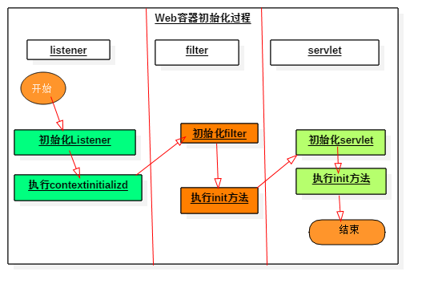
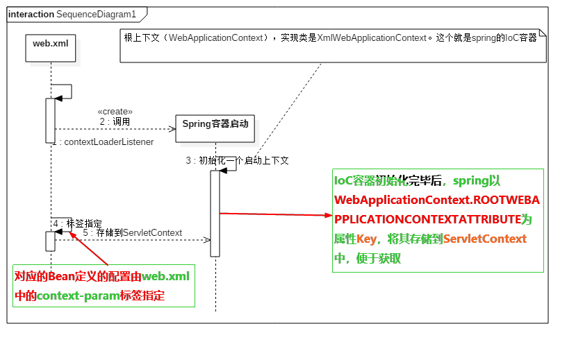
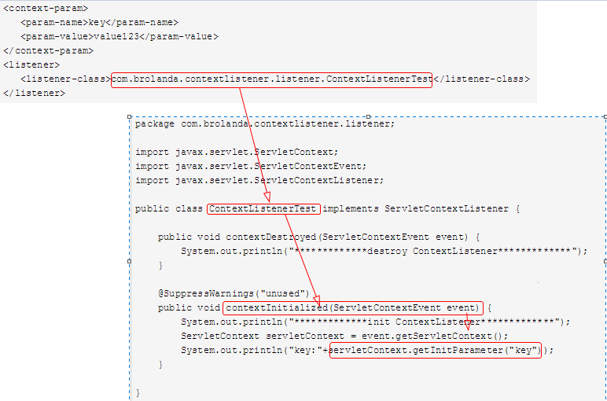
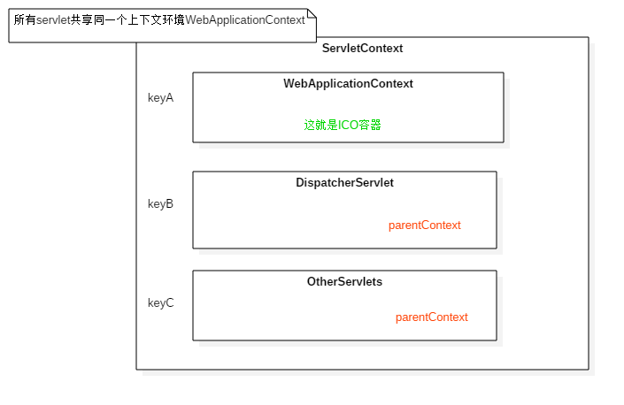
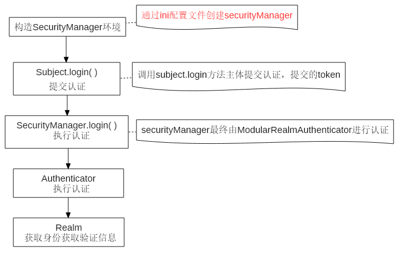
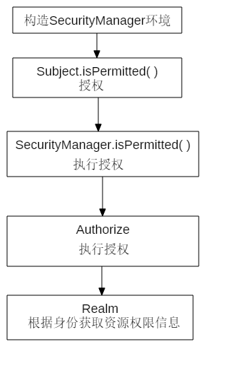
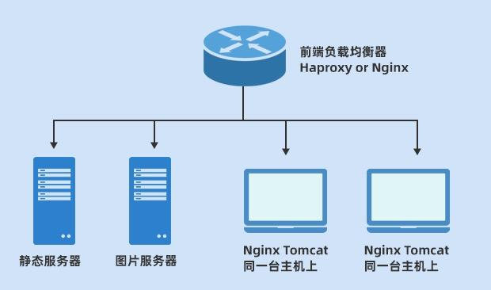

# 容器一说

基于servlet标准API,出现了<font  face="黑体" color=#FF768C>Tomcat、jetty、JBoss等web容器</font>和<font  face="黑体" color=#FF768C >weblogic、websphere等应用服务器（也叫商业服务器）</font>


&nbsp;&nbsp; 上图可以看出 Tomcat 的容器分为四个等级，真正管理 Servlet 的容器是 Context 容器，一个 Context 对应一个 Web 工程。在 Tomcat 的配置文件中可以很容易发现这一点，如下：
```xml
<Context path="/projectOne "
      docBase="D:\projects\projectOne" reloadable="true" />
```
## Web 容器、Spring 容器、SpringMVC容器

ServletContext是由Servlet容器初始化的，spring初始化得到`WebApplicationContext`


## Web容器启动过程


**步骤：**
+ 1.启动一个WEB项目的时候,容器(如:Tomcat)会去读它的配置文件`web.xml`.读两个节点: `<listener></listener>` 和 `<context-param></context-param>`

+ 2.紧接着,容器创建一个`ServletContext(上下文)`。在该应用内全局共享。
+ 3.容器将`<context-param></context-param>`转化为键值对,并交给`ServletContext`.
+ 4.容器创建<listener></listener>中的类实例,即创建监听.该监听器必须实现自ServletContextListener接口
+ 5.在监听中会有`contextInitialized(ServletContextEvent event)`初始化方法。(可调用 ServletContext.getInitParameter()获取配置)
```
//在这个方法中获得
ServletContext = ServletContextEvent.getServletContext();`

“context-param的值” = ServletContext.getInitParameter("context-param的键");
```
+ 6.得到这个`context-param`的值之后,你就可以做一些操作了.注意,这个时候你的WEB项目还没有完全启动完成.这个动作会比所有的Servlet都要早.换句话说,这个时候,你对`<context-param>`中的键值做的操作,将在你的WEB项目完全启动之前被执行.

**web.xml中可以定义两种参数：**
```java
    一个是全局参数(ServletContext)，通过<context-param></context-param>
    一个是servlet参数，通过在servlet中声明 
            <init-param>
                  <param-name>param1</param-name>
                  <param-value>avalible in servlet init()</param-value>   
            </init-param> 
```
<font  face="黑体" color=#FF768C>第一种参数在servlet里面可以通过getServletContext().getInitParameter("context/param")得到</font>

<font  face="黑体" color=#FF768C>第二种参数只能在servlet的init()方法中通过this.getInitParameter("param1")取得</font>

## Spring 启动过程（基于Web容器）

web容器提供其一个全局的上下文环境(ServletContext),为spring IoC容器提供宿主环境。(<font  face="黑体" color=#FF768C>javaEE标准规定了，`servlet容器` 需要在应用项目启动时，给应用项目初始化一个ServletContext作为公共环境容器存放公共信息。ServletContext中的信息都是由容器提供的。</font>)


**步骤：**

+ 步骤1： web容器启动时，找到配置文件中(`web.xml`)的`context-param`作为键值对放到ServletContext中
+ 步骤2： 然后找到listener，容器调用它的`contextInitialized(ServletContextEvent event)`方法，执行其中的操作（模拟调用）



+ 步骤3：【spring上下文容器配置】spring为我们提供了实现`ServletContextListener`接口的上下文初始化监听器：`org.springframework.web.context.ContextLoaderListener`。实际如下配置即可：
```xml
<context-param>
    <param-name>contextConfigLocation</param-name>
    <param-value>
      /WEB-INF/applicationContext.xml,
      /WEB-INF/action-servlet.xml,
      /WEB-INF/jason-servlet.xml
    </param-value>
</context-param>
<listener>
    <listener-class>org.springframework.web.context.ContextLoaderListener</listener-class>
</listener>
```



在整合SpringMVC,把controller交个SpringMVC容器管理。spring配置使用<font  face="黑体" color=#FF768C size=4>`<context:exclude-filter>`(applicationContext.xml中排除controller),而在`spring-mvc.xml`中incloud这个controller</font>

## shiro 的原理和运行流程

> 认证过程



**认证执行流程**
+ 1、通过ini配置文件创建securityManager
+ 2、调用subject.login方法主体提交认证，提交的token
+ 3、securityManager进行认证，securityManager最终由ModularRealmAuthenticator进行认证。
+ 4、ModularRealmAuthenticator调用IniRealm(给realm传入token) 去ini配置文件中查询用户信息
+ 5、IniRealm根据输入的token（UsernamePasswordToken）从 shiro.ini查询用户信息，根据账号查询用户信息（账号和密码）
  + 如果查询到用户信息，就给ModularRealmAuthenticator返回用户信息（账号和密码）
  + 如果查询不到，就给ModularRealmAuthenticator返回null

+ 6、ModularRealmAuthenticator接收IniRealm返回Authentication认证信息
  + 如果返回的认证信息是null，ModularRealmAuthenticator抛出异常（`org.apache.shiro.authc.UnknownAccountException`）
  + 如果返回的认证信息不是null（说明inirealm找到了用户），对IniRealm返回用户密码 （在ini文件中存在）
         和 token中的密码 进行对比，如果不一致抛出异常（`org.apache.shiro.authc.IncorrectCredentialsException`）

> 授权流程



**授权流程**
+ 1、对subject进行授权，调用方法`isPermitted（"permission串"）`
+ 2、SecurityManager执行授权，通过ModularRealmAuthorizer执行授权
+ 3、ModularRealmAuthorizer执行realm（自定义的Realm）从数据库查询权限数据调用realm的授权方法：`doGetAuthorizationInfo`
+ 4、realm从数据库查询权限数据，返回ModularRealmAuthorizer
+ 5、ModularRealmAuthorizer调用PermissionResolver进行权限串比对
+ 6、如果比对后，isPermitted中"permission串"在realm查询到权限数据中，说明用户访问permission串有权限，否则 没有权限，抛出异常。

## Tomcat 、Nginx 、Apache的区别？各自的优点是什么？什么场景下用合适？

**web 容器** 
  + linux
     + Apache
     + Tomcat
     + Nginx
     
  + windows
      + IIS
      +  商业的WAS

1、Apache

Apache HTTP服务器是一个模块化的服务器，可以运行在几乎所有广泛使用的计算机平台上。其属于应用服务器。Apache支持支持模块多，性能稳定，Apache本身是静态解析，适合静态HTML、图片等，但可以通过扩展脚本、模块等支持动态页面等。

Apache相对于Tomcat的优点：

    服务器来说处理静态文件是它的优势，速度快。Apache是静态解析，适合静态HTML、图片等。

Apache 相对于 Nginx 的优点：

    apache的 rewrite 比nginx 的强大；支持动态页面；支持的模块多，基本涵盖所有应用；性能稳定。

缺点：配置相对复杂，自身不支持动态页面。

2、Tomcat：

Tomcat是应用（Java）服务器，它只是一个Servlet(JSP也翻译成Servlet)容器，可以认为是Apache的扩展，但是可以独立于Apache运行。

缺点：可以说Tomcat 只能用做java服务器

优点：动态解析容器，处理动态请求，是编译JSP/Servlet的容器。

3、Nginx

Nginx是俄罗斯人编写的十分轻量级的HTTP服务器,Nginx，它的发音为“engine X”，是一个高性能的HTTP和反向代理服务器，同时也是一个IMAP/POP3/SMTP 代理服务器。

nginx相对于apache的优点：

    轻量级，同样起web服务，比apache占用更少的内存及资源；抗并发，nginx 处理请求是异步非阻塞的，而apache 则是阻塞型的，在高并发下nginx 能保持低资源低消耗高性能；高度模块化的设计，编写模块相对简单；提供负载均衡

缺点：Nginx 只适合静态和反向代理。

应用场景：
+ 反向代理
+ 负载均衡
+ HTTP服务器（包含动静分离）
+ 正向代理

**三者之间的区别：**

1）Nginx和tomcat的区别

nginx常用做静态内容服务和代理服务器，直接外来请求转发给后面的应用服务器（tomcat，Django等），tomcat更多用来做一个应用容器，让java web app泡在里面的东西。

注意：nginx只是把请求做了分发，不做处理！！！

2）nginx和Apache的区别

Apache是同步多进程模型，一个连接对应一个进程，而nginx是异步的，多个连接（万级别）可以对应一个进程。

Nginx轻量级，抗并发，处理静态文件好Apache超稳定，对PHP支持比较简单，nginx需要配合其他后端用，处理动态请求有优势，建议使用前端nginx抗并发，后端apache集群，配合起来。

**应用场景分析：**

Tomcat结合Apache、Nginx实现高性能的web服务器

Tomcat虽然是一个servlet和jsp容器，但是它也是一个轻量级的web服务器。它既可以处理动态内容，也可以处理静态内容。但是，tomcat的最大优势在于处理动态请求，处理静态内容的能力不如apache和nginx，我们可以利用nginx的高并发，低消耗的特点与tomcat一起使用。

通常情况下，tomcat与nginx、Apache结合使用，nginx、apache既可以提供web服务，也可以转发动态请求至tomcat服务器上。通常nginx、apache只提供代理的功能，也就是转发请求至tomcat服务器上，而对于静态内容的响应，则由前端负载均衡器来转发至专门的静态服务器上进行处理。其架构类似于如下图：


