# Hibernate教程

本教程（主要是Hibernate5）

## 基本

1） *.hbm.xml对象映射文件

文件要求：
+ 文件名称： 实体类名称.hbm.xml
+ 文件存放的位置：和实体类存放到同一个目录下

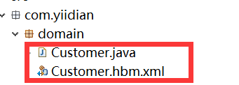


```
<class>标签        -- 用来将类与数据库表建立映射关系
        * name            -- 类的全路径
        * table            -- 表名.(类名与表名一致,那么table属性也可以省略)
        * catalog        -- 数据库的名称，基本上都会省略不写
        
<id>标签            -- 用来将类中的属性与表中的主键建立映射，id标签就是用来配置主键的。
      * name            -- 类中属性名
      * column         -- 表中的字段名.(如果类中的属性名与表中的字段名一致,那么column可以省略.)
     * length        -- 字段的长度，如果数据库已经创建好了，那么length可以不写。如果没有创建好，生成表结构时，length最好指定。
        
<property>标签        -- 用来将类中的普通属性与表中的字段建立映射.
      * name            -- 类中属性名
      * column        -- 表中的字段名.(如果类中的属性名与表中的字段名一致,那么column可以省略.)
      * length        -- 数据长度
      * type            -- 数据类型（一般都不需要编写，如果写需要按着规则来编写）
                * Hibernate的数据类型    type="string"
                * Java的数据类型        type="java.lang.String"
                * 数据库字段的数据类型    <column name="name" sql-type="varchar"/>
```

2) 编写hibernate.cfg.xml文件(**注意：该文件建议放在项目的src目录下**)
```xml
<?xml version='1.0' encoding='utf-8'?>  
<!DOCTYPE hibernate-configuration PUBLIC  
        "-//Hibernate/Hibernate Configuration DTD//EN"  
        "http://www.hibernate.org/dtd/hibernate-configuration-3.0.dtd">  
<hibernate-configuration>  
    <session-factory>  
        <!-- 配置连接数据库的基本信息 jdbc:mysql://localhost:3306/hibernate-->  
        <property name="connection.url">jdbc:mysql://localhost:3306/hibernate</property>  
        <property name="connection.driver_class">com.mysql.jdbc.Driver</property>  
  
        <property name="connection.username">root</property>  
        <property name="connection.password">root</property>  
  
        <!-- 配置 hibernate 的基本信息 -->  
        <!--所使用的数据库方言 MySQL5Dialect-->  
        <property name="dialect">org.hibernate.dialect.MySQL5Dialect</property>
        <!-- 执行操作时是否在控制台打印 SQL -->  
        <property name="show_sql">true</property>  
        <!-- 是否对 SQL 进行格式化,例如语句显示会换行 -->  
        <property name="format_sql">true</property>  
        <!-- 指定自动生成数据表的策略 -->  
        <property name="hbm2ddl.auto">update</property>  
  
  
        <!-- 配置 C3P0 数据源-->  
        <!--数据库连接池的最大连接数-->  
        <property name="hibernate.c3p0.max_size">10</property>  
        <!--数据库连接池的最小连接数-->  
        <property name="hibernate.c3p0.min_size">5</property>  
        <!--当数据库连接池中的连接耗尽时, 同一时刻获取多少个数据库连接-->  
        <property name="c3p0.acquire_increment">2</property>  
        <!--表示连接池检测线程多长时间检测一次池内的所有链接对象是否超时.  
        连接池本身不会把自己从连接池中移除，而是专门有一个线程按照一定的时间间隔来做这件事，  
        这个线程通过比较连接对象最后一次被使用时间和当前时间的时间差来和 timeout 做对比，进而决定是否销毁这个连接对象。-->  
        <property name="c3p0.idle_test_period">2000</property>  
        <!--数据库连接池中连接对象在多长时间没有使用过后，就应该被销毁-->  
        <property name="c3p0.timeout">2000</property>  
        <!--缓存 Statement 对象的数量-->  
        <property name="c3p0.max_statements">10</property>  
  
  
        <!-- 设定 JDBC 的 Statement 读取数据的时候每次从数据库中取出的记录条数 ,取100最好-->  
        <property name="hibernate.jdbc.fetch_size">100</property>  
        <!-- 设定对数据库进行批量删除，批量更新和批量插入的时候的批次大小 取20合适-->  
        <property name="jdbc.batch_size">30</property>  
  
        <mapping resource="com/yiidian/domain/Customer.hbm.xml"/> 
    
    </session-factory>  
</hibernate-configuration>  
```

**Hibernate配置文件主要用于配置数据库连接和Hibernate运行时所需的各种属性**
每个 Hibernate 配置文件对应一个 Configuration 对象

Hibernate配置文件可以有两种格式:
 - hibernate.properties（不推荐）
 - hibernate.cfg.xml （推荐）

**hibernate.cfg.xml的常用属性**
```
hibernate.cfg.xml的常用属性
1)JDBC 连接属性
  - connection.url：数据库URL
  - connection.username：数据库用户名
  - connection.password：数据库用户密码
  - connection.driver_class：数据库JDBC驱动
  - dialect：配置数据库的方言，根据底层的数据库不同产生不同的 sql 语句，Hibernate 会针对数据库的特性在访问时进行优化

2)C3P0 数据库连接池属性
  - hibernate.c3p0.max_size: 数据库连接池的最大连接数
  - hibernate.c3p0.min_size: 数据库连接池的最小连接数
  - hibernate.c3p0.timeout:  数据库连接池中连接对象在多长时间没有使用过后，就应该被销毁
  - hibernate.c3p0.max_statements:  缓存 Statement 对象的数量
  - hibernate.c3p0.idle_test_period:  表示连接池检测线程多长时间检测一次池内的所有链接对象是否超时. 连接池本身不会把自己从连接池中移除，而是专门有一个线程按照一定的时间间隔来做这件事，这个线程通过比较连接对象最后一次被使用时间和当前时间的时间差来和 timeout 做对比，进而决定是否销毁这个连接对象。
  - hibernate.c3p0.acquire_increment: 当数据库连接池中的连接耗尽时, 同一时刻获取多少个数据库连接

  - show_sql：是否将运行期生成的SQL输出到日志以供调试。取值 true | false
  - format_sql：是否将 SQL 转化为格式良好的 SQL . 取值 true | false
  - hbm2ddl.auto：在启动和停止时自动地创建，更新或删除数据库模式。取值 create | update | create-drop | validate
  - hibernate.jdbc.fetch_size
  - hibernate.jdbc.batch_size

3)jdbc.fetch_size 和 jdbc.batch_size
  hibernate.jdbc.fetch_size：实质是调用 Statement.setFetchSize() 方法设定 JDBC 的 Statement 读取数据的时候每次从数据库中取出的记录条数。
  - 例如一次查询1万条记录，对于Oracle的JDBC驱动来说，是不会 1 次性把1万条取出来的，而只会取出 fetchSize 条数，当结果集遍历完了这些记录以后，再去数据库取 fetchSize 条数据。因此大大节省了无谓的内存消耗。Fetch Size设的越大，读数据库的次数越少，速度越快；Fetch Size越小，读数据库的次数越多，速度越慢。Oracle数据库的JDBC驱动默认的Fetch Size = 10，是一个保守的设定，根据测试，当Fetch Size=50时，性能会提升1倍之多，当 fetchSize=100，性能还能继续提升20%，Fetch Size继续增大，性能提升的就不显著了。并不是所有的数据库都支持Fetch Size特性，例如MySQL就不支持

  hibernate.jdbc.batch_size：设定对数据库进行批量删除，批量更新和批量插入的时候的批次大小，类似于设置缓冲区大小的意思。batchSize 越大，批量操作时向数据库发送sql的次数越少，速度就越快。
  - 测试结果是当Batch Size=0的时候，使用Hibernate对Oracle数据库删除1万条记录需要25秒，Batch Size = 50的时候，删除仅仅需要5秒！Oracle数据库batchSize=30 的时候比较合适。
```

## Hibernate 主键生成策略

**Hibernate主键生成策略分类** 
+ `UUID`，`increment`、`Hilo`、`assigned`：对数据库无依赖
+ `identity`：依赖Mysql或sql server，主键值不由hibernate维护
+ `sequence`：适合于oracle等支持序列的dbms，主键值不由hibernate维护，由序列产生。
+ `native`：根据底层数据库的具体特性选择适合的主键生成策略，如果是mysql或sqlserver，选择identity，如果是oracle，选择sequence。 

## Hibernate 的映射关系

在实际开发中，我们数据库的表难免会有相互的关联关系，在操作表的时候就有可能会涉及到多张表的操作。例如：一个商城项目中商品和分类，用户和订单，订单和商品的关系等等。

**配置实体之间的关联关系，表之间的关系到底有几种呢？**

数据库中多表之间存在着三种关系，如图所示：

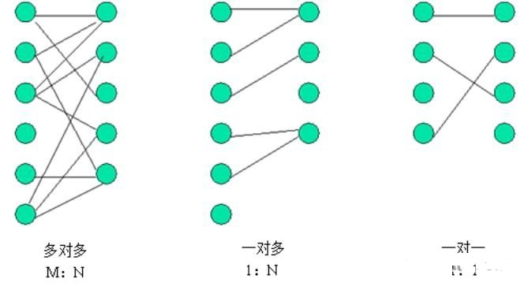
```
注意：
    一对多关系可以看为两种：  即一对多，多对一。实际开发中常用的关联关系，一对多和多对多。而一对一的情况，在实际开发中比较少见
```

1) 场景一：一对多关系映射


**在一对多关系中，我们习惯把一的一方称之为主表，把多的一方称之为从表。在数据库中建立一对多的关系，需要使用数据库的外键约束。**

**什么是外键？**

指的是从表中有一列，取值参照主表的主键，这一列就是外键。

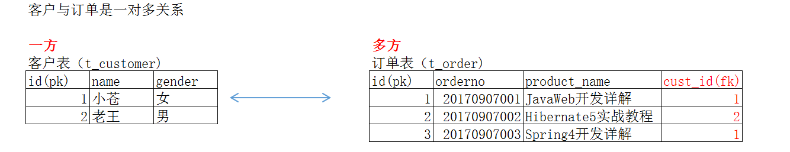

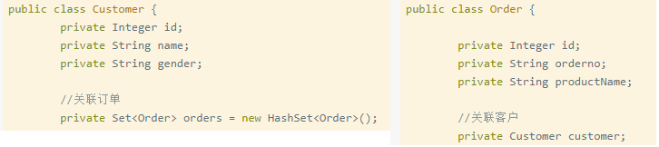

如何何通过配置的方式把客户实体的订单`Set集合`和订单实体的中`Customer对象`与数据库建立起来关系。

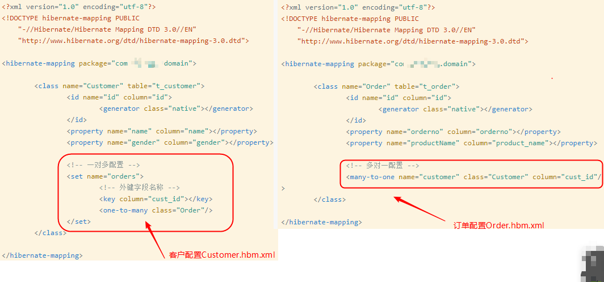

2) 场景二：多对多关系映射(示例为用户和角色。)


**多对多（多对一）表关系建立**

**多对多的表关系建立靠的是`中间表`，其中用户表和中间表的关系是一对多，角色表和中间表的关系也是一对多，如下图所示：**

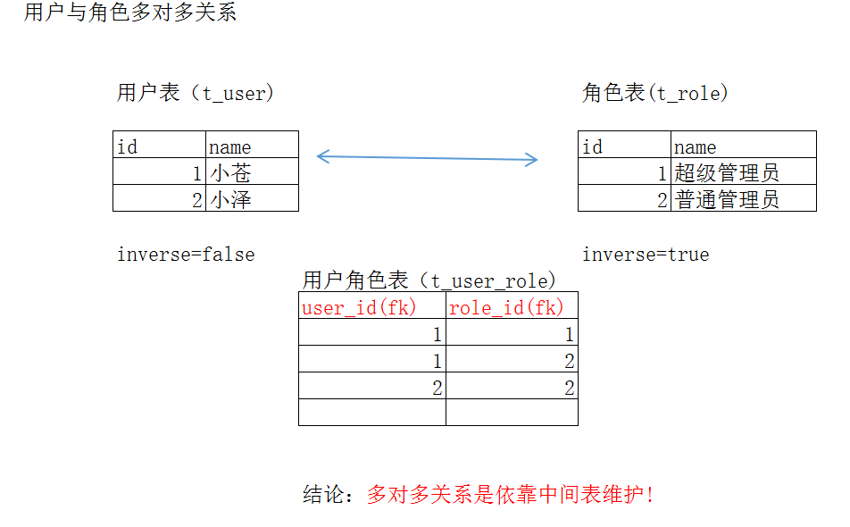

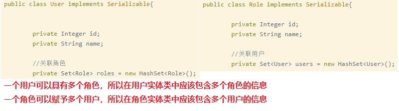

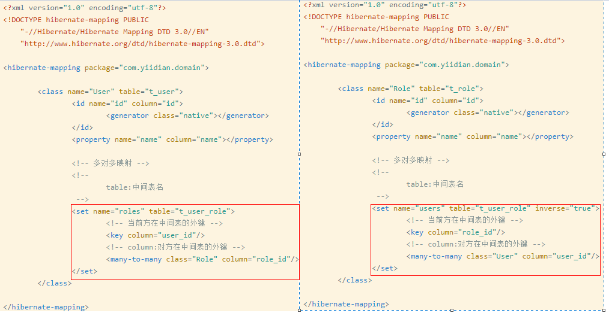

3) 场景三：一对一关系映射-唯一外键关联（示例为公民和身份证）


**一对一唯一外键关联的表关系建立**

**唯一外键这种方式和一对多的关联非常类似，也是使用外键进行关联，但是`添加了唯一约束来限制外键值`，从而实现了一对一关联，如下图所示：**

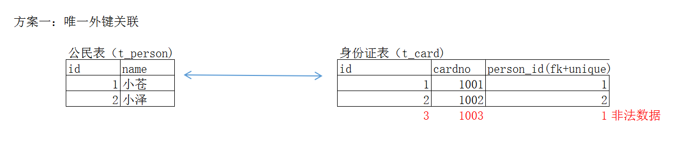

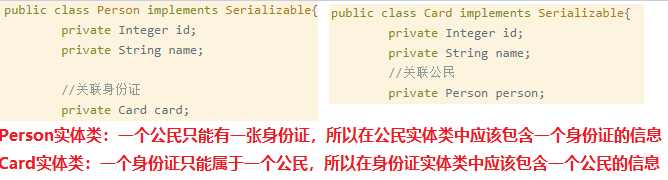

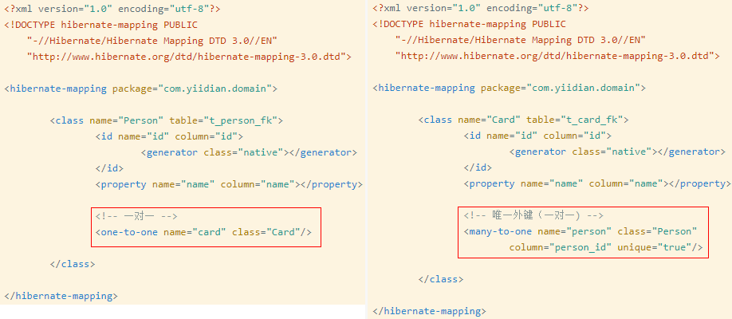


4) 场景四：一对一关系映射-主键关联（示例为公民和身份证）

**一对一主键关联的表关系建立**

**主键关联的方式，是在其中一张表把其主键同时设置为外键，关联对方表，如下图所示：**
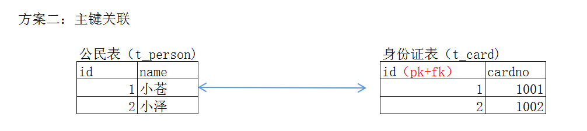

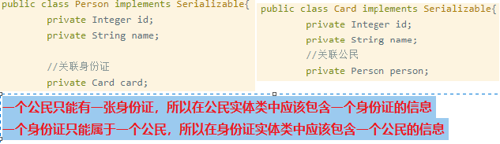

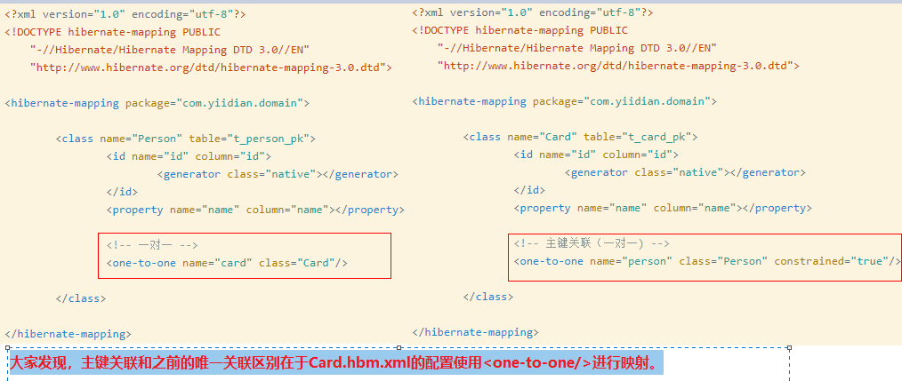


## Hibernate `Cascade` 和 `Inverse`

**Cascade级联存在场景的意义**

在实际做项目的时候，经常会遇到表与表之间的关联操作，比如一个班级里面有多个学生，一个部门有多个职员，这是一对多的关系，还有例如一个主题有一个作者，这是一对一，等，这时候就必须涉及到表的关联操作。

1) 一对多的单向关联

**什么是单向关联呢？**

比如一个班级里面有多个学生，班级表关联学生表，属于一对多，但是学生表并不关联班级表，这个就属于单向的关联。(`只能从Classes找到Student，所以为单项关联`)

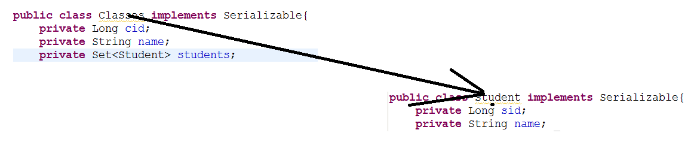

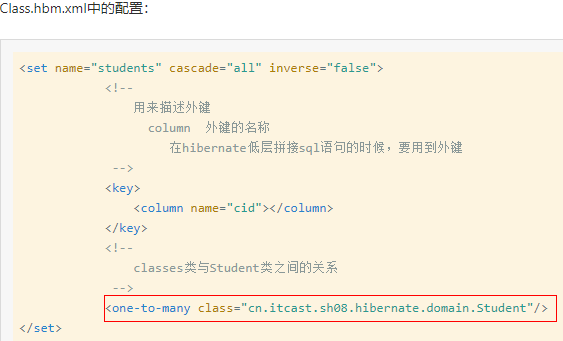

而在Student.hbm.xml中除了id和name属性以外没有有关Class的属性设置

--> 通过班级级联保存学生(`把Classes.hbm.xml的配置加上cascade="save-update"`)

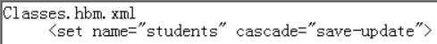

**Cascade常用的属性**

- save-update
- delete
- all

**inverse属性(值有true|false)**

**级联和维护关系的区别**
- cascade是对象与对象之间的关系 
- inverse是对象与外键之间的关系，针对的是外键

2) 一对多的双向关联

总结:

+ 一对多如果多的一方维护关系，不会发出update语句
+ 一般情况下，一对多，多的一方维护关系效率比较高
+ 在一般情况下,Classes.hbm.xml文件中的set元素中的inverse属性一般设置为true
+ 如果上述的配置的inverse设置为false，那么只要更新了关系，只要在代码端建立了Classes与Student之间的关系，session只要操作Classes,就会发出更新外键的sql语句，这样效率比较低

## Hibernate优化策略

1) Hibernate 对象状态

①.对于刚创建的一个对象，如果session中和数据库中都不存在该对象，那么该对象就是瞬时对象(Transient)

②.瞬时对象调用save方法，或者离线对象调用update方法可以使该对象变成持久化对象，如果对象是持久化对象时，那么对该对象的任何修改，都会在提交事务时才会与之进行比较，如果不同，则发送一条update语句，否则就不会发送语句

③.离线对象就是，数据库存在该对象，但是该对象又没有被session所托管。

2) Hibernate 一级缓存和快照

Hibernate的一级缓存就是指Session缓存。

3) Hibernate lazy延迟加载

**什么时候使用延迟加载什么时候使用立即加载?**

如果程序加载一个持久化对象的目的是为访问他的属性，则可以采用立即加载。如果程序加载一个持久化对象的目的仅仅是为了获得他的引用，则可以采用延迟加载。

**Hibernate在对象-关系映射中配置加载策略**

类级别：
 + `<class>元素中lazy属性的可选值为true(延迟加载)和false(立即加载)；`

 + `<class>元素中的lazy属性的默认值为true`

 一对多关联级别：
  + `<set>元素中的lazy属性的可选值为:true(延迟加载),extra(增强延迟加载)和false(立即加载);`

  + `<set>元素中的lazy属性的默认值为true`

多对一关联级别：
  + `<many-to-one>元素中lazy属性的可选值为：proxy(延迟加载)，no-proxy(无代理延迟加载)和false(立即加载)`

  + `<many-to-one>元素中的lazy属性的默认值为proxy`

## Hibernate fetch抓取策略

抓取策略,指的是使用Hibernate查询一个对象的时候，查询其关联对象.应该如何查询.是Hibernate的一种优化手段!

**Hibernate的Fetch抓取策略**

+ 连接抓取（Join fetching） - Hibernate通过 在SELECT语句使用OUTER JOIN （外连接）来 获得对象的关联实例或者关联集合。


+ 查询抓取（Select fetching） - 另外发送一条 SELECT 语句抓取当前对象的关联实 体或集合。除非你显式的指定lazy="false"禁止 延迟抓取（lazy fetching），否 则只有当你真正访问关联关系的时候，才会执行第二条select语句。


+ 子查询抓取（Subselect fetching） - 另外发送一条SELECT 语句抓取在前面查询到 （或者抓取到）的所有实体对象的关联集合。除非你显式的指定lazy="false" 禁止延迟 抓取（lazy fetching），否则只有当你真正访问关联关系的时候，才会执行第二条select语句。


+ 批量抓取（Batch fetching） - 对查询抓取的优化方案， 通过指定一个主键或外键列表，Hibernate使用单条SELECT语句获取一批对象实例或集合。

## Hibernate 整合C3P0

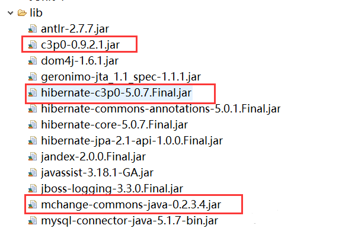

## Hibernate 二级缓存和查询缓存

Hibernate的二级缓存作为一个可插入的组件在使用的时候也是可以进行配置的，但并不是所有的对象都适合放在二级缓存中。

在通常情况下会将具有以下特征的数据放入到二级缓存中：

+ 很少被修改的数据。
+ 不是很重要的数据，允许出现偶尔并发的数据。
+ 不会被并发访问的数据。
+ 参考数据。

而对于具有以下特征的数据则不适合放在二级缓存中：

+ 经常被修改的数据。
+ 财务数据，绝对不允许出现并发。
+ 与其他应用共享的数据。

## Hibernate 事务管理

一、事务介绍

问题：什么是事务?

事务就是逻辑上的一组操作，组成这组操作的各个单元要么全部成功，要么全都失败。

问题：事务四个特性?

+ 原子性:强调事务是不可分割最小单元
+ 一致性:事务在执行前后，要保证数据的一致。
+ 隔离性:一个事务在执行的过程中，不应该受到其它事务的干扰。
+ 持久性:事务一旦结束，数据持久化到数据库。

问题:不考虑事务的隔离性，会产生什么问题?

写问题：丢失更新

1)产生丢失更新的原因

丢失更新就是两个不同的事务（或者开启两个线程）在某一时刻对同一数据进行读取后，先后进行修改。导致第一次操作数据丢失。

2)解决方式

使用数据库锁机制防止数据丢失

(1)共享锁

共享 (S) 锁允许并发事务读取 (SELECT) 一个资源。资源上存在共享 (S) 锁时，任何其它事务都不能修改数据。一旦已经读取数据，便立即释放资源上的共享 (S) 锁，除非将事务隔离级别设置为可重复读或更高级别，或者在事务生存周期内用锁定提示保留共享 (S) 锁

(2)排它锁

排它 (X) 锁可以防止并发事务对资源进行访问。其它事务不能读取或修改排它 (X) 锁锁定的数据。

读问题：脏读、不可重复读、虚度

脏读:一个事务读取到另一个事务的未提交数据

【注释说明】例如在执行update操作时，这个事务未提交，数据库的数据就没有发生该表；此时再执行select操作时，第二个事务就能读取到更新数据之后的数据信息；问题是数据库的数据没有发生改变，但select查询的数据是与数据库中的数据不一致了。

不可重复读:一个事务读取到另一个事务提交的数据(主要是指update)，会导致两次读取的结果不一致。

虚读(幻读): 一个事务读取到另一个事务提交的数据(主要是指insert),会导致两次读取结果不一致.

问题:对于上述问题如何解决?

处理事务：效率越来越低，但安全性越来越高

我们可以通过设置隔离级别来解决读的问题.

READ_UNCOMMITED 读取未提交：它引发所有的隔离问题
READ_COMMITTED   读已提交:　　阻止脏读,可能发生不可重复读与虚读.
REPEATABLE_READ   重复读:  　　阻止脏读，不可重复读：可能发生虚读
SERIALIZABLE          串行化: 　　解决所有问题 不允许两个事务，同时操作一个目标数据。（效率低下，但操作安全是最安全的）

```
ORACLE  默认的是事务隔离级别  READ_COMMITTED
MYSQL  默认的事务隔离级别    REPEATABLE_READ
```

## Hibernate ThreadLocal管理Session
