# Spring Boot

随着动态语言的流行(`Ruby,Groovy,Scala,Node.js`)，Java的开发显得格外的笨重：繁多的配置，低下的开发效率，复杂的部署流程以及第三方技术集成难度大。

在上述环境下，Spring Boot应运而生。它使用”习惯由于配置”(项目中存在大量的配置，此外还内置一个习惯性的配置，让你无须进行手动配置)的理念让你的项目快速运行起来。使用Spring Boot很容易创建一个独立运行(运行jar,内嵌Servlet容器)，准生产级别的Spring框架的项目，使用Spring Boot你可以不用或者只需要很少的Spring配置。

## 前言

> <font color=#009A61 size=4>Spring的Java配置方式</font>(Spring4.x 之后推荐使用,完全替代xml配置)

<font color=#009A61 size=4>@Configuration 和 @Bean</font>

**Spring的Java配置方式是通过 @Configuration 和 @Bean 这两个注解实现的：**

1、`@Configuration` 作用于类上，相当于一个xml配置文件；

2、`@Bean` 作用于方法上，相当于xml配置中的<bean>；


**延伸：**

1、	如何配置多个配置文件？

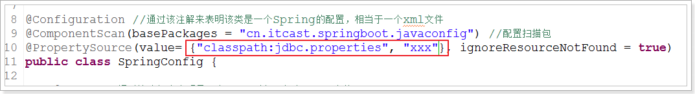
 
2、	如果配置的配置文件不存在会怎么样？

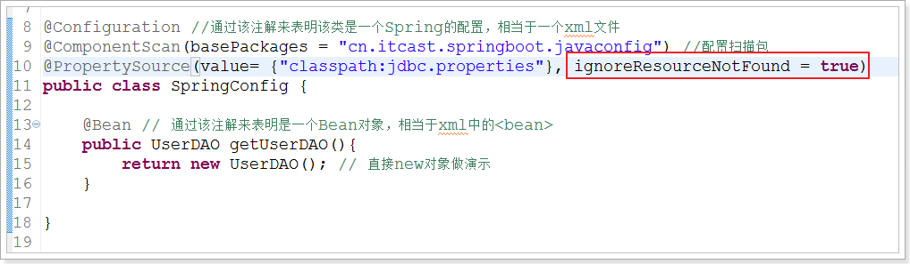


## Spring Boot 核心功能

1、独立运行的Spring项目

Spring Boot可以以jar包的形式独立运行，运行一个Spring Boot项目只需通过 `java -jar xx.jar` 来运行。

2、内嵌Servlet容器

Spring Boot可选择内嵌的<font color=red>Tomcat，Jetty或者Undertow</font>，这样我们无须以war包形式部署项目。

3、自动配置Spring

Spring Boot会根据在类路径中的jar包，类，为jar包里的类自动配置Bean，这样会极大地减少我们要使用的配置。当然，SpringBoot只是考虑了大多数的开发场景，并不是所有的场景，若在实际开发中我们需要自动配置Bean，而Spring Boot没有提供支持，则可以自定义配置。

4、 准生产的应用监控

Spring Boot提供基于http,ssh,telnet对运行的项目进行监控

5、无代码生成和xml配置

Spring Boot提倡使用Java配置和注解配置组合，而Spring Boot不需要任何xml配置即可 实现Spring的所有配置。

## Spring Boot的优缺点

(1) 快速构建项目；    
(2) 对主流开发框架的无配置集成；    
(3) 项目可独立运行，无须外部依赖Servlet容器；   
(4) 提供运行时的应用监控；   
(5) 极大的提高了开发，部署效率；   
(6) 与云计算的天然集成。    

## Spring Boot的基本配置

1、入口类和`@SpringBootApplication`

Spring Boot通常有一个名为*Application的入口类，入口类里面有一个main方法，这个main方法其实就是一个标准的Java应用的入口。在main方法中使用SpringApplication.run(HelloApplication.class, args)，启动Spring Boot应用项目。

`@SpringBootApplication` （Spring Boot的核心）组合注解
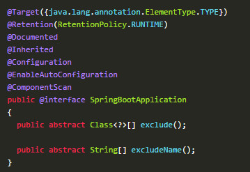

@SpringBootApplication注解主要组合了@Configuration，@EnableAutoConfiguration，@ComponentScan；若不使用@SpringBootApplication注解，则可以在入口类上直接使用@Configuration，@EnableAutoConfiguration，@ComponentScan三个注解的效果是一样的。

其中@EnableAutoConfiguration让Spring Boot根据类路径中的jar包依赖为当前项目进行自动配置。

```xml
1、@SpringBootApplication：Spring Boot项目的核心注解，主要目的是开启自动配置。；
2、@Configuration：这是一个配置Spring的配置类；(在Spring Boot项目中推荐使用@ SpringBootConfiguration替代@Configuration)
3、@Controller：标明这是一个SpringMVC的Controller控制器；
4、main方法：在main方法中启动一个应用，即：这个应用的入口；
5、@ComponentScan：默认扫描@SpringBootApplication所在类的同级目录以及它的子目录。
6、@EnableAutoConfiguration：启用自动配置，该注解会使Spring Boot根据项目中依赖的jar包自动配置项目的配置项：

```
**我们添加了spring-boot-starter-web的依赖，项目中也就会引入SpringMVC的依赖，Spring Boot就会自动配置tomcat和SpringMVC**


**关闭特定的自动配置**

通过上面的@SpringBootApplication的源码可以看出，关闭特定的自动配置应该使用@SpringBootApplication注解的exclude参数，比如要关闭Spring Boot对数据源的自动配置，则可以这样使用，例如：


**定制Banner**

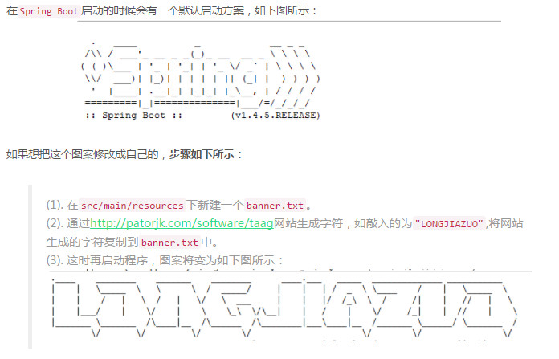

 通过[http://patorjk.com/software/taag](http://patorjk.com/software/taag)网站生成字符，如敲入的为"LONGJIAZUO",将网站生成的字符复制到banner.txt中。

**关闭banner**

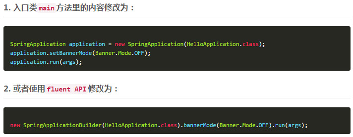

**配置**
Spring Boot的全局配置文件的作用是对一些默认配置的配置值进行修改。Spring Boot使用一个全局的配置文件`application.properties`或`application.yml`进行全局配置，放置在`src/main/resources`目录或者类路径的`/config`下。

Spring Boot不仅支持常规的properties配置文件，还支持yaml语言的配置文件。yaml是以数据为中心的语言，在配置数据的时候具有面向对象的特征。

**简单示例**

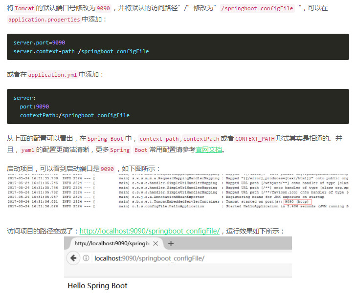

## Spring Boot的xml配置

Spring Boot提倡零配置，即无xml配置，但是在实际项目中，可能有一些特殊要求你必须使用xml配置，这时候可以通过在配置类上面使用Spring提供的`@ImportResource`来在加载xml配置，例如：


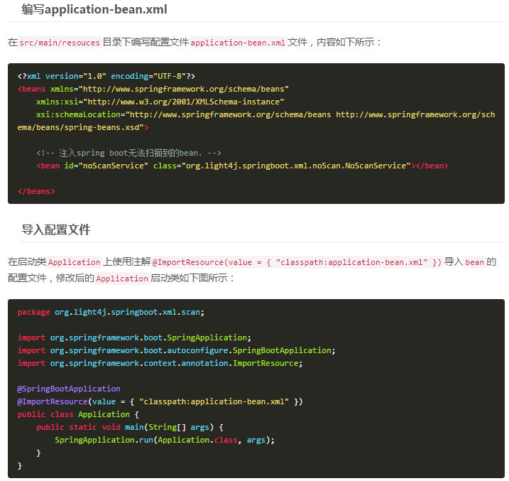

## Spring Boot的自动配置的原理

Spring Boot在进行`SpringApplication`对象实例化时会加载`META-INF/spring.factories`文件，将该配置文件中的配置载入到Spring容器。

**条件注解**
```xml
@ConditionalOnBean: 当容器里有指定的Bean的条件下
@ConditionalOnClass：当类路径下有指定的类的条件下
@ConditionalOnExpression: 基于SpEL表达式作为判断条件

@ConditionalOnJava: 基于JVM版本作为判断条件
@ConditionalOnJndi: 在JNDI存在的条件下查找指定的位置
@ConditionalOnMissingBean: 当容器里没有指定的Bean的情况下
@ConditionalOnMissingClass：当类路径下没有指定的类的条件下
@ConditionalOnNotWebApplication: 当前项目不是Web项目的条件下
@ConditionalOnProperty: 指定的属性是否有指定的值
@ConditionalOnResource: 类路径是否有指定的值
@ConditionalOnSingleCandidate: 当指定Bean 在容器中只有指定首先得Bean
@ConditionalOnWebApplication：当前项目是Web项目的条件下
```

## 命令行参数配置

Spring Boot可以允许使用properties文件，yaml文件或者命令行参数作为外部配置。

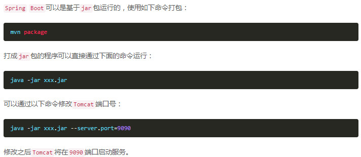

## 常规属性配置

在常规Spring环境下，注入properties文件里面的值的方式，通过@PropertySource指明properties文件的位置，然后通过@Value注入值。在Spring Boot里，我们只需在application.properties定义属性，直接使用@Value注入值即可。

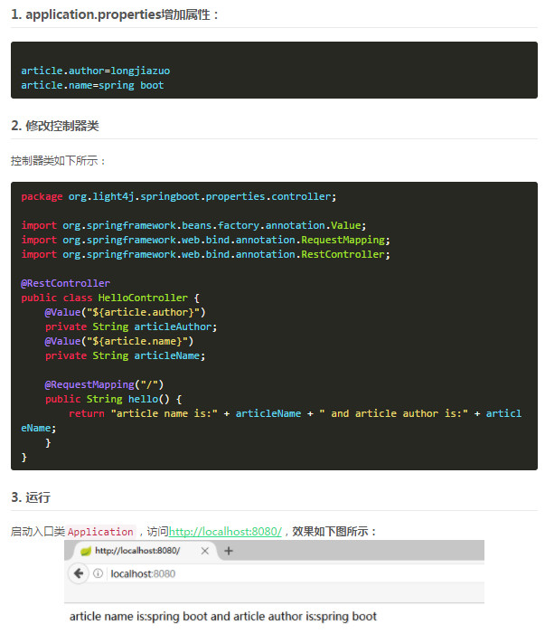

## 类型安全的属性配置

上述，使用@Value注入每个配置在实际项目中会显得格外麻烦，因为我们的配置通常会是许多个，若使用上篇文章的方式则要使用@Value注入很多次。

Spring Boot还提供了基于类型安全的属性配置方式，通过`@ConfigurationProperties`将`properties`属性和一个`Bean`及其属性关联，从而实现类型安全的配置。
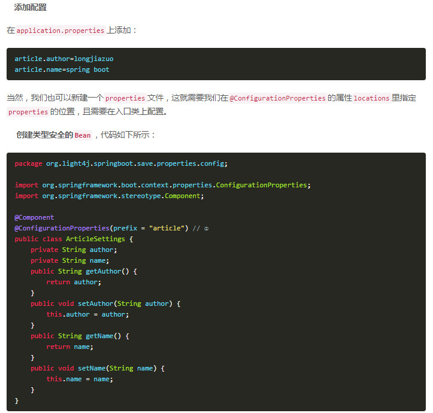
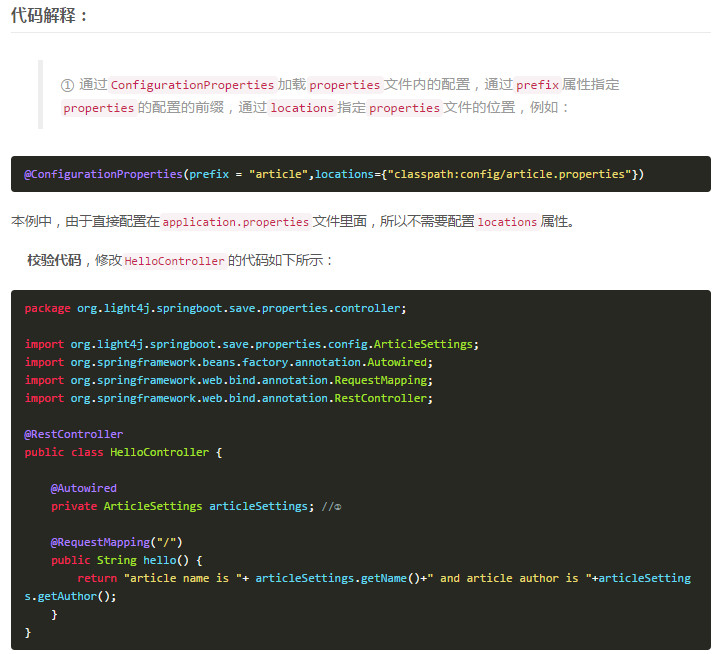
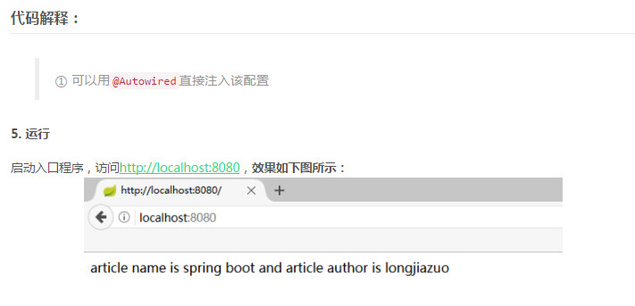


## 日志配置

Spring Boot支持Java Util Logging，Log4J,Log4J2和Logback作为日志框架，无论使用哪种日志框架，Spring Boot已经为当前使用的日志框架在控制台的输出以及在文件的输出做好了配置。每种Logger都可以通过配置使用控制台或者文件输出日志内容。

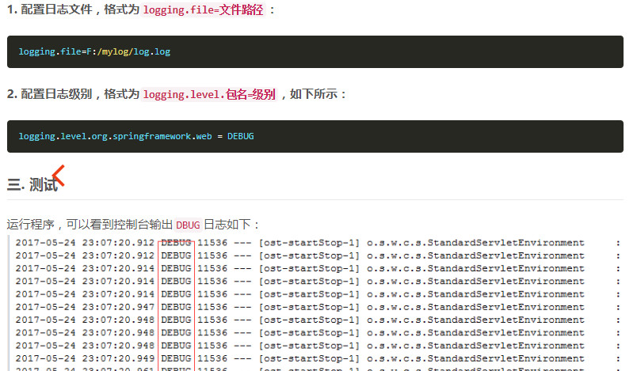

格式化日志，默认日志
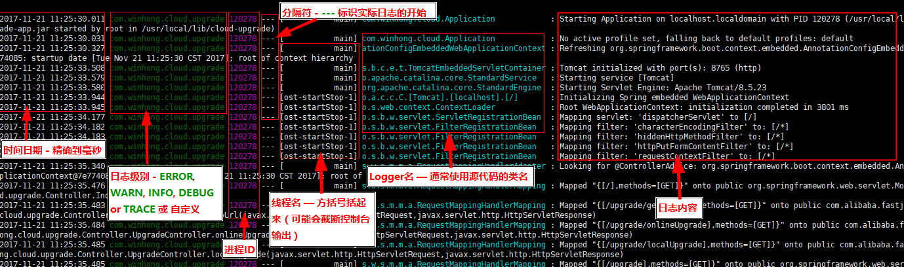

文件输出

Spring Boot默认配置只会输出到控制台，并不会记录到文件中，但是我们通常生产环境使用时都需要以文件方式记录。(日志文件会在10Mb大小的时候被截断，产生新的日志文件，默认级别为：ERROR、WARN、INFO) 

若要增加文件输出，需要在`application.properties`中配置`logging.file`或`logging.path`属性。

- ogging.file，设置文件，可以是绝对路径，也可以是相对路径。如：logging.file=my.log

- logging.path，设置目录，会在该目录下创建spring.log文件，并写入日志内容，如：logging.path=/var/log

级别控制
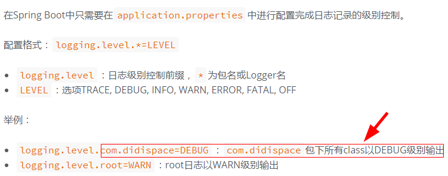

自定义日志级别
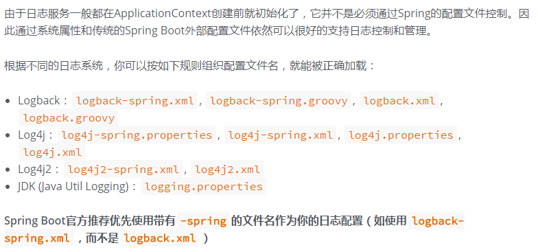

自定义输出格式

在Spring Boot中可以通过在application.properties配置如下参数控制输出格式：

- logging.pattern.console： 定义输出到控制台的样式（不支持JDK Logger）
- logging.pattern.file： 定义输出到文件的样式（不支持JDK Logger）

## Profile配置

Profile是Spring用来针对不同的环境对不同的配置提供支持的，全局Profile配置使用`application-{profile}.properties`(如`application-prod.properties`)。

通过在application.properties中设置spring.profiles.active的值来指定活动的Profile配置。

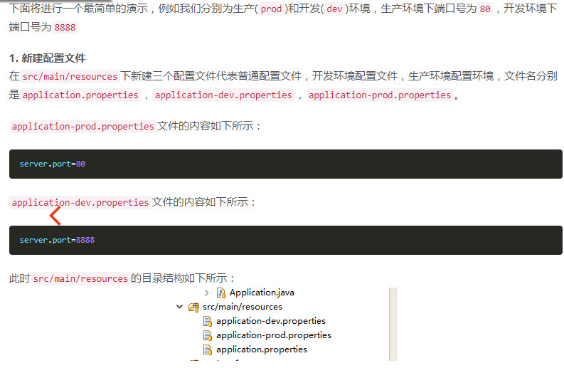
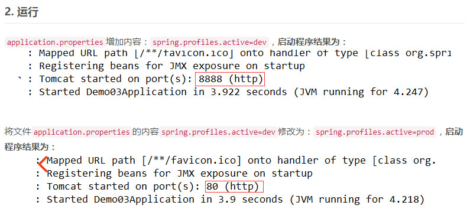

## Spring Boot的AOP配置

AOP是Spring框架中的一个重要内容，在Spring boot里配置aop非常简单，Spring Boot对AOP的默认配置属性是开启的，也就是说`spring.aop.auto`属性的值默认是`true`，我们只要引入了AOP依赖后，默认就已经增加了`@EnableAspectJAutoProxy`功能，不需要我们在程序启动类上面加入注解`@EnableAspectJAutoProxy`。

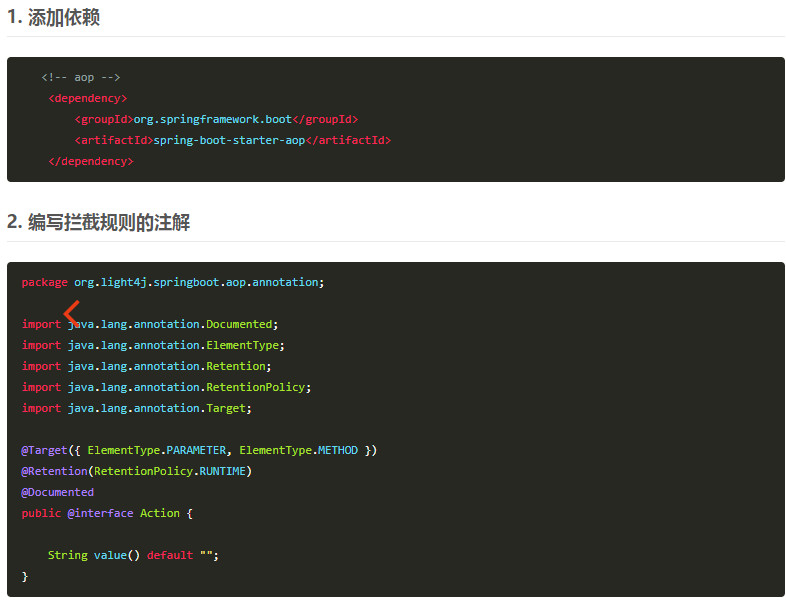
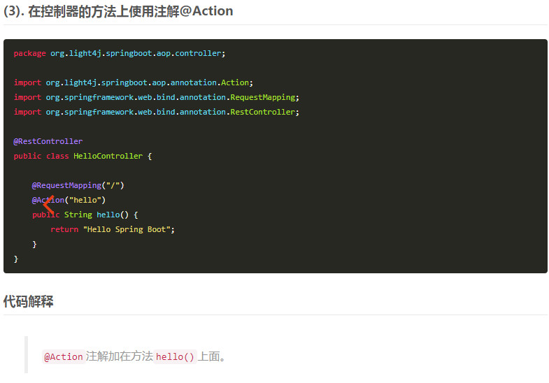
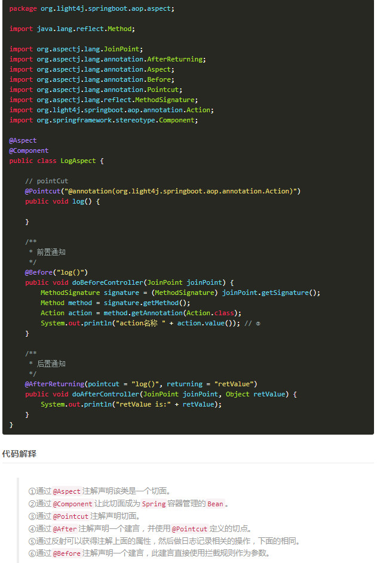

## velocity模板配置

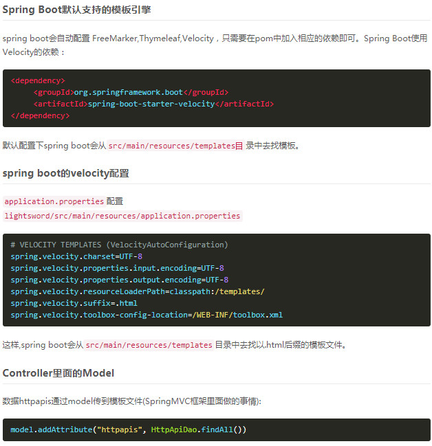

## 自动配置的ViewResolver
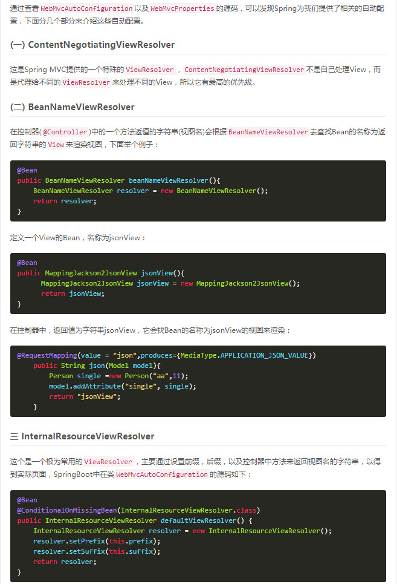

## 自动配置的静态资源

在自动配置类WebMvcAutoConfiguration的addResourceHandlers方法中定义了以下静态资源的自动配置。

**一. 类路径文件**

把类路径下的/static,/public,/resources和/META-INF/resources文件夹下的静态资源直接映射为/**,可以通过http://localhost:8080/**来访问。

**二. webjar**

何谓webjar，webjar就是将我们常用的脚本框架封装在jar包中的jar包，更多关于webjar的内容可以访问:http://www.webjars.org网站。

把webjar的/META-INF/resources/webjars/下的静态文件映射为/webjars/,可以通过：http:localhost:8080/webjar/来访问。

## spring boot结合velocity获取项目路径

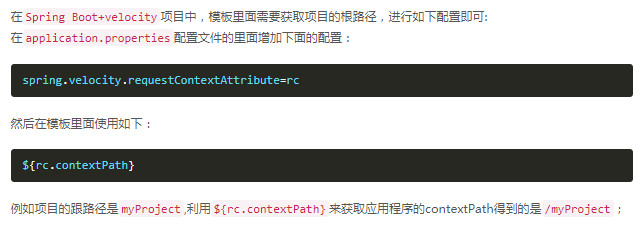

## 自动配置的Formatter和Converter

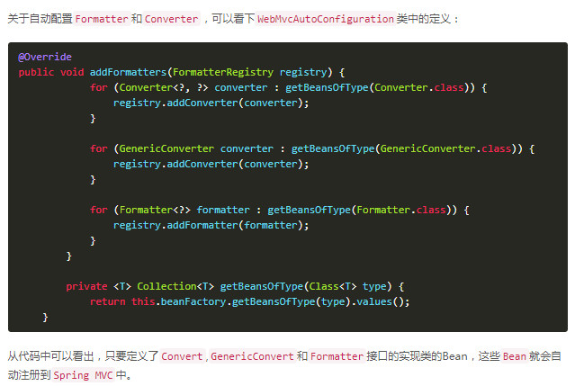

## 自动配置的HttpMessageConverter

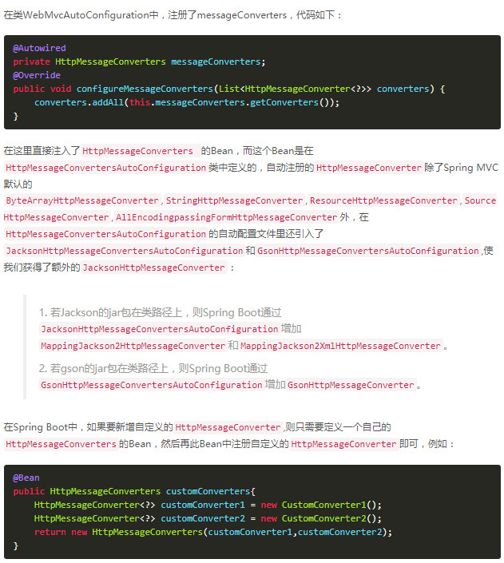

## 静态首页的支持

把静态文件放置在如下目录：

	1. classpath:/META-INF/resources/index.html
	2. classpath:/resources/index.html
	3. classpath:/static/index.html
	4. classpath:/public/index.html

当我们访问应用根目录http://localhost:8080/时，会直接映射。

## 把spring-boot项目部署到外部tomcat环境下

想要把spring-boot项目按照平常的web项目一样发布到`tomcat`容器下需要进行下列几个步骤:

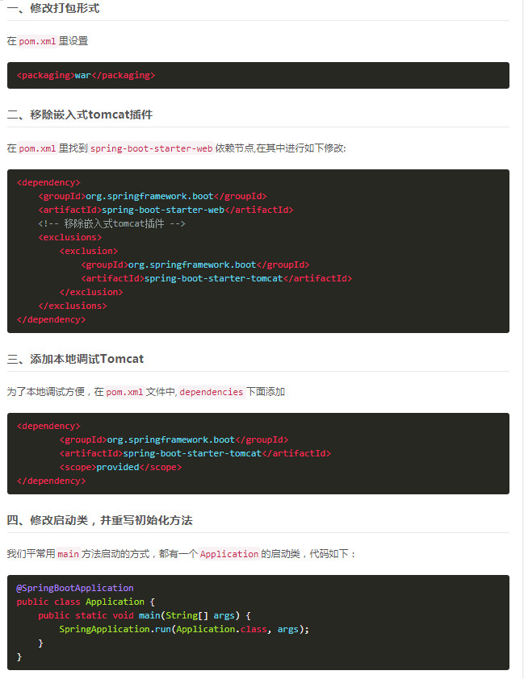
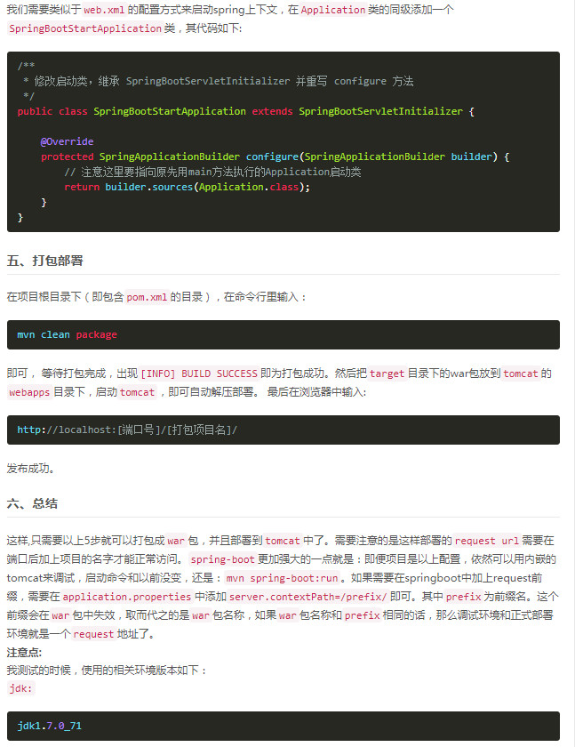
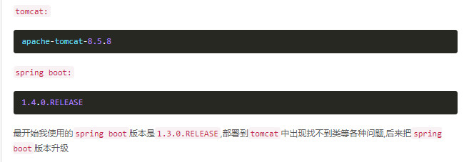

## 接管Spring Boot的Web配置

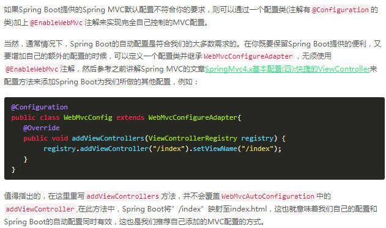

## 注册Servlet，Filter，Listener

## Favicon配置

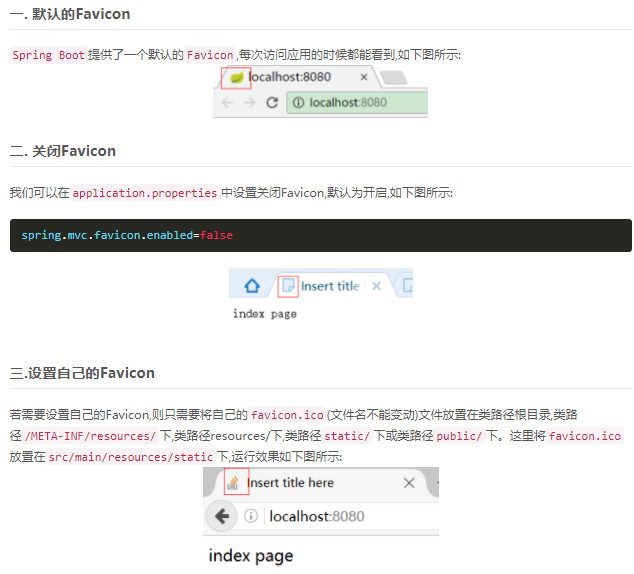


# Spring Boot 传参方式

> @RequestParam
 
这个注解用来绑定单个请求数据，既可以是url中的参数，也可以是表单提交的参数和上传的文件。

+ Form 

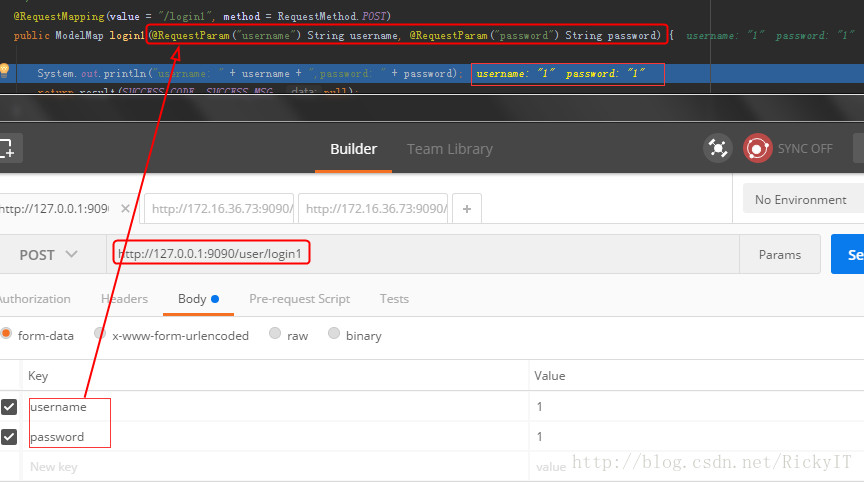

+ URL中传参数

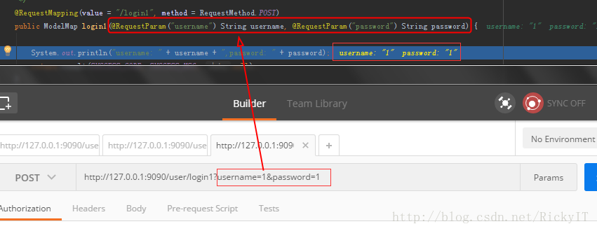

+ 不能处理JSON格式的请求。

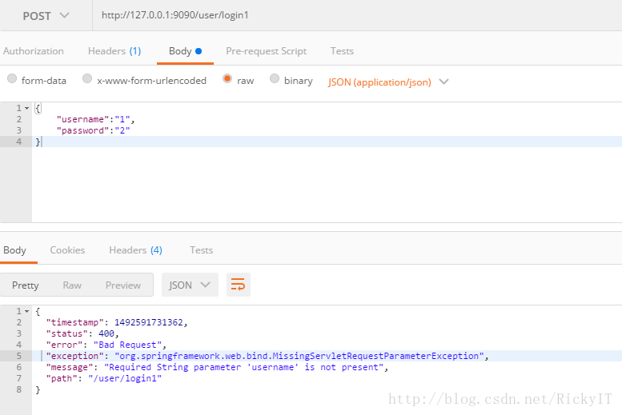

> @PathVariable

这个注解可以将URL中的占位符参数绑定到控制器处理方法的入参。

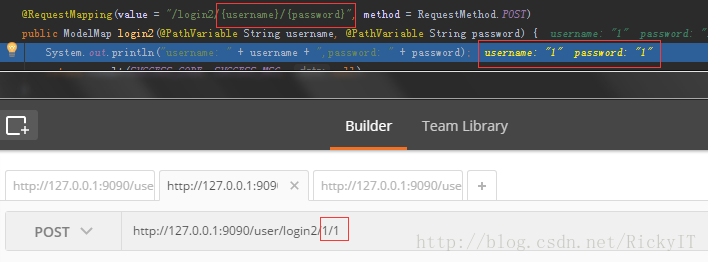

> @RequestBody  

这个注解是传JSON对象用的。（<font size=3 color=red>不能通过Form表单、URL传参。</font>）

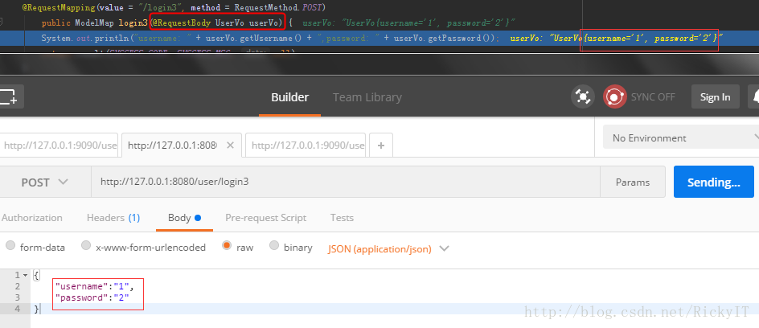

> Form-data

+ 普通表单 
 
<font size=3 color=red>传送form表单数据，可以不用注解，直接传参，参数名字要一样。</font>

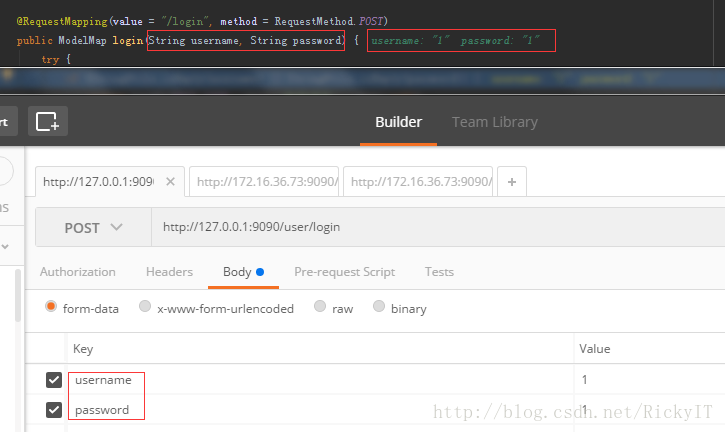

这种传参方式不能处理JSON参数请求。

> 上传文件

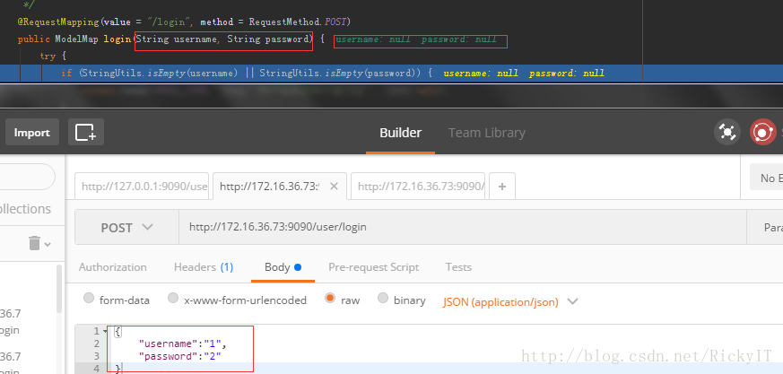

enctype必须设置： 
{"enctype":"multipart/form-data"}

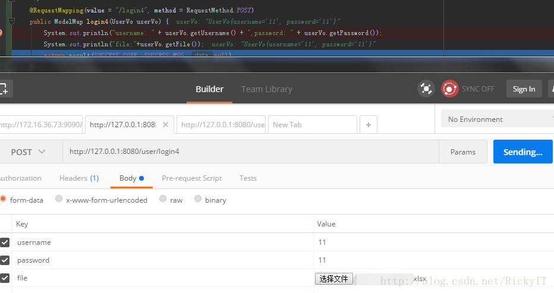

## springboot 设置虚拟目录


Springboot 之 静态资源路径配置

**静态资源路径** 是指系统可以直接访问的路径，且路径下的所有文件均可被用户直接读取。

SpringBoot 默认的静态资源路径有：

* `classpath:/META-INF/resources/`
* `classpath:/resources/`
* `classpath:/static/`
* `classpath:/public/`

(从这里可以看出这里的静态资源路径都是在classpath中（也就是在项目路径下指定的这几个文件夹）)

场景：<font color=red>一个网站有文件上传文件的功能，如果被上传的文件放在上述的那些文件夹中会有怎样的后果？</font>

- 网站数据与程序代码不能有效分离；
- 当项目被打包成一个.jar文件部署时，再将上传的文件放到这个.jar文件中是有多么低的效率；
- 网站数据的备份将会很痛苦。

【最佳解决方案：将静态资源资源路劲设置到磁盘的基本目录】

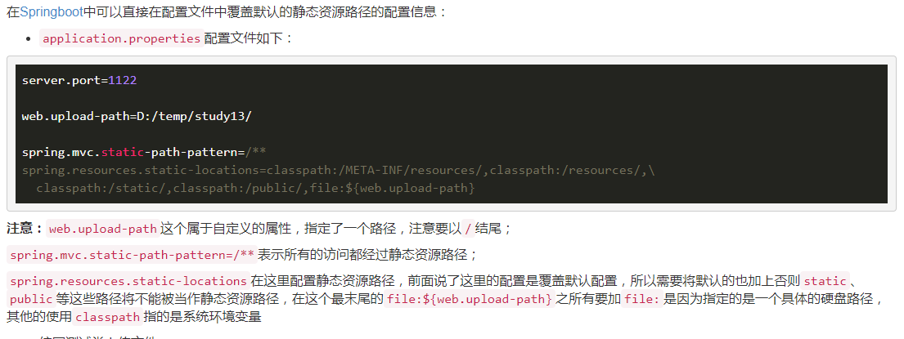

## 【总结】：

+ @PathVariable：

<p>一般我们使用URI template样式映射使用，即url/{param}这种形式，也就是一般我们使用的GET，DELETE，PUT方法会使用到的，我们可以获取URL后所跟的参数。</p>

+ @RequestParam：

<p>一般我们使用该注解来获取多个参数，在（）内写入需要获取参数的参数名即可，一般在PUT，POST中比较常用。</p>

+ @RequestBody：

<p>该注解和@RequestParam殊途同归，我们使用该注解将所有参数转换，在代码部分在一个个取出来，也是目前我使用到最多的注解来获取参数（因为前端不愿意一个一个接口的调试）</p>

当然，我们获取参数不仅仅只有上面所提到的那些，还有@RequestHeader来获取头信息里的值，@CookieValue来获取Cookie值等等。

另外我们还可以使用对象直接获取参数：


