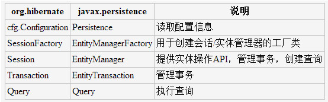

# Spring Data JPA

**JPA的主要API都定义在javax.persistence包中。与Hibernate对照如下：**


HibernateJpaVendorAdapter的generateDdl不会改变表

我正在开发一个Spring +JPA +Hibernate的。在持久性配置（JPA +Hibernate的）我的HibernateJpaVendorAdapter的generateDdl属性设置为true，事实上新的实体正确地在数据库中创建新表。 一旦表被创建，不过，如果我添加一个属性的实体，我期待的HibernateJpaVendorAdapter改变表并添加列也是如此。这是不会发生，这是奇怪在Java AbstractJpaVendorAdapter的有：“设置是否生成DDL后的EntityManagerFactory已经初始化，创建/更新所有相关表” JPA +Hibernate的配置：

``` Java

<bean id="dataSource" class="org.springframework.jdbc.datasource.DriverManagerDataSource">
 <property name="driverClassName" value="${db.driverClassName}" />
 <property name="url" value="${db.url}" />
 <property name="username" value="${db.username}" />
 <property name="password" value="${db.password}" />
</bean>
<bean id="jpaAdapter" class="org.springframework.orm.jpa.vendor.HibernateJpaVendorAdapter">
 <property name="databasePlatform" value="org.hibernate.dialect.MySQL5Dialect" />
 <property name="showSql" value="${db.showSql}" />
 <property name="generateDdl" value="${db.generateDdl}" />
</bean>
<bean id="entityManagerFactory" class="org.springframework.orm.jpa.LocalContainerEntityManagerFactoryBean">
 <property name="jpaVendorAdapter" ref="jpaAdapter" />
 <property name="jpaProperties">
  <props>
   <prop key="hibernate.show_sql">true</prop>
   <prop key="hibernate.format_sql">true</prop>
  </props>
 </property>
 <property name="dataSource" ref="dataSource" />
</bean>
persistence.xml中：
<?xml version="1.0" encoding="UTF-8"?>
<persistence
  xmlns=" CodeGo.net 
  xmlns:xsi=" CodeGo.net 
  xsi:schemaLocation=" CodeGo.net 
  CodeGo.net 
  version="1.0">
 <persistence-unit name="m8tsPU" />
</persistence>

```


## 解决方案

````
1. 你可以得到一个更细粒度的控制DDL生成通过直接设置一个合适的特定于Hibernate的属性：
<bean id="entityManagerFactory" class="org.springframework.orm.jpa.LocalContainerEntityManagerFactoryBean">
  ...
 <property name="jpaProperties">
  <props>
   <prop key="hibernate.hbm2ddl.auto">update</prop>
   ...
  </props>
 </property>
</bean>
另外，您create-drop而不是update，因为update5月问题的情况下。但是，请注意，自动更新的DDL不适合 
2. 或者，您也可以表达jpaPropertyMap：
<bean id="entityManagerFactory" class="org.springframework.orm.jpa.LocalContainerEntityManagerFactoryBean"> 
  ...
  <property name="jpaPropertyMap">
   <map>
    <entry key="hibernate.hbm2ddl.auto" value="update"/>
    ...
   </map>
  </property>
</bean>


````

### 持久层接口

**局部更新时请使用@modify和@update**

 用@Query("sql语句")注意这个sql是HQL(hibernate Query Language)
 例如：(注意：“：”应该紧跟在变量的前面，而不是等号后面，代表占位符)

通过配置可以看出，Spring 对 JPA 的支持已经非常强大，开发者无需过多关注 EntityManager 的创建、事务处理等 JPA 相关的处理

然而spring对Jpa的支持不止于此，它要从根本上来简化我们的业务代码：

* 在没用使用jpa支持的时候，我们的代码应该是这样的：

	* 1、IUserDao   持久层接口                                              
    * 2、IUserDaoImpl   持久层实现类                                                         
    * 3、IUserService    业务层接口.....后面不在列举 


	每写一个实体类，都要衍生出5、6个类来对他进行操作，即使有了注解，我们可以依赖注入方式来拿到实现类，但是通用的CRUD等操作却不免在每个实现类里声明，你又说，我可以定义一个父类，利用泛型反射原理就可以了，但那样你还需要为每个Dao声明自己的实现类来继承你的父类 
 
* 使用 Spring Data Jpa 接口

	那么问题来了...（不是挖掘机技术）对持久层的简化技术哪家强？      Spring Data Jpa
    
	可使用的接口有： 

	* Repository：是 Spring Data的一个核心接口，它不提供任何方法，开发者需要在自己定义的接口中声明需要的方法。
    * CrudRepository：继承Repository，提供增删改查方法，可以直接调用。                           
    * PagingAndSortingRepository：继承CrudRepository，具有分页查询和排序功能（本类实例）        
    * JpaRepository：                         继承PagingAndSortingRepository，针对JPA技术提供的接口            
    * JpaSpecificationExecutor：          可以执行原生SQL查询                                   
    * 继承不同的接口，有两个不同的泛型参数，他们是该持久层操作的类对象和主键类型。 


#### 这样的场景：
	
	前台传过来的参数非常的多,而且是和model相对应的,于是就采用以下方法,让springmvc自动赋值到model中去:

	````
		@RequestMapping(value = "xxx")
		public String xxx(Member member){
		
		}
	````
	赋值好后,由于有些数据不必更新,就在前台没有传进来(在member中就为null),如果这样直接更新,那么会直接把那些为null的属性 在数据库中也设为null。	

【解决方案】在modle中加上注解:@DynamicUpdate,可以达到效果动态更新bean中不为空的字段,但实际用起来并不行。后来了解到必须首先将数据load出来,然后再去对load出来的属性setXXX的操作再更新才行。