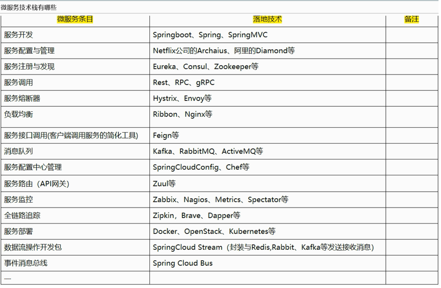
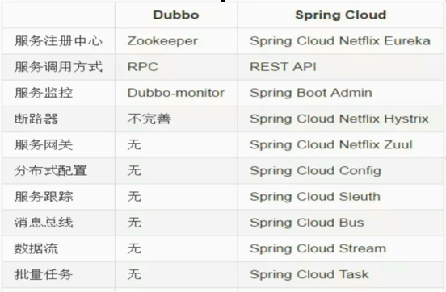
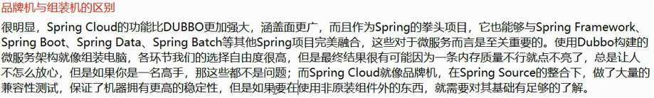

#SpringCloud

## SpringCloud 和 SpringBoot是什么关系？

+ SpringBoot 专注于快速方便的开发单体个体微服务
+ SpringCloud专注关注全局的微服务协调整理框架，它将SpringBoot开发的一个一个单体微服务整合并管理起来，
  为各个微服务之间提供,配置管理、服务发现、断路器、路由、微代理、事件总线、全局锁、决策竞选、分布式会话等等集成服务

SpringBoot可以离开SpringCloud独立使用开发项目，但是SpringCloud离不开SpringBoot，属于依赖的关系。

SpringBoot专注于快速、方便的开发单个微服务个体，SpringCloud关注全局服务治理框架。

## Dubbo vs SpringCloud

Dubbo的定位始终是一款RPC框架，而SpringCloud的目标是微服务架构下的一站式解决方案。

最大的区别：SpringCloud抛弃了Dubbo的RPC通信，采用的是基于HTTP的REST方式。

严格来说，这两种方式各有优劣。虽然从一定程度上来说，后者牺牲了服务调用的性能，但也避免了上面提到的原生RPC带来的问题。而且REST相比RPC更为灵活，服务提供方和调用方的依赖只依靠一纸契约，不存在代码级别的强依赖，这在强调快速演化的微服务环境下，显得更加合适。

