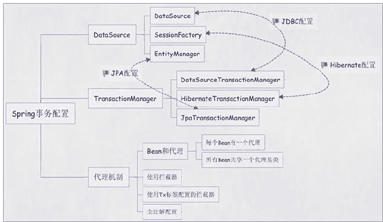

# 常用框架整合事项

**额外知识**

```xml
<!-- spring3中提供了一种简便的方式就是 <content:property-placeholder>元素，
方便的切换常量参数的配置信息 
这里的location值为参数配置文件的位置，配置文件通常放
    到src目录下，参数配置文件的格式即键值对的形式 
 -->
<context:property-placeholder location="classpath:jdbc.properties"/>

<!-- 或者 -->
<bean id="propertyPlaceholderConfigurer" class="org.springframework,beans.factory.config.PropertyPlaceholderConfigurer">
    <!-- 这里的location值为参数配置文件的位置，配置文件通常放
    到src目录下，参数配置文件的格式即键值对的形式 -->
    <property name="locations">
        <list>
            <value>jdbc.properties<value/>
        </list>
    </property>
</bean>

<!--  <content:property-placeholder> 的作用是用于激活那些已经在spring容器里注册过
的bean（无论是通过xml的方式还是通过package sanning的方式）上面的注解。 -->
 <content:property-placeholder>

<!-- <context:component-scan>除了具有<context:annotation-config>的功能之外，
<context:component-scan>还可以在指定的package下扫描以及注册javabean 。 -->
 <context:component-scan/> 
```


**为什么整合 Spring 和 Struts2？**

Struts2 在整合之前通过反射生成实例、事务

Struts2 与 Spring 整合就是为了用Spring管理Struts2的Action，这样就可以从（spring）容器里拿对象

```shell
         |---- IOC 管理对象
Spring --|
         |---- AOP 事务管理
```

**SpringMVC hibernate druid jdbc等数据源事务配置**

Spring配置文件中关于事务配置总是由三个组成部分，分别是`DataSource`、`TransactionManager`和`代理机制`这三部分，无论哪种配置方式，一般变化的只是代理机制这部分。

`DataSource、TransactionManager` 这两部分只是会根据数据访问方式有所变化，比如使用Hibernate进行数据访问时，DataSource实际为SessionFactory，TransactionManager的实现为HibernateTransactionManager



**为什么整合 Spring 和 Hibernate？**

1、管理sessionFactory实例（只需要一个就够），由IOC容器来管理Hibernate的SessionFactory

2、声明事务管理，让Hibernate使用上Spring的声明式事务

## Spring 整合 Hibernate

```
1、Spring去读取指定路径下的资源文件
2、配置数据连接池(c3p0[druid...]连接池)
3、配置SessionFactory
4、配置事务管理器
5、定义事务通知
6、定义事务切面，并应用事务通知
```

```xml
<?xml version="1.0" encoding="UTF-8"?>
<beans xmlns="http://www.springframework.org/schema/beans"
  xmlns:xsi="http://www.w3.org/2001/XMLSchema-instance"
  xmlns:aop="http://www.springframework.org/schema/aop"
  xmlns:tx="http://www.springframework.org/schema/tx"
  xsi:schemaLocation="http://www.springframework.org/schema/beans
					  http://www.springframework.org/schema/beans/spring-beans.xsd
					  http://www.springframework.org/schema/tx
					  http://www.springframework.org/schema/tx/spring-tx.xsd
					  http://www.springframework.org/schema/aop
					  http://www.springframework.org/schema/aop/spring-aop.xsd">
    <!-- 1、使用注解形式
       <context:component-scan base-package="com.test" />
	<bean class="org.springframework.beans.factory.config.PropertyPlaceholderConfigurer">
	  <property name="locations">
	  	<list>
	  		<value>classpath:jdbc.properties</value>
	  	</list>
	  </property>
	</bean>
     -->

    <!-- 让 1、spring 去读取指定路径下的资源文件 -->
    <bean class="org.springframework.beans.factory.config.PropertyPlaceholderConfigurer">
	  <property name="locations" value="classpath:jdbc.properties"/>
	</bean>
	
	<!-- 2、配置c3p0连接池 -->
	<bean id="c3p0Source" class="com.mchange.v2.c3p0.ComboPooledDataSource" destroy-method="close">
	  <property name="driverClass" value="${driverClass}" />
	  <property name="jdbcUrl" value="${url}" />
	  <property name="user" value="${user}" />
	  <property name="password" value="${password}" />
	  <property name="initialPoolSize" value="${initialPoolSize}" />
	  <property name="minPoolSize" value="${minPoolSize}" />
	  <property name="maxPoolSize" value="${maxPoolSize}" />
	  <property name="maxIdleTime" value="${maxIdleTime}" />
	</bean>
	
	<!-- 3、配置SessionFactory -->
	<bean id="sessionFactory" class="org.springframework.orm.hibernate4.LocalSessionFactoryBean">
	  <property name="dataSource" ref="c3p0Source" />
	  <property name="mappingResources">
		  <list>
          <!-- 引入实体配置 -->
		    <value>/com/cdzg/spring/bean/User.hbm.xml</value>
		  </list>
	  </property>
      
<!-- 3、使用注解的形式，去掉繁杂的bean配置
 使用注解的方式，确定所需扫描的注解所在包的路径，若仅使用配置的方式，可以注释这一配置
		<property name="packagesToScan">
			<list>
				<value>com.test.bean</value>
			</list>
		</property>
 -->

	  <property name="hibernateProperties">
	    <props>
				<prop key="hibernate.dialect">${dialect}</prop>
				<prop key="hibernate.hbm2ddl.auto">${hbm2ddl.auto}</prop>
				<prop key="hibernate.show_sql">${show_sql}</prop>
				<prop key="hibernate.format_sql">${format_sql}</prop>
				<prop key="hibernate.use_sql_comments">${use_sql_comments}</prop>
			</props>
	  </property>
	</bean>
	
	<!-- 4、配置事务管理器 -->
	<bean id="txManager" class="org.springframework.orm.hibernate4.HibernateTransactionManager">
	  <property name="sessionFactory" ref="sessionFactory" />
	</bean>
	
	<!-- 5、定义事务通知 -->
	<tx:advice id="txAdvice" transaction-manager="txManager">
	  <tx:attributes>
	    <tx:method name="get*" read-only="true"/>
	    <tx:method name="*"/>
	  </tx:attributes>
    </tx:advice>
     
     <!-- 6、定义事务切面，并应用事务通知 -->    
     <aop:config>
	  <aop:pointcut id="xxxBizImpl" expression="execution(* com.cdzg.spring.biz.*.*(..))"/>
	  <aop:advisor pointcut-ref="xxxBizImpl" advice-ref="txAdvice"/>
	 </aop:config>
</beans>
```


Spring在集成Hibernate时又分为两种形式:(概括来说，就是注解方式和xml方式)

+ 1) 继续使用Hibernate的映射文件*.hbm.xml

+ 2) 使用jpa注解形式的pojo对象，而去掉*.hbm.xml的Hibernate映射文件

**两种配置方式最大的不同就是注解方式不用写O/R映射配置文件，而xml方式实现的要配置O/R的配置文件。**


Spring 使用Hibernate访问数据库的三种方式：

+ 1) 直接使用 Hibernate API (不推荐使用)

优点： 与Spring框架完全分离

缺点：

   (1)无法使用Spring框架封装所提供的额外功能。如：直接使用Hibernate API 需要`try ... catch()`处理HibernateException异常

   (2)需要实现类中加入`setSessionFactory(SessionFactory sessionFactory)` 属性，接收依赖注入的SessionFactory

+ 2) 继承 Spring 的`HibernateDaoSupport`,使用HibernateTemplate(`不推荐使用getSession(),用完后需要手动关闭`)

> 特点：对 HibernateTemplate 没有提供的功能，可以直接调用HibernateTemplate 对象的 getSession() 方法（极其不推荐使用）得到Session对象实例用`try{Hibernate API}catch(Hibernate ex){}`操作。

+ 3) 对`HibernateTemplate`没有提供的功能，还可以用`HibernateCallback`(极其推荐)

```java
getHibernateTemplate().executeFind(
    new HibernateCallback(){

});
```


### Hibernate 的SessionFactory对象交给Spring创建

**将hibernate相关配置配在applicationContext.xml中**
```xml
<!-- 本地会话工厂bean,spring整合hibernate的核心接口 -->  
<bean id="sessionFactory" class="org.springframework.orm.hibernate3.LocalSessionFactoryBean">  
    <property name="dataSource" ref="dataSource"/>  
      
    <!-- 指定hibernate自身的属性 -->  
    <property name="hibernateProperties">  
    <props>  
        <prop key="hibernate.dialect">${hibernate.dialect}</prop>  
        <prop key="hibernate.show_sql">${hibernate.show_sql}</prop>  
        <prop key="hibernate.hbm2ddl.auto">${hibernate.hbm2ddl.auto}</prop>  
    </props>  
    </property>  
      
    <!-- 从指定目录下查找映射文件-->  
    <property name="mappingDirectoryLocations">  
        <list>  
            <value>cn/itcast/spring/domain</value>  
        </list>  
    </property>   
      
    <!-- 映射文件的位置  
    <property name="mappingResources">  
        <list>  
            <value>cn/itcast/spring/domain/Customer.hbm.xml</value>  
        </list>  
    </property>  
     -->  
</bean>  
```


### 在`applicationContext.xml`中引入`hibernate.cfg.xml`

```xml
<bean id="sessionFactory" class="org.springframework.orm.hibernate3.LocalSessionFactoryBean">  
        <property name="dataSource" ref="dataSource"/>  
  
        <!-- 使用hibernate自身的配置文件配置 -->
        <property name="configLocations">  
            <list>  
                <value>classpath:xx/xx/xx/hibernate/hibernate.cfg.xml</value>  
            </list>  
        </property>  
</bean>  
```


### Spring 整合 SpringMVC

**Spring容器 和 SpringMVC容器是父子关系，整合是把controller交给SpringMVC容器**
```xml
<?xml version="1.0" encoding="UTF-8"?>
<beans xmlns="http://www.springframework.org/schema/beans"
       xmlns:xsi="http://www.w3.org/2001/XMLSchema-instance"
       xmlns:context="http://www.springframework.org/schema/context"
       xmlns:mvc="http://www.springframework.org/schema/mvc"
       xsi:schemaLocation="http://www.springframework.org/schema/beans http://www.springframework.org/schema/beans/spring-beans.xsd
        http://www.springframework.org/schema/context http://www.springframework.org/schema/context/spring-context-4.0.xsd
        http://www.springframework.org/schema/mvc http://www.springframework.org/schema/mvc/spring-mvc-4.0.xsd">

    <!-- 指定 Spring MVC 扫描含有如 @Controller 等注解的包的路径，一般为项目控制器所在
    包的路径。进行这一配置后无需再写入 <context:component-config />。有关 component-scan 
    的内容可以参见参考 13.「Spring 注解 @Component、@Repository、@Service、@Controller 
    区别」。这里使用 include-filter 使得只有含有 @Controller 注解的控制器 bean 会使用 
    Spring mvc 的上下文，参见参考 19.「在使用 spring mvc 时... @Transactional 声明的事
    务不起作用」。-->
    <context:component-scan base-package="com.ecollaboration.controllers">
        <context:include-filter type="annotation" expression="org.springframework.stereotype.Controller"/>
    </context:component-scan>

    <!-- 指定视图文件后缀和所在的路径，在控制器的方法中返回的字符串值会表示这一路径下的同名文件 -->
    <bean class="org.springframework.web.servlet.view.InternalResourceViewResolver">
        <property name="prefix" value="/WEB-INF/views/"/>
        <property name="suffix" value=".jsp"/>
    </bean>

    <!-- 此配置使得 @ResponseBody 等注解可以生效 -->
    <mvc:annotation-driven/>

    <!-- 此配置使得控制器可以根据返回类型返回 json 数据或视图文件 -->
    <bean class="org.springframework.web.servlet.view.ContentNegotiatingViewResolver">

        <property name="order" value="1"/>

        <property name="defaultViews">
            <list>
                <bean class="org.springframework.web.servlet.view.json.MappingJackson2JsonView"/>
            </list>
        </property>

        <property name="contentNegotiationManager">
            <bean class="org.springframework.web.accept.ContentNegotiationManagerFactoryBean">
                <property name="favorParameter" value="true"/>
                <property name="parameterName" value="format"/>
                <property name="ignoreAcceptHeader" value="false"/>
                <property name="mediaTypes">
                    <value>
                        json=application/json
                        xml=application/xml
                        html=text/html
                    </value>
                </property>
                <property name="defaultContentType" value="text/html"/>
            </bean>
        </property>

    </bean>

    <!-- 添加 Spring mvc 的文件上传支持 -->
    <bean id="multipartResolver" class="org.springframework.web.multipart.commons.CommonsMultipartResolver">
        <property name="maxUploadSize" value="10240000"/>
        <property name="defaultEncoding" value="UTF-8"/>
    </bean>

    <!-- 添加此配置用于排除 Spring mvc 对静态资源文件的处理。有关静态资源路径问题参见参考 31.「Spring mvc 访问静态资源的三种方式」 -->
    <mvc:resources mapping="/resources/**" location="/resources/"/>

    <!-- 添加拦截器 -->
    <mvc:interceptors>
        <!-- 全局拦截器，会对所有的请求拦截 -->
        <bean id="normalInterceptor" class="com.ecollaboration.interceptors.NormalInterceptor"/>

        <!-- 局部拦截器，只拦截与 mapping 匹配的请求 -->
        <mvc:interceptor>
            <mvc:mapping path="/hello/register"/>
            <mvc:mapping path="/hello/index/*"/>
            <bean id="testInterceptor" class="com.ecollaboration.interceptors.TestInterceptor"/>
        </mvc:interceptor>

    </mvc:interceptors>
</beans>
```


###

### 