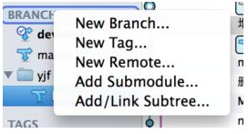
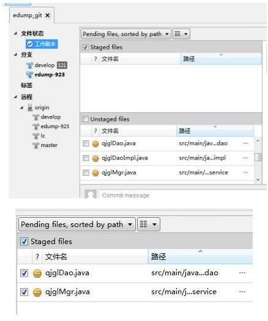
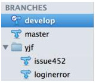

# Git

head 
	
	HEAD 就是当前活跃分支的游标。形象的记忆就是：你现在在哪儿，HEAD 就指向哪儿，所以 Git 才知道你在那儿！

master

> 在公司的产品开发中，存在以下几个git分支，请大家务必分辨清楚，以免造成混乱：
> master分支：主干分支，仅仅存放稳定的产品代码。建议除管理员外的其他人不要下载该分支，以免扰乱主干代码的稳定性。
> develop分支：开发分支，所有人在初始化代码时候都下载该分支，并在这个分支上开一个issue分支进行开发，最后所有开发过程中的代码都必须合并提交到该分支。
> release分支：发布分支，在develop分支测试稳定后，发布管理员将代码branch到release分支，并打包发布。后续所有发布版本存在的问题都在该分支上进行修改。
> issue分支：特性分支，真正进行代码开发的分支，所有的开发人员将develop分支下载到本地后，在开发某个特性的时候都需要branch一个issue分支，并在该分支上进行开发，开发完成后，合并到develop分支上。

###本地和远程仓库：

- Git有一个远程的仓库（所有开发人员共享）和一个本地的仓库（开发人员私有）。
  
	开发人员将分支从远程checkout下来后就存放在本地仓库中，本地仓库进修改代码后commit到本地仓库，再push到远程仓库。所有远程仓库的改动都可以pull到本地仓库。

- origin->develop表示develop在远程仓库中的分支。

	develop表示develop在本地仓库中的分支。

## 利用GIT分支进行开发：

1、 从Git中下载源码：

   用Eclipse->Import下载版本即可（参考开发环境设置文档），注意：在下载的时候请选择下载develop分支。

2、 创建issue分支，并在其上进行开发：

   新开始一个开发任务的时候，比如开始JIRA任务issue452，则在SourceTree中右击BRANCH，选择New Branch。

输入名称，yjf/issue452，创建分支。

3、 在yjf/issue452分支下面工作。

4、 完成开发任务后，点击sourcetree中的工作副本：右边下部是经过修改，但是未暂存的文件（Unstaged files），右边上部是已暂存文件。将所有未暂存文件前面打钩，文件则会移动到右边上部区域中。

5、 点击按钮，输入备注文字（务必要输入），提交 yjf/issue452分支。（注意：commit只会提交到本地的git仓库。）

6、 切换到 develop分支（双击树上的develop即可）

7、 右击yjf/issue452分支，点击“合并yjf/issue452至当前分支”。

8、 开始新的一个issue（参考步骤2）

9、 完成多个issue后，和远程进行同步。切换到develop分支，合并所有代码。先 下载远程的更新，然后再把本地提交的内容上去。

10、 如果还想修改原来的issue452的内容，则

a) 双击 issue452，将分支切换回452

b) 右击develop刚刚得到的更新，merge到issue452分支即可。

11、 如果一个issue确实已经开发完毕，可以右击yjf/issue452，将该分支进行删除。

#Github

fork： 想拷贝别人项目到自己帐号下就fork一下。

star： 持续关注别人项目更新就star一下

watch： watch是设置接收邮件提醒的

