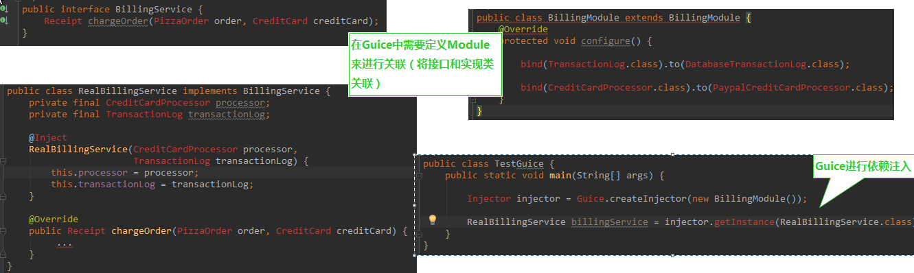

# Google-Guice 

Guice是一个轻量级的DI框架

+ Guice：整个框架的门面
+ Injector：一个依赖的管理上下文
+ Binder：一个接口和实现的绑定
+ Module：一组Binder
+ Provider：bean的提供者
+ Key：Binder中对应一个Provider
+ Scope：Provider的作用域
+ Stage：运行方式（为了不同的要求）




其实对于Guice而言，程序员所要做的，<font color=red size=4>只是创建一个代表关联关系的Module</font>，然后使用这个Module即可得到对应关联的对象。因此，主要的问题其实就是在如何关联实现类和接口（子类和父类）

**在自定义的Module类中进行绑定**

+ 在configure方法中绑定

1) <font color=#6CE26C size=4>链式绑定是最简单，最直接，也是使用最多的绑定方式。</font>
```java
protected void configure() {  
  bind(TransactionLog.class).to(DatabaseTransactionLog.class); 
  /**
   * 当外界获取TransactionLog时，其实返回的就是一个DatabaseTransactionLog对象。
   **/ 
}  
```
就是直接把一种类型的class对象绑定到另外一种类型的class对象，这样，当外界获取TransactionLog时，其实返回的就是一个DatabaseTransactionLog对象。当然，<font color=green size=4>链式绑定也可以串起来</font>，如：
```java
protected void configure() {  
  bind(TransactionLog.class).to(DatabaseTransactionLog.class);  
  bind(DatabaseTransactionLog.class).to(MySqlDatabaseTransactionLog.class); 
  /**
  *  这样，当外界请求TransactionLog时，其实返回的就会是一个
  * MySqlDatabaseTransactionLog对象。 
  **/
}  
```

2) <font color=#6CE26C size=4>注解（Annotations）绑定</font>

&nbsp;&nbsp;链式绑定针对于同样的类型都绑定到同一种目标类型时，非常好用，但是对于一个
接口有多种实现的时候，链式绑定就不好区分该用哪种实现了。可以把Annotations绑定方式看作
是链式绑定的一种扩展，专门用来解决这种同一个接口有多种实现的问题。Annotations绑定又可
以分为两种，一种是需要自己写Annotations，另外一种则简化了一些。

- 自定义Annotations的方式

- 在@Provides方法中进行绑定