# sourcetree的使用

	
	上图只用于大致示意“分支”使用的场景，我们先不说它是否规范吧。从图中可以看出：
	master 分支一般不轻易修改，只用于测试完成后发布线上版本；
	大部分修改在 develop 分支上进行，发版本时 merge 到 master 分支；
	涉及到大的功能修改时，再新起一个分支，如 article，开发完成后 merge 到 develop 分支（然后销毁新分支 article ，再有大的修改时另起一个分支）；
	分支还有其它很多使用场景，比如多人在一个项目下开发，每人建一个分支等；这里不做展开，以上就是告诉大家，分支在项目开发中经常使用，不仅多人协作时十分重要，单人开发时也很有用处。

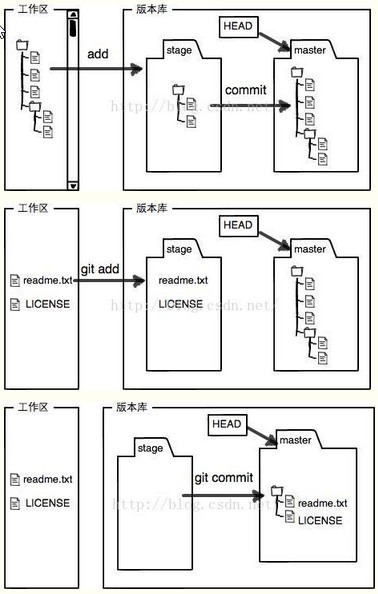

##创建仓库 clone&pull

1. 创建仓库，用我们刚才创建的账号登陆github，在欢迎页点击“+ New repository“创建我们的仓库
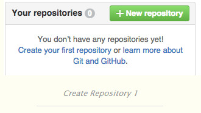

2. 或点击右上角的“+”，然后再New repository亦可

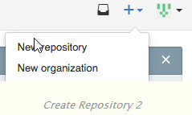

3. 按照个人需要填写仓库名、仓库描述等，建议勾选“Initialize this repository with a README”（注意此处免费账户只能选择建立public（开源）仓库），填写完成后点击Create repository

4. 至此，我们的仓库已经创建成功。创建成功后，我们在页面的右下角找到链接，点击复制
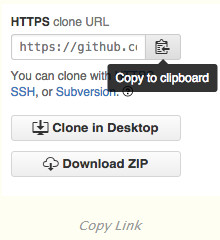

5. 打开我们的SourceTree，点击：“+新仓库”，选择：“从URL克隆”

6. 粘贴我们的仓库链接至源URL，SourceTree会自动帮我们生成目标路径（本地仓库路径）以及名称，点击克隆
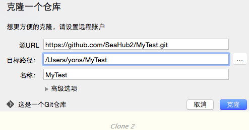

7. 等待数秒后，SourceTree会为我们自动打开我们刚才克隆的仓库，选择master选项，这里我们可以看到我们仓库里的所有文件
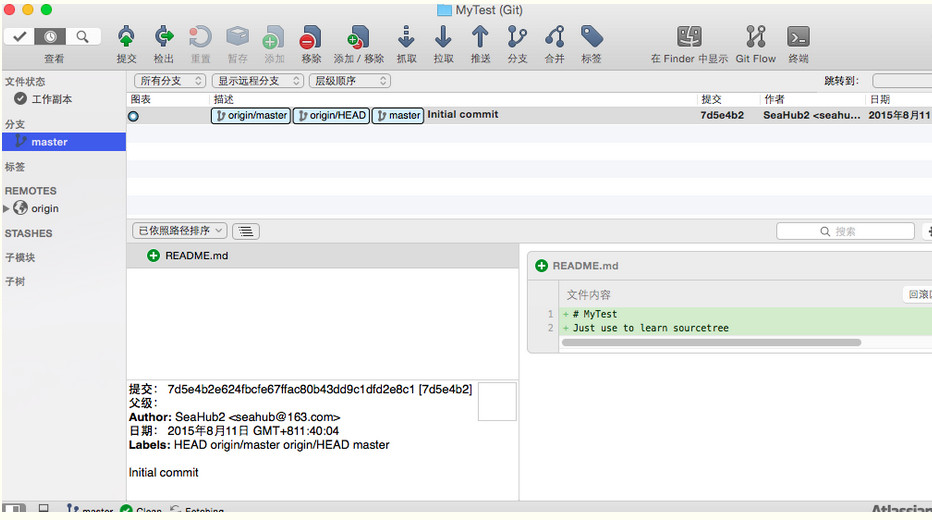

6. 接下来我们想要上传一个项目至我们的远程Github仓库内。我们点击右上角“在Finder”中显示。然后SourceTree会帮我们打开我们的本地仓库，我们将需要上传的项目复制到本地的Finder文件夹内，然后关闭文件夹，回到主页面。我们会发现工作副本出现了更改提示

7. 我们点击工作副本，然后我们发现我们刚才上传的文件都在未暂存文件当中，此时，我们勾选“未暂存文件”
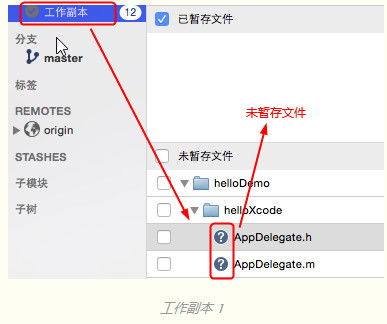

8. 发现我们的文件变成了已暂存文件。此时，我们可以输入更新信息，然后，点击提交按钮
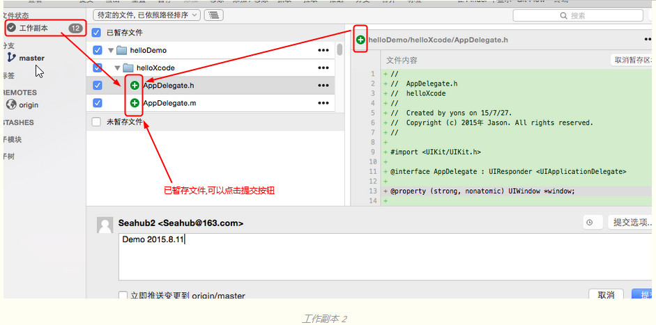

9. 我们切换回master分支，会发现master分支以及推送（Push）按钮，都出现了更改提示。这表示SourceTree已经将我们刚才添加的文件成功提交到本地仓库，而本地仓库的内容则比远程仓库超前了一个版本。我们这个时候点击推送（Push）即可将本地仓库的内容同步至远程仓库。
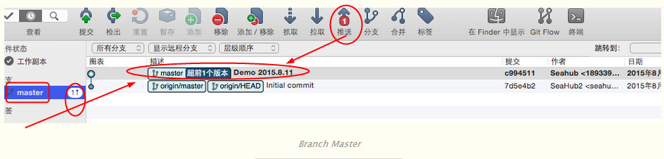

10. 点击推送（push），等待片刻即可，我们重新登录github网站，会发现我们刚才本地仓库的文件已经成功推送到远程仓库

## 实践入门-参与开源 Fork&pull request
(以下以 [https://github.com/octocat/Spoon-Knife] 举例)
1. 首先打开上述页面，然后点击右上角“fork”按钮。fork意味着将他人的仓库复制到我们账号中。如果我们想要参与开源项目，首先要fork下别人的项目，然后在我们复制过来的仓库中，对别人的代码做修改。
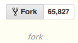

2. fork完之后，我们用上文提到的方法，将自己账号中的[Spoon-Knife]仓库克隆（clone）到本机SourceTree中，并在稍作更改后，推送（push）到自己账号的远程仓库
 
 - 2.1 在SourceTree中建立新仓库，并复制URL

 - 2.2 在本地仓库中稍作更改（如图我新建了一个Test）
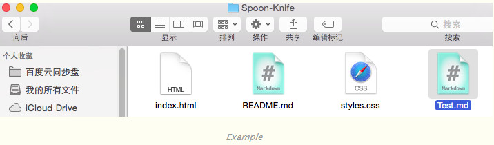

 - 2.3 通过上文方法推送（Push），登陆Github，进入Spoon-Knife仓库，发现test已经上传到我们账号的远程仓库Spoon-Knife当中
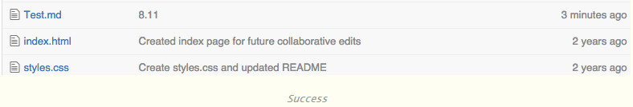

3. 上传完后，我们点击Github branch旁的绿色按钮

4. 之后我们会进入一个Compare页面，这个页面用于比较作者仓库与我们仓库的文件的不同。Base fork：指的是作者仓库目录地址；Head fork：指的是我们账号中fork后所产生的仓库地址。我们点击Create pull request即可

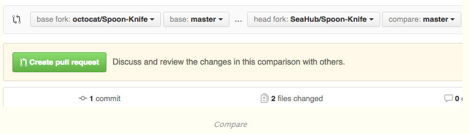

5. 然后我们会进入一个Pull Request界面，在这里，我们可以输入自己更改的原因/更改的内容。这里写的文字会显示给源代码作者，如果作者接受了我们的推送请求（pull request）后，我们的代码将会上传到源代码作者的仓库内，成功为开源做贡献。如果作者拒绝了我们的推送请求（pull request）后，我们的代码将不会上传到源代码作者的仓库内。

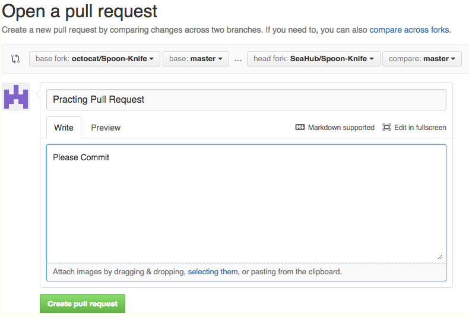

6. 我们点击Create Pull Request即可，系统将自动跳转到等待回复的页面，这里会显示作者是否接受我们的代码更改。

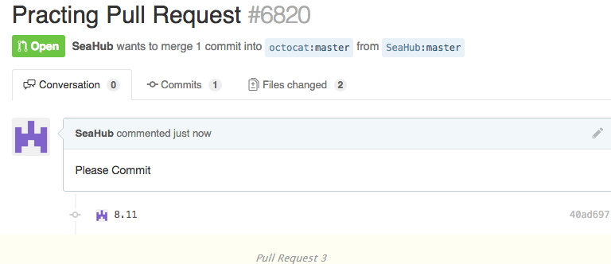

================================================================================

## SourceTree&Git部分名词解释
克隆(clone)：从远程仓库URL加载创建一个与远程仓库一样的本地仓库
提交(commit)：将暂存文件上传到本地仓库（我们在Finder中对本地仓库做修改后一般都得先提交一次，再推送）
检出(checkout)：切换不同分支
添加（add）：添加文件到暂存区
移除（remove）：移除文件至暂存区
暂存(git stash)：保存工作现场
重置(reset)：回到最近添加(add)/提交(commit)状态
合并(merge)：将多个同名文件合并为一个文件，该文件包含多个同名文件的所有内容，相同内容抵消
抓取(fetch)：从远程仓库获取信息并同步至本地仓库
拉取(pull)：从远程仓库获取信息并同步至本地仓库，并且自动执行合并（merge）操作，即 pull=fetch+merge
推送(push)：将本地仓库同步至远程仓库，一般推送（push）前先拉取（pull）一次，确保一致
分支(branch)：创建/修改/删除分枝
标签(tag):给项目增添标签
工作流(Git Flow):团队工作时，每个人创建属于自己的分枝（branch），确定无误后提交到master分枝
终端(terminal):可以输入git命令行
这里只对SourceTree做一下大体讲解。

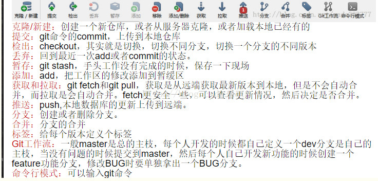