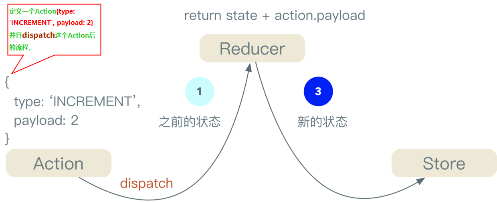
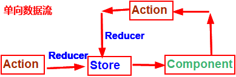
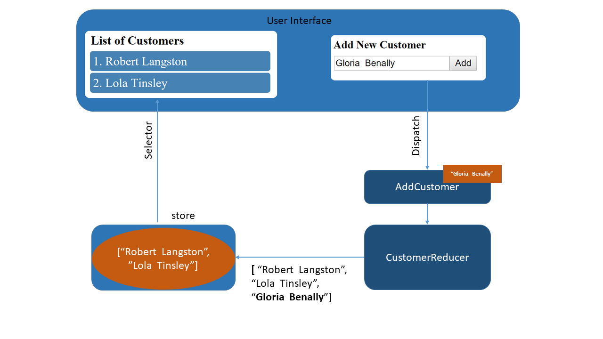

# ngrx

> Redux模式，在React中，有Redux和Flux，在Angular中，就有Ngrx。


<font color=red size=5>什么是Redux?</font>

&nbsp;&nbsp; <font color=red size=4>Redux是为了解决应用程序状态（State）管理而提出的一种解决方案。</font>对于应用开发来讲，<font color=#5cb85c size=4>UI上显示的数据、控件状态、登陆状态、数据加载画面的不同状态</font>等等全部可以看作状态。

Redux 的三个概念：<font color=#5cb85c size=4>Reducer、Action、Store</font>

**Store** 一般负责：保存应用状态、提供访问状态的方法、派发Action的方法以及对于状态订阅者的注册和取消等。(可以理解成内存数据库)

**Reducer** 其实就是用来维护状态的。reduce就是对数组元素进行累加计算成为一个值。（可以理解成数据库表，但这种说法不太精确）

**Action** 在Redux规范中，所有的会引发状态更新的交互行为都必须通过一个显性定义的Action来进行。(Reducer和Store之间的通信靠Action)


注意：
```ts
export interface Action { 
  type: string; 
  payload?: any; // 这个值可有可无
}
```

<font color=#5cb85c size=5>ngrx是一套利用RxJS的类库,其中`@ngrx/store`就是基于Redux规范制定的Angular2框架。</font>

## @ngrx/store

RxJS 基于Redux的设计思想，为Angular应用提供强有力的状态管理工具

`@ngrx/store`是一个旨在提高写性能的控制状态的容器，在angular的应用程序上是一致的。

<font color=#4395FF size=4>核心：</font>

+ State是一个不可变的数据结构
+ Action描述State的改变
+ Reducer(纯函数)拿到下一个State和之前的State来计算一个新的State。
+ 通过`Store`访问State,一个可观测state和一个actions观察者

安装使用：`npm install @ngrx/store --save` 或 `yarn add @ngrx/store`

**State 与 Angular的Component的关系**

+ State驱动Component进行渲染(this.store.dispatch)
+ Component发action来改变State




## @ngrx/effects

`@ngrx/effects` 提供一套API(装饰器 `@Effect( )` 和 Action) 来帮助检查`Store.dispatch( )`出来的 Action。将特定类型的 Action 过滤出来进行处理，监听特定Action，当发现特定的Action发出之后，自动执行某些操作，然后将处理的结果重新发送回 store 中。

<font color=#4395FF size=4>核心：</font>

+ 监听派发出来(`@ngrx/store` 的`Store.dispatch`)的Action
+ 隔离业务和组件(`Component`只通过`select state` 和 `dispatch actions`即可)
+ 提供新的`reducer state`(基于网络请求、web socket 消息 或 time事件驱动[定时刷新])

安装使用：`npm install @ngrx/effects --save` 或 `yarn add @ngrx/effects`

**Effects 通常注入到service类**

### <font color=#449D44 size =4>注册Effect</font>

`EffectsModule.forRoot( )` <font color=red size=4>必须在根模块下注册,如果不需要注册任何根级别的Effect，可以Provider一个空数组。</font>

```ts
//app.module.ts
@NgModule({
  imports: [
    EffectsModule.forRoot([
      SourceA,
      SourceB,
      SourceC,
    ])
    //EffectsModule.forRoot([])  //提供一个空数组
  ]
})
export class AppModule {  }
```

`EffectsModule.forFeature( )` <font color=red size=4>可以在任何ng模块使用（导入）EffectsModule.forFeature(),无论是根模块(AppModule)，还是任何一个功能模块。</font>

```ts
//feature.module.ts
@NgModule({
  imports: [
    EffectsModule.forFeature([
      FeatureSourceA,
      FeatureSourceB,
      FeatureSourceC,
    ])
  ]
})
export class FeatureModule { }
```

### <font color=#449D44 size =4>Init Action</font>
```ts
import { Injectable } from '@angular/core';
import { Actions } from '@ngrx/effects';

@Injectable()
export class SomeEffectsClass {
  constructor(private actions$: Actions) {}
}
```
示例：
```ts
import { Action } from '@ngrx/store';
import { Actions, Effect } from '@ngrx/effects';
import { defer } from 'rxjs/observable/defer';
import * as auth from '../actions/auth.actions';

@Injectable()
export class AppEffects {

    @Effect()
    init$: Observable<Action> = defer(() => {
      return of(new auth.LoginAction());
    });

    constructor(private actions$: Actions) { }
}
```

### <font color=#449D44 size =4>ofType</font>
```ts
import { Injectable } from '@angular/core';
import { Actions, Effect, ofType } from '@ngrx/effects';
import { tap } from 'rxjs/operators';

@Injectable()
export class SomeEffectsClass {
  constructor(private actions$: Actions) {}

  @Effect() authActions$ = this.action$.pipe(
    ofType<LoginAction | LogoutAction>('LOGIN', 'LOGOUT'),
    tap(action => console.log(action))
  );
}
```

## @ngrx/router-store

通过`@ngrx/store`绑定连接angular路由

安装使用：`npm install @ngrx/router-store --save` 或 `yarn add @ngrx/router-store`

```ts
/**
 * Payload of ROUTER_NAVIGATION.
 */
export declare type RouterNavigationPayload<T> = {
  routerState: T;
  event: RoutesRecognized;
};
/**
 * An action dispatched when the router navigates.
 */
export declare type RouterNavigationAction<T = RouterStateSnapshot> = {
  type: typeof ROUTER_NAVIGATION;
  payload: RouterNavigationPayload<T>;
};
```
### <font color=#449D44 size =4>注册使用`@ngrx/router-store`</font>
```ts
import { StoreRouterConnectingModule, routerReducer } from '@ngrx/router-store';
import { AppComponent } from './app.component';

@NgModule({
  imports: [
    BrowserModule,
    StoreModule.forRoot({ routerReducer: routerReducer }),
    RouterModule.forRoot([
      // routes
    ]),
    StoreRouterConnectingModule.forRoot()
  ],
  bootstrap: [AppComponent]
})
export class AppModule { }
```

## @ngrx/store-devtools

`@ngrx/store` 的开发工具

```ts
import { StoreDevtoolsModule } from '@ngrx/store-devtools';
import { environment } from '../environments/environment'; // Angular CLI environemnt

@NgModule({
  imports: [
    StoreModule.forRoot(reducers),
    // Instrumentation must be imported after importing StoreModule (config is optional)
    !environment.production ?
      StoreDevtoolsModule.instrument({
        maxAge: 25 // Retains last 25 states
      })
      : [],
  ]
})
export class AppModule { }
```

## @ngrx/entity

安装使用：`npm install @ngrx/entity --save` 或 `yarn add @ngrx/entity`


## angular教程：使用ngrx进行状态管理

**并非每个Angular应用程序中都需要状态管理**

NgRx中这些组件之间的交互




[编码实践](http://)

## 各版本的整合升级

[详见](https://ngrx.io/guide/migration/v8)


