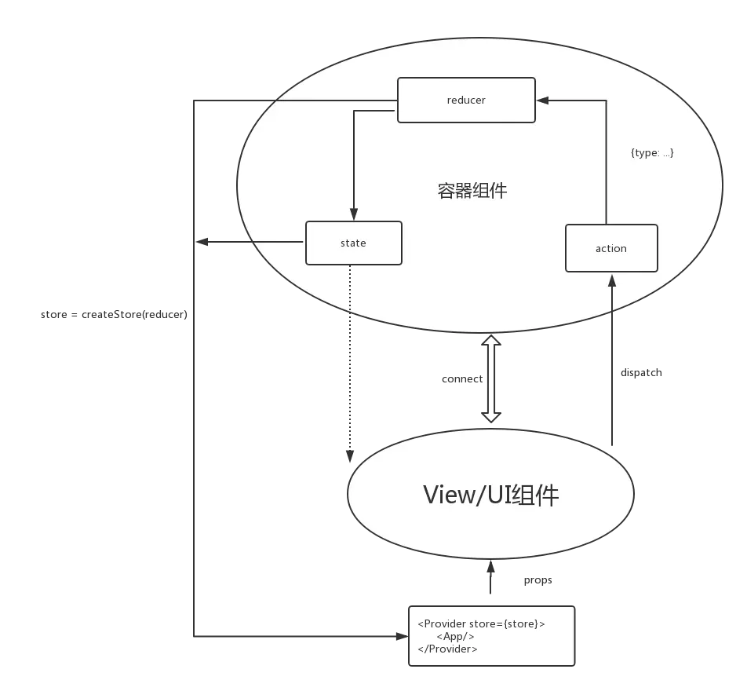
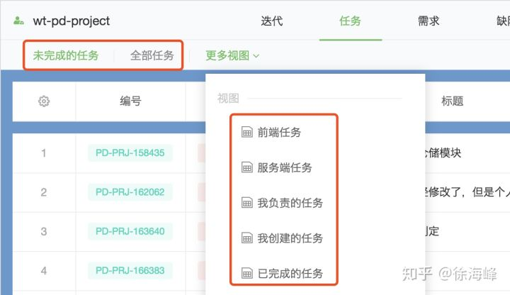

# Redux 学习
> **Redux 是 JavaScript 状态容器，提供可预测化的状态管理。**
>
> 可以让你构建一致化的应用，运行于不同的环境（客户端、服务器、原生应用），并且易于测试。不仅于此，它还提供 超爽的开发体验，比如有一个时间旅行调试器可以编辑后实时预览。
>
> Redux 除了和 React 一起用外，还支持其它界面库。
> 它体小精悍（只有2kB）且没有任何依赖。


## 函数式编程思想

<font color=#D18100>函数式编程是把一个功能的一个操作和相关数据封装在一起，函数式编程是函数满天飞。</font>(面向对象是把一个功能的一组操作和相关数据封装在一个对象里，面向对象是对象满天飞。)


<font color=#D18100>函数不访问全局变量，也不改变全局变量。</font>(函数式编程的准则：函数不受外部变量影响，不依赖于外部变量，也不改变外部变量的值。)


函数式编程关心数据的映射，命令式编程关心解决问题的步骤.

**特点**

1) 函数是"第一等公民"

&nbsp;&nbsp;所谓"第一等公民"（first class），指的是函数与其他数据类型一样，处于平等地位，可以赋值给其他变量，也可以作为参数，传入另一个函数，或者作为别的函数的返回值。


举例来说，下面代码中的print变量就是一个函数，可以作为另一个函数的参数。

2) 只用"表达式"，不用"语句"

"表达式"（expression）是一个单纯的运算过程，总是有返回值；"语句"（statement）是执行某种操作，没有返回值。函数式编程要求，只使用表达式，不使用语句。也就是说，每一步都是单纯的运算，而且都有返回值。

原因是函数式编程的开发动机，一开始就是为了处理运算（computation），不考虑系统的读写（I/O）。"语句"属于对系统的读写操作，所以就被排斥在外。

当然，实际应用中，不做I/O是不可能的。因此，编程过程中，函数式编程只要求把I/O限制到最小，不要有不必要的读写行为，保持计算过程的单纯性。

3) 没有"副作用" -- 不会修改外部变量

所谓"副作用"（side effect），指的是函数内部与外部互动（最典型的情况，就是修改全局变量的值），产生运算以外的其他结果。

<font color=#D18100>函数式编程强调没有"副作用"，意味着函数要保持独立，所有功能就是返回一个新的值，没有其他行为，尤其是不得修改外部变量的值。</font>

4) 不修改状态

上一点已经提到，函数式编程只是返回新的值，不修改系统变量。因此，不修改变量，也是它的一个重要特点。

在其他类型的语言中，变量往往用来保存"状态"（state）。不修改变量，意味着状态不能保存在变量中。函数式编程使用参数保存状态，最好的例子就是递归。下面的代码是一个将字符串逆序排列的函数，它演示了不同的参数如何决定了运算所处的"状态"。


5) 引用透明

引用透明（Referential transparency），指的是函数的运行不依赖于外部变量或"状态"，只依赖于输入的参数，任何时候只要参数相同，引用函数所得到的返回值总是相同的。

有了前面的第三点和第四点，这点是很显然的。其他类型的语言，函数的返回值往往与系统状态有关，不同的状态之下，返回值是不一样的。这就叫"引用不透明"，很不利于观察和理解程序的行为。

### 我们为什么要使用Redux，什么是Redux？


### 理解Redux
view ---> action ---> reducer ---> store(state) ---> view


如果放入一个web app中，首先store(state)决定了view，然后用户与view的交互会产生action，这些action会触发reducer因而改变state，然后state的改变又造成了view的变化。

#### Action 

<font color=#3DB922>Action 的任务是描述“发生了什么事情？”</font>


Actions 是把数据从应用传到 store 的有效载荷。它是 store 数据的唯一来源。用法是通过 store.dispatch() 把 action 传到 store。

Action就像leader，告诉我们应该做哪些事，并且给我们提供‘资源’，真正干活的是苦逼的Reducer。

#### Reducer

<font color=#3DB922>Reducer 的任务是根据传入的 Action 对象去修改状态树。</font>Reducer 是一个普通的回调函数。当它被Redux调用的时候会为他传递两个参数State 和 Action。

或者简单地讲 Reducer 就是一个纯函数， 根据传入的 当前state 和 action ，返回一个新的 state ：`(state, action) => newState`


**小结：**

Reducer很简单，但有三点需要注意

1) 不要修改 state。
2) 在 default 情况下返回旧的 state。遇到未知的 action 时，一定要返回旧的 state。
2) 如果没有旧的State，就返回一个initialState，这很重要！！！

#### Store 

可以把Store想象成一个数据库（如Redis一样），就像我们在移动应用开发中使用的SQLite一样，Store是一个你应用内的数据（状态）中心。<font size=4 color=red>一个应用只有一个Store</font>

Store中一般负责：<font color=#3DB922>保存应用状态、提供访问状态的方法、派发Action的方法以及对于状态订阅者的注册和取消等。</font>任何时间点的Store的快照都可以提供一个完整当时的应用状态。

<font color=#3DB922>Store 就是把 Reducer 和 action 联系到一起的对象。</font>Store 有以下职责：

* 维持应用的 state；
* 提供 getState() 方法获取 state；
* 提供 dispatch(action) 方法更新 state；
* 通过 subscribe(listener) 注册监听器；


**Redux 流程图**




action是如何与reducer绑定的，或者说，reducer(state,action)这个函数中的action是怎么来的？
是**store.dispatch(action)内部处理的**，先看下createStore(reducer)这个函数，简略代码如下：
```javascript
function createStore = ( reducer ) => {
  let currentState; // 内部的状态
  let listeners = []; //所有的监听者
  
  const getState = () => currentState;  // 获取store中的state
  
  // dispatch的操作就是内部执行reducer()函数，action和reducer在这儿产生交集，并且通知所有的监听者
  const dispatch = ( action ) => {
    currentState = reducer(state, action); // 更新state
    listeners.forEach(listener => listener());
  }
  
  // 订阅事件
  const subscribe = ( listener ) => {
    listeners.push(listener);
    return ()=>{
      listeners = listeners.filter(l => l !== listener)
    }
  }

  return {
    getState,
    dispatch,
    subscribe
  }
}

```
为什么没有显示的写出调用的是store中 的 dispatch，这个全都是React-Redux中 connect 和 Provider 的功劳了，假如不用他们，上面app.js 中的代码应该如下：
```javascript
class Counter extends Component{

  componentWillMount(){
      // 订阅状态变化
    store.subscribe((state)=>this.setState(state))
  }

  render() {
    return (
      <div>
        <span>{value}</span>
        // 点击后dispatch事件类型
        <button onClick={()=>store.dispatch(increaseAction.increase())}>Increase</button>
      </div>
    )
  }
}

```

**reducer()函数执行之后，是如何更改state的？**

```javascript
//createStore的代码，简化的可以写成
function createStore = ( reducer ) => {

  let currentState; // 内部的状态

  const getState = () => currentState;  // 获取store中的state
  
  // 更新state
  const dispatch = ( action ) => {
    currentState = reducer(state, action); 
  }
  
  return {
    getState,
    dispatch,
  }
}

```

**多个Reducer**
正常的app中有很多View，自然有很多相对应的reducer，那么一个界面的action是如何与其对应的reducer绑定的呢？

```javaScript
//loginReducer.js
// 提供一个初始的状态
initState={
 login: false
}

// 通过判断Action的类型，返回新的数据改变后的state对象，即使没有任何状态的改变，也要返回一个对象
export default function login(state = initState, action) {
  const login = state.login
  switch (action.type) {
    case INCREMENT:
      return { login: !login }
    default:
      return state
  }
}

```

## <font color=#009A61>Redux是什么？</font>

全局的、唯一的、不可改变的内存状态[数据库]

reducer是一个纯函数，可以接收到<font color=#ED1C24>“任何”</font>Action

## reducer 不改变状态，只返回新的状态

<font color=#009A61>Reducer</font> 是一个形式为<font color=#009A61> `(state,action) => state ` </font>的纯函数,描述了action如何把state转变成下一个state。

<font color=red>reduce、map、filter </font>等方法是函数式编程中常用的数组处理方法

Action是个JavaScript对象，它是store数据的唯一来源


## 编写reduce技巧

每个reducer模块默认export自身的纯函数。如果每一个模块export一样名称的reducer将很难阅读。<font color=red size=3>可以通过`* as` 自定义昵称方便代码的可读性。</font>如下修改：

```typescript
    /**
     * 分别从每个 reducer 中将需要导出的函数或对象进行导出，并起个易懂的名字
     */
    import * as fromQuote from './quote.reducer';
    import * as fromAuth from './auth.reducer';
    import * as fromProjects from './project.reducer';
    import * as fromTaskLists from './task-list.reducer';
    import * as fromTasks from './task.reducer';
    import * as fromUsers from './user.reducer';
    import * as fromTheme from './theme.reducer';
```

##  写在最后：Angular 真的需要状态管理么？

前端在过去很多年压根就没有听说过状态管理这东西，即使在 `Angular.js` 火热的那几年也很少有人谈前端的状态管理，直到 `React` 的出现，各种状态管理框架 `Flux，Redux，Mobx, ...` 层出不穷，让人眼花缭乱。如果你是一个 `Angular` 的开发者，貌似没有状态管理框架也可以正常的组件化开发，并没有发现缺什么东西。那么在 `Angular` 中如何优雅的管理前端状态呢？

首先前端组件化开发已经变成了标准，对于他的好处和概念网上有很多文章介绍，目前三大框架都是遵循组件化开发的思想，而且**组件之间的通信基本都是单向数据流**，就是说父组件通过属性绑定把数据传递给子组件，子组件想要修改传入的数据必须通过事件回调和父组件通信，React 中如果组件的层级比较深，同时父组件与很远的一个子组件之间需要共享数据，那就意味着数据会从父组件一层层往下传递，如果底层的组件需要修改数据，必须通过事件层层返回，这对于开发来说基本是灾难，代码变得难以维护，记得听说过一句很有哲学的话：**任何解决不了的问题都可以引入一个第三方去解决**，没错， 引入一个第三方存放维护这些状态，组件直接读取第三方把需要的状态展示在视图上，那么怎么样合理的设计这个第三方呢，那么 `Flux，Redux，Mobx` 这些状态管理类库基本都是所谓的第三方。


### 那么在 Angular 中为啥不是必须要状态管理框架呢？

首先在 Angular 中有个 `Service`的概念，虽然 Angular 对于 `Service` 基本上什么都没有做，连一个基类 `BaseService` 都没有提供，但是以下2个特性决定了在 Angular 中会很轻松的通过 `Service` 实现一个上述的第三方。

- 1、Angular 中定义了一个 Service 后可以通过依赖注入很轻松的把这个服务注入到组件中，这样组件就可以调用 Service 提供的各种方法；

- 2、我们可以把组件需要的状态数据存储在 Service 中，然后把注入的 Service 设成 public，这样在模版中可以直接通过表达式绑定 Service 中的数据 。

基于以上 2 个特性，基本上在使用 Angular 开发应用时一旦遇到组件之间共享数据，都可以使用 Service 轻松应对（当然做一个 SPA 单页应用，即使组件之间没有共享数据，**也建议使用 Service 作为数据层，统一维护业务逻辑**），官方提供的英雄编辑器示例 [MessageService](https://angular.io/tutorial/toh-pt4)，就是直接公开服务在组件模版上绑定的，代码如下，所以 Angular 不像 React 那样必须完全依赖状态管理框架才可以做组件之间的数据共享。：

```typescript
export class MessageService {
  messages: string[] = [];
 
  add(message: string) {
    this.messages.push(message);
  }
 
  clear() {
    this.messages = [];
  }
}

@Component({
  selector: 'app-messages',
  template: `
<div *ngIf="messageService.messages.length">
  <h2>Messages</h2>
  <button class="clear"
          (click)="messageService.clear()">clear</button>
  <div *ngFor='let message of messageService.messages'> {{message}} </div>

</div>
`
})
export class AppMessagesComponent implements OnInit {
 
  constructor(public messageService: MessageService) { }
 
  ngOnInit() {
  }
}
```

**那么在 Angular 中使用 Service 做状态管理会遇到哪些问题呢?** 如果只是很简单的状态通过 Service 直接管理肯定没有任何问题，但是一旦 Service 存储的状态与每个组件需要展示的状态不一致就很难处理了。比如下图是我们经常遇到的场景，首先项目中会有很多自定义的视图，默认只展示 2 个视图，其余的视图在更多视图中。



我们可以很简单把所有的视图列表存放在 `ViewService`中, 针对视图的增删改逻辑都移动到 ViewService中, 伪代码如下，但是有个问题就是导航条组件和更多视图组件两个组件展示的视图数据不一样，需要把视图列表进行分割，导航条只展示 2 个视图，其余的在更多视图中。

```typescript
class ViewService {
    views: ViewInfo[];

    addView(view: ViewInfo) {
        // 调用 API
        this.views.push(view);
    }

    updateView(view: ViewInfo) {
    }

    removeView(view: ViewInfo) {
    }
}
```
此时要想解决这个问题怎么办？我能想到快速解决的有两种方式

在 ViewService 除了存储所有的 views 外单独存储导航条的 2 个视图 toolbarShowViews 和更多视图 moreViews，这么做的缺点就是每次增删改视图后都需要重新计算这2个数组，Service 中的状态会增多，如果有一天需求变了，所有的视图直接显示，显示不下换行，那还得回过头来修改 ViewSevice 中的代码，这本来是应该是导航条和更多视图组件的状态，现在必须和全局的视图状态放在了一起，虽然可以解决问题，但是不完美；

还有一种更恶心的做法就是在导航条组件模版上循环所有视图，根据 index 只取前 2 个展示，更多组件模版循环所有视图只展示后面的视图，这种做法缺点是把逻辑代码放到了视图中，如果有更复杂的场景通过模版表达式未必可以做到，其二是循环了一些不需要的数据或许在某些场景下有性能损耗，至于示例中的那几个视图肯定没有性能问题。

那么除了上述 2 中解决方式外还有更优雅更好的方式么？答案就是 Observable( 可被订阅的对象) ，当然 Angular 框架本身就是依赖 RxJS 的，官方提供的 HttpClient Router 提供的 API 返回的都是 Observable对象。

回到这个例子上来，我们可以把 ViewService 中的 views 改成 BehaviorSubject<ViewInfo[]>，BehaviorSubject 对象既可以被订阅，又可以广播，同时还可以存储最后一次的数据, 操作数据后通过 views$.next(newViews) 广播出去，然后在导航条组件中订阅 views$ 流只取前 2 个视图，更多视图菜单组件订阅取后面的视图，如果还有其他组件显示所有的视图可以直接订阅视图列表流 viewService.views$ | async 显示所有视图。

```typescript
class ViewService {
    views$ = new BehaviorSubject<ViewInfo[]>([]);

    addView(view: ViewInfo) {
        // 调用 API
        const views = this.views$.getValue();
        this.views$.next([...views, view]);
    }

    updateView(view: ViewInfo) {
    }

    removeView(view: ViewInfo) {
    }
}

// component.ts
this.showViews$ = this.viewService.views$.pipe(
      map((views) => {
        return views.filter((view, index) => {
          return index < 2;
        });
      })
    );
```

所以在 Angular 中把状态通过 BehaviorSubject保存在服务中，其他组件通过订阅服务中的数据流可以处理各种复杂的场景，这样的状态流非常的清晰，简单易维护，基本上不需要复杂的状态管理框架。

**其实前端状态管理本质上处理无外乎只有 2 种方式；**

- 1、不可变数据（类 Redux），函数式编程的一个特点；
- 2、响应式编程 Observable 。

通过 Service 去管理前端的状态，需要共享的数据使用 Observable 足够应付大部分应用场景。但是通过我们这么长时间的实践，我认为会有以下几个问题：

1、`Service` 比较灵活，可以存放普通的数据，也可以存放 Observable 对象, 一般建议 Service 做数据层，所有修改操作都要通过 Service 封装的方法，但是数据是公开出去的，难免会不轻易间就在组件中直接操作 Service 中的数据了;

2、 什么时候使用 `Observable对象`，什么时候用普通的数据对象，对开发人员来说不好把控，而且可能需求本来是不需要订阅的，后来变了，就需要订阅了，那就需要改很多地方。

上述的两个个问题可能不是 Angular 的问题，但是怎么样通过引入一个简单的状态管理框架统一管理起来呢，同时让开发人员更容易写出一致的代码，而且不容易出错。


最近比较火的 `mobx` 它是通过装饰器设置某个属性是否是 Observable 的，这样之后修改只需要加 `@observable` 就可以了，同时它提供了 `@computed` 计算属性实现上面的更多视图的问题，mobx 解决状态管理的思路走的是 Observable，和在 Angular 中写的那个 Service 解决思路类似，但是在 Angular 中我建议不要使用 mobox，原因如下 ：

1、mobox 还是有点复杂，概念比较多；
2、自己实现的 Observable，对于 Angular 应用来说有点多余，和 Angular 配合总有点别扭;
3、处理同步和异步的 Action 比较繁琐。

其实和 Angular 匹配的状态库不多，你搜索下可能只能看到下面 2 个（虽然 Redux ，mobox 和框架无关，但是总感觉他们就是为 React 而生的）：

1、`ngrx/platform` 这个基本上是把 Redux 强行搬到 Angular 中，本来 Redux 就被吐槽不好用，看到各种 Switch 就高兴不起来，并且繁琐，写起来费劲；

2、`ngxs/store` 这个框架其实就是使用 RxJS 管理状态，感觉比 `ngrx` 好用，使用装饰器定义 State 和 Action，组件通过 `store.dispatch(new AddTodo('title'))` 调用对应的 Action 方法 , **充分利用了 Angular 和 TypeScript 的特质，推荐使用**。

我们一开始是想选择 `ngxs/store` 的，但是后来放弃了，放弃的原因如下：

1、它是单 Store 的，关于单 Store 和 多 Store 到底哪个好，仁者见仁智者见智，我觉得多 Store 更符合前端的场景，首先，单一 Store，意味着所有的操作都通过 `Store.dispatch` 触发 Action，然后就会通过其他的方式分模块处理不同的状态，Redux 通过 Reducer 函数去处理不同的状态，ngxs/store 通过定多个 State 类处理各种 Action，如果是多 Store，那就意味着 Store 的划分就是按照业务模块来的，小项目你可以把所有的状态和操作 Action 都放入一个 Store，多余复杂项目可以放在更多的 Store 去管理，完全交给用户自己控制，另外一个就是我觉得状态存在哪里，操作状态的 Action 应该和存储的状态放在一起，否则我要去多个地方去找，因为 Action 的操作就是操作状态的；

2、既然是单 Store ，所有的操作都通过 `Store.dispatch` 触发 Action，那么这个 dispatch 函数方法就没有类型检查，你写错了也只能运行时通过调试得知，无法利用 TypeScript 的静态类型检查发现低级错误，当然 ngxs/store 比 Redux 会先进一点，它把 Action 的 type 和 payload 定义在一起，然后调用 dispatch 的时候示例化 Action 类做到类型检查，但是定义 Action 的时候还是需要指定这个 Action 和 payload 参数一致，比如：

```typescript
export class AddTodo {
  static type = 'AddTodo';

  constructor(public readonly payload: string) {}
}

@State<string[]>({
  name: 'todo',
  defaults: []
})
export class TodoState {
  @Selector()
  static pandas(state: string[]) {
    return state.filter(s => s.indexOf('panda') > -1);
  }

  @Action(AddTodo)
  addTodo({ getState, setState }: StateContext<string[]>, { payload }: AddTodo) {
    setState([...getState(), payload]);
  }
}
```

单 Store 还会带来另外一个问题就是还需要统一管理所有的 Action，Action 类型不能重复，大型项目很多模块还需要统一规划 Actions。当然单 Store 也有它的优势，可以循环调用其他 State 的 Action，统一使用 dispacth(action) 等等。

**最后总结一下:**

 在 Angular 中推荐使用 Service（或者 Store，本质上也是个服务）来做数据层的管理，那么全局状态或者组件之间共享的状态存储在 Service 中，使用 Observable 存储数据是个推荐的方式，基于这个基础上，你可以按照自己的喜欢封装这一层实现状态管理。我们按照这种方式做了之后，偶然发现 github 上也有一个项目 https://github.com/SebastianM/tinystate 和我们解决的思路一致，希望这篇文章可以给你带来 Angular 状态管理的一些思考。