http://mp.weixin.qq.com/s?__biz=MzI5MDM2NjY5Nw==&mid=2247483759&idx=1&sn=5b288a35fbe3300e157d4c0cc924bdf6&c


# 为什么使用RxJS?

 RxJS 未来2~3年是一个很火的一套 Library。

- Reactive Programming 的兴起
- Observable 标准化
- 多語言的支持

Reactive Programming 是 RxJS 最重要的核心观念之一。

## 认识RxJS 

### Functional Programming(函数式编程) 是 Rx最重要的观念之一

Functional Programming 是一种编程规范。

> 简单来说，Functional Programming 核心思想就是做运算处理。并用function来思考问题

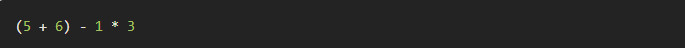

可以写成：

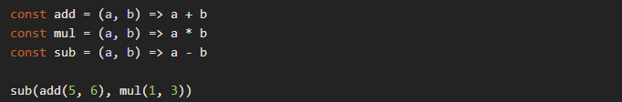

我们把每个运算包成一个个不同的function，并用这些function 组合出我们要的结果，这就是最简单的Functional Programming。

> <font color=red>RxJS 可以很好解决异步和事件组合的问题。</font>

<font face="黑体" size=3 color=blue>RxJS中解决异步事件管理的基本概念如下：</font>
- Observable可观察对象：表示一个可调用的未来值或者事件的集合。
- Observer观察者：一个回调函数集合,它知道怎样去监听被Observable发送的值
- Subscription订阅： 表示一个可观察对象的执行，主要用于取消执行。
- Operators操作符： 纯粹的函数，使得以函数编程的方式处理集合比如:`map,filter,contact,flatmap`。
- Subject(主题)：等同于一个事件驱动器，是将一个值或者事件广播到多个观察者的唯一途径。
- Schedulers(调度者)： 用来控制并发，当计算发生的时候允许我们协调，比如`setTimeout,requestAnimationFrame`。

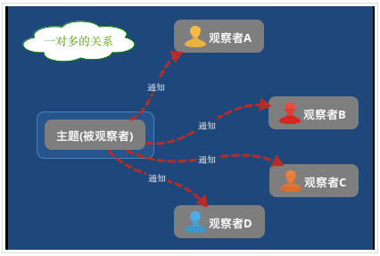

+ 事件流 

   理解Rx的关键是要把任何变化想象成事件流。

+ 常见创建类操作符
  + from： 可以把`数组`、`Promise`、以及`Interable`转化为 Observable
  + fromEvent:可以把事件转化为 Observable
  + of ：接收一系列的数据，并把它们 emit出去

+ 常见转换操作符
  + map
  + mapTo
  + pluck
 
**【总结】：**

  根据不同业务需求（即任何变化-->想象成任何时间维度的事件流），通过不同的运算符，把不同的事件流流合并、转换成相应的结果(最终的需求业务逻辑)。最重要的一点，他们是自动把数据推送给你，不像传统那样需要你去请求，拉取数据。

## 理解RxJS

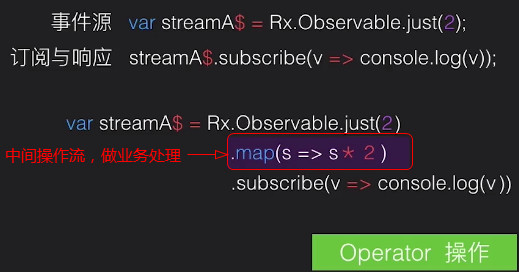

> 操作 `Rx`提供了许多接口

* 创建

  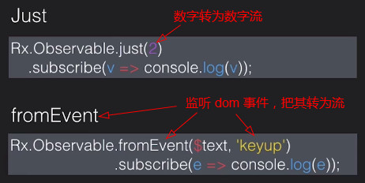

* 转变

  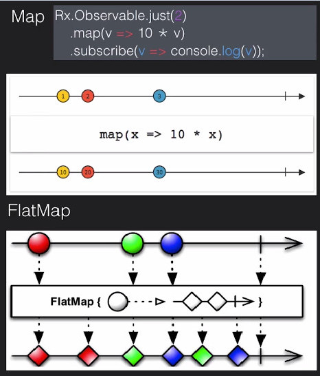
  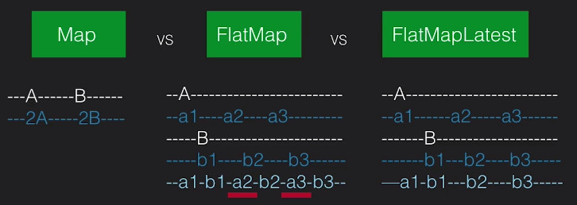

* 过滤

  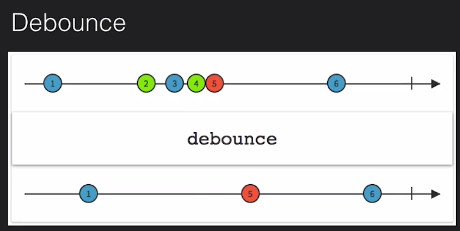

* 组合

  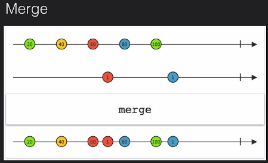

* 错误处理

  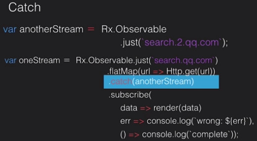

<font size=5 color=#449D44>小结：</font>

[各类宝珠图：http://rxmarbles.com/](http://rxmarbles.com/)

1)常见创建类操作符

**from：** 可以把数组、Promise、以及Interable转化为 Observable

**fromEvent:** 可以把事件转化为 Observable

**of ：** 接收一系列的数据，并把它们 emit出去

2)常见转换操作符: <font color=#449D44>map、mapTo、pluck</font>

map的宝珠图（map是核心主要）


mapTo:(map的延伸扩展)

pluck:(map的延伸扩展)


3)Observable 的性质

三种状态：next、error、complete

特殊的：永不结束，Never，Empty（结束但不发射），Throw

+ 常见工具类操作符：`do`


+ 常见变换类操作符：`scan` 和 常见数学类操作符：`reduce` （用的比较频繁）

 

+ 过滤类操作符：`filter`，`take`，`first/last`，`skip`... 


 


+ 两个常见的创建类操作符：`Interval`，`Timer`


4)过滤类操作符：Debounce,distinct,distinctUntilChanged


5)合并类操作符：merge、concat、startWith


6)合并类操作符：CombineLatest、withLatestFrom、zip

**区别：** zip有对齐的特性，withLatestFrom是以源事件流为基准


## 高阶操作符： '拍扁'的作用


## RxJS 可视化工具推荐

RxJS 是前端目前为止响应式编程的最佳实践。很不幸的是我们已经用传统方式开发很多年了，“evething is stream” 的思想对我们来说不再是顺其自然，甚至会有一点蹩脚，尤其是初入 RxJS 的坑。毕竟，有个伟人说过，‘工欲善其事必先利其器’，不是吗？因此，我们给大家推荐三款可视化的神器，帮助大家对 RxJS 进行感性地了解。

### RxViz

这款可视化工具是由 facebook 的 Misha Moroshko 开发。RxViz 可以简洁的可视化给定的 Observable. 你提供的 RxJS 代码会被执行，如果最后一个表达式是 Observable， 一个带着动画的可视化会出现在眼前。同时，你可以通过修改时间窗口来控制动画的速率，也可以将可视化 svg 复制下来用于你想用的地方，你同样可以将可视化分享给其他人。

[详见https://github.com/moroshko/rxviz](https://github.com/moroshko/rxviz)


### RxVision

推荐这款 RxVision 可视化的工具时，我的内心是纠结的。个人来讲，我非常喜欢它，但是，尴尬的是作者已经不维护了，擦。但是，它还有一个不得不推荐的理由。请容我慢慢道来。

相信[这篇文章](https://gist.github.com/staltz/868e7e9bc2a7b8c1f754)是所有前端响应式的殿堂级入门文章，中文也有人翻译再加工过。文章中的例子，也是经典，详细阐述了如何用“响应式”的思想构建业务逻辑.

[详见https://github.com/jaredly/rxvision](https://github.com/jaredly/rxvision)

## RxMarbles

这个库不得不推荐啊，这是响应式大神 staltz 的作品。和前面库最大的不同是, Observable 的每个 item 是可交互的，你可以拖拽，然后整个 Observable 都会做出相应的改变。

[详见https://github.com/staltz/rxmarbles](https://github.com/staltz/rxmarbles)


# ASCII字符来绘制图表：一切都是流


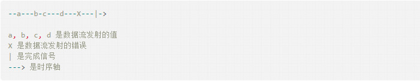

每一个流都拥有一系列方法，例如<font color=red>`map、filter、scan`</font>等
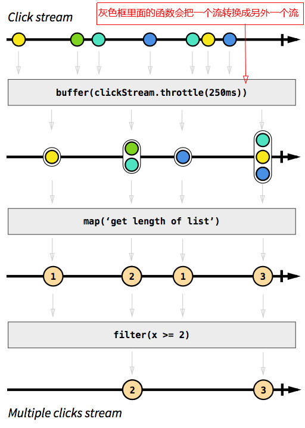

[中文教程：http://cn.rx.js.org/manual/tutorial.html](http://cn.rx.js.org/manual/tutorial.html)

# 使用 Ngrx

+ @ngrx/store

`npm install @ngrx/store --save` OR `yarn add @ngrx/store`

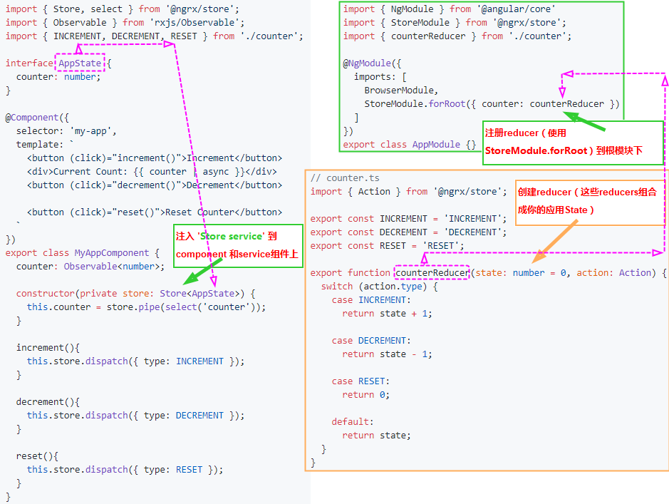

+ @ngrx/effects

`npm install @ngrx/effects --save` OR `yarn add @ngrx/effects`

监听`@ngrx/store`发送的动作(即：<font color=red size=3>actions dispatched</font>)

Effects 主要是一个注入服务的类(injectable service classes)

使用EffectsModule.forRoot
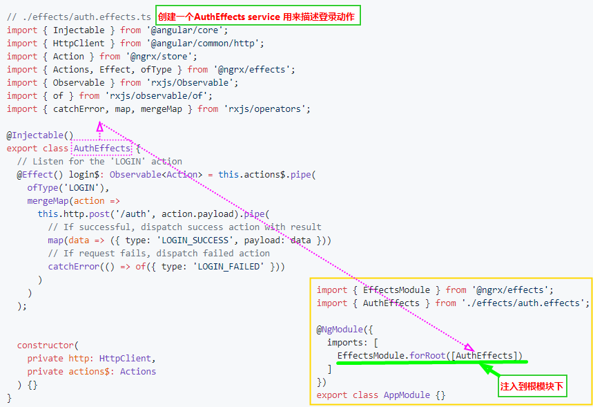

使用EffectsModule.forFeature
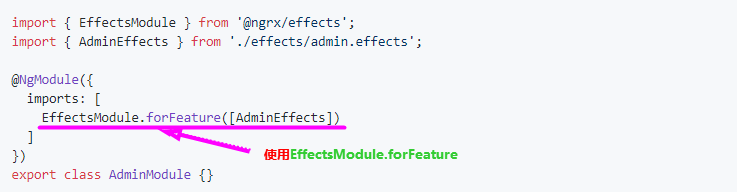


+ API 文档
  + EffectsModule.forRoots( )  注册到根模块下

    ```ts
      @NgModule({
        imports: [
          EffectsModule.forRoot([
            FirstEffectsClass,
            SecondEffectsClass,
          ])
        ]
      })
      export class AppModule { }
    ```

  + EffectsModule.forFeature( ) 注册到任意ng模块下
    
    ```ts
    @NgModule({
      imports: [
        EffectsModule.forFeature([
          SomeEffectsClass,
          AnotherEffectsClass,
        ])
      ]
    })
    export class FeatureModule { }
    ```
  + Actions
  ```ts
  import { Injectable } from '@angular/core';
  import { Actions } from '@ngrx/effects';

  @Injectable()
  export class SomeEffectsClass {
    constructor(private actions$: Actions) {}
  }
  ```
  + ofType 筛选动作流类型
    ```ts
    import { Injectable } from '@angular/core';
    import { Actions, Effect, ofType } from '@ngrx/effects';
    import { tap } from 'rxjs/operators';

    @Injectable()
    export class SomeEffectsClass {
      constructor(private actions$: Actions) {}

      @Effect() 
      authActions$ = this.action$.pipe(
        ofType<LoginAction | LogoutAction>('LOGIN', 'LOGOUT'),
        tap(action => console.log(action))
      );
    }
    ```
+ Non-dispatching Effects `{ dispatch: false }`
```ts
import { Injectable } from '@angular/core';
import { Actions, Effect, ofType } from '@ngrx/effects';
import { tap } from 'rxjs/operators';

@Injectable()
export class SomeEffectsClass {
  constructor(private actions$: Actions) { }

  @Effect({ dispatch: false }) 
  logActions$ = this.actions$.pipe(
    tap(action => console.log(action))
  );
}
```
+ Controlling Effects
  + OnRunEffects
```ts
import { Injectable } from '@angular/core';
import { Actions, Effect, OnRunEffects, EffectNotification, ofType } from '@ngrx/effects';
import { Action } from '@ngrx/store';
import { Observable } from 'rxjs/Observable';
import { exhaustMap, takeUntil, tap } from 'rxjs/operators';

@Injectable()
export class UserEffects implements OnRunEffects {
  constructor(private actions$: Actions) {}

  @Effect() updateUser$: Observable<Action> = this.actions$.pipe(
    ofType('UPDATE_USER'),
    tap(action => {
      console.log(action);
    })
  );

  ngrxOnRunEffects(resolvedEffects$: Observable<EffectNotification>) {
    return this.actions$.pipe(
      ofType('LOGGED_IN'),
      exhaustMap(() => resolvedEffects$.pipe(
        takeUntil(this.actions$.pipe(ofType('LOGGED_OUT')))
      )
    );
  }
}
```
  + 工具
    + mergeEffects 合并所有的Effects
```ts
import { mergeEffects } from '@ngrx/effects';

export class MyService {
  constructor(effects: SomeEffectsClass) {
    mergeEffects(effects).subscribe(result => {
      console.log(result);
    });
  }
}
```

## rxjs5与rxjs6对比

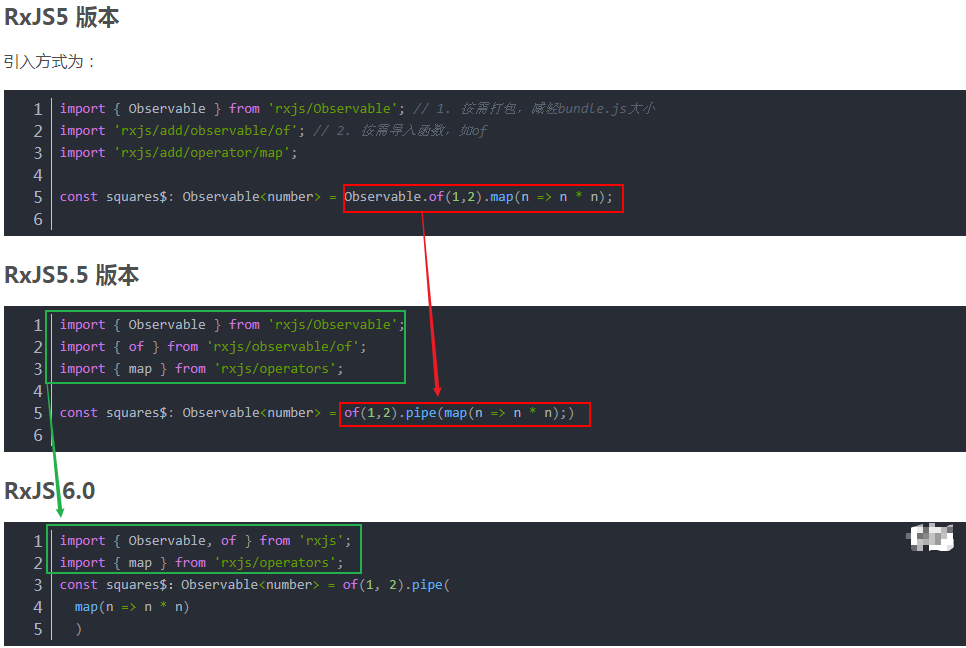

## RxJS 6.x 的两种编程思想

函数式编程对函数的使用有一些特殊要求：

+ 声明式（Declarative）
+ 纯函数（Pure Function）
+ 数据不可变性（Immutability）

```javascript
RxJS 的 import 路径有以下 5 种：

1、创建 Observable 的方法、types、schedulers 和一些工具方法

import { Observable, Subject, asapScheduler, pipe, of, from, interval, merge, fromEvent, SubscriptionLike, PartialObserver } from 'rxjs';

2、操作符 operators

import { map, filter, scan } from 'rxjs/operators';

3、webSocket

import { webSocket } from 'rxjs/webSocket';

4、ajax

import { ajax } from 'rxjs/ajax';

5、测试

import { TestScheduler } from 'rxjs/testing';
```

**代表流的变量用 $ 符号结尾，是 RxJS 中的一种惯例。**

**不推荐使用 merge、concat、combineLatest、race、zip 这些操作符方法，而是推荐使用对应的静态方法。**