TypeScript 语法
===============

TypeScript将标记为`* .d.ts`的文件视为定义文件。 这些文件旨在使用TypeScript来描述由JavaScript库提供的接口。

> JavaScript的缺点：
> 
> * 弱类型，缺乏必要的类型检查
> * 编程不够语义化，代码可阅读性差
> * 代码不可分割，可维护性差
> * 开发工具不够智能

TypeScript 是一种由微软开发的自由和开源的编程语言。它是一种JavaScript的一个超集。而且本质上向这个语言添加了可选的静态类型和基于类的面向对象编程。

Link: (http：//www.typescriptlang/org)

解决的问题：

> 强类型
> 智能感知和重构
> 完全兼容Javascript
> 语义化编程和面向对象
> 集成简便

TypeScript未来的发展趋势：

> * 替代Javascript
> * 更多的IDE支持
> * 不断丰富的Javascript库支持

TypeScript面向对象

> 封装
> > * 使用class关键字来表明声明类
> > * 使用contructor关键字来声明构造函数
> > * 使用private关键字来声明私有成员
> > * 可以使用get/set来实现私有成员访问器
> > * 支持静态属性
> 
> 继承
> > * 使用extends关键字来完成继承
> > * 使用super关键字来访问父类
> 
> 模块
> > * 模块的概念等同于C#中的命名空间 (类似java中的package) 
> > * 使用module关键字来声明模块
> > * 在模块中默认成员都是私有的
> > * 在模块中使用export关键字声明公有资源
> > * 模块支持跨文件分隔
> > * 在Node.js/Require.js中使用require关键字导入模块
> > * 可以使用import关键字来声明模块的别名

> 方法
> > * 方法是Javascript中一个特殊的对象
> > * 方法分为命名方法和匿名方法
> > * 方法类型
> > * 方法推断类型
> > * 方法参数可以定义默认值
> > * 方法参数可以使用“...” 去定义可变参数组
> 
> 重载
> > * Javascript中本身是不支持重载的
> > * 在TypeScript中使用重载的方法：
> > 1、先声明出所有的方法重载的定义，不包含方法实现
> > 2、再声明出一个参数为Any类型的重载方法
> > 3、实现Any类型的方法，并通过参数类型不同来去实现重载
> 
> 接口
> > 在接口中可以包含属性、方法
> > 使用interface关键字定义接口
> > 属性可以使用 ？ 标识允许为空类型
> > TypeScript支持隐式接口
> > 接口可以标识为方法类型
> > 接口支持多继承
> > 可以使用<接口类型>{}来去隐式声明匿名对象实现接口
> >
> > 接口是一个抽象类型，它不像`类`一样包含任何代码。 它仅定义API的“签名”或形状。 在代码转换期间，`interface` 不会生成任何代码，它仅在开发期间被Typescript用于类型检查。

### 
箭头函数
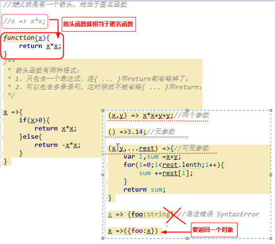
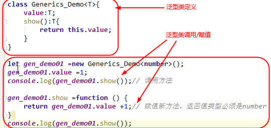
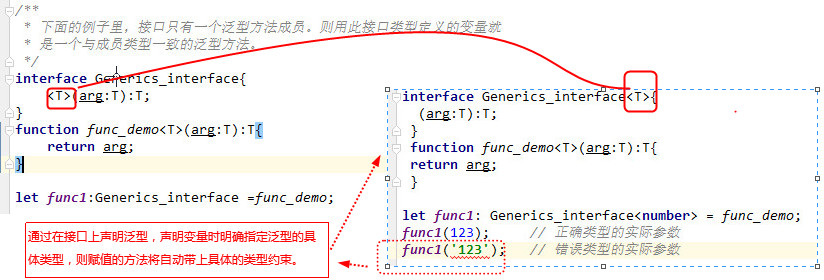

### 泛型
> 泛型方法
> > 

### 模块

> 模块的导入和导出
> > 模块在其自身的作用域里执行，而不是在全局作用域里；这意味着定义在一个模块里的变量，函数，类等等在模块外部是不
> >可见的，除非你明确地使用export之一导出它们。 相反，如果想使用其它模块导出的变量，函数，类，接口等的时候，你
> >必须要导入它们，可以使用import之一。
> > 模块是自声明的。在TypeScript里，两个模块之间的关系是通过在文件级别上使用import和export建立的。下面是一个基本例子：

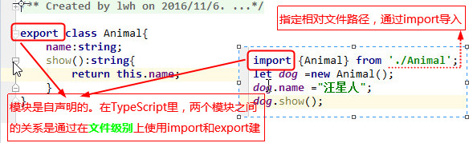

> >因为JavaScript存在两种不同的模块引用方式，在编译成JavaScript时，可以通过TypeScript配置文件tsconfig.json指
> >定编译之后的模块引用方式

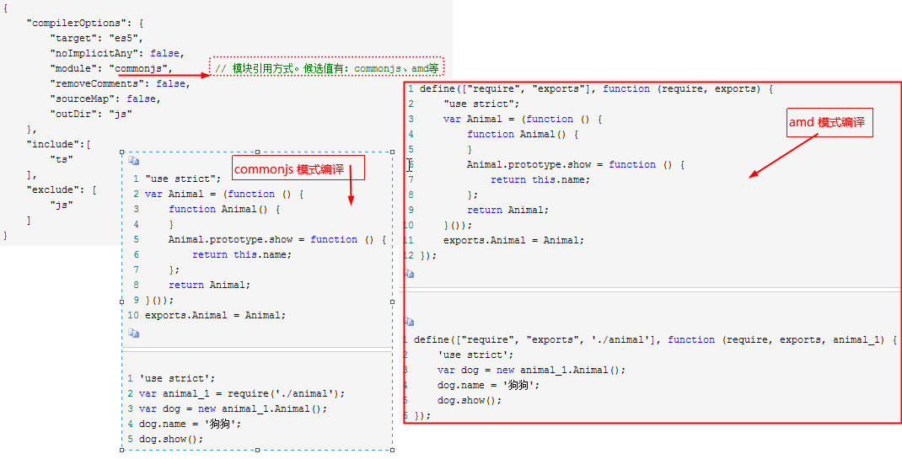

> 导入和导出的重命名
> > 模块导入和导出时默认使用的内部对象的名称。TypeScript也支持在导出前和导入后进行重命名。将上面的例子修改一下

> >** 或者，如果不知道导入模块的名称，则可以用*号代替**

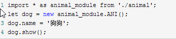

> >上面的例子里，对*号代替的所有模块进行重命名为animal_module，则通过animal_module对象可以访问到模块里导出的所有内容。

> 导出和导出多个对象

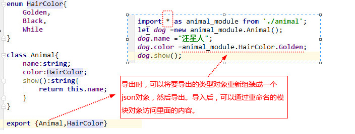

> 默认导出

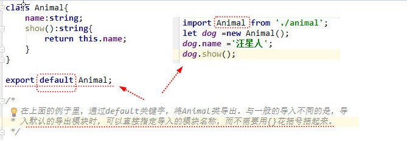

> 动态加载模块
> > 在JavaScript里，模块加载方式分别有两种：CommonJS和AMD。在用TypeScript时，要根据最终编译生成JavaScript的方式的配置内容不同，编写不同的代码。

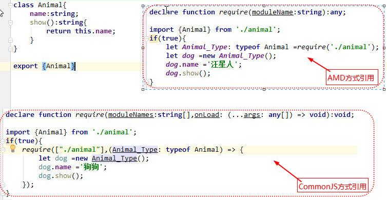

### 命名空间

> **命名空间与模块的区别:**
>> **命名空间：** 代码层面的归类和管理。将有相似功能的代码都归一到同一个空间下进行管理，方便其他代码引用。更多的是侧重代码的复用。

>> **模块：** 一个完整功能的封装，对外提供的是一个具有完整功能的功能包，需要显式引用。**一个模块里可能会有多个命名空间。**
 
1、命名空间的声明

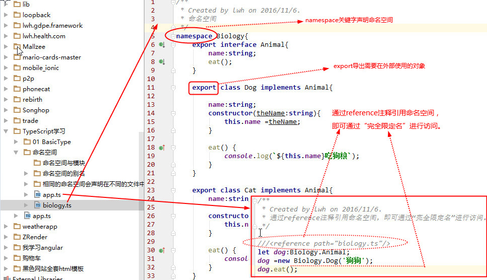

  同Java的包、.Net的命名空间一样，TypeScript的命名空间可以将代码包裹起来，只对外暴露需要在外
部访问的对象。**命名空间内的对象通过export关键字对外暴露**。

  通过**namespace**关键字声明命名空间，通过export导出需要在外部使用的对象。在命名空间外部需
要通过**“完全限定名”**访问这些对象。

2、命名空间的引用

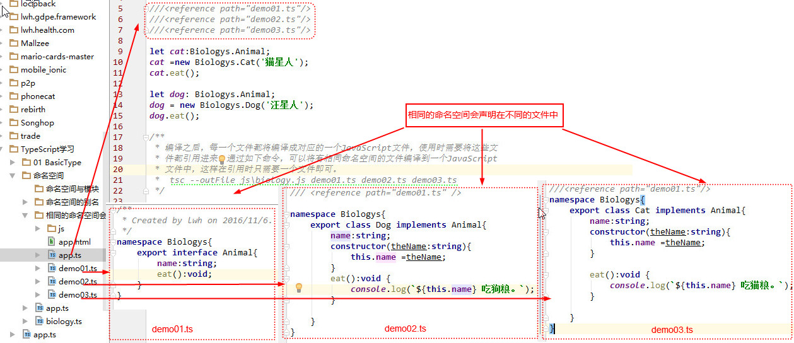

3、命名空间的别名

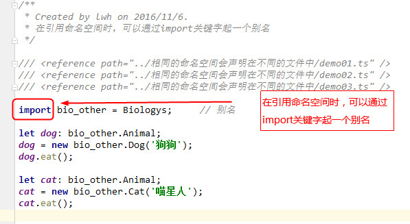

