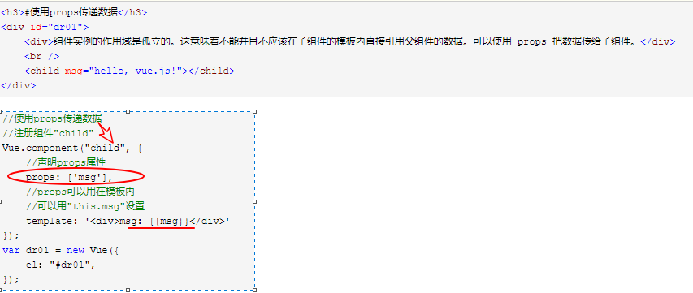
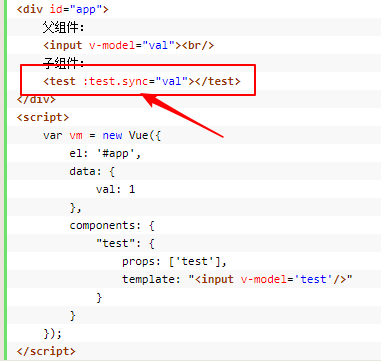
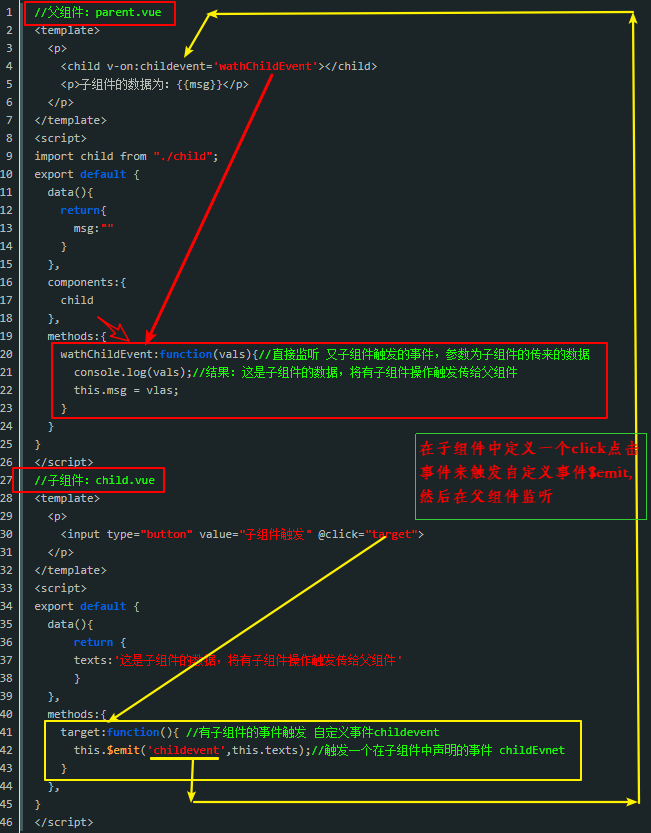
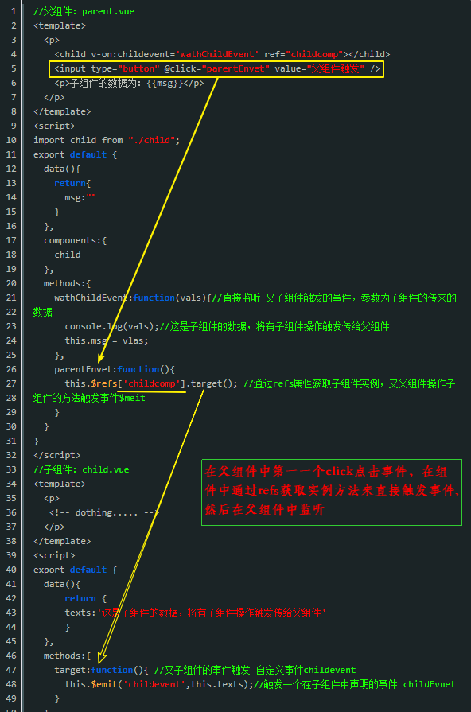
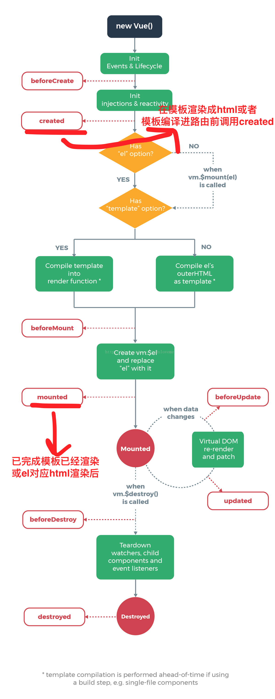

# Vue 

**常用插件** 

Element插件：   [http://element-cn.eleme.io](http://element-cn.eleme.io)

## 常用语法

1) v-model(绑定数据)

2) v-for（循环）

3) v-on（绑定事件）

4) data（数据）

5) methods（方法）

6) $index（索引）

7) data（绑定 DOM 文本到数据）

8) v-if（不满足条件的话则不会出现在dom中）

9) v-show（不满足条件，则样式会设置成隐藏 display:none;）

10) 组件
```js
<div id="app3">
    <app-nav></app-nav>                     <!--导航-->
    <app-view>
       <app-sidebar></app-sidebar>         <!--侧边栏-->
       <app-content></app-content>         <!--展示内容-->
    </app-view>
</div>
<script type="text/javascript">
 var vm2=new Vue({
    el:"#app2",
    data:data2
});
</script>
```

11) Vue实例

  11.1) 构造器：Vue.extend

  11.2) 数据属性：vm.a

  11.3) 实例属性和方法：

 + 1）vm.$el
 + 2）vm.$data
 + 3）vm.$watch
 + 4）实例生命周期

```js
var vm4 = new Vue({
        data: {
            a: 1
        },
        beforeCreate:function(){
            //创建前
        },
        created: function(){
            console.log('a is: ' + this.a);      // `this` 指向 vm 实例
        },
        beforeMount:function(){
            //加载前
        },
        mounted:function(){
            //加载后
        },
        beforeUpdate:function(){
            //更新前
        },
        updated:function(){
            //更新后
        },
        beforeDestroy:function(){
            //销毁前
        },
        destroyed:function() {
            //销毁后
        }
    });
```
  11.4) 构造器：
```js
var data = { a: 1 };
var vm6 = new Vue({                                 //每个 Vue.js 应用的起步都是通过构造函数 Vue 创建一个 Vue 的根实例
    el: '#example',
    data: data,

    beforeCreate:function(){},                      //创建前
    created: function(){                            //创建后
        console.log('a is: ' + this.a);             //`this` 指向 vm 实例
    },

    beforeMount:function(){},                       //加载前
    mounted:function(){},                           //加载后

    beforeUpdate:function(){},                      //更新前
    updated:function(){},                           //更新后

    beforeDestroy:function(){},                     //销毁前
    destroyed:function() {}                         //销毁后
});
```

  11.4) 扩展Vue构造器，从而用预定义选项创建可复用的组件构造器：
```js
var MyComponent = Vue.extend({
    //扩展选项
});
var myComponentInstance = new MyComponent();       //所有的 `MyComponent` 实例都将以预定义的扩展选项被创建
```
  11.5) 属性和方法
```js
console.log( vm6.a === data.a );                   //true
//设置属性也会影响到原始数据
vm6.a = 2;
console.log( data.a );                             //2
//反之亦然
data.a = 3;
console.log( vm6.a );                              //3
vm6.b=5;                                           //注意：只有这些被代理的属性是响应的。如果在实例创建之后添加新的属性到实例上，它不会触发视图更新
console.log(data.b);                               //undefined
```

  11.6) 实例属性与方法：这些属性与方法都有前缀$，以便与代理的数据属性区分
```js
vm6.$data === data                                  //true
vm6.$el === document.getElementById('example');     //true
vm6.$watch('a', function (newVal, oldVal) {});      //$watch 是一个实例方法，这个回调将在 `vm.a`  改变后调用
```

12) 数据绑定语法 

  12.1) 文本插值：`{{msg}}`
```js
    <span>Message:{{ msg }}</span>  //每当这个属性变化时它也会更新
    <span v-once>This will never change:{{ msg }}</span> //一次性绑定
```

  12.2) 单次绑定：`v-once {{msg}}`

  12.3) 纯HTML：`v-html`
```html
 <div v-html="rawHtml"></div>                         
 //大括号会将数据解释为纯文本，为了输出真正的 HTML ，需使用 v-html 指令，
 //你不能使用 v-html 来复合局部模板，组件更适合担任 UI 重用与复合的基本单元
```
  12.4) 属性    
```js
<div v-bind:id="dynamicId"></div>
```
  12.5) 绑定表达式：`{{number+1}}`
```js
{{ number + 1 }}
{{ ok ? 'YES' : 'NO' }}
{{ message.split('').reverse().join('') }}
一个限制是每个绑定只能包含单个表达式，因此下面的语句是无效的：
{{ var a = 1 }}            //这是一个语句，不是一个表达式
{{ if (ok) { return message } }}  //流程控制也不可以，可改用三元表达式
```

  12.6) 过滤器：`{{ message | filterA | filterB }}、{{ message | filterA 'arg1' arg2 }}`
```js
//这个过滤器其实只是一个 JavaScript 函数，返回大写化的值
{{ message | capitalize }}  

//过滤器可以串联
{{ message | filterA | filterB }}    

 /**
  * 过滤器也可以接受参数：第一个参数—为过滤器函数，带引号的参数—为字
  *符串，不带引号的参数—按表达式计算
  **/
{{ message | filterA 'arg1' arg2 }}                
````

  12.7) 指令：(<font color=red size=3>职责是—当其表达式的值改变时把某些特殊的行为应用到 DOM 上</font>)
```js
//v-if 指令将根据表达式 greeting 值的真假删除/插入 <p> 元素
<p v-if="greeting">Hello!</p> 

带参数的指令： 
//v-bind 指令，用于响应地更新 HTML 特性，用特性插值 href="{{url}}" 可获得同
//样的结果，但实际上它也是在内部特性插值，转为 v-bind 绑定
<a v-bind:href="url"></a> 

//v-on 指令，用于监听 DOM 事件，参数是被监听的事件的名字 
<a v-on:click="doSomething"></a> 

带修饰符的指令： (以半角句号 `.` 开始的特殊后缀，表示指令应当以特殊方式绑定)
    
    <a v-bind:href.literal="/a/b/c"></a>

指令缩写：

    <a v-bind:href="url"></a>      
--缩写->  <a :href="url"></a>

    <button v-bind:disabled="someDynamicCondition">Button</button>   
--缩写-> <button :disabled="someDynamicCondition">Button</button>

    <a v-on:click="doSomething"></a>
--缩写->  <a @click="doSomething"></a> 
```
  13)$set()  给data对象新增属性，并触发视图更新

值得注意的是，网上一些资料写的$set()用法存在一些问题?

**错误写法：this.$set(key,value)（ps: 可能是vue1.0的写法）**

```js
mounted () {
    this.$set(this.student.age, 24)
}
```

**正确写法：this.$set(this.data,”key”,value’)**

```js
mounted () {
    this.$set(this.student,"age", 24)
}
```
**vue中$emit与$on**
```js
  /**
   * 相当于又new了一个vue实例，Event中含有vue的全部方法；
   */
　var Event = new Vue();

/**
* 发送数据，第一个参数是发送数据的名称，接收时还用这个名字接收，
* 第二个参数是这个数据现* 在的位置；
**/
　Event.$emit('msg',this.msg); 
  /**
  * 接收数据，第一个参数是数据的名字，与发送时的名字对应，
  * 第二个参数是一个方法，要对数据的操作
  **/
　Event.$on('msg',function(msg){}) //这里是对数据的操作
```

14) $refs、$children 和 $parent

1）$refs

首先你的给子组件做标记。demo ：`<firstchild ref="one"></firstchild>`

然后在父组件中，通过`this.$refs.one`就可以访问了这个自组件了，包括访问自组件的data里面的数据，调用它的函数

2）$children

**总结一下：**

1）组件只能一个根节点

2）可以在自组件中使用`this.$parent`.属性值，或者函数

3）在父组件中可以使用`this.$refs.组件的标记`访问子组件，或者`this.$children[i].属性`，访问子组件的

 4）你需要注意this的指向

 15) 监听器watch

**首先确认 watch是一个对象，一定要当成对象来用。**（对象就有键，有值）

**键：** 就是你要监控的那个家伙，比如说$route，这个就是要监控路由的变化。或者是data中的某个变量。 
**值可以是函数：** 就是当你监控的家伙变化时，需要执行的函数，这个函数有两个形参，第一个是当前值，第二个是变化后的值。 
**值也可以是函数名：** 不过这个函数名要用单引号来包裹。 

<font color=red>值是包括选项的对象：选项包括有三个。</font>
- 第一个handler：其值是一个回调函数。即监听到变化时应该执行的函数。
- 第二个是deep：其值是true或false；确认是否深入监听。（一般监听时是不能监听到对象属性值的变化的，数组的值变化可以听到。）
- 第三个是immediate：其值是true或false；确认是否以当前的初始值执行handler的函数

```js
var vm = new Vue({
  data: {
    a: 1,
    b: 2
  },
  watch: {
    a: function (val, oldVal) { //普通的watch监听
      console.log('new: %s, old: %s', val, oldVal)
    },
    // 方法名
    b: 'someMethod',
    // 选项的对象
    c: { //深度监听，可监听到对象、数组的变化
      handler: function (val, oldVal) { /* ... */ },
      deep: true，
      immediate: true
    }
  }
})
```
```js
<div id="app">
    <input type="text" v-model:value="childrens.name" />
    <input type="text" v-model:value="lastName" />
</div>
 
<script type="text/javascript">	
    var vm = new Vue( {
        el: '#app',
        data: {
            childrens: {
                name: '小强',
                age: 20,
                sex: '男'
            },
            tdArray:["1","2"],
            lastName:"张三"
        },
        watch:{
            childrens:{
                handler:function(val,oldval){
                    console.log(val.name)
                },
                deep:true//对象内部的属性监听，也叫深度监听
            },
            'childrens.name':function(val,oldval){
                console.log(val+"aaa")
            },//键路径必须加上引号
            lastName:function(val,oldval){
                console.log(this.lastName)
            }
        },//以V-model绑定数据时使用的数据变化监测
    } );
    vm.$watch("lastName",function(val,oldval){
        console.log(val)
    })//主动调用$watch方法来进行数据监测
</script>
</body>

注意：数组的改变不需要使用深度watch。
```

**computed、methods、watch**


## var vm = new vue({}) 与 export default {} 有什么区别？如何理解？

如果使用 ` var vm = new vue({})` 进行实例化，在浏览器端console可以进行调试，直接打印vm；

`export default {} `是es6的module中的语法. `export default` 的用处,是用来导出的 ,就相当于暴露了一个接口给外界，让你其他文件可以通过 `import` 来引入使用的.

`export default` 我认为相当于使用Vue.component注册了一个全局组件或者是一个单纯的局部组件。

<font color=red size=4>另外，`export default`和`export`的区别是:前者只能导出一个 ，后者可以导出若干个.</font>

一般都是导出一个组件。然后去父组件中定义引入就能使用。`vm = new Vue({})` ->创建一个Vue的实例 就是相当于创建一个根组件

**如果是`export default {} ` 怎么进行调试？只能使用  `vue `的 浏览器插件吗？**

## 2 基础特性 ##

<font color=red size=4> `v-on` 指令来监听 `DOM` 事件</font>

<font color=red size=4>`v-model `只是语法糖而已,Vue 是单项数据流</font>

> v-model 用在 input 元素上时

```js
<input v-model="sth" />
<input v-bind:value="sth" v-on:input="sth = $event.target.value" />

//第一行的代码其实只是第二行的语法糖。然后第二行代码还能简写成这样：
<input :value="sth" @input="sth = $event.target.value" />
```
在给 `<input />` 元素添加 v-model 属性时，默认会把 value 作为元素的属性，然后把 'input' 事件作为实时传递 value 的触发事件

> v-model 用在组件上时

给组件添加 v-model 属性时，默认会把 value 作为组件的属性，然后把 'input' 值作为给组件绑定事件时的事件名

> v-model 的缺点和解决办法

在创建类似复选框或者单选框的常见组件时，v-model就不好用了。
```js
<input type="checkbox" v-model="sth" />

//v-model 给我们提供好了 value 属性和 oninput 事件，但是，我们需要的不是 value 属
//性，而是 checked 属性，并且当你点击这个单选框的时候不会触发 oninput 事件，它只会触
//发 onchange 事件。这就尴尬了😓
```
因为 v-model 只是用到了 input 元素上，所以这种情况好解决：
```js
<input type="checkbox" :checked="status" @change="status = $event.target.checked" />
```
当 v-model 用到组件上时
```js
<my-checkbox v-model="foo"></my-checkbox>

Vue.component('my-checkbox', {
  tempalte: `<input 
               type="checkbox"
               @change="$emit('input', $event.target.checked)"
               :checked="value"
             />`
  props: ['value'],
})
```
在 Vue 2.2 版本，你可以在定义组件时通过 model 选项的方式来定制 prop/event：
```js
<my-checkbox v-model="foo"></my-checkbox>

Vue.component('my-checkbox', {
  tempalte: `<input 
               type="checkbox"
               <!--这里就不用 input 了，而是 balabala-->
               @change="$emit('balabala', $event.target.checked)"
               :checked="checked"
             />`
  props: ['checked'], //这里就不用 value 了，而是 checked
  model: {
    prop: 'checked',
    event: 'balabala'
  },
})
```

### 2.1 数据绑定

+ 文本插值,使用的是双大括号标签 `{{ }}`，为“Mustache” 语法（源自前端模板引擎 Mustache.js）

```js
<span>Hello {{ name }}</span> // -> Hello Vue
```

+ HTML属性(Mustache 标签也同样适用于 HTML 属性中)

```js
<div id="id-{{id}}"></div> // <div id="id-1"></div> 

/**Vue.js 2.0 中废弃了这种写法，用 v-bind 指令代替**/
<div v-bind:id="'id-' + id"/></div> 
//代替，或简写为 
<div :id="'id-' + id"></div>
```

+ 绑定表达式 (放在 Mustache 标签内的文本内容称为绑定表达式。)

除了直接输出属性值之外，一段绑定表达式可以由一个简单的 JavaScript 表达式和可选的一个或多个过滤器构成。例如：

```js
{{ index + 1 }} // 1
{{ index == 0 ? 'a' : 'b'}} // a
{{ name.split('').join('|') }} // V|u|e
```

+ 过滤器 (Vue.js 允许在表达式后添加可选的过滤器，以管道符“|” 指示)
```js
{{ name | uppercase }} // VUE

/**
*  Vue.js 将 name 的值传入给 uppercase 这个内置的过滤器中（本质是一个函数），
* 返回字符串的大写值。同时也允许多个过滤器链式使用，例如：
**/
{{ name | filterA | filterB }}

/**也允许传入多个参数**/
{{ name | filterA arg1 arg2}}

```

**Vue.js 内置了 10 个过滤器，下面简单介绍它们的功能和用法。**

① capitalize ：字符串首字符转化成大写

② uppercase ：字符串转化成大写

③ lowercase ：字符串转化成小写

④ currency 参数为 {String}[ 货币符号 ] ,{Number} [ 小数位 ]，将数字转化成货币符号，
并且会自动添加数字分节号。例如：
```js
{{ amount | currency ' ￥' 2 }} // -> 若 amount 值为 10000，则输出￥10,000.00
```
⑤ pluralize 参数为 {String} single, [double, triple]，字符串复数化。如果接收的是一
个参数，那复数形式就是在字符串末尾直接加一个“s”。如果接收多个参数，则会被当成数组
处理，字符串会添加对应数组下标的值。如果字符串的个数多于参数个数，多出部分会都添加
最后一个参数的值。例如：

```html
<p v-for="c in count">
  {{ c | pluralize 'item' }} {{ c | pluralize 'st' 'nd' 'rd' 'th' }}
</p>
```
⑥ json 参数为 {Number}[indent] 空格缩进数，与 JSON.stringify() 作用相同，将 json
对象数据输出成符合 json 格式的字符串。

⑦ debounce 传入值必须是函数，参数可选，为 {Number}[wait]，即延时时长。作用是
当调用函数 n 毫秒后，才会执行该动作，若在这 n 毫秒内又调用此动作则将重新计算执行时
间。例如：
```html
<input v-on:keyup ="onKeyup | debounce 500"> // input元素上监听了keyup事件，并且延迟 500ms 触发
```

⑧ limitBy 传入值必须是数组，参数为 {Number}limit， {Number}[offset], limit 为显
示个数， offset 为开始显示数组下标。例如：
```html
<div v-for="item in items | limitBy 10"></div> // items 为数组，且只显示数组中的前十个元素
```

⑨ filterBy 传入值必须是数组，参数为 {String | Function} targetStringOrFunction，
即需要匹配的字符串或函数（通过函数返回值为 true 或 false 来判断匹配结果）；“in”（可选
分隔符）； {String}[…searchKeys]，为检索的属性区域。
```js
<p v-for="name in names | filterBy '1.0'">{{name}}</p> // 检索 items 数组中值包含 1.0 的元素
<p v-for="item in items | filterBy '1.0' in 'name'">{{ item | json}}</p>
// 检索 items 数组中元素属性 name 值为 1.0 的元素输出。检索区域也可以为数组，即 in [name,version]，在多个属性中进行检索

<p v-for="item in items | filterBy customFilter">{{ item | json}}</p>
 //使用自定义的过滤函数，函数可以在选项 methods 中定义
methods : {
    customFilter : function(item) {
       if(item.name) return true // 检索所有元素中包含 name 属性的元素
    }
}
```

⑩orderBy 传入值必须是数组，参数为 {String|Array|Function}sortKeys，即指定排序
策略。这里可以使用单个键名，也可以传入包含多个排序键名的数组。也可以像 Array.Sort()
那样传入自己的排序策略函数。第二个参数为可选参数 {String}[order]，即选择升序或降序，
order>=0 为升序， order<0 为降序。
```js
//单个键名： 
<p v-for="item in items | orderBy 'name' -1">{{item.name}}</p>

//items 数组中以键名 name 进行降序排列多个键名： 
<p v-for="item in items | orderBy [name,version] ">{{item.name}}</p>

//使用 items 里的两个键名进行排序自定义排序函数 : 
<p v-for="item in items | orderBy customOrder">{{item.name}}</p>
methods: {
    customOrder: function (a, b) {
        // 对比 item 中version 的值的大小进行排序
       return parseFloat(a.version) > parseFloat(b.version) 
    }
}
```

+ 指令

<font color=red size=3>Vue.js 也提供指令（Directives）这一概念，可以理解为当表达式的值发生改变时，会有些特殊行为作用到绑定的 DOM 上。</font>指令通常会直接书写在模板的 HTML 元素中，
而为了有别于普通的属性， Vue.js 指令是带有前缀的 v- 的属性。

① 参数 
```js

```
<font color=d9534f size=4>指令 v-bind 可以在后面带一个参数，用冒号（:）隔开， src 即为参数。此时 img 标签中的 src 会与( vm )实例中的 avatar 绑定</font>，等同于 :
```js

```
② 修饰符
修饰符（Modifiers）是以半角句号` . `开始的特殊后缀，用于表示指令应该以特殊方式绑定。
```js
<button v-on:click.stop="doClick"></button>
```
`v-on` 的作用是在对应的 DOM 元素上绑定事件监听器， doClick 为函数名，而 stop 即为
修饰符，作用是停止冒泡，相当于调用了 e. stopPropagation()。

> 表单控件
<font color=red size=4 >Vue.js 中提供` v-model `的指令对表单元素进行双向数据绑定</font>

1) Text
```html
<input type="text" v-model="message" />
<span>Your input is : {{ message }}</span>
```
2) Radio (单选框)
```html
<label><input type="radio" value="male" v-model="gender "> 男 </lable>
<label><input type="radio" value="female" v-model="gender "> 女 </lable>
<p>{{ gender }}</p>
```
gender 值即为选中的 radio 元素的 value 值。

3) Checkbox

**Checkbox 分两种情况：单个勾选框和多个勾选框。**

单个勾选框， v-model 即为布尔值，此时 input 的 value 并不影响 v-model 的值。

```js
<input type="checkbox" v-model="checked" />
<span>checked : {{ checked }}</span>
```
多个勾选框， v-model 使用相同的属性名称，且属性为数组。
```js
<label><input type="checkbox" value="1" v-model=" multiChecked">1</lable>
<label><input type="checkbox" value="2" v-model=" multiChecked">2</lable>
<label><input type="checkbox" value="3" v-model=" multiChecked">3</lable>
<p>MultiChecked: {{ multiChecked.join('|') }}</p>
```

4) Select

同 Checkbox 元素一样， Select 也分单选和多选两种，多选的时候也需要绑定到一个数组。
```js
//单选
<select v-model="selected">
<option selected>A</option>
<option>B</option>
<option>C</option>
</select>
<span>Selected: {{ selected }}</span>
//多选
<select v-model="multiSelected" multiple>
<option selected>A</option>
<option>B</option>
<option>C</option>
</select>
<br>
<span>MultiSelected: {{ multiSelected.join('|') }}</span>
```

5) 绑定value

表单控件的值同样可以绑定在 Vue 实例的动态属性上，用 v-bind 实现。
```js
1． Checkbox
<input type="checkbox" v-model="checked" v-bind:true-value="a" v-bind:false-value="b">
选中： vm.checked == vm.a // -> true
未选中： vm.checked == vm.b // -> true
2． Radio
<input type="radio" v-model="checked", v-bind:value="a">
选中 : vm.checked == vm.a // -> true
3． Select Options
<select v-model="selected">
<!-- 对象字面量 -->
<option v-bind:value="{ number: 123 }">123</option>
</select>
```

> Class与Style绑定

**class与style绑定（数据绑定在data上）**

1、绑定class

    1）对象语法
    <div id="box" v-bind:class="{ 'class-a': isA, 'class-b': isB }"></div>
    <div id="box2" v-bind:class="classObject"></div>

    2）数组语法
    <div id="box3" v-bind:class="[classA,classB]"></div>
    <div id="box4" v-bind:class="[classA,isB?classB:'']"></div>
    <div id="box5" v-bind:class="[classA,{classB:isB,classC:isC}]"></div>  <!--当有多个条件 class 时，在 1.0.19+ 中，可以在数组语法中使用对象语法-->

2、 绑定内联样式style

    1）对象语法
    <div id="box6" v-bind:style="{color:activeColor,fontSize:fontSize+'px'}"></div>
    <div id="box7" v-bind:style="styleObject"></div>

    2）数组语法
    <div id="box8" v-bind:style="[styleObjectA,styleObjectB]">text</div>        <!-- v-bind:style 的数组语法可以将多个样式对象应用到一个元素上-->

1) Class绑定

① 对象语法： v-bind:class 接受参数是一个对象，而且可以与普通的 class 属性共存
```js
<div class="tab" v-bind:calss="{'active' : active , 'unactive' : !active}">
</div>

//vm 实例中需要包含
data : {
 active : true
}
```

② 数组语法： v-bind:class 也接受数组作为参数。
```js
<div v-bind:class="[classA, classB]"></div>
//vm 实例中需要包含
data : {
classA : 'class-a',
classB : 'class-b'
}
```

2) 内联样式绑定

style 属性绑定的数据即为内联样式，同样具有对象和数组两种形式：

① 对象语法：直接绑定符合样式格式的对象。
```html
<div v-bind:style="alertStyle"></div>
data : {
alertStyle : {
color : 'red',
fontSize : '20px'
}
}
//除了直接绑定对象外，也可以绑定单个属性或直接使用字符串。
<div v-bind:style="{ fontSize : alertStyle.fontSize, color : 'red'}"></div>
```
② 数组语法： v-bind:style 允许将多个样式对象绑定到统一元素上。
```js
<div v-bind:style="[ styleObjectA, styleObjectB]" .></div>
```

+ 条件渲染

1) v-if/v-else

2) v-show

3) v-if vs v-show

+ template标签用法

Vue.js 提供了 template 标签，我们可以将指令作用到这个标
签上，但最后的渲染结果里不会有它。
```js
<template v-if="yes">
    <p>There is first dom</p>
    <p>There is second dom</p>
    <p>There is third dom</p>
</template>
//同样， template 标签也支持使用 v-for 指令，用来渲染同级的多个兄弟元素。例如：
<template v-for="item in items">
    <p>{{item.name}}</p>
    <p>{{item.desc}}<p>
</template>
```

## 事件绑定与监听 ##
当模板渲染完成之后，就可以进行事件的绑定与监听了。 Vue.js 提供了 `v-on` 指令用来监听 DOM 事件，通常在模板内直接使用，而不像传统方式在 js 中获取 DOM 元素，然后绑定
事件。例如：
```js
//通过 v-on 可以绑定实例选项属性 methods 中的方法作为事件的处理器， v-on: 后参数接受所有的原生事件名称。
<button v-on:click="say">Say</button>
```
Vue.js 为指令 v-on 提供了多个修饰符，方便我们处理一些 DOM 事件的细节，并且修饰符可以串联使用。主要的修饰符如下。

**.stop:** 等同于调用 event. stopPropagation()。

**.prevent:** 等同于调用 event.preventDefault()。

**.capture:** 使用 capture 模式添加事件监听器。

**.self:** 只当事件是从监听元素本身触发时才触发回调。

使用方式如下：
```js
<a v-on:click.stop='doThis'></a>
<form v-on:submit.prevent="onSubmit"></form> // 阻止表单默认提交事件
<form v-on:submit.stop.prevent="onSubmit"></form> // 阻止默认提交事件且阻止冒泡
<form v-on:submit.stop.prevent></form> // 也可以只有修饰符，并不绑定事件
```

除了事件修饰符之外， v-on 还提供了按键修饰符，方便我们监听键盘事件中的按键。例如
```js
/**
*监听 input 的输入，当输入回车时触发 Submit 函数（回车的 keycode 值为 13），
* 用于处理常见的用户输入完直接按回车键提交）
*/
<input v-on:keyup.13="submit"/> 
```
Vue.js 给一些常用的按键名提供了别称，这样就省去了一些记 keyCode 的事件。全部按
键别名为：` enter、 tab、 delete、 esc、 space、 up、 down、 left、 right`。
```js
<input v-on:keyup.enter="submit" />
```
Vue.js 也允许我们自己定义按键别名，例如
```js
// 即可以使用 <input v-on:keyup.f1="help" />
Vue.directive('on').keyCodes.f1 = 112; 
```

> 与传统事件绑定的区别


## 指令 ##

## 过滤器 ##

## 组件 ##

### 组件利用Props传递参数 ###

props的值是一个数组，代表的意思是获取和设置标签上的属性值

如果组件的标签属性是一个aaa-bbb的格式，那么在props里面加的时候就要注意了,一定得按照驼峰命名法来填,props:['aaaBbb']

 

### 将数据从父作用域传到子组件 ###
**props的绑定类型：** 分为两种类型，即单向绑定（父组件能影响子组件，但相反不行）和双向绑定（子组件也能影响父组件）

+ 单向绑定示例：（默认，或使用.once）

+ 双向绑定：(需要使用“.sync”作为修饰词)

 

 ### 子组件到父组件的通信 ###

 > 使用 `$emit(eventname,option)` 触发事件

 思考两个问题?

1、究竟是由子组件内部主动传数据给父组件，由父组件监听接收（由子组件中操作决定什么时候传值）


2、还是通过父组件决定子组件什么时候传值给父组件，然后再监听接收 （由父组件中操作决定什么时候传值）

**<font color=red>两种情况都有</font>**

+ $emit事件触发,通过子组件内部的事件触发自定义事件$emit

 

+ $emit事件触发， 可以通过父组件操作子组件 (ref)的事件来触发 自定义事件$emit

 

 ### 兄弟组件之间的通信 ###

（1）、兄弟之间传递数据通过事件

（2）、创建一个新Vue的实例，让各个兄弟共用同一个事件机制。（关键点）

（3）、传递数据方，通过事件触发$emit(方法名，传递的数据)。

（4）、接收数据方，在mounted()钩子函数(挂载实例)中 触发事件$on(方法名，callback(接收数据的数据))，此时callback函数中的this已经发生了改变，可以使用箭头函数。

```js
//建立一个空的Vue实例,将通信事件挂载在该实例上
//emptyVue.js
import Vue from 'vue'
export default new Vue()
//兄弟组件a:childa.vue
<template>
  <p>
    <span>A组件->{{msg}}</span>
    <input type="button" value="把a组件数据传给b" @click ="send">
  </p>
</template>
<script>
import vmson from "./emptyVue"
export default {
  data(){
    return {
      msg:"我是a组件的数据"
    }
  },
  methods:{
    send:function(){
      vmson.$emit("aevent",this.msg)
    }
  }
}
</script>
//兄弟组件b:childb.vue
<template>
   <p>
    <span>b组件,a传的的数据为->{{msg}}</span>
  </p>
</template>
<script>
import vmson from "./emptyVue"
export default {
 data(){
    return {
      msg:""
    }
  },
  mounted(){
    vmson.$on("aevent",(val)=>{//监听事件aevent，回调函数要使用箭头函数;
      console.log(val);//打印结果：我是a组件的数据
      this.msg = val;
    })
  }
}
</script>
//父组件：parent.vue
<template>
  <p>
    <childa><childa>
    <childb></childb>
  </p>
</template>
<script>
import childa from "./childa";
import childb from "./childb";
export default {
  data(){
    return{
      msg:""
    }
  },
  components:{
    childa,
    childb
  },
}
</script>
```


## 状态管理 ## 

## 生命周期 ## 
> 什么是生命周期？ 

用通俗的语言来说，<font color=red>就是Vue中实例或者组件从创建到消灭中间经过的一系列过程。</font>
 

### `created` 和 `mounted`区别？ ###

+ **created:** 在模板渲染成html前调用，即<font color=red>通常初始化某些属性值，然后再渲染成视图。</font>
+ **mounted:** 在模板渲染成html后调用，通常是初始化页面完成后，再对html的dom节点进行一些需要的操作。

通常`created`使用的次数多，而`mounted`通常是在一些插件的使用或者组件的使用中进行操作，比如插件chart.js的使用: `var ctx = document.getElementById(ID);`通常会有这一步，而如果你写入组件中，你会发现在created中无法对chart进行一些初始化配置，一定要等这个html渲染完后才可以进行，那么mounted就是不二之选。

## 处理跨域问题

**axios不支持跨域请求；如果你需要跨域请求不能设置jsonp，而是在配置里边设置 服务器代理，代理到本地**

```javascript
// 配置webpack将接口代理到本地 解决跨域问题
proxyTable: {
  '/api/v1/**': {
    target: 'https://cnodejs.org', // 你接口的域名
    secure: false,
    changeOrigin: false,
  }
},
```