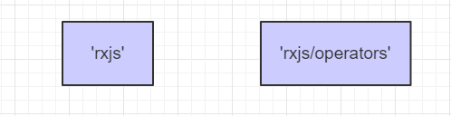

# 不同版本 Angular 迭代升级

## angular4.x 升级到 angular5.x

1、增加了`package-lock`文件

2、推荐使用

## angular5.x 升级到 angular6.x

### 1、兼容rxjs 5写法，需要添加 `rxjs-compat` 依赖
为了兼容 rxjs 5 的用法，必须引入 rxjs-compat。
```shell
//添加依赖
yarn add rxjs-compat
//然后在项目入口文件main.ts中引入它
import 'rxjs-compat';
```

### 2、rxjs6 的变化
1. import 方式改变
```javascript
import { Observable, Subject, asapScheduler, pipe, of, from, interval, merge, fromEvent } from 'rxjs';    // 创建方法，类型，调度程序和工具库
import { map, filter, scan } from 'rxjs/operators';  // 操作符
import { webSocket } from 'rxjs/webSocket';          // webSocket
import { ajax } from 'rxjs/ajax';                    // ajax
import { TestScheduler } from 'rxjs/testing';        // 测试工具
```

2. 链式操作变为管道操作
```javascript
source.pipe(
  map(x => x + x),
  mergeMap(n => of(n + 1, n + 2).pipe(
    filter(x => x % 1 == 0),
    scan((acc, x) => acc + x, 0),
  )),
  catchError(err => of('error found')),
).subscribe(printResult);
```

3. 使用函数而不是类
```javascript
fromEvent(window, 'resize').pipe(             // 不再使用 Observable.fromEvent
      debounceTime(100)
    ).subscribe(() => myChart.resize());
```

4. 某些方法名的变化
```javascript
如 do => tap, catch => catchError, switch => switchAll, finally => finalize, throw => throwError
```


**建议还是摈弃rxjs5的写法，采用rxjs6的写法去编码**

## angular6.x 升级到 angular7.x

### Angular6 以后 RXJS6的变化

RXJS6改变了包的结构，主要变化在 import方式和operator 上面以及使用pipe()

**Imports 方式改变**


从rxjs中类似像导入observable subject 等的不再进一步导入，而是止于rxjs, rxjs6在包的结构上进行了改变

**operator的改变**


总而言之： 类似于创建之类的用的API都是从rxjs引入的，类似于map 之类的操作都是从rxjs/operators引入的



**pipeable observable**


**被重新命名的API**


### Angular6.X 笔记

`npm install -g @angular/cli`

创建项目 `ng new projectName -sass|scss`

添加组件 `ng g c componentName`

添加服务 `ng g s serviceName`

添加路由 `ng generate module app-routing --flat --module=app`

```js
备注：

--flat 把这个文件放进了 src/app 中，而不是单独的目录中。
--module=app 告诉 CLI 把它注册到 AppModule 的 imports 数组中。

通常不会在路由模块中声明组件，所以可以删除 `@NgModule.declarations` 并删除对 `CommonModule` 的引用。
```

#### 项目打包

`ng build –prod –aot –build-optimizer –source-map=false`

为了启动方便，在`package.json`的`scripts`配置了`"start":"ng server --hmr -o  --proxy-config procy.config.json"`,可以看到这条命令分别配置了`--hmr(启动模块热更新)`、`-o(自动打开浏览器)`、`--proxy-config(代理配置)`

**优点**
- 1.预编译
- 2.代码压缩
- 3.去掉源程序映射，优化项目体积，打包后vender不到250kb,服务器启用gzip后，vender 大约85kb

#### 浏览器兼容处理

把polyfills中针对IE兼容依赖引入，例如：
```typescript
/** IE9, IE10 and IE11 requires all of the following polyfills. **/
import 'core-js/es6/symbol';
import 'core-js/es6/object';
import 'core-js/es6/function';
import 'core-js/es6/parse-int';
import 'core-js/es6/parse-float';
import 'core-js/es6/number';
import 'core-js/es6/math';
import 'core-js/es6/string';
import 'core-js/es6/date';
import 'core-js/es6/array';
import 'core-js/es6/regexp';
import 'core-js/es6/map';
import 'core-js/es6/weak-map';
import 'core-js/es6/set';
import 'core-js/es6/promise';

/** IE10 and IE11 requires the following for NgClass support on SVG elements */
// import 'classlist.js';  // Run `npm install --save classlist.js`.

/** IE10 and IE11 requires the following for the Reflect API. */
import 'core-js/es6/reflect';
```

**浏览器兼容**

目前，本编辑器对Chrome浏览器支持最为完整。建议大家使用较新版本的Chrome。IE9 以下不支持

#### 项目文件概览

##### src文件夹  

应用代码位于`src`文件夹中。所有的Angular组件、模板、样式、图片以及应用所需的任何东西都在这里。这个文件夹之外的文件都是为构建应用提供支持用的。

| 文件        | 用途         |
| ------------- |:-------------:|
|`app/app.component.{ts,html,css,spec.ts}` |	使用HTML模板、CSS样式和单元测试定义`AppComponent`组件。 它是根组件，随着应用的成长它会成为一棵组件树的根节点。|
|`app/app.module.ts` |	定义`AppModule`，这个根模块会告诉Angular如何组装该应用|
|`app/app.routes.ts` | 该模块配置了应用的根路由|
|`app/components/*` | 这个文件夹下放置应用级通用组件|
|`app/models/*` | 这个文件夹下放置应用级数据模型|
|`app/pages/*` | 这个文件夹下放置应用中的各个页面，这里面的目录结构和app/一致|
|`app/services/*`| 这个文件夹下放置应用级通用服务 |
|`assets/*`  |这个文件夹下你可以放字体、图片等任何静态文件，在构建应用时，它们全都会拷贝到发布包中|
|`environments/*`	| 这个文件夹中包括为各个目标环境准备的文件，它们导出了一些应用中要用到的配置变量。这些文件会在构建应用时被替换。比如你可能在开发环境、测试环境及生产环境中使用不同的后端API地址|
|`favicon.ico` |	显示在书签栏中的网站图标|
|`hmr.ts` |	HMR的启动器，将在main.ts中用来起动应用|
|`index.html`|网站的主页面。大多数情况下你都不用编辑它。在构建应用时，CLI会自动把所有js和css文件添加进去，所以你不必在这里手动添加任何`<script>`或`<link>`标签|
|`main.ts`|这是应用的主要入口点。使用JIT compiler或者AOT compiler编译器编译本应用，并启动应用的根模块AppModule（启用HMR时，将使用hmr.ts定义的启动器启动），使其运行在浏览器中|
|`polyfills.ts`|不同的浏览器对Web标准的支持程度也不同。填充库（polyfill）能帮我们把这些不同点进行标准化。 你只要使用core-js 和 zone.js通常就够了，不过你也可以查看浏览器支持指南以了解更多信息|
|`styles.scss`|这里是你的全局样式。大多数情况下，你会希望在组件中使用局部样式，以利于维护，不过那些会影响你整个应用的样式你还是需要集中存放在这里|
|`test.ts`|这是单元测试的主要入口点。它有一些你不熟悉的自定义配置，不过你并不需要编辑这里的任何东西|
|`tsconfig.{app|spec}.json`|	TypeScript编译器的配置文件。`tsconfig.app.json`是为Angular应用准备的，而`tsconfig.spec.json`是为单元测试准备的|
|`typings.d.ts`|引用的第三方插件TypeScript编译器可能不识别，需要通过下载@types/xxx获取该库的类型定义文件，如果@types没有那么就需要在该文件中定义，如declare var $: any;|

##### 根目录

src/文件夹是项目的根文件夹之一。其它文件是用来帮助我们构建、测试、维护、文档化和发布应用的。它们放在根目录下，和src/平级。

`src/`文件夹是项目的根文件夹之一。其它文件是用来帮助我们构建、测试、维护、文档化和发布应用的。它们放在根目录下，和src/平级。

| 文件        | 用途         |
| ------------- |:-------------:|
|`e2e/*`| 在e2e/下是端到端（end-to-end）测试。它们不在`src/`下，是因为端到端测试实际上和应用是相互独立的，它只适用于测试你的应用而已。这也就是为什么它会拥有自己的tsconfig.json|
|`node_modules/*`|Node.js创建了这个文件夹，并且把`package.json`中列举的所有第三方模块都放在其中|
|`.angular-cli.json` |	Angular CLI的配置文件。在这个文件中，我们可以设置一系列默认值，还可以配置项目编译时要包含的那些文件。要了解更多，请参阅它的官方文档|
|`.editorconfig`|用来确保参与你项目的每个人都具有基本的编辑器配置。大多数的编辑器都支持`.editorconfig`文件，详情参见 http://editorconfig.org|
|`..gitignore`|Git的配置文件，用来确保某些自动生成的文件不会被提交到源码控制系统中（GitHub）|
|`.stylelintrc.json`| css代码规范检测的配置文件|
|`CHANGELOG.md`	|项目的日志文件|
|`karma.conf.js`	|Karma的单元测试配置，当运行`ng test`时会用到它|
|`LICENSE` |	版权文件|
|`package.json`	| npm配置文件，其中列出了项目使用到的第三方依赖包。你还可以在这里添加自己的自定义脚本|
|`protractor.conf.js`	|Protractor的端到端测试配置文件，当运行`ng e2e`的时候会用到它|
|`proxy.config.json`|`ng serve`的代理配置文件，主要用在开发时前后端分离出现的跨域问题|
|`README.md`	|项目的基础说明文档，包括项目基本信息、如何启动、构建项目等等信息|
|`tsconfig.json`	|TypeScript编译器的配置，你的IDE会借助它来给你提供更好的帮助|
|`tslint.json`	|`TSLint`和`Codelyzer`的配置信息，当运行`ng lint`时会用到。Lint功能可以帮你保持代码风格的统一|


#### HRM运行机制

在项目中启用`模块热替换(HMR - Hot Module Replacement)`功能

`HMR`是webpack提供的一个功能，`angular-cli`使用了它，它会在应用程序运行过程中`替换、添加或删除`模块，而无需重新加载整个页面。主要是通过以下几种方式，来显著加快开发速度：

+ 保留在完全重新加载页面时丢失的应用程序状态
+ 只更新变更内容，以节省宝贵的开发时间
+ 调整样式更加快速 - 几乎相当于在浏览器调试器中更改样式

 
#### 路由

你通常不会在路由模块中声明组件，所以可以删除 `@NgModule.declarations` 并删除对 `CommonModule` 的引用。

你将会使用 `RouterModule` 中的 `Routes` 类来配置路由器，所以还要从 `@angular/router` 库中导入这两个符号。

添加一个 `@NgModule.exports` 数组，其中放上 `RouterModule` 。 导出 `RouterModule `让路由器的相关指令可以在 AppModule 中的组件中使用。


### 迁移更新到angular7.x
```shell
//首先需要单独升级rxjs
npm i -g rxjs-tslint
rxjs-5-to-6-migrate -p src/tsconfig.app.json
//删除\node_modules\tslint-language-service
ng update @angular/cli @angular/core 
npm audit fix
```

## angular7.x 升级到 angular8.x

### 1、使用动态导入的路由配置
```before
//以前看起来是这样的：
{path: '/admin', loadChildren: './admin/admin.module#AdminModule'}
```
```current
//现在，这样使用：
{
    path: `/admin`,
    loadChildren: () => import(`./admin/admin.module`)
                            .then(m => m.AdminModule)
}
```

## 各版本RxJS的整合升级

[详见](https://ngrx.io/guide/migration/v8)