# 温故知新 -- 重要Angular概念


**不能把Angular当作黑盒来使用,要充分了解它的内部结构。**

## 依赖注入

1、 什么是依赖注入？

2、依赖性注入框架

Angular


在angular中，我们只要记住依赖注入的三种角色：<font color=red size=4>使用者、服务(依赖对象)及注入器(Injector)</font>


- <font color=#449D44 size=4> @Injectable是@Component的子类</font>

- 每一个HTML标签上面都会有一个注射器实例

- 注射是通过constructor(构造器)进行的


**注入器(Injectable)和提供器(Provider)**


3、依赖性注入进阶

**什么时候使用装饰器：@Injectable( )**

<font color=red size=4>当创建服务（service）需要在构造函数中注入依赖对象，就需要使用 Injectable 装饰器。</font>

延伸1：@Injectable() 是必须的么？

如果所创建的服务不依赖于其他对象，是可以不用使用 `Injectable` 类装饰器。但当该服务需要在构造函数中注入依赖对象，就需要使用 Injectable 装饰器。不过<font color=#449D44 size=4>比较推荐的做法不管是否有依赖对象，在创建服务时都使用 `Injectable 类装饰器`。</font>

延伸2：注入器的层级关系( 服务之间如何之间注入 )

- 提供器可以声明在模块中，也可以声明在组件中。
- 在angular中只有一种注入，那就是构造器注入。如发现无参构造器，这就说明这个组件没有被注入任何东西。


## ChangeDeteccion

检测程序内部状态，然后反映到UI上

引起状态变化(异步)：

- Events
- XHR
- Times

## 指令

组件是一种特殊的指令（组件是一种带模板的指令）

- 结构型指令  --改变元素的布局
- 属性型指令  --改变外观和行为

> 属性型指令

Renderer 2 和 ElementRef

**Angular 不提倡直接操作DOM**

**对于DOM的操作应该通过Renderer 2来进行**

**ElementRef 可以理解成指向DOM元素的引用**

> 结构型指令     


>样式

**ngClass，ngStyle，[class.yourstyle]**

ngClass： 用于条件动态指定样式类，适合对样式做大量更改的情况

ngStyle： 用于条件动态指定样式，适合少量更改的情况

[class.yourcondition]="condition" : 直接对应一个条件

### 延伸1: <font color=red>`<ng-template>`</font>与<font color=red> `<ng-container>`</font> 有什么区别？

<font color=red>`<ng-template>`</font> 用于定义模板，使用<font color=red> `*`</font> 语法糖的结构指令，最终都会转换为 <font color=red>`<ng-template>`</font> 模板指令，模板内的内容如果不进行处理，是不会在页面中显示

<font color=red>`<ng-container>`</font> 是一个逻辑容器，可用于对节点进行分组，但不作为 DOM 树中的节点，它将被渲染为 HTML中的 `comment` 元素，它可用于避免添加额外的元素来使用结构指令。

**小贴士：**

<font color=blue>`ng-container`既不是一个Component，也不是一个Directive，只是单纯的一个特殊tag。 </font>

小贴士

```

这点类似于template，Angular复用了HTML5规范中template 的tag的语义，不过并没有真正利用其实
现，因此在审查元素中是永远也找不到一个template元素的。 

不过，由于ng-container并不是HTML5中的，为了保持区分度，采用了ng-作为前缀。所以现在我们可以
知道，ng-container是Angular所定义的一个特殊tag。

```
### 延伸2：不要混淆 `ng-container` 与 `ng-content`

<font color=red>`ng-content`</font> 是一个占位符，有些类似于`router-outlet`

**拓展1：**  那为什么要是使用`ng-content`？什么场景使用呢？

答：&nbsp;&nbsp; 父组件包含子组件都是直接指明子组件的`selector`，比如子组件的`selector`叫`app-child`，那么嵌入父组件时直接指明即可:<font color=blue>`<app-child></app-child>`</font>

&nbsp;&nbsp; 这是很硬性的编码，而<font color=red>`ng-content`</font>就是用来替代这种硬性编码的。
 
### 延伸3： <font color=red>TemplateRef</font> 与 <font color=red> ViewContainerRef </font> 有什么作用？

### 延伸4： ViewChild和ViewChildren

<font color=#87A44D>ViewChild</font> 该装饰器用于获取模板视图中的元素或直接调用其组件中的方法。它支持 Type 类型或 string 类型的选择器，同时支持设置 read 查询条件，以获取不同类型的实例。比如`ElementRef`和`ViewContainerRef`.

<font color=#87A44D>ViewChildren</font> 该装饰器是用来从模板视图中获取匹配的多个元素，返回的结果是一个 QueryList 集合。


### 通信

+ 父子组件通信
  + 父子组件通信一般使用@Input和@Output即可实现，参考Angular4学习笔记（六）- Input和Output
  + 通过Subject

+ 非父子组件通信
  + 非父子组件见通信可以通过同一个service来实现。需要注意的是一定要在service中<font color=blue>定义一个临时变量来供传递</font>

**angular组件通信是很长常见的功能，现在总结，常见主要用填以下三种**

+ 父组件 --> 子组件

+ 子组件 --> 父组件

+ 组件A --> 组件B (平级)

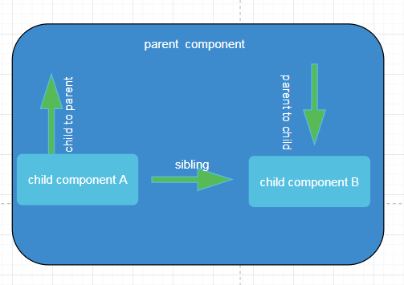


| 父组件 => 子组件 |	子组件 => 父组件 |	sibling => sibling |
|:---------------|:------------------|:---------------------|
| @input         |	@output          |                      |	
| setters (本质上还是@input)	| 注入父组件	|          |        |
| ngOnChanges() (不推荐使用)| |          | |
| 局部变量 | | |
| @ViewChild()| | |		
| service	| service	| service |
| Rxjs的Observalbe |	Rxjs的Observalbe	| Rxjs的Observalbe | 
|localStorage,sessionStorage |	localStorage,sessionStorage|	localStorage,sessionStorage|


上面图表总结了能用到通信方案,期中最后3种,是通用的,angular的组件之间都可以使用这3种,其中<font size=4 color=red>Rxjs是最最牛逼的用法,甩redux,promise,这些同样基于函数式的状态管理几条街</font>

**1) 父组件 => 子组件**

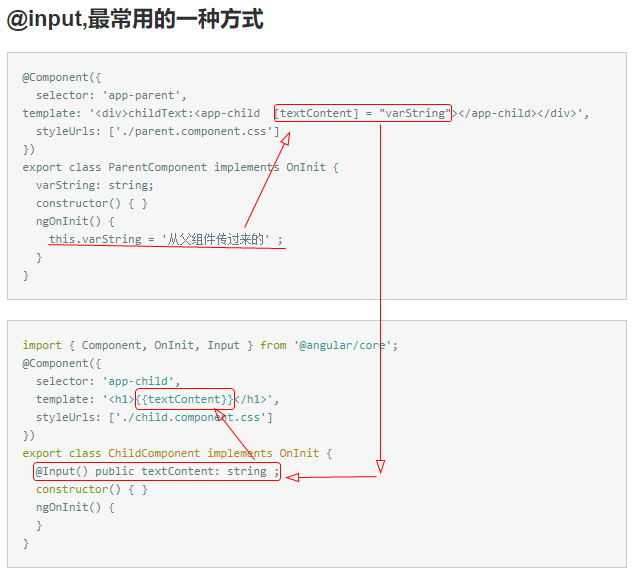
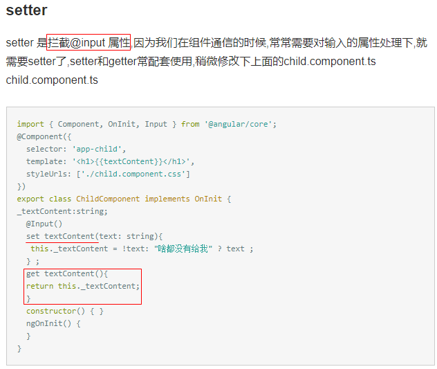

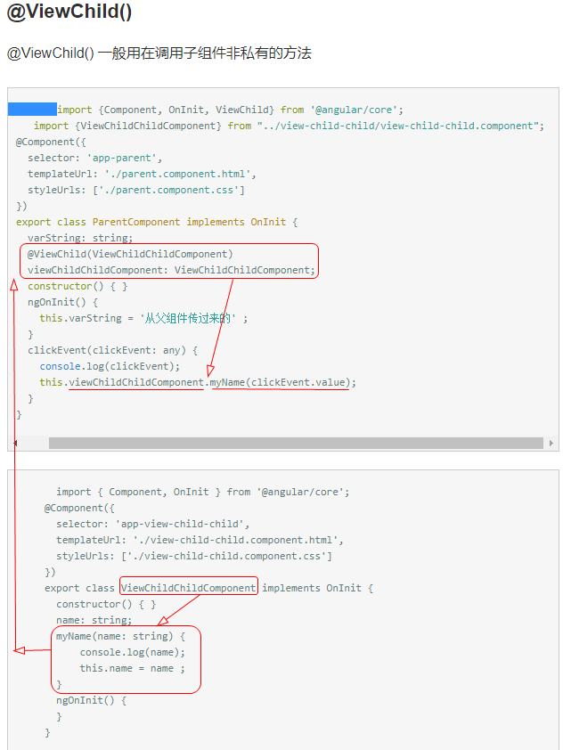
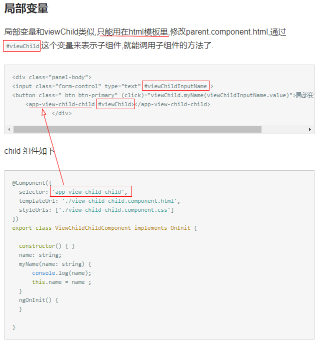

**2)子组件 => 父组件**

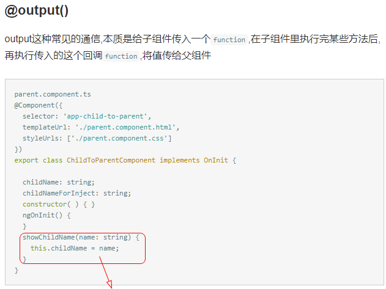
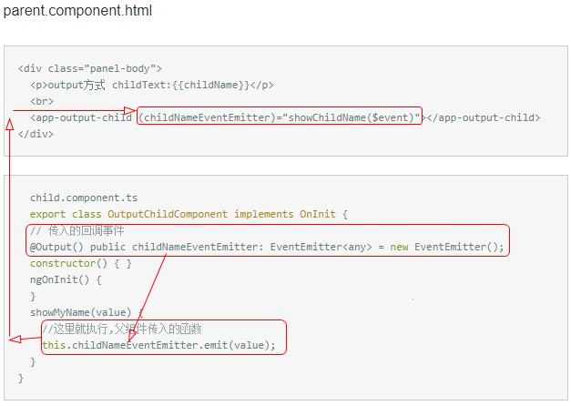
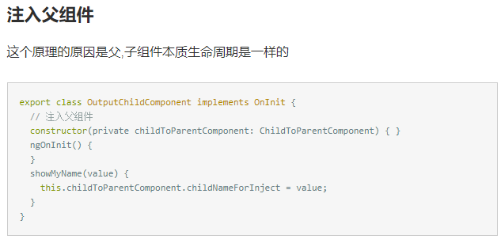

**3)sibling组件 => sibling组件**
   
**3.1) 通过service通信** 

angular中service是单例的,所以三种通信类型都可以通过service,很多前端对单例理解的不是很清楚,本质就是,你在某个module中注入service,所有这个modul的component都可以拿到这个service的属性,方法,是共享的,所以常在app.moudule.ts注入日志service,http拦截service,在子module注入的service,只能这个子module能共享,在component注入的service,就只能子的component的能拿到service,下面以注入到app.module.ts,的service来演示


**3.2) 通过Rx.js通信**

这个是最牛逼的,基于订阅发布的这种流文件处理,一旦订阅,发布的源头发生改变,订阅者就能拿到这个变化;这样说不是很好理解,简单解释就是,b.js,c.js,d.js订阅了a.js里某个值变化,b.js,c.js,d.js立马获取到这个变化的,但是a.js并没有主动调用b.js,c.js,d.js这些里面的方法,举个简单的例子,每个页面在处理ajax请求的时候,都有一弹出的提示信息,一般我会在
组件的template中中放一个提示框的组件,这样很繁琐每个组件都要来一次,如果基于Rx.js,就可以在app.component.ts中放这个提示组件,然后app.component.ts订阅公共的service,就比较省事了,代码如下

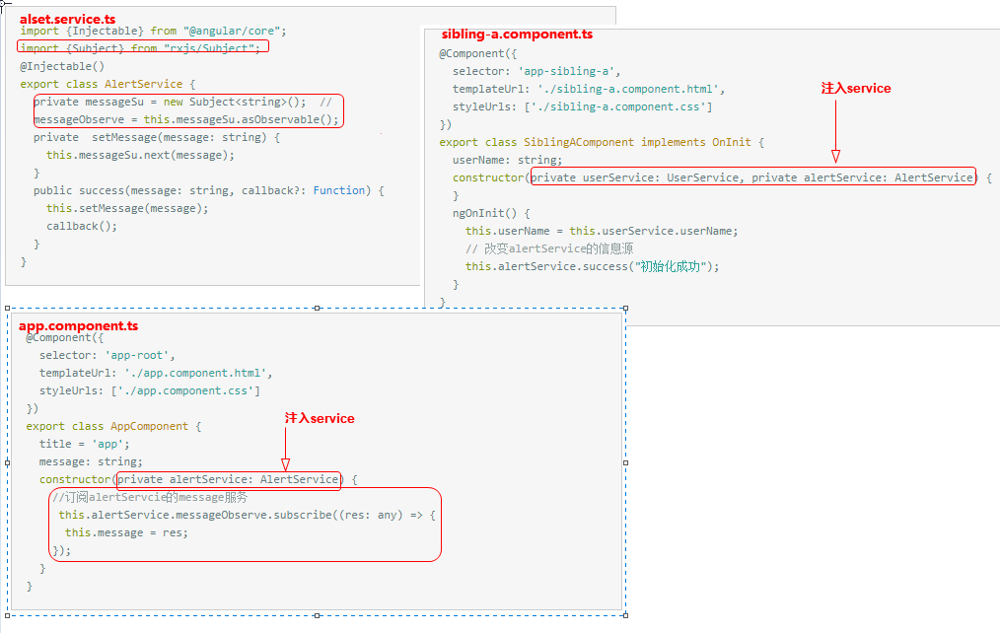


[总结：]

1、组件的输入输出属性

2、使用中间人模式传递数据

3、组件生命周期以及angular的变化发现机制

## 模块

什么是模块？

**declarations:** 模块内部`Components/Directives/Pipes`的列表，声明一下这个模块内部成员(<font color=#69B6E4 size=4>本模块创建的组件，加入到这个元数据中的组件才会被编译</font>)

**imports：** 导入<font color=red>其他module</font>，其它module暴露的出的Components、Directives、Pipes等可以在本module的组件中被使用。比如导入CommonModule后就可以使用NgIf、NgFor等指令。(<font color=#69B6E4 size=4>引入的外部NG模块</font>)

**exports：** 用来控制将哪些内部成员暴露给外部使用。导入一个module并不意味着会自动导入这个module内部导入的module所暴露出的公共成员。除非导入的这个module把它内部导入的module写到exports中。


**providers：** 指定应用程序的根级别需要使用的service。（Angular2中没有模块级别的service，所有在NgModule中声明的Provider都是注册在根级别的Dependency Injector中）

**bootstrap：** 通常是app启动的根组件，一般只有一个component。bootstrap中的组件会自动被放入到entryComponents中。(<font color=#69B6E4 size=4>声明启动引导哪个组件，必须是编译过的组件</font>)

&nbsp;&nbsp;&nbsp;&nbsp;需要强调的是，`bootstrap`元数据声明的组件必须是编译过的组件：它要么属于 使用`imports`元数据引入的外部NG模块，要么是已经在`declarations`元数据 中声明的本地组件。

**entryCompoenents:** 不会再模板中被引用到的组件。这个属性一般情况下只有ng自己使用，一般是bootstrap组件或者路由组件，ng会自动把bootstrap、路由组件放入其中。 除非不通过路由动态将component加入到dom中，否则不会用到这个属性。

模块的元数据？

经常看到的`forRoot( )`是什么鬼？

## 模板

- **简单模板**

   

- **{ } 渲染**

   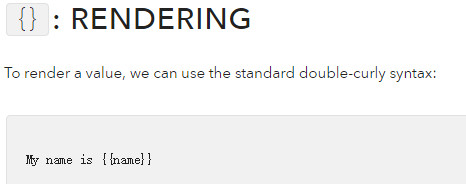

- **[] 绑定属性 **

  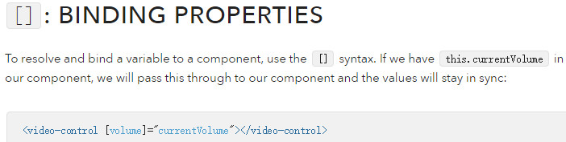

- **( ) 处理事件 **

  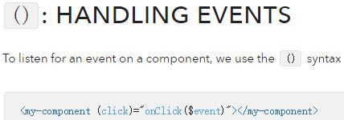

- **[()] 双向绑定**

  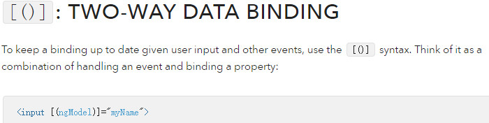

- **\* 星号**

  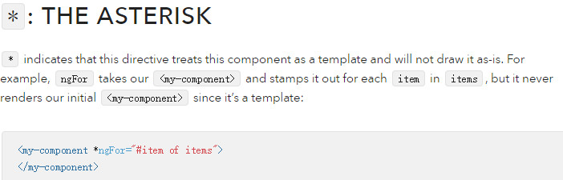

### 延伸1：数据绑定


`<h1>{{productTitle}}!</h1>`

使用插值表达式将一个表达式的值显示在模板上

``

使用方括号将HTML标签的一个属性绑定到一个表达式上

`<button (click)="toProductDetail()"> 商品详情 </button>`

使用小括号将组件控制器的一个方法绑定为模板上一个事件的处理器。

### 延伸2：事件绑定

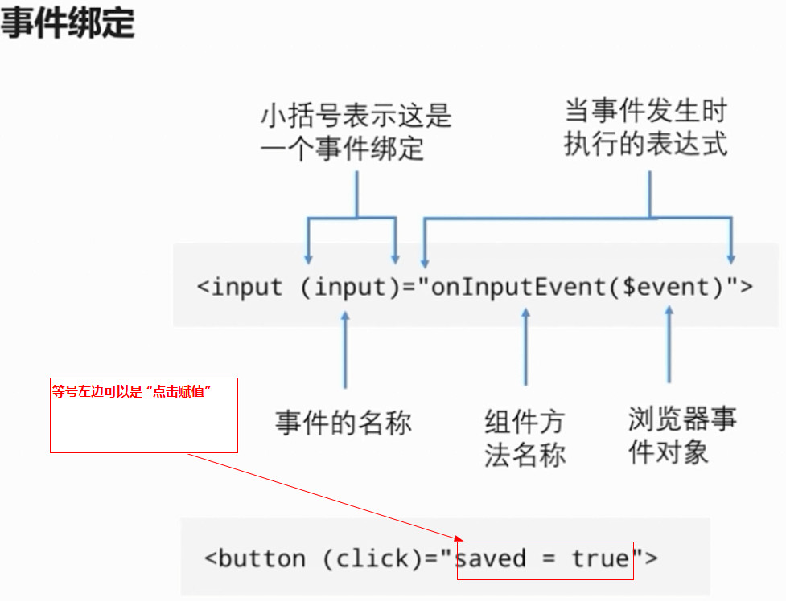


### 延伸3：属性绑定

HTML属性和DOM属性的关系

```
	1、少量HTML属性和DOM熟悉之间有着1：1的映射，如id。
	2、有些HTML属性没有对应的DOM属性，如colspan。
	3、有些dom属性没有对应的HTML属性，如textContent
	4、就算名字相同，HTML属性和DOM属性 也不是同一样东西。
	5、HTML属性的值指定了初始值；DOM 属性的值表示当前值。DOM属性的值可以改变；HTML属性的值不能改变。
	6、模板绑定是通过DOM 属性和事件来工作的，而不是HTML属性。
```

**DOM属性绑定**

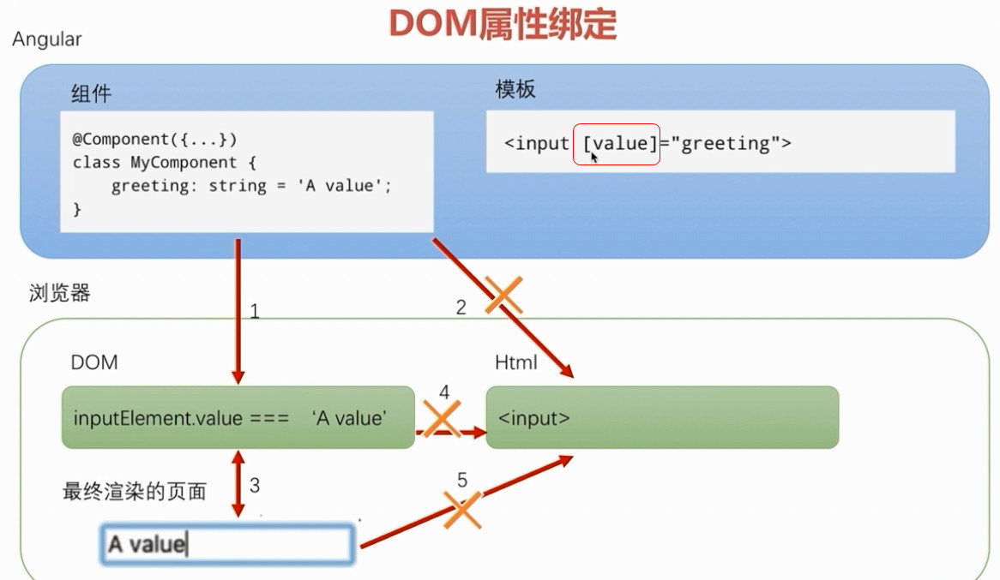

**属性绑定**

基本Html属性绑定 

	`<td [attr.colspan]="tableColspan">Something</td>`

CSS类绑定

	`<div class="aaa bbb" [class]="someExpression">something</div>`
	`<div [class.special]="isSpecial">something</div>`
	`<div [ngClass]="{aaa:isA,bbb:isB}"></div>`

样式绑定

	`<button [style.color]="isSpecial?'red':'green'">Red</button>`
	`<button [ngStyle]="{'font-style':this.canSave?'italic':'normal'}"></button>`

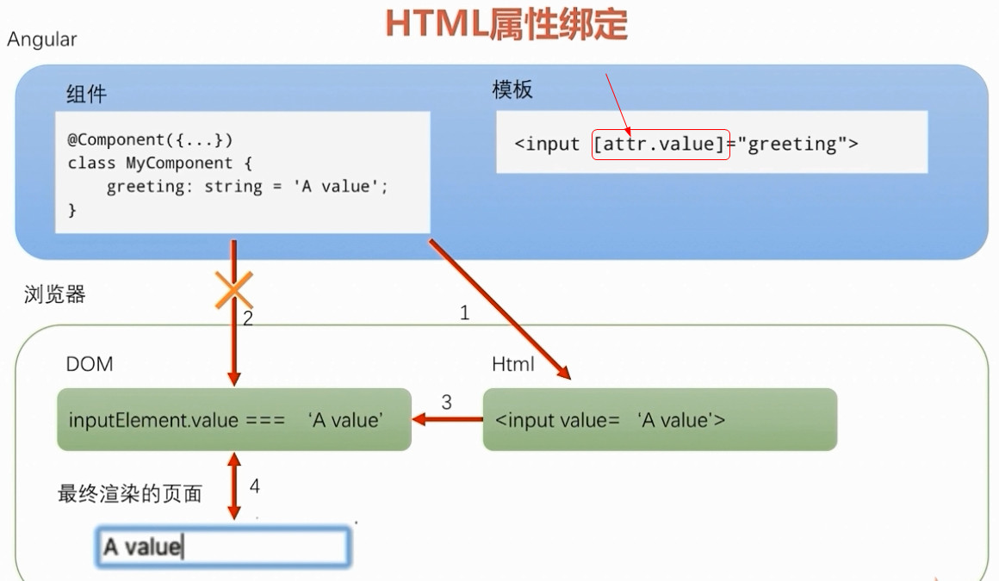


## 模板型驱动表单 和 响应式表单

- 模板型驱动表单 

**特点** 

1、表单的数据绑定(例如ngModel的双向绑定)
2、ngModel的困惑

- 响应式表单

**三个重要元素：**

- FormControl
- FormGroup
- FormBuilder

### 延伸1： Event 事件


- 在模板和组件类中触发

  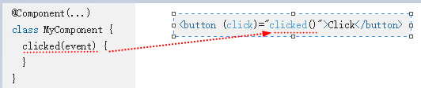

- 委托 delegation

### 延伸2： Form 表单

- 简单表单

   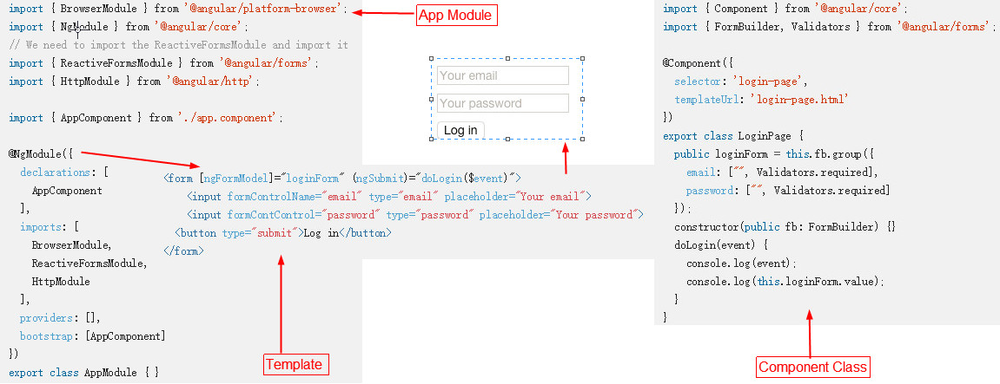


### 延伸3：@ViewChild

  子组件可以访问父组件
    
  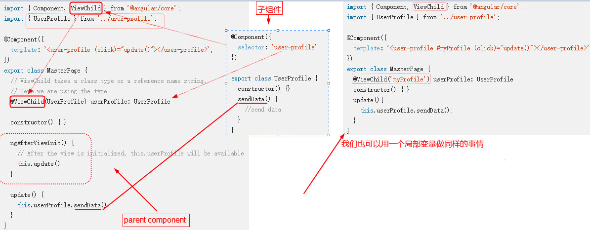

## 路由

| 名称       | 简介        |
|:------------- |-------------:|
| Routes      | 路由配置，保存着那个URL对应展示哪个组件，以及在哪个RouterOutlet中展示组件 |
| RouterOutlet      | 在Html中标记路由呈现位置的占位符指令     |
| Router | 负责在运行时执行路由的对象，可以通过调用器navigate() 和navigateByUrl()方法来导航到一个指定的路由     |
| RouterLink | 在Html中声明路由导航用的指令     |
| ActivedRoute | 当前激活的路由对象，保存着当前路由的信息，如路由地址，路由参数等     |

<font size=5 color=#6D8B26> Routes </font>  其实是一个Route类的数组。

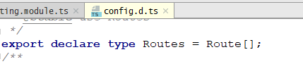

而`Route`的参数如下图所示，一般情况下，`path`和`component`是必选的两个参数。比如：`path:/a`,`component:A`则说明，当地址为`/a`时，应该展示组件`A`的内容。  

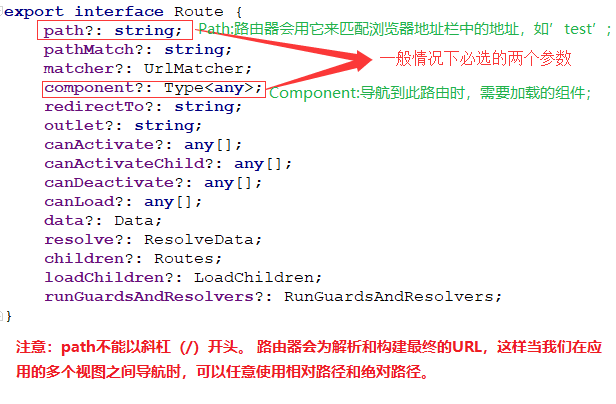

**其余类的简介见下图：**


### 延伸1： 路由参数传递 -- 参数传递的几种方式

+ 普通方式传递数据：`/product?id=1&name=iphone => ActivatedRoute.queryParams[id]`;
+ rest方式传递数据：`{path:/product/:id} => /product/1 => ActivatedRoute.params[id];`
+ 路由配置传递数据：`{path:/product,component:ProductComponent,data:[{madeInChina:true}]} => ActivatedRoute.data[0][madeInChina];`
### 延伸2： Angular路由方法loadChildren跟children有什么区别？

+ children是一组自路由的定义。

```typescript
[{
  path: 'team/:id',
 component: Team,
  children: [{
    path: 'user/:name',
    component: User
  }]
}]
/**当导航到“/team/11/user/bob”这个路径时，路由就会创建team component，并把user component放到里面。**/
```

+ loadChildren 是延迟加载的子路由的引用【懒加载】
   
   loadChildren的属性值由三部分组成：
   + 需要导入模块的相对路径
   + `#`分隔符
   + 导出模块类的名称

```typescript
[{
  path: 'team/:id',
  component: Team,
  loadChildren: 'user.bundle.js'
}]
/***
 * 路由使用注册好的NgModuleFactoryLoader来获取跟team有关的NgModule。然后将其路由定义放到主路由配置文件中。
 * 
 * 所以时候什么时候用loadChildren ？ 当你想提升性能，延迟加载某些模块时，就可以考虑这种路由加载方式了。
**/
```

案例:
```javascript
/**--在根模块AppModule中配置setting模块的路由信息：--**/
export const ROUTES: Routes = [
  {
    path: 'settings',
    
    /**
    * <p>这里使用到了懒加载LoadChildren属性。这里没有将SettingsModule导入到AppModule中，而是
    * 通过loadChildren属性，告诉Angular路由依据loadChildren属性配置的路径去加载SettingsModule 
    * 模块。这就是模块懒加载功能的具体应用，当用户访问 /settings/**路径的时候，才会加载对
    * 应的 SettingsModule 模块，这减少了应用启动时加载资源的大小。</p>
    */
    loadChildren: './settings/settings.module#SettingsModule'
  }
];

@NgModule({
  imports: [
    BrowserModule,
    RouterModule.forRoot(ROUTES)
  ],
  // ...
})
export class AppModule {}
```


### 延伸3：重定向的类型

+ local redirect:
  + 当 `'redirectTo'` 不是以 `'/'` 开始
  + 替换成单个URL片段
  + 例如: `{ path: 'one', redirectTo: 'two' }`

+ absolute redirect:
  + 当 `'redirectTo'` 是以 `'/'` 开始
  + 替换整个URL
  + 例如: `{ path: 'one', redirectTo: '/two' }`

<font color=red>如果URL以斜线（`/`）开头，则为绝对值，否则为相对于路径URL的值。</font> 不存在时，路由器不会重定向。


**重定向路由需要一个`pathMatch`属性，来告诉路由器如何用`URL`去匹配路由的路径，否则路由器就会报错。**

### 延伸4：路由参数

1、`:` 创建一个“空位”，占位符
`例如： { path: 'hero/:id', component: HeroDetailComponent }`

注意路径中的`:id`令牌。它为路由参数在路径中创建一个“空位”。在这里，路由器把英雄的 id 插入到那个“空位”中。

+ 第一种：在查询参数中传递数据
```
   {path:"address/:id"}   => address/1  => ActivatedRoute.param[id]

1、在路由中传递

　　<a [routerLink] = "['/address',1]"></a>

2、点击事件传递

　　this.router.navigate([‘/address’,2])

　　//在不同等级页面跳转可以用snapshot（快照方式）
　　this.id = this.routeInfo.snapshot.params["id"]

　　//相同组件跳转需要使用subscribe(订阅方式)
　　 this.routeInfo.params.subscribe((params: Params) => this.id = params["id"]  )
```

+ 第二种：在路由路径中传递参数数据
```
<a [routerLink] = "['/address']" queryParams= "{id:1}"></a>

this.id = this.routeInfo.snapshot.queryParams["id"] //拿到路由中的参数s
```

+ 第三种：在路由配置中传递数据
```
{path:'home', component: HomeComponent，data:[{isPush:true}] }  => ActivatedRoute.data[0][isPush]
　　
//同样也是有snapshot和subscribe两种类型
this.isPush = this.routeInfo.snapshot.data[0]["isPush"]
```

### 延伸5：路由参数注意事项

`path`: 路径参数(不能以/开头，路由会自己添加)，

`component`: 是组件（也就是你要导航的目的页面）

`redirectTo`：重定向  

`pathMath`: 来告诉路由器如何用URL去匹配路由的路径

`**`: 通配符，当前面所有的路由都找不到的时候就会路由到这个组件

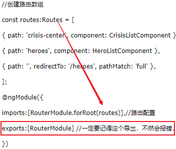


### 延伸6：子路由、辅助路由、路由守卫

**子路由是相对路由**
```
路由配置部分，主要是children
const routes: Routes = [
  {path:'home', component: HomeComponent,
  　　children:[{
    　　　　path:'homeDetail/:id',
    　　　　component:HomeMenuComponent
  　　　　},{
    　　　　path:'',
    　　　　component:HomeListComponent
  　　　　}]
  }
]
```

+ 第一种是通过标签跳转,这里是`./(相对路径)`不是`/（绝对路径）`

``` 
<a [routerLink] = "['./homeDetail',10]">haha</a>
```

+ 第二种是点击按钮通过Router路由子界面
 
 ```
import { Router,ActivatedRoute } from "@angular/router";
constructor(private router: Router,private routeInfo:ActivatedRoute){}
nav():void {
  this.router.navigate(['homeDetail',100],{relativeTo:this.routeInfo});
}
 ```

 **辅助路由**

 ```html
 在HTML文件中

//主路由
<router-outlet></router-outlet>

//辅助路由
<router-outlet  name="aux"></router-outlet>

----------------------------------
配置
{path:'xxx',component:XxxComponent}
{path:'yyy',component:YyyComponent,outlet:"aux"}

 
<a [routerLink] = "['/xxx',{outlet:{aux:'xxx'}}]">Xxx</a>
<a [routerLink] = "['/yyy',{outlet:{aux:'yyy'}}]">Yyy</a>

//primary   决定主路由的路径  点击a标签主路由到Zzz组件，辅助路由到Yyy组件
<a [routerLink] = "['/yyy',{outlet:{primary:‘zzz’ aux:'yyy'}}]">Yyy</a>
 ```

**路由守卫**

CanActivate: 处理导航到某个路由的情况。

CanDeactivate:处理从当前路由离开的情况。

Resole:在路由激活之前获取路由数据。

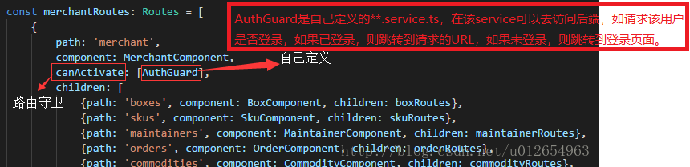

**使用场景：什么时候用路由守卫？**
  
有了URL，则任何用户都能在任何时候导航到任何地方。 但有时候这样是不对的。用户可能无权导航到目标组件。可能用户得先登录（认证）。在显示目标组件前，我们可能得先获取某些数据。在离开组件前，我们可能要先保存修改。

### 延伸7：使用动态导入进行路由配置

**在 Angular 8 中，我们可以使用路由以延迟加载部分应用程序，这是通过在路由配置中使用 loadChildren 键来实现的。**

在之前的版本中会编写如下的代码：
`{path: '/admin', loadChildren: './admin/admin.module#AdminModule'}`
这种语法是专门为 Angular 定制的，并内置到其工具链中。但 Angular 8 将逐渐往行业标准靠拢 —— 使用了动态导入的方式（dynamic imports）。

所以代码会像下面这样：
```javascript
{path: `/admin`, loadChildren: () => 
        import(`./admin/admin.module`).then(m => m.AdminModule)}
```
这将改进对 VSCode 和 WebStorm 等开发工具的支持，可以更好理解和验证这些导入。

## 数据绑定、响应式编程和管道、@Input()与@Output()

<font color=#11A8EF>数据绑定:</font> Angular中的数据绑定指的是同一组件中<font color=red>控制器文件(.ts)</font>与<font color=red>视图文件(.html)</font>之间的数据传递。

+ <font color=#8F4B1C>单向绑定：</font> 它的意思是要么是ts文件为html文件赋值，要么相反。


+ <font color=#8F4B1C>双向绑定:</font> ts文件与html文件中绑定的值同时改变。


#### DOM属性和HTML属性

+ 1、少量 HTML 属性 和 DOM 属性之间有着1:1的映射，如id。(<font color=red>HTML元素属性和DOM属性的名称和值大部分都相同</font>)

+ 2、有些HTML属性没有对应的DOM属性，如 colspan

+ 3、有些DOM属性没有对应的HTML属性，如textContent。有些名字相同，HTML属性和DOM属性的值也不是同一样东西。

+ 4、HTML属性的值指定了初始值；DOM属性的值标识当前值。<font color=red>DOM属性的值可以改变；HTML属性的值不能改变。</font>

+ 5、模板绑定是通过DOM属性和时间来工作的，而不是 HTML 属性。

### DOM属性绑定


### HTML属性绑定


**DOM绑定与HTML属性绑定的区别**

| | DOM绑定 | HTML绑定 |
| :------| ------: | :------: |
|相同情况下|	一个元素的id||
|有html属性无dom属性|	|	表格中td的colspan|
|有dom属性无html属性|textContent属性||
|关于值|	dom表示当前值|	html表示初始化值|
|关于可变|	dom值是可变的|	html值是不可变的|

<font color=#449D44 size=3>总结:我们模板绑定是通过DOM属性来操作的，不是HTML属性来操作的</font>

### 类绑定


### 样式绑定


#### 模板变量


##### Angular中的输入输出是通过注解`@Input`和`@Output`来标识，它位于组件控制器的属性上方。<font color=red>输入输出针对的对象是父子组件</font>。

## Angular 常用概念

### 1、模块与装饰器

Angular设计目标就是适应大型应用的开发，模块的概念就是来组织不同的组件及服务。一个大型应用的最终形态就是各种不同的模块的组合

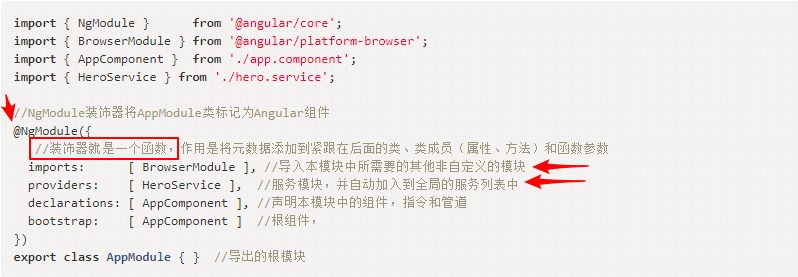

### 2、组件、指令、管道

组件在Angular中处于中心地位，但也是指令的一种

+ 自定义组件

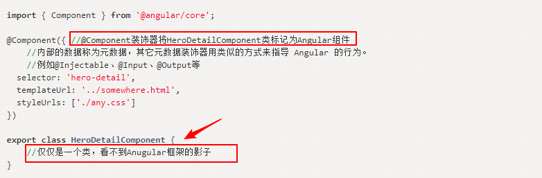

+ 自定义指令

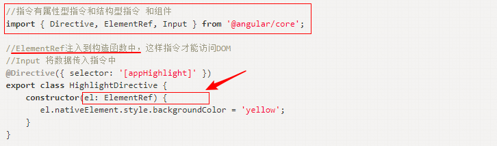

+ 自定义管道

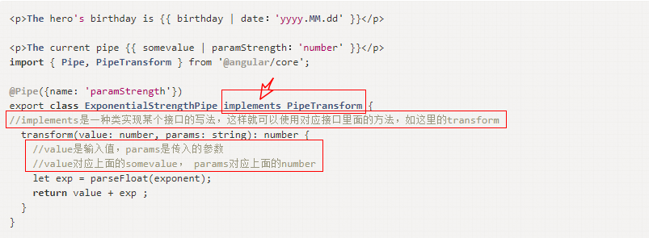

### 3、服务

服务可以为对数据的获取和各种处理，组件就是服务的消费者，通过依赖注入在组件中使用服务

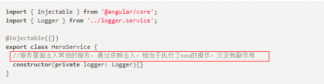

### 4、生命周期

就是被Anuglar管理的组件的生命周期钩子，对应的有钩子里面的方法

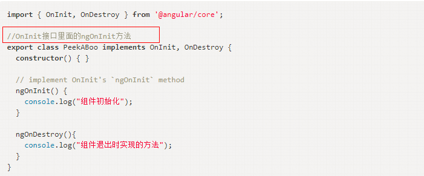

### 5、HttpClient

**需要在你的module定义引用 `import HttpClientModule from @angular/common/http`**

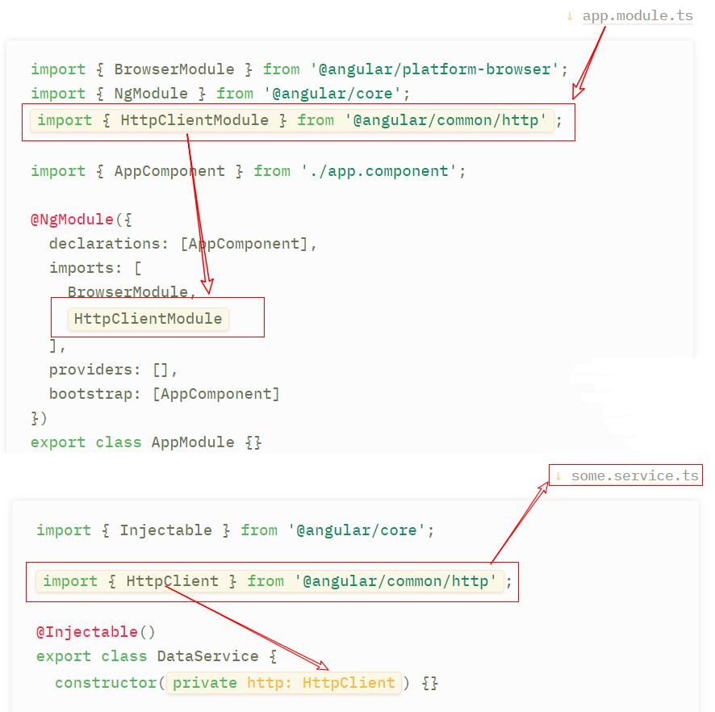

* 基础用法`GET、POST、PUT、PATCH、DELETE`,默认json响应

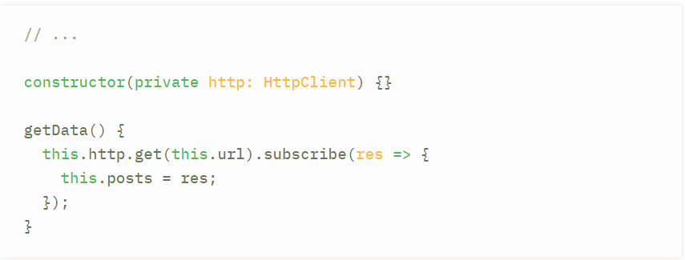

**指定响应类型**（如果您期望使用JSON以外的其他内容作为响应，则可以使用具有responseType键的对象指定预期的响应类型）

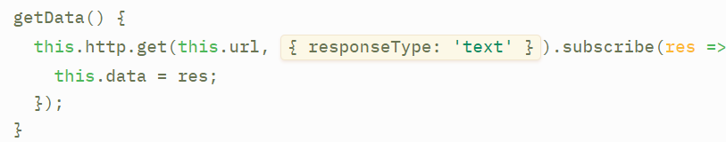

**您还可以为响应的形态定义一个接口，并针对该接口进行类型检查**

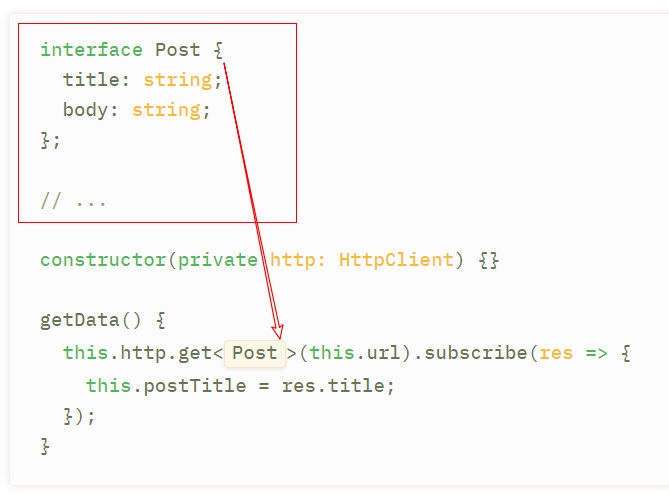

默认情况下，HttpClient返回响应的主体。 您可以通过将observe 键设置为“response”值来传入对象以获取完整响应。 这可以用于检查某些标题：

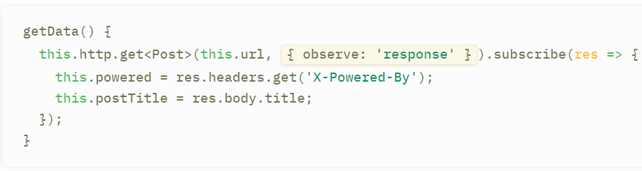

**处理回调和错误**

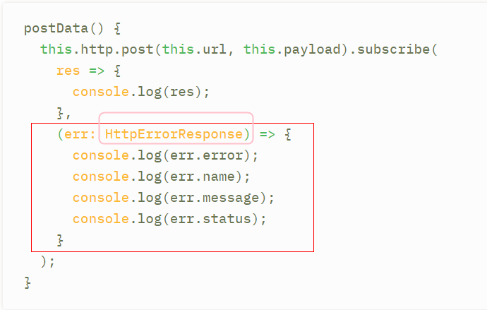
 
**使用`HttpParams` 和 `HttpHeaders` （@angular/common/http）**


* Progress Events

监听请求进度事件（完整实例）：
1、我们首先需要通过创建一个HttpRequest类的实例并使用reportProgress选项来构建一个请求对象。
2、 可用的事件类型有`Sent，UploadProgress，ResponseHeader，DownloadProgress，Response和User`。
`

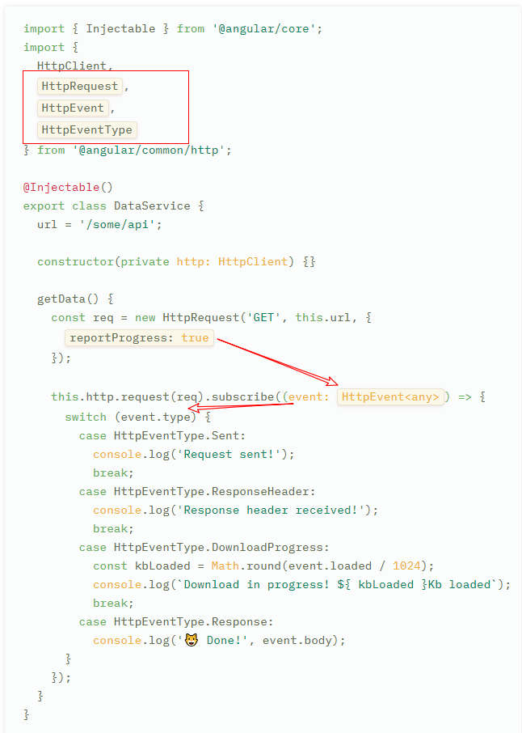


## RxJS


## Redux 

1、Redux 是什么？

全局的、唯一的、不可变的内存状态[数据库]


## Angular 整合Redux

#### 导入NgRedux


#### 构造参数为`store`的构造器


#### 在你的组件(components)中使用`store`


#### 注入Actions


#### Accessing(访问) Services from Actions


#### Dispatching(调度、派遣) Actions


## 目前Angular整合Redux两种方式：

+ `Ng-redux` 核心仍使用 Redux，增加對 Angular 的支援

+ `Ngrx` 只有概念使用 Redux，核心完全使用 RxJS 重新操作。

**安裝 Ngrx** ` npm install @ngrx/core @ngrx/store --save`


**View** 相当于`component`，主要在显示使用者界面。

**Action** 当`component` 有任何 `event` 時，会对 `Ngrx` 发出 `action`。

**Middleware** 负责存取对 `server` 端的 API

**Dispatcher** 负责接受 `component` 传来的 action，并将 `action` 传给 `reducer`。

**Store** 可是为 `Ngrx` 在浏览器端的资料库，各 `component` 的资料都可统一放在这里。

**Reducer** 根据`dispatcher` 传来的 `action`，决定该如何写入state。

  当 `state` 有改变时，將通知有`subscribe`该`state`的`component`自动更新。

**State** 存放在 `store` 內的资料。

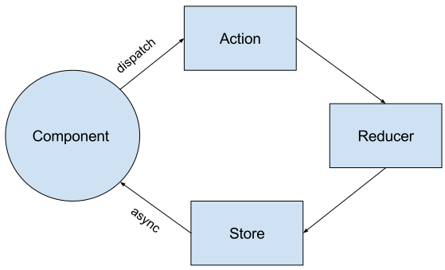

有些东西Ngrx 已经帮我们做了，真的要我們自己操作只有 4 個部份，且资料流为单向的 : `Component -> Action -> Reducer -> Store -> Component`。

### 什么时候该使用Ngrx？

+ 当多个 `component` 需使用共用资料，且各 `component` 的操作会影像其他 `component` 的结果。
+ 资料可能同时被多个`component`修改，甚至同時被 `server API `修改。
+ 需要操作undo/redo 功能。

> 案例--操作：

[新版迁移指南 ：https://github.com/ngrx/platform/blob/master/MIGRATION.md](https://github.com/ngrx/platform/blob/master/MIGRATION.md)

**AppModule：app.module.ts**


**AppComponent ：--> app.component.html、app.component.ts**


**Action ：--> counter.action.ts**


**Reducer ：--> counter.reducer.ts**


**Store ：--> counter.store.ts**


### Redux 在您的Angular应用使用`reselect`进行状态函数的高阶运算

reselect：带‘记忆’功能的函数运算

无论多少参数，最后一个才是用于函数计算，其他的都是他的输入

```typescript
export const getTasksWithOwner = createSelector(getTasks,getUserEntities,(tasks,entities) ={
   return tasks.map(task =>{
    const owner = entites[task.ownerId];
    const participants =task.participantIds.map(id => entites[id]);
    return Object.assgin({ },task,{owner:owner},{participants:[...participants]});
   });
})
```

## 使用`@ngrx/store`


**Registering Reducers**


简化：


示例：


## 什么是Effect?

<font color=red size=4>@Effect( ) 标识是一个Observable<Action>流。</font>


**使用effect：`import {Actions, Effect} from '@ngrx/effects';`**

```typescript
@Injectable()
export class AuthEffects{
  // 通过构造注入需要的服务和 action 信号流
  constructor(private actions$: Actions, private authService: AuthService) { }
  
  //用 @Effect() 修饰器来标明这是一个 Effect
  @Effect() 
  login$: Observable<Action> = this.actions$ // action 信号流
    .ofType(authActions.ActionTypes.LOGIN) // 如果是 LOGIN Action
    .map(toPayload) // 转换成 action 的 payload 数据流
    .switchMap((val:{username:string, password: string}) => {
      // 调用服务
      return this.authService
          .login(val.username, val.password)
          // 如果成功发出 LOGIN_SUCCESS Action 交给其它 Effect 或者 Reducer 去处理
          .map(user => new authActions.LoginSuccessAction({user: user}))
          // 如果失败发出 LOGIN_FAIL Action 交给其它 Effect 或者 Reducer 去处理
          .catch(err => of(new actions.LoginFailAction(err)));
    });

}
```


顺序安装依赖库
```typescript
$ npm i --save @ngrx/core
$ npm i --save @ngrx/store
$ npm i --save @ngrx/effects

/**
 * 我们使用reselect来实现高效的`state`存取操作。我们将使用`reselect`的
 * `createSelector`方法来创建高效的选择器，这个选择器能被存储且仅在参
 * 数更改的时候才会重构
 */
$ npm i --save reselect
 
 /**
  * 为了让开发更加方便并易于调试，我们添加能够在控制台记
  * 录action和state的更新的store-logger来帮助我们
  */
$ npm i --save ngrx-store-logger 
```

示例：


## 使用`@ngrx/router-store`


### <font color=#449D44 size =4>Navigation actions</font>


示例：


## 使用`@ngrx/store-devtools`
注册到模块中
```typescript
import { StoreDevtoolsModule } from '@ngrx/store-devtools';
import { environment } from '../environments/environment'; // Angular CLI environment

@NgModule({
  imports: [
    !environment.production ? StoreDevtoolsModule.instrument({ maxAge: 50 }) : []
  ]
})
export class AppModule {}
```

## Angular6.x 热更新模式配置

`angular-cli` 默认是不会有热更新的效果，所以需要我们自己做一些配置。官方的 Wiki 更新其实没有完全的跟上，所以按照配置可能也不一定能正确实现，所以这里会将成功的配置说明一下。

```
版本
本地的版本信息如下：

Angular CLI: 6.0.5
Node: 8.10.0
OS: darwin x64
Angular: 6.0.3
```

**具体配置**
一、需要修改的文件
```
angular.json
package.json
src/environments/environment.prod.ts
src/environments/environment.ts
src/main.ts
```
二、需要新增的文件
```
src/environments/environment.hmr.ts
src/hmr.ts
src/typings.d.ts
```
三、修改的具体内容以及说明

+ 利用配置分离的方式来配置`hmr`的参数
```
// environment.prod.ts
export const environment = {
  production: true,
  hmr: false // 把热更新在生产模式关闭，当然你也可以不用，最好是统一配置
};
// environment.ts
export const environment = {
  production: false,
  hmr: false // 跟 prod 意思相同
};
// environment.hmr.ts
export const environment = {
  production: false,
  hmr: true // 开启热更新，这个配置是给 main.ts 代码使用来判断的参数
};
```
这里就修改好了参数和不同运行环境下的配置了，接下来要配置在不同的启动方式应用不同的配置文件。

+ 映射不同启动环境的配置文件

这部分需要修改 `angular.json` 文件。

```
// 1. 修改 JSON 路径：projects/<your_project_name>/architect/build/configurations
// 在这个配置下添加 hmr 属性的配置
// 这里应该看名字很直观，就是在运行的时候把默认配置用 .hmr.ts 文件的内容做替换来启动
"hmr": {
  "fileReplacements": [
    {
      "replace": "src/environments/environment.ts",
      "with": "src/environments/environment.hmr.ts"
    }
  ]
}

// 2. 修改 JSON 路径：projects/<your_project_name>/architect/serve/configurations
// 也是添加 hmr 属性的配置
"hmr": {
  "browserTarget": "angular-guide:build:hmr"
}
```

这里你会想，为什么不把 `fileReplacements` 配置到 serve 属性下，你可以试试，看下报错信息，会报错的哦~

在这里基本我们配置上就已经完成了，剩下是根据 webpack-hot 规则修改热加载的模块。这里使用最粗暴的形式，在应用最顶端进行热加载（这句话如果不能理解不影响最后结果）。

+ 映射热更新的代码

(1) 代码上有提供 @angularclass/hmr，所以需要先安装一下：
`yarn add @angularclass/hmr --dev`
(2) 接下来是模板代码，COPY 即可，就是接受热更新模块，直接替换我们应用中的组件模块。
```
// src/hmr.ts
import { NgModuleRef, ApplicationRef } from "@angular/core";
import { createNewHosts } from "@angularclass/hmr";

export const hmrBootstrap = (module: any, bootstrap: () => Promise<NgModuleRef<any>>) => {
  let ngModule: NgModuleRef<any>;
  module.hot.accept();
  bootstrap().then(mod => ngModule = mod);
  module.hot.dispose(() => {
    const appRef: ApplicationRef = ngModule.injector.get(ApplicationRef);
    const elements = appRef.components.map(c => c.location.nativeElement);
    const makeVisible = createNewHosts(elements);
    ngModule.destroy();
    makeVisible();
  });
};
```
(3) 修改 main.ts 的启动代码
```
const bootstrap = () => platformBrowserDynamic().bootstrapModule(AppModule);
console.log(environment); // 打印看环境文件是否加载正确
console.log("is hot: ", module.hot); // 热更新的参数

if (environment.hmr) {
  if (module.hot) {
    hmrBootstrap(module, bootstrap);
  } else {
    console.error("HMR is not enabled for webpack-dev-server!");
    console.log("Are you using the --hmr flag for ng serve?");
  }
} else {
  bootstrap();
}
```
这里你会发现会提示 module 这个变量不存在，所以需要安装一下全局类型定义 `@types/webpack-env：`
`yarn add @types/webpack-env --dev`
最后在 `src/typings.d.ts` 文件中引用类型：
`/// <reference types="webpack-env" />`
这样就不会提示报错了，因为找到了类型声明文件。

+ 添加 `npm script`

配置其实是完整了，最后启动命令还是简单点：`"hmr": "ng serve --hmr --configuration=hmr"`


## 常出现的异常解决方案


1、多次声明同一个组件

组件是 Angular 应用程序中的常见构建块。每个组件都需要在<font color=rde> `@NgModule.declarations`</font> 数组中声明，才能够使用。在 Angular 中是不允许在多个模块中声明同一个组件，如果一个组件在多个模块中声明的话，那么 Angular 编译器将会抛出异常。

> 场景使用 -- 在多个模块中使用同一个组件是允许的

+ 如果一个模块作为另一个模块的子模块，那么针对上面的场景解决方案将是：
  + 在子模块的 <font color=red> @NgModule.declaration </font> 中声 <font color=red>HeroComponent</font> 组件
  + 通过子模块的<font color=red> @NgModule.exports </font>数组中导出该组件
  + 在父模块的 <font color=red> @NgModule.imports </font>数组中导入子模块

+ 对于其它情况，我们可以创建一个新的模块(共享模块)，如<font color=red> SharedModule</font> 模块。具体步骤如下：
   + 在 <font color=red>SharedModule</font> 中声明和导出 <font color=red>HeroComponent</font>
   + 在需要使用 <font color=red>HeroComponent</font> 的模块中导入<font color=red> SharedModule</font>

2、<font color=#AE0000 size=3>angular: Error: Uncaught (in promise): Error: StaticInjectorError...</font>

原因：构建的service没有添加到module里造成的 或者 service module没有在app 的module下引入。

3、<font color=red size=3>core.js:1350 ERROR Error: Uncaught (in promise): Error: StaticInjectorError[Http]: StaticInjectorError[Http]: NullInjectorError: No provider for Http!</font>

将HttpMoudle导入到我的app.module.ts中，问题就没有了

`import { HttpModule } from '@angular/http';`
