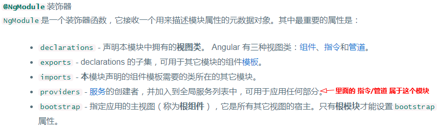
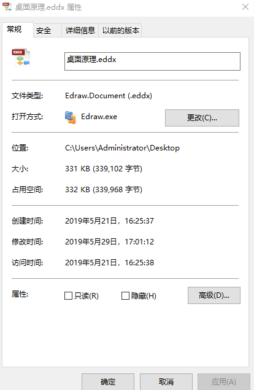
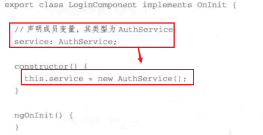
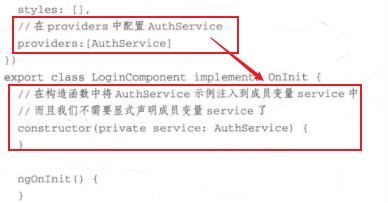
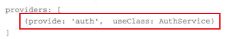
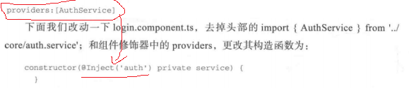
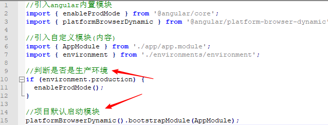
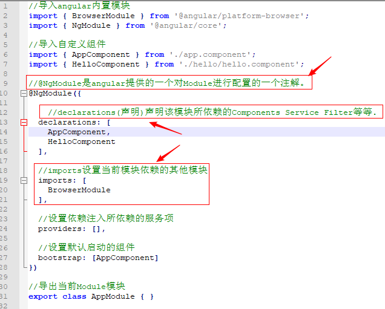
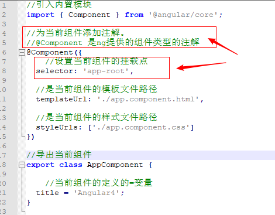

# Angular知识清单（备忘录）

## ES5 常用语法

### 1、数组 Array 加了很多方法，分为迭代方法和归并方法

**迭代方法：**

+ every(): 对数组中每个元素都给定方法，如果方法对每一项都返回true，则返回true。
+ some():对数组中每个元素都给定方法，如果方法对任意一项返回true，则返回true。

+ filter():对数组中的每个元素都给定方法，返回数组中在给定方法中返回true的元素。结果保存在新数组中，不会改变原数组。

+ map():对数组中每个元素都给定方法，返回方法调用结果组成的数组。结果保存在新数组中，不会改变原数组。

+ forEach():区别在于该方法会对原来的数组进行改变。

<font clore=red>给定方法的参数都为（item,index,array）</font>
```JavaScript
var arr = [1,2,3,4,2,2,2,2,2,3,4,3,4,3,1,2,];
var result = arr.filter(
    function(element,index,self){
      return self.indexOf(element) === index;
    }
);
```

**归并方法：**

+ reduce: 迭代数组的所有项，然后构建一个最终返回的值,从数组中第一项开始。
+ reduceRight: 迭代数组的所有项，然后构建一个最终返回的值，从数组中最后一项开始。

```JavaScript
var arr = [1,2,3,4,5,6,7,8,9,10];
var sum = arr.reduce(
    function(prev,cur,index,array){
        return prev*cur;
    }
);
```

### 2、JSON的方法

+ JSON.parse: 用于从字符串中读取对象
+ JSON.stringify: 用于将对象转换为字符串

```JavaScript
var jsonstring = '{"name":"zhangsan","age":"24"}'; 
console.log(JSON.parse(jsonstring));
console.log(typeof JSON.parse(jsonstring))
var jsonobj = {
    name:"lisi",
    age:"25"
}
console.log(JSON.stringify(jsonobj));
console.log(typeof JSON.stringify(jsonobj));
```

### 3、Date获取时间戳
```JavaScript
var date = new Date();
//1480312139830
console.log(date.getTime());

//ES5
Date.now()      //Date构造类型添加一个now()静态方法
```

## ES6 常用语法

### 1、基本定义
+ **let** 声明的变量只能在其所在的代码块内才能访问
+ **var** 声明的变量由于是全局变量，因此可以在代码块外访问
+ **const** 用来定义常量，相当于java中的final关键字。并且const声明常量之后就必须立即初始化！

### 2、箭头函数

`var 变量名/函数名 = （参数，参数）=>{代码块}`
```JavaScript
var f = v => v;
//等同于
var f = function(v) {
  return v;
};

var f = () => 5;
// 等同于
var f = function () { return 5 };

var sum = (num1, num2) => num1 + num2;
// 等同于
var sum = function(num1, num2) {
  return num1 + num2;
};

注意：如果return的是一个对象{id:id,age:age},那么箭头右边要用括号包起来().

箭头函数用于返回对象时，这时使用'()'
let add = (a, b) => (c)
```

## Angular（难理解的概念）

### 该思考的问题？
- 1、使用依赖注入应该注意什么？
- 2、服务一般用来做什么？
- 3、指令一般用来做什么？
- 4、angular如何提取公共组件
- 5、父组件与子组件之间是如何进行通讯的
- 6、什么时候应该使用Typescript？
- 7、为什么如input之类的语法后面必须加（）
- <font color=red >8、什么是装饰器？</font> 装饰器就是一个<font size=4 color=blue>函数</font>,它将元数据添加到类、类成员（属性、方法）和函数参数。
  - 它是一个表达式
  - 该表达式被执行后，返回一个函数
  - 函数的入参分别为target、name、descriptor
  - 执行该函数后，可能返回descriptor对象，用于配置target对象
  
    **要想应用装饰器，把它放到被装饰对象的上面或左边。** Angular 使用自己的一套装饰器来实现应用程序各部件之间的相互操作

     


- 9、 `@Component` 中 `@` 的有什么作用？

  `@Component` 中`@` 是语法糖，用于表示装饰器。为了告诉 TypeScript 编译器，`@` 后面的是装饰器函数或装饰器工厂，需要特殊处理。

- 10、应该把哪些类添加到`declarations`中？
 
    可以把可声明的类添加到模块 `declarations` 列表中。可声明的类是指：`组件、指令和管道`。

    这些类只能在应用程序的`一个并且只有一个模块`中声明。只有当它们从属某个模块时，才能在此模块中声明它们。

- 11、不应该把哪些类添加到`declarations`中？

  只有可声明的类才能添加到模块的 declarations 列表中。以下类不能添加到 declarations 列表中：

  - 已经在其它模块中声明过的类。无论它来自应用内模块还是第三方模块
  - 从其它模块中导入的指令
  - 模块类
  - 服务类
  - 非 Angular 的类和对象，比如：字符串、数字、函数、实体模型、配置、业务逻辑和辅助类

- 12、为什么要把同一个组件声明在不同的`NgModule`属性中？

  我们经常看到 `AppComponent` 同时出现在 `declarations` 和 `bootstrap` 中。我们还可以看到 `HeroComponent` 也同时出现在 `declarations`、`exports` 和 `entryComponent` 中。

  这看起来是多余的，但因为不同的列表有不同的意义，如果仅在一个列表中声明，我们无法推断它是否出现在其它列表中。

- 13、应该 `imports` 什么？

  一句话：导入你需要在当前模块的组件模板中使用的那些公开的 (被导出的) 可声明类。

  这意味着要从 @angular/common 中导入 CommonModule 才能访问 Angular 的内置指令，如 *ngIf 和 *ngFor。如果你的组件中需要使用 [(ngModel)] 双向绑定的功能，就需要从 @angular/forms 中导入 FormsModule。

  需要注意的是，只能在根模块 (AppModule) 中导入 BrowserModule。

- 14、应该 `exports` 什么？

  导出其它模块需要引用的可声明类，如果你不导出某个类，它就是私有的，只对当前模块中声明的其它组件可见。

  你可以导出任何可声明类 (组件、指令和管道)，而不用管它是声明在当前模块中还是某个导入的模块中。

  你也可以重新导出整个已导入的模块，这将导致重新导出模块中导出的所有类。模块甚至还可以导出它未曾导入过的模块。

- 15、应该导入 `BrowserModule` 还是 `CommonModule`？

  几乎所有要在浏览器中使用的应用的根模块 (AppModule ) 都应该从`@angular/platform-browser` 模块中导入`BrowserModule`。

  `BrowserModule` 提供了浏览器平台下运行的基础指令和服务，该模块内部重新导出了 `CommonModule`，这意味着 AppModule 中组件也可以访问 Angular 的内置指令。

  在其它任何模块中都不要导入 `BrowserModule` 。在特性模块和惰性加载模块中应该导入 `CommonModule`。因为它们只需要 `Angular` 中提供的内置指令，而不需要重新初始化应用级的服务。

  特性模块中导入`CommonModule` 可以让它能用在任何目标平台上，不仅是浏览器平台。


### 1、元数据

**元数据： 元数据是用来描述数据的数据**

通俗理解，大家都在电脑上有文件浏览器，随便选一个文件，右击文件属性。我们看到了对文件数据的描述，包括文件的种类、文件的大小、文件的位置、创建时间、修改时间等通用信息，还有打开方式的描述、权限描述等。这就是文件的元数据。



那么在编程语言的世界中，如何表示这种元数据呢？Angular 的元数据表示方法和Java、python等编程语言中的元数据表示法很类似。以`@`这个符号定义一个对象表示后面的数据就是一个元数据，这个元数据一般修饰紧挨着它的哪个对象或变量。 如`@Component(...)`,也叫装饰器

### 2、模块

模块：就是提供相对独立的功能块，每块聚焦于一个特定业务领域。angular内建了很多库是以模块形式提供的。如`FormsModule`封装了表单处理。带有`@NgModule`装饰器函数的类，接收一个元数据对象，该对象告诉angular如何编译和运行模块代码。

NgModule 是一个装饰器函数，它接收一个用来描述模块属性的元数据对象。
 + declarations： 声明本模块中拥有的视图类。angular有三种视图类（组件、指令和管道）
 + exports： declarations的子集，可用于其他模块的组件模板
 + imports： 本模块声明的组件模板需要的类所在的其他模块
 + providors:服务的创建者，并加入到全局服务列表中，可用于应用任何部分
 + bootstrap： 指定应用的主视图（称为根组件），它是所有其他视图的宿主。只有根模块才能设置bootstrap属性

### 3、组件

组件：负责控制屏幕的一小块区域（称为“视图”）。组件通过一些有属性和方法组成的API与视图交互。

### 4、什么是依赖注入

1）不使用依赖注入的话，要在构造中初始化service。存在以下缺陷：



  1.1）由于实例化是在组件中进行的，意味着我们如果更改service的构造函数的话，组件也需要更改。
  1.2）如果我们以后需要开发、测试和生产环境配置不同的AuthService，以这种方式实现会非常不方便。

2）使用DI（在组件的装饰器中配置AuthService，然后再组件的构造函数中使用参数进行依赖注入）



3）还可以更简单（在根模块中的这个Providers是配置在模块中全局可用的service或参数）



或，去掉了service的类型声明，但加上了一个修饰符`@Inject('auth')`



`providers:[AuthGuardService]` 等价于 `providers:[{provider:AuthGuardService,useClass:AuthGuardService}]`

## Angular 语法

## angular引导启动入口(main.ts)

**main.ts**



**app.module.ts**



**app.component.ts**




引导应用 | `import {bootstrap} from 'angular2/angular2';`
-----|-----
`bootstrap(MyAppComponent, [MyService, provide(...)]);` | 引导根组件为MyAppComponent的应用，配置依赖注入的服务

模板标签 | ``
-----|-----
`<input [value]="firstName">` | 属性value的值设为firstname
`<div [attr.role]="myAriaRole">` | 属性role的值设为myAriaRole
`<div [class.extra-sparkle]="isDelightful">` | 如果isDelightful（可为相等比较语句）为true，则添加css类名extra-sparkle。
`<div [style.width.px]="mySize">` | 将width设为mySize，单位可选
`<button (click)="readRainbow($event)">` | 点击事件触发时执行readRainbow($event)函数
`<div title="Hello {{ponyName}}">` | 属性值内插字符串，等于`<div [title]="'Hello' + ponyName">`
`<p>Hello {{ponyName}}</p>` | 文本内插字符串
`<my-cmp [(title)]="name">` | 数据双向绑定，等于`<my-cmp [title]="name" (titleChange)="name=$event">`
```<video #movieplayer ...>  <button (click)="movieplayer.play()"> </video>``` | 创建本地变量movieplayer
`<p *my-unless="myExpression">...</p>` | *号代表当前元素会被嵌入到模板中
`<p>Card No.: {{cardNumber | myCreditCardNumberFormatter}}</p>` | 过滤器
`<p>Employer: {{employer?.companyName}}</p>` | ？可处理employer为undefined的情况，如果为undefined，后面表达式将不再执行

内置指令 | `import {NgIf, ...} from 'angular2/common';`
-----|-----
`<section *ngIf="showSection">` | 根据showSection的值，删除或重新生成Dom🌲的一部分
`<li *ngFor="#item of list">` | 将li元素及其内容丢进模板中，为list中的每一个item实例化视图(上已述*号作用)
`<div [ngSwitch]="conditionExpression">   <template [ngSwitchWhen]="case1Exp">...</template>   <template ngSwitchWhen="case2LiteralString">...</template>   <template ngSwitchDefault>...</template> </div>` | 开关指令，根据当前conditionExpression的值，选择一个模板（匹配不到则默认）
`<div [ngClass]="{active: isActive, disabled: isDisabled}">` | 通过变量值的真假，控制css类名的开关

Form表单 | `import {FORM_DIRECTIVES} from 'angular2/common';`
-----|-----
`<input [(ngModel)]="userName">` | 提供数据双向绑定，解析和验证

Class decorators（类的修饰器，语法糖）| `import {Directive, ...} from 'angular2/core';`
-----|-----
@Component({...}) class MyComponent() {} | 声明一个组件类，并提供元数据
@Pipe({...}) class MyPipe() {} | 声明一个pipe类，并提供元数据（类同angular1过滤器）
@Injectable() class MyService() {} | 声明一个有依赖的类

指令配置 | `@Directive({ property1: value1, ... })`
-----|-----
selector: '.cool-button:not(a)' | 指定css选择器，模板中识别指令,可以是element(元素),`[attr]`(属性),.class,:not()
providers: [MyService, provide(...)] | 该指令的依赖Provider数组

组件配置 | `@Component extends @Directive, @Component 继承自 @Directive，所以 @Directive同样适用于@Component`
-----|-----
viewProviders: [MyService, provide(...)] | 该组件视图的依赖Provider
`template: 'Hello {{name}}' / templateUrl: 'my-component.html'` | 组件视图的内联/外部模板
`styles: ['.primary {color: red}'] / styleUrls: ['my-component.css']` | 组件视图的内联/外部样式表
directives: [MyDirective, MyComponent] | 组件模板中使用的指令
pipes: [MyPipe, OtherPipe] | 组件模板中使用的过滤器

指令和组件的类装饰器 | import {Input, ...} from 'angular2/core';
-----|-----
@Input() myProperty; | 声明一个input属性，可以通过属性绑定更新`<my-cmp [my-property]="someExpression">`
@Output() myEvent = new EventEmitter(); | 声明一个output属性，通过事件绑定触发事件 `<my-cmp (my-event)="doSomething()">`
