# 学习Angular 4.x 笔记（课程）；


> 理想化开发流程：

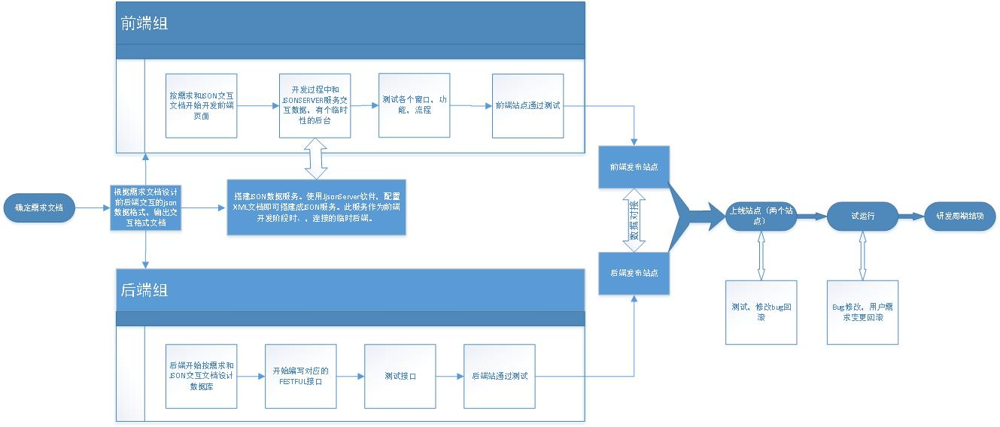

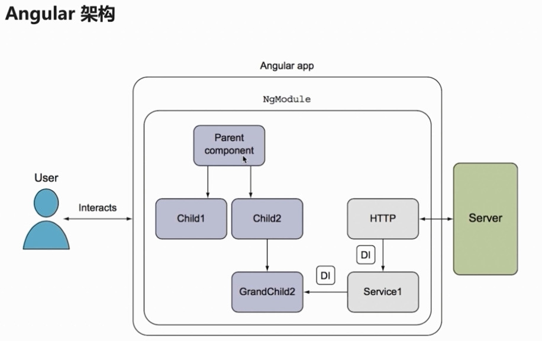

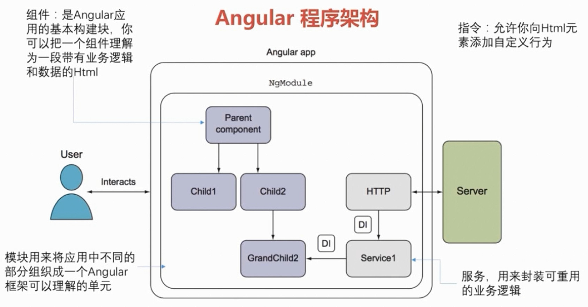


组件：是Angular应用的基本构建块，你可以吧一个组件理解为一段带有业务逻辑和数据的Html

指令：允许你向Html元素添加自定义行为

模块：用来将应用中不同的部分组织成一个Angular框架可以理解的单元

服务：用来封装可重用的业务逻辑

<font size=5 face="黑体" color=red >三大核心：（ Component、Module、Route ）</font>

<font size=5 face="黑体" color=red > Angular核心架构思想（组件化、依赖注入、数据绑定）</font>

**angular2的组件主要分为三个部分构成:**

 - 头部：import 所需要的模块
 - 中间：@装饰器   调用头部导入模块的某一个方法作为装饰器来装饰底部的类，模板放在装饰器中
 - 底部：export 类 这里存放一些装饰器需要用的函数和对外暴露的接口

**@Input声明输入的属性绑定成员字段**

**@Output声明输出的事件绑定成员字段**

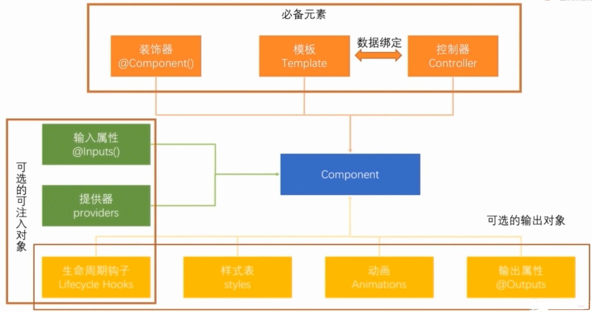

## <font color=orange> 模块 </font> 

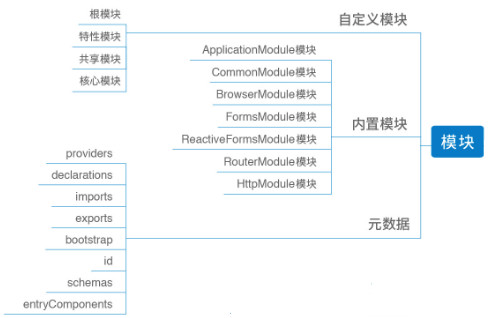

## <font color=orange> 指令 </font>
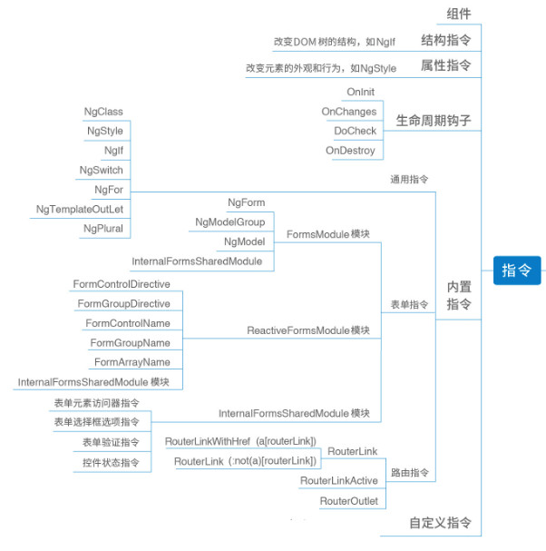

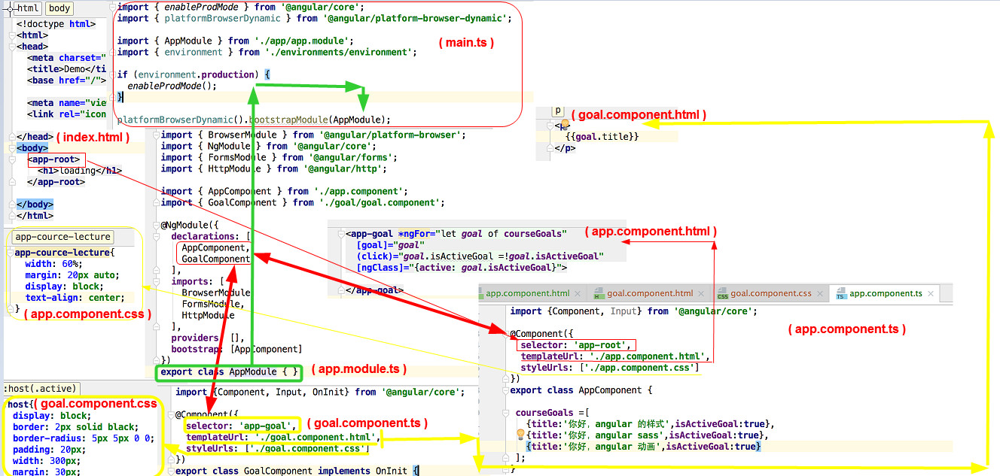

- 使用传统的css

 **Application-wide Styles:**

	Import in `index.html`
	Import (via Webpack) in `other Files`

 **Component-scoped Styles**

	Use `styles` or `styleUrl` property in @Component Decorator

    Add `<style>` or `<link>` Tags to your Component Templates

 **Understanding View Encapsulation**

 Angular emulates the Shadow DOM and therefore encapsulates Styles defined in Styles or StyleUrls on component level `Angular模拟了Shadow DOM，因此封装了组件级别中Styles或StyleUrls中定义的样式。`

[什么是 Shadow Dom](https://www.toobug.net/article/what_is_shadow_dom.html)

[神秘shadow-dom 浅析](http://www.cnblogs.com/coco1s/p/5711795.html)

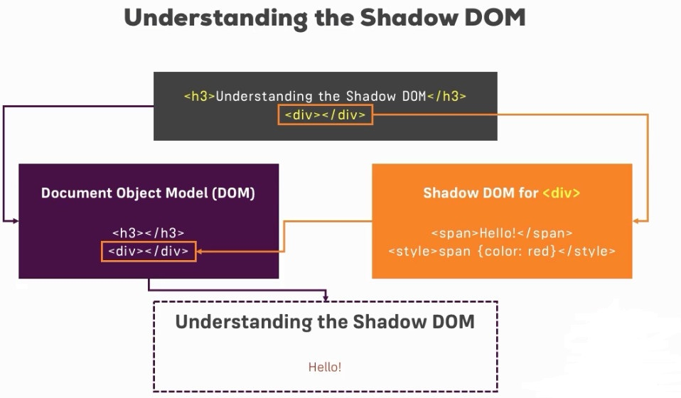

 **Special Selectors**

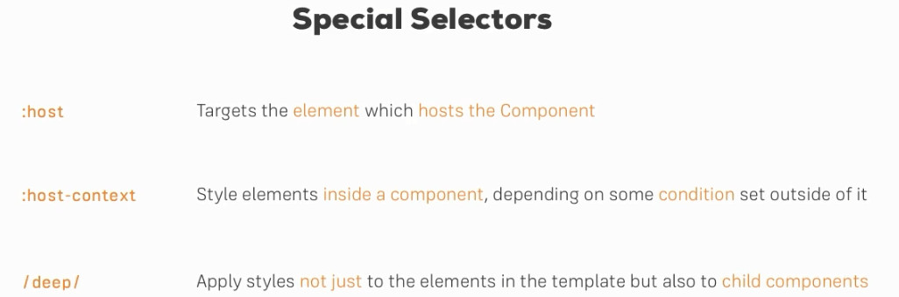

 **ngClass** `Conditionally apply CSS Classes to Elements`(有选择地将CSS类应用于元素)

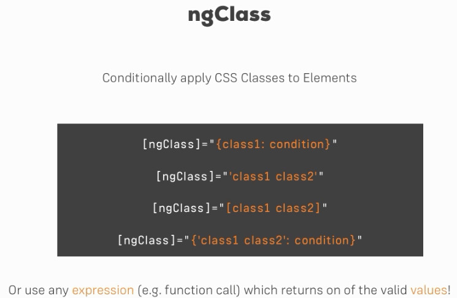

 **ngStyle**
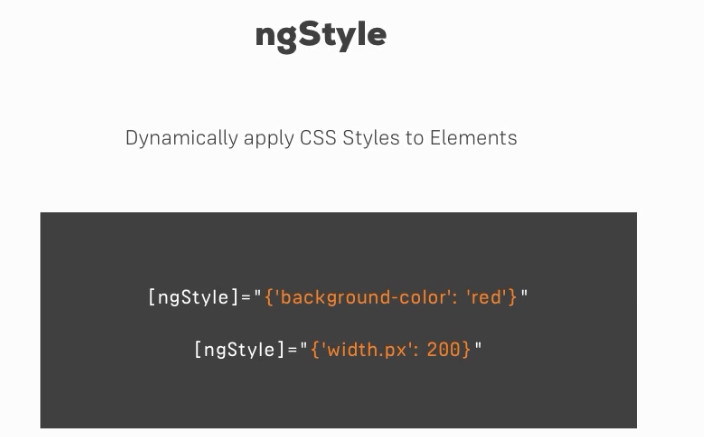

 **使用renderer**

I:\【web】\【Angular4】\Angular 4 (latest version of Angular 2)\02 The Basic\basics-15-event-binding.mp4

#### 指令
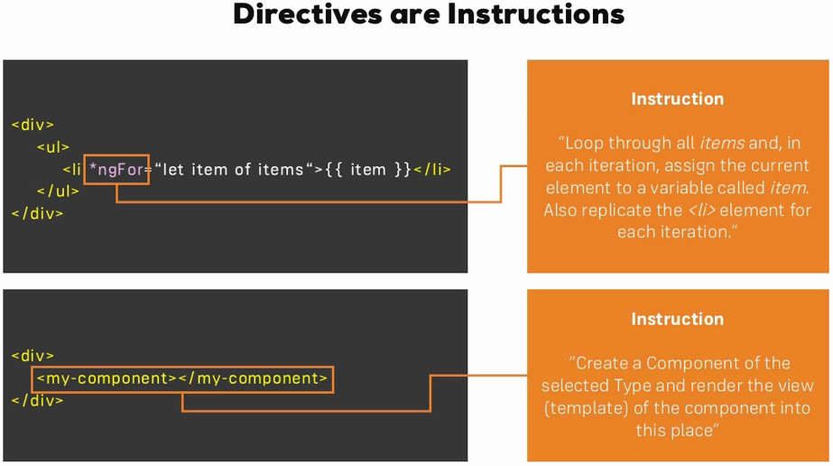
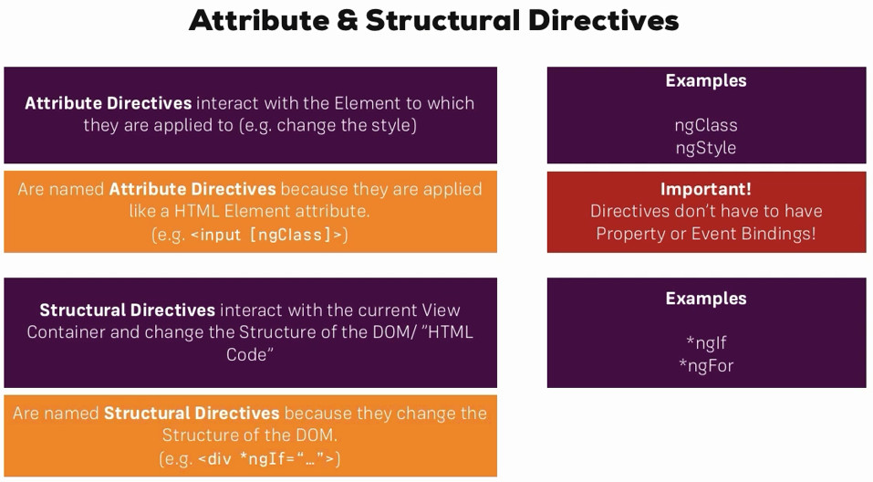

#### <font size=3 face="黑体">属性指令【改变一个元素的外观或行为】`改变元素、组件或其它指令的外观和行为的指令。`

- ngStyle

- ngClass

<table>
<tr style="background-color:#00BCD4"><td  ><font size=3 face="黑体">结构指令【修改试图的结构】`通过添加和移除 DOM 元素改变 DOM 布局的指令`</font></td></tr>
<tr style="background-color:#00BCD4"><td  ><font size=3 face="黑体">组件【常用】`拥有模板的指令`</font></td></tr>
</table>

## <font size=3 face="黑体" color=orange> 表单 </font>

**Angular表单API**

- <font color=orange> 模板式表单（模板驱动方式）</font>
   表单的数据模型是通过组件模板的相关指令来定义的，因为使用这种方式定义表单的数据模型时，我们会受限与html的语法，所以，模板驱动方式只适合用于一些简单的场景。

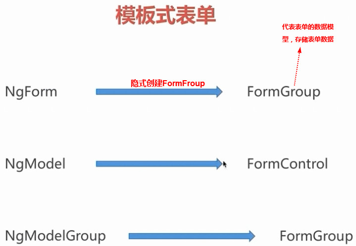

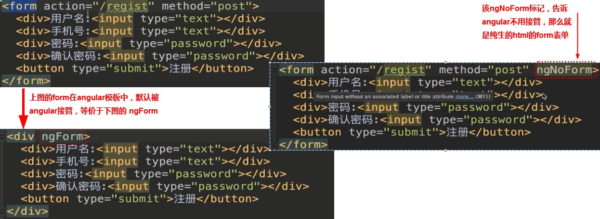

- <font color=orange> 响应式表单（响应式编程的方式）</font>				
   使用响应式表单时，你通过编写TypeScript代码而不是html代码来创建一个底层的数据模型，在这个模型定义好之后，你使用一些特定的指令，将模板上的html元素与底层的数据模型连接在一起。

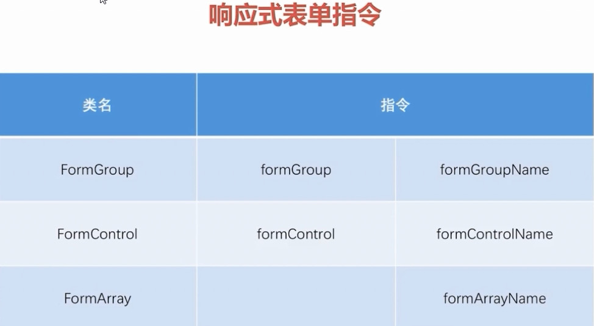

&emsp;&emsp;数据模型并不是一个任意的对象，他是有一个由angular/forms模块中的一些特定的类，如FormControl、FormGroup、FormArray等组成的。在模板式表单中，你是不能直接访问到这些类的。

<font size=3 color=orange>响应式表单并不会替你生成html，模板仍然需要你自己来编写。</font>

以name结尾指令，要在formGroup覆盖范围之内使用

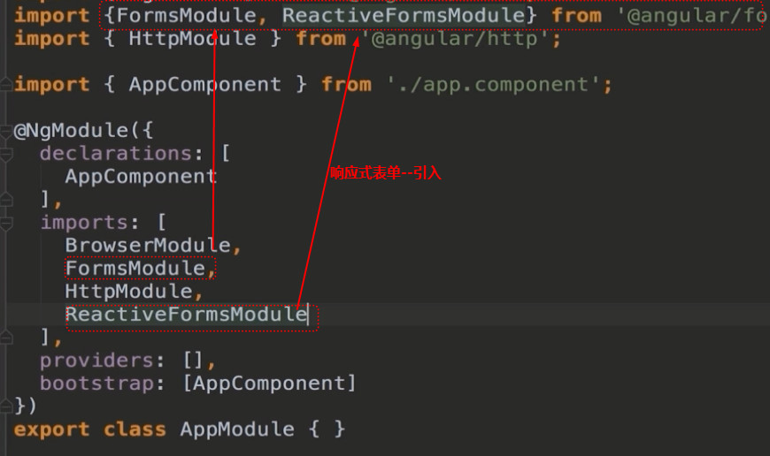

#### <font color=orange>FormBuilder 快速构建表单</font>

使用 FormBuilder 我们可以无需显式声明 FormControl 或 FormGroup。

 FormBuilder 提供三种类型的快速构造
  -  control（ 对应FormControl ）
  -  group （ 对应FormGroup ）
  -  array （ 对应FormArray ）

通常，在表单中最常见的一种是通过 group 来初始化整个表单。

自定义校验器的状态字段：

touched 和 untouched

pristine 和 dirty

pending

<font color=red>自定义校验器并不一定写在组件中，那么我们就可以提炼在一个文件上。</font>

## <font color=orange> 组件 </font>

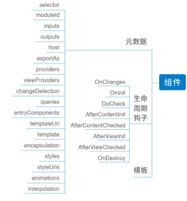

  **在Angular2中,"一切都是组件"** 

  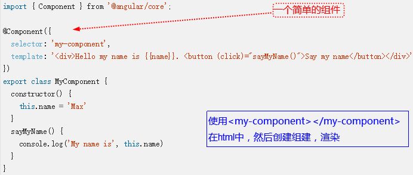

 **Input  动态传输数据**

 ** @Input 给组件定义一个input**
  
   e.g 例如 <user-profile> 组件,需要user参数来渲染
 
   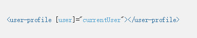

   so，我们添加一个 @Input 绑定 user

   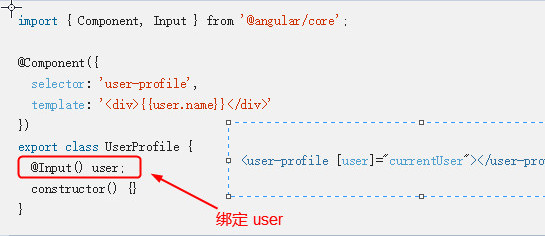

 **Output**
   **如果想绑定特定的事件，可以用在Angular2中使用Event syntax 自定义事件。**
   **我们可以使用 @Output装饰器， 创建一个自定义事件，**
  
   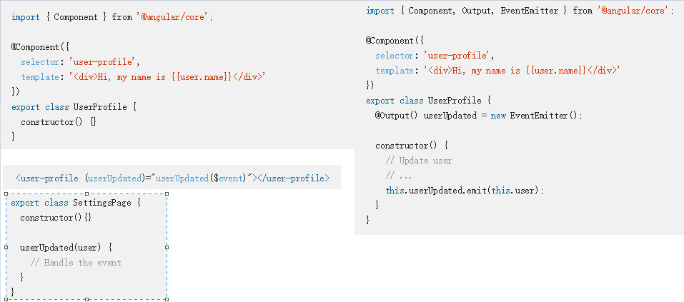

#### app 的生命周期

  **bootstrap**

   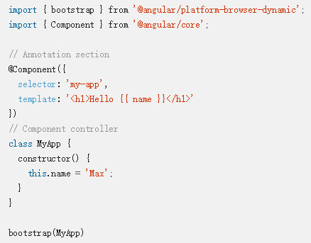

  **初始化组件 -- 使用 ngOnInit**

   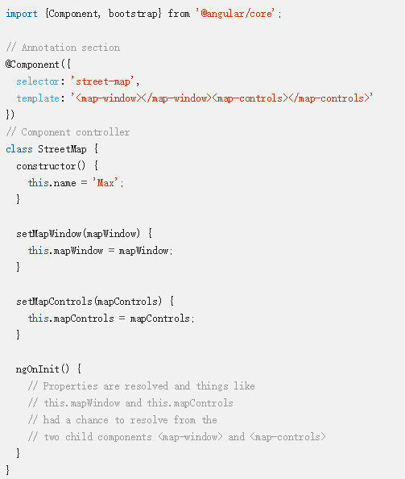

**组件的生命周期**

````
	// Annotation section
	@Component({
	  selector: 'street-map',
	  template: '<map-window></map-window><map-controls></map-controls>',
	})
	// Component controller
	class StreetMap {
	  ngOnInit() {
	    // Properties are resolved and things like
	    // this.mapWindow and this.mapControls
	    // had a chance to resolve from the
	    // two child components <map-window> and <map-controls>
	  }
	  ngOnDestroy() {
	    // Speak now or forever hold your peace
	  }
	  ngDoCheck() {
	    // Custom change detection
	  }
	  ngOnChanges(changes) {
	    // Called right after our bindings have been checked but only
	    // if one of our bindings has changed.
	    //
	    // changes is an object of the format:
	    // {
	    //   'prop': PropertyUpdate
	    // }
	  }
	  ngAfterContentInit() {
	    // Component content has been initialized
	  }
	  ngAfterContentChecked() {
	    // Component content has been Checked
	  }
	  ngAfterViewInit() {
	    // Component views are initialized
	  }
	  ngAfterViewChecked() {
	    // Component views have been checked
	  }
	}
````

#### 【组件样式】 

- 原生（native）


- 仿真（Emulated）

- 无（none）

#### 组件与指令 

组件与指令、模板、数据绑定与事件绑定、组件间通讯、生命周期、动效、服务、管道

【组件】

- TS代码
- 模板（事件绑定）观与动效
- 把服务注入给组件

【问题1：如何通信？】
	@Input与@Output、借助于Service

【ContentChild与ViewChild】

【生命周期钩子】

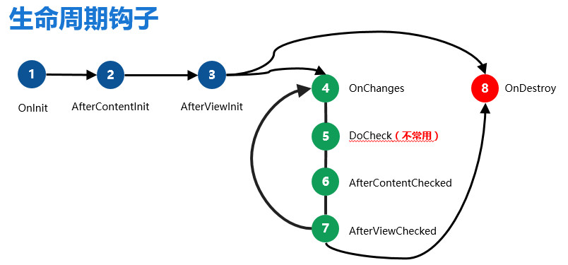

[https://angular.cn/docs/ts/latest/guide/lifecycle-hooks.html](https://angular.cn/docs/ts/latest/guide/lifecycle-hooks.html
)

####组件的生命周期

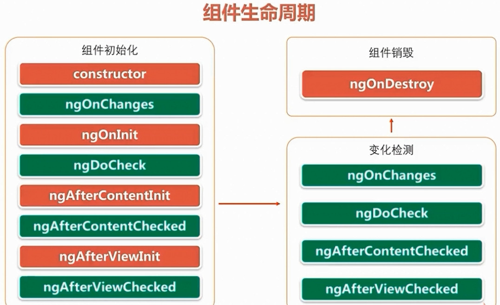

##<font color=orange> 模板 </font>

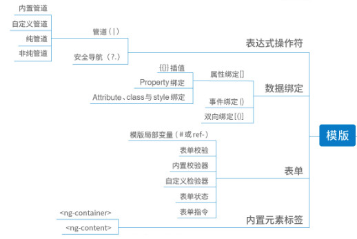

##### 双向绑定

##### 【管道】

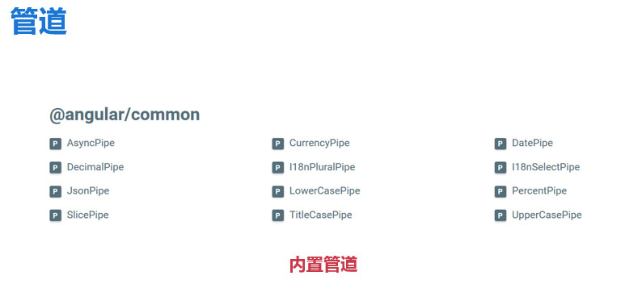

## <font color=orange> 路由 </font>

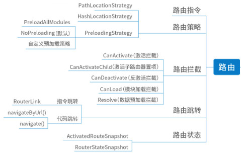

##### 路由与动态加载:基本用法、多层嵌套、动态加载模块、路由守卫

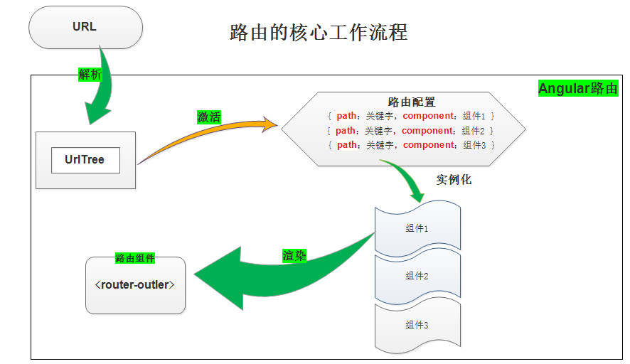

> 路由的内置对象
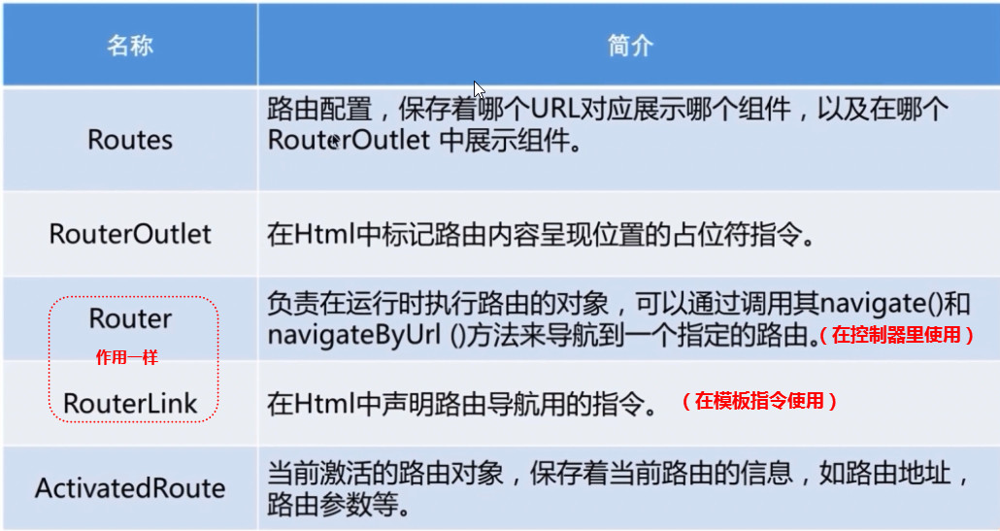

[注意:]

1、 `{path:''}`path里面不要具体用"/"开头

2、`routerLink`的value为什么是可以是数组，也可以是字符串？因为将 routerLink 的属性值，改成数组形式，以便我们传递特定的路由信息

3、 将 `<base>` 标签添加到我们的 `index.html` 文件中。路由需要根据这个来确定应用程序的根目录。

4、`RouterModule` 对象为我们提供了两个静态的方法：`forRoot()` 和 `forChild()` 来配置路由信息。

  **RouterModule.forRoot()** 方法用于在主模块中定义主要的路由信息，通过调用该方法使得我们的主模块可以访问路由模块中定义的所有指令。接下来我们来看一下如何使用 forRoot() ：
   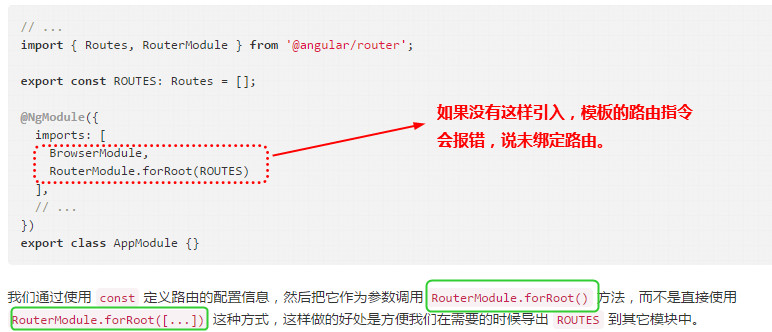

  **RouterModule.forChild()** RouterModule.forChild() 与 Router.forRoot() 方法类似，但它只能应用在特性模块中。友情提示：根模块中使用 forRoot()，子模块中使用 forChild().
   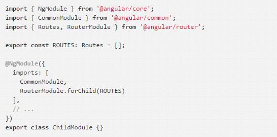

5、配置完路由，下一步就是使用`router-outler`指令告诉Angular在哪里加载组件

- 创建根路由模块

- 路由的策略
 - PathLocationStrategy
 - HashLocationStrategy

-路由跳转
 - 指令跳转（不重新加载应用），可以被运用在任何HTML元素上，使得页面跳转不需要依赖超链接
 - 使用代码跳转（Router.navigateByUrl 和Router.navigate）
 
- 路由参数
 - Path 参数
 - Query 参数
 - Matrix 参数

- 子路由

#### 使用Angular Route导航


| 名称        | 简介           | 
|:------------- |-------------:|
| Routes      | 路由配置，保存着哪个Url对应展示哪个组件，以及在哪个RouterOutlet中展示组件|
| RouterOutlet | 在Html中标记路由内容呈现位置的占位符指令    |
| Router | 负责在运行时执行路由的对象，可以通过调用其navigate()和navigateByUrl()方法来导航到一个指定的路由     |
| RouterLink | 在Html中声明路由导航用的指令  |
| ActivedRoute| 当前激活的路由对象，保存着当前路由的信息，如路由地址，路由参数等      |


在路由时传递数据

- 在查询参数中传递数据
 
	/product?id=1&name=2   => ActivedRoute.queryParams[id]
   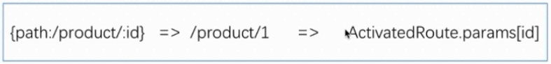

- 在路由路径中传递数据

	{path:/product/:id} => /product/1  => ActivedRoute.queryParams[id]
   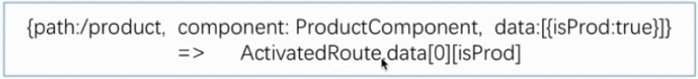

- 在路由配置中传递数据


子路由

辅助路由

路由守卫

	CanActivate：处理导航到某路由的情况
	CanDeactivate:处理从当前路由离开的情况
	Resolve：在路由激活之前获取路由数据
 
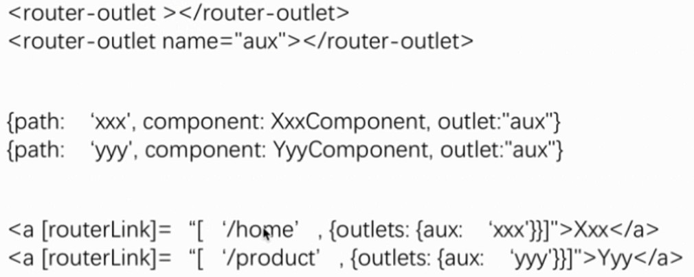

####  路由:创建 

创建配置路由定义，并用`RouterModule.forRoot`方法来配置路由器， 并把它的返回值添加到`AppModule`的`imports`数组中

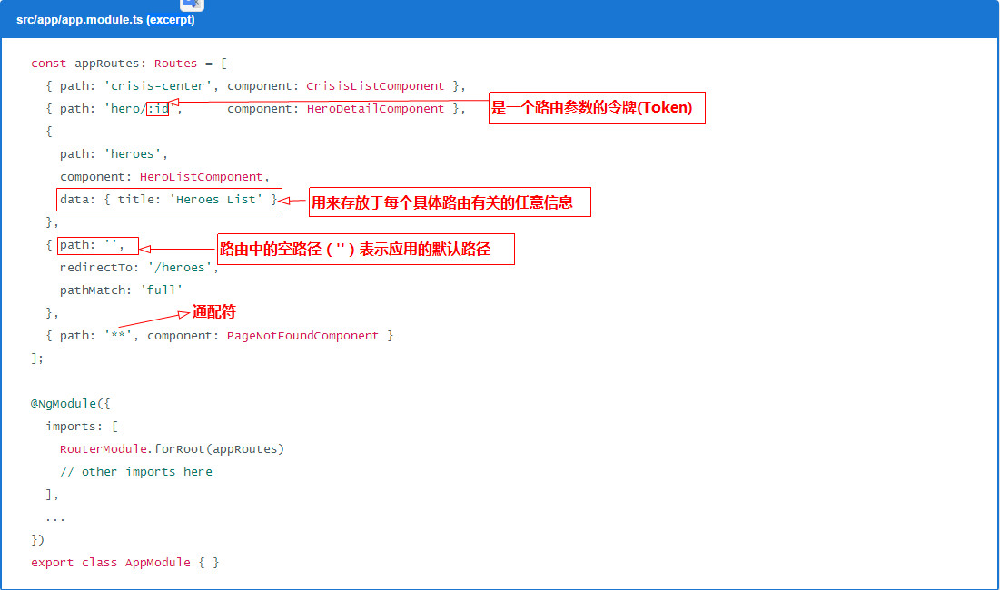


`RouterModule` 对象为我们提供了两个静态的方法：`forRout()` 和`forChild()`

- RouterModule.forRoot() 方法用于在主模块中定义主要的路由信息

- RouterModule.forChild() 与 Router.forRoot() 方法类似，但它只能应用在特性模块中。

友情提示：根模块中使用 `forRoot()`，子模块中使用 `forChild()`

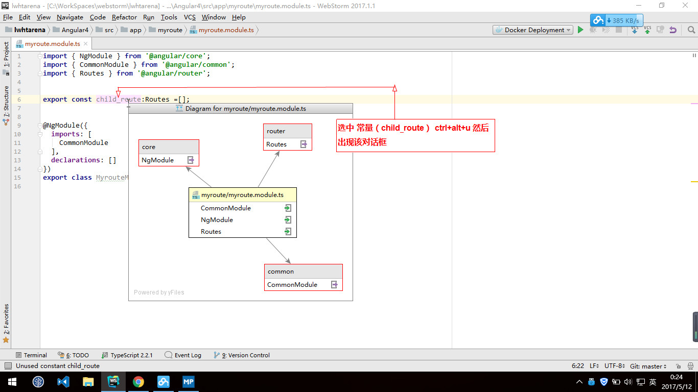

动态路由（Dynamic routes）

例如：

	import { HomeComponent } from './home/home.component';
	import { ProfileComponent } from './profile/profile.component';
	
	export const ROUTES: Routes = [
	  { path: '', component: HomeComponent },
	  { path: '/profile/:username', component: ProfileComponent }
	];

这里的关键点是 `:` ，它告诉 Angular 路由，:username 是路由参数，而不是 URL 中实际的部分。

友情提示：如果没有使用 `:` ，它将作为静态路由，仅匹配 `/profile/username`路径

如何获取路由参数？

 要访问当前路由的相关信息，我们需要先从 @angular/router 模块中导入 `ActivatedRoute` ，然后在组件类的构造函数中注入该对象，最后通过订阅该对象的 params 属性，来获取路由参数，具体示例如下：

	import { Component, OnInit } from '@angular/core';
	import { ActivatedRoute } from '@angular/router';
	
	@Component({
	  selector: 'profile-page',
	  template: `
	    <div class="profile">
	      <h3>{{ username }}</h3>
	    </div>
	  `
	})
	export class SettingsComponent implements OnInit {
	  username: string;
	  constructor(private route: ActivatedRoute) {}
	  ngOnInit() {
	    this.route.params.subscribe((params) => this.username = params.username);
	  }
	}

ps:每个路由都支持子路由，

Component-less routes

<font color=orange> 【小结：】 </font>
	
除了使用 navigate() 方法外还有没有其它方法可以实现页面导航？
	
	Angular Router API 为我们提供了 navigate() 和 navigateByUrl() 方法来实现页面导航。那为什么会有两个不同的方法呢？
	
	使用 router.navigateByUrl() 方法与直接改变地址栏上的 URL 地址一样，我们使用了一个新的 URL 地址。然而 router.navigate() 方法基于一系列输入参数，产生一个新的 URL 地址。为了更好的区分它们之间的差异，我们来看个例子，假设当前的 URL 地址是：
	
	/inbox/11/message/22(popup:compose)
	当我们调用 router.navigateByUrl('/inbox/33/message/44') 方法后，此时的 URL 地址将变成 /inbox/33/message/44 。但如果我们是调用 router.navigate('/inbox/33/message/44') 方法，当前的 URL 地址将变成 /inbox/33/message/44(popup:compose) 。

[路由插座]

## <font color=orange> 依赖注入 </font>
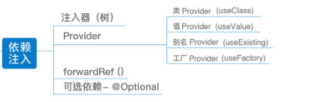

#### DI

- 每一个HTML标签上面都会有一个注射器实例

- 注射是通过constructor进行的  

- @Injectable是@Component的子类

#### 依赖注入

什么是依赖注入模式以及使用以来注入的好处

- 依赖注入要解决的问题  依赖注入 DI <=> 控制反转（IOC）
- 依赖注入模式的好处


#### 注入器和提供器

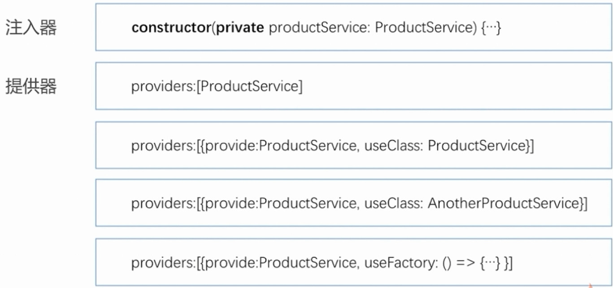


#### 注入器的层级关系（`服务之间如何相互之间注入`） 

创建一个服务 `ng g service shared/product`


1、提供器可以声明在模块中，也可以声明在组件中。

2、在angular中只有一种注入，那就是构造器注入。如发现无参构造器，这就说明这个组件没有被注入任何东西。

## <font color=orange> 服务 </font>
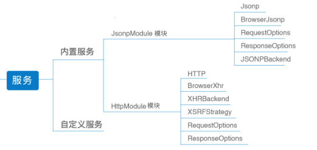

### <font size=3 face="黑体">与服务端通讯 `Observable与RxJS`</td></tr></table>

##### <font size=3 face="黑体">创建Web服务器</td></tr></table>

* 使用Nodejs创建服务器
  
  1、`npm init -y` 初始化     
  2、使用TypeScript开发，所以引入类型定义`npm i @types/node --save`   
  3、创建tsconfig.json			
 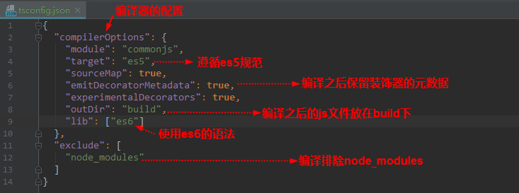
  4、`npm install express --save`
  5、`npm install @types/express --save`  
       
      启动服务`node build/auto_express.js`

  6、`npm install -g nodemon` 动态部署服务
     启动服务 `nodemon build/auto_express.js`

  ps:配置环境变量，我的是 `path：E:\nodejs\node_global`


* 使用Express创建restful的http服务器

* 监控服务器文件的变化

##### <font size=3 face="黑体">Http通讯</td></tr></table>

`ng serve --host 0.0.0.0 --port 4201` 修改服务的默认端口

使用代理，在package.json的同级目录下创建一个proxy.conf.json
```
{
  "/api":{
    "target":"http://localhost:8000"
  }
}

```
然后，修改`ng server --proxy-config proxy.conf.json`并执行即可。

##### <font size=3 face="黑体">WebSocket通讯</td></tr></table>

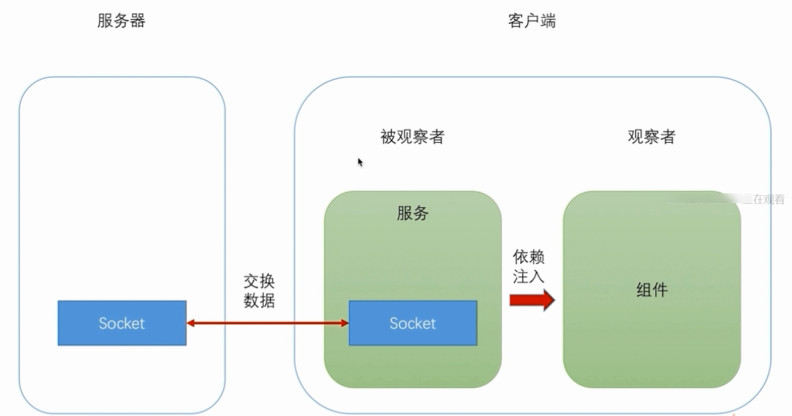

`npm install ws --save` 安装websocket的依赖库
`npm install @types/ws --save` 安装类型定义文件

注意：当你想使用依赖注入的时候，不要忘了在app.module.ts 的providers声明提供注入器，如添加`providers:[WebsocketService]`

##### <font size=3 face="黑体">引用HttpModule、JsonpModule</td></tr></table>

1、app.module.ts 注册 HTTP JSONP 服务

普通的http调用并不需要用到jsonpModule

`import { HttpModule, JsonpModule } from '@angular/http';`

2、HttpModule、JsonpModule 依赖注入

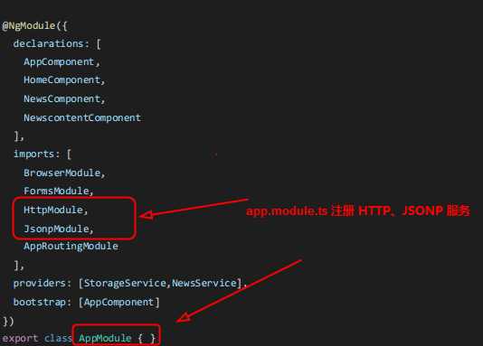

2.1 在需要请求数据的地方引入 Http

  `import {Http,Jsonp} from "@angular/http";`

2.2 构造函数内声明

  `constructor(private http:Http,private jsonp:Jsonp) { }`

2.3 对应的方法内使用 http 请求数据

 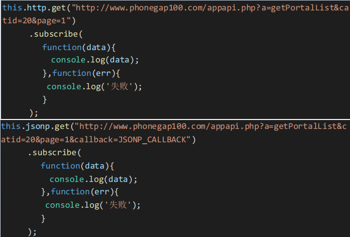

3、使用post

3.1 引入Headers、Http 模块

 `import {Http,Jsonp,Headers} from "@angular/http";`

3.2 实例化 Headers

 `private headers = new Headers({'Content-Type': 'application/json'});`

3.3 post 提交数据

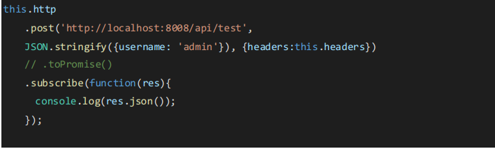


##<font color=orange> RxJS </font>

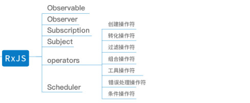

1、引入Http、jsonp、RxJS 模块

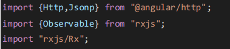

	你可能并不熟悉这种 import 'rxjs/Rx'语法，它缺少了花括号中的导入列表： {...}。
	这是因为我们并不需要操作符本身，这种情况下，我们所做的其实是导入这个库，加载并运行其中的脚本，
	它会把操作符添加到 Observable 类中。

2、构造函数内声明

`constructor(private http:Http,private jsonp:Jsonp) { }`

3、get请求

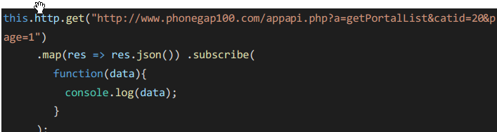

4、Json 请求

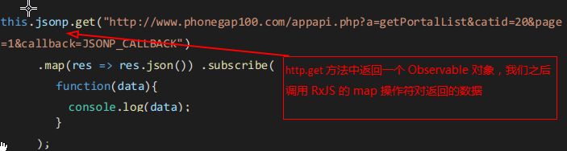


## <font color=orange> 装饰器 </font>
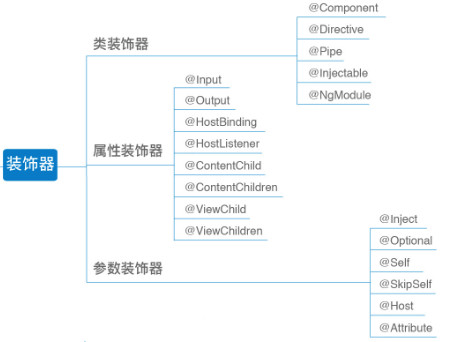

## <font color=orange> 动画 </font>
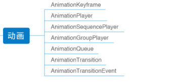

## <font color=orange> 变化检测 </font>
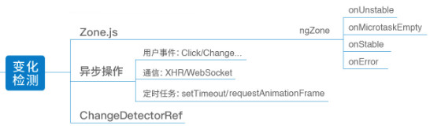

## <font color=orange> angular4 使用第三方的库（如：jquery、bootstrap）</font>

- 先安装本地库。先在项目目录下，如:`npm install jquery --save` 和`npm install bootstrap --save`.即是下载到 `node_modules`下

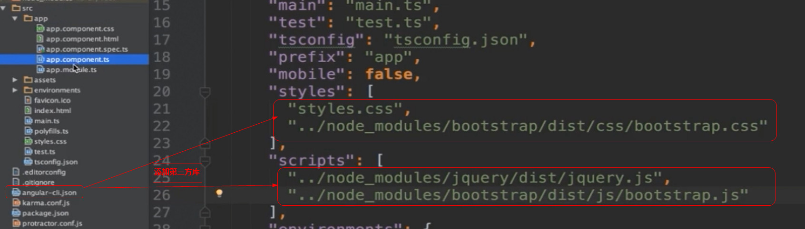

但是不能直接使用`"$"`,可以安装`npm install @types/jquery --save-dev`和`npm install @types/bootstarp --save-dev`，这样angular内部就可以识别第三方库。

## <font color=orange> 前端自动化测试 </font>

- 单元测试

- 集成测试


> Karma+Jasmine可以用于任意前端框架

   [中文视频和详细的语法解释](http://www.imooc.com/video/2638)

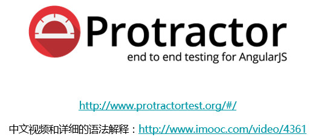
> Protractor是专门针对Angular设计的`http://www.protractortest.org/#/`

   [中文视频和详细的语法解释](http://www.imooc.com/video/4361)

> [阿里的f2etest](http://f2etest.com/)

下面主要讲Protractor：

    Protractor是一个建立在WebDriverJS基础上的端到端(E2E)的AngularJS JavaScript Web应用程序测试框架。Protractor全自动化真实的模拟用户在真正的浏览器中操作、运行并测试开发者的应用程序。

1、配置Protractor,通过Protractor Node.js模块：

  安装npm protractor`npm install -g protractor` 或`npm install -g protractor@canary` 或 `sudo npm install -g protractor@canary`


 (进入项目，然后输入`npm install -g protractor`,然后在该目录输入 `protractor --version` 检验是否可用。)

2、通过webdriver-manager安装测试驱动及服务器：

  webdriver-manager update

3、启动Selenium测试服务器
  
  在另一个命令行控制台启动Selenium测试服务器：`webdriver-manager start`；默认情况下，Selenium测试服务器接入地址为：http://localhost:4444/wd/hub

4、选用Mocha测试框架

  通过npm进行全局安装chai Node.js模块：`npm install -g mocha`

5、使用chai断言库

  通过npm进行全局安装mocha Node.js模块：`npm install -g chai-as-promised`

6、使用chai-as-promised异步代码增强插件

  通过npm进行全局安装mocha Node.js模块：`npm install -g chai-as-promised`

7、配置angular测试用例

		本位使用以下配置通过Chrome浏览器测试AngularJS应用程序：
		
		exports.config = {
		  // Selenium server 测试服务器接入地址
		  SeleniumAddress: 'http://localhost:4444/wd/hub',
		
		  // 告知测试服务器的配置信息
		  capabilities: {
		    // 告知需要测试的浏览器类型：可以是 chrome、safari等
		    'browserName': 'chrome'
		  },
		
		  // 需要运行的测试程序代码文件列表
		  specs: ['angularjs-e2e-spec.js'],
		
		  // 选择使用 Mocha 作为JavaScript语言的测试框架
		  framework: 'mocha'
		
		};
		将上述配置代码保存并命名为conf.js。


		编写AngularJS测试程序代码
		var chai = require('chai');
		var chaiAsPromised = require('chai-as-promised');
		
		chai.use(chaiAsPromised);
		var expect = chai.expect;
		
		describe('angularjs 首页', function() {
		  it('应该欢迎一个具名的用户', function() {
		    //要求浏览器访问网址http://www.angularjs.org
		    browser.get('http://www.angularjs.org');
		
		    //找到ng-model名为'youname'的HTML元素，要求浏览器键入名字
		    element(by.model('yourName')).sendKeys('tanshuai');
		
		    var greeting = element(by.binding('yourName'));
		
		     //取得结果并作断言测试
		    expect(greeting.getText()).to.eventually.equal('Hello tanshuai!');
		  });
		
		  describe('待办事项', function() {
		    var todoList;
		
		    beforeEach(function() {
		      browser.get('http://www.angularjs.org');
		
		      todoList = element.all(by.repeater('todo in todos'));
		    });
		
		    it('应该列出待办事项列表', function() {
		      expect(todoList.count()).to.eventually.equal(2);
		      expect(todoList.get(1).getText()).to.eventually.equal('build an angular app');
		    });
		
		    it('应该添加一个待办事项', function() {
		      var addTodo = element(by.model('todoText'));
		      var addButton = element(by.css('[value="add"]'));
		
		      addTodo.sendKeys('编写一个Protractor测试');
		      addButton.click();
		
		      expect(todoList.count()).toEqual(3);
		      expect(todoList.get(2).getText()).to.eventually.equal('编写一个Protractor测试');
		    });
		  });
		});
		将上述配置代码保存并命名为angularjs-e2e-spec.js。


8、运行Protractor测试

 运行指令：protractor conf.js

## <font color=orange> webpack </font>

[angular-starter](https://angularclass.github.io/angular-starter/)

<font size=3 color=red face="黑体">@angular/cli的底层集成了webpack，Angular项目组在此基础上做了自己的封装 </font>

## <font color=orange> 高阶内容 </font>

WebWorker、ServiceWorker、SEO与Universal、ionic、PWA

=======使用webstorm 编译angular2================

Angular 2 TypeScript Live Templates (Snippets) for WebStorm


`Type  angular  and install  Angular 2 TypeScript Templates `

> TypeScript Snippets


		ng2-component-root  // Angular 2 root App component
		ng2-bootstrap       // Angular 2 bootstraping, for main.ts
		ng2-component       // Angular 2 component
		ng2-pipe            // Angular 2 pipe
		ng2-routes          // Angular 2 @Routes
		ng2-route-path      // Angular 2 routing path
		ng2-service         // Angular 2 service
		ng2-subscribe       // Angular 2 observable subscription

> HTML Snippets

	

		ng2-ngClass
		ng2-ngFor
		ng2-ngIf
		ng2-ngModel
		ng2-routerLink
		ng2-ngStyle
		ng2-ngSwitch

## <font color=orange> 如何构建项目环境 </font>

```
	npm init  //这个不用解释了吧，初始化一个nodejs的包管理器,一路next 默认配置就好
	npm install @angular/core --save   //这个是必备的，从文件名也能看出来是核心模块
	npm install @angular/common --save  //这个是组件模块，上面也介绍了，angular是模块化的，模块里又包含组件，这个就是用来提供定义组件的模块
	npm install @angular/compiler --save  //编译器，angular组件使用的
	npm install @angular/router --save  //路由模块，提供给组件里使用的
	npm install @angular/platform-browser --save  //用于给浏览器提供渲染等一些服务的模块,这里是静态渲染AOT
	npm install @angular/platform-browser-dynamic --save //用于给浏览器提供渲染等一些服务的模块,这里是动态渲染JIT,不过它依赖与上面那个AOT模块
	npm install zone.js --save  //感觉像js的aop实现，angular/core中被引用
	npm install rxjs --save   //js观察者模式的实现，angular/core中被引用
	npm install systemjs --save  //SystemJS是一个通用的动态模块加载器,这里用来加载es6模块
	npm install core-js --save  //一个补丁包（polyfill）用来让不支持es6的浏览器支持es6， 其实就是把es6代码转为es5
	npm install typescript --save   //typescript编译器，用于把typescript转换为es6代码

上面就是angular的开发中几乎是必须要使用的工具了。可是你安装完后并不能直接着手开发，因为这些组件工作起来还得需要配置，主要需要配置的是typescript和system.js,暂时不解释下面配置项的含义，直接列出配置文件：

//filename: tsconfig.json
//typescript默认配置文件，在使用tsc命令编译*.ts文件时，将会自动使用运行命令目录下的tsconfig.json配置文件
{
  "compilerOptions": {
    "target": "es5",
    "module": "commonjs",
    "moduleResolution": "node",
    "sourceMap": true,
    "emitDecoratorMetadata": true,
    "experimentalDecorators": true,
    "lib": [ "es2015", "dom" ],
    "noImplicitAny": true,
    "suppressImplicitAnyIndexErrors": true
  }
}

//filename: system.config.js
//sytemjs的配置文件，配置systemjs加载时候的属性
System.config({
    paths: {
        'npm:':'/node_modules/',
        'dist:':'/dist/src/'
    },
    map : {
        '@angular/core': 'npm:@angular/core/bundles/core.umd.js',
        '@angular/common': 'npm:@angular/common/bundles/common.umd.js',
        '@angular/compiler': 'npm:@angular/compiler/bundles/compiler.umd.js',
        '@angular/platform-browser': 'npm:@angular/platform-browser/bundles/platform-browser.umd.js',
        '@angular/platform-browser-dynamic': 'npm:@angular/platform-browser-dynamic/bundles/platform-browser-dynamic.umd.js',
        '@angular/router': 'npm:@angular/router/bundles/router.umd.js',
        '@angular/router': 'npm:@angular/router/bundles/router.umd.js',
        'rxjs':'npm:rxjs'
    },
    packages: {
     'src': {
        defaultExtension: 'js'
     },
     'dist': {
        defaultExtension: 'js'
     },
     'node_modules': {
        defaultExtension: 'js'
     }
    }
});

配置文件已经被我们搞定了，终于可以开始编码了。 首先我们得添加主页文件，文件代码如下： index.html，主页中应该要引入corejs, zonejs, systemjs, system.config.js

<!-- filename: index.html -->
<!DOCTYPE html>
<html>
<head>
    <base href="/" />
    <title>learnAngular</title>
</head>
<body>
    <hello-world></hello-world>
<hello-world></hello-world>
</body>
    <script src="node_modules/core-js/client/shim.min.js"></script>

    <script src="node_modules/zone.js/dist/zone.js"></script>
    <script src="node_modules/systemjs/dist/system.src.js"></script>

    <script src="system.config.js"></script>
    <script>
      System.import('dist/bootstrap.js').catch(function(err){ console.error(err); });
    </script>
</html>

个页面除了引用框架包外还引入了两个文件，第一个是system.config.js，这是systemjs的配置文件。 第二个是了bootstrap.js，而目前这个文件还不存在，所以我们得添加这个js。不过别忘了我们开发语言是typescript而不是jsvascrip 所以这里添加的应该是bootstrap.ts， 编译后才会是bootstrap.js

//filename: bootstrap.ts
//这里是通过system.config.js中的map中定义的@angular/platform-browser-dynamic的值是@angular/platform-browser-dynamic/bundles/platform-browser-dynamic.umd.js
import { platformBrowserDynamic } from '@angular/platform-browser-dynamic';
//这里可以看到这个dist:这个东西是在system.config.js中paths里面定义的,结合定义的组合起来就是/dist/main.module,再加上我们在packages中定义了在dist文件夹下默认后缀为.js所以就找到文件了
import { MainModule } from 'dist:main.module';

platformBrowserDynamic().bootstrapModule(MainModule);

这个文件是用来启动angular主模块的。 源码中可以看到bootstrap.ts中引入了其他的JS，但是我们页面中也没加载。那么引入的js是怎么自动加载的呢？就是通过systemjs这个模块加载器去加载啦。

我们在根目录下创建一个src目录，用来保存我们开发的源码 先添加bootstrap中的主模块,（再说一遍angular是基于模块的哟）

//filename: main.module.ts
import { NgModule }      from '@angular/core';
import { BrowserModule } from '@angular/platform-browser';
import { AppComponent } from 'dist:app.component';

@NgModule({
  //主模块需要依赖的模块列表
  imports:      [ BrowserModule ],
  //主模块需要使用的component, angular中组件和模块就是在这里进行关联的
  declarations: [ AppComponent ],
  exports:      [ AppComponent ],
  //主模块启动后第一个启动的组件
  bootstrap:    [ AppComponent ]
})
export class MainModule { }

主模块写完了，可以看到主模块中在declarations配置项中引用了AppComponent
最后再添加AppComponent组件，在angular中，具体的业务逻辑是写在组件中的

//filename: app.component.ts
import { Component } from '@angular/core';
//定义了一个组件,在主页的body中使用<hello-world></hello-world>进行访问
@Component({
  selector: 'hello-world',
  template: `<h1>Hello {{name}}</h1>`
})
export class AppComponent { name = 'Angular'; }

```

## <font color=orange> 使用angular-cli 搭建开发环境 </font>

如果您使用Angular CLI beta.28或更低版本，则需要卸载angular-cli软件包。应该由于将包装的名称`angular-cli`变化到`@angular/cli`

**卸載angular-cli**


	npm uninstall -g angular-cli
	npm uninstall --save-dev angular-cli

要将Angular CLI更新为新版本，必须更新全局包和项目的本地包。

**Global package:**

	npm uninstall -g @angular/cli
	npm cache clean
	npm install -g @angular/cli@latest

**Local project package:**

	rm -rf node_modules dist //# use rmdir /S/Q node_modules dist in Windows Command Prompt; use rm -r -fo node_modules,dist in Windows PowerShell
	npm install --save-dev @angular/cli@latest
	npm install

**ng server --watch**
**ng server --live-reload**
**npm install sass-loader node-sass webpack --save-dev**

```
--watch (Boolean) (Default: true) Rebuild on change.
  aliases: -w, --watch

--live-reload (Boolean) (Default: true) Whether to reload the page on change, using live-reload.//是否重新加载页面的更改，使用实时重新加载。
    aliases: -lr, --liveReload
```

**ng serve --host 0.0.0.0 --port 4201**修改测试端口

**ng new 新项目（My_New_Project） --style=sass** 将在该项目中默认使用sass语法，然后手动安装`npm install node-sass --save-dev`

如果中途想切换为sass的angular-cli工程，可以修改`.angular-cli.json配置文件`
 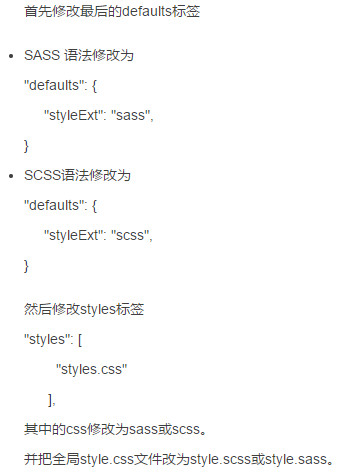

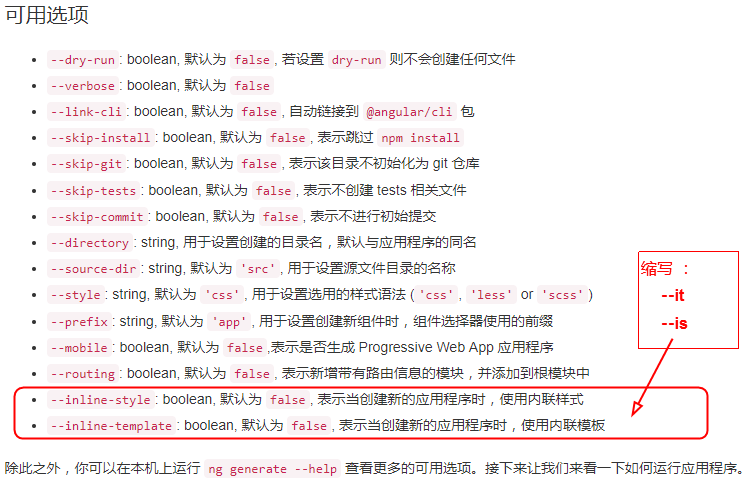


<font size=3 face="黑体" color=red>angular2 - bootstrap-sass compilation error using angular-cli</font> 解决方案

		$icon-font-path: '~bootstrap-sass/assets/fonts/bootstrap/';
		// Import bootstrap
		@import "node_modules/bootstrap-sass/assets/stylesheets/bootstrap";


```
在Linux/Mac上：

npm install

@angular/{common,compiler,compiler-cli,core,forms,http,platform-browser,platform-browser-dynamic,platform-

server,router,animations}@latest typescript@latest --save

在Windows上：

npm install @angular/common@latest @angular/compiler@latest

@angular/compiler-cli@latest @angular/core@latest @angular/forms@latest

@angular/http@latest @angular/platform-browser@latest

@angular/platform-browser-dynamic@latest @angular/platform-server@latest

@angular/router@latest @angular/animations@latest typescript@latest

--save
```

	> npm install -g @angular/cli
	> ng --version
	> ng -help
	> ng new PROJECT_NAME
	> cd PROJECT_NAME
	> ng serve
	
`npm info angular2 (npm 列出所有可以用的版本的命令)`

`ng g c recipe-book --flat (创建模块，但不创建文件夹)`

`ng g c 文件组建名 ----> 创建一个组件【g代表generate c代表component】`


`ng g c quote --spec false `不生成spec文件

`ng g c property-binding --flat -it -is 【创建component组件】 ng generate component （xxx） --flat -inline-template -inlines-style`

ps: `npm install -g @compodoc/ngd-cli` 组件生成器

`ng g module Login --flat -it` 创建模块，不创建目录和其他文件

`ng g module index -is` 创建模块，也创建目录，但不产生其他的文件


`npm install webpack-dev-server --save-dev`  
&emsp;&emsp;webpack是通过webpack-dev-server(WDS)来实现自动刷新。WDS是一个运行在内存中的开发服务器(一个express)。启动之后，它会检测文件是否发生改变并再自动编译一次。
然后，配置如下

<font size=3 face="黑体" color=blue>为了使用sass，我们需要安装sass的依赖包:</font>
  `npm install --save-dev sass-loader` //在项目下，运行下列命令行
  `npm install --save-dev node-sass`  //因为sass-loader依赖于node-sass，所以还要安装node-sass

[组件生成器 https://github.com/compodoc/ngd](https://github.com/compodoc/ngd)

`$ ngd -p ./tsconfig.json` 生成组件树

为什么需要NgModule呢？ [https://angular.cn/docs/ts/latest/cookbook/ngmodule-faq.html](https://angular.cn/docs/ts/latest/cookbook/ngmodule-faq.html)

常用命令：Angular-CLI

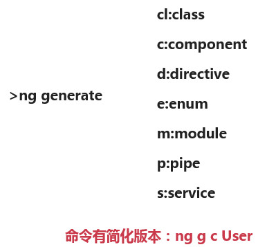

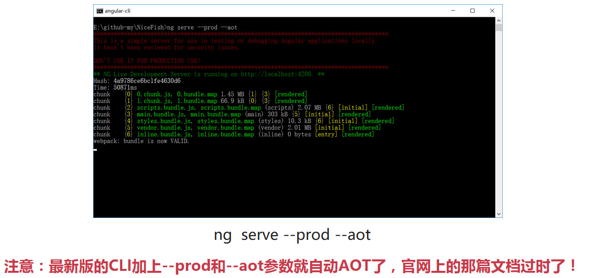


================================================================================

<font color=orange> 【总结：】 </font>

1、 注意：不要在 imports 数组中加入 NgModule 类型之外的类。

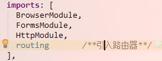

2、如果有两个同名指令都叫做` HighlightDirective`，我们只要在 import 时使用 as 关键字来为第二个指令创建个别名就可以了。

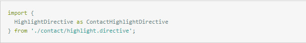

3、declarations 数组，注意：不要在 declarations 添加`组件`、`指令`和`管道`以外的其他类型。

 <span style="color:red;">你必须在一个 `NgModule` 类声明每一个组件，否则浏览器控制台会报错。<span>

	不要把 NgModel（或 FORMS_DIRECTIVES）加到 AppModule 元数据的 declarations 数据中！这些指令属于 FormsModule。
	组件、指令和管道只能属于一个模块。
	永远不要再次声明属于其它模块的类。

4、特性模块 是带有@NgModule装饰器及其元数据的类，就像根模块一样。 特性模块的元数据和根模块的元数据的属性是一样的。

5、模块 Angular 模块是一个带有` @NgModule` 装饰器的类。

NgModule 是一个装饰器函数，它接收一个用来描述模块属性的元数据对象。其中最重要的属性是：

 declarations： 声明本模块中拥有的视图类。Angular 有三种视图类：组件、指令和管道。

 exports:declarations 的子集，可用于其它模块的组件模板。

 imports:本模块声明的组件模板需要的类所在的其它模块。

 providers:服务的创建者，并加入到全局服务列表中，可用于应用任何部分。

 bootstrap:指定应用的主视图（称为根组件），它是所有其它视图的宿主。只有根模块才能设置 bootstrap 属性。

6、根模块不需要导出任何东西，因为其它组件不需要导入根模块。（export 并非必须。）

7、数据绑定的四种形式：

 * 插值表达式 `<li>{{hero.name}}</li>`
 * 属性绑定 `<hero-detail [hero]="selectedHero"></hero-detail>`
 * 事件绑定 `<li (click)="selectHero(hero)"></li>`
 * 双向数据绑定 `<input [(ngModel)]="hero.name">`


	  插入字符串
	  ` {{property_resolving_to_string}} `
	 
	  属性绑定
	  `  `
	
	  事件绑定
	   ` <button (click)=”onClick()”/>`
	
	 双向绑定
	   ` <input type=”text” [(ngModel)]=”myModel.name”> `

8、模块之间通信

 * 父模块 -> 子模块，使用@Input()
 * 父模块 <- 子模块，使用@Output

9、构建开发环境的目录结构

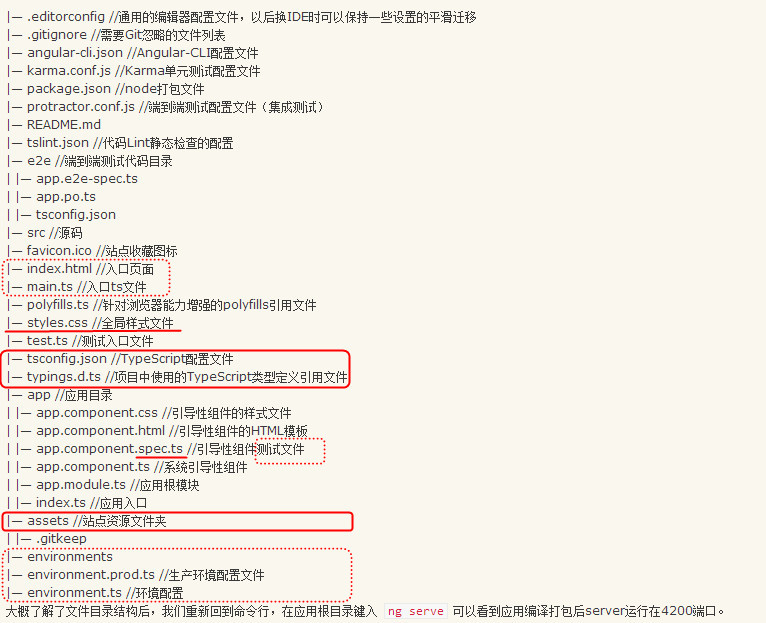

10、使用 angular-cli 快速构建项目环境

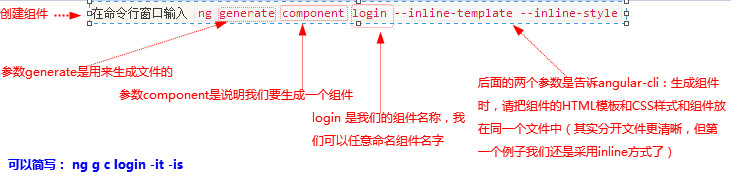

	Angular提倡的文件命名方式是这样的： 组件名称.component.ts ;
	组件的HTML模板命名为： 组件名称.component.html; 
	组件的样式文件命名为： 组件名称.component.css;
	大家在编码中尽量遵循Google的官方建议。

11、 使用npm更新

> npm 更新至最新版本 <font size=3 face="黑体" color=red>` npm install npm@latest -g `</font>

 可以更新npm至最新版本。
其中 @ 符号后面可以添加你想更新到的版本号。

> typescript升级之最新版本


1、 对单个包升级 `npm update <name>`

2、 升级全局本地包
 使用shell脚本升级npm包，首先所在找到需要升级的包和版本号，再使用<font size=3 face="黑体" color=red>`npm install`</font>完成升级。
<font size=3 face="黑体" color=red>`npm -`g</font>是管理本地全局包的命令。通过<font size=3 face="黑体" color=red>`npm -g outdated`</font>可以查看那些包有更新：

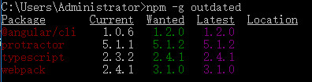

这里列出来了，当前版本，和最后的版本，只需要得到所有需要升级的包名和版本号就可以使用<font size=3 face="黑体" color=red>npm -g install <name></font>直接升级了。
<font size=3 face="黑体" color=red>npm -g outdated</font>还可以使用目录的方式展示，再从中提取出包名和版本号。
```
npm -g outdated --parseable --depth=0
/usr/local/lib/node_modules/appium:appium@1.5.3:appium@1.5.2:appium@1.5.3
...
在通过cut命令就可以得到最后要升级版本号和包名：

npm -g outdated --parseable --depth=0 | cut -d: -f2
appium@1.5.3
.....
```

完整的脚本：

	#!/bin/sh
	set -e
	#set -x
	for package in $(npm -g outdated --parseable --depth=0 | cut -d: -f2)
	do
	    npm -g install "$package"
	done

脚本下载地址：https://github.com/jjz/script/blob/master/npm-upgrade.sh


### 一张图告诉你angular2所有知识点


## 使用 Angular4 出现的异常列举

<font size=3 color=red>1、Can’t bind to ‘routerLink’ since it isn’t a known property of 'a' 或 ng2-Can't bind to 'routerLink' </font>

[解答：]

 解决办法： 检查是否没有 import RouterModule
 `import { RouterModule } from '@angular/router';`
