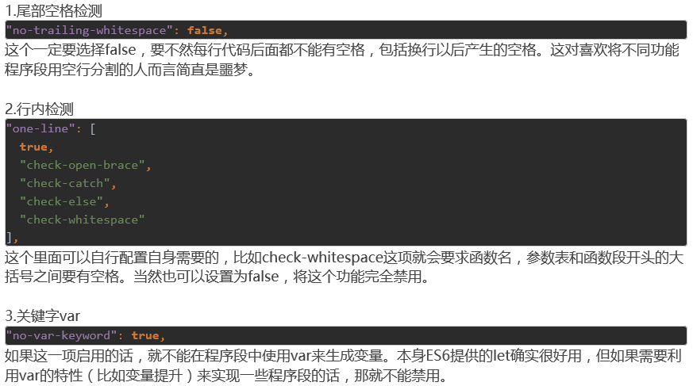
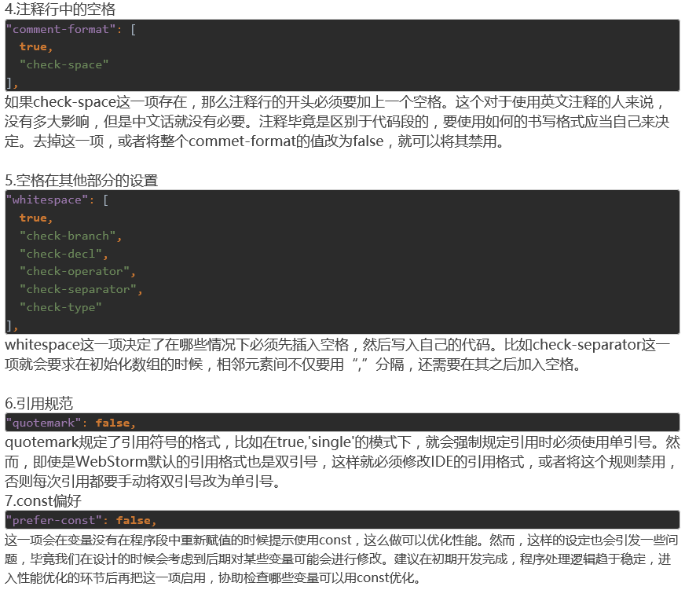
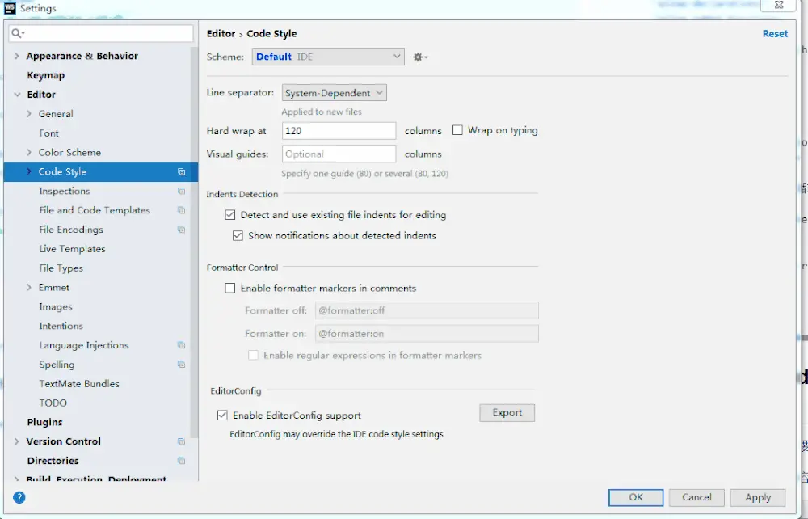
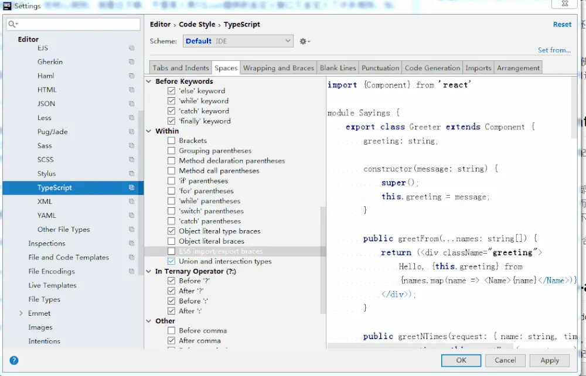
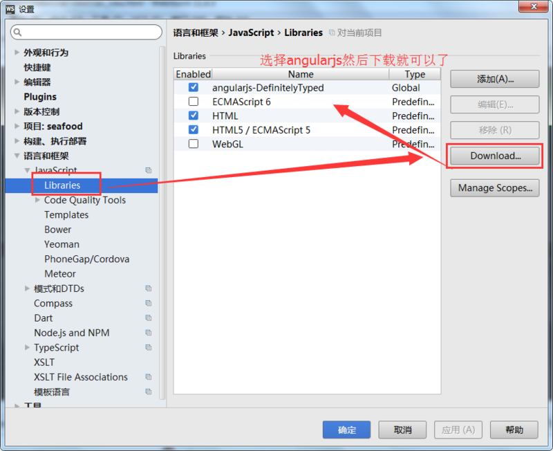

# Angular5 学习

### 升级node版本

1、检测安装node的路径，使用命令： `where node`

2、清除npm cache：`npm cache clean -f`

3、安装n模块：`npm install -g n` 或 `npm install -g n --force`

4、升级npm ：`npm install npm@latest -g`

5、使用https://www.npmjs.com/package/nrm 做切换,查看配置 `npm config list`

```
$ npm install -g npm

$ nrm ls
 
      * npm -----  https://registry.npmjs.org/
        cnpm ----  http://r.cnpmjs.org/
        taobao --  https://registry.npm.taobao.org/
        nj ------  https://registry.nodejitsu.com/
        rednpm -- http://registry.mirror.cqupt.edu.cn
        skimdb -- https://skimdb.npmjs.com/registry

$ nrm use cnpm  //switch registry to cnpm 
    Registry has been set to: http://r.cnpmjs.org/
```

6、删除配置
```
npm config delete registry
npm config delete disturl

或者 

npm config edit 
找到淘宝那两行,删除
```

## 开发中常用命令

npm + ng

```bash
npm i --save 包名：软件依赖 
npm i --save-dev 包名：开发依赖

ng new 项目名：新建Angular项目

ng build -prod：生产环境编译
ng serve：启动开发服务器

```

### 如何用 npm 同时执行两条监听命令？

需要安装 concurrently:<font color=red size=3> `npm install -g concurrently`</font>

如下图修改package.json的 scripts:


## Mock Rest API

<font size=4 color=#449D44>json-server快速“伪造”后台接口:</font>

json-server：用于快速搭建REST API的利器

安装：`npm install -g json-server`


## 几种常见的API测试工具

使用Postman测试常用的API

使用VSCode的REST Client插件

## 常见问题解决

安装@angular/cli 出现错误

解决方案：
```
先卸载删除掉原来的安装，清除缓存，在进行重新的安装
npm uninstall -g @angular/cli
npm cache clean
npm install -g @angular/cli

```

## 处理 TypeScript的书写规范（TSLint）配置修改

新版Angular中使用的Typescript书写规范非常恼人，比如默认会启用no-trailing-whitespace这样的选项。官方对此的说明是为了配合GIT的使用规范。



## tslint代码风格规则和ide默认的格式化代码风格存在冲突如何解决

这时候要么在tslint.json重新定义规则，要么修改ide配置，如：

1、webstorm设置import自动导入的内容为单引号



2、webstorm设置import自动导入大括号两边添加空格




## 实战采用Flex布局


## 支持svg：通过注入MatIconRegistry和DomSanitizer完成
[http://iconfont.cn/ 阿里矢量图标库](http://iconfont.cn/)

## webstorm 的angular插件不提示解决方案


默认自动生成格式：

```
import {AbstractControl} from '@angular/forms';
```

想要格式：

```
import { AbstractControl } from '@angular/forms';
```

3、其他配置自行百度

4、实际开发过程中可以先不启用TSLint，每次提交代码前或测试开发的代码时在启用并修复问题

TSLint注释标记
**ts文件中使用以下注释来临时忽略规则出现的错误，参考这里**
```
/* tslint:disable */——忽略该行以下所有代码出现的错误提示
/* tslint:enable */——当前ts文件重新启用tslint
// tslint:disable-line——忽略当前行代码出现的错误提示
// tslint:disable-next-line——忽略下一行代码出现的错误提示
```

**常用的tslint配置项**

```json
{
  // 禁止给类的构造函数的参数添加修饰符
  "no-parameter-properties": false,
  // 禁止使用 debugger
  "no-debugger": false,
  // 禁止行尾有空格
  "no-trailing-whitespace": false,
  // 禁止无用的表达式
  "no-unused-expression": true,
  // 定义过的变量必须使用
  "no-unused-variable": true,
  // 变量必须先定义后使用
  "no-use-before-declare": true,
  // 禁止使用 var
  "no-var-keyword": true,
  // 必须使用 === 或 !==，禁止使用 == 或 !=，与 null 比较时除外
  "triple-equals": true,
  // 指定类成员的排序规则
  "member-ordering": false,
  // 禁止将 this 赋值给其他变量，除非是解构赋值
  "no-this-assignment": [
    false,
    {
      "allowed-names": [
        "^self$",
        "^that$"
      ],
      "allow-destructuring": true
    }
  ],
  // 必须使用箭头函数，除非是单独的函数声明或是命名函数
  "only-arrow-functions": [
    true,
    "allow-declarations",
    "allow-named-functions"
  ],
  // 禁止出现空代码块，允许 catch 是空代码块
  "no-empty": [
    true,
    "allow-empty-catch"
  ],
  // 禁止无用的类型断言
  "no-unnecessary-type-assertion": true,
  // 使用 return; 而不是 return undefined;
  "return-undefined": true,
  // 禁止对 array 使用 for in 循环
  "no-for-in-array": true,
  "comment-format": [
    true,
    "check-space"
  ],
  // 单行注释格式化规则
  // 定义函数时如果用到了覆写，则必须将覆写的函数写到一起
  "adjacent-overload-signatures": true,
  // 禁止对函数的参数重新赋值
  "no-parameter-reassignment": true,
  // if 后面必须有 {，除非是单行 if
  "curly": [
    true,
    "ignore-same-line"
  ],
  // for in 内部必须有 hasOwnProperty
  "forin": true,
  // 禁止在分支条件判断中有赋值操作
  "no-conditional-assignment": true,
  // 禁止使用 new 来生成 String, Number 或 Boolean
  "no-construct": true,
  // 禁止 super 在一个构造函数中出现两次
  "no-duplicate-super": true,
  // 禁止在 switch 语句中出现重复测试表达式的 case
  "no-duplicate-switch-case": true,
  // 禁止出现重复的变量定义或函数参数名
  "no-duplicate-variable": [
    true,
    "check-parameters"
  ],
  // 禁止使用 eval
  "no-eval": true,
  // 禁止对对象字面量进行类型断言（断言成 any 是允许的）
  "no-object-literal-type-assertion": true,
  // 禁止没必要的 return await
  "no-return-await": true,
  // 禁止在数组中出现连续的逗号，如 let foo = [,,]
  "no-sparse-arrays": true,
  // 禁止 throw 字符串，必须 throw 一个 Error 对象
  "no-string-throw": true,
  // switch 的 case 必须 return 或 break
  "no-switch-case-fall-through": true,
  // 使用实例的方法时，必须 bind 到实例上
  "no-unbound-method": [
    true,
    "ignore-static"
  ],
  // 使用 { ...foo, bar: 1 } 代替 Object.assign({}, foo, { bar: 1 })
  // 前者的类型检查更完善
  "prefer-object-spread": true,
  // parseInt 必须传入第二个参数
  "radix": true,
  // 必须使用 isNaN(foo) 而不是 foo === NaN
  "use-isnan": true,
  //
  //
  // 可维护性
  // 这些规则可以增加代码的可维护性
  //
  // 禁止函数的循环复杂度超过 20，https://en.wikipedia.org/wiki/Cyclomatic_complexity
  "cyclomatic-complexity": [
    true,
    20
  ],
  // 禁止使用废弃（被标识了 @deprecated）的 API
  "deprecation": true,
  // 一个缩进必须用四个空格替代
  "indent": [
    true,
    "spaces",
    4
  ],
  // 禁止出现重复的 import
  "no-duplicate-imports": true,
  // 禁止一个文件中出现多个相同的 namespace
  "no-mergeable-namespace": true,
  // 文件类型必须时 utf-8
  "encoding": true,
  // import 语句中，关键字之间的间距必须是一个空格
  "import-spacing": true,
  // 接口可以 implement extend 和 merge
  "interface-over-type-literal": true,
  // new 后面只必须有一个空格
  "new-parens": true,
  // 类型断言必须使用 as Type，禁止使用 <Type>
  // <Type> 容易被理解为 jsx
  "no-angle-bracket-type-assertion": true,
  // 禁止连续超过三行空行
  "no-consecutive-blank-lines": [
    true,
    3
  ],
  // 禁止使用特殊空白符（比如全角空格）
  "no-irregular-whitespace": true,
  // 禁止使用 JSDoc，因为 TypeScirpt 已经包含了大部分功能
  "no-redundant-jsdoc": true,
  // 禁止使用三斜杠引入类型定义文件
  "no-reference-import": true,
  // 禁止变量定义时赋值为 undefined
  "no-unnecessary-initializer": true,
  // 小数必须以 0. 开头，禁止以 . 开头，并且不能以 0 结尾
  "number-literal-format": true,
  // 必须使用 a = {b} 而不是 a = {b: b}
  "object-literal-shorthand": true,
  // 变量申明必须每行一个，for 循环的初始条件中除外
  "one-variable-per-declaration": [
    true,
    "ignore-for-loop"
  ],
  // if 后的 { 禁止换行
  "one-line": true,
  // 必须使用单引号，jsx 中必须使用双引号
  "quotemark": [
    true,
    "single",
    "jsx-double",
    "avoid-template",
    "avoid-escape"
  ],
  // 行尾必须有分号
  "semicolon": [
    true,
    "always",
    "ignore-interfaces"
  ],
  // 函数名前必须有空格
  "space-before-function-paren": [
    true,
    "asyncArrow"
  ],
  // 括号内首尾禁止有空格
  "space-within-parens": [
    true,
    0
  ],
  // 禁止 finally 内出现 return, continue, break, throw 等
  // finally 会比 catch 先执行
  "no-unsafe-finally": true
}
```

**使用腾讯tslint-config-alloy轻松搞定ionic项目中TSLint配置**

TSLint核心规则及相关库
TSLint已经提供了一些核心规则，但是还不够，于是有人用TSLint提供的自定义接口又自定义了许多规则。如：
- tslint-eslint-rules——ionic项目默认使用这个
- codelyzer——angular项目默认使用这个
- 还有很多

腾讯团队开源项目tslint-config-alloy

现在有了大量校验规则，如何使用如何配置呢。我们使用了腾讯团队的开源项目tslint-config-alloy，它的配置原则：

- 能够帮助发现代码错误的规则，全部开启
- 配置不应该依赖于某个具体项目，而应尽可能的合理
- 帮助保持团队的代码风格统一，而不是限制开发体验


## 如何使用tslint-config-alloy

项目安装依赖：`npm install --save-dev tslint-eslint-rules tslint-config-alloy`

其中tslint-eslint-rules是规则的实现，它的规则已经继承了tslint，其中tslint-config-alloy是规则的配置，我们的配置继承这里的配置。


配置tslint.json内容如下

其中rulesDirectory指定规则的实现目录，可以配置多个，如你自定义的规则的目录；其中extends指定我们继承的配置，这里继承tslint-config-alloy，我们可以在rules中添加配置和覆盖tslint-config-alloy提供的配置。

```json
{
     "extends": "tslint-config-alloy",
     "rules": {
       "no-parameter-properties":false, // 禁止给类的构造函数的参数添加修饰符
       "triple-equals":false,
       "no-debugger": false,
       // 禁止行尾有空格
       "no-trailing-whitespace": false,
       "member-ordering":false,
       "no-this-assignment": [true, {"allowed-names": ["^self$","^that$"], "allow-destructuring": true}],
       // 必须使用箭头函数，除非是单独的函数声明或是命名函数
       "only-arrow-functions": [
         false,
         "allow-declarations",
         "allow-named-functions"
       ],
       // 禁止出现空代码块，允许 catch 是空代码块
       "no-empty": [
         false,
         "allow-empty-catch"
       ],
       // 禁止无用的类型断言
       "no-unnecessary-type-assertion": false,
       // 使用 return; 而不是 return undefined;
       "return-undefined": false,
       // 禁止对 array 使用 for in 循环
       "no-for-in-array": false,
       "comment-format": [true, "check-space"], // 单行注释格式化规则
     },
     "rulesDirectory": [
       "node_modules/tslint-eslint-rules/dist/rules"
     ]
   }
 
```


## 第三方JS类库的引入

> 标准的JS库引入方法，例如echart：`npm install --save-dev @types/echarts`

注意两件事，首先我们安装时使用了 `--save-dev `开关，因为这个类型定义文件只对开发时有用，它并不是我们工程的依赖，只是为了编写时的方便。

第二件事我们使用了 `@types/echarts` 这样一个有点怪的名称，其实是这样的，微软维护了一个海量的类型定义数据中心，这个就是 `@types`。那么我们为了寻找echarts就会在` @types `这个目录下搜索它的二级目录。

**引入库的特殊情况**

1) 使用` npm install --save-dev @types/xxx `,没有找到对应的类型定义文件，怎么办？

解决方案：

首先应该去检查一下node_modules目录中的你要使用的类库子目录（本例中是echarts）中是否有类型定义文件，因为有的类库会把类型定义文件直接打包在npm的包中。如果是这种情况，那么我们什么都不需要做，直接使用就好了。

2) 团队开发的（自定义的）类库，找不到怎么办？

解决方案：

在` src/typings.d.ts `中加上一行: <font color=red>`declare module 'echarts';`</font> 然后在要使用类库组件中引入：`import * as echarts from 'echarts';` 就可以正常使用了。（这种添加方式是没有智能提示和自动完成的，你需要自己保证调用的正确性。如果觉得不爽，还是希望有提示、类型检查等等，那就得自己写一个类型定义文件了，可以参考[https://basarat.gitbooks.io/typescript/content/docs/types/ambient/d.ts.html ](https://basarat.gitbooks.io/typescript/content/docs/types/ambient/d.ts.html )去编写自己的类型定义文件。）


