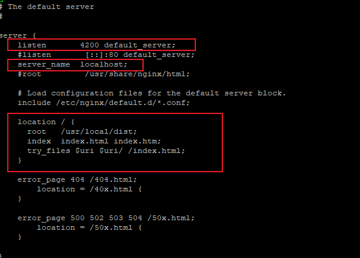

# 如何在Nginx上发布Angular，以及解决路由问题

修改件修改配置文件：{path}\conf\nginx.conf：（如：vi /etc/nginx/conf.d/default.conf）

 在http{……}内，添加：
 ```
 server {
        listen       8888;
        server_name  127.0.0.1 localhost;
 
        location / {
            root   X:/apps/path;
            index index.html;
            try_files $uri $uri/ /index.html;
        }
    }
 ```
 
其中：

`try_files $uri $uri/ /index.html;`

此行代码是用于解决路由问题。

如：我的环境


另外，如何是Windows系统，需要在防火墙处将Nginx程序设置为例外。

2、Nginx的基本管理

切记，不要双击Nginx.exe启动服务(window系统)

```
start nginx : 启动nginx
nginx -s reload  ：修改配置后重新加载生效
nginx -s reopen  ：重新打开日志文件
nginx -t -c /path/to/nginx.conf 测试nginx配置文件是否正确，也可以直接使用 nginx -t
 
关闭nginx：
nginx -s stop  :快速停止nginx
nginx -s quit  ：完整有序的停止nginx
```

nginx对路径依赖很高，在命令行中执行上述命令时，要切换到Nginx.exe同级目录下。
