# UML

<h2 id="0"></h2>

> **常用工具：Enterprise Architect、Visio、Rose 、PowerDesign、startUML、Astah**


> 在画类图的时候，理清类和类之间的关系是重点。类的关系有泛化(Generalization)、实现（Realization）、依赖(Dependency)和关联(Association)。其中关联又分为一般关联关系和聚合关系(Aggregation)，合成关系(Composition)。

+ [泛化(Generalization)](#1)

+ [实现（Realization）](#2)

+ [依赖(Dependency)](#3)

+ [关联(Association)](#4)
    + [一般关联关系](#4)
    + [聚合关系(Aggregation)](#5)
    + [合成|组合关系(Composition)](#6)


**类图作用：**

类图是软件工程的统一建模语言一种静态结构图，该图描述了系统的类集合，类的属性和类之间的关系。(**类图主要是用来显示系统中的类、接口以及它们之间的静态结构和关系的一种静态模型。**)

**结构说明**

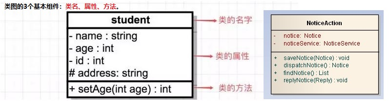

在UML类图中，类由三部分组成：

**类的名字 :** 这个应该不用多说，每个类都应该有一个名字

**类的属性：** 一般来说也就是类的成员变量，一个类可以有多个属性，也可以没有属性

**类的方法：** 一般来说也就是类的成员函数，一个类可以有多个方法，也可以没有方法

<font color=#449D44 size=4>属性或方法的可见性</font>

**`+` :**  表示public属性或者方法

**`-`：** 表示private属性或者方法

**`#`：** 表示protected属性或者方法

<font color=#449D44 size=3>UML中属性的完整表示方式如下：(其中括号中的内容是可选的)</font>

`可见性 名称:类型 [ = 缺省值 ]`

<font color=#449D44 size=3>UML中方法的完整表示方式如下：(其中括号中的内容是可选的)</font>

`可见性 名称(参数列表) [ : 返回类型]`

# 类之间的关系（6种） #


## 1、泛化(Generalization)关系   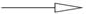
<h2 id="1"></h2> 


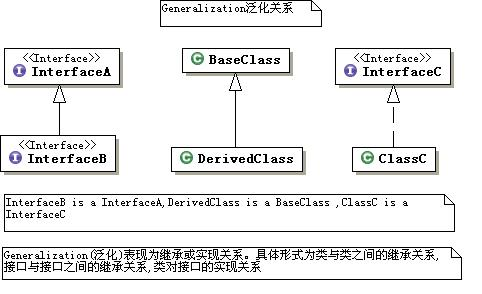

泛化(generalization)：表示is-a的关系，是对象之间耦合度最大的一种关系，子类继承父类的所有细节。直接使用语言中的继承表达。在类图中使用带三角箭头的实线表示，箭头从子类指向父类。


泛化关系也就是Java中的继承，类和类，接口和接口都可以是继承关系，父类又称作基类或超类，子类又称作派生类，类继承父类后可以实现父类的所以功能，并能拥有父类没有的功能。<font color=#449D44 size=3>在UML中，泛化关系可以用带空心三角形的直线来表示。</font>


## 2、实现（Realization)关系    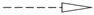

<h2 id="2"></h2> 

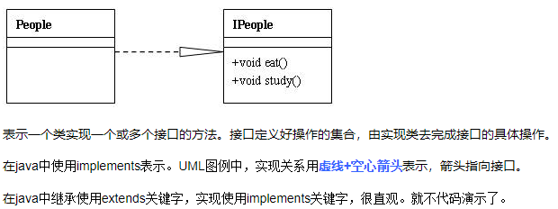

实现（Realization）:在类图中就是接口和实现的关系。这个没什么好讲的。在类图中使用带三角箭头的虚线表示，箭头从实现类指向接口。


实现关系在java中就是一个类和接口之间的关系，接口中一般是没有成员变量，所有操作都是抽象的（abstract修饰），只有声明没有具体的实现，具体实现需在实现该接口的类中。<font color=#449D44 size=3>在UML中实现接口用虚线和带空心的三角形表示</font>

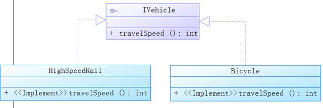


## 3、依赖(Dependence)关系      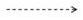
<h2 id="3"></h2> 

依赖关系的定义为：对于两个相对独立的对象，当一个对象负责构造另一个对象的实例，或者依赖另一个对象的服务时，这两个对象之间主要体现为依赖关系。

定义比较晦涩难懂，但在java中的表现还是比较直观的：

**类A当中使用了类B，其中类B是作为类A的方法参数、方法中的局部变量、或者静态方法调用。**

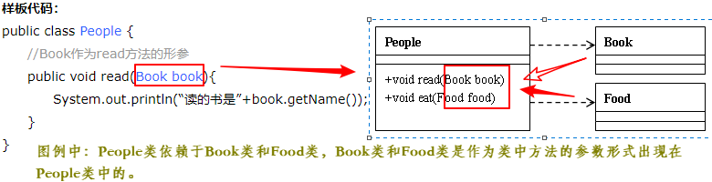

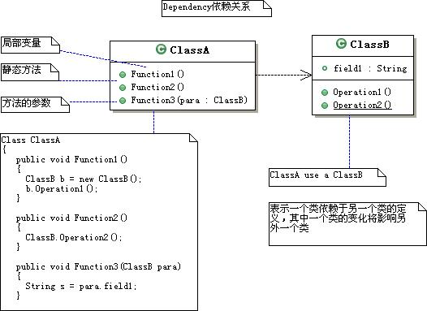

依赖(Dependency)：对象之间最弱的一种关联方式，是临时性的关联。代码中一般指由局部变量、函数参数、返回值建立的对于其他对象的调用关系。一个类调用被依赖类中的某些方法而得以完成这个类的一些职责。在类图使用带箭头的虚线表示，箭头从使用类指向被依赖的类。


依赖关系是类与类之间最弱的关系，依赖可以简单的理解一个类使用了另一个类，这种使用关系具有临时性特征，但是一个类又会由于另一个类的改变而受到影响。<font color=#449D44 size=3>在UML中一栏用带箭头的虚线表示依赖</font>，对应的UML类图如下

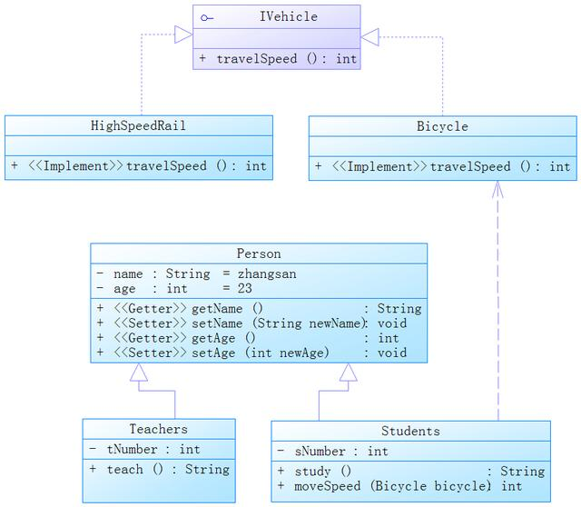


## 4、关联（Association）关系       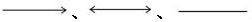
<h2 id="4"></h2> 

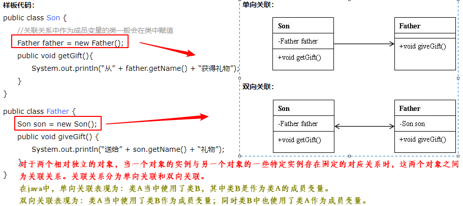

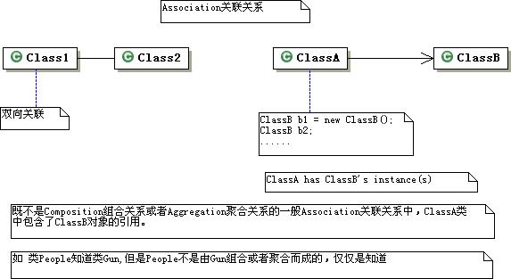

关联(Association) : 对象之间一种引用关系，比如客户类与订单类之间的关系。这种关系通常使用类的属性表达。关联又分为一般关联、聚合关联与组合关联。后两种在后面分析。在类图使用带箭头的实线表示，箭头从使用类指向被关联的类。可以是单向和双向。


关联关系表示一个类和另一类有联系。关联关系是一种包含关系，<font color=#449D44 size=3>在UML中用一个带箭头的实线表示，箭头指向被包含类</font>。在下图中你可能会发现在线上有1 ..1,这个是说明包含关系的。在UML类中有如下几种。

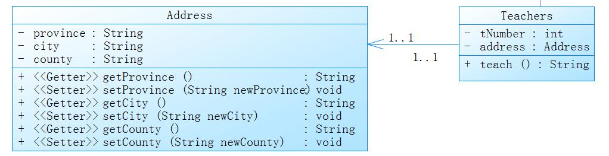

```
1..1表示另一个类的一个对象只与该类的一个对象有关系
0..*表示另一个类的一个对象与该类的零个或多个对象有关系
1..*表示另一个类的一个对象与该类的一个或多个对象有关系
0..1表示另一个类的一个对象没有或只与该类的一个对象有关系
*任意多个对象关联
```


## 5、聚合(Aggregation)关系   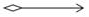
<h2 id="5"></h2> 

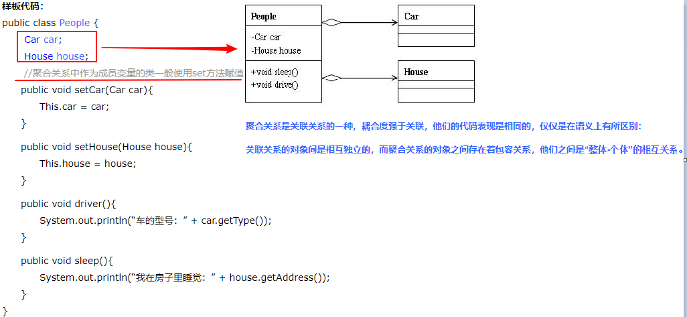


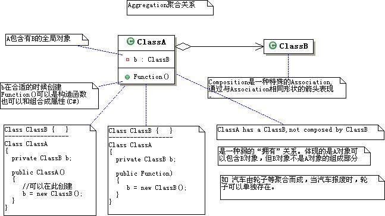

聚合(Aggregation) : 表示has-a的关系，是一种不稳定的包含关系。较强于一般关联,有整体与局部的关系,并且没有了整体,局部也可单独存在。如公司和员工的关系，公司包含员工，但如果公司倒闭，员工依然可以换公司。在类图使用空心的菱形表示，菱形从局部指向整体。


聚合关系是表示整体与部分的关系，但是部分可以脱离整体而存在。例如一个Teachers对象有一辆汽车Car，此时Car就是Teachers的一部分，但是Car可以脱离Teachers而存在。<font color=#449D44 size=3>在UML类中聚合关系用带空心菱形的直线表示。</font>

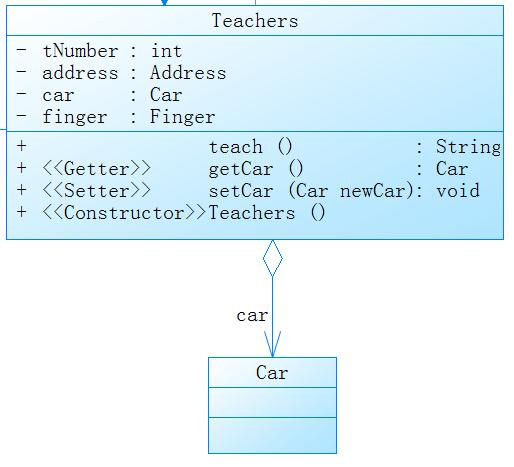


## 6、组合(Composition)关系       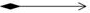
<h2 id="6"></h2> 

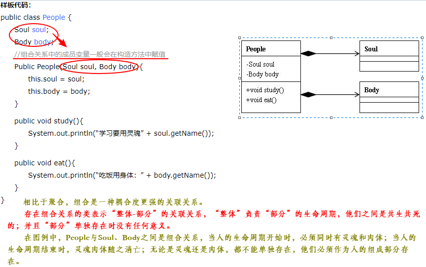


组合(Composition) : 表示contains-a的关系，是一种强烈的包含关系。组合类负责被组合类的生命周期。是一种更强的聚合关系。部分不能脱离整体存在。如公司和部门的关系，没有了公司，部门也不能存在了；调查问卷中问题和选项的关系；订单和订单选项的关系。在类图使用实心的菱形表示，菱形从局部指向整体。


组合关系也是一种部分和整体的关系，但是部分存活周期受到整体的影响，若整体不存在则部分也将不存在。此时部分需在整体的构造方法中创建。<font color=#449D44 size=3>在UML类中，组合关系用带实心菱形的直线表示。</font>

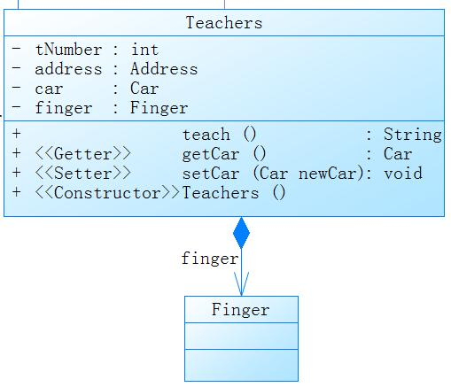

## 多重性(Multiplicity) 

多重性(Multiplicity) : 通常在关联、聚合、组合中使用。就是代表有多少个关联对象存在。使用数字..星号（数字）表示。如下图，一个割接通知可以关联0个到N个故障单。


**聚合和组合的区别:**

<font color=#DA5F61 size=3>**这两个比较难理解，重点说一下。聚合和组合的区别在于：聚合关系是“has-a”关系，组合关系是“contains-a”关系；聚合关系表示整体与部分的关系比较弱，而组合比较强；聚合关系中代表部分事物的对象与代表聚合事物的对象的生存期无关，一旦删除了聚合对象不一定就删除了代表部分事物的对象。组合中一旦删除了组合对象，同时也就删除了代表部分事物的对象。**</font>


> **总结：**

**类关系图**
1) 泛化（Generalization）    
2) 实现（Realization）      
3) 关联（Association)      
4) 聚合（Aggregation）      
5) 组合(Composition)          
6) 依赖(Dependency)       

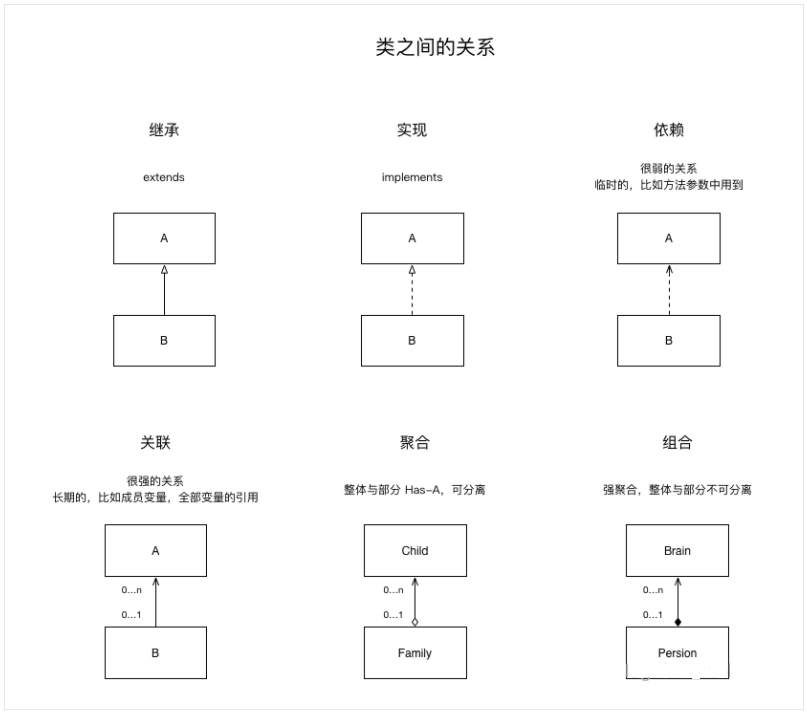

**各种关系的强弱**

泛化 = 实现 > 组合 > 聚合 > 关联 > 依赖

<font color=red size=5>如果要耦合程度低的话,建议使用依赖关系</font>

```
例如框架:在struts1中,我们自定义的Action还需要继承自框架中的Action,而在struts2中已经
不需要再继承任何类了,说明框架升级了,耦合程度也降低了,更加体现了sturts2的优势.
```

**实现方式区别：**

(1)    依赖关系：关系对象出现在局部变量或者方法的参数里，或者关系类的静态方法被调用

(2)    关联关系：关系对象出现在实例变量中

(3)    聚合关系:关系对象出现在实例变量中

(4)    合成关系：关系对象出现在实例变量中

(5)    Generalization: extends

(6)    实现： implements


> **实例分析**

联通客户响应OSS。系统有故障单、业务开通、资源核查、割接、业务重保、网络品质性能等功能模块。现在我们抽出部分需求做为例子讲解。

大家可以参照着类图，好好理解。


1． 通知分为一般通知、割接通知、重保通知。这个是继承关系。

2． NoticeService和实现类NoticeServiceImpl是实现关系。

3． NoticeServiceImpl通过save方法的参数引用Notice,是依赖关系。同时调用了BaseDao完成功能，也是依赖关系。

4． 割接通知和故障单之间通过中间类(通知电路)关联，是一般关联。

5． 重保通知和预案库间是聚合关系。因为预案库可以事先录入，和重保通知没有必然联系，可以独立存在。在系统中是手工从列表中选择。删除重保通知，不影响预案。

6． 割接通知和需求单之间是聚合关系。同理，需求单可以独立于割接通知存在。也就是说删除割接通知，不影响需求单。

7． 通知和回复是组合关系。因为回复不能独立于通知存在。也就是说删除通知，该条通知对应的回复也要级联删除。

PS：还是那句话：以上类图用Enterprise Architect 7.5所画，在此推荐一下EA,非常不错。可以替代Visio和Rose了。Visio功能不够强大，Rose太重。唯有EA比较合适。