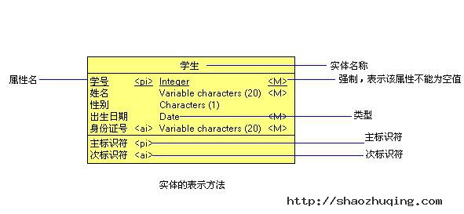
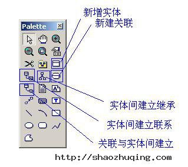
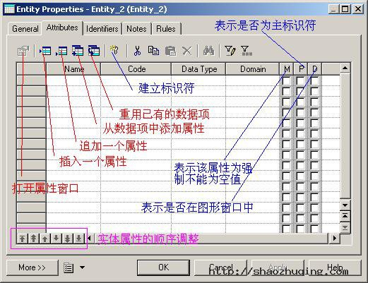
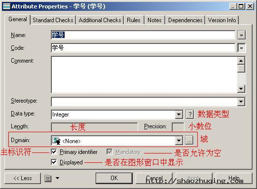
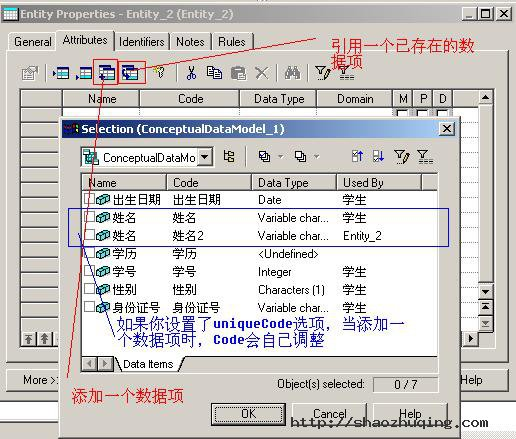
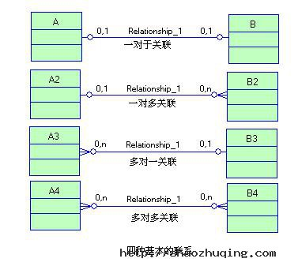
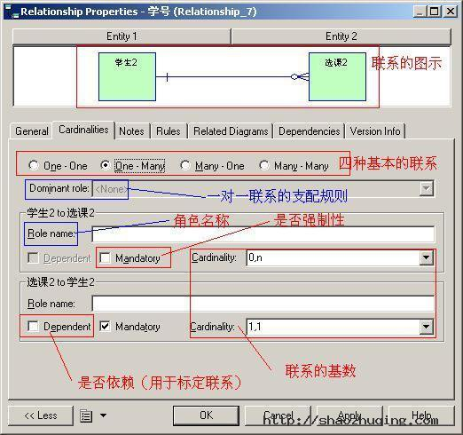
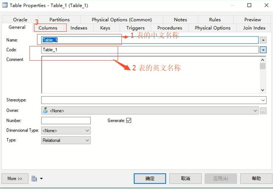

# PowerDesign

问题1： 不同的数据库存在表的相互转换存储
      
      例如：将oracle中的表在mysql中进行创建

问题2： 无法在数据库第三方的可视化界面中有效的查看表与表之间的关系以及表的结构信息

通常人们先将现实世界抽象为概念世界，然后再将概念世界转为机器世界。换句话说，就是先将现实世界中的客观对象抽象为实体(Entity)和联系 (Relationship),它并不依赖于具体的计算机系统或某个DBMS系统，这种模型就是我们所说的CDM;然后再将CDM转换为计算机上某个 DBMS所支持的数据模型，这样的模型就是物理数据模型,即PDM。

## CDM 概念数据模型(也称信息模型)

数据模型是现实世界中数据特征的抽象。数据模型应该满足三个方面的要求：

1) 能够比较真实地模拟现实世界
2) 容易为人所理解
3) 便于计算机实现

概念数据模型也称信息模型，它以实体－联系(Entity-RelationShip,简称E-R)理论为基础，并对这一理论进行了扩充。它从用户的观点出发对信息进行建模，主要用于数据库的概念级设计。

CDM是一组严格定义的模型元素的集合，这些模型元素精确地描述了系统的静态特性、动态特性以及完整性约束条件等，其中包括了数据结构、数据操作和完整性约束三部分。

1) 数据结构表达为实体和属性;
2) 数据操作表达为实体中的记录的插入、删除、修改、查询等操作;
3) 完整性约束表达为数据的自身完整性约束（如数据类型、检查、规则等）和数据间的参照完整性约束（如联系、继承联系等）;

**实体、属性、标志符**

+ 实体（Entity）：也称为实例，对应现实世界中可区别于其他对象的“事件”或“事物”。

## LDM 逻辑数据模型

## PDM 物理数据模型

常用操作：

Ctrl + F 查找对象

Ctrl + Shift + F 查找表

### 如何设计表之间的关联

1) 在工具箱中找到参照关系工具

在图形窗口中创建两个实体后，单击“实体间建立联系”工具，单击一个实体，在按下鼠标左键的同时把光标拖至别一个实体上并释放鼠标左键，这样就在两个实体间创建了联系，右键单击图形窗口，释放Relationship工具。如下图所示

**4种基本的联系**

即一对一（ONE TO ONE）联系、一对多（ONE TO MANY）联系、多对一（MANY TO ONE）联系和多对多联系（MANY TO MANY）。如图所示

**其他几类特殊联系**

除了4种基本的联系之外，实体集与实体集之间还存在标定联系[依赖联系]（Identify Relationship）、非标定联系[非依赖联系]（Non-Identify RelationShip）和递归联系（Recursive Relationship）。

## OOM 面向对象模型

## BPM 业务程序模型

## ILM 信息流模型

## EAM 企业架构模型

