# Astah 

**UML的九种建模图**
+ 用例图
+ 类图（开发人员常用）
+ 对象图（开发人员常用）
+ 顺序图（交互流程图、时序图、序列图）
+ 协作图
+ 状态图
+ 活动图
+ 组件图
+ 配置图

> 类图

类图是描述`类`、`接口`以及他们之间关系的图，它显示了系统中各个类的静态结构，是一种`静态模型`。

- 2种类元素
    - 类
    - 接口

- 4种关系
    - 依赖关系
    - 实现关系
    - 泛化关系
    - 关联关系

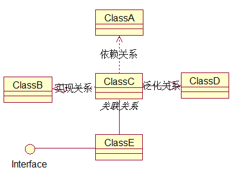

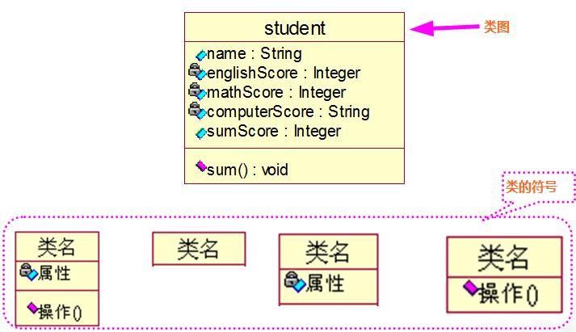

#### 类的Rose建模

1) 创建类图

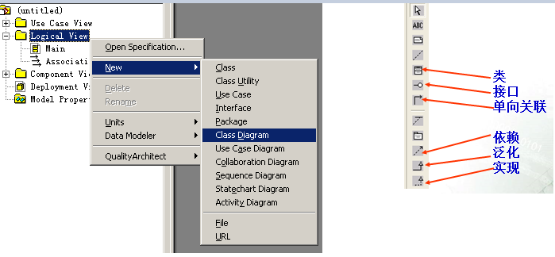

2) 添加类

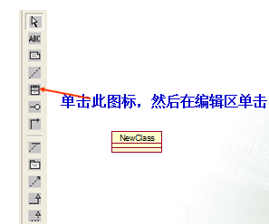

3) 修改类的名称、添加并设置属性
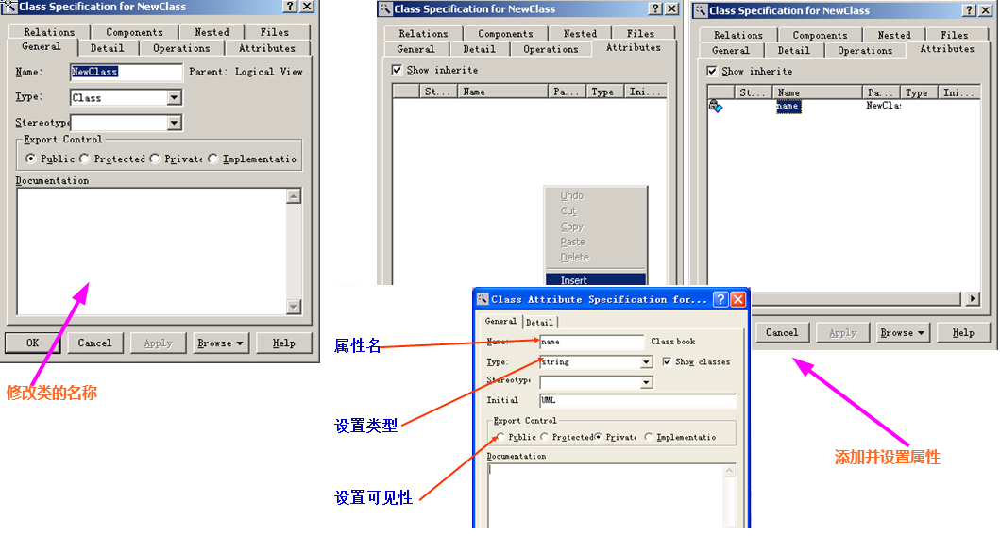

#### 关联关系（code/assocation）

**二元关联:** 两个类之间的关联成为二元关联。

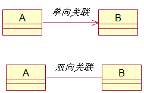

#### 关联的多重性(多重性是指有多少个对象参与了关联。具体的说，是指类A的一个对象对应类B的对象的个数。)

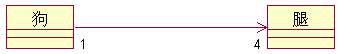

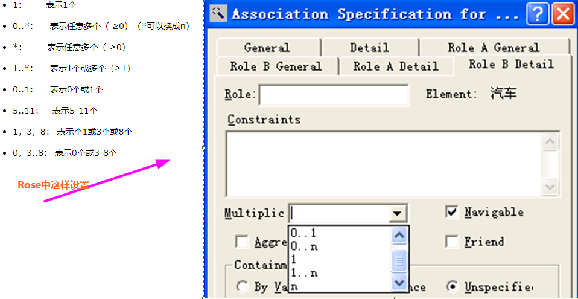

#### 聚合与组合

**聚合的概念：** 聚合表示类之间的`整体与部分`的关系。聚合意味着一个`类拥有但共享`另一个类的对象。(关联的特例)

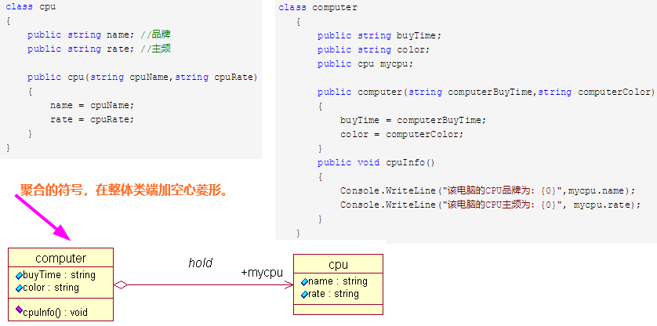

当整体类不存在时，部分类仍可能存在。部分类销毁时，整体类也将能够存在。

关联关系和聚合关系在语法上是没办法区分的，得从语义上才能更好的区分两者的区别。

**组成的概念：** 组成是一种特殊形式的聚合。

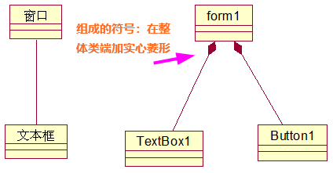

一个部分类最多只能属于一个整体类

当整体类不存在时，部分类将同时被销毁。

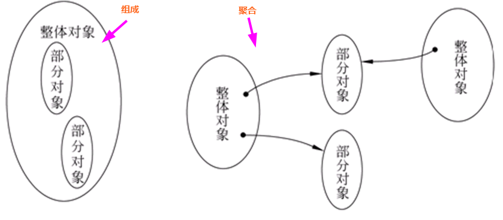

#### 依赖关系

**依赖关系：** 一个用虚箭头
**关联关系：** 一个用实箭头

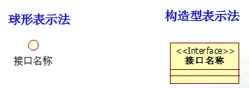
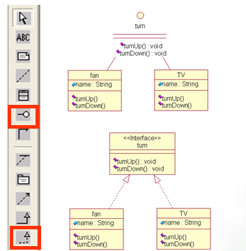

#### 包图Package

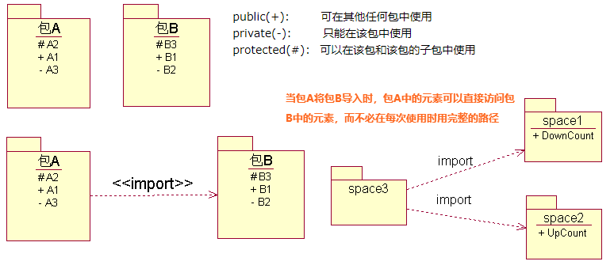

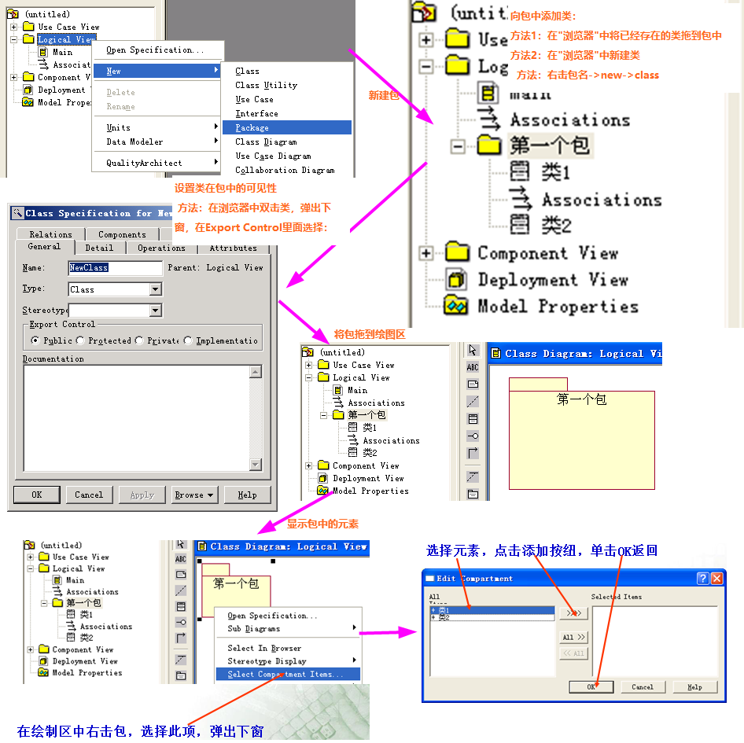

> 时序图

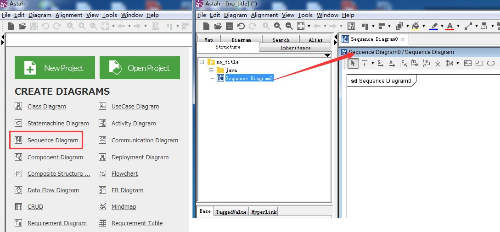

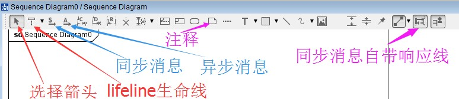

- 时序图元素（Sequence Diagram Elements）
- 角色（Actor）
- 对象（Object）
- 生命线（Lifeline）
   
   时序图中表示为从对象图标向下延伸的一条虚线，表示对象存在的时间, 一般用来描述  系统 ：如 客户端，代理层，缓存层，服务器层1.....服务器层N，数据库等。

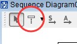 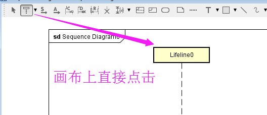

- 控制焦点（Focus of Control）
- 消息（Message）
    - 同步消息
    - 异步消息
    - 返回消息

  消息的定义（个人理解的白话文）：生命线与生命线之间的交互就是由"消息"来完成，消息说白了就是系统与系统之间请求（Request）与响应（Response）。

1) **同步消息（Synchronous Message）：** 消息的发送者把控制传递给消息的接收者，然后停止活动，等待消息的接收者放弃或者返回控制，用来表示同步的意义。有点类似网络协议里的TCP协议，系统A给系统B发了消息，就等着B回消息或者超时之后就不理睬B了

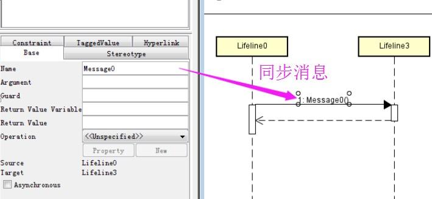

2) **异步消息（Asynchronous Message）：** 消息发送者通过消息把信号传递给消息的接收者，然后继续自己的活动，不等待接受者返回消息或者控制。异步消息的接收者和发送者是并发工作的。有点类似网络协议里的UDP协议，系统A给系统B发了消息，然后，系统A对系统B的态度就是：B回不回消息无所谓。

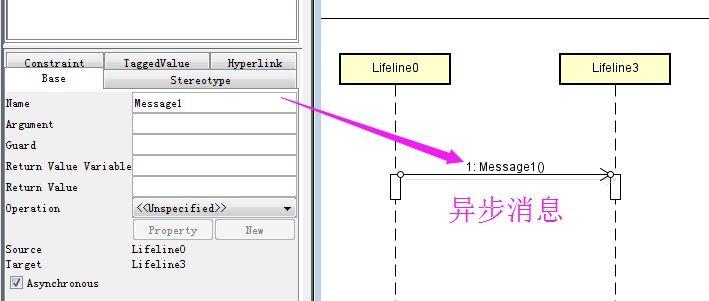

3) **返回消息（Return Message）:** 同步消息的一部分，是一种响应反馈的消息。A发同步消息给B，B收到消息后给A发送响应就是返回消息。

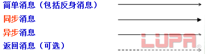

- 自关联消息（Self-Message）

  表示方法的自身调用以及一个对象内的一个方法调用另外一个方法。
  
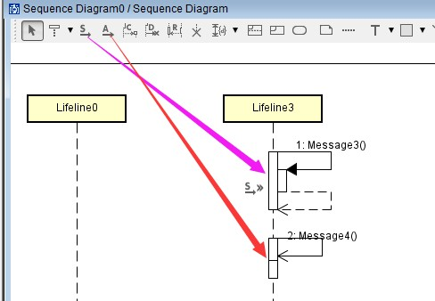

- 组合片段Combined Fragments

## 用例图、活动图、时序图之间的关系

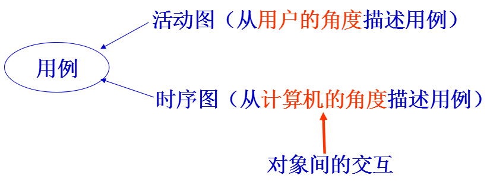

## 类图与时序图之间的关系

类图描述系统的静态结构，时序图描述系统的动态行为。

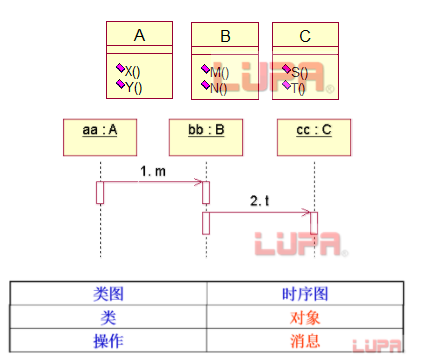

**时序图的作用：** 用对象间的交互来描述用例。（注意是对象间的）寻找类的操作。

