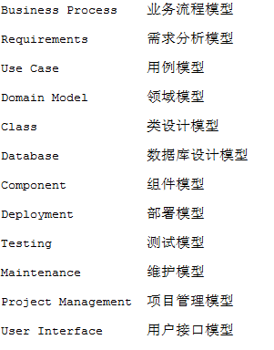
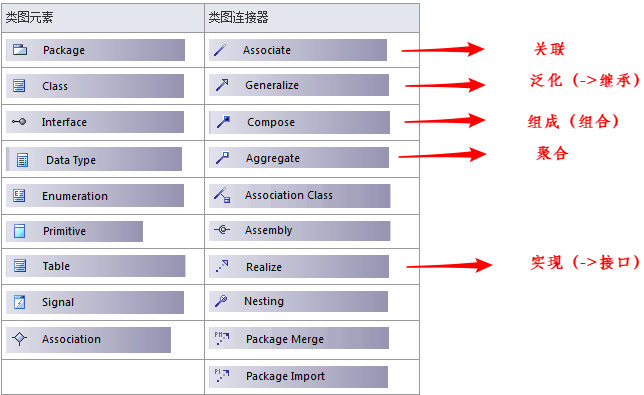
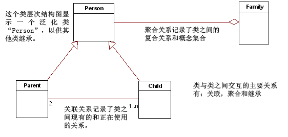
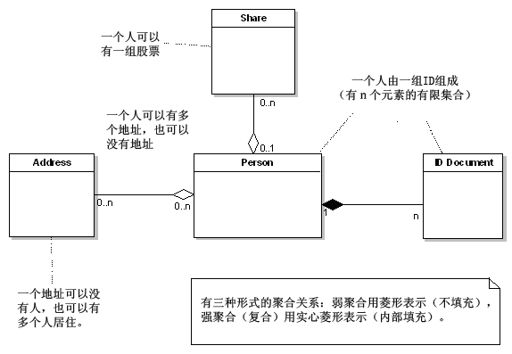

# Enterprise Architect

**类图工具**

## 应用UML进行数据库建模

+ 类模型

类在UML中是一个基本的逻辑实体。它定义了一个结构单元的数据和行为。一个类是一个模板或运行时创建实例和对象的模型。当开发一个逻辑模型，如UML中的结构层次，我们将明确地把它们当作类来处理。当面对动态图时，如顺序图和协作图，我们也要处理类的实例和对象，以及它们运行时的内部动作。数据隐藏和封装原则是基于作用域效果。类有它的内部数据元素。访问这些数据元素需要通过类对外的行为或接口。遵循这个原则会生成更易于维护的代码。

+ 行为

行为使用了类定义的操作，在类模型中被记录。操作是可以外部可见的（public），对子类可见的（protected）和隐藏的（private）。通过结合隐藏数据和公共访问接口，隐藏或保护数据的操作，类的设计人员可以建立极易维护的结构单元，这些结构单元是支持而不是阻碍变化的。

+ 关系和特性

关联是两个类之间的一种关系。关系一侧的类知道和在某种程度上使用或操控另一侧的类。这种关联可以是功能上的（为我做某事）也可以是结构上的（是什么）。在本文中更多的是侧重结构上的关系。如：一个“Address”类可以关联一个“Person”类，将这种关系映射到数据空间需要多加注意。

**聚合** 是关联的一种形式，表示一个类多个对象的集合在另一个类中。复合是一种更强的聚合形式，说明一个对象实际上由其它对象构成。对于关联关系来说，它意味着一个复杂的类属性，将该属性映射到关系模型时需要更详细的考虑。当一个类表示为生成许多对象实例的模板或模型时，对象需要在运行时有识别自己的方式，这样被关联对象可以对正确的对象实例施加作用。在编程语言中，如C＋＋，对象指针可能会传递，并使所指对象可以访问一个独一无二的对象实例。通常尽管一个对象会被销毁，但是在需要时，又象上一次有效实例期间那样被重建。所以，这些对象需要一个存储机制来保留它们的内部状态和关联，并在需要时恢复所需状态。

**继承** 给类模型提供一种方式，该方式提取通用行为到泛化的类中，使这个泛化类稍后可以做为在一般主题上诸多变异的原形。继承是一种管理重用和复杂性程度的方式。如我们将看到的，关系模型并没有与继承关系的直接对应项，这给数据模型建立者建立一个从对象模型到关系框架造成了困难。从一个运行时的对象到另外一个对象的导航是建立在完全引用的基础之上。一个对象有多种形式的连接（指针或唯一的对象标识），用这些连接可以定位和重建所需的对象。

+ 关系模型

关系数据模型已经使用多年，提供的性能和灵活性一直行之有效。它本质上是基于集合的（set－based），并且用‘表’做为它的基本单元，表由一个或多个‘列’组成，每一个列包含一个数据元素。

**表和列：** 一个关系表是一个或多个列的集合，每个列在表结构中有一个唯一名称，并且被定义成一个特定基本数据类型，如：数字、文本、二元数据。表定义是一个模板，表的“行”从这个模板中被创建，行可能做为一个表实例的实例。关系模型仅仅提供一个公共数据访问的模型。所有数据向外对任何一个过程开放，以便于被更新，查询和操控。信息隐蔽（information hiding）是未知的。

+ 行为

与表相关联的行为通常是基于所应用实体的业务或逻辑规则。约束以多个形式应用到“列”，如：独特性需求、对应其它表和列的关系完整性约束，允许的值和数据类型。
触发器提供了关联到一个实体的许多附加行为。通常在数据被插入、删除和更新前后，强制执行数据的完整性检查。数据库存储过程提供了一种通过专有语言扩展来延伸数据库功能的方式，这些扩展通常用来构造功能性单元（脚本）。这些功能不会直接映射到这些实体，也不会与它们有逻辑关系。通过关系数据集的导航是基于“行”遍历和表连接实现。SQL是用来从表集选择“行”和放置实例的一种主要的语言。

+ 关系和识别

表的主键为识别行提供一个特定值。这里有两种我们关注的主键：首先是意义键（meaning key），它由数据列构成，这些数据列在业务领域有意义。其次是一个抽象的唯一标识符，如计数器值，它没有商业意义，但是可以唯一地标识一个行。我们将先讨论抽象唯一标识符，然后再阐述意义键。一个表可以包含映射到另一个表主键的“列”。表间的关系定义了一个外键，说明了在这两个表之间的结构关系或关联。

## 什么是UML?

UML一般被分成两个集合，包括14种基本图表类型：

#### 1、结构建模图

结构图定义了一个模型的静态架构。它们通常被用来对那些构成模型的‘要素'建模，诸如：类，对象，接口和物理组件。另外，它们也被用来对元素间关联和依赖关系进行建模。

+ 1、包图

包图用来表现包和它所包含元素的组织。当用来代表类元素时，包图提供了命名空间的可视化。包图最常用的用途是用来组织用例图和类图，尽管它不局限于这些UML元素。

+ 2、组件图

+ 3、类或结构图

+ 4、部署图

+ 5、复合结构图

+ 6、对象图

+ 7、Profile图

#### 2、行为建模图

行为图用来记录在一个模型内部，随时间的变化，模型执行的交互变化和瞬间的状态；并跟踪系统在真实环境下如何表现，以及观察系统对一个操作或事件的反应，以及它的结果。

+ 8、用例图

+ 9、顺序图

+ 10、活动图

+ 11、时序图

+ 12、状态机图

+ 13、交互概览图

+ 14、通信图
