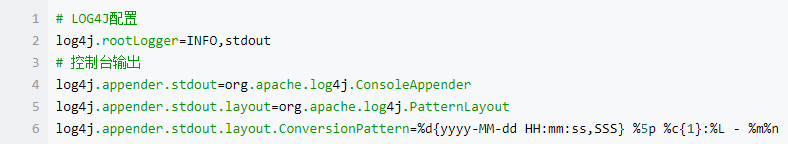
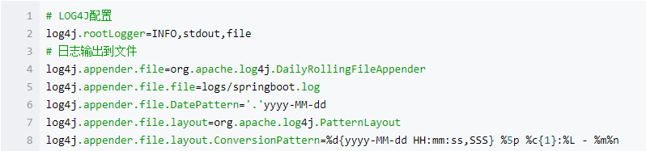
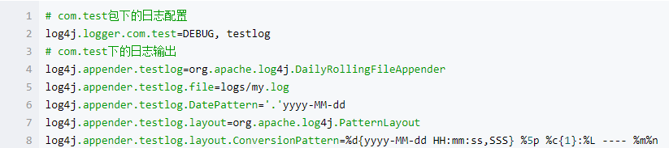
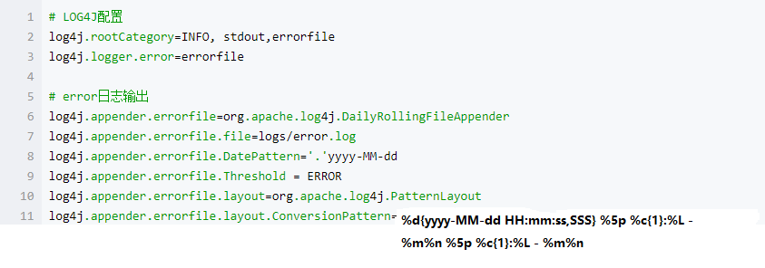
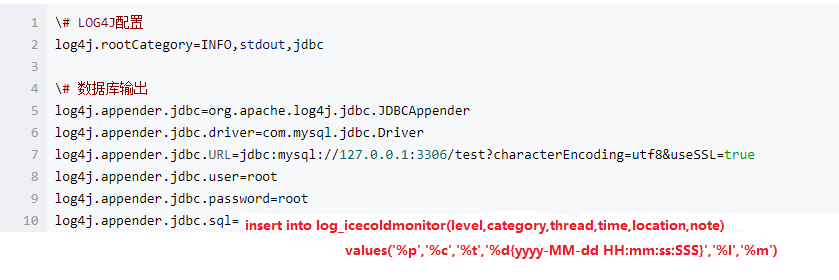
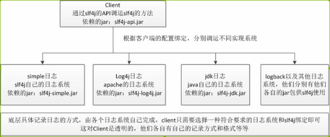
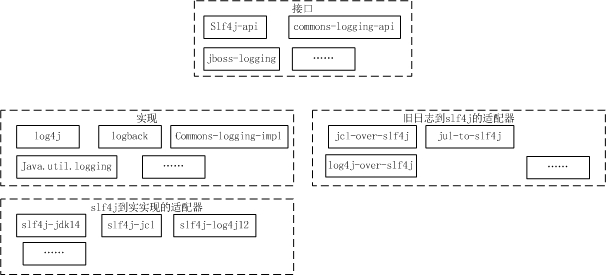

# 日志框架


### LogBack、Slf4j和Log4j之间的关系

+ Slf4j(The Simple Logging Facade for Java)

   是一个简单日志门面抽象框架，它本身只提供了日志Facade API和一个简单的日志类实现，一般常配合Log4j，LogBack，java.util.logging使用。Slf4j作为应用层的Log接入时，程序可以根据实际应用场景动态调整底层的日志实现框架(Log4j/LogBack/JdkLog…)。


+ Log4j 开源日记工具库

+ LogBack 开源日记工具库，LogBack是Log4j的改良版本，比Log4j拥有更多的特性，同时也带来很大性能提升。(LogBack建议配合Slf4j使用)

**LogBack被分为3个组件，logback-core, logback-classic 和 logback-access。**
  + **logback-core：** 其它两个模块的基础模块
  + **logback-classic：** 它是log4j的一个改良版本，同时它完整实现了slf4j API使你可以很方便地更换成其它日志系统如log4j或JDK14 Logging
  + **logback-access：** 访问模块与Servlet容器集成提供通过Http来访问日志的功能

## log4j

Log4j是Apache的一个开放源代码项目，通过使用Log4j，我们可以控制日志信息输送的目的地是控制台、文件、数据库等；我们也可以控制每一条日志的输出格式；通过定义每一条日志信息的级别，我们能够更加细致地控制日志的生成过程。 

Log4j有7种不同的log级别，按照等级从低到高依次为：**TRACE、DEBUG、INFO、WARN、ERROR、FATAL、OFF**。如果配置为OFF级别，表示关闭log。 

Log4j支持两种格式的配置文件：**properties** 和 **xml** 。包含三个主要的组件：Logger、appender、Layout。

**控制台输出**

通过如下配置，设定root日志的输出级别为`INFO，appender`为控制台输出stdout


**输出到文件**

在开发环境，我们只是输出到控制台没有问题，但是到了生产或测试环境，或许持久化日志内容，方便追溯问题原因。可以通过添加如下的appender内容，按天输出到不同的文件中去，同时还需要为`log4j.rootLogge`r添加名为file的appender，这样root日志就可以输出到`logs/springboot.log`文件中了。输出到文件和输出到控制台是可以并行存在的。



**分类输出**

当我们日志量较多的时候，查找问题会非常困难，常用的手段就是对日志进行分类，比如： 
可以按不同package进行输出。通过定义输出到`logs/my.log`的appender，并对com.test包下的日志级别设定为DEBUG级别、appender设置为输出到`logs/my.log`的名为testlog的appender。



可以对不同级别进行分类，比如对ERROR级别输出到特定的日志文件中，具体配置可以如下：



**输出到数据库**

将日志文件输出到数据库配置：



引入数据库驱动：
```xml
<dependency>
    <groupId>mysql</groupId>
    <artifactId>mysql-connector-java</artifactId>
</dependency>
```
```
//创建表
CREATE TABLE `log_icecoldmonitor` (
  `Id` int(11) NOT NULL AUTO_INCREMENT,
  `level` varchar(255) NOT NULL DEFAULT '' COMMENT '优先级',
  `category` varchar(255) NOT NULL DEFAULT '' COMMENT '类目',
  `thread` varchar(255) NOT NULL DEFAULT '' COMMENT '进程',
  `time` varchar(30) NOT NULL DEFAULT '' COMMENT '时间',
  `location` varchar(255) NOT NULL DEFAULT '' COMMENT '位置',
  `note` text COMMENT '日志信息',
  PRIMARY KEY (`Id`)
)
```
这样就可以保存到日志到数据库了，可能会出现如下异常信息： 
Java连接Mysql数据库警告：`Establishing SSL connection`
原因是MySQL在高版本需要指明是否进行SSL连接。解决方案如下： 
在mysql连接字符串url中加入ssl=true或者false即可，如下所示。 
`spring.datasource.url=jdbc:mysql://127.0.0.1:3306/test?characterEncoding=utf8&useSSL=true`

## Log4j2

Spring Boot1.4以及之后的版本已经不支持log4j，log4j也很久没有更新了，现在已经有很多其他的日志框架对Log4j进行了改良，比如说SLF4J、Logback等。而且Log4j 2在各个方面都与Logback非常相似，那么为什么我们还需要Log4j 2呢？ 

1. 插件式结构。Log4j 2支持插件式结构。我们可以根据自己的需要自行扩展Log4j 2. 我们可以实现自己的appender、logger、filter。 

2. 配置文件优化。在配置文件中可以引用属性，还可以直接替代或传递到组件。而且支持json格式的配置文件。不像其他的日志框架，它在重新配置的时候不会丢失之前的日志文件。 

3. Java 5的并发性。Log4j 2利用Java 5中的并发特性支持，尽可能地执行最低层次的加锁。解决了在log4j 1.x中存留的死锁的问题。 

4. 异步logger。Log4j 2是基于LMAX Disruptor库的。在多线程的场景下，和已有的日志框架相比，异步的logger拥有10倍左右的效率提升。 

官方建议一般程序员查看的日志改成异步方式，一些运营日志改成同步。日志异步输出的好处在于，使用单独的进程来执行日志打印的功能，可以提高日志执行效率，减少日志功能对正常业务的影响。异步日志在程序的classpath需要加载`disruptor-3.0.0.jar`或者更高的版本。
```xml
<!-- log4j2异步日志需要加载disruptor-3.0.0.jar或者更高的版本 -->
        <dependency>
            <groupId>com.lmax</groupId>
            <artifactId>disruptor</artifactId>
            <version>3.3.6</version>
        </dependency>
```

异步日志分为两种： 

a.全异步模式 

这种异步日志方式，不需要修改修改原理的配置文件，Logger仍然使用`<root>` and `<logger> ` 只需要在主程序代码开头，加一句系统属性的代码：
```xml
System.setProperty("Log4jContextSelector", 
   "org.apache.logging.log4j.core.async.AsyncLoggerContextSelector");  
```

b.异步和非异步混合输出模式 

在配置文件中Logger使用`<asyncRoot>` or `<asyncLogger>`

```xml
<loggers>  
     <AsyncLogger name="AsyncLogger" level="trace" includeLocation="true">  
        <appender-ref ref="Console" />  
        <appender-ref ref="debugLog" />  
        <appender-ref ref="errorLog" />  
    </AsyncLogger>  

    <asyncRoot level="trace" includeLocation="true">  
        <appender-ref ref="Console" />  
    </asyncRoot>   
</loggers> 
```

**log4j2.xml配置**

有一点需要注意的是，假如想要在`application.properties`中指定日志文件存放路径或日志文件名，在log4j2.xml中使用${LOG_PATH}或者${LOG_FILE}来引用，是无法获取到的（在logback中可以尽情使用）。log4j2支持`xml、json、yaml`等格式的配置文件。

## SLF4J

SLF4J，即简单日志门面（Simple Logging Facade for Java），不是具体的日志解决方案，而是通过Facade Pattern提供一些Java logging API，它只服务于各种各样的日志系统。按照官方的说法，SLF4J是一个用于日志系统的简单Facade，允许最终用户在部署其应用时使用其所希望的日志系统。作者创建SLF4J的目的是为了替代`Jakarta Commons-Logging`。 
实际上，SLF4J所提供的核心API是一些接口以及一个LoggerFactory的工厂类。在使用SLF4J的时候，不需要在代码中或配置文件中指定你打算使用那个具体的日志系统。类似于`Apache Common-Logging`，SLF4J是对不同日志框架提供的一个门面封装，可以在部署的时候不修改任何配置即可接入一种日志实现方案。但是，他在编译时静态绑定真正的Log库。使用SLF4J时，如果你需要使用某一种日志实现，那么你必须选择正确的SLF4J的jar包的集合（各种桥接包）。SLF4J提供了统一的记录日志的接口，只要按照其提供的方法记录即可，最终日志的格式、记录级别、输出方式等通过具体日志系统的配置来实现，因此可以在应用中灵活切换日志系统。



**那么什么时候使用SLF4J比较合适呢？**

如果你开发的是类库或者嵌入式组件，那么就应该考虑采用SLF4J，因为不可能影响最终用户选择哪种日志系统。在另一方面，如果是一个简单或者独立的应用，确定只有一种日志系统，那么就没有使用SLF4J的必要。假设你打算将你使用log4j的产品卖给要求使用JDK 1.8 Logging的用户时，面对成千上万的log4j调用的修改，相信这绝对不是一件轻松的事情。但是如果开始便使用SLF4J，那么这种转换将是非常轻松的事情。


vs
log4j测试,
```java
import org.apache.log4j.Logger;

private static Logger logger = Logger.getLogger(TestLog4jApplication.class);
```

log4j2测试使用,
```java
import org.apache.logging.log4j.LogManager;
import org.apache.logging.log4j.Logger;

private static Logger logger = LogManager.getLogger(TestLog4j2Application.class);
```

假如后期改变log实现系统，所有调用log4j的代码都需要进行修改，假如一开始都使用`slf4j.Logger`，后期将无需修改代码。

```java
import org.slf4j.Logger;
import org.slf4j.LoggerFactory;

private static Logger logger = LoggerFactory.getLogger(TestLog4jApplication.class);

private static Logger logger = LoggerFactory.getLogger(TestLog4j2Application.class); 
```

假如遇到`SLF4J: Class path contains multiple SLF4J bindings`相关的错误提示，则是因为引入了多个日志系统，需要排除多余的依赖。

slf4j-simple是slf4j的一种日志系统实现，目前最新版本是1.7.7。

```xml

<dependency>
    <groupId>org.slf4j</groupId>
    <artifactId>slf4j-simple</artifactId>
    <version>1.7.7</version>
</dependency>
```

## Logback

Logback，一个“可靠、通用、快速而又灵活的Java日志框架”。logback当前分成三个模块：`logback-core`，`logback- classic`和`logback-access`。logback-core是其它两个模块的基础模块。`logback-classic`是`log4j`的一个改良版本。此外logback-classic完整实现SLF4J API使你可以很方便地更换成其它日志系统如`log4j`或`JDK Logging`。`logback-access`访问模块与`Servlet`容器集成提供通过Http来访问日志的功能。 

**选择logback的理由：**

1. logback比log4j要快大约10倍，而且消耗更少的内存。 
2. logback-classic模块直接实现了SLF4J的接口，所以我们迁移到logback几乎是零开销的。 
3. logback不仅支持xml格式的配置文件，还支持groovy格式的配置文件。相比之下，Groovy风格的配置文件更加直观，简洁。 
4. logback-classic能够检测到配置文件的更新，并且自动重新加载配置文件。 
5. logback能够优雅的从I/O异常中恢复，从而我们不用重新启动应用程序来恢复logger。 
6. logback能够根据配置文件中设置的上限值，自动删除旧的日志文件。 
7. logback能够自动压缩日志文件。 
8. logback能够在配置文件中加入条件判断（if-then-else)。可以避免不同的开发环境（dev、test、uat…）的配置文件的重复。 
9. logback带来更多的filter。 
10. logback的stack trace中会包含详细的包信息。 
11. logback-access和Jetty、Tomcat集成提供了功能强大的HTTP-access日志。 

**配置文件：需要在项目的src目录下建立一个`logback.xml`或`logback.groovy`。** 

注：

（1）logback首先会试着查找`logback.groovy`文件； 

（2）当没有找到时，继续试着查找`logback-test.xml`文件； 

（3）当没有找到时，继续试着查找`logback.xml`文件； 

（4）如果仍然没有找到，则使用默认配置（打印到控制台）。

**logback的一些配置介绍：**

+ 控制台输出 

在Spring Boot中默认配置了ERROR、WARN和INFO级别的日志输出到控制台。我们可以通过两种方式切换至DEBUG级别： 
在运行命令后加入–debug标志，如：`$ java -jar test.jar --debug `
在`application.properties`中配置`debug=true`，该属性置为true的时候，核心Logger（包含嵌入式容器、hibernate、spring）会输出更多内容，但是你自己应用的日志并不会输出为DEBUG级别。

+ 多彩输出 

如果你的终端支持ANSI，设置彩色输出会让日志更具可读性。通过在application.properties中设置`spring.output.ansi.enabled`参数来支持。 
NEVER：禁用ANSI-colored输出（默认项） 
DETECT：会检查终端是否支持ANSI，是的话就采用彩色输出（推荐项） 
ALWAYS：总是使用ANSI-colored格式输出，若终端不支持的时候，会有很多干扰信息，不推荐使用

+ 文件输出 

Spring Boot默认配置只会输出到控制台，并不会记录到文件中，但是我们通常生产环境使用时都需要以文件方式记录。

若要增加文件输出，需要在application.properties中配置logging.file或logging.path属性。 

logging.file，设置文件，可以是绝对路径，也可以是相对路径。如：`logging.file=my.log `
logging.path，设置目录，会在该目录下创建spring.log文件，并写入日志内容，如：`logging.path=../logs `
日志文件会在10Mb大小的时候被截断，产生新的日志文件，默认级别为：ERROR、WARN、INFO

+ 级别控制 

在Spring Boot中只需要在application.properties中进行配置完成日志记录的级别控制。 
配置格式：`logging.level.*=LEVEL` 
logging.level：日志级别控制前缀，*为包名或Logger名 
LEVEL：选项TRACE, DEBUG, INFO, WARN, ERROR, FATAL, OFF 
举例： 
`logging.level.com.test=DEBUG：com.test`包下所有class以DEBUG级别输出 
`logging.level.root=WARN：root`日志以WARN级别输出

+ 自定义输出格式 

在Spring Boot中可以通过在application.properties配置如下参数控制输出格式： 
`logging.pattern.console：`定义输出到控制台的样式（不支持JDK Logger） 
`logging.pattern.file：`定义输出到文件的样式（不支持JDK Logger）


## Apache Commons Logging

`Apache Commons Logging` ，之前叫 Jakarta Commons Logging（JCL）提供的是一个日志(Log)接口(interface)，同时兼顾轻量级和不依赖于具体的日志实现工具。它提供给中间件/日志工具开发者一个简单的日志操作抽象，允许程序开发人员使用不同的具体日志实现工具。用户被假定已熟悉某种日志实现工具的更高级别的细节。JCL提供的接口，对其它一些日志工具，包括Log4J, Avalon LogKit, and JDK 1.4+等，进行了简单的包装，此接口更接近于Log4J和LogKit的实现。 

`common-logging`是apache提供的一个通用的日志接口。用户可以自由选择第三方的日志组件作为具体实现，像log4j，或者jdk自带的logging， common-logging会通过动态查找的机制，在程序运行时自动找出真正使用的日志库。当然，common-logging内部有一个Simple logger的简单实现，但是功能很弱。所以使用common-logging，通常都是配合着log4j来使用。使用它的好处就是，代码依赖是common-logging而非log4j， 避免了和具体的日志方案直接耦合，在有必要时，可以更改日志实现的第三方库。 

使用common-logging的常见代码：

```java
import org.apache.commons.logging.Log;  
import org.apache.commons.logging.LogFactory;  

public class A {  
    private static Log logger = LogFactory.getLog(this.getClass());  
}  
```

**slf4j 与 common-logging 比较**

common-logging通过动态查找的机制，在程序运行时自动找出真正使用的日志库； 
slf4j在编译时静态绑定真正的Log库。

## java.util.logging.Logger

java.util.logging.Logger（JUL），JDK自带的日志系统，从JDK1.4就有了。关键元素包括： 
Logger：应用程序进行logging调用的主要实体。Logger 对象用来记录特定系统或应用程序组件的日志消息。 

LogRecord：用于在 logging 框架和单独的日志处理程序之间传递 logging 请求。 

Handler：将 LogRecord 对象导出到各种目的地，包括内存、输出流、控制台、文件和套接字。为此有各种的 Handler 子类。其他 Handler 可能由第三方开发并在核心平台的顶层实现。 

Level：定义一组可以用来控制 logging 输出的标准 logging 级别。可以配置程序为某些级别输出 logging，而同时忽略其他输出。 

Filter：为所记录的日志提供日志级别控制以外的细粒度控制。Logging API 支持通用的过滤器机制，该机制允许应用程序代码附加任意的过滤器以控制 logging 输出。 

Formatter：为格式化 LogRecord 对象提供支持。此包包括的两个格式化程序 

SimpleFormatter 和 XMLFormatter 分别用于格式化纯文本或 XML 中的日志记录。与 Handler 一样，其他 Formatter 可能由第三方开发。

整个JVM内部所有logger的管理，logger的生成、获取等操作都依赖于LogManager，也包括配置文件的读取，LogManager与logger是1对多关系，整个JVM运行时只有一个LogManager，且所有的logger均在LogManager中。 
logger与handler是多对多关系，logger在进行日志输出的时候会调用所有的hanlder进行日志的处理。 

handler与formatter是一对一关系，一个handler有一个formatter进行日志的格式化处理。 
logger与level是一对一关系，hanlder与level也是一对一关系 。 
JDK默认的logging配置文件为：$JAVA_HOME/jre/lib/logging.properties，可以使用系统属性java.util.logging.config.file指定相应的配置文件对默认的配置文件进行覆盖。

小结：



接口：将所有日志实现适配到了一起，用统一的接口调用。 

实现：目前主流的日志实现 

旧日志到slf4j的适配器：如果使用了slf4j，但是只想用一种实现，想把log4j的日志体系也从logback输出，这个是很有用的。 
slf4j到实现的适配器：如果想制定slf4j的具体实现，需要这些包。

slf4j跟commons-logging类似，是各种日志实现的通用入口，log4j、log4j2、logback、slf4j-simple和java.util.logging是比较常见的日志实现系统，目前应用比较广泛的是Log4j和logback，而logback作为后起之秀，以替代log4j为目的，整体性能比log4j较佳，log4j的升级版log4j2也是有诸多亮点，用户可以根据项目需求和个人习惯，选择合适的日志实现。

完整配置案例(附上相对比较完整的，涵盖大部分配置的案例，案例中有解析。)

```xml
<?xml version="1.0" encoding="UTF-8"?>
<!--
-scan:当此属性设置为true时，配置文件如果发生改变，将会被重新加载，默认值为true
-scanPeriod:设置监测配置文件是否有修改的时间间隔，如果没有给出时间单位，默认单位是毫秒。
-           当scan为true时，此属性生效。默认的时间间隔为1分钟
-debug:当此属性设置为true时，将打印出logback内部日志信息，实时查看logback运行状态。默认值为false。
-
- configuration 子节点为 appender、logger、root
-->
<configuration scan="true" scanPeriod="60 second" debug="false">
 
    <!-- 负责写日志,控制台日志 -->
    <appender name="STDOUT" class="ch.qos.logback.core.ConsoleAppender">
 
        <!-- 一是把日志信息转换成字节数组,二是把字节数组写入到输出流 -->
        <encoder>
            <Pattern>[%d{yyyy-MM-dd HH:mm:ss.SSS}] [%5level] [%thread] %logger{0} %msg%n</Pattern>
            <charset>UTF-8</charset>
        </encoder>
    </appender>
 
    <!-- 文件日志 -->
    <appender name="DEBUG" class="ch.qos.logback.core.FileAppender">
        <file>debug.log</file>
        <!-- append: true,日志被追加到文件结尾; false,清空现存文件;默认是true -->
        <append>true</append>
        <filter class="ch.qos.logback.classic.filter.LevelFilter">
            <!-- LevelFilter: 级别过滤器，根据日志级别进行过滤 -->
            <level>DEBUG</level>
            <onMatch>ACCEPT</onMatch>
            <onMismatch>DENY</onMismatch>
        </filter>
        <encoder>
            <Pattern>[%d{yyyy-MM-dd HH:mm:ss.SSS}] [%5level] [%thread] %logger{0} %msg%n</Pattern>
            <charset>UTF-8</charset>
        </encoder>
    </appender>
 
    <!-- 滚动记录文件，先将日志记录到指定文件，当符合某个条件时，将日志记录到其他文件 -->
    <appender name="INFO" class="ch.qos.logback.core.rolling.RollingFileAppender">
        <File>info.log</File>
 
        <!-- ThresholdFilter:临界值过滤器，过滤掉 TRACE 和 DEBUG 级别的日志 -->
        <filter class="ch.qos.logback.classic.filter.ThresholdFilter">
            <level>INFO</level>
        </filter>
 
        <encoder>
            <Pattern>[%d{yyyy-MM-dd HH:mm:ss.SSS}] [%5level] [%thread] %logger{0} %msg%n</Pattern>
            <charset>UTF-8</charset>
        </encoder>
 
        <rollingPolicy class="ch.qos.logback.core.rolling.TimeBasedRollingPolicy">
            <!-- 每天生成一个日志文件，保存30天的日志文件
            - 如果隔一段时间没有输出日志，前面过期的日志不会被删除，只有再重新打印日志的时候，会触发删除过期日志的操作。
            -->
            <fileNamePattern>info.%d{yyyy-MM-dd}.log</fileNamePattern>
            <maxHistory>30</maxHistory>
            <TimeBasedFileNamingAndTriggeringPolicy class="ch.qos.logback.core.rolling.SizeAndTimeBasedFNATP">
                <maxFileSize>100MB</maxFileSize>
            </TimeBasedFileNamingAndTriggeringPolicy>
        </rollingPolicy>
    </appender >
 
    <!--<!– 异常日志输出 –>-->
    <!--<appender name="EXCEPTION" class="ch.qos.logback.core.rolling.RollingFileAppender">-->
        <!--<file>exception.log</file>-->
        <!--<!– 求值过滤器，评估、鉴别日志是否符合指定条件. 需要额外的两个JAR包，commons-compiler.jar和janino.jar –>-->
        <!--<filter class="ch.qos.logback.core.filter.EvaluatorFilter">-->
            <!--<!– 默认为 ch.qos.logback.classic.boolex.JaninoEventEvaluator –>-->
            <!--<evaluator>-->
                <!--<!– 过滤掉所有日志消息中不包含"Exception"字符串的日志 –>-->
                <!--<expression>return message.contains("Exception");</expression>-->
            <!--</evaluator>-->
            <!--<OnMatch>ACCEPT</OnMatch>-->
            <!--<OnMismatch>DENY</OnMismatch>-->
        <!--</filter>-->
 
        <!--<triggeringPolicy class="ch.qos.logback.core.rolling.SizeBasedTriggeringPolicy">-->
            <!--<!– 触发节点，按固定文件大小生成，超过5M，生成新的日志文件 –>-->
            <!--<maxFileSize>5MB</maxFileSize>-->
        <!--</triggeringPolicy>-->
    <!--</appender>-->
 
    <appender name="ERROR" class="ch.qos.logback.core.rolling.RollingFileAppender">
        <file>error.log</file>
 
        <encoder>
            <Pattern>[%d{yyyy-MM-dd HH:mm:ss.SSS}] [%5level] [%thread] %logger{0} %msg%n</Pattern>
            <charset>UTF-8</charset>
        </encoder>
 
        <!-- 按照固定窗口模式生成日志文件，当文件大于20MB时，生成新的日志文件。
        -    窗口大小是1到3，当保存了3个归档文件后，将覆盖最早的日志。
        -    可以指定文件压缩选项
        -->
        <rollingPolicy class="ch.qos.logback.core.rolling.FixedWindowRollingPolicy">
            <fileNamePattern>error.%d{yyyy-MM}(%i).log.zip</fileNamePattern>
            <minIndex>1</minIndex>
            <maxIndex>3</maxIndex>
            <timeBasedFileNamingAndTriggeringPolicy class="ch.qos.logback.core.rolling.SizeAndTimeBasedFNATP">
                <maxFileSize>100MB</maxFileSize>
            </timeBasedFileNamingAndTriggeringPolicy>
            <maxHistory>30</maxHistory>
        </rollingPolicy>
    </appender>
 
    <!-- 异步输出 -->
    <appender name ="ASYNC" class= "ch.qos.logback.classic.AsyncAppender">
        <!-- 不丢失日志.默认的,如果队列的80%已满,则会丢弃TRACT、DEBUG、INFO级别的日志 -->
        <discardingThreshold >0</discardingThreshold>
        <!-- 更改默认的队列的深度,该值会影响性能.默认值为256 -->
        <queueSize>512</queueSize>
        <!-- 添加附加的appender,最多只能添加一个 -->
        <appender-ref ref ="ERROR"/>
    </appender>
 
    <!--
    - 1.name：包名或类名，用来指定受此logger约束的某一个包或者具体的某一个类
    - 2.未设置打印级别，所以继承他的上级<root>的日志级别“DEBUG”
    - 3.未设置additivity，默认为true，将此logger的打印信息向上级传递；
    - 4.未设置appender，此logger本身不打印任何信息，级别为“DEBUG”及大于“DEBUG”的日志信息传递给root，
    -  root接到下级传递的信息，交给已经配置好的名为“STDOUT”的appender处理，“STDOUT”appender将信息打印到控制台；
    -->
    <logger name="ch.qos.logback" />
 
    <!--
    - 1.将级别为“INFO”及大于“INFO”的日志信息交给此logger指定的名为“STDOUT”的appender处理，在控制台中打出日志，
    -   不再向次logger的上级 <logger name="logback"/> 传递打印信息
    - 2.level：设置打印级别（TRACE, DEBUG, INFO, WARN, ERROR, ALL 和 OFF），还有一个特殊值INHERITED或者同义词NULL，代表强制执行上级的级别。
    -        如果未设置此属性，那么当前logger将会继承上级的级别。
    - 3.additivity：为false，表示此logger的打印信息不再向上级传递,如果设置为true，会打印两次
    - 4.appender-ref：指定了名字为"STDOUT"的appender。
    -->
    <logger name="com.weizhi.common.LogMain" level="INFO" additivity="false">
        <appender-ref ref="STDOUT"/>
        <!--<appender-ref ref="DEBUG"/>-->
        <!--<appender-ref ref="EXCEPTION"/>-->
        <!--<appender-ref ref="INFO"/>-->
        <!--<appender-ref ref="ERROR"/>-->
        <appender-ref ref="ASYNC"/>
    </logger>
 
    <!--
    - 根logger
    - level:设置打印级别，大小写无关：TRACE, DEBUG, INFO, WARN, ERROR, ALL 和 OFF，不能设置为INHERITED或者同义词NULL。
    -       默认是DEBUG。
    -appender-ref:可以包含零个或多个<appender-ref>元素，标识这个appender将会添加到这个logger
    -->
    <root level="DEBUG">
        <appender-ref ref="STDOUT"/>
        <!--<appender-ref ref="DEBUG"/>-->
        <!--<appender-ref ref="EXCEPTION"/>-->
        <!--<appender-ref ref="INFO"/>-->
        <appender-ref ref="ASYNC"/>
    </root>
</configuration>
```

常用loger配置

```xml
<!-- show parameters for hibernate sql 专为 Hibernate 定制 -->
<logger name="org.hibernate.type.descriptor.sql.BasicBinder" level="TRACE" />
<logger name="org.hibernate.type.descriptor.sql.BasicExtractor" level="DEBUG" />
<logger name="org.hibernate.SQL" level="DEBUG" />
<logger name="org.hibernate.engine.QueryParameters" level="DEBUG" />
<logger name="org.hibernate.engine.query.HQLQueryPlan" level="DEBUG" />

<!--myibatis log configure-->
<logger name="com.apache.ibatis" level="TRACE"/>
<logger name="java.sql.Connection" level="DEBUG"/>
<logger name="java.sql.Statement" level="DEBUG"/>
<logger name="java.sql.PreparedStatement" level="DEBUG"/>
```
