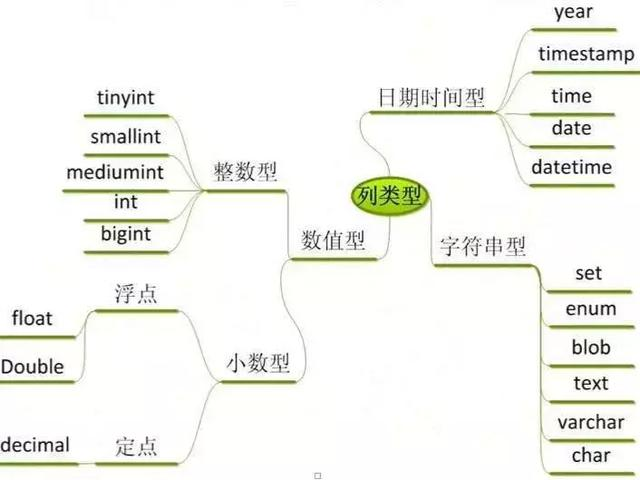
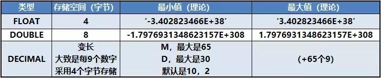
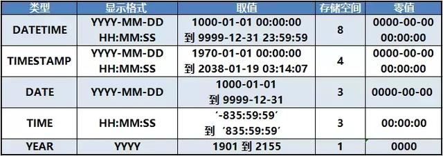
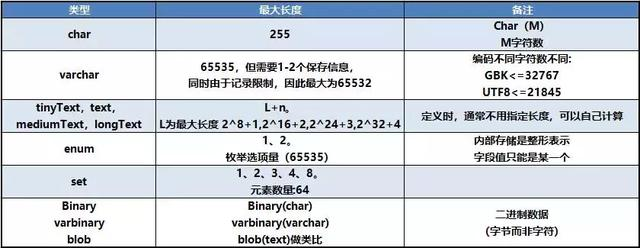
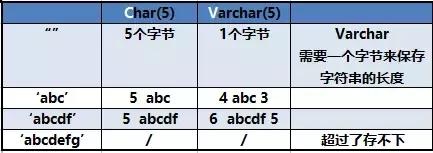

# MySQL

## MySQL数据库之数据类型

MySQL数据库的数据类型主要是分为数值型，日期时间型以及字符串型这三个大类，看着很多觉得记不住很麻烦是不是，不用担心其实现在我们常用的就那么几个

整数型的 tinyint 和 bigint

    java中的 boolean 类型， 在数据库中可以用 bit, tinyint(1),来存储0对应false 1 对应true

    整数类型中最常用的是：

      tinyint , int 对应 java 中的 int

      bigint 对应 java 中的 long

小数型的 decimal

    Float 精度为6位左右。 Double的精度为16位左右。

    因为 float 和 double 会出现精度的丢失，所以在精确度要求高的场所用 decimal。

    以后要存储一些涉及到钱的数据要记得 用Decimal

    decimal 对应 java BigDecimal java.math.BigDecimal

日期时间类型 datetime 和 timestamp

   Timestamp 时间戳：存储的时候是整型，显示的时候是日期类型

   datetime 对应 Java Date

字符串型是 char 和 varchar

    blob 对应 java byte[]

    enum 对应 java 里 Enum 枚举类型

    set 对应 java里 set 类型

    char varchar text : 对应 Java String

    Char & varchar
    
        CHAR 和 VARCHAR 类型声明的长度表示你想要保存的最大字符数。
        
        Char ：定长字符串，保存时如果字符串长度不够，则后边补足空字符串；但是在读取到数据是，会截取后边所有的字符串。

        Varchar ：变长字符串。在保存字符串时，同时保存该字符串的长度，小于255采用一个字节保存，否则采用二个字节保存。

     text 就是储存长文本类型

###### char、varchar 和 text 总结：

    经常变化的字段用 varchar

    知道固定长度的用 char

    超过255字符的只能用 varchar 或者 text

    能用 varchar 的地方不用 text

