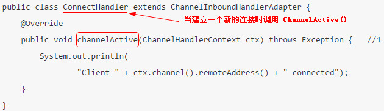
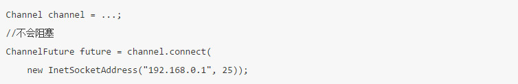
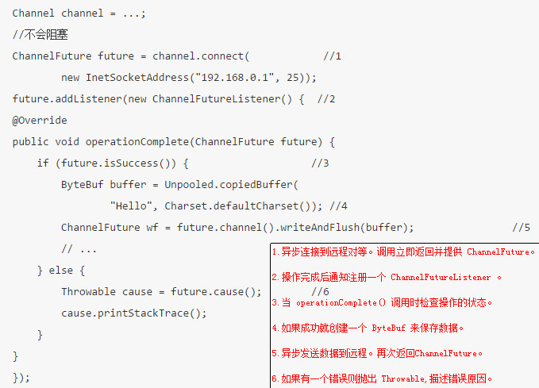
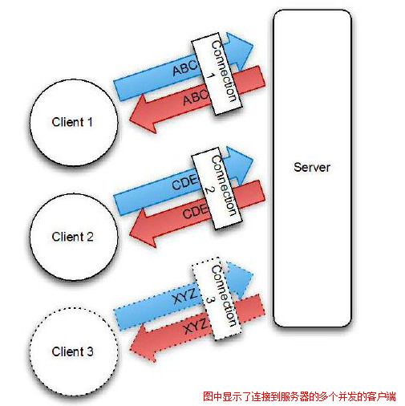
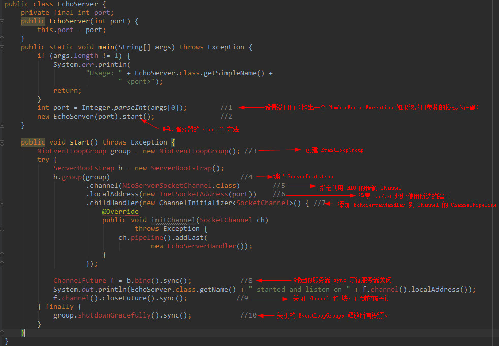
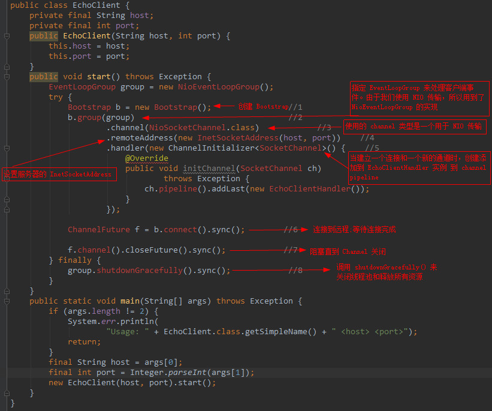

# Netty学习笔记

## Netty做什么？
> 本质：JBoss做的一个jar包
> 目的：快速开发高性能、高可靠性的网络服务器和客户端程序
> 优点：提供异步的、事件驱动的网络应用程序框架和工具
> >
> > 没有netty的场景？
> > 远古: java.net +java.io
> >
> > 近代: java.nio
> >
> > 其他：Mina，Grizzly

> 运用场景：
> > Netty 作为异步高性能的通信框架（RPC 框架使用的使用)
> > 

## 构成部分

### Channel   是 NIO 基本的结构
 	
	Channel 是 NIO 基本的结构。它代表了一个用于连接到实体如硬件设备、文件、网络套接字或程序组件,能够执行一个或多个不同的 I/O 操作（例如读或写）的开放连接。

	现在,把 Channel 想象成一个可以“打开”或“关闭”,“连接”或“断开”和作为传入和传出数据的运输工具。

### Callback （回调）

	Netty 内部使用回调处理事件时。一旦这样的回调被触发，事件可以由接口 ChannelHandler 的实现来处理。如下面的代码，一旦一个新的连接建立了,调用 channelActive(),并将打印一条消息。

 

### Future 
	Future 提供了另外一种通知应用操作已经完成的方式。这个对象作为一个异步操作结果的占位符,它将在将来的某个时候完成并提供结果。

	JDK 附带接口 java.util.concurrent.Future ,但所提供的实现只允许您手动检查操作是否完成或阻塞了。这是很麻烦的，所以 Netty 提供自己了的实现,ChannelFuture,用于在执行异步操作时使用。

	ChannelFuture 提供多个附件方法来允许一个或者多个 ChannelFutureListener 实例。这个回调方法 operationComplete() 会在操作完成时调用。事件监听者能够确认这个操作是否成功或者是错误。如果是后者,我们可以检索到产生的 Throwable。简而言之, ChannelFutureListener 提供的通知机制不需要手动检查操作是否完成的。
	
	每个 Netty 的 outbound I/O 操作都会返回一个 ChannelFuture;这样就不会阻塞。这就是 Netty 所谓的“自底向上的异步和事件驱动”。

	每个 Netty 的 outbound I/O 操作都会返回一个 ChannelFuture;这样就不会阻塞。这就是 Netty 所谓的“自底向上的异步和事件驱动”。

	下面例子简单的演示了作为 I/O 操作的一部分 ChannelFuture 的返回。当调用 connect() 将会直接是非阻塞的，并且调用在背后完成。由于线程是非阻塞的，所以无需等待操作完成，而可以去干其他事，因此这令资源利用更高效。
 
	1.异步连接到远程地址

	下面代码描述了如何利用 ChannelFutureListener 。首先，连接到远程地址。接着，通过 ChannelFuture 调用 connect() 来 注册一个新ChannelFutureListener。当监听器被通知连接完成，我们检查状态。如果是成功，就写数据到 Channel，否则我们检索 ChannelFuture 中的Throwable。
	
	注意，错误的处理取决于你的项目。当然,特定的错误是需要加以约束 的。例如,在连接失败的情况下你可以尝试连接到另一个。

 

### Event 和 Handler
Netty 使用不同的事件来通知我们更改的状态或操作的状态。这使我们能够根据发生的事件触发适当的行为。

这些行为可能包括：

- 日志
- 数据转换
- 流控制
- 应用程序逻辑

由于 Netty 是一个网络框架,事件很清晰的跟入站或出站数据流相关。因为一些事件可能触发传入的数据或状态的变化包括:

- 活动或非活动连接
- 数据的读取
- 用户事件
- 错误

出站事件是由于在未来操作将触发一个动作。这些包括:

- 打开或关闭一个连接到远程
- 写或冲刷数据到 socket

每个事件都可以分配给用户实现处理程序类的方法。这说明了事件驱动的范例可直接转换为应用程序构建块。

Netty 还提供了一组丰富的预定义的处理程序,您可以开箱即用。这些是各种协议的编解码器包括 HTTP 和 SSL/TLS。在内部,ChannelHandler 使用事件和 future 本身,使得消费者的具有 Netty 的抽象。

## 整合
### FUTURE, CALLBACK 和 HANDLER

	Netty 的异步编程模型是建立在 future 和 callback 的概念上的。所有这些元素的协同为自己的设计提供了强大的力量。

	拦截操作和转换入站或出站数据只需要您提供回调或利用 future 操作返回的。这使得链操作简单、高效,促进编写可重用的、通用的代码。一个 Netty 的设计的主要目标是促进“关注点分离”:你的业务逻辑从网络基础设施应用程序中分离。
### SELECTOR, EVENT 和 EVENT LOOP

	Netty 通过触发事件从应用程序中抽象出 Selector，从而避免手写调度代码。EventLoop 分配给每个 Channel 来处理所有的事件，包括
	- 注册有趣的事件
	- 调度事件到 ChannelHandler
	- 安排进一步行动
	该 EventLoop 本身是由只有一个线程驱动，它给一个 Channel 处理所有的 I/O 事件，并且在 EventLoop 的生命周期内不会改变。这个简单而强大的线程模型消除你可能对你的 ChannelHandler 同步的任何关注，这样你就可以专注于提供正确的回调逻辑来执行。该 API 是简单和紧凑。

## 第一个应用
### 设置开发环境

1、安装配置JDK (建议使用JDK1.7+)

2、下载IDE(使用 IDEA )

3、下载安装Maven

4、配置工具 （确保系统环境变量有 JAVA_HOME 和 M2_HOME）

### Netty 客户端/服务器 

**1、写一个 echo 服务器**

**Netty 服务器都需要下面这些：**

 - 一个服务器 handler：这个组件实现了服务器的业务逻辑，决定了连接创建后和接收到信息后该如何处理

 - Bootstrapping： 这个是配置服务器的启动代码。最少需要设置服务器绑定的端口，用来监听连接请求。

**通过 ChannelHandler 来实现服务器的逻辑**
	
	Echo Server 将会将接受到的数据的拷贝发送给客户端。因此，我们需要实现 ChannelInboundHandler 接口，用来定义处理入站事件的方法。由于我们的应用很简单，只需要继承 ChannelInboundHandlerAdapter 就行了。这个类 提供了默认 ChannelInboundHandler 的实现，所以只需要覆盖下面的方法：
	- channelRead() - 每个信息入站都会调用
    - channelReadComplete() - 通知处理器最后的 channelread() 是当前批处理中的最后一条消息时调用
	- exceptionCaught()- 读操作时捕获到异常时调用
  

	
	这种使用 ChannelHandler 的方式体现了关注点分离的设计原则，并简化业务逻辑的迭代开发的要求。处理程序很简单;它的每一个方法可以覆盖到“hook（钩子）”在活动周期适当的点。很显然，我们覆盖 channelRead因为我们需要处理所有接收到的数据。

	覆盖 exceptionCaught 使我们能够应对任何 Throwable 的子类型。在这种情况下我们记录，并关闭所有可能处于未知状态的连接。它通常是难以 从连接错误中恢复，所以干脆关闭远程连接。当然，也有可能的情况是可以从错误中恢复的，所以可以用一个更复杂的措施来尝试识别和处理 这样的情况。
	如果异常没有被捕获，会发生什么？

	每个 Channel 都有一个关联的 ChannelPipeline，它代表了 ChannelHandler 实例的链。适配器处理的实现只是将一个处理方法调用转发到链中的下一个处理器。因此，如果一个 Netty 应用程序不覆盖exceptionCaught ，那么这些错误将最终到达 ChannelPipeline，并且结束警告将被记录。出于这个原因，你应该提供至少一个 实现 exceptionCaught 的 ChannelHandler。

	关键点要牢记：
	- ChannelHandler 是给不同类型的事件调用
	- 应用程序实现或扩展 ChannelHandler 挂接到事件生命周期和 提供自定义应用逻辑。
	
**引导服务器**

了解到业务核心处理逻辑 EchoServerHandler 后，下面要引导服务器自身了。

- 监听和接收进来的连接请求
- 配置 Channel 来通知一个关于入站消息的 EchoServerHandler 实例

	[备注：] Transport(传输）

	在本节中，你会遇到“transport(传输）”一词。在网络的多层视图协议里面，传输层提供了用于端至端或主机到主机的通信服务。互联网通信的基础是 TCP 传输。当我们使用术语“NIO transport”我们指的是一个传输的实现，它是大多等同于 TCP ，除了一些由 Java NIO 的实现提供了服务器端的性能增强。

	在这个例子中，代码创建 ServerBootstrap 实例（步骤4）。由于我们使用在 NIO 传输，我们已指定 NioEventLoopGroup（3）接受和处理新连接，指定 NioServerSocketChannel（5）为信道类型。在此之后，我们设置本地地址是 InetSocketAddress 与所选择的端口（6）如。服务器将绑定到此地址来监听新的连接请求。

	第七步是关键：在这里我们使用一个特殊的类，ChannelInitializer 。当一个新的连接被接受，一个新的子 Channel 将被创建， ChannelInitializer 会添加我们EchoServerHandler 的实例到 Channel 的 ChannelPipeline。正如我们如前所述，这个处理器将被通知如果有入站信息。

	虽然 NIO 是可扩展性，但它的正确配置是不简单的。特别是多线程，要正确处理也非易事。幸运的是，Netty 的设计封装了大部分复杂性，尤其是通过抽象，例如 EventLoopGroup，SocketChannel 和 ChannelInitializer，其中每一个将在更详细地在第3章中讨论。

	在步骤8，我们绑定的服务器，等待绑定完成。 （调用 sync() 的原因是当前线程阻塞）在第9步的应用程序将等待服务器 Channel 关闭（因为我们 在 Channel 的 CloseFuture 上调用 sync()）。现在，我们可以关闭下 EventLoopGroup 并释放所有资源，包括所有创建的线程（10）。

	NIO 用于在本实施例，因为它是目前最广泛使用的传输，归功于它的可扩展性和彻底的不同步。但不同的传输的实现是也是可能的。例如，如果本实施例中使用的 OIO 传输，我们将指定 OioServerSocketChannel 和 OioEventLoopGroup。 Netty 的架构，包括更关于传输信息，将包含在第4章。在此期间，让我们回顾下在服务器上执行，我们只研究重要步骤。

	服务器的主代码组件是
	- EchoServerHandler 实现了的业务逻辑
	- 在 main() 方法，引导了服务器
	执行后者所需的步骤是：

	- 创建 ServerBootstrap 实例来引导服务器并随后绑定
	- 创建并分配一个 NioEventLoopGroup 实例来处理事件的处理，如接受新的连接和读/写数据。
	- 指定本地 InetSocketAddress 给服务器绑定
	- 通过 EchoServerHandler 实例给每一个新的 Channel 初始化
	- 最后调用 ServerBootstrap.bind() 绑定服务器
	这样服务器初始化完成，可以被使用了。

**写一个 echo 客户端**

客户端要做的是：

 - 连接服务器
 - 发送信息
 - 发送的每个信息，等待和接收从服务器返回的同样的信息
 - 关闭连接

**用 ChannelHandler 实现客户端逻辑**

跟写服务器一样，我们提供 ChannelInboundHandler 来处理数据。下面例子，我们用 SimpleChannelInboundHandler 来处理所有的任务，需要覆盖三个方法：

 - channelActive() - 服务器的连接被建立后调用
 - channelRead0() - 数据后从服务器接收到调用
 - exceptionCaught() - 捕获一个异常时调用

	建立连接后该 channelActive() 方法被调用一次。逻辑很简单：一旦建立了连接，字节序列被发送到服务器。该消息的内容并不重要;在这里，我们使用了 Netty 编码字符串 “Netty rocks!” 通过覆盖这种方法，我们确保东西被尽快写入到服务器。

	接下来，我们覆盖方法 channelRead0()。这种方法会在接收到数据时被调用。注意，由服务器所发送的消息可以以块的形式被接收。即，当服务器发送 5 个字节是不是保证所有的 5 个字节会立刻收到 - 即使是只有 5 个字节，channelRead0() 方法可被调用两次，第一次用一个ByteBuf（Netty的字节容器）装载3个字节和第二次一个 ByteBuf 装载 2 个字节。唯一要保证的是，该字节将按照它们发送的顺序分别被接收。 （注意，这是真实的，只有面向流的协议如TCP）。

	第三个方法重写是 exceptionCaught()。正如在 EchoServerHandler （清单2.2），所述的记录 Throwable 并且关闭通道，在这种情况下终止 连接到服务器。
	
	SimpleChannelInboundHandler vs. ChannelInboundHandler

	何时用这2个要看具体业务的需要。在客户端，当 channelRead0() 完成，我们已经拿到的入站的信息。当方法返回，SimpleChannelInboundHandler 会小心的释放对 ByteBuf（保存信息） 的引用。而在 EchoServerHandler,我们需要将入站的信息返回给发送者，write() 是异步的在 channelRead()返回时，可能还没有完成。所以，我们使用 ChannelInboundHandlerAdapter,无需释放信息。最后在 channelReadComplete() 我们调用 ctxWriteAndFlush() 来释放信息。

**引导客户端**

客户端引导需要 host 、port 两个参数连接服务器。

	与以前一样，在这里使用了 NIO 传输。请注意，您可以在 客户端和服务器 使用不同的传输 ，例如 NIO 在服务器端和 OIO 客户端。在第四章中，我们将研究一些具体的因素和情况，这将导致 您可以选择一种传输，而不是另一种。

	让我们回顾一下我们在本节所介绍的要点

	- 一个 Bootstrap 被创建来初始化客户端
	- 一个 NioEventLoopGroup 实例被分配给处理该事件的处理，这包括创建新的连接和处理入站和出站数据
	- 一个 InetSocketAddress 为连接到服务器而创建
	- 一个 EchoClientHandler 将被安装在 pipeline 当连接完成时
	- 之后 Bootstrap.connect（）被调用连接到远程的 - 本例就是 echo(回声)服务器。

========================================================

# Netty 快速入门

### BOOTSTRAP

Netty 应用程序通过设置 bootstrap（引导）类的开始，该类提供了一个 用于应用程序网络层配置的容器。

### CHANNEL

底层网络传输 API 必须提供给应用 I/O操作的接口，如读，写，连接，绑定等等。对于我们来说，这是结构几乎总是会成为一个“socket”。 Netty 中的接口 Channel 定义了与 socket 丰富交互的操作集：bind, close, config, connect, isActive, isOpen, isWritable, read, write 等等。 Netty 提供大量的 Channel 实现来专门使用。这些包括 AbstractChannel，AbstractNioByteChannel，AbstractNioChannel，EmbeddedChannel， LocalServerChannel，NioSocketChannel 等等。

### CHANNELHANDLER

ChannelHandler 支持很多协议，并且提供用于数据处理的容器。我们已经知道 ChannelHandler 由特定事件触发。 ChannelHandler 可专用于几乎所有的动作，包括将一个对象转为字节（或相反），执行过程中抛出的异常处理。

常用的一个接口是 ChannelInboundHandler，这个类型接收到入站事件（包括接收到的数据）可以处理应用程序逻辑。当你需要提供响应时，你也可以从 ChannelInboundHandler 冲刷数据。一句话，业务逻辑经常存活于一个或者多个 ChannelInboundHandler。

### CHANNELPIPELINE

ChannelPipeline 提供了一个容器给 ChannelHandler 链并提供了一个API 用于管理沿着链入站和出站事件的流动。每个 Channel 都有自己的ChannelPipeline，当 Channel 创建时自动创建的。 ChannelHandler 是如何安装在 ChannelPipeline？ 主要是实现了ChannelHandler 的抽象 ChannelInitializer。ChannelInitializer子类 通过 ServerBootstrap 进行注册。当它的方法 initChannel() 被调用时，这个对象将安装自定义的 ChannelHandler 集到 pipeline。当这个操作完成时，ChannelInitializer 子类则 从 ChannelPipeline 自动删除自身。

### EVENTLOOP

EventLoop 用于处理 Channel 的 I/O 操作。一个单一的 EventLoop通常会处理多个 Channel 事件。一个 EventLoopGroup 可以含有多于一个的 EventLoop 和 提供了一种迭代用于检索清单中的下一个

### CHANNELFUTURE

Netty 所有的 I/O 操作都是异步。因为一个操作可能无法立即返回，我们需要有一种方法在以后确定它的结果。出于这个目的，Netty 提供了接口 ChannelFuture,它的 addListener 方法注册了一个 ChannelFutureListener ，当操作完成时，可以被通知（不管成功与否）。

-----------------------------------------------
## Channel, Event 和 I/O

[参考：]

[https://www.gitbook.com/book/waylau/netty-4-user-guide/details link](https://www.gitbook.com/book/waylau/netty-4-user-guide/details)

[http://waylau.com/essential-netty-in-action/index.html link](http://waylau.com/essential-netty-in-action/index.html) 

