# DIV + CSS

## 01 代码初识、盒子模型

> - 1 纯色、图片
>   
>    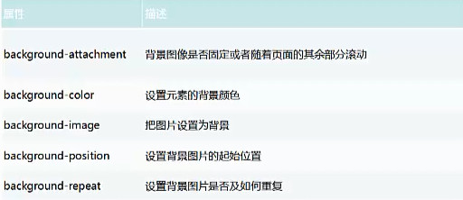
>     
> - 2 边框
> 
>     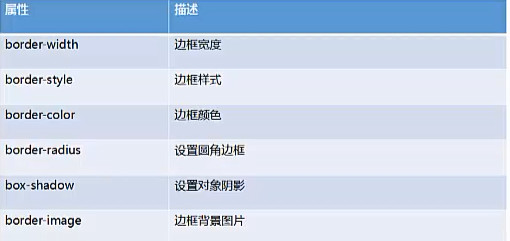
>     
> - 3 颜色
> 
>     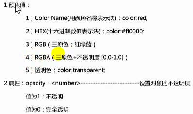
>     
> - 4 字体
> 
>     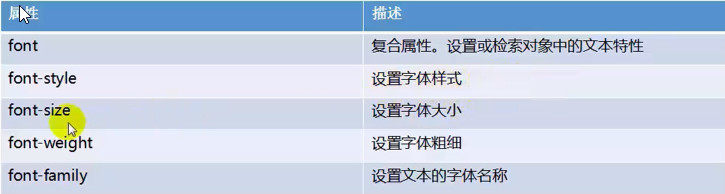
>     
> - 5 文本
> 
>     
>     
> - 6 文本装饰 
> 
>     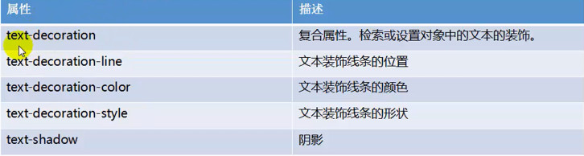 

#### 列表

【重点：】

> 只适用于类型为列表的元素，ul、ol  
> 
>    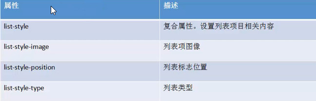 
>     
>    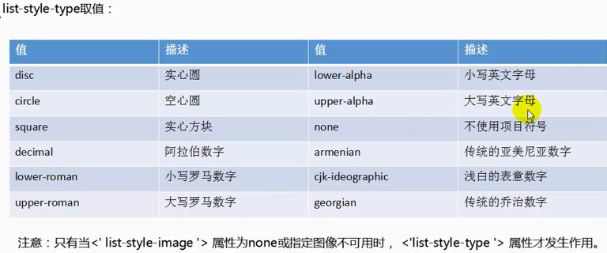  

#### 元素分类

**块级元素**

 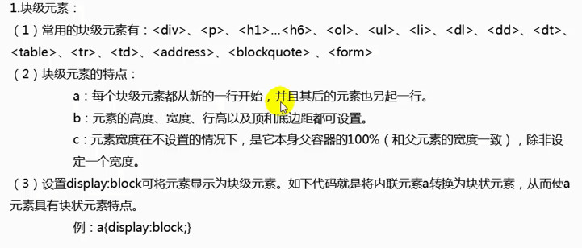  

**内联元素（行内元素）**

 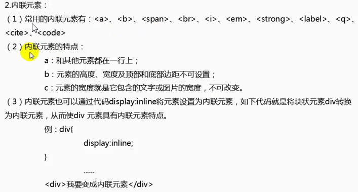  

**内联块级元素**    

  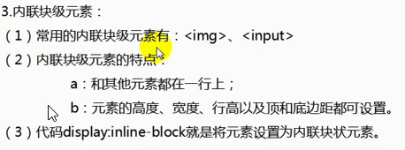  

> **四种方式的优先级**
> 
> 行内样式 》内部样式 》 外部样式 》 导入样式
> 
> 【注】：内部样式>外部式有一个前提：内部样式的位置一定在外部样式的后面！！！

### 盒子模型

盒子模型的内容包括：context、padding、border、margin

盒子模型分类：
	
	标准盒： 正常盒模、怪异盒模型
	伸缩盒：新、旧

外边距合并，取最大值。

**伸缩盒子** 操作的是父级块级

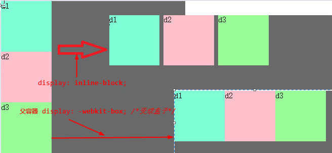 

 

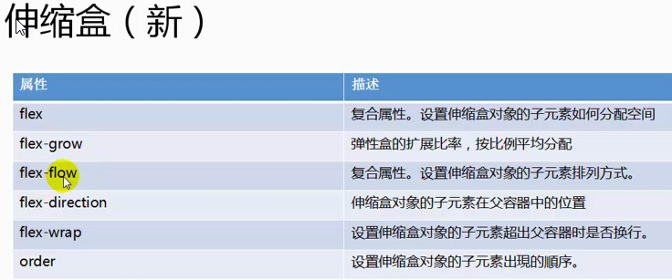 

## 02 标签、选择符、超链接及SEO

什么是css选择符？

选择符又称**选择器**，定义了将影响文档中的哪些部分

- 1、元素选择符

	- 1.1 通配符：*{ }
	
	- 1.2 类选择符：.类名称{ }

	- 1.3 id选择符：#id名称{ }

	- 1.4 类型选择符（标签选择符）：标签{ }
	
- 2、关系选择符

	- 2.1 子元素选择器： 父亲 > 父子
	
	- 2.2 兄弟选择器 你自己的~你的兄弟
	
	- 2.3 相邻选择器：E+F
	
	- 2.4 包含选择器：E F
	
	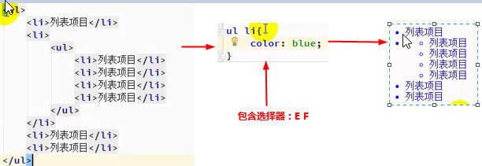
	 
- 3、属性选择符

	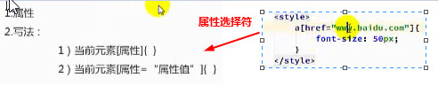

- 4、伪类选择符

	何为伪类？

	也就是实际实现了类的效果，但是并没有实际添加到标签中的类，这样的就是伪类。伪类的典型构成就是使用了（:）冒号。
	after顾名思义是在元素后面的意思，实质是在元素之后添加内容。 
	这个伪元素允许制作人员在元素内容的最后面插入生成内容，需要和content属性一起使用，设置在对象后发生的内容。默认地，这个伪元素是inline行内元素，不过可以使用属性 display 改变这一点。 
	所有主流浏览器都支持 :after 伪元素，但对于IE来说，只有IE8以上版本支持。 

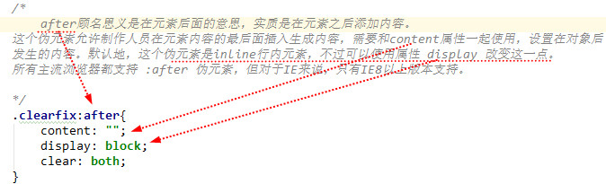

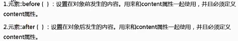

【选择器的优先级】

	！important > 内联 > ID > 类|伪类|属性选择器 > 伪对象 > 继承 > 通配符

【注意：】**！important**要写在属性值的后面，分号的前面。
	eg： p{
			color：red！important；
		}

	
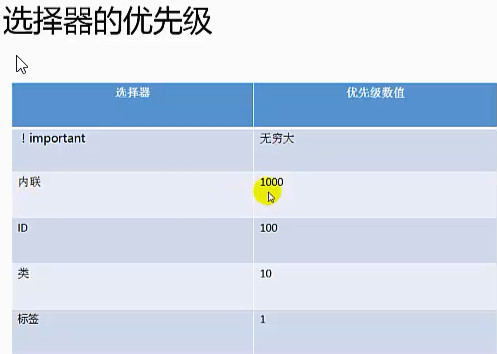

- 5、伪对象选择符

## 03 标签类型转换、样式重置

## 04 浮动原理及清浮动

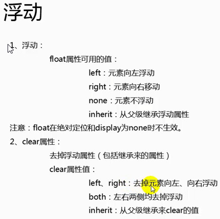

	浮动的定义：使元素脱离文档流，按照指定方向发生移动，遇到父级边界或者相邻的浮动元素停了下来。

	clear:left | right | both | none | inherit；元素的某个方向上不能有浮动元素

	clear:both;  在左右两侧均不允许浮动元素

【清除浮动】

	1.加高 
	问题：扩展性不好
	
	2.父级浮动 
	问题：页面中所有元素都加浮动，margin左右自动失效（floats bad ！）
	
	3.inline-block 清浮动方法：
	问题：margin左右auto失效；
	
	4.空标签清浮动 
	问题：IE6 最小高度 19px；（解决后IE6下还有2px偏差）

	5.br清浮动
	问题：不符合工作中：结构、样式、行为，三者分离的要求。
	
	6.after伪类 清浮动方法（现在主流方法）
	.clear:after{content:'';display:block;clear:both;}
	.clear{zoom:1;}
	
		after伪类： 元素内部末尾添加内容；
				:after{content"添加的内容";} IE6，7下不兼容
		zoom 缩放 
				a、触发 IE下 haslayout，使元素根据自身内容计算宽高。
				b、FF 不支持；

	7.overflow:hidden 清浮动方法；
		问题：需要配合 宽度 或者 zoom 兼容IE6 IE7；
	
		overflow:  scroll | auto | hidden；
			overflow:hidden;溢出隐藏（裁刀！）

		BFC (block formatting context)  标准浏览器 
			a、float的值不为none。
			b、overflow的值不为visible。
			c、display的值为table-cell, table-caption, inline-block中的任何一个。
			d、position的值不为relative和static。
		     e、width|height|min-width|min-height:(!aotu)
		
		haslayout      IE浏览器
		
		          a、writing-mode:tb-rl
		           b、-ms-writing-mode:tb-rl
		           c、zoom:(!normal)

### 【让块级元素水平排列的方法：】

- 利用float

- 使用display：inline-block，把块级元素变为内联元素

- 把块级元素变为伸缩盒，即可

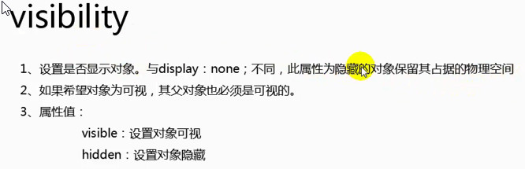

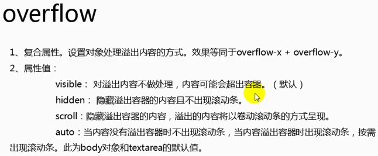

## 05 浮动问题、IE6、IE7的bug

## 06 网站结构

## 07 定位详解、层级、滤镜遮罩

1、css 定位：

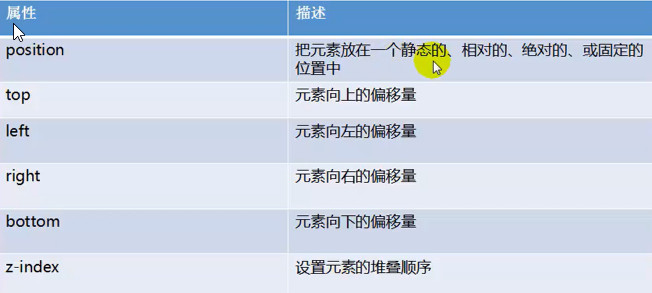

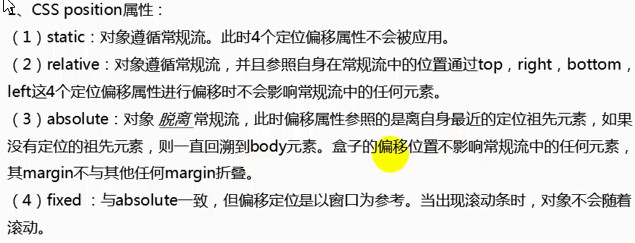

2、css定位机制：
	普通流：元素按照其在HTML中的位置顺序决定排布的过程
	浮动
	绝对布局

3、css定位属性：

## 08 表格表单及样式重置、特性

## 09 滑动门css精灵、圆角及其扩展

## 10 兼容问题

【居中方式】

- margin：0 auto；（让盒子模块居中）

- 文字居中：line-height；text-align：center；

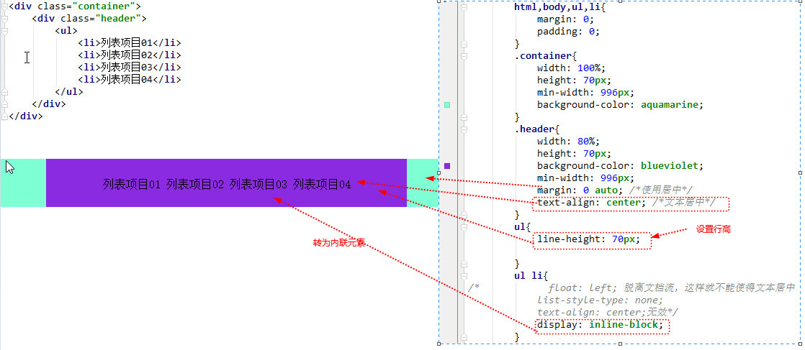

- 由table演变来的一种居中（很少用）

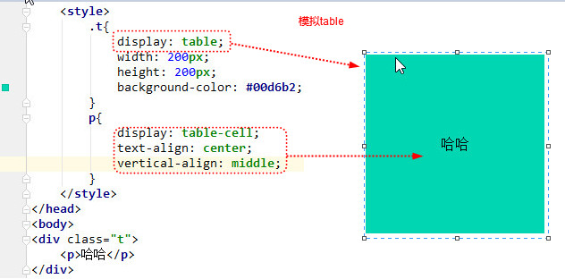

- 利用伸缩盒居中

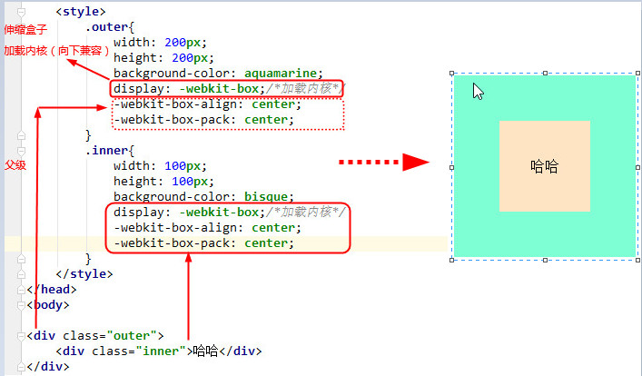

## 11 css中的层叠性及权重的比较

层叠性：多个选择器选中同一个标签，设置同一个样式，浏览器中加载时，不会加载所有的属性值，挑选其中一个加载，其中一个值层叠/覆盖掉其他的值。

要实现层叠或覆盖就涉及到比较，下面就是比较选择器之间的权重的比较，权重的比较一共有两种情况：1、选择器选中了标签；2、选择器没有选中标签

**首先说一下选择器的权重：id>class>标签>*(通配符)；**

①选择器选中了标签：

首先：如果都选中了标签，比较选择器权重。

选择器有权重，权重大的会层叠权重小的。

计算权重：选择器选择的范围越大，权重反而越小。id>class>标签>*

方法：数选择器的数量，先比较id个数→再比较class个数→最后比较标签个数。

图片中的标注顺序（id个数，class个数，标签个数）

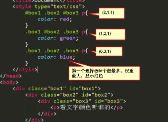

页面上显示的样式：

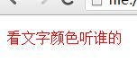

控制台显示：

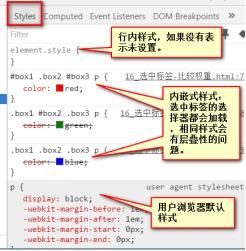

其次：如果选择器权重相同，比较css中代码的书写顺序。

css代码有加载顺序，从上往下加载，后面加载的会覆盖前面加载。
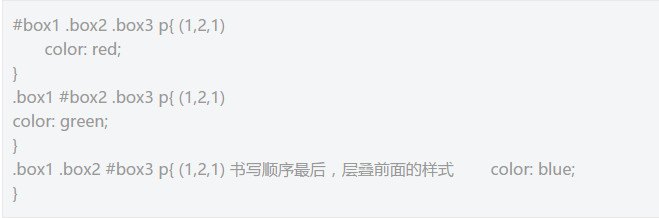

②选择器都没有选中标签：一部分样式是可以继承的。继承谁的？

首先：比较每个选择器选中的元素，距离目标元素p的在HTML中的距离，距离近的层叠距离远的。简称就近原则。
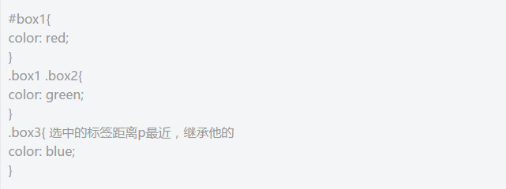

其次：如果距离一样近，比较权重，权重大的层叠权重小的。

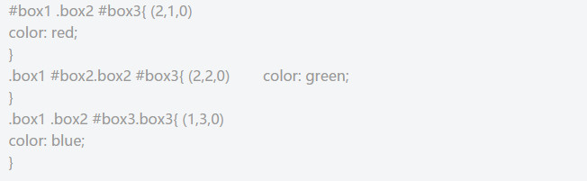

再次：如果距离一样近，选择器权重一样，看书写顺序。

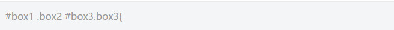

**特殊的，在比较权重的过程中，有一个单词important可以提升某一个样式属性的权重到最大。**

比较就近原则，important对继承性没影响。
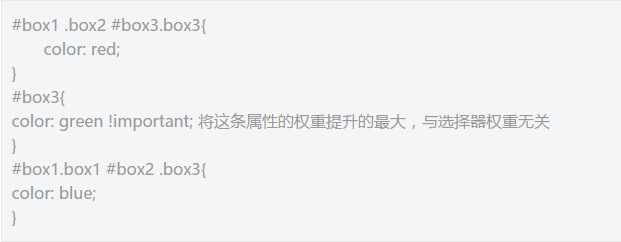
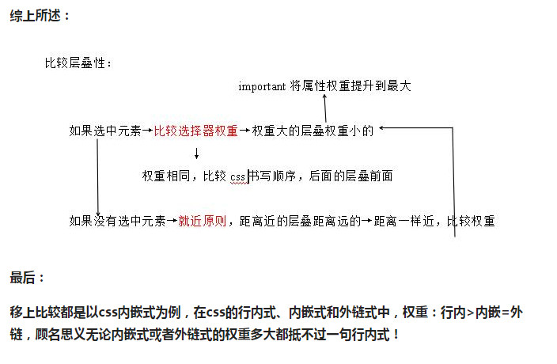

## 
