# Html基础

## 1、基本概念
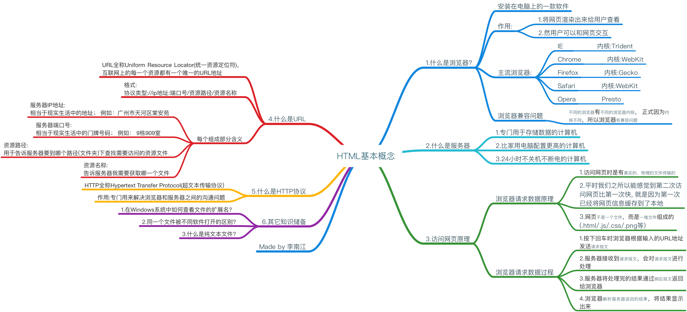

## 2、认识html
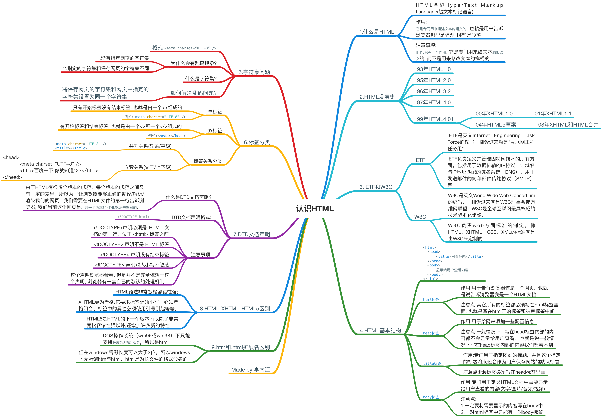

## 3、基础标签

## 4、列表标签
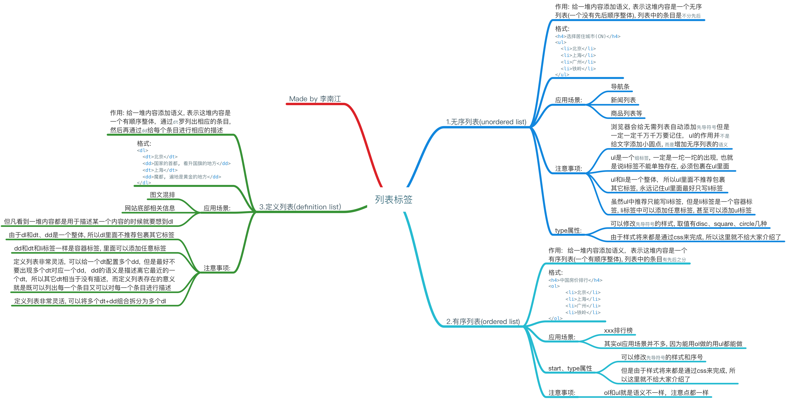

## 5、表格标签
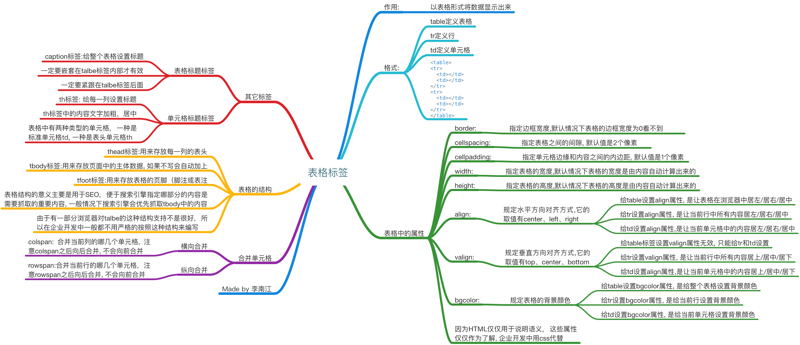

## 6、表单标签
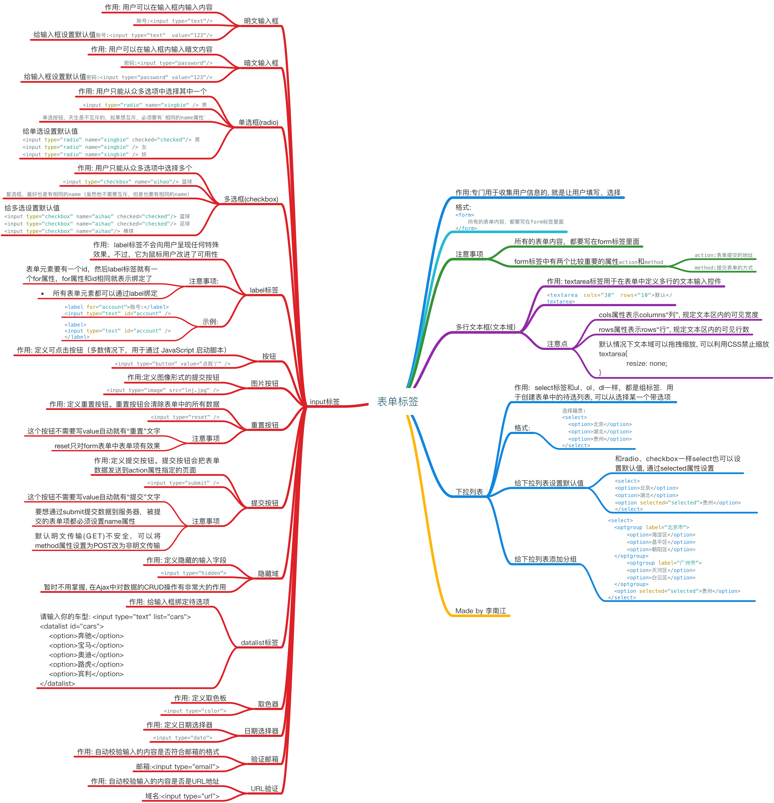

## 7、多媒体标签
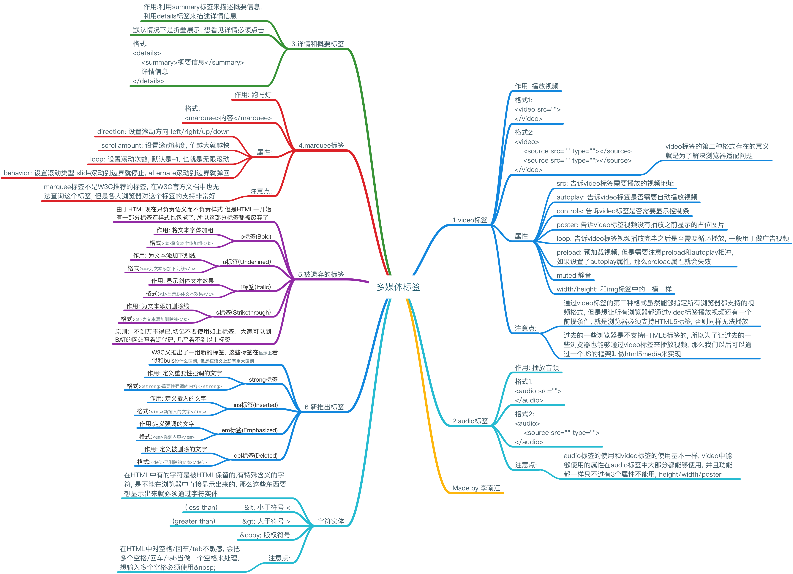

## 8、meta其他类型

## 9、体验CSS		
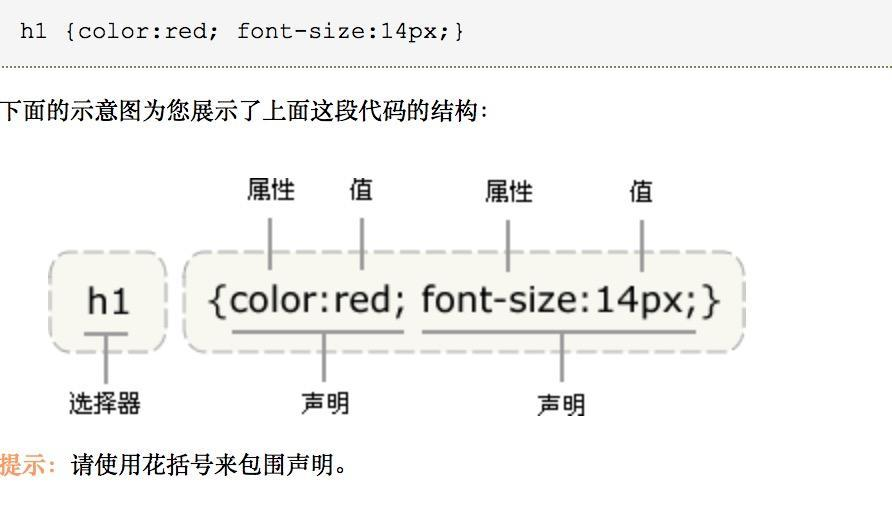

## 10、CSS常见属性
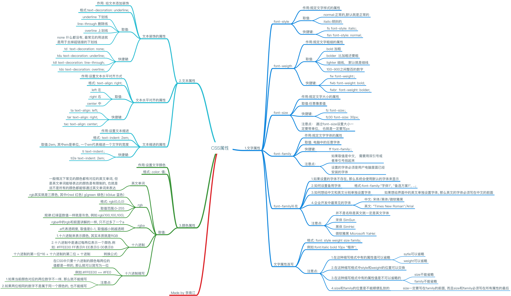

## 11、CSS选择器
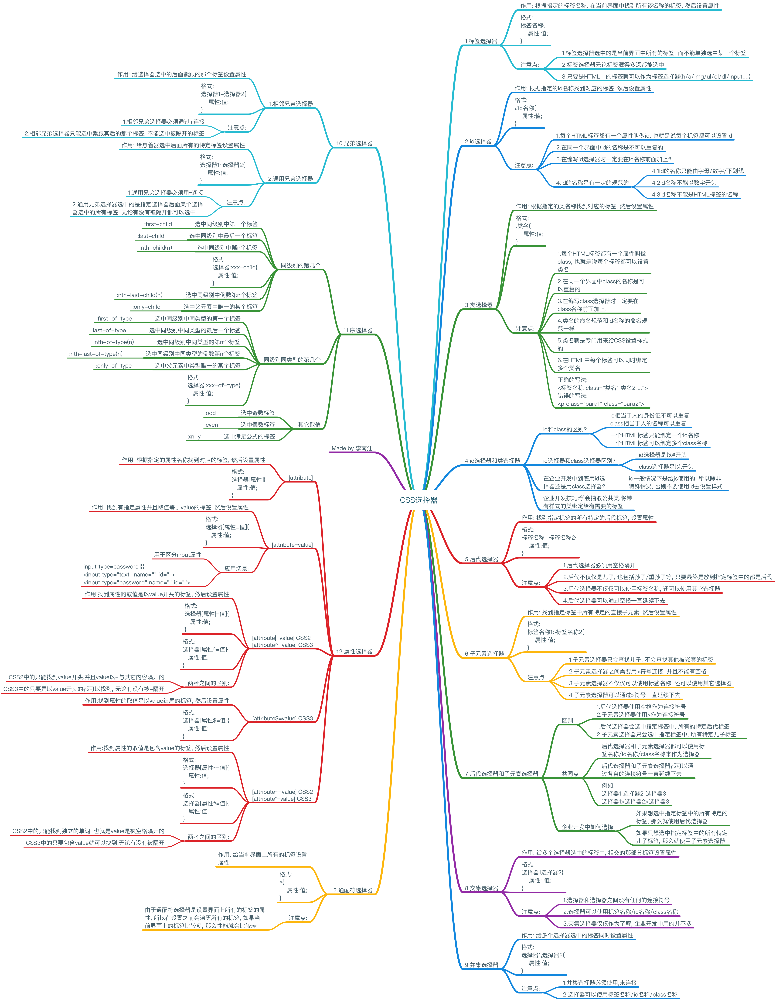

## 12、CSS三大特性
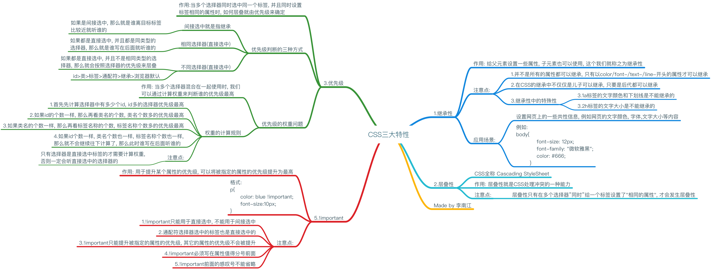

## 13、CSS显示模式
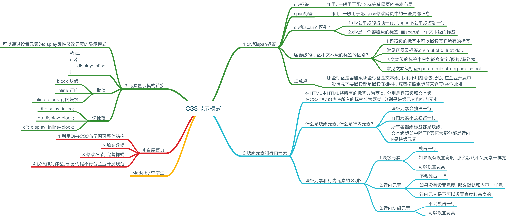

## 14、背景和精灵图
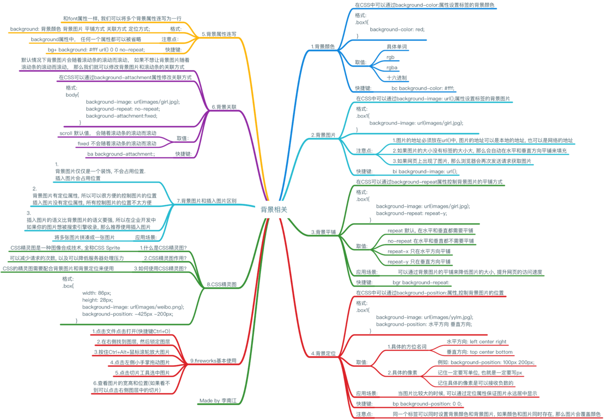

## 15、盒模型
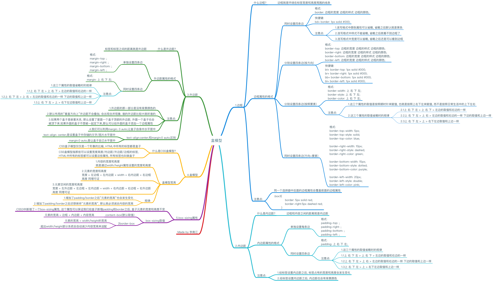

## 16、浮动流
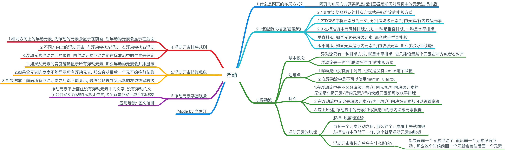

## 17、清除浮动
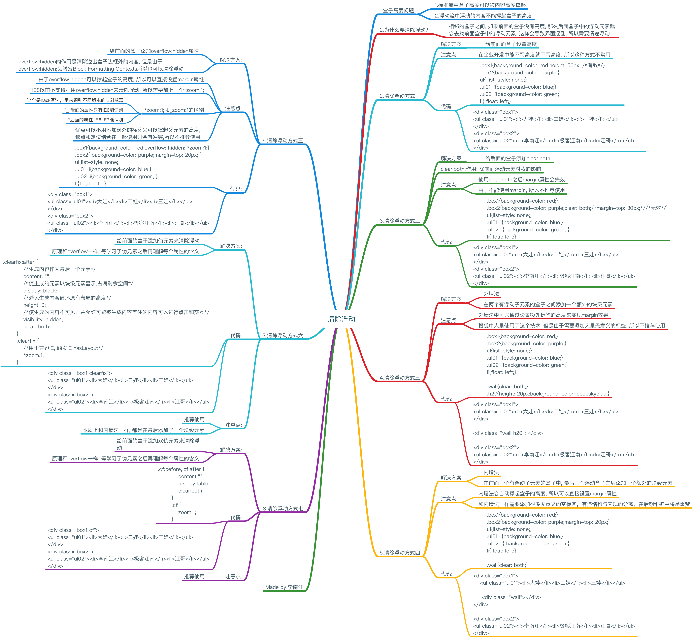

## 18、定位
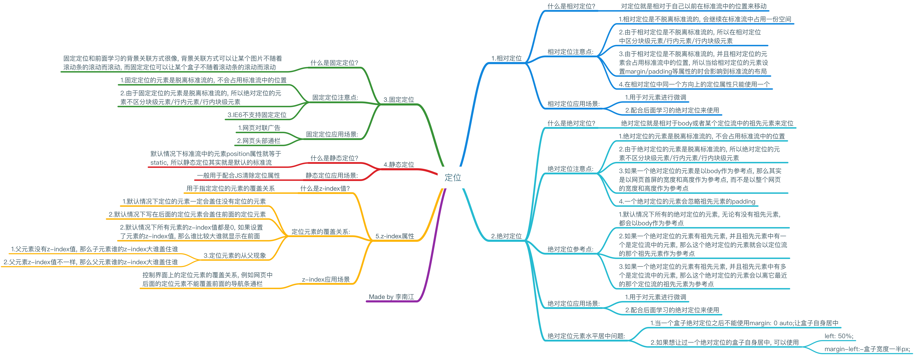

