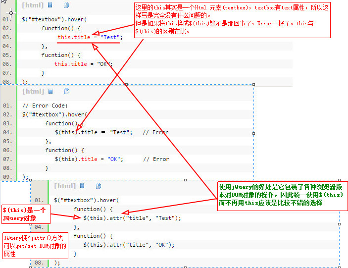

# JavaScript 

## HTML中this与JQuery中$(this)的区别

> jQuery中this与$(this)的区别




## 数组与字符串的相互转换

- 数组转字符串（需要将数组元素用某个字符连接成字符串）
```js
var a, b,c; 
a = new Array(a,b,c,d,e); 
b = a.join('-'); //a-b-c-d-e  使用-拼接数组元素
c = a.join(''); //abcde
```

- 字符串转数组 (实现方法为将字符串按某个字符切割成若干个字符串，并以数组形式返回)
```js
var str = 'ab+c+de';
var a = str.split('+'); // [ab, c, de]
var b = str.split(''); //[a, b, +, c, +, d, e]
```
## map, filter, some, every, forEach, for in, for of 用法总结

+ map (**有返回值，返回一个新的数组，每个元素为调用func的结果。**)
```js
let list = [1, 2, 3, 4, 5];
let other = list.map((d, i) => {
    return d * 2;
});
console.log(other);
// print: [2, 4, 6, 8, 10]
```
小结：map() 返回一个新的Array，每个元素为调用func的结果。

+ filter (**有返回值，返回一个符合func条件的元素数组**)
```js
let list = [1, 2, 3, 4, 5];
let other = list.filter((d, i) => {
    return d % 2;
});
console.log(other);
// print: [1, 3, 5] 
```
小结：filter() 返回一个符合func条件的元素数组


+ some (返回一个boolean，判断是否有元素符合func条件，如果有一个元素符合func条件，则循环会终止。)
```js
let list = [1, 2, 3, 4, 5];
list.some((d, i) => {
    console.log(d, i);
    return d > 3;
});
// print: 1,0 2,1 3,2 4,3
// return false
```
小结：some():返回一个boolean，判断是否有元素是否符合func条件

+ every (返回一个boolean，判断每个元素是否符合func条件，有一个元素不满足func条件，则循环终止，返回false。)
```js
let list = [1, 2, 3, 4, 5];
list.every((d, i) => {
    console.log(d, i);
    return d < 3;
});
// print: 1,0 2,1 3,2
// return false
```
小结：every():返回一个boolean，判断每个元素是否符合func条件

+ forEach (**没有返回值，只针对每个元素调用func。缺点：无法使用break，return等终止循环。**)
```js
let list = [1, 2, 3, 4, 5];
let other = [];
list.forEach((d, i) => {
    other.push(d * 2);
});
console.log(other);
// print: [2, 4, 6, 8, 10]
```

小结：forEach():没有返回值，只是针对每个元素调用func

+ for in

for-in循环实际是为循环”enumerable“对象而设计的，for in也可以循环数组，但是不推荐这样使用，
for–in是用来循环带有字符串key的对象的方法。

缺点：只能获得对象的键名，不能直接获取键值。

```js
var obj = {a:1, b:2, c:3};
for (var prop in obj) {
  console.log("obj." + prop + " = " + obj[prop]);
}
// print:  "obj.a = 1" "obj.b = 2" "obj.c = 3"
```

+ for of
for of为ES6提供，具有iterator接口，就可以用for of循环遍历它的成员。也就是说，for of循环内
部调用的是数据结构的Symbol.iterator方法。

for of循环可以使用的范围包括数组、Set和Map结构、某些类似数组的对象（比如arguments对象、
DOM NodeList对象）、后文的Generator对象，以及字符串。

