### 骨灰级程序员给公司新人总结了css所有的定位模型，一般不外传

# web前端css支持6种定位模型

静态
绝对
固定
相对
浮动
相对浮动

>设定位置

position:static;		
  可以取消元素的定位设置,使之恢复为原先在常规流中的显示方式`.static`是默认值.

position:relative;
  可以使元素相对于常规流的位置偏移一定距离.

position:absolute;
  可以使元素相对于常规流的位置或最近定位祖先元素的位置偏移一定的距离.

position:fixed;
   可以使元素相对于窗口偏移一定的距离.

z-index 可以设置元素的堆叠顺序,数值越大,元素越靠上.

> 最近定位祖先元素

1、如果设定位置的元素没有定位祖先元素,那么<body>就成为定位祖先元素,换言之,`<body>是默认设定位置元素.`

2、最近定位元素必须是有效的祖先元素(`relative|absolute|fixed`),css不支持相对于文档中任意元素进行定位的方法.

3、 `position:relative`;是一个非常好的创建定位祖先元素的方法,因为它不会离开常规流.使用这种方法,能够创建出既保持常规流又实现绝对定位的布局

> 原子显示

设定了位置的元素是原子显示的,这意味着它的静态后代元素,行内内容和背景之间不可能出现外部元素.通过使用相对定位,绝对定位和固定定位模式,就可以将元素设置为原子显示,设置为`overflow:scroll|auto`的块级元素也是原子显示的

而没设定位置的静态块级,当发生重叠时,他们的行内内容不会重叠,但是他们的边框和背景
会发生重叠,但文字不会.z-index适用于所有元素,默认auto

 * z-index不是全局属性,而是相对于设置了数字值z-index的最近定位祖先元素而定.根元素html会创建根堆叠上下文.每一个指定数字值z-index的设定位置元素都会创建一个本地的局部的堆叠上下文.
 * 静态定位元素按照文档出现顺序从后往前进行堆叠.
 * 设定位置元素忽略文档元素出现顺序,而是根据z-index值由小到大的顺序从后往前堆叠.负值的设定位置元素位于静态定位元素和非设定位置浮动元素之下
 
> web前端静态定位模型

  	position:static; 默认是static;

1、静态元素的开始位置由前一个静态元素的位置确定.静态元素的尺寸,内边距,边框,和外边距
决定了下一个元素的开始位置.		

2、相邻元素的垂直外边距会合并在一起,最终的外边距是两个相邻元素外边距的较大值

3、将左右外边距设置为auto,可以使已设定尺寸的静态块级元素居中显示.

> web前端绝对定位模型

position:absolute;百分数是相对于最近定位祖先元素的尺寸而言,而非父元素的尺寸.

将元素的left,right,top,bottom,设置为auto,可以使它恢复原先在常规流中的位置.

1、与浮动元素不同,绝对元素不会自动排列.不会受其他元素影响,也不会影响别的元素.

2、如果一个元素的所有子元素都设置为绝对定位,那么它的高度会变为0,所有它的子元素都离开了常规流.
3、如果不存在定位祖先元素,会根据<body>来定位

4、绝对定位居中,一般元素

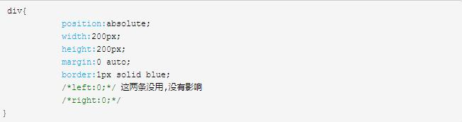

绝对定位居中,静态行内元素
* 对于静态行内元素,如`em,strong,span`等,但是不包括行内可替换元素(`input,img,textarea`等),使用绝对定位模式absolute时,width和right可以使用为了要居中,需要额外的加上`left:0;`和`right:0;`使`margin:0 auto;`可以正常的生效.

* 注意,这里left和right必须是0才行.

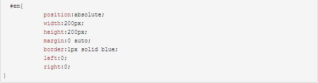

> 固定定位模型

position:fixed;可以将任意元素变为固定位置元素

切记:固定定位的元素位置是相对于窗口而定,而非相对于最近定位祖先`,而且元素不会随页面滚动而滚动.

因为它是相对页面来定位,所以不需要最近定位祖先

设置时最好以top,left来进行偏移定位,当同时设置top,left,bottom,right时,会优先使用top和left的值,只有当top和left不存在时,bottom和right才会生效

> web前端相对定位

position:relative;

 - 使用left和top来改变元素位置,left和top默认是auto,auto会使相对定位元素保持在常规流中原有位置.
使用float可以使一些元素成为浮动元素,通过relative可以浮动元素设置为相对定位,相对浮动元素仍然位于浮动元素所在的常规流中,可以使用left和top设置它在流中的偏移位置.

 - 任何元素都可以设置position:relative;从而其绝对定位的后代元素都可以相对于它进行定位.
 - 使用float:none;默认是none,可以覆盖元素的其他浮动规则,也可以避免继承浮动

使用float:left;和float:right;可以使元素离开常规流.

> web前端浮动定位与复位

- 浮动元素不会影响块级框的位置,而只影响行内元素
- clear:left;clear:right;clear;both;
- 任意元素都可以设置为浮动元素,clear适用于表格,块级元素和浮动元素
- clear 不适用于行内,绝对定位或固定定位的元素、

> web前端相对浮动定位

- 只有positon:relative;和position:static;适用于浮动元素.而设定为absolute和fixed时,显示结果是不确定的.
零散
- 在css中,如果参数值是0的话,不要加单位,
- 浏览器在渲染一个元素内容之前,会先渲染它的框,顺序是从背景颜色开始,然后是背景图片,接着是边框,最后,浏览器会在框之上渲染框的内容

## 从布局看css基础

从布局的角度来学习css的定位机制和盒子模型

问题：

1.进行css布局前为什么要学习定位机制和盒子模型？

2.在实际的工作中到会用到哪些css布局？

### css基础

#### 1、盒子模型

css是用来为页面元素添加样式的，在最开始的时候，开发网页是先将各个尺寸定下来，然后使用最传统的position/float把元素挪到对应的位置，页面上的元素就好像一个个盒子一样，很明显能够得出一个结论：盒子模型是布局的基础，所以在学习css布局前要先来学习盒子模型，盒子模型包括`content，padding，border，margin`四大部分，如下图：

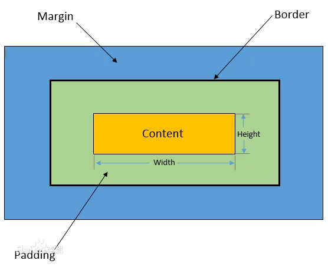

盒子模型一般分为`标准盒子模型`和`IE盒子模型`，前者由w3c规定，后者由微软规定，这两种盒子模型可以通过box-sizing来进行切换，它们最大的区别就是width属性作用的范围，标准盒子的width=content，IE盒子的width=content + padding + border，看下图：

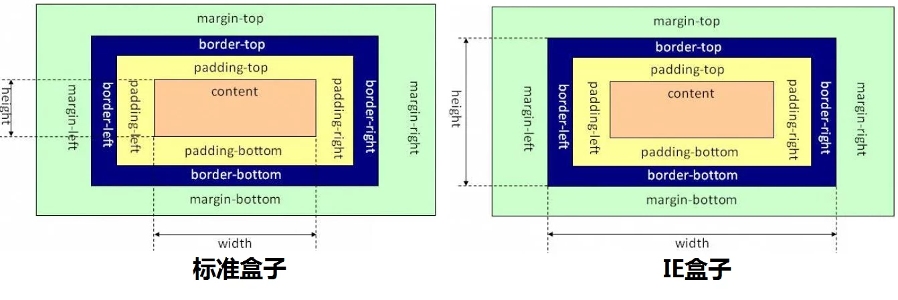

除了标准盒子和IE盒子这种分类方法，一般还将盒子模型分成块级盒子模型和行内盒子模型，这个是根据不同的display属性值划分的,下面是display的可能取值：

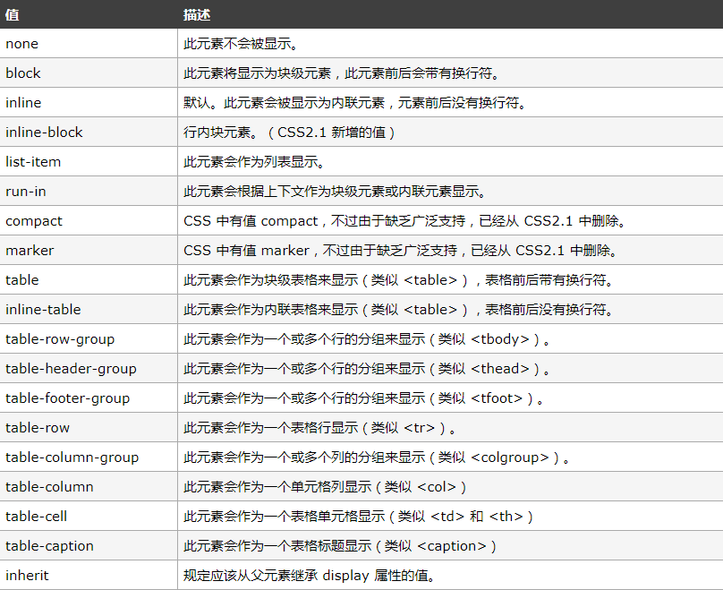

**块级盒子模型的图在上面已经贴出了，下面是行内盒子模型的图：**

##### 1.1 盒子模型的margin负值

前面说了盒子模型包括什么内容，对于任意的盒子模型来说，它的四部分内容可以给它们设值也可以不设值，这四个值中margin部分有很多可以探讨的内容，比如它可以设置负值，这一部分之所以复杂，是因为它与display的不同值混合时会有很多不同的情况，比如margin设负值后可能会带来重叠，那具体重叠的情况是怎样的？说不同的重叠情况前，先来理解一下，margin负值是什么意思？margin的值其实是相对于基线来进行移动，对于top，left方向，它们是以其他元素的边框为基线，对于right，bottom方向它们是以自身border为基线，具体看下图：

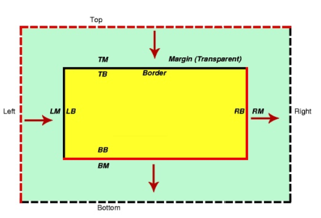

接下来看看不同的display会对margin重叠造成什么影响

1.表现（测试地址：[https://demo.xiaohuochai.site/css/margin/m999.html](https://demo.xiaohuochai.site/css/margin/m999.html)）

+ 1.1 block元素可以使用四个方向的margin值
+ 1.2 inline元素使用上下方向的margin值无效

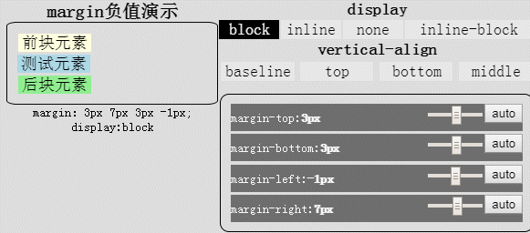

+ 1.3 inline-block使用上下方向的margin负值看上去无效

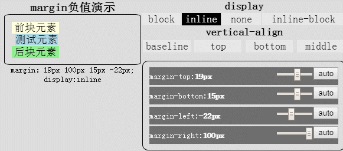

2.重叠（测试地址：[https://demo.xiaohuochai.site/css/margin/m100.html](https://demo.xiaohuochai.site/css/margin/m100.html)）

+ 2.1 两个block元素重叠时，后面元素可以覆盖前面元素的背景，但无法覆盖其内容

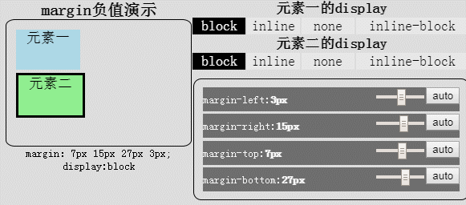

+ 2.2 当两个inline元素，或两个line-block元素，或inline与inline-block元素重叠时，后面元素可以覆盖前面元素的背景和内容

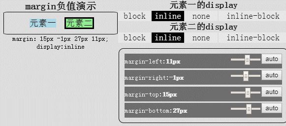

+ 2.3 当inline元素(或inline-block元素)与block元素重叠时，inline元素(或inline-block元素)覆盖block元素的背景，而内容的话， 后面的元素覆盖前面的元素

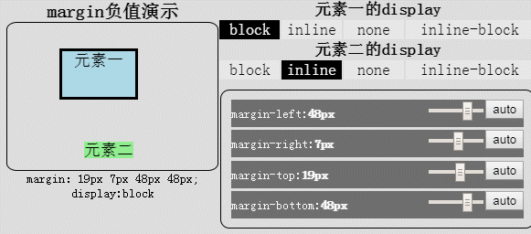

3.浮动（测试地址：[https://demo.xiaohuochai.site/css/margin/m111.html](https://demo.xiaohuochai.site/css/margin/m111.html)）

+ 3.1 block元素与浮动元素重叠时，其边框和背景在该浮动元素之下显示，而内容在浮动元素之上显示

+ 3.2 inline或inline-block元素与浮动元素重叠时，其边框、背景和内容都在该浮动元素之上显示

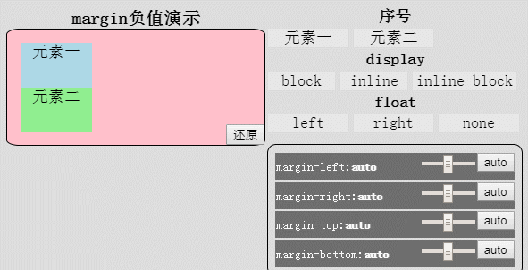

4、定位（测试地址：https://demo.xiaohuochai.site...）

+ 4.1 定位元素(position不为static)覆盖其他元素的背景和内容

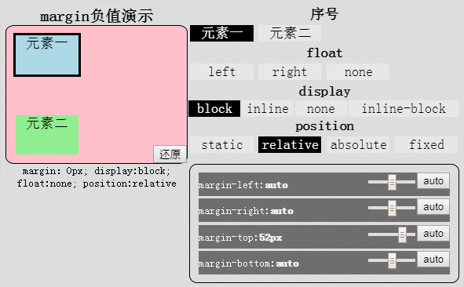

+ 4.2 将relative属性值应用于inline元素，由于无法改变其行内元素的本质，所以其上下margin依然存在问题

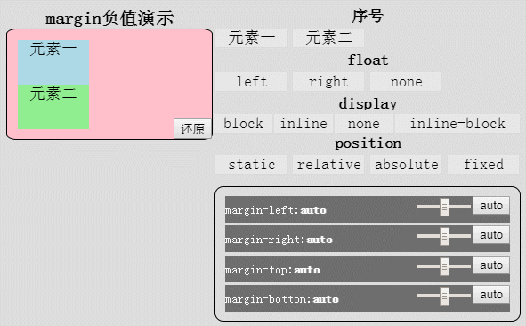

##### 1.2 盒子模型的边距合并

margin合并（collapse）是指块级元素的上外边距与下外边距有时会合并为单个外边距,这种现象只发生在和当前文档流方向的相垂直的方向上，它分为同级元素和父子元素两种，首先是同级元素。

##### 1.3 盒子模型的margin居中

最后这个比较简单，是在布局中常用的一种水平居中的方法，当页面元素的宽度是确定的值的时候，设置`margin：0 auto；`元素会进行居中，这是因为auto代表左右自适应

[详见：https://segmentfault.com/a/1190000019134379](https://segmentfault.com/a/1190000019134379)