017 【李文浩】css实战笔记

[https://css-tricks.com/](https://css-tricks.com/)

[https://docs.segmentfault.com](https://docs.segmentfault.com)

[https://www.w3cplus.com/](https://www.w3cplus.com/)

[https://developer.mozilla.org/zh-CN/](https://developer.mozilla.org/zh-CN/)

## 1、为什么使用line-height？height VS line-height

 height：元素的高度
 line-height：行高。凡是有inline-block元素的地方就会有line-height的存在
    
 height =line-height时，表示这个元素内写的这一行字已经把元素占满了

## 2、使用float和clear属性的一些重要准则

## 3、div VS span

div 和 span 都没有具体的含义，存在就是为了css样式。

div：块级元素。实际上就是一个区域,主要用于容纳其他标签,默认的display属性是block。<font size=3 face="黑体" color=red>可以通过css设置width、height、内边距、外边距，其设置结果影响文档流布局效果</font>

sapn：  内联元素。主要用于容纳文字,默认的display属性是inline。恰恰相反，<font size=3 face="黑体" color=red>内联元素设置width、height、padding-top、padding-botttom、margin-top、margin-bottom等是无效的</font>,但是 <font size=3 face="黑体" color=green>例外就是img、input是可以设置这些属性。</font>

> 延伸知识点1：块级元素和内联元素，通过属性	`display`相互转换。   

** `<div style="display:inline">   -- > 转为内联元素` **

** `<span style="display:block">   -- > 转为块级元素` **

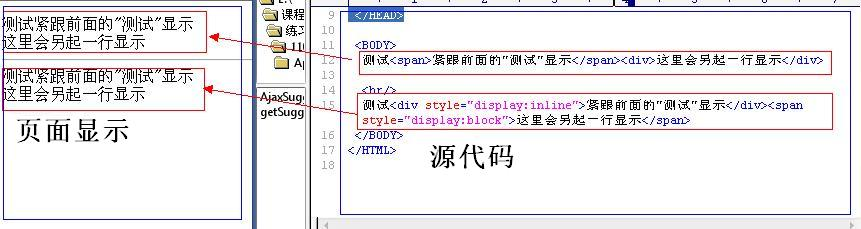

转换

- 块级元素默认display:block;<font size=3 face="黑体" color=red> 行内非替换元素(a,span)默认display:inline;行内替换元素(inpput)默认display:inline-block;</font>
- display:none; 不显示该元素，也不会保留钙元素原先占用的文档流位置。
- display:block;转化为块级元素。
- display:inline;转化为行内元素。
- display:inline-block;转化为行内块级元素。
- float：把行内元素设置完float:left/right后，该行内元素的display属性被赋予block值，且拥有浮动特性。
- position：把行内元素设置为position:absolute/fixed后，都会使原先的行内元素变为块级元素。

PS:	设置float和positon会有其他的副作用

> 延伸知识点2:什么时候使用span？   

&emsp;&emsp;在同一行中，想对其中 `文字` 或 `图片`设置样式，而又不要该行文本换行的条件下，使用span标记。    
亦可以这样理解：div 一般用于排版，而 span 一般用于局部文字的样式。

> 延伸知识点3: inline-block 和 block的区别？

&emsp;&emsp; span 可以使用 `inline-block` 和 `block` 来模拟块级元素，然后设置框高等。

<font size=3 face="黑体" color=red> 特别的通过 `float` 后的元素display会更改为block,这一点尤其重要。同理，把行内元素置为 `position:absolute/fixed` 后，都会使原先的行内元素变为块级元素</font>


> 延伸知识点4: 什么是非替换和替换元素？

替换元素： 是浏览器根据其标签的元素与属性来判断显示具体的内容。这些元素往往没有实际内容，即是一个空元素。

比如：`<input /> type="text"` 的是，这是一个文本输入框，换一个其他的时候，浏览器显示就不一样

(X)HTML中的`、<input>、<textarea>、<select>、<object>`都是替换元素，这些元素都没有实际的内容。

非替换元素： (X)HTML 的大多数元素是不可替换元素，他们将内容直接告诉浏览器，将其显示出来。

## 4、CSS浮动及溢出处理

## 5、制作菜单栏

- 如何用CSS制作横向菜单
 
完整code：html

```html
	<div class="test">
	 <ul>
		<li><a href="1">首页</a></li>
		<li><a href="2">产品介绍</a></li>
		<li><a href="3">服务介绍</a></li>
		<li><a href="4">技术支持</a></li>
		<li><a href="5">立刻购买</a></li>
		<li><a href="6">联系我们</a></li>
	 </ul>
	</div>
```
 
完整code：css
```css
	.test ul{list-style:none;}
	.test li{float:left;width:100px;background:#CCC;margin-left:3px;line-height:30px;}
	.test a{display:block;text-align:center;height:30px;}
	.test a:link{color:#666;background:url(arrow_off.gif) #CCC no-repeat 5px 12px;text-decoration:none;}
	.test a:visited{color:#666;text-decoration:underline;}
	.test a:hover{color:#FFF; font-weight:bold;text-decoration:none;background:url(arrow_on.gif) #F00 no-repeat 5px 12px;}
```


## 6、制作下拉选择框(使用其他标签模拟select)

原生的select，兼容性差。


## 7、img -- 奇葩

<h4 style="color:red;">a嵌套img标签的问题</h4>

a 标签是内联元素，默认样式是`display：inline`

> a标签中嵌套img时，img默认会有1px的border，需要在CSS中加入a img {border:none;}。


> a标签中嵌套img时，必须有<font color=red>`a{ dispaly:block; }` </font>否则在IE6下将影响布局（即在图片下方多出一部分空白）。

> - `<a>`标签不能包含其他`<a>`标签
> - `<pre>`标签不能包含`,<object>,<big>,<samll>,<sub>和<sup>`标签
> - `<button>`标签不能包 含`<input>,<select>,<textarea>,<label>,<button>,<form>,<fieldset>,<iframe> 和<isindex>`标签
> - `<label>`标签不能包含其他`<label>`标签
> - `<form>`标签不能包含其他`<form>`标签,form元素不能够直接包含input元素。原因在于input元素属于行内元素，form元素仅仅能够包含块状元素

## 9、盒子模型

> 标准盒子

  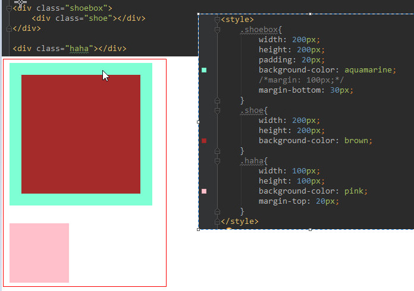

> 怪异盒子

  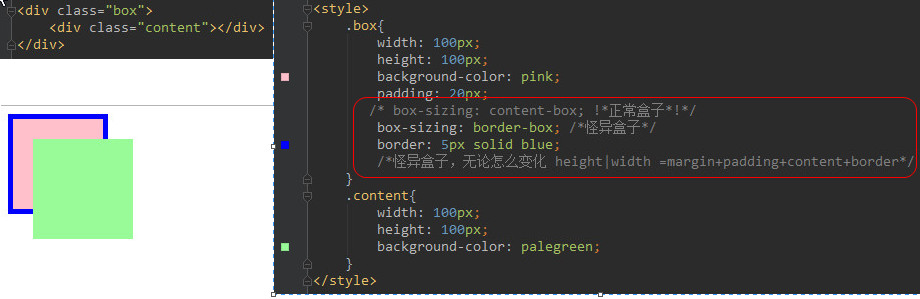

> 伸缩盒子

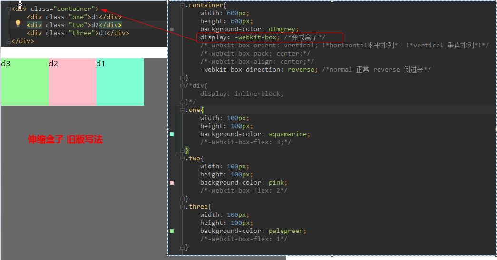

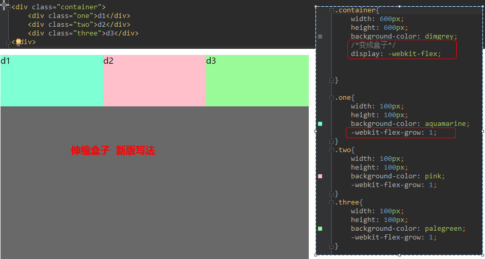

> **延伸知识点：传统的盒子模型 VS box-sizing盒子**

- **传统盒模型**
   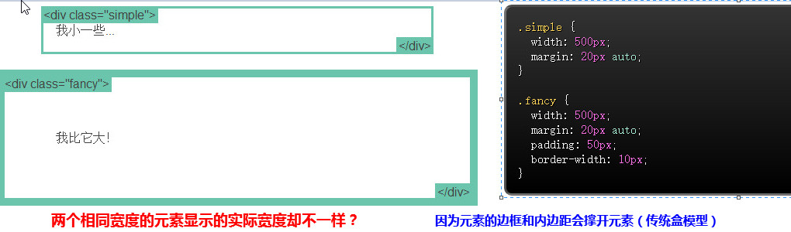
- **新盒模型（box-sizing盒子**
   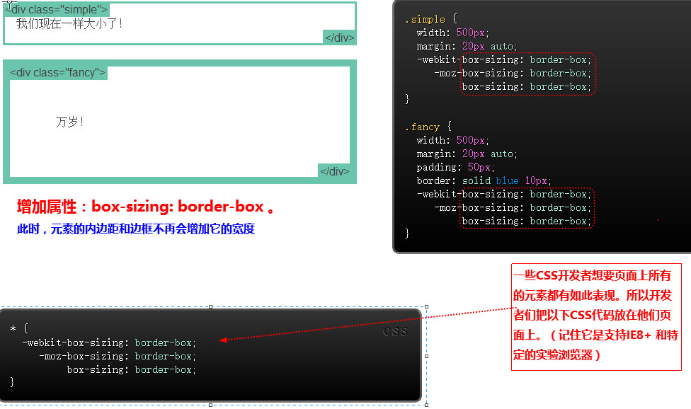


## 10、让块级元素水平排列的方法（3种解决方案）

- 利用float

- 使用display：inline-block，把块级元素变为内联元素

- 把块级元素变为伸缩盒，即可

## 11、清除浮动的9种方案（权衡利弊）

- 1、 方案一： clear 清除浮动（添加空div）
   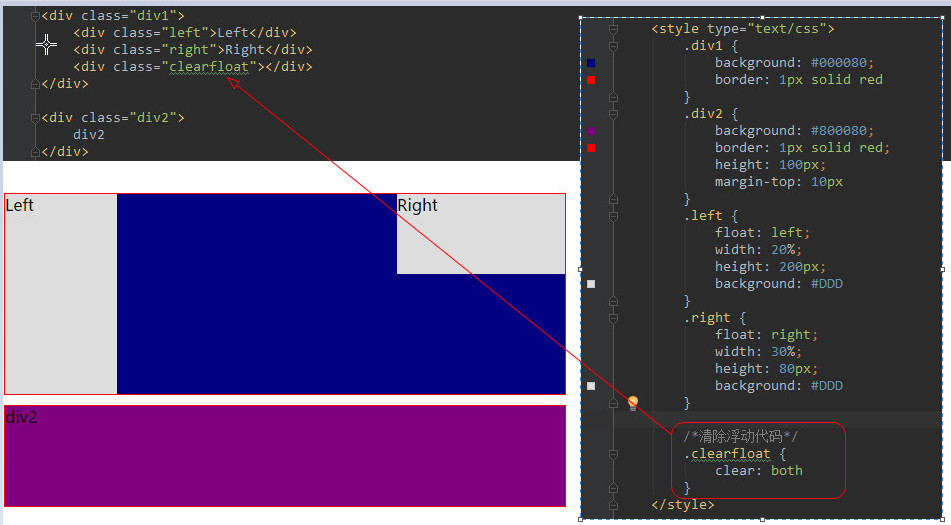

   在浮动元素下方添加空div，并给该元素写css样式：{ clear：both；height:0;overflow:hidden;}

   原理： 添加一个空div，利用css提高的clear:both清除浮动，让父级div能自动获取到高度 

   <font size=3 face="黑体" color=green>优点：简单、代码少、浏览器支持好、不容易出现怪问题 </font>
	
   <font size=3 face="黑体" color=red>缺点：不少初学者不理解原理；如果页面浮动布局多，就要增加很多空div，让人感觉很不好 </font>
	
   <font size=3 face="黑体" color=blue>建议：不推荐使用，但此方法是以前主要使用的一种清除浮动方法 </font>

- 2、 方案二： 给浮动元素父级**设置高度**  
  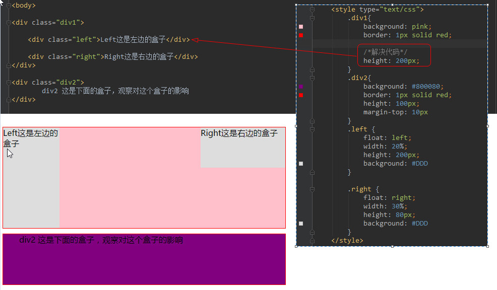

   我们知道了高度塌陷是因为给浮动元素的父级高度是自适应导致的，那么我们给它的设置适当的高度就可以解决这个问题了。

   原理：父级div手动定义height，就解决了父级div无法自动获取到高度的问题。 （这就是一个假象的高度撑起来）
   
   <font size=3 face="黑体" color=green>优点：简单、代码少、容易掌握 </font>

   <font size=3 face="黑体" color=red>
 缺点：在浮动元素高度不确定的时候不适用。
  只适合高度固定的布局，要给出精确的高度，如果高度和父级div不一样时，会产生问题	
</font>

   <font size=3 face="黑体" color=blue>建议：不推荐使用，只建议高度固定的布局时使用 </font>


- 3、方案三： 以浮制浮（**父级同时浮动**） --尽量不要用

   就是**让浮动元素的父级也浮动**，父级div 也一起浮动 
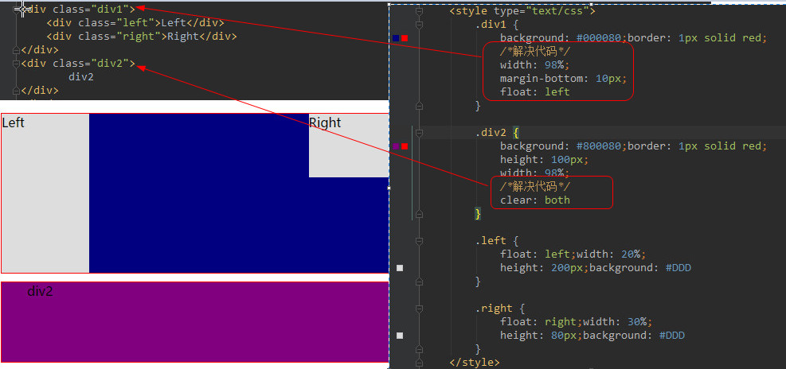
原理：所有代码一起浮动，就变成了一个整体 ，没多少人真的这么干

<font size=3 face="黑体" color=green>优点：没有优点 </font>

<font size=3 face="黑体" color=red>缺点：需要给每个浮动元素父级添加浮动，浮动多了容易出现问题。页面中所有元素都加浮动，margin左右自动失效缺。会产生新的浮动问题。 </font>

<font size=3 face="黑体" color=blue>建议：不推荐使用，只作了解。 </font>

- 4、方案四： **父级设置成inline-block**

   <font size=3 face="黑体" color=red>缺点：父级的margin左右auto失效，无法使用margin: 0 auto;居中了</font>

- 5、方案五： br 清浮动 （即：结尾处加 br标签 clear:both ）

```
	<div class="box">
	    <div class="top"></div>
	    <br clear="both" />
	</div>
```

   br 标签自带clear属性，将它设置成both其实和添加空div原理是一样的。
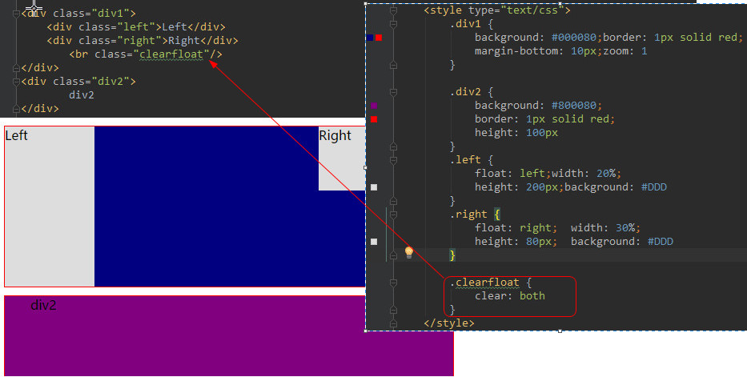
   原理：父级div定义zoom:1来解决IE浮动问题，结尾处加 br标签 clear:both 

<font size=3 face="黑体" color=red>缺点：不符合工作中：结构、样式、行为，三者分离的要求。</font>

<font size=3 face="黑体" color=blue>建议：不推荐使用，只作了解。</font>

- 6、方案六： 给父级添加 `overflow:hidden` 清浮动方法(即：父级div定义 overflow:hidden )

   `问题：需要配合 宽度 或者 zoom 兼容IE6 IE7；`
  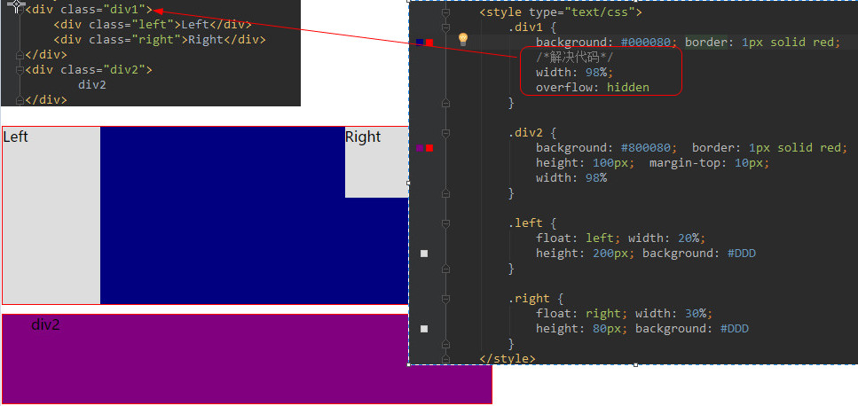

```    
overflow: hidden;
*zoom: 1;
```    
    
```
overflow:  scroll | auto | hidden；
		overflow:hidden;溢出隐藏（裁刀！）

BFC (block formatting context)  标准浏览器 
	a、float的值不为none。
	b、overflow的值不为visible。
	c、display的值为table-cell, table-caption, inline-block中的任何一个。
	d、position的值不为relative和static。
	e、width|height|min-width|min-height:(!aotu)
	
haslayout      IE浏览器

           a、writing-mode:tb-rl
           b、-ms-writing-mode:tb-rl
           c、zoom:(!normal)
```

原理：必须定义width或zoom:1，同时不能定义height，使用overflow:hidden时，浏览器会自动检查浮动区域的高度 

<font size=3 face="黑体" color=green>优点：简单、代码少、浏览器支持好 </font>

<font size=3 face="黑体" color=red>缺点：不能和position配合使用，因为超出的尺寸的会被隐藏。</font>

<font size=3 face="黑体" color=blue>建议：只推荐没有使用position或对overflow:hidden理解比较深的朋友使用。 </font>

- 7、方案七：父级div定义 overflow:auto 
  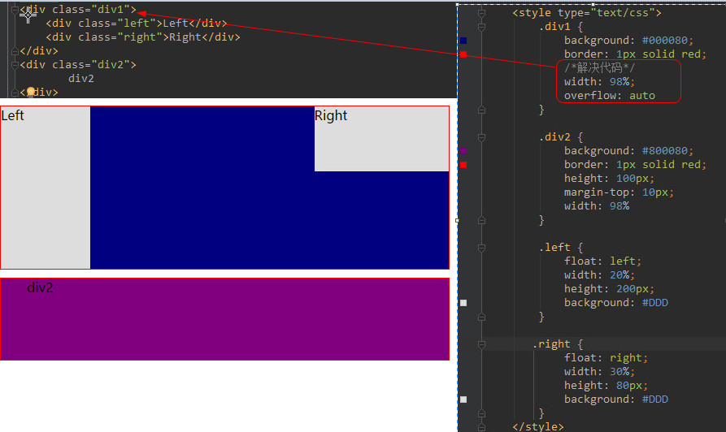

原理：必须定义width或zoom:1，同时不能定义height，使用overflow:auto时，浏览器会自动检查浮动区域的高度 

<font size=3 face="黑体" color=green>优点：简单、代码少、浏览器支持好</font> 

<font size=3 face="黑体" color=red>缺点：内部宽高超过父级div时，会出现滚动条。 </font>

<font size=3 face="黑体" color=blue>建议：不推荐使用，如果你需要出现滚动条或者确保你的代码不会出现滚动条就使用吧。 </font>

- 8、方案八：父级div定义 display:table 
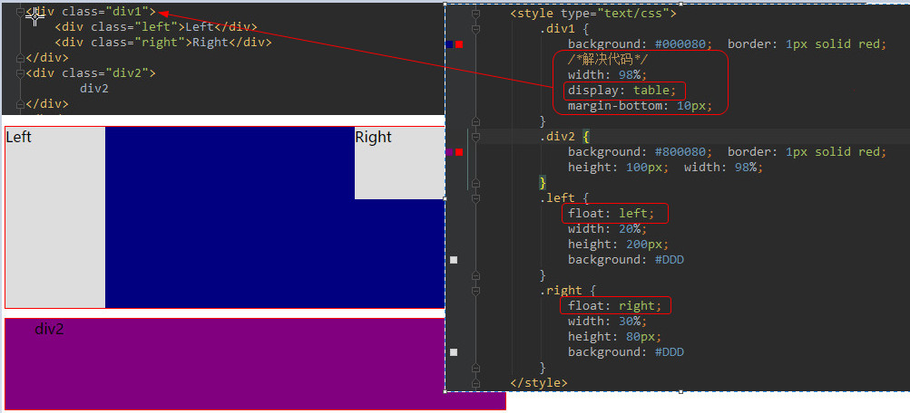
原理：将div属性变成表格 

<font size=3 face="黑体" color=green>优点：没有优点 </font>

<font size=3 face="黑体" color=red>缺点：会产生新的未知问题。 </font>

<font size=3 face="黑体" color=blue>建议：不推荐使用，只作了解。</font> 

- 9、方案九：万能清除法 **after伪类** 清浮动（<font color=red>现在**主流**方法，**推荐使用**</font>）
	
   父级div定义 伪类:after 和 zoom
  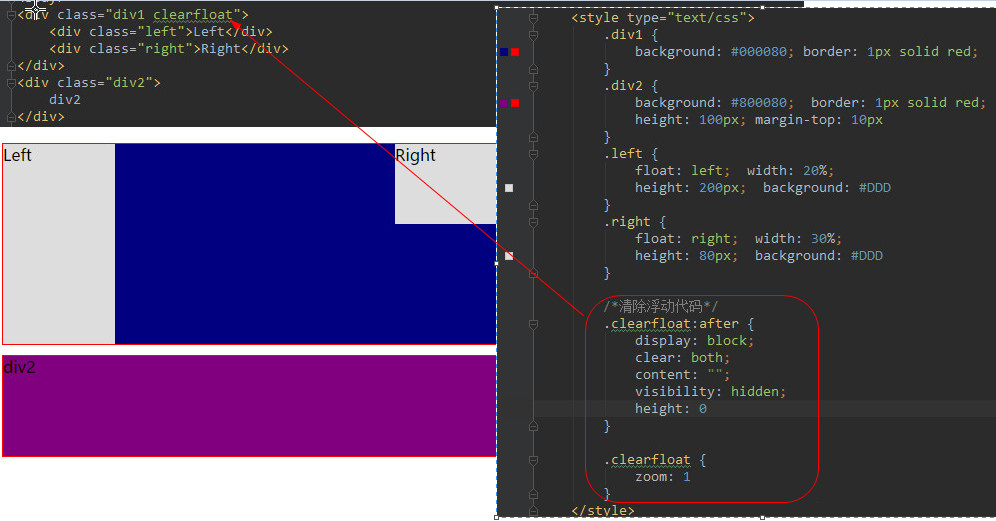

```
选择符:after{
            content:".";
            clear:both;
            display:block;
            height:0;
            overflow:hidden;
            visibility:hidden;
         }
```

同时为了兼容 IE6，7 同样需要配合zoom使用例如：

```
.clear:after{
	content:'';
	display:block;
	clear:both;
	height:0;
	overflow:hidden;
	visibility:hidden;
}
.clear{zoom:1;}
```

需要注意的东西：

```
after伪类： 元素内部末尾添加内容；
    :after{content"添加的内容";} IE6，7下不兼容

zoom 缩放 
    a、触发 IE下 haslayout，使元素根据自身内容计算宽高。
    b、FF 不支持；
```
	
**原理：IE8以上和非IE浏览器才支持:after，原理和方法2有点类似，zoom(IE转有属性)可解决ie6,ie7浮动问题 **

<font size=3 face="黑体" color=green>优点：浏览器支持好、不容易出现怪问题（目前：大型网站都有使用，如：腾迅，网易，新浪等等） </font>

 <font size=3 face="黑体" color=red>缺点：代码多、不少初学者不理解原理，要两句代码结合使用才能让主流浏览器都支持。 </font>

<font size=3 face="黑体" color=blue>建议：推荐使用，建议定义公共类，以减少CSS代码。</font> 

13、理解伪类元素

典型的两个伪元素（:before 和 :after）

简而言之，伪元素将会在内容元素的前后插入额外的元素。

`::before和::after必须配合content属性来使用。`

14、使用:not(:last-of-type)简化

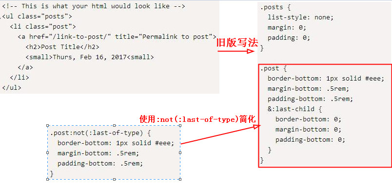


## 导航栏制作的几种方法与常见问题解决

1、直接使用html5中的导航栏标签`<nav></nav>`

```html
<!DOCTYPE html>
<html>
	<head>
		<meta charset="UTF-8">
		<title>导航栏</title>
	</head>
	<body>
		<nav>
			<a href="#">首页</a>
			<a href="#">新闻</a>
			<a href="#">关于我们</a>
		</nav>
	</body>
</html>
<!--可以根据实际需要，去除下划线和颜色等等-->
```

2、可以使用无序列表`<li>`，去除它的默认样式设置浮动就可以了

```html
<!DOCTYPE html>
<html>
	<head>
		<meta charset="utf-8" />
		<title></title>
		<style>
			ul{
				height: 100px;
				width:100%;
				list-style-type: none; //取消无序列表的固定样式
			}
			ul li{
				float:left;
				margin: 20px;  //设置三个元素的外间距
			}
		</style>
	</head>
	<body>
		<ul>
			<li><a href="">首页<a></li>
			<li><a href="">新闻<a></li>
			<li><a href="">关于我们<a></li>
		</ul>
		
	</body>
</html>
```

3、设置超链接

在这里还想说的是，`<ul>`的子集元素只能是`<li>`,不可以是别的，HTML的语义很弱，标签的使用很重要，在实际的网页开发中，不同标签的语义，权重都不一样，所以，优化也不一样。

4、使用bootstrap

```html
<!DOCTYPE html>
<html>
	<head>
		<meta charset="utf-8" />
		<title>bootstrap的学习</title>
		<!--导入基本样式-->
		<link style="text/css" rel="stylesheet" href="css/bootstrap.css">  
		<!--导入基本样式的压缩-->
		<link style="text/css" rel="stylesheet" href="css/bootstrap.min.css">
		<!--导入主题样式  注意：顺序 不可变-->
		<link style="text/css" rel="stylesheet" href="css/bootstrap-theme.css">
	</head>
	<body>
		<!--类nav清除列表的默认样式  nav-tabs定义tabs的标题栏-->
			<ul class="nav nav-tabs">
				<li><a href="#tab2" data-toggle=tab">首页</a></li>
				<li><a href="#tab2" data-toggle=tab">关注</a></li>
				<li><a href="#tab2" data-toggle=tab">个人中心</a></li>
			</ul>
 
	</body>
</html>
```

**总结：**

+ 标签式导航（即Tab式导航）
   + 顶部标签式导航
   + 底部标签式导航
   + 舵式导航（底部扩展式导航）
   + 双导航模式

+ 抽屉式导航

+ 跳板式导航（快速启动/宫格导航）

+ 列表式导航
   + 标题式导航
   + 内容式导航
   + 嵌入式导航

+ 悬浮icon式导航

## 导航菜单的制作：

①垂直菜单

1) 用无序列表构造

`<ul><li><a>导航</a></li></ul>`

清除圆点：`list-style:none`

清除下划线：`text-decoration：none`

定义的关键是将`<a>`标签设置为块元素，增加hover的效果。
``css
ul li a{display:block;}
a:hover{}
```
增加菜单的交互效果。

**延伸回顾：** 

块级元素(block)的特点:

+ 1 每个块级元素都会独自霸道一行。
+ 2 元素的高，宽，行高以及顶和底边距都可以设定。
+ 3 宽度不设置时，与父元素一致。

内联元素(inline)的特点:

+ 1 与其他元素在同一行上。
+ 2 元素的高，宽，行高以及顶和底边距都不可以设定。
+ 3 元素的宽度不可以改变。
   
内联块状元素(block-inline)特点:

+ 1 与其他元素在同一行上。
+ 2 元素的高，宽，行高以及顶和底边距都可以设定。

②水平菜单

在垂直菜单的基础上对li进行浮动
 ```css
li{
         float:left
   }
 ```

③圆角菜单

在水平菜单的基础上有两种方法：

+ 1.为ul增加一个border-bottom，再为`a`标签增加一个圆角的图片背景。移动背景：background-position：
+ 2.使用border-radius。


## 经典问题：三栏布局、负margin、清除浮动、居中布局、响应式设计、Flexbox布局

**圣杯布局：父盒子包含三个盒子（左、中、右）**

* 中间盒子的宽度设置为` width: 100%; `独占一行；
* 使用负边距(均是 `margin-left`)把左右两边的盒子都拉上去和中间盒子同一行；
  * `.left {margin-left:-100%;} ` 把左边的盒子拉上去
  * `.right {margin-left：-右边盒子宽度px;} `把右边的盒子拉上去

* 父盒子设置左右的 padding 来为左右盒子留位置；
* 对左右盒子使用相对布局来占据 padding 的空白，避免中间盒子的内容被左右盒子覆盖；

**双飞翼布局:父盒子包含三个子盒子（左，中，右），中间的子盒子里再加一个子盒子。**

* 中间盒子的宽度设置为` width: 100%; `独占一行；
* 使用负边距(均是` margin-left`)把左右两边的盒子都拉上去和中间盒子同一行；
* 在中间盒子里面再添加一个 div，然后对这个 div 设置` margin-left `和` margin-right`来为左右盒子留位置；

**布局需要会的套路**


**居中需要会的套路**

一般在内部元素用padding就可以垂直居中.很少遇到父元素宽高固定的情况,因为父元素总是被子元素撑开,如果父元素宽高固定,说明代码写的不好,尽量避免.

**把外面的高度固定,然后再去修改里面的元素,特别傻**,一定要从里往外写,比如给里面的元素加padding,撑开父元素,用来垂直居中(如果要inline完全居中,左右居中用`text-align:center`,然后用上下居中用padding来撑开)

<font color=red>只要记住这两种居中,可以适用于一切工作中的垂直居中,其他的都是炫技.</font>


**巧用工具:**

谷歌搜索`CSS3 Generator`

比如搜索`box-shadow generator`,`渐变Generator`.


## CSS3 - 页面开发首先清除外边距、内边距（margin,padding设为0）

建议给html页面创建样式时，首先添加如下CSS样式，将所有的元素内外间距都设为0：

```css
* {
    margin: 0px;
    padding: 0px;
}
```

因为如果我们不明确定义，由于不同浏览器处理策略不同，有的默认间距就设为0，而有的却有默认值。这样就会造成不同浏览器下显示的差异。

延伸：

1、已经清空了各种元素的`margin`和`padding`, 为什么此时`<body>`的高度却是21px呢?

答：在内联盒模型中存在一个名叫“strut”的空白盒，是一个存在于每个“行框盒子”前面，同时具有该元素的字体和行高属性的0宽度的内联盒，此时如果你设置`html {font-size: 0} `则`body`高度就会变为`0`(body标签里有空白字符)

2、为什么不建议使用`*{padding:0;margin:0;}`进行reset？

看到很多人写法都是在css开头，把需要reset的元素单独列出来,如下：
```css
body,div,span,a{
padding:0;
margin:0;
}
```
为什么不直接使用通配符呢？这样还节省代码量了~
```css
*{
  margin:0;
 padding:0;
}
```

答：采用`*{pading:0;margin:0;}`这样的写法好处是写起来很简单，但是通配符，需要把所有的标签都遍历一遍，当网站较大时，样式比较多，这样写就大大的加强了网站运行的负载，会使网站加载的时候需要很长一段时间，因此一般大型的网站都有分层次的一套初始化样式。完全是出于性能考虑，并不是所有标签都会有padding和margin，因此对常见的具有默认padding和margin的元素初始化即可，并不需使用通配符*来初始化。

## 你真的理解`宽度与高度`？
1、文档流
+ 1、DIV的高度
   + 字体高度与行高
      + 字和字之间是通过基线对齐的
      + 行高与font-size
      + 中文字体两端对齐方式（套路）
      + 所有inline和inline-block元素之间,不管有多少回车和空格或者tab,都只显示一个空格
   + 
+ 2、文档流单词内联元素排版问题

2、文字溢出省略

3、文字垂直居中

不要写死高度,比如把line-height写成40px;div高写成40px;


[套路!]方法:
想让div高度为40px,那么把line-height写成24px,上下padding为8px就可以了,这样多行文本也可以距离差不多,不会出现bug

4、margin合并

margin合并出现在div里面有div的情况

如果父元素没有什么可以挡住儿子外边距的情况,那么儿子的margin外边距会和父元素合并起来.例如,如果父元素没有border,只有outline,挡不住.


如果是border挡住.上下外边距不会合并


即使border是0.1,也有用.如果有padding上下挡住上下外边距也不会合并


[套路!]一般用这种方法祛除合并

还有一种可以取消外边距合并的方法:在父元素上写overflow:hidden;


如果有内联元素挡住,也可以取消边距合并


5、div里既有块级元素又有内联元素时的文档流

div里的高度有他内部文档流中元素的高度的总和决定的.

文档流如下:

+ 内联元素从左到右依次排列,如果空间不够,就换一行从左到右依次排列
+ 块级元素另起一行,占满整行,从上到下

6、脱离文档流

+ float,脱离,浮在上面,父元素div高度变小
+ position:absolute
+ position:fixed

注意: `position:relative`没有脱离文档流,如果再加上定位,只是相对于之前的位置定位,原来的地方还占据位置

7、div里的div如何完全居中

假设子元素div宽度固定,高度不固定,父元素高度**不确定**.居中方法:上下居中将父元素上下padding写成一样,左右居中在子元素上用`margin: 0 auto;`


父元素高度确定.(如果按照从内往外写一般高度不会固定,所以尽量让高度不要固定,)唯一能想到让div高度确定的情况:比如高度和浏览器窗口一样:`height:100vh`;

方法一：让子元素宽高固定,[套路!]然后`position:absolute;top:0;bottom:0;left:0;right:0;margin:auto;`让上下左右边距都auto.即`margin:auto;`配合定宽定高.


方法二:如果子元素不能固定高度,因为里面有内联元素,自己撑开.那么在父元素上用flex布局.(ie不支持)


```css
.dad{
    display:flex;
    justify-content:center;
    align-items:center;
}
```

8、内联元素高宽如何确定


内联元素的padding 和margin只会影响宽度,但是不会影响高度.


总结:
+ 内联元素高度只受line-height影响
+ 内联元素宽度由padding,margin,border和内容一起决定

9、块级元素宽高总结

+ 块级元素高度:div里的高度有他内部文档流中元素的高度的总和决定的.padding border会影响高度.margin有时会影响,有事不会影响,因为可能会合并
+ 块级元素宽度:尽量不要设置成固定,它继承父元素

10、实现一个1:1的DIV


## icon 使用

[https://segmentfault.com/a/1190000015306163](https://segmentfault.com/a/1190000015306163)

## 移动端页面(响应式)

[https://segmentfault.com/a/1190000015312381](https://segmentfault.com/a/1190000015312381)

## flex布局

[https://segmentfault.com/a/1190000016891326](https://segmentfault.com/a/1190000016891326)

## 网页布局（传统布局，flex布局，布局套路）

[https://segmentfault.com/a/1190000016896291](https://segmentfault.com/a/1190000016896291)


**CSS 常用套路并不多，不外乎布局、居中、文字省略、位置变换、动画过渡等**