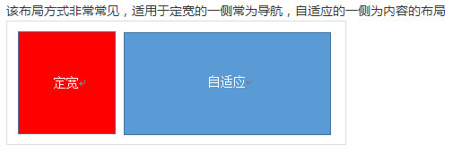
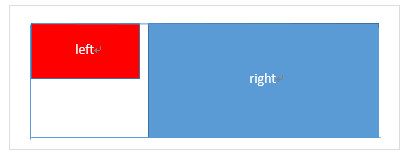
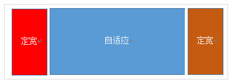
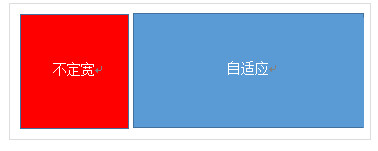
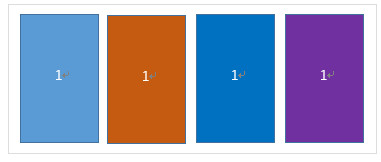
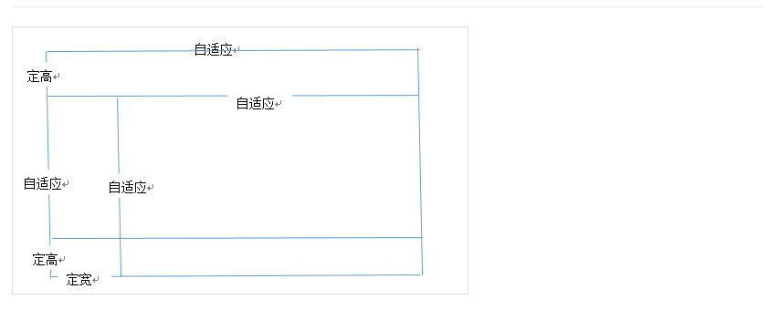

# 高级css

> 使用css复位

  CSS复位可以在不同的浏览器上保持一致的样式风格。您可以使用CSS reset 库Normalize等，也可以使用一个更简化的复位方法：

		* {
		  box-sizing: border-box;
		  margin: 0;
		  padding: 0;
		}

	现在元素的 margin 和 padding 已为0，box-sizing可以管理您的CSS盒模型布局。

学习CSS布局

* display属性
  控制布局的重要属性;每个元素都是默认的display值`通常是block和inline`

* margin：auto `可以设置左右边距为auto，来使水平居中`

* max-width：`替代`width可以使浏览器更好处理小窗口的情况,（在移动端尤为重要）

* 盒子模型
 * box-sizing：boder-box;此元素的内边距和外边距不会增加他的厚度
 * 
		*{
		 -webkit-box-sizing：boder-box;
	  	    -moz-box-sizing：boder-box;
			     box-sizing：boder-box;
		}
 
* position
 * static
 * relative
 * fixed
 * absolute

* float

* clear `用于控制浮动`

* ckearfix hack 清除浮动

	.clearfix{
		overflow:auto;
		zoom:1;
	}

* 百分比宽度 `对图片很有用`

* 媒体查询

* inline-block（创建多网格铺满浏览器：过去使用float，但是现在使用inline-block）

 【牢记：】

  * vertical-align 会影响到inline-block元素，你可能会把它的值设置为top
  * 你需要设置每一列的宽度
  * 如果html源代码中的元素之间有空格，那么列与列会产生空隙
  
* column

* flexbox

* 单列布局

> 水平居中 `多出现标题、内容区域`
  
   1）使用inline-block和text-align

	    .parent{text-align: center;} 
	    .child{display: inline-block;}
	  
   
优点：兼容性好；不足：需要同时设置子元素和父元素

   2）使用margin:0 auto来实现

		.child{width:200px;margin:0 auto;}
   
优点：兼容性好；缺点：需要指定宽度

   3）使用table实现
		.child{display:table;margin:0 auto;}

   
优点:只需要对自身进行设置;不足:IE6,7需要调整结构

   4）使用绝对定位实现
		.parent{position:relative;} /*或者实用margin-left的负值为盒子宽度的一半也可以实现，不过这样就必须知道盒子的宽度，但兼容性好*/ .child{position:absolute;left:50%;transform:translate(-50%);}
   
不足：兼容性差,IE9及以上可用

   5）使用flex布局实现

		/*第一种方法*/ .parent{display:flex;justify-content:center;} 
		/*第二种方法*/ .parent{display:flex;} .child{margin:0 auto;}
   
缺点：兼容性差，如果进行大面积的布局可能会影响效率

> 垂直居中

  1) vertical-align

	/*第一种方法*/ .parent{display:table-cell;vertical-align:middle;height:20px;} 
	/*第二种方法*/ .parent{display:inline-block;vertical-align:middle;line-height:20px;}

  2) 使用绝对定位

	.parent{position:relative;} 
    .child{positon:absolute;top:50%;transform:translate(0,-50%);}

  3）使用flex实现

    .parent{display:flex;align-items:center;}

> 水平垂直全部居中 

  1) 利用vertical-align,text-align,inline-block实现

	.parent{display:table-cell;vertical-align:middle;text-align:center;}
	.child{display:inline-block;}

  2)利用绝对定位实现

	.parent{position:relative;}
	.child{position:absolute;top:50%;left:50%;transform:translate(-50%,-50%);}

  3)利用flex实现

    .parent{display:flex;justify-content:center;align-items:center;}

    
* 多列布局

> 左列定宽，右列自适应

 利用float+margin实现
	
	.left{float:left;width:100px;}
	.right{margin-left:100px;}
 注：IE6会有3px的bug
	
 利用float+margin(fix)实现

	

	    

	    

	        

	    

	

	.left{width:100px;float:left;}
	.right-fix{width:100%;margin-left:-100px;float:right;}
	.right{margin-left:100px;}

使用float+overflow实现

	.left{width:100px;float:left;}
	.right{overflow:hidden;}

overflow:hidden，触发bfc模式，浮动无法影响，隔离其他元素，IE6不支持，左侧left设置margin-left当作left与right之间的边距，右侧利用overflow:hidden 进行形成bfc模式如果我们需要将两列设置为等高，可以用下述方法将“背景”设置为等高，其实并不是内容的等高

	.left{width:100px;float:left;}
	.right{overflow:hidden;}
	.parent{overflow:hidden;}
	.left,.right{padding-bottom:9999px;margin-bottom:-9999px;}

使用table实现

	.parent{display:table;table-layout:fixed;width:100%;}
	.left{width:100px;}
	.right,.left{display:table-cell;}

实用flex实现

	.parent{display:flex;}
	.left{width:100px;}
	.right{flex:1;}

利用右侧容器的flex:1，均分了剩余的宽度，也实现了同样的效果。而align-items 默认值为stretch，故二者高度相等

> 右列定宽，左列自适应

实用float+margin实现

	.parent{background:red;height:100px;margin:0 auto;}
	.left{background:green;margin-right:-100px;width:100%;float:left;}
	.right{float:right;width:100px;background:blue;}
使用table实现
	
	.parent{display:table;table-layout:fixed;width:100%;}
	.left{display:table-cell;}
	.right{width:100px;display:table-cell;}

实用flex实现

	.parent{display:flex;}
	.left{flex:1;}
	.right{width:100px;}

> 两列定宽，一列自适应

基本html结构为父容器为parent,自容器为left,center,right.其中，left,center定宽，right自适应

利用float+margin实现

	.left,.center{float:left:width:200px;}
	.right{margin-left:400px;}
利用float+overflow实现

	.left,.center{float:left:width:200px;}
	.right{overflow:hidden;}
利用table实现

	.parent{display:table;table-layout:fixed;width:100%;}
	.left,.center,.right{display:table-cell;}
	.left,.center{width:200px;}
利用flex实现

	.parent{display:flex;}
	.left,.center{width:100px;}
	.right{flex:1}

> 两则定宽，中栏自适应

利用float+margin实现

	.left{width：100px;float:left;}
	.center{float:left;width:100%;margin-right:-200px;}
	.right{width:100px;float:right;}
利用table实现

	.parent{width:100%;display:table;table-layout:fixed}
	.left,.center,.right{display:table-cell;}
	.left{width:100px;}
	.right{width:100px;}
利用flex实现

	.parent{display:flex;}
	.left{width:100px;}
	.center{flex:1;}
	.right{width:100px;}

> 一列不定框，一列自适应

利用float+overflow实现

	.left{float:left;}
	.right{overflow:hidden;}
利用table实现

	.parent{display:table;table-layout:fixed;width:100%;}
	.left{width:0.1%;}
	.left,.right{display:table-cell;}
利用flex实现

	.parent{display:flex;}
	.right{flex:1;}

> 多列等分布局

html结构如下所示

	

	    
1

	    
1

	    
1

	    
1

	

实用float实现

	.parent{margin-left:-20px}/*假设列之间的间距为20px*/
	.column{float:left;width:25%;padding-left:20px;box-sizing:border-box;}
利用table实现

	.parent-fix{margin-left:-20px;}
	.parent{display:table;table-layout:fixed;width:100%;}
	.column{display:table-cell;padding-left:20px;}
利用flex实现

	.parent{display:flex;}
	.column{flex:1;}
	.column+.column{margin-left:20px;}

> 九宫格布局

使用table实现

	

	        

	        

	        

	    

	.parent{display:table;table-layout:fixed;width:100%;}
	.row{display:table-row;}
	.item{display:table-cell;width:33.3%;height:200px;}
实用flex实现

	

	

	

	

	

	.parent{display:flex;flex-direction:column;}
	.row{height:100px;display:flex;}
	.item{width:100px;background:red;}

> 全屏布局

利用绝对定位实现
	

	
top

	
left

	
right

	
bottom

	

	html,body,parent{height:100%;overflow:hidden;}
	.top{position:absolute:top:0;left:0;right:0;height:100px;}
	.left{position:absolute;top:100px;left:0;bottom:50px;width:200px;}
	.right{position:absolute;overflow:auto;left:200px;right:0;top:100px;bottom:50px;}
	.bottom{position:absolute;left:0;right:0;bottom:0;height:50px;}

利用flex实现
	

	
top

	

	
left

	
right

	

	
bottom

	

	.parent{display:flex;flex-direction:column;}
	.top{height:100px;}
	.bottom{height:50px;}
	.middle{flex:1;display:flex;}
	.left{width:200px;}
	.right{flex:1;overflow:auto;}

> 响应式布局

meta标签的实用

设置布局宽度等于设备宽度，布局viewport等于度量viewport

	<meta name="viewport" content="width=device-width,initial-scale=1">

>媒体查询

HTML 4和CSS 2目前支持为不同的媒体类型设定专有的样式表, 比如, 一个页面在屏幕上显示时使用无衬线字体, 而在打印时则使用衬线字体, screen 和 print 是两种已定义的媒体类型, 媒体查询让样式表有更强的针对性, 扩展了媒体类型的功能;媒体查询由媒体类型和一个或多个检测媒体特性的条件表达式组成, 媒体查询中可用于检测的媒体特性有width、height和color（等）, 使用媒体查询, 可以在不改变页面内容的情况下, 为特定的一些输出设备定制显示效果。
语法
	@media screen and (max-width:960px){....}
	<link rel="stylesheet" media="screen and (max-width:960px)" href='xxx.css' />

========================开发技巧====================================

使用省略号

	.ellipsis {
		text-overflow: ellipsis; //规定当元素溢出时使用省略号
		white-space: nowrap; //不换行
		overflow: hidden; //规定隐藏超出的内容
	}

清除浮动

	.clear {
		clear: both; //这是最简单的一种方式
	}

清除默认样式

	select, button, input {
		-moz-appearance:none;
		-webkit-appearance:none;
		appearance:none;
	}

纯CSS实现三角形

	.triangle {
		display: inline-block;
		width: 0;
		height: 0;
		border-left: 5px solid transparent;
		border-right: 5px solid transparent;
		border-top: 10px solid #666;
	}

## 提高你的css技能的css开发技巧

- resize:`规定可以由用户调整 div 元素的大小`

		resize：none | both | horizontal | vertical
		none 用户无法调整元素的尺寸。
		both 用户可调整元素的高度和宽度。
		horizontal 用户可调整元素的宽度。
		vertical 用户可调整元素的高度。
- :not() `我们平时在书写导航栏分割线的时候，最后一个标签是没有分割线的，我们一般的写法如下：`

		/* 先给所有添加右侧边框 */
		.nav li {
		  border-right: 1px solid #666;
		}
		/* 再去除最后一个边框 */
		.nav li:last-child {
		  border-right: none;
		}
		运用:not()之后如下书写：
		
		.nav li:not(:last-child) {
		  border-right: 1px solid #666;
		}
		还可以用我们之前的~波浪选择器来实现
		
		.nav li:first-child ~ li {
		  border-left: 1px solid #666;
		}
		element1~element2 选择器
		为所有相同的父元素中位于 p 元素之后的所有 ul 元素设置背景
		
		p~ul
		{
		background:#ff0000;
		}
		我们在用逗号分隔的列表，最后一个让他没有逗号，写法如下：
		
		ul > li:not(:last-child)::after {
		  content: ",";
		}

- 任意元素垂直居中
 
		html, body {
		  height: 100%;
		  margin: 0;
		}
		
		body {
		  -webkit-align-items: center;  
		  -ms-flex-align: center;  
		  align-items: center;
		  display: -webkit-flex;
		  display: flex;
		}

- 导航栏平均宽度
		
		.list {
		  display: flex;
		  justify-content: space-between;
		}

- 在nth-child中使用负数
		
		nth-child中使用负数，可以选择小于等于某个数的值，例如：
		
		li:nth-child(-n+4){background:red}
		小于等于4的li，显示为红色！
		还可以如下应用：
		
		li {
		  display: none;
		}
		
		li:nth-child(-n+3) {
		  display: block;
		}
		上面代码的含义是，我们让前三个li显示（小于等于3的）,其他的li都隐藏！

- 文本显示优化

	html {
	  -moz-osx-font-smoothing: grayscale;
	  -webkit-font-smoothing: antialiased;
	  text-rendering: optimizeLegibility;
	}

