# PhotoShop 技巧

## 基础知识

1、图像主要分为两类：一类是位图，一类是矢量图。

- 图像
    - 位图
    - 矢量图

**位图：** 是由多个像素组成的，当放大位图时，可以看见图像被分成了很多色块（锯齿效果），而且放大的位图属于失真状态。我们平时拍的照片、扫描的图片等都属于位图。

**矢量图：** 是通过数学公式计算获得的图像，它最大的特点是无论放大多少倍都不失真，而且文件小、分辨率高，缺点是难以表现色彩层次丰富的逼真图像效果。

**Photoshop是典型的位图软件，但也包含矢量功能，例如文字、钢笔工具等。**

像素与分辨率

**像素：** 是构成位图图像最基本的单元，每个像素都有自己的颜色，像素越多，颜色信息就越丰富，图像效果就越好！

**分辨率：** 是单位长度内包含像素点的数量，通常以像素每英寸ppi(pixels per inch)为单位来表示图像分辨率的大小，例如分辨率为72ppi表示每英寸包含72个像素点，分辨率越高，包含的像素点就越多，图像就越清晰，但占用的存储空间就越大。

**分辨率分为屏幕分辨率和图像分辨率**，例如：屏幕分辨率是1280×720，就是屏幕的水平方向上有1280个像素点，垂直方向上有720个像素点；一张图片分辨率是800×500，就是说图片在没有缩放的前提下，水平方向有800个像素点，垂直方向有500个像素点。

像素与分辨率的关系：二者关系密不可分，它们的组合决定了图像的质量。分辨率=图像水平方向的像素点数×图像垂直方向的像素点数。例如1英寸×1英寸，分辨率为100ppi的图像包含10000个像素（100像素×100像素）。

## 技巧篇

PS提供了很多抠图方法：套索、选区、钢笔、蒙版等功能。

**选区的基本操作**

+ 全选与反选（Ctrl+A）
+ 取消选择和重新选择
+ 运算选区
+ 移动选区
+ 隐藏和显示选区

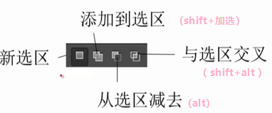

矩形选区（m）--> 切换选区（shift+m）

（椭）圆选区 --> 按住shift正圆；按住alt以光标为中心拖拽椭圆（以选区为中心拖拽）

变换选区 （shift 等比例缩放 alt 以选区为中心缩放）

多边形选区

### 1、抠图技巧

#### 简单图像抠图法1：魔棒工具

适用图像范围：图片背景部分颜色单一，要抠图的图像部分非常简单。

优势：操作非常简单快速

劣势：抠图不精细

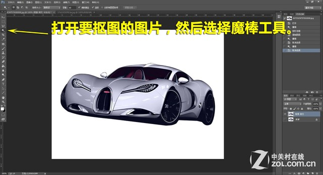

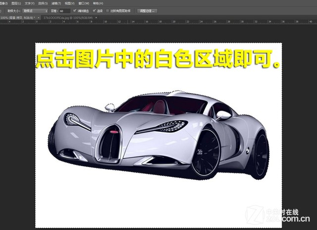

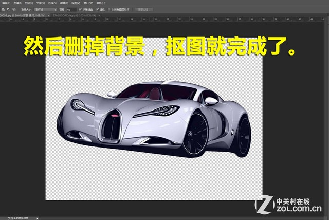

有的时候，我们会遇到图像与背景颜色比较接近的情况，这时候如果直接使用魔棒，就会造成图像选择不完全的情况，删掉背景的时候也会删掉部分图像。这时候，我们需要适当的改小容差数值，然后重新点击背景，就可以完全的选择图像了，至于容差值改到多小合适，由于每张图片都不一样，所以需要大家慢慢尝试，找到最合适的数值。

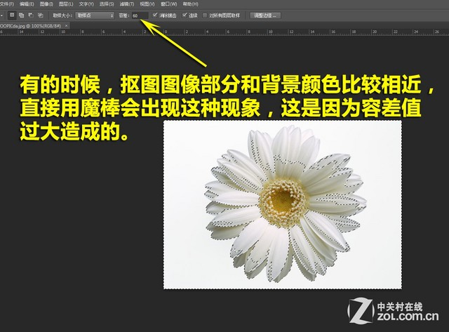

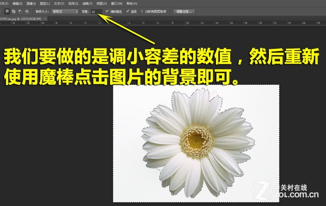

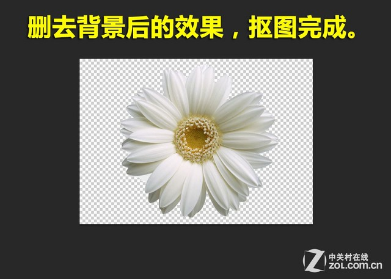

#### 简单图像抠图法2：快速选择工具

适用图像范围：图片背景部分比较简单，要抠图的图像部分也比较简单。

优势：操作比较简单快速

劣势：选择时候容易误操作，抠图不够精细

在我们抠图的时候，会碰到背景颜色不够单一的图片，这样如果使用魔棒工具抠图，会造成很多困扰，还会严重的影响抠图的速度，所以我们可以尝试使用快速选择工具。

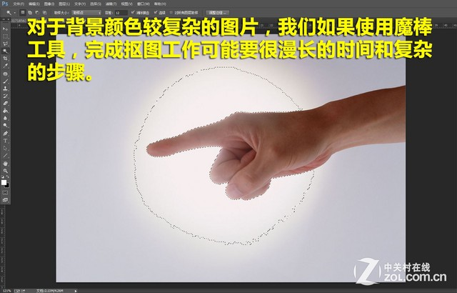

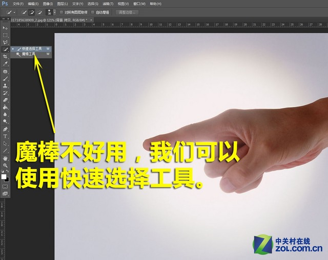

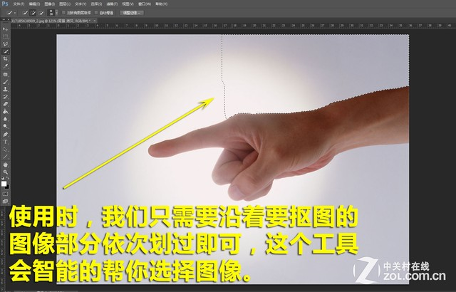

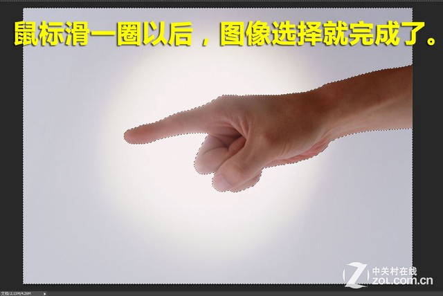

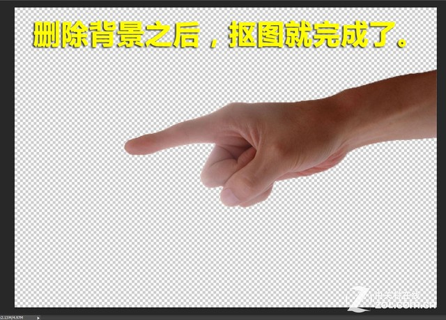

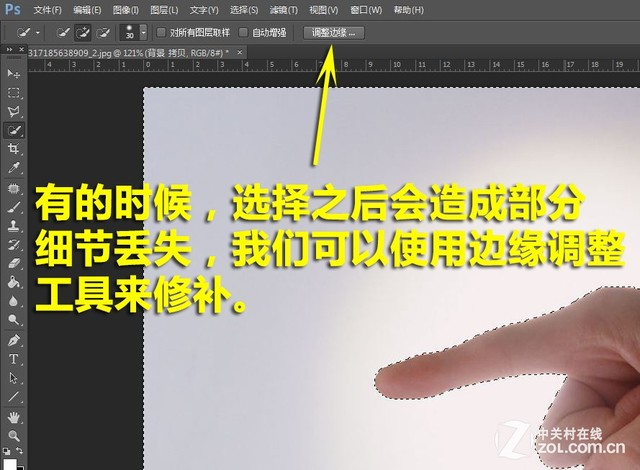

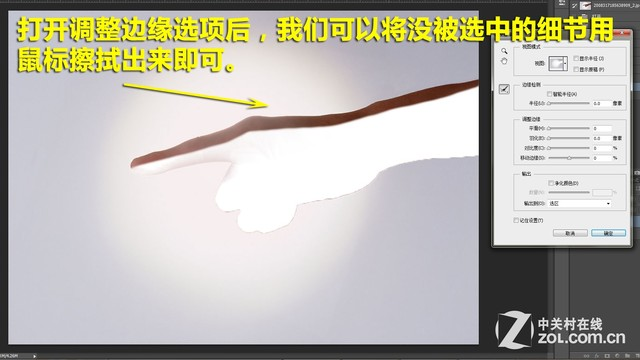

快速选择工具，虽然使用上比魔棒要复杂一些，但是相对来说也是最简单、最快速的抠图工具了。我们周围很多做设计的朋友一般抠图都会使用这个工具。不过，对于要抠图部分过于复杂的图片来说，这个工具在使用的时候也会很痛苦的。

#### 复杂图像抠图法1：蒙版抠图

适用图像范围：图片背景部分比较复杂，要抠图的图像部分比较复杂。

优势：能处理比较复杂的图片

劣势：处理过程和步骤比较复杂

魔棒工具和快速选择工具，虽然操作简单而且抠图速度快，但是只能够用于简单的图片中，如果说图片要抠图部分比较复杂，前两个工具就无能为力了，因为需要非常长时间的精细选取操作。接下来，我们给大家介绍一个能够处理比较复杂图片的抠图方法，利用快速蒙版工具。

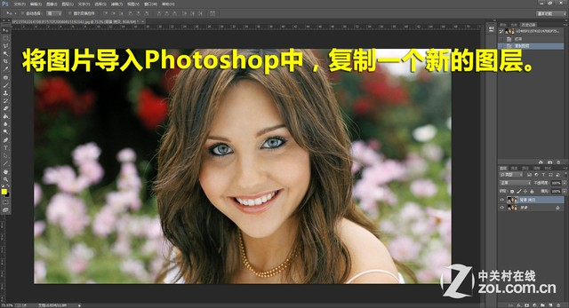

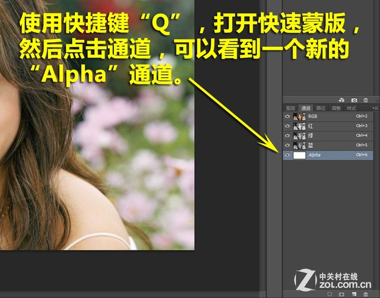

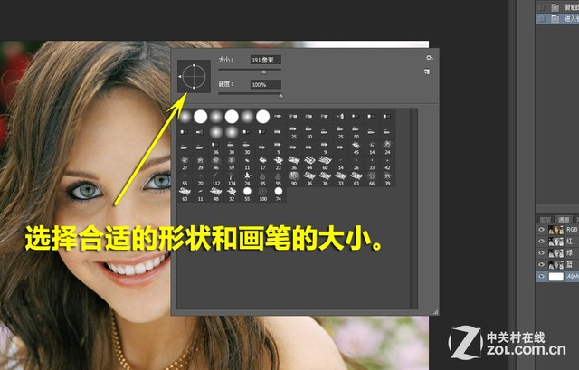

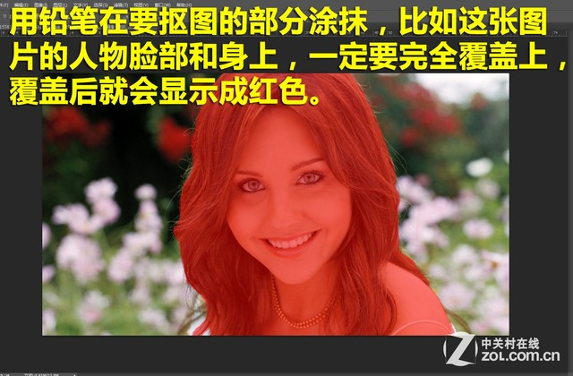

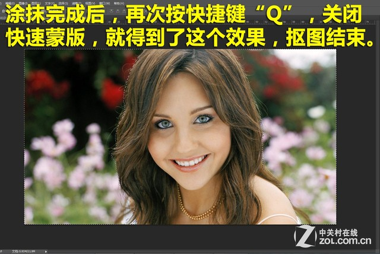

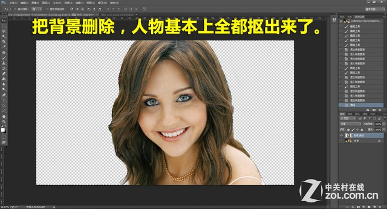

这个快速蒙版的抠图方法，其实抠图并不是非常的精细，毕竟我们这里讲的是快速抠图，如果想要非常精细的抠图，大家只能够花费更长的时间一点一点的精细涂抹要抠图的部分，这样抠图的效果会更好，但是也会花费更久的时间。对于比较复杂的图片进行抠图工作，这个快速蒙版方法的确比较好用，不妨尝试一下。

#### 复杂图像抠图法2：色彩范围抠图

复杂图像抠图法2：色彩范围抠图

适用图像范围：图片背景部分颜色比较单一，要抠图的图像部分比较复杂。

优势：抠图效果比较出色，能处理比较复杂的图片

劣势：要求背景部分颜色单一

另一个抠图的方法，就是利用色彩范围。这种方法主要是用于背景颜色比较单一的图片进行抠图中使用，运用菜单选择中的色彩范围来选出背景，然后去除背景，达到抠图的目的。

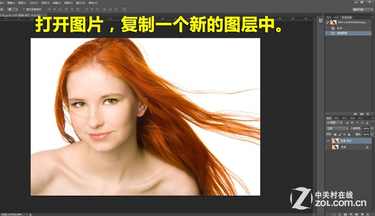

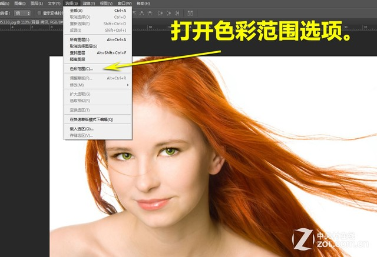

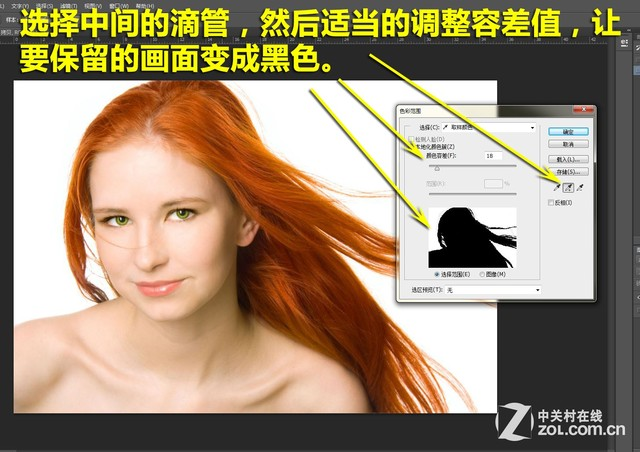

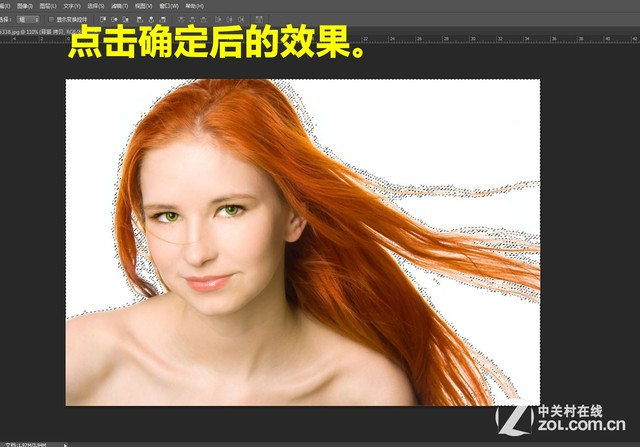

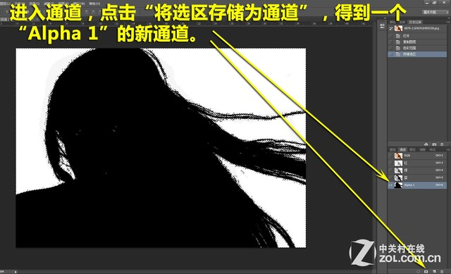

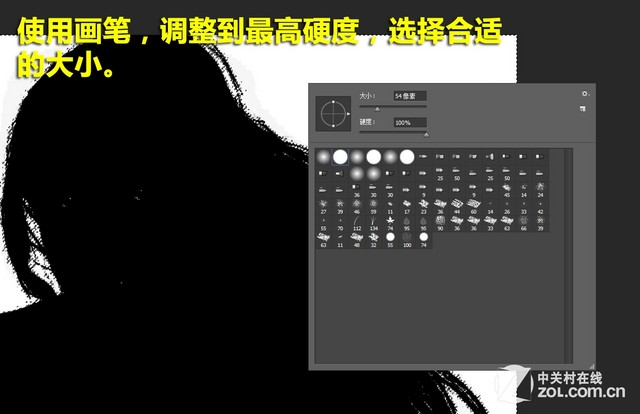

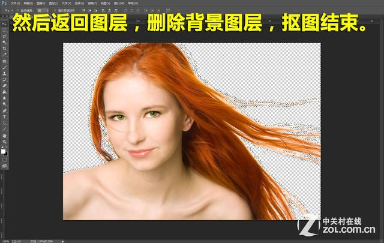

很多人看到这里会疑问，背景色彩单一的图片进行抠图，用魔棒其实就可以了。但是有的时候，我们如果遇到我们示例的这种类型的图片，用魔棒将背景去除之后，会发现头发之中的细节部分还是保留在图片中，效果非常差。所以使用我们介绍的色彩范围的方法，能够处理的更加完善，但是这个方法也只是一个快速抠图的方法，不可能做到十分精细。如果需要精细抠图的朋友，还是要花费大量时间一点一点的处理。

#### 复杂图像抠图法3：通道混合器抠图

复杂图像抠图法3：通道混合器抠图

适用图像范围：图片背景部分颜色复杂，要抠图的图像部分非常复杂。

优势：处理非常复杂图片的首选抠图方法

劣势：处理过程和步骤比较复杂

如果说给你一辆车，让你抠出来比较简单，但是如果给你一片树林，让你抠图，你有头绪吗？接下来，我们就交给大家一个全新的抠图方法，利用反相和通道混合器的方式进行抠图，这样即使给你一片树林，你也能够完整的抠出来。

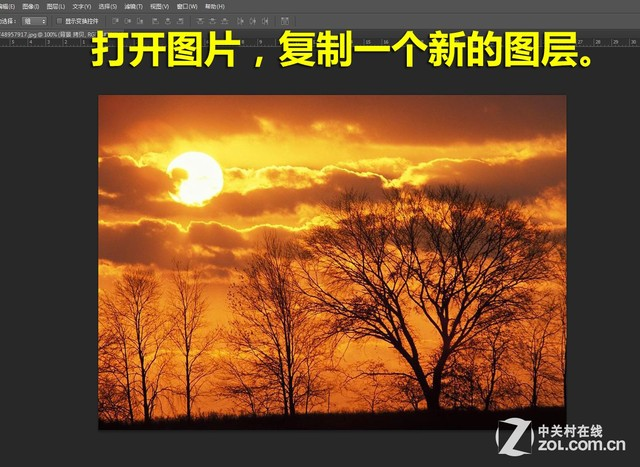

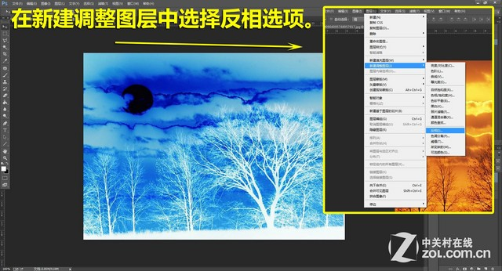

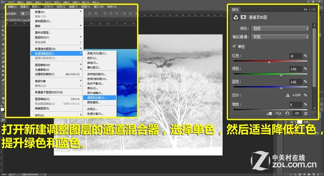

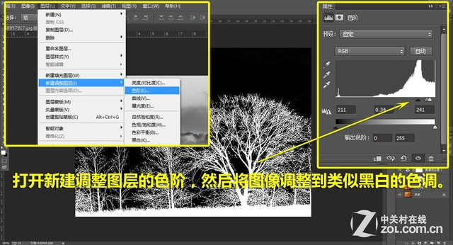

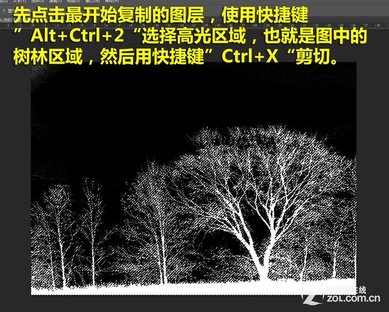

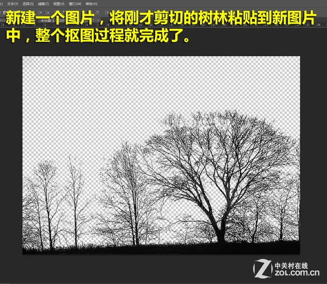

