# 019 gradle

#### <a href="https://gradle.org/">Gradle</a>是一个基于Apache Ant和Apache Maven概念的项目自动化建构工具。 它使用一种基于Groovy的特定领域语言(DSL)来声明项目设置，抛弃了基于XML的各种繁琐配置。

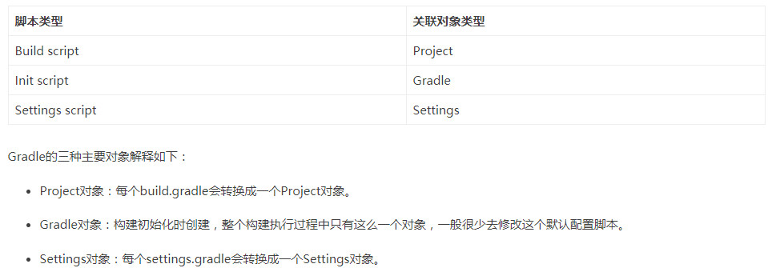

## 配置环境变量GRADLE_HOME

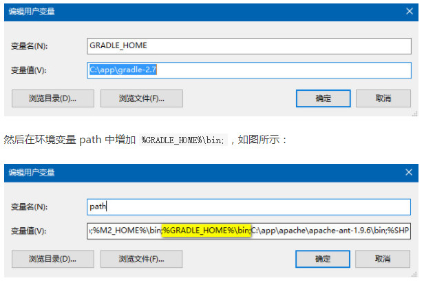

测试配置是否成功`gradle -v` 或 `gradle -version`

## 使用 IntelliJ IDEA 工具创建 Gradle 项目

新建Gradle项目
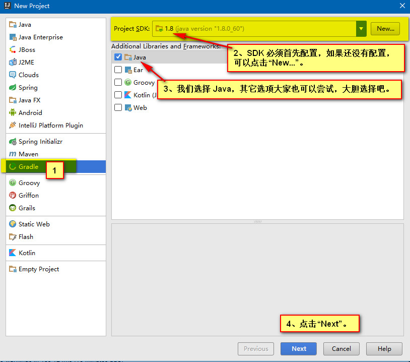

类似Maven构建项目
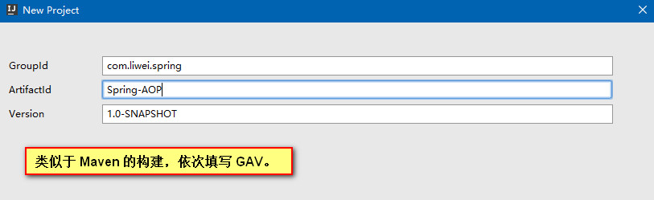

确认 Gradle 使用的版本和 JDK 版本 
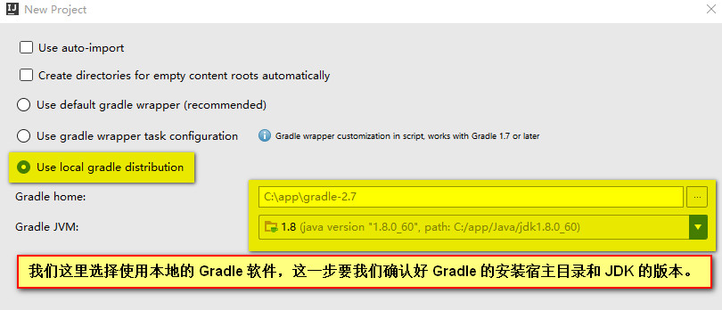

**简单介绍窗口**
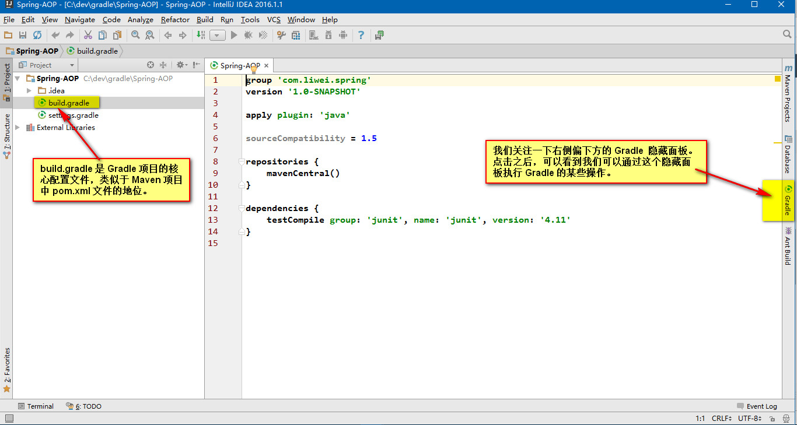

**Gradle 面板，最常用的按钮：**

Gradle 和 Maven 一样，约定大于配置，所以我们首先要在 Gradle 项目里创建文件夹。
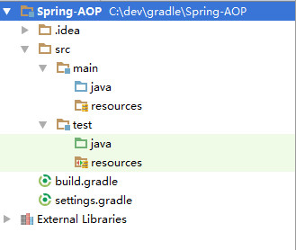

> 添加 Gradle 依赖与 build.gradle 配置初识

添加 Gradle 我们可以到我们添加 Maven 依赖的网站 
Maven Repository: Search/Browse/Explore 
[http://mvnrepository.com/](http://mvnrepository.com/)
上查找，例如我们搜索 spring 的依赖

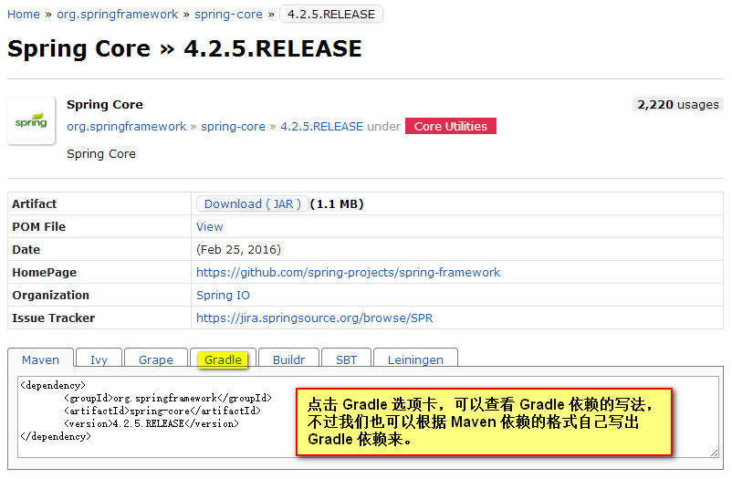
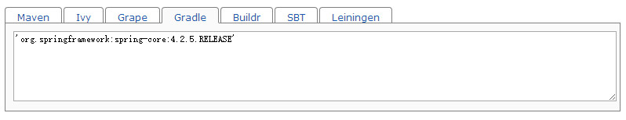

**IDEA 工具默认帮助我们生成的 build.gradle 如下图，我们对默认的配置做一些解释。**

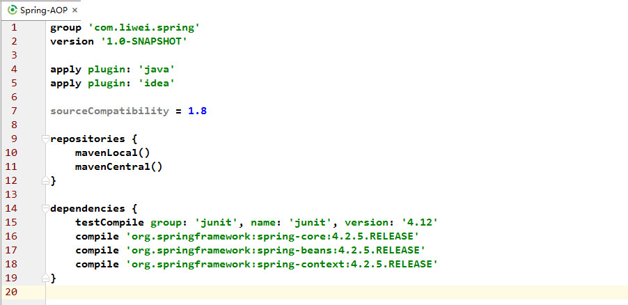

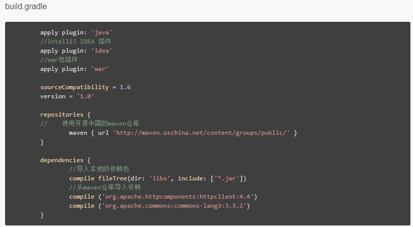

gradle 的sourceCompatibility 与 targetCompatibility 区别

**sourceCompatibility:**指定编译编译.java文件的jdk版本
**targetCompatibility：**确保class文件与targetCompatibility指定版本，或者更新的java虚拟机兼容

gradle providedCompile 与compile区别
**Gradle compile:**
 如果你的jar包/依赖代码 在编译的时候需要依赖，在运行的时候也需要，那么就用compile
例如 ：
`compile 'org.springframework.boot:spring-boot-starter-websocket:1.1.6.RELEASE'`

**Gradle providedCompile：**
如果你的jar包/依赖代码 仅在编译的时候需要，但是在运行时不需要依赖,就用providedCompile
例如：
`providedCompile 'org.springframework.boot:spring-boot-starter-tomcat:1.1.6.RELEASE'`

## Gradle 引入本地定制 jar 包，而不使用坐标下载 jar 包的方法

> 第 1 步：创建文件夹，拷贝 jar 包

在自己的 Gradle 项目里建立一个名为 “libs” （这个名字可以自己定义，不一定非要叫这个名字）的文件夹，把自己本地的 jar 包拷贝到这个文件夹中。 

> 第 2 步：编写 build.gradle 核心配置文件片段

在 Gradle 的核心配置文件 build.gradle 中添加如下代码片段：
`compile fileTree(dir:'libs',include:['*.jar'])`

> 第 3 步：刷新构建

点击刷新 Gradle 项目的按钮，刷新 Gradle 构建就可以了。 
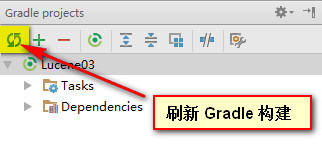

# Gradle多项目功能浅析

模块化是大型软件开发必须的。Gradle的多项目支持真是挺棒的。它支持两种目录结构：

+ 平级结构

+ 父子结构

# IntelliJ IDEA Maven Gradle的配置

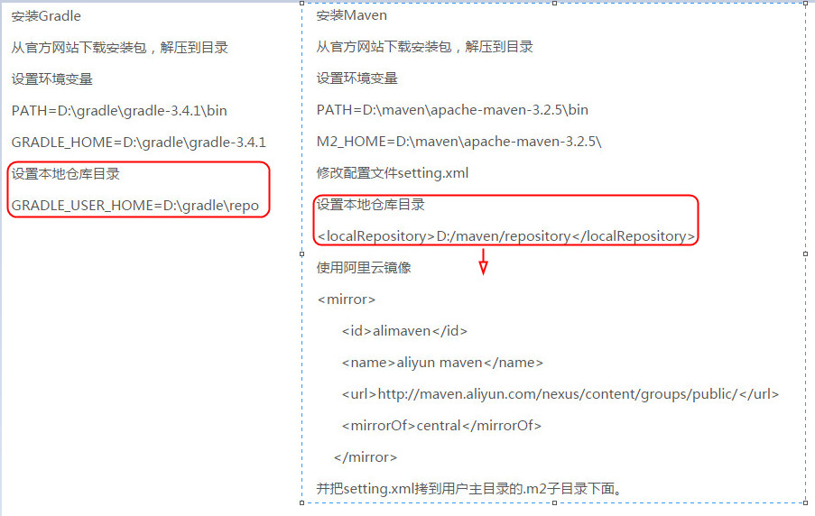

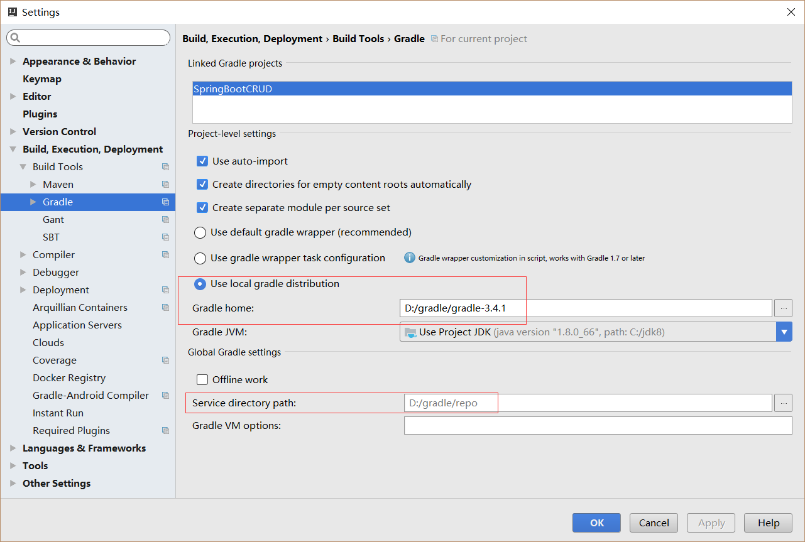

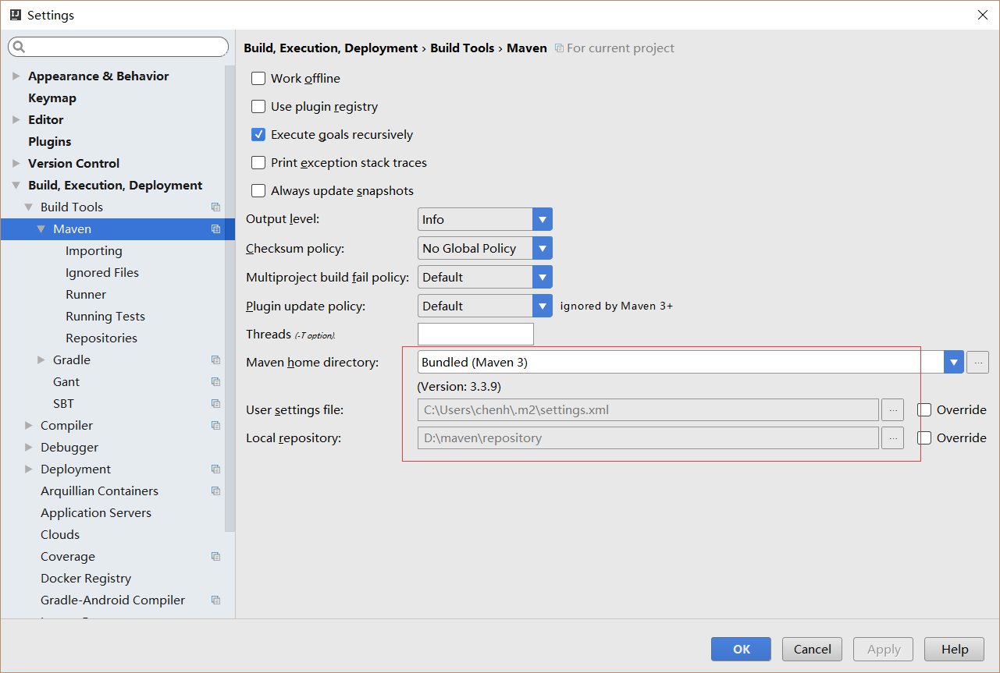

项目中使用阿里云镜像
mavenLocal()
maven{ url 'http://maven.aliyun.com/nexus/content/groups/public/'}