# maven 教程


## maven 插件使用

###  bundle plugin for Maven 插件

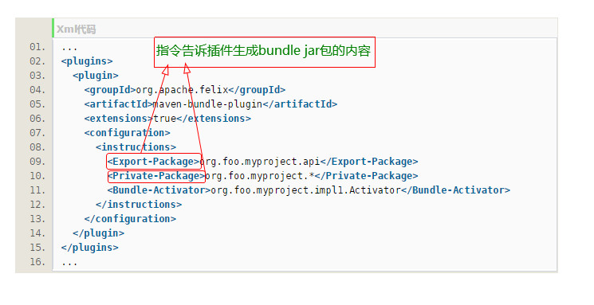
<Export-Package>和<Private-Package>指令告诉插件生成bundle jar包的内容。其中Export-Package是导出包，让别的bundle可以导入包。Private-Package指令为复制包和包中的类，<font color=green>但是不导出</font>。如果一个包在Export-Package和Private-Package中都写了，那么该包一定会被导出，因为<font color=green>Export-Package优先级高</font>。如果我们的包不需要其他bundle manifest。如果包不需要其他bundle使用，那么只写Private-Package就可以了

特别强调一点的是，Import-Package 不需在bundle manifest清单中描述。会自动<font color=red>智能</font>的导入。（翻者认为还是手动写为好。例如内容为： !*,com.apache.common.files,com.equinox.osgi 开始写!*表示不导入全部，然后需要导入的一一写明。这样比较好该插件太智能，自己会导入依赖的bundle classpath中无用的包）。Bundle-Activator为此bundle激活后立即执行的方法。


### IDEA 的maven使用

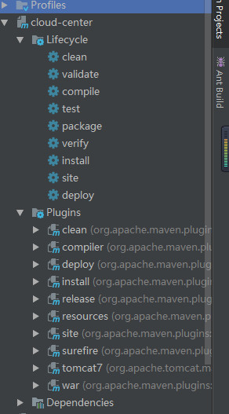			

clean ： 清除产生项目				
		
validate ：  验证工程是否正确，所有需要的资源是否可用。 	
		
compile ： 编译项目代码		
		
test ： 测试代码   

package ： 打包（package是把jar打到本项目的target下）	
		
verify ： 运行任何检查，验证包是否有效且达到质量标准。	
		
install ： install时把target下的jar安装到本地仓库，供其他项目使用.

site ： 产生site

deploy : deploy命令，可以将maven所打的jar包上传到远程的repository，便于其他开发者和工程共享。

	一直不明白package与  install的区别，今天测试了下。
	
	 如果b项目依赖a项目，而a打了包(package),jar仅仅时打到了a项目的target下。这时编译b项目，还是会报错，找不到所依赖的a项目，说明b项目在本地仓库是没有找到它所依赖的a项目。然后，我install a项目这时，有以下日志,[INFO] Installing G:\projects\a\target\a-0.0.1-SNAPSHOT.jar to F:\repository\com\chenjun\a\0.0.1-SNAPSHOT\a-0.0.1-SNAPSHOT.jar
	[INFO] Installing G:\projects\a\pom.xml to F:\repository\com\chenjun\a\0.0.1-SNAPSHOT\a-0.0.1-SNAPSHOT.pom,说明a项目已安装到本地仓库了,并且是jar和pom同时安装的.
	
	这时候去compileb项目，编译通过.
	
	总之，package是把jar打到本项目的target下，而install时把target下的jar安装到本地仓库，供其他项目使用.

#### 配置 
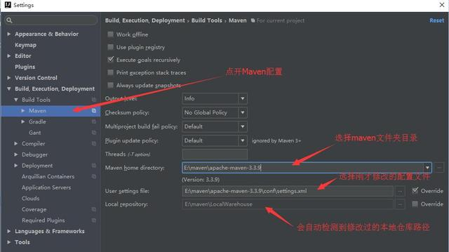

#### 新建maven WEB项目

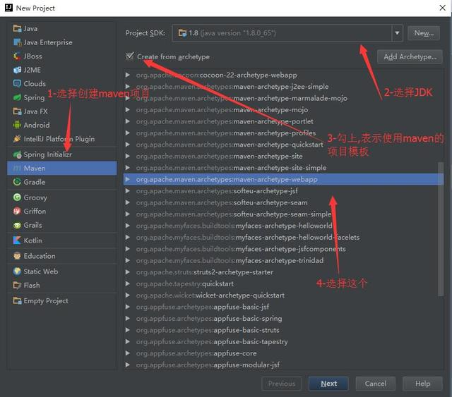

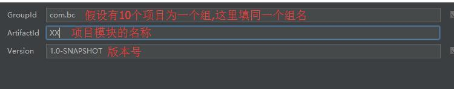

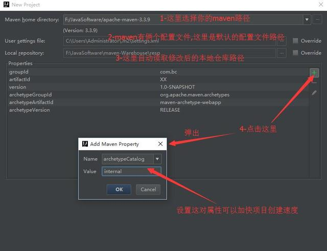

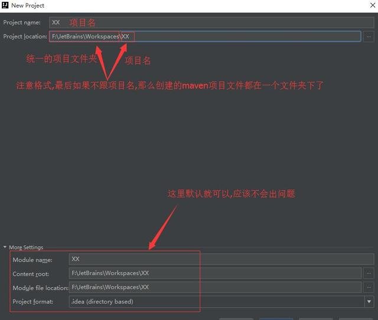

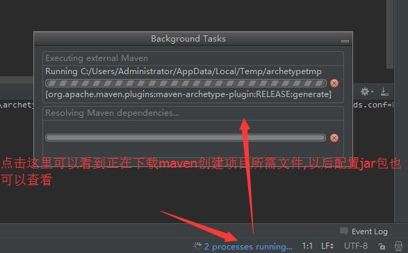

#### maven web模板项目结构

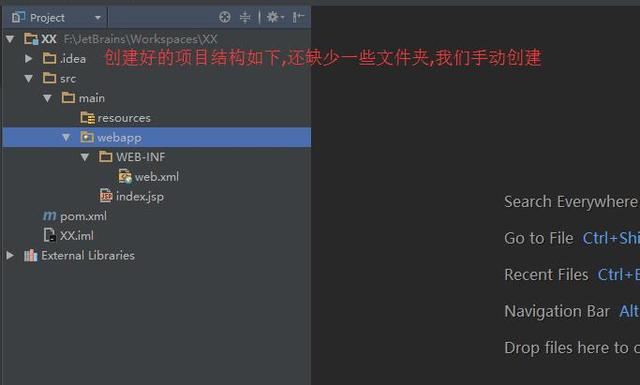

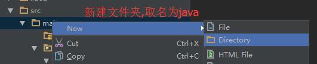

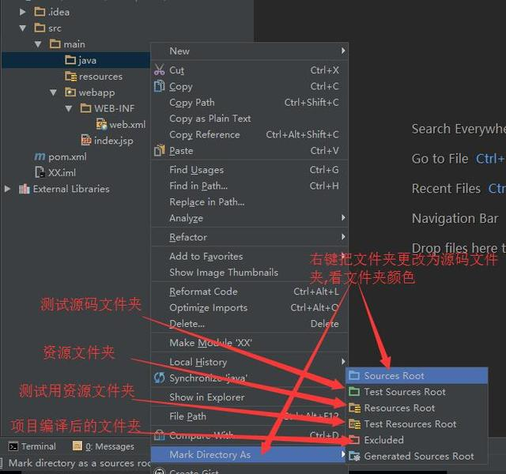

同样在main下新建test测试文件夹,再在此文件夹下新建Java测试源码文件夹和resource测试资源文件夹

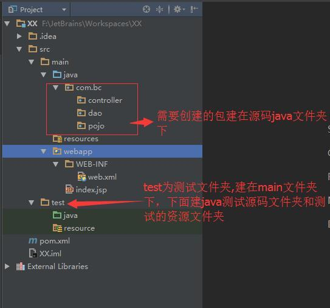

也可以右键项目-选择Open Module Settings打开项目配置页面更改

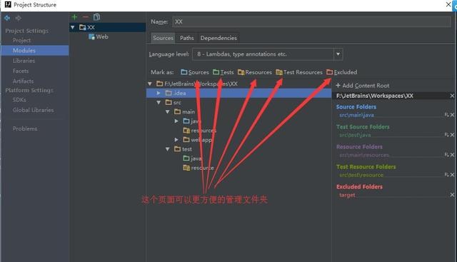

配置依赖jar包

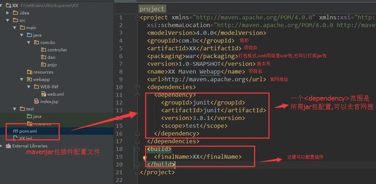

# Maven 

## Archetype （骨架）

### Archetype是Maven工程的模板工具包

Archetype是什么？

	简单的说，Archetype是Maven工程的模板工具包。一个Archetype定义了要做的相同类型事情的初始样式或模型。这个名称给我们提供来了一个一致的生成Maven工程的方式。Archetype会帮助作者给用户创建Maven工程模板，并给用户提供生成相关工程模板版本的参数化方法。

	使用Archetype提供的好的方法，是开发者能够使用最佳实践来快速的构建和组织一致化的工程。在Maven工程中，我们努力使用Archetype来尽可能快的给用户提供示例工程，同时也会把Maven的最佳实践介绍给新的用户。一个新的用户可以使用工作中的Maven工作作为跳板来研究更过的Maven中功能。我们也可以使用Archetype的添加机制，这样就意味着允许我们抓取Archetype中项目片段，并把它们添加到既存的工程中。Maven网站的Archetype就是很好的例子。例如，你可以使用“quick start archetype”来生成一个工程，然后就可以通过其中既存的“site archetype”来快速的创建一个网址工程。你能够使用Archetype来做很多这样的事情。

	在你的团队中可能想要标准化的J2EE开发，这需要你提供EJBs、或者是WARs、或者是Web services的原型。一旦在你团队资源库中创建和部署这些原型，它们就可以在你团队内共享使用。

	如何使用Archetype

	要基于Archetype来创建一个新的工程，需要像下面示例这样来调用：
	mvn archetype:generate

	已有的Archetypes

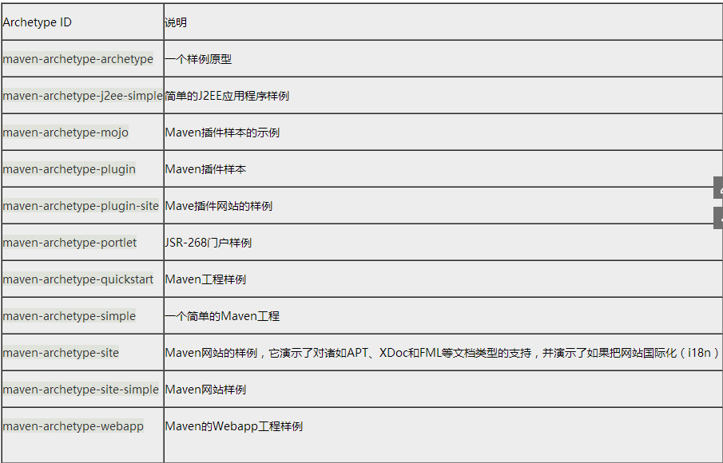

**常用Archetype**

- 1，maven-archetype-quickstart

	默认的Archetype,基本内容包括：
	- 一个包含junit依赖声明的pom.xml
	- src/main/java主代码目录及一个名为App的类
	- src/test/java测试代码目录及一个名为AppTest的测试用例

- 2，maven-archetype-webapp
	一个最简单的Maven war项目模板，当需要快速创建一个Web应用的时候可以使用它。生成的项目内容包括：
	- 一个packaging为war且带有junit依赖声明的pom.xml
	- src/main/webapp/目录
	- src/main/webapp/index.jsp文件
	- src/main/webapp/WEB-INF/web.xml文件


# Maven 插件元素
	
	<plugin> 
	 <!--插件在仓库里的group ID-->  
	  <groupId>org.apache.maven.plugins</groupId>  
	  <!--插件在仓库里的artifact ID-->  
	  <artifactId>maven-war-plugin</artifactId>  
	  <!--被使用的插件的版本（或版本范围）-->  
	  <version>1.0.1</version>  
	  <!--是否从该插件下载Maven扩展（例如打包和类型处理器），由于性能原因，只有在真需要下载时，该元素才被设置成enabled。-->  
	  <!--在构建生命周期中执行一组目标的配置。每个目标可能有不同的配置。-->  
	  <executions> 
	    <!--execution元素包含了插件执行需要的信息-->  
	    <execution> 
	      <!--执行目标的标识符，用于标识构建过程中的目标，或者匹配继承过程中需要合并的执行目标-->  
	      <id>create-war-file</id>  
	      <!--绑定了目标的构建生命周期阶段，如果省略，目标会被绑定到源数据里配置的默认阶段-->  
	      <phase>compile</phase>  
	      <!--配置的执行目标-->  
	      <goals>war</goals>  
	      <!--配置是否被传播到子POM-->  
	      <inherited>false</inherited>  
	      <!--作为DOM对象的配置-->  
	      <configuration>
	　　　　　　<!-- 在插件帮助文档里找 -->
	　　　 </configuration> 
	    </execution> 
	  </executions>  
	  <!--项目引入插件所需要的额外依赖-->  
	  <dependencies> 
	    <dependency></dependency> 
	  </dependencies>  
	  <!--任何配置是否被传播到子项目-->  
	  <inherited></inherited>  
	  <!--作为DOM对象的配置-->  
	  <configuration>
	　　　<warName>test-war</warName>
	  </configuration> 
	</plugin>

	<build>
	    <plugins>
	        <!-- 打包插件 -->
	        <plugin>
	            <groupId>org.apache.maven.plugins</groupId>
	            <artifactId>maven-war-plugin</artifactId>
	            <version>2.2</version>
	            <configuration>
	                <!-- 重点是这个配置,打成war包后的名字 -->
	                <warName>${project.artifactId}</warName>
	            </configuration>
	        </plugin>
	        <!-- 编译插件 -->
	        <plugin>
	            <groupId>org.apache.maven.plugins</groupId>
	            <artifactId>maven-compiler-plugin</artifactId>
	            <version>3.5.1</version>
	            <configuration>
	                <source>1.7</source>
	                <target>1.7</target>
	            </configuration>
	        </plugin>
	    </plugins>
	    <resources>
	        <resource>
	            <directory>src/main/resources</directory>
	            <includes>
	                <include>**/*.properties</include>
	                <include>**/*.xml</include>
	                <include>**/*.tld</include>
	            </includes>
	            <filtering>false</filtering>
	        </resource>
	        <resource>
	            <!-- 将src/main/java 目录下及其子目录下的相关文件都打入war包，特别适用于mybatis -->
	            <directory>src/main/java</directory>
	            <includes>
	                <include>**/*.properties</include>
	                <include>**/*.xml</include>
	                <include>**/*.tld</include>
	            </includes>
	            <filtering>false</filtering>
	        </resource>
	    </resources>
	</build>

## Maven的pom.xml文件详解------The Basics

#### Maven坐标

&emsp;&emsp;GroupId、artifactId和version构成了Maven的坐标（groupId和version可以从parent继承），指定了组件在Maven仓库中的位置。Maven中的每个组件都有一个坐标，通过这个坐标我们在自己的项目中可以设置对该组件的依赖。    

- **groupId：**项目属于哪个组，往往和项目所在的组织或公司存在关联；     
- **artifactId：**当前Maven项目在组中唯一的ID；    
- **version：**定义当前项目的版本，如：1.0（-SNAPSHOT），SNAPSHOT表示快照，说明该项目还处于开发阶段，是不稳定版本；   
- **packaging：**当我们有了groupId:artifactId:version作为地址后，还需要packaging为我们提供组件的类型，例如：<packaging>war</packaging>标识组件为一个war。如果packaging不指定，默认值为jar，当前可选值为：pom, jar, maven-plugin, ejb, war, ear, rar, par；
- **classifier：**可选，坐标也可以展示为groupId:artifactId:packaging:classifier:version。

#### POM关联
Maven的一个有力的地方就在于对项目关联的处理；包括依赖、继承和聚合（多模块项目）。

##### Dependencies
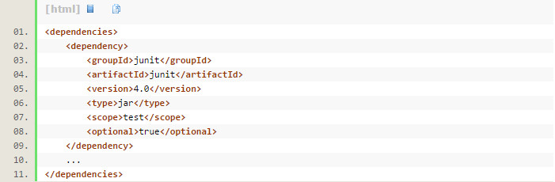

> groupId、artifactId、version：依赖组件的坐标，如果当Maven通过这些坐标无法从中心仓库获取该组件时，可以通过下面的方法处理：       
  
 
 - 1、用安装插件安装本地依赖，在命令行中输入：
  `mvn install:install-file -Dfile=non-maven-proj.jar -DgroupId=some.group -DartifactId=non-maven-proj -Dversion=1 -Dpackaging=jar `     
 - 2、创建你自己的仓库，并部署它       
 - 3、设置依赖scope到system，并定义一个systemPath，但这个不推荐。


> type：对应所以来的组件的packaging；
> scop：用于控制依赖的范围，有以下几种范围供选择

 - 1、compile：编译依赖范围，默认，对于所有的classpath都是有效的；
 - 2、provided：仅对编译和测试classpath有效；
 - 3、runtime：编译时不需要，尽在运行时需要；
 - 4、test：仅用于测试；
 - 5、system：和provided类似，只是你需要提供JAR，组件不再在仓库中查找。

> systemPath：当scop配置为system时就需要它了

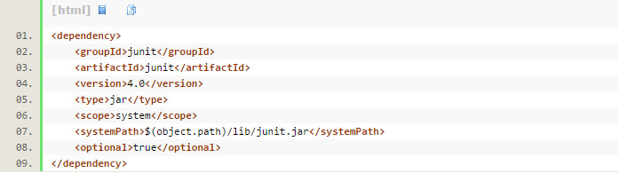

> optional：设置为true，标识该依赖只对该项目有效，如果其他项目依赖该项目，该依赖将不会传递。

##### Exclusions     
该配置告诉Maven你不想包含的该依赖的依赖（即，依赖传递的依赖）
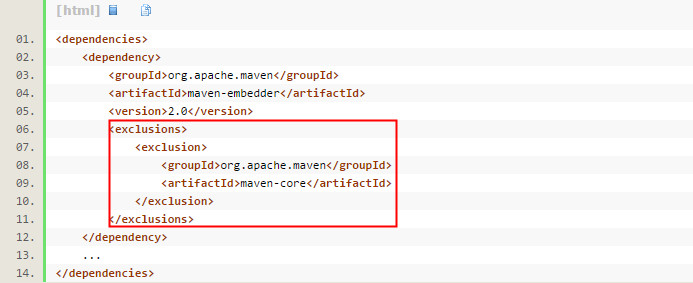

也可以使用通配符，表示排除所有传递的依赖。
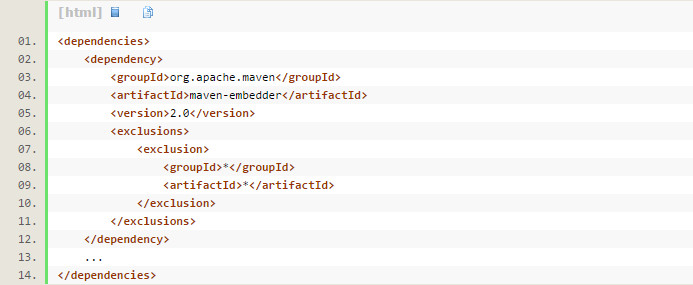

##### Inheritance

继承是一个有力的工具，在maven中使用继承时，需要为parent和aggregation（多模块）项目设置packaging为pom：<packaging>pom</packaging>，然后就子项目就可以继承该POM了。
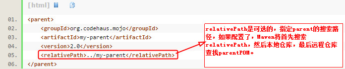

relativePath是可选的，指定parent的搜索路径，如果配置了，Maven将首先搜索relativePath，然后本地仓库，最后远程仓库查找parentPOM。    

POM就像Java对象最终都继承自java.lang.Object一样，所有的POM都继承自一个Super POM，你通过查ungjianyige最小化的pom.xml并在命令行中执行 mvn help:effective-pom来查看Super POM对你的POM的影响.

##### Dependency Management
dependencyManagement用于在parent项目定义一个依赖，如：
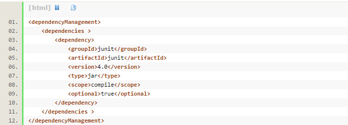

然后从这个parent继承的POMs就能设置他们的依赖为：
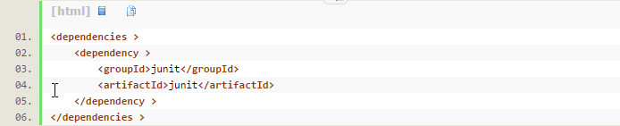

继承的POM的dependency的其它信息可以从parent的dependencyManagement中获得，这样的好处在于可以将依赖的细节放在一个控制中心，子项目就不用在关心依赖的细节，只需要设置依赖。

##### Aggregation（或者Multi-Module）
在多模块的项目中，可以将一个模块的集合配置到modules中。

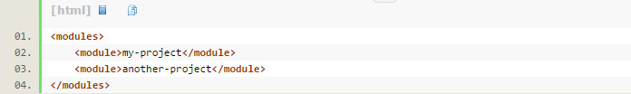
在这里列出的模块不需要考虑顺序，Maven将自己根据依赖关系排序。

##### Properties
Maven中的Properties就像Ant中的，可以在POM的任何地方通过${X}来返回属性的值，X就表Poperty。
存在以下5种不同的类型：      

- 1、env.X：将返回环境变量的值，如：${env.PATH}返回PATH环境变量的值；
- 2、project.X：POM中的对应元素的值，'.'表示在POM中的路径，如：<project><version>1.0</version></project>可以通过${project.version}获取值；
- 3、settings.X：settings.xml中包含的对应元素的值，'.'表示路径，如： <settings><offline>false</offline></settings>可以通过${settings.offline}获取；
- 4、Java System Properties：所有可以通过java.lang.System.getProperties()获取到的属性在POM属性中都是可用的，如：${java.home}；
- 5、X：在POM的<properties />中设置的元素，如： <properties><someVar>value</someVar></properies>通过${someVar}获取。


## Maven的pom.xml文件详解------Build Settings

根据POM 4.0.0 XSD，build元素概念性的划分为两个部分：BaseBuild（包含 **poject build** 和 **profile build** 的公共部分，见下）和poject build包含的一些高级特性。

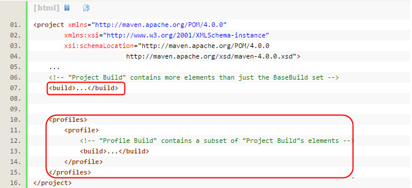

### BaseBuild元素集合 

#### basic elements

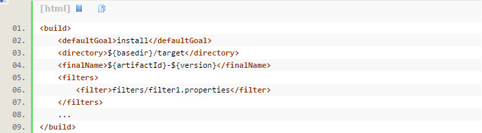

1、**defaultGoal：** 执行build任务时，如果没有指定目标，将使用的默认值，如：在命令行中执行mvn，则相当于执行mvn install；    
2、**directory：** build目标文件的存放目录，默认在${basedir}/target目录；     
3、**finalName：** build目标文件的文件名，默认情况下为${artifactId}-${version}；    
4、**filter：**  定义*.properties文件，包含一个properties列表，该列表会应用的支持filter的resources中。也就是说，定义在filter的文件中的"name=value"值对会在build时代替${name}值应用到resources中。Maven的默认filter文件夹是${basedir}/src/main/filters/。  

#### resources  

build的另一个特征是指定你的项目中resources的位置。resources（通常）不是代码，他们不被编译，但是被绑定在你的项目或者用于其它什么原因，例如代码生成。   
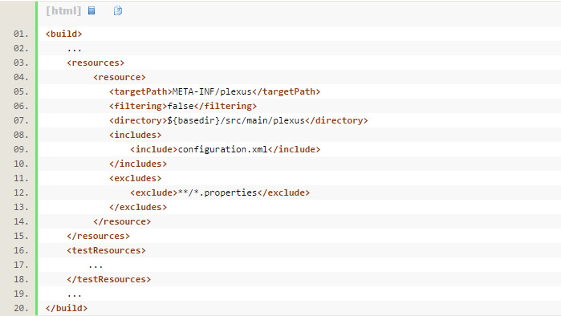

1、**resources：** 一个resource元素的列表，每一个都描述与项目关联的文件是什么和在哪里；     
2、**targetPath：** 指定build后的resource存放的文件夹。该路径默认是basedir。通常被打包在JAR中的resources的目标路径为META-INF；     
3、**filtering：**  true/false，表示为这个resource，filter是否激活。    
4、**directory：**  定义resource所在的文件夹，默认为${basedir}/src/main/resources；    
5、**includes：**  指定作为resource的文件的匹配模式，用*作为通配符；   
6、**excludes：**  指定哪些文件被忽略，如果一个文件同时符合includes和excludes，则excludes生效；       
7、***testResources:** 定义和resource类似，但只在test时使用，默认的test resource文件夹路径是${basedir}/src/test/resources，test resource不被部署。    

#### Plugins
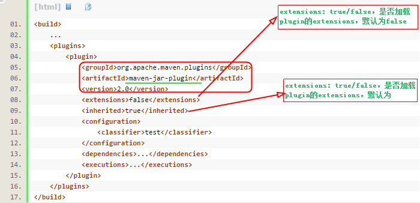

除了<font size=3 face="黑体" color=red>groupId:artifactId:version</font>标准坐标，plugin还需要如下属性：     
&emsp; 1、extensions：true/false，是否加载plugin的extensions，默认为false；    
&emsp; 2、inherited：true/false，这个plugin是否应用到该POM的孩子POM，默认true；    
&emsp; 3、configuration：配置该plugin期望得到的properies，如上面的例子，我们为maven-jar-plugin的Mojo设置了classifier属性；    

如果你的POM有一个parent，它可以从parent的build/plugins或者pluginManagement集成plugin配置。    

为了阐述继承后的关系，考虑如果parent POM中存在如下plugin：
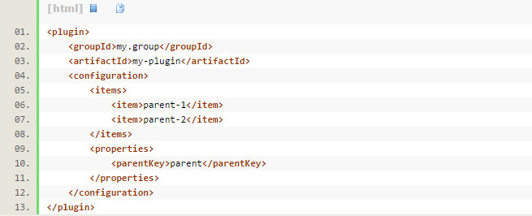

然后在继承的孩子POM中做如下配置：
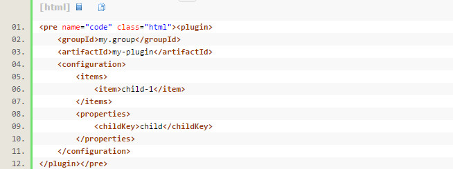

这样孩子POM和parent POM中都存在groupId为my.group的plugin，Maven默认的行为将是根据属性名称将两个plugin的configuration的内容进行合并。如果孩子POM中有一个属性，则该属性是有效的，如果孩子POM中没有一个属性，但parent POM中存在，则parent中的属性是有效的。

根据这些规则，上面的例子在Maven中将得到：
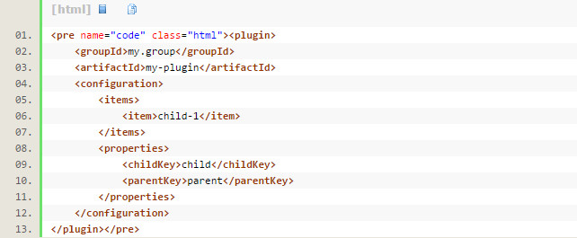

通过在configuration元素中增加combine.children和combine.self属性，孩子POM可以控制Maven怎么合并plugin的configuration。

假定这儿是孩子POM的configuration：
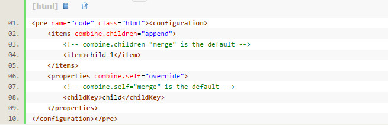

则，现在合并后的效果如下：
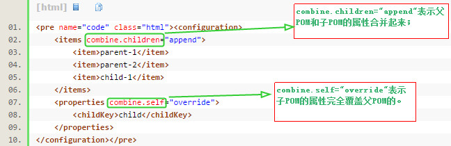

&emsp; 4、dependencies：同base build中的dependencies有同样的结构和功能，但这里是作为plugin的依赖，而不是项目的依赖。      

&emsp; 5、executions：plugin可以有多个目标，每一个目标都可以有一个分开的配置，甚至可以绑定一个plugin的目标到一个不同的阶段。executions配置一个plugin的目标的execution。     

假定一项绑定antrun:run目标到verify阶段，我们希望任务响应build文件夹，同时避免传递配置到他的孩子POM。你将得到一个execution：
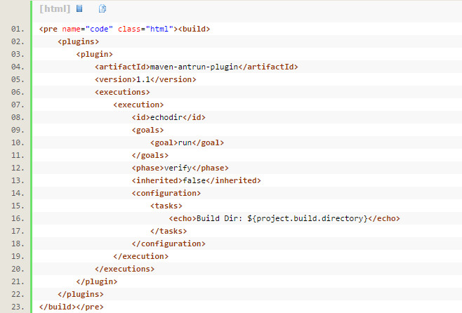 

id：标识，用于和其他execution区分。当这个阶段执行时，它将以这个形式展示：[plugin:goal execution: id]。在这里为： [antrun:run execution: echodir]；

goals：一个plugin的execution的目标列表；

phase：目标执行的阶段，具体值看Maven的生命周期列表；

inherited：是否继承；

configuration：在指定的目标下的配置。

#### Plugin Management

pluginManagement的元素的配置和plugins的配置是一样的，只是这里的配置只是用于集成，在孩子POM中指定使用。例如，在父POM中做如下配置：
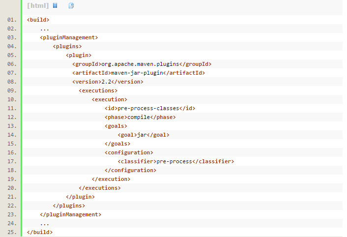 

则在孩子POM中，我们只需要配置：
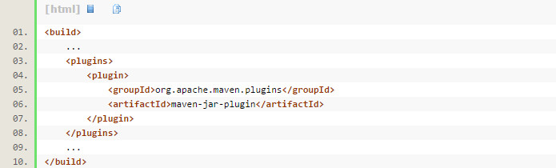 

这样就可以大大的简化孩子POM中的配置。

#### Reporting
Reporting包含的属性对应到site阶段（见Maven生命周期）。特定的Maven插件能产生定义和配置在reporting元素下的报告，例如：产生Javadoc报告。
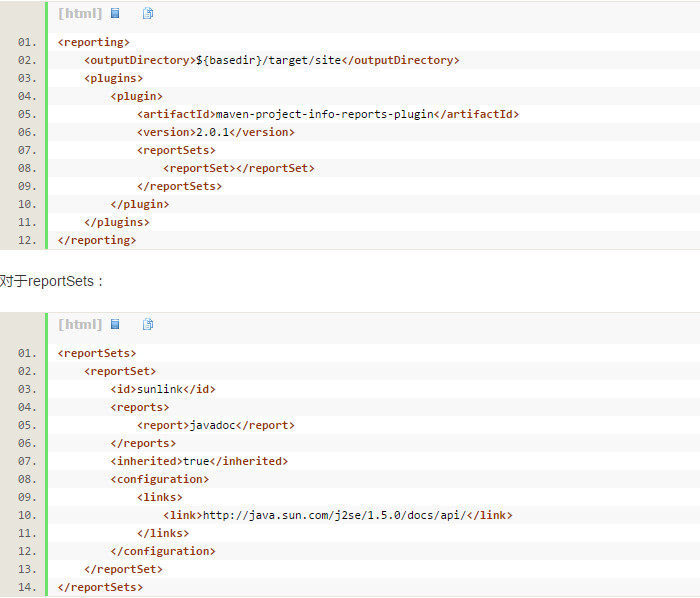 

## Maven的pom.xml文件详解------More Project Information
The Basics和Build Settings定义项目的POM已经足够，但More Project Information可以用于一些信息的扩展，下面介绍More Project Information中的元素。
###### name
项目的更易读的名称。

###### description
项目的描述信息。
######  url
项目所在的url。

###### inceptionYear
项目开始日期

######  licenses
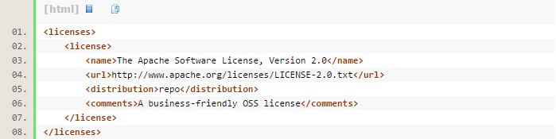 

licenses是定义一个项目（或部分项目）怎么和什么时候可以被使用的法律文件。项目只能列出直接应用到该项目的licenses，不应该列出项目所依赖的组件的licenses。Maven当前只是将这些licenses展示在项目生成的站点上。    
1）name、url和comments：自我说明；    
2）distribution：说明该项目在什么情况下可以合法传播。    

#### organization
项目所在组织的基本信息。
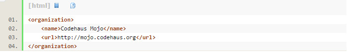 

#### developers
项目的核心开发者信息。
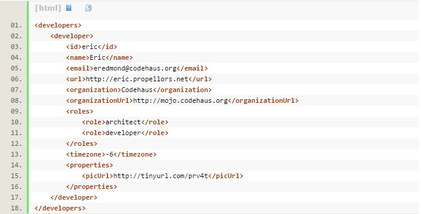 

id, name, email：开发者的信息；     
organization, organizationUrl：开发者的组织信息；     
roles：开发者所承担的角色，可能有多个；     
timezone：所在时区；     
properties：开发者的其它信息；      

#### Contributors
项目的辅助人员信息。
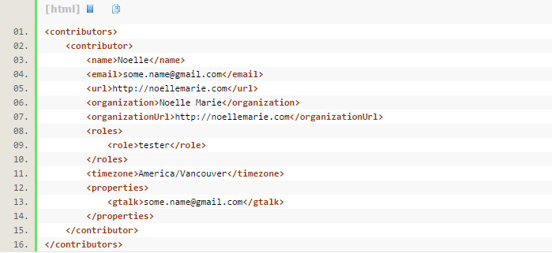 

## Maven的pom.xml文件详解------Environment Settings
[详见http://blog.csdn.net/tomato__/article/details/13770733](http://blog.csdn.net/tomato__/article/details/13770733)

## 生命周期
default生命周期有下列跟随的阶段：    
------clean：清除target目录下的文件
------validate：验证项目是正确的，所有必要的信息是可用的；    
------compile：编译项目的源代码；   
------test：用匹配的单元测试框架测试编译后的源代码。这些测试不应该要求代码被打包或者部署；    
------package：取编译后的代码，并打包它到可分配的格式，例如：JAR；    
------integration-test：处理和部署包到环境（不过有必要），执行集成测试；    
------verify：运行检查以证实生成的包是有效的，达到质量标准的；
------install：安装这个包到本地仓库；    
------deploy：在一个集成或者发布环境中做，拷贝最终的包到远端仓库分享。   


# Maven 多环境配置:开发，测试，生产环境

构建项目结构如下，src/main/resources这里面放的都是配置文件。里面分为dev，test,pro三个目录，分别是开发环境，测试环境和生产环境。   

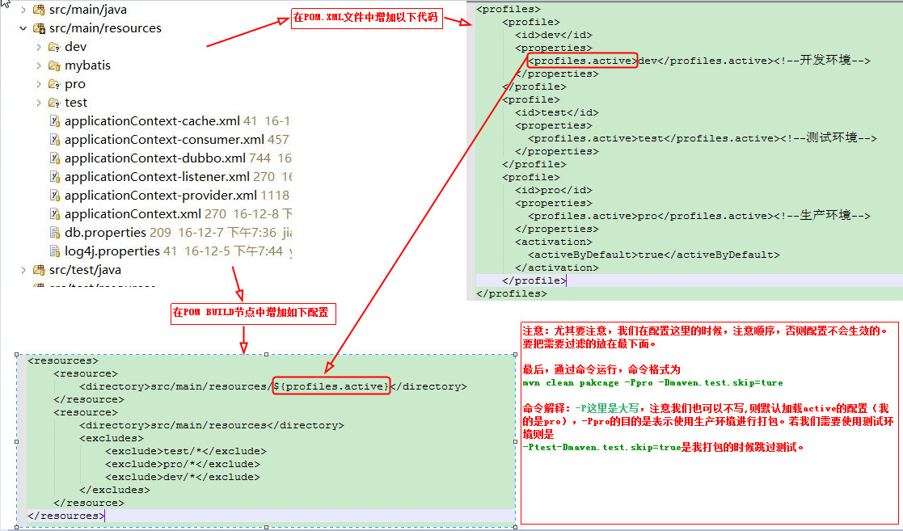

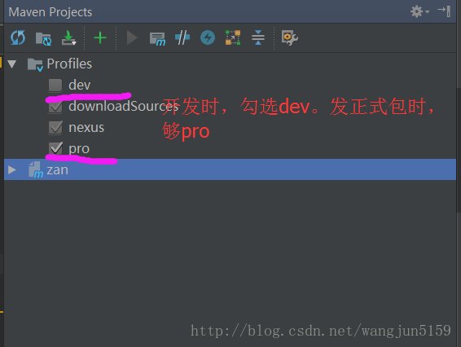

### 修改Maven打包的jdk版本（默认是jdk1.5）或者修改pom文件
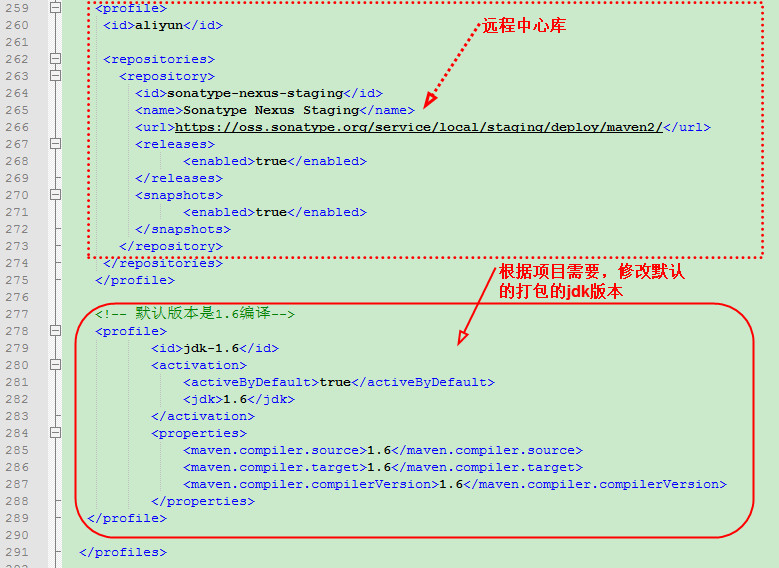
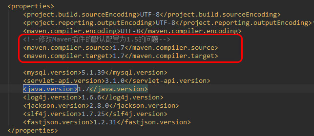

### maven打包之后为什么class文件中没有注释了
方法注释：/** * * * */可以生成 doc 注释
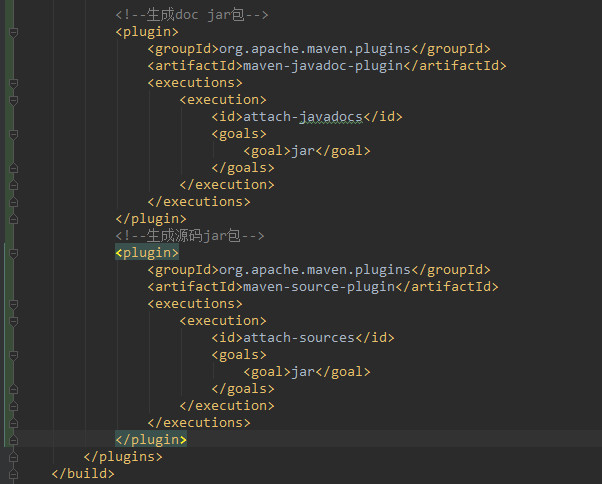


            <!-- 生成javadoc文档包的插件 -->
			<plugin>
				<groupId>org.apache.maven.plugins</groupId>
				<artifactId>maven-javadoc-plugin</artifactId>
				<version>2.10.2</version>
				<configuration>
					<aggregate>true</aggregate>
				</configuration>
				<executions>
					<execution>
						<id>attach-javadocs</id>
						<goals>
							<goal>jar</goal>
						</goals>
					</execution>
				</executions>
			</plugin>
			<!-- 生成sources源码包的插件 -->
			<plugin>
				<artifactId>maven-source-plugin</artifactId>
				<version>2.4</version>
				<configuration>
					<attach>true</attach>
				</configuration>
				<executions>
					<execution>
						<phase>package</phase>
						<goals>
							<goal>jar-no-fork</goal>
						</goals>
					</execution>
				</executions>
			</plugin>


> IDEA中maven打包跳过Junit Test

运行MVN install时需要跳过Junit的test cases，可以采用下面的方法：` mvn install -DskipTests `或者 ` mvn install -Dmaven.test.skip=true `

在IDEA中，我们在install的时候默认打包的也有Junit的test cases，我的方法是：`Run -> Runconfig -> + -> Maven` 然后按照下面配置即可


## 通过profiles属性来打多环境WAR包

在项目开发中必然会遇到打测试环境、生产环境的WAR包，但不同环境的配置往往不同，如数据库连接信息、文件上传目录、MQ地址等等。如果每次打包前都手工修改相关配置文件，繁琐不说还经常容易出错。

maven通过profiles来方便的打多环境war包。

> profiles原理

profiles原理很简单，在打war包时，会根据profiles指定的文件或目录来覆盖当前工程中的文件。如果我们需要打测试环境和生产环境的war包，只需要额外创建两个目录：test测试环境，product生产环境，将与环境有关的配置文件放到该目录下。各环境只需要配置一次。

**profiles使用说明**

这里只介绍最重要的两个属性：

+ overwrite.resources.dir 将其指定目录下的文件或文件夹覆盖到classes下
+ overwrite.webapp.dir 将其指定目录下的文件或文件夹覆盖到webapp下

**打包命令**

通过-P来指定打哪个环境的war包，如下示例是打test环境的war包，test是如何指定的，看后面的示例。

`mvn clean package -DskipTests -Ptest`

**示例:** 配置了三个环境：开发环境、测试环境、生产环境。

1、profile的子标签id用于指定各环境，dev：开发环境、test：测试环境、product：生产环境
2、各环境的相关配置文件放在deployFiles目录下，如测试环境的classes下的配置文件放在deployFiles/test/resources, webapp下的配置文件放在deployFiles/test/webapp
3、通过maven-war-plugin插件打WAR包，并通过directory指定变量名，即是profile中的properties标签名（overwrite.resources.dir）
4、如果源和目标目录不一样，可通过targetPath指定
5、如果dev环境无需配置，则deployFiles/dev/resources下的文件为空即可

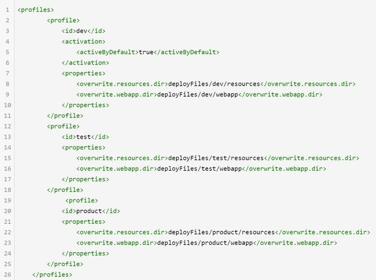

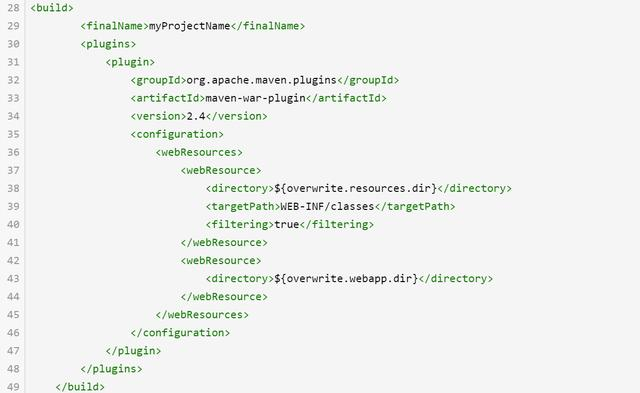

## maven 多模块多Web应用合并War包

场景： 在一个项目中为了清晰划分不同web模块需要配置多个web module。例如：
```xml
<modules>  
	<!-- 主web应用 -->  
	<module>cathy-web</module>  
	<module>cathy-biz</module>  
	<module>cathy-common-util</module>  
	<module>cathy-common-intergration</module>  
	<module>cathy-common-facade</module>  
	<module>cathy-common-model</module>  
	<module>cathy-common-dal</module>  
	<module>cathy-core-service</module>  
	<!-- 子web应用 -->  
	<module>cathy-backend</module>  
</modules> 
```

配置看起来很简单，<font color=red >在打包的时候需要将这两个web打成一个war包又该如何配置呢？</font>此时就需要使用到`maven-war-plugin`这个插件，当然这个插件的功能不仅仅是将多个war包合并成一个war.

在 `cathy-web` 这个module的`pom.xml` 中的dependencies进行如下配置:
```xml
<dependency>  
	<groupId>com.david.demo</groupId>  
	<artifactId>cathy-backend</artifactId>  
	<type>war</type>  
</dependency> 

//在plugins增加如下配置
<!-- 合并多个war -->  
<plugin>  
	<groupId>org.apache.maven.plugins</groupId>  
	<artifactId>maven-war-plugin</artifactId>  
	<configuration>  
		<packagingExcludes>WEB-INF/web.xml</packagingExcludes>  
		<failOnMissingWebXml>false</failOnMissingWebXml>  
		<overlays>  
			<overlay>  
				<groupId>com.david.demo</groupId>  
				<artifactId>cathy-backend</artifactId>  
			</overlay>  
		</overlays>  
	</configuration>  
</plugin>  
```

对应的，在主pom中的依赖中增加：
```xml
<dependency>  
	<groupId>com.david.demo</groupId>  
	<artifactId>cathy-backend</artifactId>  
	<version>0.0.1-SNAPSHOT</version>  
	<type>war</type>  
	<scope>runtime</scope>  
</dependency>  
```
子web module 的结构是:

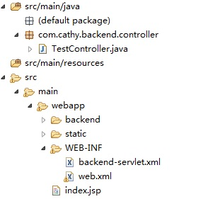

在项目的主目录下执行 `mvn -Dmaven.test.skip=true`后

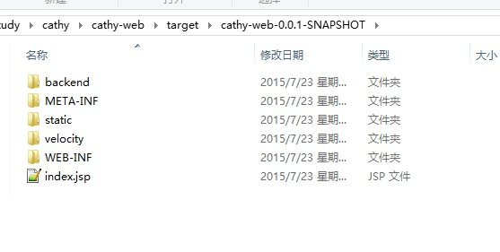

可以看到子web module中的文件夹已经合并到主web中了，注意如果同名的文件夹和合并的，同时不合并空文件夹

**在实际的项目中配置文件在不同的环境中配置是不同的，那么如何根据环境去参数化配置呢？**

在`主web的pom`中进行如下配置
```xml
<profiles>  
	<profile>  
		<id>dev</id>  
		<build>  
			<filters>  
				<filter>  
					src/main/resources/META-INF/config-dev.properties  
				</filter>  
			</filters>  
		</build>  
	</profile>  
	<profile>  
		<id>test</id>  
		<build>  
			<filters>  
				<filter>  
					src/main/resources/META-INF/config-test.properties  
				</filter>  
			</filters>  
		</build>  
	</profile>  
</profiles>  

<plugin>  
	<groupId>org.apache.maven.plugins</groupId>  
	<artifactId>maven-war-plugin</artifactId>  
	<configuration>  
		<packagingExcludes>WEB-INF/web.xml</packagingExcludes>  
		<failOnMissingWebXml>false</failOnMissingWebXml>  
		<webResources>  
			<resource>  
				<directory>  
					src/main/resources/config  
				</directory>  
				<filtering>true</filtering>  
				<targetPath>WEB-INF/classes</targetPath>  
			</resource>  
		</webResources>  
		<overlays>  
			<overlay>  
				<groupId>com.david.demo</groupId>  
				<artifactId>cathy-backend</artifactId>  
			</overlay>  
		</overlays>  
	</configuration>  
</plugin>
```
config目录中log4j.xml的配置文件中有：
```xml
<appender name="DEFAULT-APPENDER"  
    class="com.david.common.log4j.DailyRollingFileAppender">  
    <param name="file" value="P:/${host_name}/common-default.log" />  
    <param name="append" value="true" />  
    <param name="encoding" value="GBK" />  
    <layout class="org.apache.log4j.PatternLayout">  
        <param name="ConversionPattern"  
            value="%d [%X{loginUserEmail}/%X{loginUserID}/%X{remoteAddr}/%X{clientId} - %X{requestURIWithQueryString}] %-5p %c{2} - %m%n" />  
    </layout>  
</appender>  
```

 使用 `mvn  package -P test -Dmaven.test.skip=true `打包的结果是：
 ```xml
 <!-- ===== [公共Appender] ===== -->  
    <!-- [公共Appender] 默认 -->  
    <appender name="DEFAULT-APPENDER"  
        class="com.david.common.log4j.DailyRollingFileAppender">  
        <param name="file" value="P:/test/common-default.log" />  
        <param name="append" value="true" />  
        <param name="encoding" value="GBK" />  
        <layout class="org.apache.log4j.PatternLayout">  
            <param name="ConversionPattern"  
                value="%d [%X{loginUserEmail}/%X{loginUserID}/%X{remoteAddr}/%X{clientId} - %X{requestURIWithQueryString}] %-5p %c{2} - %m%n" />  
        </layout>  
    </appender>  
 ```