# webpack 笔记

【 抛出问题：】
> 1、什么是webpack？
> 
> 2、为什么要使用webpack？
> 
> 3、webpack的优、缺点？如何为规避这些问题？
>
> 4、如何在生产环境中使用？

## 概念

核心概念：入口（entry）、输出（output）、loader（）、插件（plugins）

### 入口(Entry)
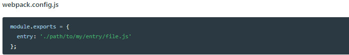

#### 单个入口（简写）语法

**用法：**  `entry: string|Array<string>`   

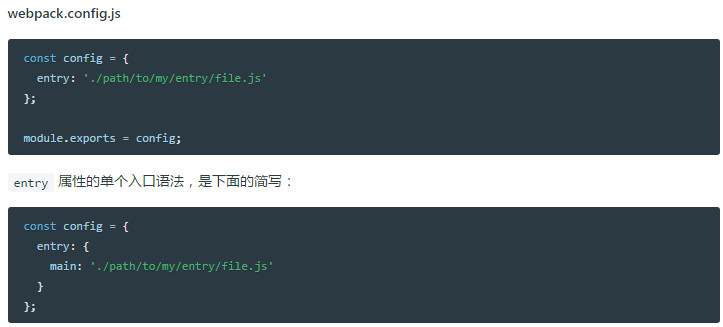

#### 对象语法
**用法：**  `entry: {[entryChunkName: string]: string|Array<string>}`   
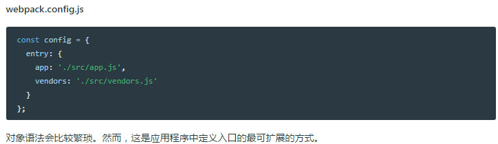

#### 常见场景

> 分离 应用程序(app) 和 第三方库(vendor) 入口

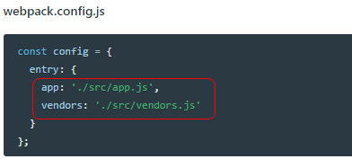

> 多页面应用程序

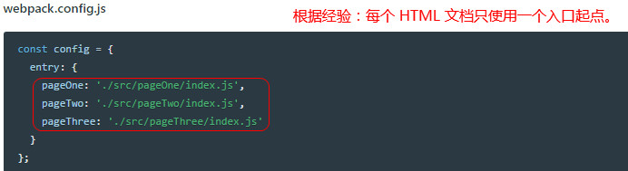

### 出口(Output)
&emsp;&emsp;将所有的资源(assets)归拢在一起后，还需要告诉 webpack **在哪里**打包应用程序。webpack 的 `output` 属性描述了**如何处理归拢在一起的代码**(bundled code)。		
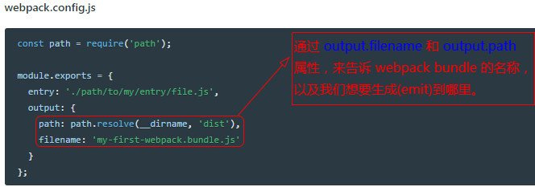

#### 用法(Usage)

在 webpack 中配置 output 属性的最低要求是，将它的值设置为一个对象，包括以下两点：

- filename 用于输出文件的文件名。
- 目标输出目录 path 的绝对路径。
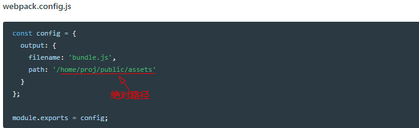

#### 多个入口起点

#### 高级进阶
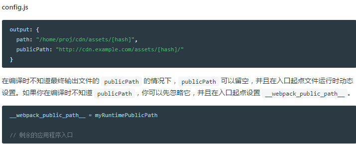

### Loader
&emsp;&emsp;webpack 的目标是，让 webpack 聚焦于项目中的所有资源(asset)，而浏览器不需要关注考虑这些（明确的说，这并不意味着所有资源(asset)都必须打包在一起）。webpack [把每个文件(.css, .html, .scss, .jpg, etc.) 都作为模块](https://doc.webpack-china.org/concepts/modules/)处理。然而 webpack 只理解 JavaScript。

**webpack loader 在文件被添加到依赖图中时，其转换为模块。**

在更高层面，在 webpack 的配置中 loaders 有两个目标。

 1、识别出(identify)应该被对应的 loader 进行转换(transform)的那些文件。(test 属性)      
 2、 转换这些文件，从而使其能够被添加到依赖图中（并且最终添加到 bundle 中）(use 属性)  

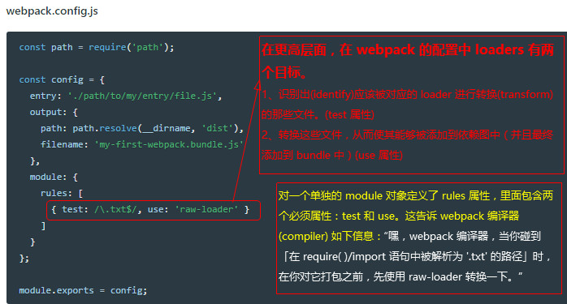 

#### 使用Loader

在你的应用程序中，有三种使用 loader 的方式：

- 配置（推荐）：在 webpack.config.js 文件中指定 loader。
- 内联：在每个 import 语句中显式指定 loader。
- CLI：在 shell 命令中指定它们。

#### 配置[Configuration]
`module.rules` 允许你在 webpack 配置中指定多个 loader。 这是展示 loader 的一种简明方式，并且有助于使代码变得简洁。同时让你对各个 loader 有个全局概览：
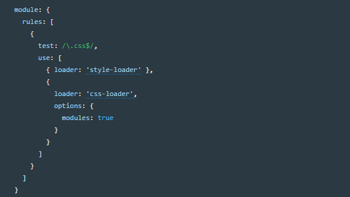 

#### 内联
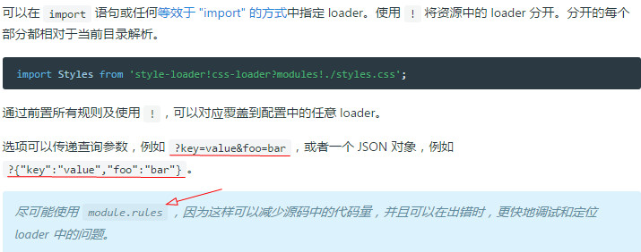

#### CLI

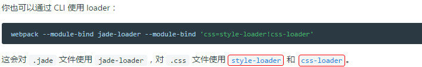

#### Loader 特性

- loader 支持链式传递。能够对资源使用流水线(pipeline)。一组链式的 loader 将按照先后顺序进行编译。loader 链中的第一个 loader 返回值给下一个 loader。在最后一个 loader，返回 webpack 所预期的 JavaScript。
- loader 可以是同步的，也可以是异步的。
- loader 运行在 Node.js 中，并且能够执行任何可能的操作。
- loader 接收查询参数。用于对 loader 传递配置。
- loader 也能够使用 options 对象进行配置。
- 除了使用 package.json 常见的 main 属性，还可以将普通的 npm 模块导出为 loader，做法是- - 在 package.json 里定义一个 loader 字段。
- 插件(plugin)可以为 loader 带来更多特性。
- loader 能够产生额外的任意文件。

loader 遵循标准的模块解析。多数情况下，loader 将从模块路径（通常将模块路径认为是` npm install, node_modules`）解析。

### 插件(Plugins)
&emsp;&emsp;想要使用一个插件，你只需要 require() 它，然后把它添加到 plugins 数组中。多数插件可以通过选项(option)自定义。你也可以在一个配置文件中因为不同目的而多次使用同一个插件，这时需要通过使用 new 来创建它的一个实例。
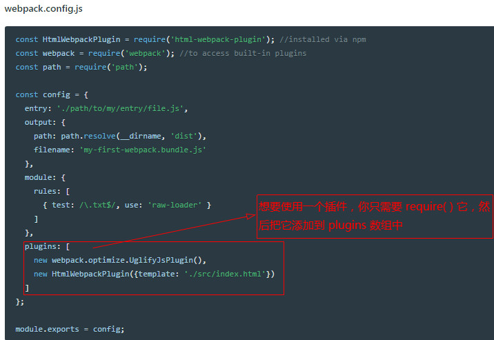 

### 配置(Configuration)
 **webpack 的配置文件是 JavaScript 文件导出的一个对象。** 此对象，由 webpack 根据对象定义的属性进行解析。

因为 webpack 配置是标准的 Node.js CommonJS 模块，你可以使用如下特性：

- 通过 `require(...)` 导入其他文件
- 通过 `require(...)` 使用 npm 的工具函数
- 使用 JavaScript 控制流表达式，例如` ?: `操作符
- 对常用值使用常量或变量
- 编写并执行函数来生成部分配置

请在合适的时机使用这些特性。

虽然技术上可行，但应避免以下做法**：

- 在使用 webpack 命令行接口(CLI)（应该编写自己的命令行接口(CLI)，或`使用 --env`）时，访问命令行接口(CLI)参数
- 导出不确定的值（调用 webpack 两次应该产生同样的输出文件）
-编写很长的配置（应该将配置拆分为多个文件）

#### 最简单的配置
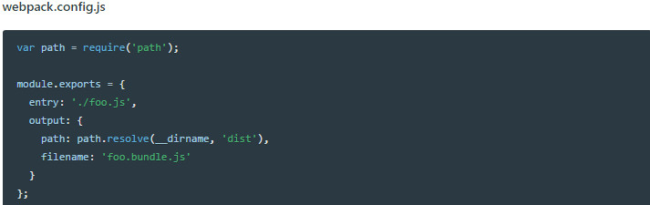 

### 模块(Modules)

#### 什么是 webpack 模块
对比 Node.js 模块，webpack 模块能够以各种方式表达它们的依赖关系，几个例子如下：

- `ES2015 import` 语句
- `CommonJS require( )` 语句
- `AMD` define 和 require 语句
- css/sass/less 文件中的 `@import` 语句。
- 样式(`url(...)`)或 HTML 文件(``)中的图片链接(image url)

#### 支持的模块类型

- CoffeeScript
- TypeScript
- ESNext (Babel)
- Sass
- Less
- Stylus

### 模块解析(Module Resolution)

## 什么是webpack？

> Webpack 是一个模块打包器。它将根据模块的依赖关系进行静态分析，然后将这些模块按照指定的规则生成对应的静态资源。
> 
> 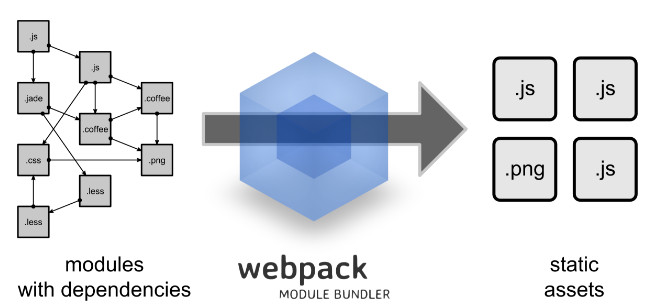

## Webpack 有两种组织模块依赖的方式
> Webpack 有两种组织模块依赖的方式，同步和异步。异步依赖作为分割点，形成一个新的块。在优化了依赖树后，每一个异步区块都作为一个文件被打包。

## webpack 如何工作
> **Loader**
> 
> Webpack 本身只能处理原生的 JavaScript 模块，但是 loader 转换器可以将各种类型的资源转换成 JavaScript 模块。这样，任何资源都可以成为 Webpack 可以处理的模块。
> 
> **智能解析**
> 
> Webpack 有一个智能解析器，几乎可以处理任何第三方库，无论它们的模块形式是 CommonJS、 AMD 还是普通的 JS 文件。甚至在加载依赖的时候，允许使用动态表达式 require("./templates/" + name + ".jade")。
> 
> **插件系统**
> 
> Webpack 还有一个功能丰富的插件系统。大多数内容功能都是基于这个插件系统运行的，还可以开发和使用开源的 Webpack 插件，来满足各式各样的需求
> 
> **快速运行**
> 
> Webpack 使用异步 I/O 和多级缓存提高运行效率，这使得 Webpack 能够以令人难以置信的速度快速增量编译。

## 安装使用 webpack

> 使用npm 安装 Webpack：
> 
> 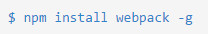
> 
> 此时 Webpack 已经安装到了全局环境下，可以通过命令行 **webpack -h** 试试。
> 
> 通常我们会将 Webpack 安装到项目的依赖中，这样就可以使用项目本地版本的 Webpack。
> 
> 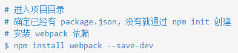
> 

## 配置文件 webpack.config.js
>
> 在(所需)根目录创建 package.json 来添加 webpack 需要的依赖：
> 
> 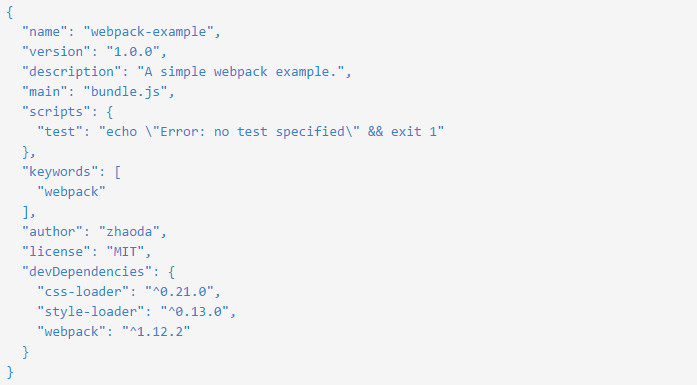
> 
> 运行 npm install，然后创建一个配置文件 webpack.config.js
> 
> 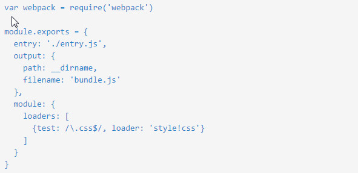
> 
> 同时简化 entry.js 中的 style.css 加载方式：
> 
> 

## CommonJS 规范
>
> CommonJS 是以在浏览器环境之外构建 JavaScript 生态系统为目标而产生的项目，比如在服务器和桌面环境中。
> 这个项目最开始是由 Mozilla 的工程师 Kevin Dangoor 在2009年1月创建的，当时的名字是 ServerJS。
>
> CommonJS 是一套规范。（CommonJS 已经过时，Node.js 的内核开发者已经废弃了该规范。）
> CommonJS 规范是为了解决 JavaScript 的作用域问题而定义的模块形式，可以使每个模块它自身的命名空间中执行。该规范的主要内容是，模块必须通过 module.exports 导出对外的变量或接口，通过 require() 来导入其他模块的输出到当前模块作用域中。
> 

## AMD 规范
> AMD（异步模块定义）是为浏览器环境设计的，因为 CommonJS 模块系统是同步加载的，当前浏览器环境还没有准备好同步加载模块的条件。
> 
> AMD 定义了一套 JavaScript 模块依赖异步加载标准，来解决同步加载的问题。
> 
> 模块通过 define 函数定义在闭包中，格式如下：
> 
> 
> 
> [例子：]
> 
> 定义一个名为 **myModule** 的模块，它依赖 **jQuery** 模块：
> 
> 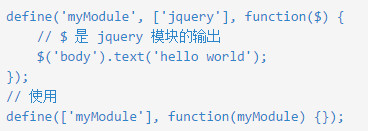
> 
> 注意：在 webpack 中，模块名只有局部作用域，在 Require.js 中模块名是全局作用域，可以在全局引用。
> 
> 定义一个没有 id 值的匿名模块，通常作为应用的启动函数：
> 
> 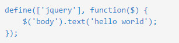
> 
> 依赖多个模块的定义：
> 
> 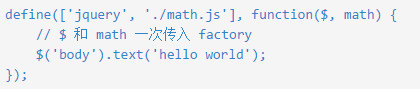
> 
> 模块输出：
> 
> 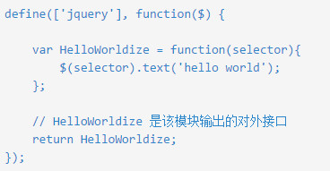
> 
> 在模块定义内部引用依赖：
> 
> 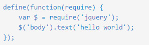