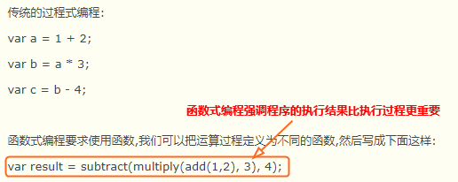
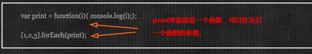
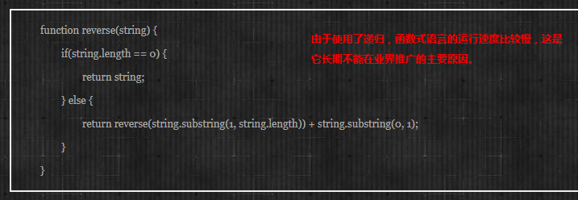
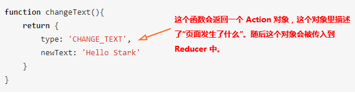
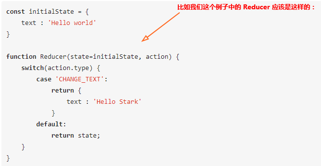
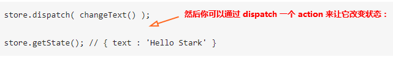

# Redux 学习
> **Redux 是 JavaScript 状态容器，提供可预测化的状态管理。**
>
> 可以让你构建一致化的应用，运行于不同的环境（客户端、服务器、原生应用），并且易于测试。不仅于此，它还提供 超爽的开发体验，比如有一个时间旅行调试器可以编辑后实时预览。
>
> Redux 除了和 React 一起用外，还支持其它界面库。
> 它体小精悍（只有2kB）且没有任何依赖。

## 函数式编程思想

函数式编程是把一个功能的一个操作和相关数据封装在一起，函数式编程是函数满天飞。(面向对象是把一个功能的一组操作和相关数据封装在一个对象里，面向对象是对象满天飞。)

函数不访问全局变量，也不改变全局变量。(函数式编程的准则：函数不受外部变量影响，不依赖于外部变量，也不改变外部变量的值。)

函数式编程关心数据的映射，命令式编程关心解决问题的步骤.

**特点**

+ 1. 函数是"第一等公民"

&nbsp;&nbsp;所谓"第一等公民"（first class），指的是函数与其他数据类型一样，处于平等地位，可以赋值给其他变量，也可以作为参数，传入另一个函数，或者作为别的函数的返回值。

举例来说，下面代码中的print变量就是一个函数，可以作为另一个函数的参数。

+ 2. 只用"表达式"，不用"语句"

"表达式"（expression）是一个单纯的运算过程，总是有返回值；"语句"（statement）是执行某种操作，没有返回值。函数式编程要求，只使用表达式，不使用语句。也就是说，每一步都是单纯的运算，而且都有返回值。

原因是函数式编程的开发动机，一开始就是为了处理运算（computation），不考虑系统的读写（I/O）。"语句"属于对系统的读写操作，所以就被排斥在外。

当然，实际应用中，不做I/O是不可能的。因此，编程过程中，函数式编程只要求把I/O限制到最小，不要有不必要的读写行为，保持计算过程的单纯性。

+ 3. 没有"副作用" -- 不会修改外部变量

所谓"副作用"（side effect），指的是函数内部与外部互动（最典型的情况，就是修改全局变量的值），产生运算以外的其他结果。

函数式编程强调没有"副作用"，意味着函数要保持独立，所有功能就是返回一个新的值，没有其他行为，尤其是不得修改外部变量的值。

+ 4. 不修改状态

上一点已经提到，函数式编程只是返回新的值，不修改系统变量。因此，不修改变量，也是它的一个重要特点。

在其他类型的语言中，变量往往用来保存"状态"（state）。不修改变量，意味着状态不能保存在变量中。函数式编程使用参数保存状态，最好的例子就是递归。下面的代码是一个将字符串逆序排列的函数，它演示了不同的参数如何决定了运算所处的"状态"。

+ 5. 引用透明

引用透明（Referential transparency），指的是函数的运行不依赖于外部变量或"状态"，只依赖于输入的参数，任何时候只要参数相同，引用函数所得到的返回值总是相同的。

有了前面的第三点和第四点，这点是很显然的。其他类型的语言，函数的返回值往往与系统状态有关，不同的状态之下，返回值是不一样的。这就叫"引用不透明"，很不利于观察和理解程序的行为。

### 理解Redux
view ---> action ---> reducer ---> store(state) ---> view

如果放入一个web app中，首先store(state)决定了view，然后用户与view的交互会产生action，这些action会触发reducer因而改变state，然后state的改变又造成了view的变化。

#### Action 

Action 的任务是描述“发生了什么事情？”

#### Reducer

Reducer 的任务是根据传入的 Action 对象去修改状态树。

或者简单地讲 Reducer 就是一个纯函数， 根据传入的 当前state 和 action ，返回一个新的 state ：`(state, action) => newState`

#### Store

Store 就是把 Reducer 和 action 联系到一起的对象。Store 有以下职责：

* 维持应用的 state；
* 提供 getState() 方法获取 state；
* 提供 dispatch(action) 方法更新 state；
* 通过 subscribe(listener) 注册监听器；

## Redux是什么？

全局的、唯一的、不可改变的内存状态[数据库]

reducer是一个纯函数，可以接收到“任何”Action

## reducer 不改变状态，只返回新的状态

Reducer 是一个形式为 `(state,action) => state ` 的纯函数,描述了action如何把state转变成下一个state。

reduce、map、filter 等方法是函数式编程中常用的数组处理方法

Action是个JavaScript对象，它是store数据的唯一来源。

Store负责更新、查询、订阅state等多个工作。Store是全局唯一的，它将action、reducer、state等联系在一起。