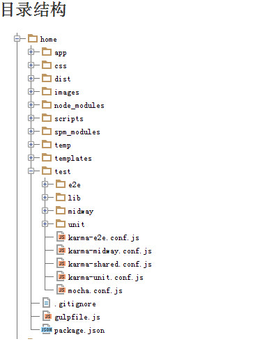
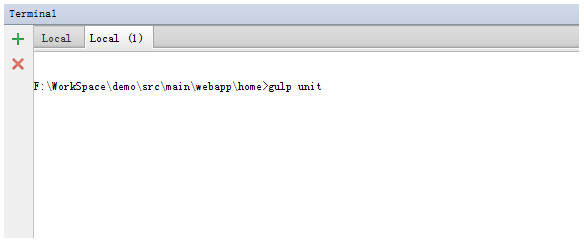
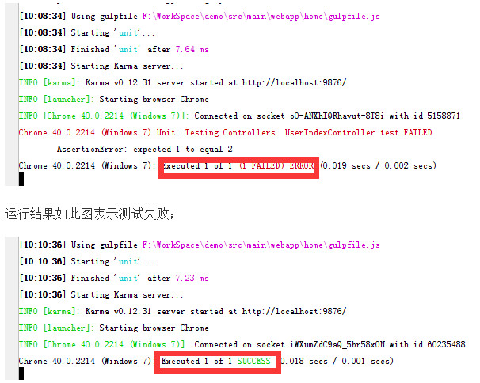
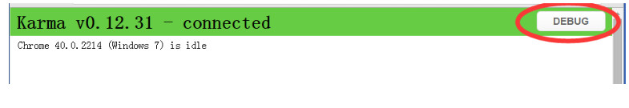

# 搭建JavaScript的测试环境

## 前言
Javascript是动态类型语言，它的表达式非常强大，但也因此使得编译器对它没有任何帮助。所以我们强烈的觉得它需要强大的测试框架。Angular已经建好了这样一个框架，我们所以没有理由不用吧！ 为什么我们需要测试？换个说法测试对我们来说有什么好处呢？测试对我们的开发来说是必不可少的，业界一直提倡TDD的开发模式，但由于国内的开发水平有限，所以一直没有得到很好的推广，但这是不是意 味着我们的代码就不需要测试了呢，答案是否，测试对我们开发的好处是显而易见的：

（1）可以提高我们代码质量；

（2）可以更全面的找出代码中的BUG；

（3）可以统一团队的开发风格，有利于伙伴对自己代码的理解；

（4）可以提高开速度；

既然有这么多的好处，你还有什么理由不做测试。那问题又来了，我们应该如何做测试？用什么做测试？不用着急，这些问题我会在后面的文章一一为你解答，我们的测试分为单元测试，中间测试以及端到端的测试，你只要跟着我的步伐一步一步往下走，就一定会搭出一个漂亮的测试环境，我们的测试都是基于NODE.JS平台的，如果你还没有安装NODE.JS，请先安装，如果已经准备好了，那还等什么，测试走起。

## 单元测试

什么是单元测试

单元测试（模块测试）是开发者编写的一小段代码，用于检验被测代码的一个很小的、很明确的功能是否正确。通常而言，一个单元测试是用于判断某个特定条件（或者场景）下某个特定函数的行为。例如，你可能把一个很大的值放入一个有序list中去，然后确认该值出现在list的尾部。或者，你可能会从字符串中删除匹配某种模式的字符，然后确认字符串确实不再包含这些字符了。

需要的工具和框架

GULP：用于生成测试任务，以便于我们以命令行的形式起动测试;可以监控(Watch)文件的变化，然后自动执行；

KARMA：这是一个基于Node.js的JavaScript测试执行过程管理工具（TestRunner）。该工具可用于测试 所有主流Web浏览器，也可集成到CI（Continuous integration）工具，也可和其他代码编辑器一起使 用。这个测试工具的一个强大特性就是，它可以监控(Watch)文件的变化，然后自动执行，通过 console.log显示测试结果；

MOCHA：这是一个功能丰富的JavaScript测试框架，他可以运行在node平台和浏览器上，使异步测试变得简单和有趣。Mocha在运行测试用例过程中，当捕获到错误时，依旧能够灵活地运行精确的报告；

CHAI：这是一个BDD/TDD模式的断言库，可以再node平台和浏览器环境运行，可以高效的和任何js测试框架搭配合使用，这里我们用Chai和mocha配合，合称“抹茶”。

*这里的文档结构，我展示它只是为了测试而举例，并不是一定要按照这样的结构，具体情况具体对待。

app：存放项目所有文件；

node_modules：存放node安装的所有包；

spm_modules：存放spm安装的所有包；

test：存放所有的测试文件；

搭建测试环境

第1步 安装需要的工具和框架

切到home目录下，package.json文件中配置了所有我们开发中要用到的工具和框架，所以只在当前目录下运行$ cnpm install 和$ spm install命令就可以安装我们测试所使用到的所有工具和框架。

package.json配置如下：

	{
	  "name": "home",
	  "version": "1.0.0",
	  "description": "home",
	  "main": "index.js",
	  "private": true,
	  "scripts": {
	    "test": "echo \"Error: no test specified\" && exit 1"
	  },
	  "author": "",
	  "license": "ISC",
	  "devDependencies": {
	    "browser-sync": "^2.0.1",
	    "gulp": "^3.8.10",
	    "gulp-clean": "^0.3.1",
	    "gulp-concat": "^2.4.3",
	    "gulp-jshint": "^1.9.1",
	    "gulp-less": "^3.0.0",
	    "gulp-livereload": "^3.7.0",
	    "gulp-load-plugins": "^0.8.0",
	    "gulp-minify-css": "^0.4.3",
	    "gulp-mocha": "^2.0.0",
	    "gulp-mocha-phantomjs": "^0.5.3",
	    "gulp-rename": "^1.2.0",
	    "gulp-uglify": "^1.1.0",
	    "gulp-watch": "^4.1.0",
	    "chai": "1.4.0",
	    "gulp-karma": "0.0.4",
	    "karma": "^0.12.31",
	    "karma-chrome-launcher": "~0.1.0",
	    "karma-coffee-preprocessor": "~0.1.0",
	    "karma-firefox-launcher": "~0.1.0",
	    "karma-html2js-preprocessor": "~0.1.0",
	    "karma-jasmine": "~0.1.3",
	    "karma-mocha": "latest",
	    "karma-ng-scenario": "latest",
	    "karma-phantomjs-launcher": "~0.1.0",
	    "karma-requirejs": "~0.1.0",
	    "karma-safari-launcher": "latest",
	    "karma-script-launcher": "~0.1.0",
	    "ng-midway-tester": "2.0.5"
	  },
	  "spm": {
	    "dependencies": {
	      "bootstrap-css": "0.0.1",
	      "xn-style-common": "1.0.1",
	      "xn-icon": "1.0.0",
	      "angular": "1.3.9"
	    }
	  }
	}
第2步 配置GULP

切换到你想要放置GULP配置文件的目录，然后创建一个Gulpfile.json文件；

Gulpfile.json文件内容如下：

	var gulp = require("gulp");
	var karma = require('gulp-karma');
	//所有需要被测试的js文件和测试的js文件
	var testFiles = [
	    'spm_modules/angular/**/angular.js',
	    'spm_modules/angular-mocks/**/angular-mocks.js',
	    'app/scripts/controllers/user.js',
	    'test/unit/controllers/controllersSpec.js',
	    'node_modules/chai/chai.js',
	    'test/lib/chai-should.js',
	    'test/lib/chai-expect.js',
	    'test/mocha.conf.js'
	];
	//单元测试，不带监控
	gulp.task('unit-single', function() {
	    gulp.src(testFiles)
	        .pipe(karma({
	            configFile: './test/karma-unit.conf.js',
	            action: 'run'
	        }))
	        .on('error', function(err) {
	            throw err;
	        });
	});
	//单元测试，带监控
	gulp.task('unit', function() {
	    gulp.src(testFiles)
	        .pipe(karma({
	            configFile: './test/karma-unit.conf.js',
	            action: 'watch'
	        }));
	});
第3步 配置KARMA

切换到你想要放置KARMA配置文件的目录，然后在当前目录下输入下面的命令来创建配置文件：

karma init karma.config.js

你会被询问一些问题，包括你想使用那个测试框架，你是否需要自动监测文件，包含哪些测试和被测试文件等。最后会生成karma.config.js文件。

karma.config.js配置如下：

	//引入karma-shared.conf.js文件
	var sharedConfig = require('./karma-shared.conf');
	
	module.exports = function(config) {
	    //获取配置对象
	    var conf = sharedConfig();
	
	    config.set(conf);
	};
另外我们将一些公用的karma配置写在一个公共的js文件中，这里我命名为karma-shared-config.js

karma-shared-config.js配置如下：

	module.exports = function() {
	    return {
	        basePath: '../',
	
	        //配置测试框架
	        frameworks: ['mocha'],
	
	        reporters: ['progress'],
	
	        //配置测试的浏览器
	        browsers: ['Chrome'],
	
	        singleRun: true,
	
	        colors: true
	    }
	};
在私有配置文件中引用karma-shared.conf.js的方式：

var sharedConfig = require('./karma-shared.conf');
第4步 基本的测试

关键字：describe、it、expect、to

describe：分组；在测试中我们没必要一个一个的去运行测试用例，我们希望把许多测试用例一起运行，那么我们就需要用到关键字describe来对测试用例进行分组达到一起运行的效果；

it：用例；我们用关键字it来定义一个个的测试用例；

expect：期望；我们为每个测试设置一个期望值；

to：比较；将我们事先设置的期望值和用例执行后的返回值进行比较。

第5步 编写测试用例

假设你已经有一个文件user.js需要测试。user.js内容如下：

	(function(){
	    "use strict";
	    angular.module("xn.page", [])
	    .controller("UserIndexController", ["$scope", "$http", function($scope, $http){
	        $scope.vm = {
	            pageNumber: 1,
	            pageSize: 10,
	            sourceTypes : ["EMPLOYEE", "NONE"]
	        };
	        $scope.pagedResult = [];
	    });
	}])();
user.js的测试文件我们命名为controllersSpec.js，controllersSpec.js内容如下：

	//
	// test/unit/controllers/controllersSpec.js
	//
	describe("Unit: Testing Controllers ", function() {
	
	    beforeEach(module('xn.page'));
	
	    var $controller;
	
	    beforeEach(inject(function(_$controller_){
	        // The injector unwraps the underscores (_) from around the parameter names when matching
	        $controller = _$controller_;
	    }));
	
	    describe('UserIndexController', function() {
	        it('test', function() {
	            var $scope = {}, $http={};
	            var controller = $controller('UserIndexController', { $scope: $scope, $http: $http});
	            expect($scope.vm.pageNumber).to.equal(1);
	        });
	    });
	});
接下来要将命令行的路径指向Gulpfile.json文件，如下图：

输入下面命令：

$ gulp unit

这样我们的测试就会被运行起来，并且我们js文件会被监控，每当我们的js文件被修改并保存后，测试都会被自动运行，如下图：

运行结果如此图表示测试成功；

如果我们需要进行debug，可以点击浏览器右上角的debug按钮进入debug模式，如图：

总结
到此，我们测试就完成了

## midway测试

什么是midway测试

midway测试，测的是前端向后端发送请求，能否顺利运行，并返回预期的结果。

需要的工具和框架

GULP：用于生成测试任务，以便于我们以命令行的形式起动测试;可以监控(Watch)文件的变化，然后自动执行；

KARMA：这是一个基于Node.js的JavaScript测试执行过程管理工具（TestRunner）。该工具可用于测试 所有主流Web浏览器，也可集成到CI（Continuous integration）工具，也可和其他代码编辑器一起使 用。这个测试工具的一个强大特性就是，它可以监控(Watch)文件的变化，然后自动执行，通过 console.log显示测试结果；

MOCHA：这是一个功能丰富的JavaScript测试框架，他可以运行在node平台和浏览器上，使异步测试变得简单和有趣。Mocha在运行测试用例过程中，当捕获到错误时，依旧能够灵活地运行精确的报告；

CHAI：这是一个BDD/TDD模式的断言库，可以再node平台和浏览器环境运行，可以高效的和任何js测试框架搭配合使用，这里我们用Chai和mocha配合，合称“抹茶”。

目录结构

*这里的文档结构，我展示它只是为了测试而举例，并不是一定要按照这样的结构，具体情况具体对待。

app：存放项目所有文件；

node_modules：存放node安装的所有包；

spm_modules：存放spm安装的所有包；

test：存放所有的测试文件；

搭建测试环境

第1步 安装需要的工具和框架

切到home目录下，package.json文件中配置了所有我们开发中要用到的工具和框架，所以只在当前目录下运行$ cnpm install 和$ spm install命令就可以安装我们测试所使用到的所有工具和框架。

package.json配置如下：

{
  "name": "home",
  "version": "1.0.0",
  "description": "home",
  "main": "index.js",
  "private": true,
  "scripts": {
    "test": "echo \"Error: no test specified\" && exit 1"
  },
  "author": "",
  "license": "ISC",
  "devDependencies": {
    "browser-sync": "^2.0.1",
    "gulp": "^3.8.10",
    "gulp-clean": "^0.3.1",
    "gulp-concat": "^2.4.3",
    "gulp-jshint": "^1.9.1",
    "gulp-less": "^3.0.0",
    "gulp-livereload": "^3.7.0",
    "gulp-load-plugins": "^0.8.0",
    "gulp-minify-css": "^0.4.3",
    "gulp-mocha": "^2.0.0",
    "gulp-mocha-phantomjs": "^0.5.3",
    "gulp-rename": "^1.2.0",
    "gulp-uglify": "^1.1.0",
    "gulp-watch": "^4.1.0",
    "chai": "1.4.0",
    "gulp-karma": "0.0.4",
    "karma": "^0.12.31",
    "karma-chrome-launcher": "~0.1.0",
    "karma-coffee-preprocessor": "~0.1.0",
    "karma-firefox-launcher": "~0.1.0",
    "karma-html2js-preprocessor": "~0.1.0",
    "karma-jasmine": "~0.1.3",
    "karma-mocha": "latest",
    "karma-ng-scenario": "latest",
    "karma-phantomjs-launcher": "~0.1.0",
    "karma-requirejs": "~0.1.0",
    "karma-safari-launcher": "latest",
    "karma-script-launcher": "~0.1.0",
    "ng-midway-tester": "2.0.5"
  },
  "spm": {
    "dependencies": {
      "bootstrap-css": "0.0.1",
      "xn-style-common": "1.0.1",
      "xn-icon": "1.0.0",
      "angular": "1.3.9"
    }
  }
}
第2步 配置GULP

切换到你想要放置GULP配置文件的目录，然后创建一个Gulpfile.json文件；

Gulpfile.json文件内容如下：

var gulp = require("gulp");
var karma = require('gulp-karma');
//所有需要被测试的js文件和测试的js文件
var testFiles = [
    'spm_modules/angular/**/angular.js',
    'app/scripts/service.js',
    'node_modules/chai/chai.js',
    'test/lib/chai-should.js',
    'test/lib/chai-expect.js',
    'node_modules/ng-midway-tester/src/ngMidwayTester.js',
    'test/mocha.conf.js',
    'test/midway/services/serviceSpec.js'
];
//midway测试，不带监控
gulp.task('test-single', function() {
    gulp.src(testFiles)
        .pipe(karma({
            configFile: './test/karma-midway.conf.js',
            action: 'run'
        }))
        .on('error', function(err) {
            throw err;
        });
});
//midway测试，带监控
gulp.task('test', function() {
    gulp.src(testFiles)
        .pipe(karma({
            configFile: './test/karma-midway.conf.js',
            action: 'watch'
        }));
});
第3步 配置KARMA

切换到你想要放置KARMA配置文件的目录，然后在当前目录下输入下面的命令来创建配置文件：

karma init karma.config.js

你会被询问一些问题，包括你想使用那个测试框架，你是否需要自动监测文件，包含哪些测试和被测试文件等。最后会生成karma.config.js文件。

karma.config.js配置如下：

//引入karma-shared.conf.js文件
var sharedConfig = require('./karma-shared.conf');

module.exports = function(config) {
    //获取配置对象
    var conf = sharedConfig();
    //配置访问的根路径
    conf.urlRoot = "system";
    //配置代理，代理地址：http://erp-dev.xiniunet.com/
    conf.proxies = {
        '/': 'http://erp-dev.xiniunet.com/'
    };

    config.set(conf);
};
另外我们将一些公用的karma配置写在一个公共的js文件中，这里我命名为karma-shared-config.js

karma-shared-config.js配置如下：

module.exports = function() {
    return {
        basePath: '../',

        //配置测试框架
        frameworks: ['mocha'],

        reporters: ['progress'],

        //配置测试的浏览器
        browsers: ['Chrome'],

        singleRun: true,

        colors: true
    }
};
在私有配置文件中引用karma-shared.conf.js的方式：

var sharedConfig = require('./karma-shared.conf');
第4步 基本的测试

关键字：describe、it、expect、to

describe：分组；在测试中我们没必要一个一个的去运行测试用例，我们希望把许多测试用例一起运行，那么我们就需要用到关键字describe来对测试用例进行分组达到一起运行的效果；

it：用例；我们用关键字it来定义一个个的测试用例；

expect：期望；我们为每个测试设置一个期望值；

to：比较；将我们事先设置的期望值和用例执行后的返回值进行比较。

第5步 编写测试用例

假设你已经有一个文件service.js需要测试。service.js内容如下：

(function(){
    "use strict";
    angular.module("xn.service.system", [])
    .factory("SystemService", ["$http", function($http){
        var service = {};
        var systemUrl = "/system/api.do";
        //创建用户
        service.createUser = function(data) {
            return $http({
                method: "post",
                url: systemUrl,
                params: {"method": "api.system.user.create"},
                data: data
            });
        };
        return service;
    });
}])();
service.js的测试文件我们命名为serviceSpce.js，serviceSpce.js内容如下：

//
// test/midway/services/servicesSpec.js
//
describe("Midway: Testing Services", function() {

    var tester;
    beforeEach(function() {
        if(tester)
            tester.destroy();
        //获取需要被测试的模块对象
        tester = ngMidwayTester('xn.service.system');
    });
    //创建测试用例
    it('create user', function(done) {
        //获取服务对象
        var $server = tester.inject('SystemService');
        //判断服务对象是否存在
        expect($server).not.to.equal(null);
        //生成user
        var createUser = {name:"Jason", email:"2796761@qq.com", account:"12564844974"};
        //调用创建用户接口
        $server.userCreate(createUser).success(function (data) {
        //期望值匹配
        expect(data.errors===null || data.errors.length<=0).to.equal(true);
        //结束
        done();
        });
    });
});
接下来要将命令行的路径指向Gulpfile.json文件，如下图：

输入下面命令：

$ gulp test

这样我们的测试就会被运行起来，并且我们js文件会被监控，每当我们的js文件被修改并保存后，测试都会被自动运行，如下图：

运行结果如此图表示测试失败；

运行结果如此图表示测试成功；

如果我们需要进行debug，可以点击浏览器右上角的debug按钮进入debug模式，如图：

总结
到此，我们测试就完成了

## 端到端测试
什么是端到端测试

当我们测试某个模块的单个功能点时,单元测试最适合,不过当面临用户进行多个页面交互的时候产生bug了,单元测试就不行了,这时候就得用e2e来模拟用户操作还原问题现场.当然利用e2e测试也能够测试程序的健壮性,很多单元测试办不到的事情,e2e测试都能够办到，我们可以在javascript中写情景测试（scenario test），描述我们的应用发生的行为，在某个状态下给与某些互动。