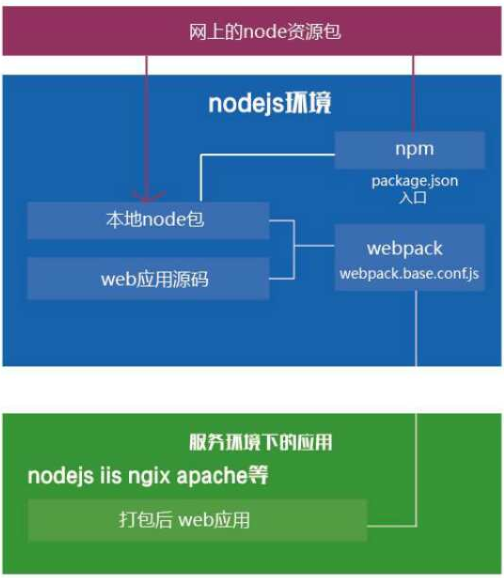
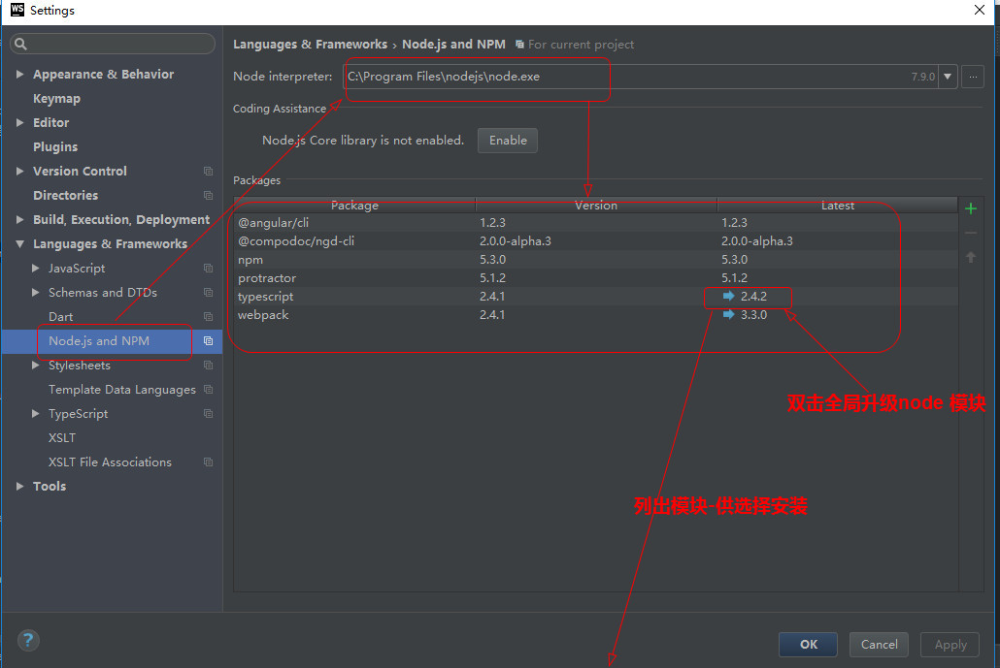
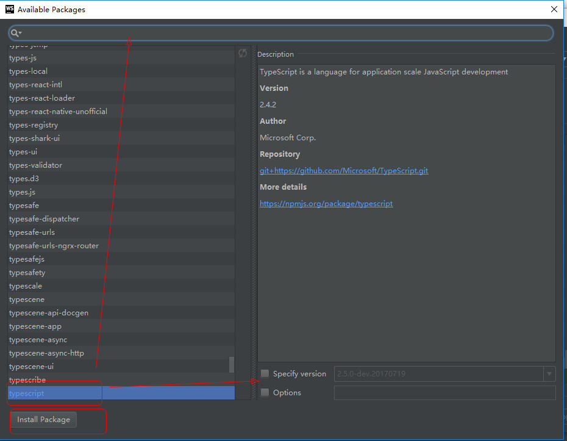
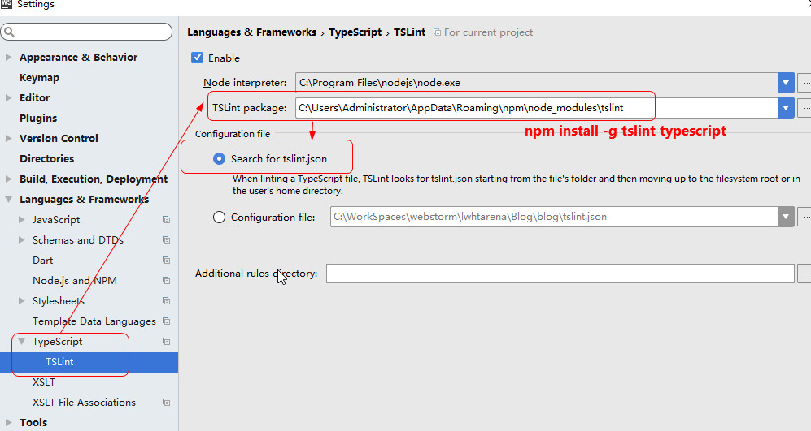
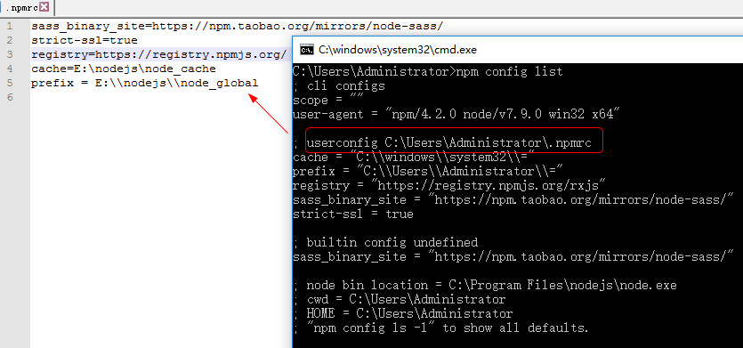

# Node 使用


## npm 常用命令

`npm config list` 查看node的配置环境(`npm config list/ls`)

`npm config list/ls -l` 更详细

`npm install xxx` 安装模块

`npm install xxx -g`  将模块安装到全局环境中

`npm i/install --save xxx` 安装包信息将加入到`dependencies`（生产阶段的依赖）

`npm i/install --save-dev xxx` 安装包信息将加入到`devDependencies`（开发阶段的依赖），所以开发阶段一般使用它

`npm i --save-exact xxx` 精确安装包版本，`package.json`里的依赖包的value是具体的版本号，前边没有符号

`npm root` 查看包的安装路径,及`node_modules`的路径

`npm ls` 查看安装的模块及依赖

`npm ls -g` 查看全局安装的模块及依赖

`npm uninstall xxx  (-g)` 卸载模块

`npm cache clean` (旧版)清理缓存 或 （新版） `npm cache verify`

`sudo npm install npm -g` //更新npm

`npm config get prefix`   找到npm目录的路径

`sudo chown -R ` whoami ` <directory>` 修复权限到 npm's 默认目录

`npm view modulename` 查看模块的package.json信息

`npm view moudleName dependencies` 查看包的依赖关系

`npm view moduleName repository.url` 查看包的源文件地址

`npm view moduleName engines` 查看包所依赖的node版本

`npm outdated` 检测显示过时的包

`npm update` 更新包

`npm uninstall` 卸载包

`npm init` 在项目中引导创建一个package.json文件

向`npm run xx`传入参数必须用`--`表明

`$npm run xx & npm run xxx`同时并行执行

`$npm run xx && npm run xxx` 前一个执行成功，再执行最后一个

```
{
    "scripts":{
        "build:dev":"xxxx",//npm run build:dev
        "build:prod":"xxx"//npm run build:prod
    }
}
```
**npm 模块更新**
```
npm install -g npm-check-updates

安装完成后，ncu，对比查看更新的模块,执行ncu -u更新即可
ncu -u
```

### 如何用 npm 同时执行两条监听命令？

需要安装 concurrently:<font color=red size=3> `npm install -g concurrently`</font>

如下图修改package.json的 scripts:
```json
"command1":"hahaha",
"command2":"xixixi",
"test":"concurrently \"npm run command1\" \"npm run command2\""
```


**常用脚本示例**
```js
// 删除目录
"clean": "rimraf dist/*",

// 本地搭建一个 HTTP 服务
"serve": "http-server -p 9090 dist/",

// 打开浏览器
"open:dev": "opener http://localhost:9090",

// 实时刷新
 "livereload": "live-reload --port 9091 dist/",

// 构建 HTML 文件
"build:html": "jade index.jade > dist/index.html",

// 只要 CSS 文件有变动，就重新执行构建
"watch:css": "watch 'npm run build:css' assets/styles/",

// 只要 HTML 文件有变动，就重新执行构建
"watch:html": "watch 'npm run build:html' assets/html",

// 部署到 Amazon S3
"deploy:prod": "s3-cli sync ./dist/ s3://example-com/prod-site/",

// 构建 favicon
"build:favicon": "node scripts/favicon.js",
```

linux环境下：

`mkdir ~/npm-global` 创建目录

`npm config set prefix '~/npm-global'` 设置切换node的路径

`export PATH=~/npm-global/bin:$PATH` 设置环境变量，然后 `source ~/.profile`

`npm outdated` 查看过期包

`npm outdated -g --depth=0` 查找过期包

`npm  update --dev --save -d` 查看过期包 
  - `--dev` 同时更新devDependencies内容
  - `--save` 把更新情况保存到package.json
  - `-d` 查看细节

`npm update -g` 更新所有全局包

`npm uninstall lodash(<package>)`从 `node_modules` 目录删除包命令 `npm uninstall <package>`

`npm uninstall --save lodash`去除`package.json`依赖关系, 需要`save`标签

`npm uninstall -g <package>` 卸载全局包命令


`npm install -g <package>` 安装全局包命令,如果有访问权限错误, 使用sudo修改权限: `sudo npm install -g <package>`





## windows系统下npm 全局安装路径问题

安装了nodejs之后，npm的路径默认一直都是appData,表示很讨厌，于是尝试修改在安装目录（D盘空间很大啊）

安装目录：D:\program files\nodejs

一、在nodejs下新建两个文件夹(和node_modules同级)：

　　node_global和node_cache

二、cmd设置(引号必须要)：

　　npm config set cache "D:\nodejs\node_cache"

　　npm config set prefix "D:\nodejs\node_global"

三、更改配置文件.npmrc(D:\program files\nodejs\node_modules\npm)：

　　prefix=D:\program files\nodejs\node_global
　　cache=D:\program files\nodejs\node_cache
	
	cache = "E:\\nodejs\\node_cache"
	prefix = "E:\\nodejs\\node_global"

如果不用的话，可以删除对应的key 即可：`npm config delete prefix(key)`

若出现类似这样的错误：`Error: node-sass@4.5.0 postinstall: 'node scripts/build.js'`

在.npmc添加`sass_binary_site=https://npm.taobao.org/mirrors/node-sass/`

[参考：https://segmentfault.com/a/1190000005921721](https://segmentfault.com/a/1190000005921721)

代理的问题，电脑通过代理上网，所以设置下代理就可以了，运行命令

`npm config set proxy=http://web-proxy.oa.com:8080`

Webstorm 配置tslint,先安装tslint:`npm install -g tslint typescript`




四、测试是否成功：

　　

　　成功啦~~~安装路径是自己刚刚设置的那个

ps:目前没有设置环境变量，以后有需要再补吧


## tsconfig.json
有几个重要的属性需要解释一下：

	target：编译之后生成的JavaScript文件需要遵循的标准。有三个候选项：es3、es5、es2015。

	noImplicitAny：为false时，如果编译器无法根据变量的使用来判断类型时，将用any类型代替。为true时，将进行强类型检查，无法推断类型时，提示错误。

	module：遵循的JavaScript模块规范。主要的候选项有：commonjs、AMD和es2015。为了后面与node.js保持一致，我们这里选用commonjs。

	removeComments：编译生成的JavaScript文件是否移除注释。

	sourceMap：编译时是否生成对应的source map文件。这个文件主要用于前端调试。当前端js文件被压缩引用后，出错时可借助同名的source map文件查找源文件中错误位置。

	outDir：编译输出JavaScript文件存放的文件夹。
	
	include、exclude：编译时需要包含/剔除的文件夹。



# 推荐使用[淘宝的镜像cnpm](https://npm.taobao.org/)

> 这里特别推荐使用淘宝的镜像cnpm，记得以后把npm的指令改为cnpm就可以了

`npm install -g cnpm --registry=https://registry.npm.taobao.org`

> 安装全局Angular cli

`cnpm install -g @angular/cli`

若出现类似这样的<font color=red>`Installing packages for tooling via npm`</font>.这里如果你选这了淘宝的cnmp镜像，应该最好在安装完全局Angular cli后设置一下，保证正常下载工具

`ng set --global packageManager = cnpm`

# Yarn安装与使用

使用npm安装
```
npm i yarn -g

-i：install 

-g：全局安装（global）,使用 -g 或 --global
//输入yarn -version 可以看到版本号，说明安装成功了。我们就可以在项目中像使用npm一样使用yarn了。

npm安装的则通过命令npm uninstall yarn -g卸载
```

**常用命令：**
- `yarn / yarn install` 等同于 `npm install` 批量安装依赖
- `yarn add xxx` 等同于 `npm install xxx —save` 安装指定包到指定位置
- `remove xxx` 等同于 `npm uninstall xxx —save` 卸载指定包
- `yarn add xxx —dev` 等同于 `npm install xxx —save-dev`
- `yarn upgrade` 等同于 `npm update` 升级全部包
- `yarn global add xxx` 等同于 `npm install xxx -g` 全局安装指定包

**npm和yarn的区别，我们该如何选择?**

Yarn是什么？

“Yarn是由Facebook、Google、Exponent 和 Tilde 联合推出了一个新的 JS 包管理工具 ，正如官方文档中写的，**Yarn 是为了弥补 npm 的一些缺陷而出现的**。”这句话让我想起了使用npm时的坑了：

- npm install的时候巨慢。特别是新的项目拉下来要等半天，删除node_modules，重新install的时候依旧如此。
- 同一个项目，安装的时候无法保持一致性。由于package.json文件中版本号的特点，下面三个版本号在安装的时候代表不同的含义。

```
"5.0.3",
"~5.0.3",
"^5.0.3"

“5.0.3”表示安装指定的5.0.3版本，“～5.0.3”表示安装5.0.X中最新的版本，“^5.0.3”表示安装5.X.X中最新的版本。这就麻烦了，常常会出现同一个项目，有的同事是OK的，有的同事会由于安装的版本不一致出现bug。
```

- 安装的时候，包会在同一时间下载和安装，中途某个时候，一个包抛出了一个错误，但是npm会继续下载和安装包。因为npm会把所有的日志输出到终端，有关错误包的错误信息就会在一大堆npm打印的警告中丢失掉，并且你甚至永远不会注意到实际发生的错误。

## Yarn的优点

- **速度快。** 速度快主要来自以下两个方面：
	- 1、并行安装： 无论 npm 还是 Yarn 在执行包的安装时，都会执行一系列任务。npm 是按照队列执行每个 package，也就是说必须要等到当前 package 安装完成之后，才能继续后面的安装。而 Yarn 是同步执行所有任务，提高了性能。
	- 2、离线模式： 如果之前已经安装过一个软件包，用Yarn再次安装时之间从缓存中获取，就不用像npm那样再从网络下载了。

- **安装版本统一：** 为了防止拉取到不同的版本，Yarn 有一个锁定文件 (lock file) 记录了被确切安装上的模块的版本号。每次只要新增了一个模块，Yarn 就会创建（或更新）yarn.lock 这个文件。这么做就保证了，每一次拉取同一个项目依赖时，使用的都是一样的模块版本。npm 其实也有办法实现处处使用相同版本的 packages，但需要开发者执行 npm shrinkwrap 命令。这个命令将会生成一个锁定文件，在执行 npm install 的时候，该锁定文件会先被读取，和 Yarn 读取 yarn.lock 文件一个道理。npm 和 Yarn 两者的不同之处在于，Yarn 默认会生成这样的锁定文件，而 npm 要通过 shrinkwrap 命令生成 npm-shrinkwrap.json 文件，只有当这个文件存在的时候，packages 版本信息才会被记录和更新。
- **更简洁的输出：** npm 的输出信息比较冗长。在执行 `npm install <package> `的时候，命令行里会不断地打印出所有被安装上的依赖。相比之下，Yarn 简洁太多：默认情况下，结合了 emoji直观且直接地打印出必要的信息，也提供了一些命令供开发者查询额外的安装信息。
- **多注册来源处理：** 所有的依赖包，不管他被不同的库间接关联引用多少次，安装这个包时，只会从一个注册来源去装，要么是 npm 要么是 bower, 防止出现混乱不一致。
- **更好的语义化：** yarn改变了一些npm命令的名称，比如 `yarn add/remove`，感觉上比 npm 原本的 install/uninstall 要更清晰。

[详见](https://yarn.bootcss.com/docs/migrating-from-npm/)