# shiro 笔记


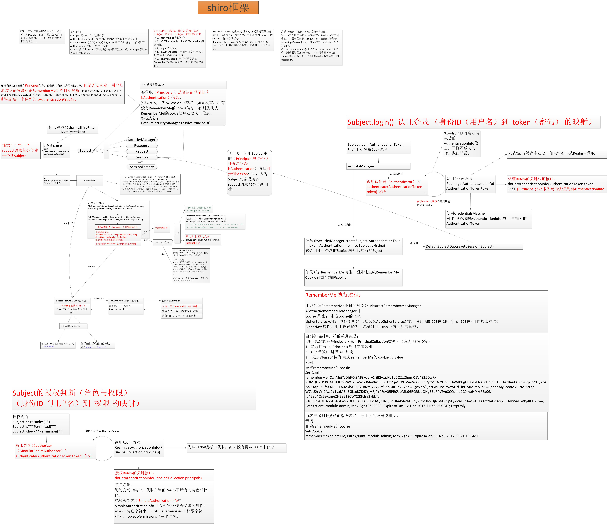

<font size=4 face="黑体" color=#FF768C >概念名词：</font>

**Principal:**  身份ID(常为用户名)

**Authenticatiion:** 认证 (使用用户名和密码进行的手动认证)

**RemenberMe：** 记住我(浏览器的cookie用于自动登录，自动认证)

**Authorization：** 授权 (角色与权限)

**Realm：** 域(由Principal获取服务器的认证数据，或由Principal获取服务端的授权数据)

<font size=4 face="黑体" color=#FF768C >Shiro认证和授权，最终都是调用底层Subject的API,Subject的关键API是</font>

1) has**Roles 判断角色

2) is\**Permiited, check\**Permission 判断权限

3) login 登录认证

4) isAuthenticated() 当前环境是用户已用用户名和密码登录认证的

5) isRemembered() 当前环境是通过RememberMe自动登录的，没有通过客户认证

`JsessionId Cookie` 的生命周期同为浏览器进程的生命周期，当浏览器退出时销毁。用于映射到tomcat中的session。保存会话状态。

`RememberMe Cookie` 浏览器退出后，还保存在本地，下次打开浏览器是还存在。生命时长由用户设定。

```
关于Tomcat中的Session会话的一些知识：

Session的空闲生命周期是30分钟。Session是按需创建的，当需要的时候( resquest.getSession() 等价于 request.getSession(true) ) 才创建的。不然是不会去创建的。

调用session.invalidate()来清空session。但是不会去清空浏览器端的JSessionID。下次浏览器再次访问tomcat时会重新分配一个新的JSessionID覆盖掉旧的JSessionID.
```


<font size=3 face="黑体" color=#0B915B >
</font>

**Apache Shiro 是 Java 的一个安全（权限）框架。**

**Shiro 可以完成：认证、授权、加密、会话管理、与Web 集成、缓存。**

<font size=3 face="黑体" color=#FF768C >记住一点，Shiro 不会去维护用户、维护权限；这些需要我们自己去设计 / 提供；然后通过相应的接口注入给 Shiro 即可。</font>

> <font size=3 face="黑体" color=#FF768C >那到底可以用 Apache Shiro 做哪些事情？</font>

* 验证用户来核实他们的身份 
* 对用户执行访问控制，如： 
 * 判断用户是否被分配了一个确定的安全角色 
 * 判断用户是否被允许做某事 
* <font color=#FF495F face="黑体" size=4>在任何环境下使用 Session API，即使没有 Web 或 EJB 容器。</font> 
* 在身份验证，访问控制期间或在会话的生命周期，对事件作出反应。 
* 聚集一个或多个用户安全数据的数据源，并作为一个单一的复合用户“视图”。 
* <font color=#FF495F face="黑体" size=4>启用单点登录（SSO）功能。 </font>
* 为没有关联到登录的用户启用"Remember Me"服务 		
	
  **...**		
  以及更多——全部集成到紧密结合的易于使用的 API 中。 

[官网http://shiro.apache.org/](http://shiro.apache.org/)


【功能简介：】


> - <font color=red face="黑体" size=4>Authentication</font>：<font color=blue face="黑体" size=4>身份认证/登录</font>，验证用户是不是拥有相应的身份；
> - <font color=red face="黑体" size=4>Authorization</font>：<font color=blue face="黑体" size=4>授权，即权限验证</font>，验证某个已认证的用户是否拥有某个权限；即判断用户是否能进行什么操作，如：验证某个用户是否拥有某个角色。或者细粒度的验证某个用户对某个资源是否具有某个权限；
> - <font color=red face="黑体" size=4>Session Manager</font>：<font color=blue face="黑体" size=4>会话管理</font>，即用户登录后就是一次会话，在没有退出之前，它的所有信息都在会话中；<font color=blue face="黑体" size=4>会话可以是普通 JavaSE 环境，也可以是 Web 环境的；</font>
> - <font color=red face="黑体" size=4>Cryptography</font>：<font color=blue face="黑体" size=4>加密</font>，保护数据的安全性，如密码加密存储到数据库，而不是明文存储；
> - <font color=red face="黑体" size=4>Web Support</font>：<font color=blue face="黑体" size=4>Web 支持</font>，可以非常容易的集成到Web 环境；
> - <font color=red face="黑体" size=4>Caching</font>：<font color=blue face="黑体" size=4>缓存</font>，比如用户登录后，其用户信息、拥有的角色/权限不必每次去查，这样可以提高效率；
> - Concurrency：Shiro 支持<font color=blue face="黑体" size=4>多线程应用的并发验证</font>，即如在一个线程中开启另一个线程，能
> - 把权限自动传播过去；
> - **Testing**：提供<font color=blue face="黑体" size=4>测试</font>支持；
> - <font color=red face="黑体" size=4>Run As</font>：<font color=blue face="黑体" size=4>允许一个用户假装为另一个用户（如果他们允许）的身份进行访问</font>；
> - <font color=red face="黑体" size=4>Remember Me</font>：<font color=blue face="黑体" size=4>记住我</font>，这个是非常常见的功能，即一次登录后，下次再来的话不用登录了

【备注：】

&emsp;&emsp; 易混淆的两个英文单词：AuthorizationInfo 和 AuthenticationInfo。

&emsp;&emsp; Shiro对于安全用户的界定：和大多数操作系统一样。用户具有角色和权限两种最基本的属性。例如，我的Windows登陆名称是learnhow，它的角色是administrator，而administrator具有所有系统权限。这样learnhow自然就拥有了所有系统权限。那么其他人需要登录我的电脑怎么办，我可以开放一个guest角色，任何无法提供正确用户名与密码的未知用户都可以通过guest来登录，而系统对于guest角色开放的权限极其有限。

&emsp;&emsp;同理，Shiro对用户的约束也采用了这样的方式。AuthenticationInfo代表了用户的角色信息集合，AuthorizationInfo代表了角色的权限信息集合。如此一来，当设计人员对项目中的某一个url路径设置了只允许某个角色或具有某种权限才可以访问的控制约束的时候，Shiro就可以通过以上两个对象来判断。说到这里，大家可能还比较困惑。


<font color=#FF495F face="黑体" size=4>最常见的 principals 和 credentials 组合就是用户名 / 密码了</font>

【shiro架构： 从shiro外部来看】

从外部来看Shiro ，即从应用程序角度的来观察如何使用 Shiro 完成工作


> - <font color=red face="黑体" size=4>Subject</font>：<font color=blue face="黑体" size=4>应用代码直接交互的对象是 Subject</font>，也就是说 Shiro 的对外API 核心就是 Subject。<font color=blue face="黑体" size=4>Subject 代表了当前“用户”</font>， 这个用户不一定是一个具体的人，与当前应用交互的任何东西都是 Subject，如网络爬虫，机器人等；<font color=blue face="黑体" size=4>与 Subject 的所有交互都会委托给 SecurityManager；Subject 其实是一个门面，SecurityManager 才是实际的执行者</font>；
> - <font color=red face="黑体" size=4>SecurityManager</font>：安全管理器；即<font color=blue face="黑体" size=4>所有与安全有关的操作都会与SecurityManager 交互</font>；且其管理着所有 Subject；可以看出它是<font color=blue face="黑体" size=4>Shiro的核心</font>，它<font color=blue face="黑体" size=4>负责与 Shiro 的其他组件进行交互</font>，它相当于 SpringMVC 中DispatcherServlet 的角色
> - <font color=red face="黑体" size=4>Realm</font>：Shiro <font color=blue face="黑体" size=4>从 Realm 获取安全数据（如用户、角色、权限）</font>，就是说SecurityManager 要验证用户身份，那么它需要从 Realm 获取相应的用户进行比较以确定用户身份是否合法；也需要从 Realm 得到用户相应的角色/权限进行验证用户是否能进行操作；可以把 Realm 看成 DataSource

【shiro架构： Shiro内部来看】


> - **Subject**：任何可以与应用交互的“用户”；
> - **SecurityManager** ：相当于SpringMVC 中的 DispatcherServlet；是 Shiro 的心脏；所有具体的交互都通过 SecurityManager 进行控制；它管理着所有 Subject、且负责进行认证、授权、会话及缓存的管理。
> - <font color=red face="黑体" size=4>Authenticator</font>：<font color=blue face="黑体" size=4>负责 Subject 认证</font>，是一个扩展点，可以自定义实现；可以使用认证策略（Authentication Strategy），即什么情况下算用户认证通过了；
> - <font color=red face="黑体" size=4>Authorizer</font>：<font color=blue face="黑体" size=4>授权器</font>、即访问控制器，用来决定主体是否有权限进行相应的操作；即控制着用户能访问应用中的哪些功能；
> - **Realm**：可以有 1 个或多个 Realm，可以认为是安全实体数据源，即用于获取安全实体的；可以是JDBC 实现，也可以是内存实现等等；由用户提供；所以一般在应用中都需要实现自己的 Realm；
> - <font color=red face="黑体" size=4>SessionManager</font>：<font color=blue face="黑体" size=4>管理 Session 生命周期的组件</font>；而 Shiro 并不仅仅可以用在 Web环境，也可以用在如普通的 JavaSE 环境
> - <font color=red face="黑体" size=4>CacheManager</font>：<font color=blue face="黑体" size=4>缓存控制器</font>，来管理如用户、角色、权限等的缓存的；因为这些数据基本上很少改变，放到缓存中后可以提高访问的性能
> - <font color=red face="黑体" size=4>Cryptography</font>：<font color=blue face="黑体" size=4>密码模块</font>，Shiro 提高了一些常见的加密组件用于如密码加密/解密。


## 集成spring

## 集成web
> 通过`shiroFilter`来拦截控制Url

&nbsp;&nbsp; ShiroFilter 类似于如 `Strut2/SpringMVC` 这种 web 框架的前端控制器，是安全控制的入口点，其负责读取配置（如ini 配置文件），然后判断URL 是否需要登录/权限等工作

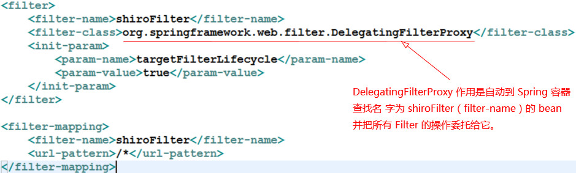

> <font face="黑体" color=#FF768C>Shiro在Web环境下集成Spring的大致工作流程</font>

>> 1) Shiro提供了对Web环境的支持，其通过一个 ShiroFilter 入口来拦截需要安全控制的URL，然后进行相应的控制。

+ ①配置的 ShiroFilter 实现类为：org.springframework.web.filter.DelegatingFilterProxy 。
+ ②这是一个 Servlet Filter 的代理对象，它在IOC容器中去找实现了Filter接口的bean。
+ ③它可以通过一个初始化参数"targetBeanName"来找到bean，也可以通过`<filter-name>`找到bean。
 
>> 2) ShiroFilter 类似于SpringMvc中的前端控制器，是安全控制的入口点，其负责读取配置文件(如ini配置文件)，然后判断该URL是否需要登陆/授权等工作。

+ ①在SpringIOC容器中配置`org.apache.shiro.spring.web.ShiroFilterFactoryBean`的时候，该bean的名称必须要和 ShiroFilter 的`<filter-name>`一致。否则在服务加载的时候会报错。因为Shiro会在IOC容器中查找和`<filter-name>`对应的filter bean。

>> 3) 受保护的URL如何进行配置

- ①[urls]部分的配置，其格式为：url=拦截器[参数],拦截器[参数]。
- ②如果当前请求的url匹配[urls]部分的某个url模式，将会执行器配置的拦截器。
- ③anon（anonymous）拦截器表示可以匿名访问。
- ④authc（authencation）拦截器标识需要身份认证通过后才能访问。
- ⑤logout（logout）拦截器表示登出/退出登录，它会清空shiro缓存信息。
- ⑥url模式使用 Ant 风格模式：
    [1]?匹配一个字符；
    [2]*匹配零个或多个字符；
    [3]**匹配路径中的零个或多个路径；
 
>> 4) 认证/授权基本步骤

- ①获取当前的 Subject，调用SecurityUtils.getSubject();
- ②判断当前用户是否已经认证，调用 Subject 的 isAuthenticated();
- ③或没有被认证，则把用户名和密码封装为 UserNamePassworkToken 对象
    [1]客户端提交的表单数据。
    [2]提交数据到SpringMVC的 handler 上。
    [3]获取用户名和密码。
- ④执行登录，调用 Subject 的 login(AuthencationToken);
- ⑤自定义Realm 方法，从数据库中获用户安全数据，返回给Shiro
    [1]实际上需要继承 org.apache.shiro.realm.AuthencatingRealm 类（仅仅实现认证，org.apache.shiro.realm.AuthorizingRealm 可以用来认证和授权）。
    [2]实现 doGetAuthenticationInfo(AuthenticationToken) 方法。
- ⑥最后由Shiro完成密码的比对。


<font size=4 face="黑体" color=red>【附件：shiro中默认的过滤器】</font>

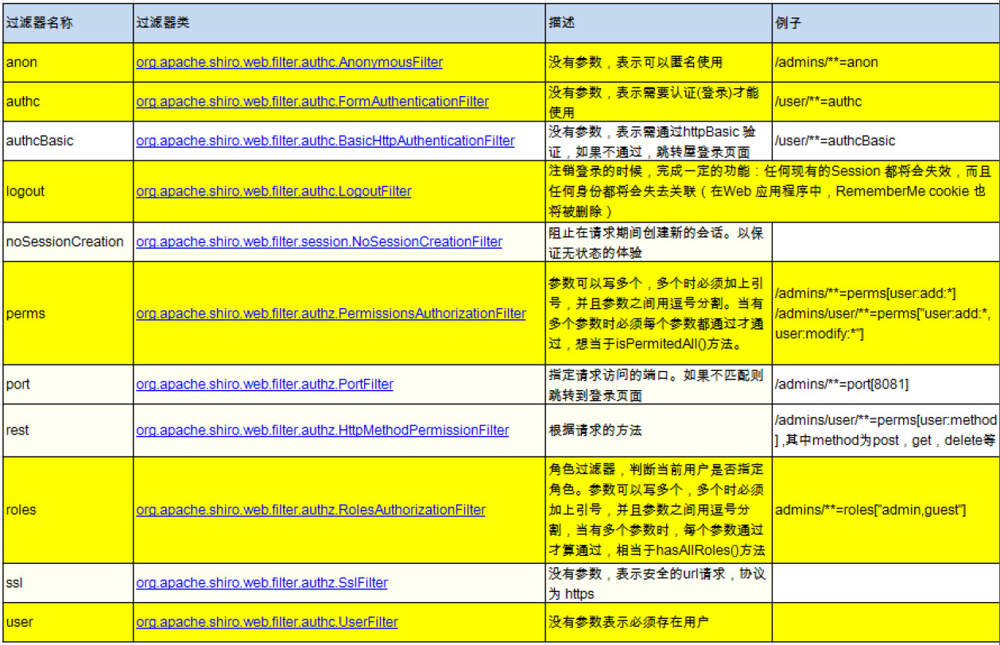


## URL匹配模式

> - url模式使用Ant风格模式
> -  Ant 路径通配符支持 `?、*、**`，注意通配符匹配不 包括目录分隔符“/”： 
>  *  **?：匹配一个字符**
>         如 /admin? 将匹配 /admin1，但不 匹配 /admin 或 /admin/； 
>  *  ***：匹配零个或多个字符串**
>         如 /admin* 将匹配 /admin、 /admin123，但不匹配 /admin/1；
>  * ****：匹配路径中的零个或多个路径**
>         如 /admin/** 将匹 配 /admin/a 或 /admin/a/b

## URL匹配顺序

> - <font size=3 face="黑体" color=blue>URL 权限采取第一次匹配优先的方式</font>
>      即从头开始 使用第一个匹配的 url 模式对应的拦截器链。 
> - 如： 
>   * /bb/**=filter1 
>   * /bb/aa=filter2 
>   * /**=filter3 
>   * 如果请求的url是“/bb/aa”，因为按照声明顺序进行匹配，那么将使用 filter1 进行拦截。

## shiro 授权方式

>  Shiro 支持三种方式的授权： 

- 编程式：通过写if/else 授权代码块完成 

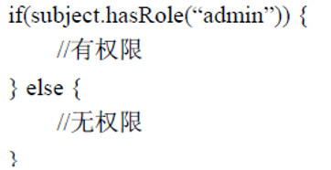

- 注解式：通过在执行的Java方法上放置相应的注解完成，没有权限将抛出相 应的异常 

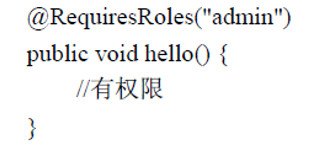

- JSP/GSP 标签：在JSP/GSP 页面通过相应的标签完成

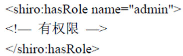

========================================>>>>>>>>>>>>>>>>>>>
> 1. 授权需要继承<font size=4 face="宋体" color=red> `AuthorizingRealm`</font> 类, 并实现其 <font size=4 face="宋体" color=red>doGetAuthorizationInfo</font> 方法
> 
> 2. `AuthorizingRealm` 类继承自<font size=4 face="宋体" color=red>AuthenticatingRealm</font>, 但没有实现 AuthenticatingRealm 中的 
<font size=4 face="宋体" color=red>doGetAuthenticationInfo</font>, 所以认证和授权只需要继承 <font size=4 face="宋体" color=red>`AuthorizingRealm`</font>就可以了. 同时实现他的两个抽象方法.

【总结：】
&emsp;&emsp;授权：继承`AuthorizingRealm`,实现doGetAuthorizationInfo；
&emsp;&emsp;认证和授权：继承`AuthorizingRealm`,同时实现两个抽象方法。

### 为什么使用 MD5 盐值加密: 
> <font size=3 color=red >如何做到:</font>    
> 1). 在 doGetAuthenticationInfo 方法返回值创建 SimpleAuthenticationInfo 对象的时候, 需要使用
SimpleAuthenticationInfo(principal, credentials, credentialsSalt, realmName) 构造器      
> 2). 使用 ByteSource.Util.bytes() 来计算盐值. 
> 3). 盐值需要唯一: 一般使用随机字符串或 user id    
> 4). 使用 new SimpleHash(hashAlgorithmName, credentials, salt, hashIterations); 来计算盐值加密后的密码的值. 

##### 如何把一个字符串加密为 MD5 
> 替换当前 Realm 的 credentialsMatcher 属性. 直接使用 HashedCredentialsMatcher 对象, 并设置加密算法即可. 

##### 密码的比对:
> 通过 AuthenticatingRealm 的 credentialsMatcher 属性来进行的密码的比对!

#### 流程
1. 获取当前的 Subject. 调用 SecurityUtils.getSubject();		
2. 测试当前的用户是否已经被认证. 即是否已经登录. 调用 Subject 的 isAuthenticated()		 
3. 若没有被认证, 则把用户名和密码封装为 UsernamePasswordToken 对象	

   1). 创建一个表单页面     
   2). 把请求提交到 SpringMVC 的 Handler       
   3). 获取用户名和密码.        

4. 执行登录: 调用 Subject 的 login(AuthenticationToken) 方法. 		
5. 自定义 Realm 的方法, 从数据库中获取对应的记录, 返回给 Shiro.	

   1). 实际上需要继承 org.apache.shiro.realm.AuthenticatingRealm 类   
   2). 实现 doGetAuthenticationInfo(AuthenticationToken) 方法.	

6. 由 shiro 完成对密码的比对. 		

<font color=red size=5>总结：</font>

<font size=3 face="黑体" color=#FF768C >1) 注意：在realm中存储授权和认证的逻辑。</font>

<font size=3 face="黑体" color=#FF768C >2) 使用`.ini`文件来获取信息的，包括用户信息，角色信息，权限信息等。</font><font size=3 face="黑体" color=#449D44 >进入系统时，都是从`.ini`文件这读取进入的。实际中除非这个系统特别特别简单，否则一般都不是这样干的，这些信息都是需要在数据库中进行维护的，所以就需要用到自定义realm了。(大型项目推荐使用数据库来维护)
</font>

<font size=3 face="黑体" color=#FF768C >3) 整到Spring后，自定义的realm、securityManager等交给Spring去管理。</font>

**shiro 流程**

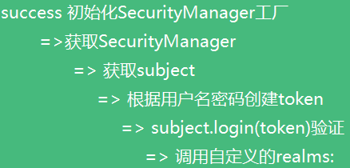

**实现AuthorizingRealm自定义的realms验证流程：**


 
**subject.login(token)调用时发生了什么？**

从源码可以得知Subject是接口,实现该接口的类有:

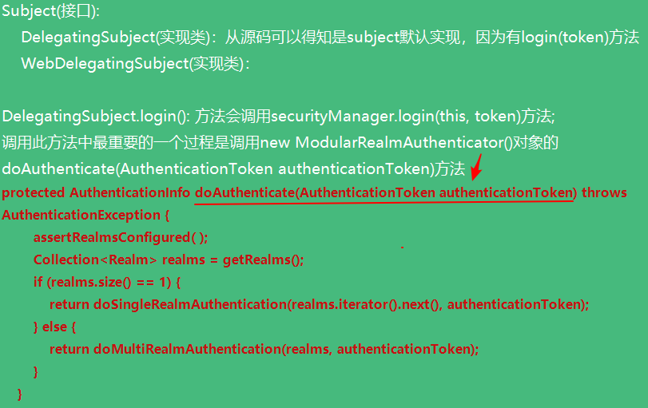

从以上方法可以看出  getRealms()获取我们自定义配置的realms,然后依次调用
 
 
> 1、主要接口

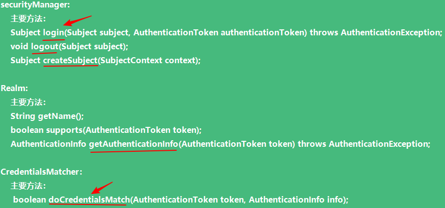
         
> 2、主要接口的实现关系

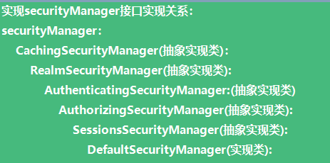

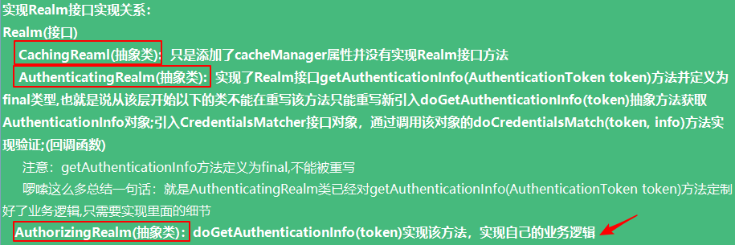

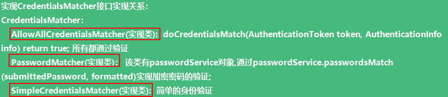

     
 
> 关联的一些重要接口

 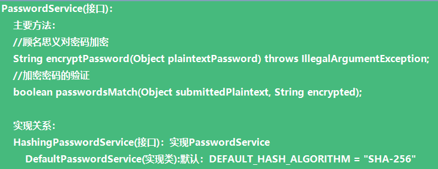


**总结：**

实现自定义realm：

1)实现Realm接口,实现简单的自定义realm 

2)继承AuthorizingRealm(抽象类),实现doGetAuthenticationInfo(token)方法,可以给自定义的realm设置CredentialsMatcher接口对象,如果不设置默认为SimpleCredentialsMatcher;如果想对密码加密需要设置PasswordMatcher接口，该对象默认使用DefaultPasswordService(PasswordService接口对象)；也可以自定义PasswordService接口对象并传入,这样就可以按照自己的需求去加密密码，以及验证密码；
      
继承AuthorizingRealm(抽象类)可以实现从缓存中取AuthenticationInfo：

由源代码可以得知AuthenticatingRealm有以下属性：

 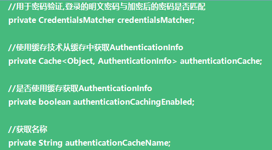
 
==========主要方法介绍============
```
public final AuthenticationInfo getAuthenticationInfo(AuthenticationToken token) throws AuthenticationException {
    //从缓存中获取AuthenticationInfo
    AuthenticationInfo info = getCachedAuthenticationInfo(token);
    if (info == null) {
        //otherwise not cached, perform the lookup:
        info = doGetAuthenticationInfo(token);
        log.debug("Looked up AuthenticationInfo [{}] from doGetAuthenticationInfo", info);
        if (token != null && info != null) {
            cacheAuthenticationInfoIfPossible(token, info);
        }
    } else {
        log.debug("Using cached authentication info [{}] to perform credentials matching.", info);
    }
    if (info != null) {
    //认证密码是否正确
        assertCredentialsMatch(token, info);
    } else {
        log.debug("No AuthenticationInfo found for submitted AuthenticationToken [{}].  Returning null.", token);
    }
    return info;
} 
```


