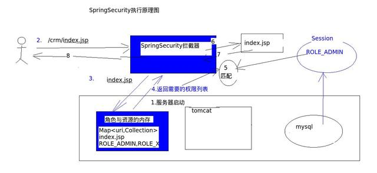

# Spring Security

Apache shiro VS Spring Security

`shiro`比较简单直观，而`Spring Security`则比较复杂难懂，但是Spring Security能更好的和Spirng框架整合，而且对Oauth、OpenID也有支持,Shiro则需要自己手动实现，而且Spring Security的acl细粒度更高，但数据访问完全可以在Controller层控制

spring security是一帮设计模式专家搞出来的东西，光看他们怎么玩设计模式了。

**Spring Secuirty** 也是在Filter中进行权限验证。因此使用Java代码配置Spring Security主要是这两个步骤：

1、创建过滤器

2、注册过滤器。

**执行流程**

