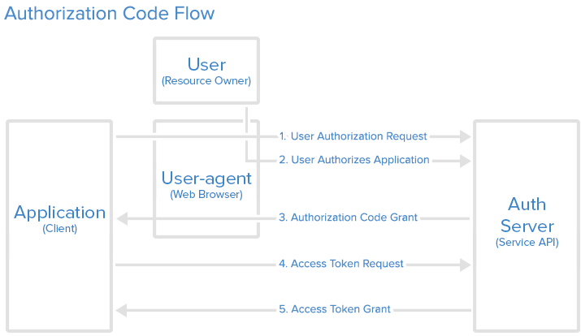
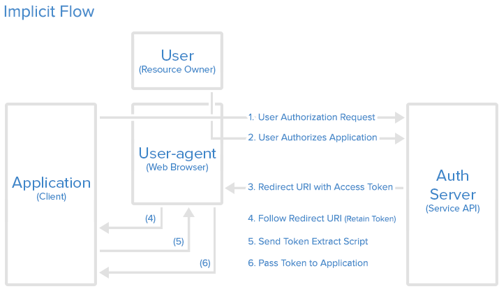
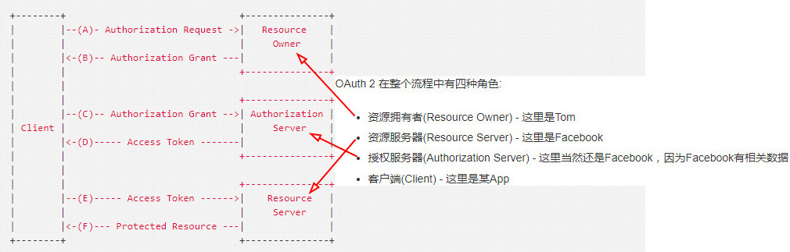

# oauth2 教程

导读： JWT & OAuth2

明白一点，这两个根本没有可比性，是两个不同的东西。

+ JWT 是一种认证协议

JWT提供了一种用于发布接入令牌（Access Token),并对发布的签名接入令牌进行验证的方法。 令牌（Token）本身包含了一系列声明，应用程序可以根据这些声明限制用户对资源的访问。

+ OAuth2 是一种授权框架

另一方面，OAuth2是一种授权框架，提供了一套详细的授权机制（指导）。用户或应用可以通过公开的或私有的设置，授权第三方应用访问特定资源。

一句话总结：

- **OAuth** 是一个授权的开放网络标准，最终目的是取得token（令牌）
- **Token令牌**，视为用户登录成功，通行的唯一令牌
- **JWT** 是生成token的轻巧规范，可以结合一起使用

JWT使用场景 

无状态的分布式API

JWT的主要优势在于使用无状态、可扩展的方式处理应用中的用户会话。服务端可以通过内嵌的声明信息，很容易地获取用户的会话信息，而不需要去访问用户或会话的数据库。在一个分布式的面向服务的框架中，这一点非常有用。

但是，如果系统中需要使用黑名单实现长期有效的token刷新机制，这种无状态的优势就不明显了。

**优势**

+ 快速开发
+ 不需要cookie
+ JSON在移动端的广泛应用
+ 不依赖于社交登录
+ 相对简单的概念理解

**限制**

+ Token有长度限制
+ Token不能撤销
+ 需要token有失效时间限制(exp)

OAuth2使用场景

有必要使用的两个场景：

外包认证服务器

如果不介意API的使用依赖于外部的第三方认证提供者，你可以简单地把认证工作留给认证服务商去做。 
也就是常见的，去认证服务商（比如facebook）那里注册你的应用，然后设置需要访问的用户信息，比如电子邮箱、姓名等。当用户访问站点的注册页面时，会看到连接到第三方提供商的入口。用户点击以后被重定向到对应的认证服务商网站，获得用户的授权后就可以访问到需要的信息，然后重定向回来。

**优势**

- 快速开发
- 实施代码量小
- 维护工作减少

大型企业解决方案

如果设计的API要被不同的App使用，并且每个App使用的方式也不一样，使用OAuth2是个不错的选择。

考虑到工作量，可能需要单独的团队，针对各种应用开发完善、灵活的安全策略。当然需要的工作量也比较大！

**优势**

+ 灵活的实现方式
+ 可以和JWT同时使用
+ 可针对不同应用扩展

## oauth2根据使用场景不同，分成了4种模式

- 授权码模式（authorization code）
   
  **授权码模式（authorization code）是功能最完整、流程最严密的授权模式。** 它的特点就是通过客户端的后台服务器，与"服务提供商"的认证服务器进行互动。
 

	  它的步骤如下：
	
	   1、用户访问客户端，后者将前者导向认证服务器。
	   2、用户选择是否给予客户端授权。
	   3、假设用户给予授权，认证服务器将用户导向客户端事先指定的"重定向URI"（redirection URI），同时附上一个授权码。
	   4、客户端收到授权码，附上早先的"重定向URI"，向认证服务器申请令牌。这一步是在客户端的后台的服务器上完成的，对用户不可见。
	   5、认证服务器核对了授权码和重定向URI，确认无误后，向客户端发送访问令牌（access token）和更新令牌（refresh token）。

- 简化模式（implicit）

  

- 密码模式（resource owner password credentials）

- 客户端模式（client credentials）

[ps:] 接口对接中常使用的密码模式（以下简称password模式）和客户端模式（以下简称client模式）。授权码模式使用到了回调地址，是最为复杂的方式，通常网站中经常出现的微博，qq第三方登录，都会采用这个形式。简化模式不常用。

**OAuth的授权码模式和简化模式的区别：**

1) 授权码模式适用有公网ip服务器的网站，服务器通过授权码拿到token，不在客户端（如url）显示

2) 简化模式会将token直接在url地址显示出来

3) 推荐使用授权码模式

## OAuth2.0总体处理流程

- Step1：在各平台申请接入，获取appid和apikey；
- Step2：开发应用，并设置协作者帐号进行测试联调；
- Step3：放置第三方登录按钮（创建可访问链接）；
- Step4：通过用户登录验证和授权，获取Access Token；
- Step5：通过Access Token获取用户的OpenID；
- Step6：调用OpenAPI，来请求访问或修改用户授权的资源。

## 什么是 Authentication（认证）和 Authorization（鉴权）？
 简而言之，认证关心你是谁，鉴权关心你能干什么。

** 授权(鉴权)模式有哪些？
+ 自动授权模式
+ 手动授权模式

## 各种类型的令牌(tokens)

+ JSON Web Token(JWT) 
+ SAML assertions

## 云安全？

那么在云服务中对用户访问资源的控制，我们一般都怎么做呢？然我举一些大家似乎都用过的但又不是很完美的例子。

我们可以设置边界服务器或者带认证功能的反向代理服务器，假设所有访问请求都发给它。通过认证后，转发给内部相应的服务器。一般在`Spring MVC Security`开发中几乎都会这样做的。但这并不安全，最重要的是，一旦是有人从内部攻击，你的数据毫无安全性。

其他方式:我们为所有服务建立统一的权限数据库，并在每次请求前对用户进行鉴权，听起来某些方面的确有点愚蠢，但实际上这确实是一个可行的安全方案。

更好的方式: 用户通过授权服务来实现鉴权，把用户访问Session映射成一个`Token`。所有远程访问资源服务器相关的API必须提供`Token`。然后资源服务器访问授权服务来识别`Token`，得知`Token`属于哪个用户，并了解通过这个Token可以访问什么资源。

这听起来是个不错的方案，对不？但是如何保证Token的安全传输？如何区分是用户访问还是其他服务访问？这肯定是我们关心的问题。

所以上述种种问题让我们选择使用OAuth 2，其实访问Facebook/Google的敏感数据和访问我们自己后端受保护数据没什么区别，并且他们已经使用这样的解决方案很多年，我们只要遵循这些方法就好了。

## oauth2 是如何工作的？

描述下这样一个场景，“某App希望获得Tom在Facebook上相关的数据”

OAuth 2 在整个流程中有四种角色:

- 资源拥有者(Resource Owner) - 这里是Tom
- 资源服务器(Resource Server) - 这里是Facebook
- 授权服务器(Authorization Server) - 这里当然还是Facebook，因为Facebook有相关数据
- 客户端(Client) - 这里是某App

小贴士：资源服务器跟授权服务器 可以是存放同一台，也可以分开独立存放一台 

当Tom试图登录Facebook，某App将他重定向到Facebook的授权服务器，当Tom登录成功，并且许可自己的Email和个人信息被某App获取。这两个资源被定义成一个Scope（权限范围），一旦准许，某App的开发者就可以申请访问权限范围中定义的这两个资源。

Oauth2.0基本流程：

原理很简单，用户访问App，App访问Authorization Server请求权限，

Authorization Server得到用户同意后，返回token，

App通过这个token向Authorization Server索要数据，

App只能从Authorization Server这个中介获取服务器数据，而无法直接访问Resource Server。
## 为什么是JWT?

## Auth2的Java实现

[Spring Security for OAuth](https://docs.spring.io/spring-security/oauth/)

[Apache Oltu](http://oltu.apache.org/)

[Apis Authorization Server (v2-31)](https://github.com/OAuth-Apis/apis)

[Restlet Framework (draft 30)](https://www.restlet.com/)

[Apache CXF](http://cxf.apache.org/)

